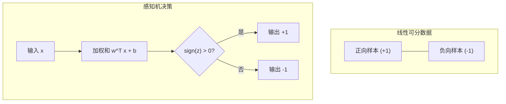
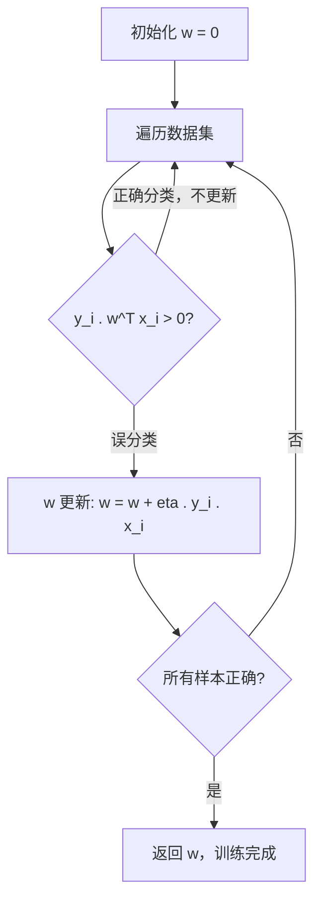

---
tags:
  - MachineLearning
  - DeepLearning
  - Algorithm
  - LinearAlgebra
  - 概念性
title: Perceptron and PLA
created: 2026-06-01
---

# Perceptron and PLA

> [!abstract] Overview
> 感知机 (Perceptron) 是最早的人工神经网络模型，由 Frank Rosenblatt 于 1958 年提出。它虽然简单——仅能处理线性可分的二分类问题——但奠定了现代神经网络的基础：权重学习、阈值决策、分层组合等核心思想全部源自感知机。本文从历史出发，建立感知机的数学模型，详述 PLA (Perceptron Learning Algorithm)，并探讨其局限与现代意义。

Related: [[Neural Network]] | [[Hyperplane]] | [[Vector and Matrix]]

---

## 1. 历史

### Rosenblatt 与感知机 (1958)

Frank Rosenblatt 在 1957 年提出了感知机，并在 1958 年发表了标志性论文 *The Perceptron: A Probabilistic Model for Information Storage and Organization in the Brain*。感知机的关键创新：

- **可学习的权重**：通过错误驱动 (error-driven) 的更新规则自动调整权重
- **在线学习**：每看到一个错误样本就更新一次，无需批处理
- **收敛保证**：对于线性可分数据，PLA 保证在有限步内收敛

### Minsky 与 XOR 问题 (1969)

Marvin Minsky 和 Seymour Papert 在 1969 年的著作 *Perceptrons* 中指出了单层感知机的根本局限：

$$\text{XOR 不是线性可分的}$$

| 输入 $(x_1, x_2)$ | 输出 XOR$(x_1, x_2)$ |
|----|----|
| $(0, 0)$ | $0$ |
| $(0, 1)$ | $1$ |
| $(1, 0)$ | $1$ |
| $(1, 1)$ | $0$ |

```mermaid
quadrantChart
    title XOR 问题的线性不可分性
    x-axis "x1"
    y-axis "x2"
    quadrant-1 "类 0"
    quadrant-2 "类 1"
    quadrant-3 "类 1"
    quadrant-4 "类 0"
    point-1: (0, 0)
    point-2: (1, 0)
    point-3: (0, 1)
    point-4: (1, 1)
```

> [!note] XOR 问题的影响
> Minsky 的批评导致了第一次 AI 寒冬——研究经费骤减，神经网络研究沉寂了近 20 年。直到 1980 年代反向传播的提出和多层感知机 (MLP) 的成功，神经网络才重新崛起。讽刺的是，Minsky 批评的正是"单层"感知机，而多层网络完全可以解决 XOR 问题。

---

## 2. 感知机模型

### 数学模型

感知机是一个**二分类线性分类器**。对于输入向量 $x \in \mathbb{R}^d$，它计算加权和并通过符号函数输出类别：

$$\hat{y} = \text{sign}(w^T x + b)$$

其中：
- $w \in \mathbb{R}^d$ 是权重向量 (weight vector)
- $b \in \mathbb{R}$ 是偏置 (bias)
- $\text{sign}(z) = \begin{cases} +1 & \text{if } z > 0 \\ -1 & \text{if } z \leq 0 \end{cases}$

值域为 $\mathcal{Y} = \{-1, +1\}$。

为简化表示，通常将偏置合并到权重向量中：令 $\tilde{x} = [1, x_1, \ldots, x_d]^T$，$\tilde{w} = [b, w_1, \ldots, w_d]^T$，则：

$$\hat{y} = \text{sign}(\tilde{w}^T \tilde{x})$$

### 决策边界 (Decision Boundary)

感知机的决策边界是一个**超平面** (hyperplane)，关于超平面的几何定义见 [[Hyperplane]]：

$$w^T x + b = 0$$

在二维空间中，这就是一条直线。超平面将空间分为两个半空间，分别对应 $y = +1$ 和 $y = -1$。

> [!tip] 几何直观
> 权重向量 $w$ 垂直于决策超平面，指向 $y = +1$ 的半空间方向。偏置 $b$ 控制超平面到原点的距离。训练感知机的过程就是寻找一个能够分离两类样本的超平面。



---

## 3. 感知机学习算法 (PLA)

### 算法流程

PLA 是一个在线、错误驱动的学习算法：

1. 初始化权重向量 $w_0 = 0$（或小的随机值）
2. 对每个训练样本 $(x_i, y_i)$：
3. 计算预测 $\hat{y}_i = \text{sign}(w_t^T x_i)$
4. 如果 $\hat{y}_i \neq y_i$（误分类），则更新：
   $$w_{t+1} = w_t + \eta \cdot y_i \cdot x_i$$
5. 重复步骤 2-4 直到所有样本正确分类（或达到最大迭代次数）

其中 $\eta > 0$ 是学习率 (learning rate)，通常取 $1$。

### 权重更新规则

误分类发生时，$\text{sign}(w_t^T x_i) \neq y_i$，意味着 $w_t^T x_i$ 和 $y_i$ 异号。更新规则的方向：

$$w_{t+1} = w_t + y_i x_i$$

- 若 $y_i = +1$ 但被误分为 $-1$，则 $w_t^T x_i < 0$（夹角大于 90 度）。加上 $x_i$ 后，新的权重更靠近 $x_i$ 的方向
- 若 $y_i = -1$ 但被误分为 $+1$，则 $w_t^T x_i > 0$（夹角小于 90 度）。减去 $x_i$ 后，新的权重远离 $x_i$ 的方向



### 收敛定理 (Convergence Theorem)

**定理** (Novikoff, 1962)：如果训练数据是线性可分的 (linearly separable)，则存在一个超平面 $w^*$ 使得对所有样本 $y_i (w^*)^T x_i > 0$。PLA 在有限步内收敛，误分类步数的上界为：

$$k_{\max} \leq \left(\frac{R}{\rho}\right)^2$$

其中：
- $R = \max_i \|x_i\|$ 是样本的最大范数
- $\rho = \min_i y_i (w^*)^T x_i / \|w^*\|$ 是间隔 (margin)——超平面到最近样本的距离

> [!note] 收敛定理的意义
> PLA 保证在线性可分数据上必然收敛。这意味着当数据确实可以被一个超平面完美分开时，算法不会无限循环——它一定会找到一个可用的解。这个理论保证是早期机器学习最重要的成果之一。

---

## 4. 线性可分性

### 定义

一个二分类数据集 $\mathcal{D} = \{(x_i, y_i)\}_{i=1}^N$ 是线性可分的，当且仅当存在一个超平面 $w^T x + b = 0$ 使得：

$$y_i (w^T x_i + b) > 0, \quad \forall i = 1, \ldots, N$$

即所有 $+1$ 类样本在超平面一侧，所有 $-1$ 类样本在另一侧。

### 线性可分 vs 不可分

| 特性 | 线性可分 | 线性不可分 |
|------|---------|-----------|
| 决策边界 | 一个超平面即可 | 需要非线性边界 |
| PLA 收敛 | 保证收敛 | 不保证收敛（会不断震荡）|
| 示例 | AND、OR 函数 | XOR 函数 |
| 解决方案 | 感知机即可 | 多层网络或核方法 |

---

## 5. 感知机 vs 逻辑回归

感知机和逻辑回归都是线性分类器，但存在关键差异：

| 维度 | 感知机 | 逻辑回归 |
|------|-------|---------|
| 输出 | $\text{sign}(w^T x)$，硬分类 $\{-1, +1\}$ | $\sigma(w^T x)$，概率输出 $(0, 1)$ |
| 损失函数 | 误分类计数 (非凸) | 交叉熵 (凸) |
| 更新时机 | 仅误分类时更新 | 每个样本都更新 |
| 更新公式 | $w \leftarrow w + \eta \cdot y_i \cdot x_i$ | $w \leftarrow w + \eta \cdot (y_i - \sigma(w^T x_i)) \cdot x_i$ |
| 解的唯一性 | 不唯一（依赖数据顺序） | 唯一（凸优化） |
| 置信度 | 无 | 有（概率校准） |

> [!warning] 关键区别
> 感知机的更新仅受误分类样本驱动，因此不同运行次序可能得到不同的分离超平面。逻辑回归的更新受所有样本驱动（包括正确分类但置信度低的），因此解唯一——它寻找的是"最大概率"的超平面而非"任意分离"的超平面。

---

## 6. Case Study: CTM 中的线性层

CTM (Cross-Time Mamba) 虽然核心架构是 SSM，但线性投影层是每个模块的基础构建块：

| CTM 组件 | 线性投影操作 | 与感知机的联系 |
|---------|------------|--------------|
| **Input Projection** | $z = x @ W_{\text{in}}$ | 特征维度映射，感知机 $w^T x$ 概念的直接扩展 |
| **SSM 扫描** | $B_t = x_t @ W_B$ | 输入选择投影，本质是多组独立的线性层 |
| **卷积后投影** | $\Delta = \text{Softplus}(x_{\text{conv}} @ W_{\Delta})$ | 线性变换 + 非线性激活的组合 |
| **输出投影** | $\hat{y} = y @ W_{\text{out}}$ | 模型输出到预测目标的线性映射 |
| **门控分支** | $z_2$ 中的线性层生成门控信号 | 加权和 + 非线性（SiLU）|

> [!tip] 从感知机到现代深度学习
> 感知机 $(w^T x + b)$ 是现代深度学习中**线性层**的原型。无论一个模型多么复杂——Transformer、Mamba、ResNet——其最基础的运算单元就是感知机引入的加权和。区别仅在于现代网络叠加了非线性激活函数、正则化、归一化和多层堆叠。感知机的核心洞察——通过学习权重来逼近函数——至今未变。

---

## 7. Key Takeaways

### 感知机的贡献

- 首次提出了**可学习的权重**概念，开启了机器学习时代
- **错误驱动更新**：简单但有效的在线学习范式
- **收敛定理**：首个有理论保证的学习算法
- 线性层作为基本构建块的模式延续至今

### 感知机的局限

- 仅能处理线性可分问题，无法解决 XOR 等非线性问题
- 输出为硬分类，缺乏概率解释和置信度
- 不保证唯一解（不同数据顺序得到不同超平面）
- 对噪声敏感——一个误分类样本也能大幅改变决策边界

### 进一步阅读

- [[Neural Network]] — 从感知机到多层网络的演进
- [[Hyperplane]] — 决策边界的几何基础
- Rosenblatt, *The Perceptron* (1958) — 感知机的原始论文
- Minsky & Papert, *Perceptrons* (1969) — 对感知机局限性的经典分析
