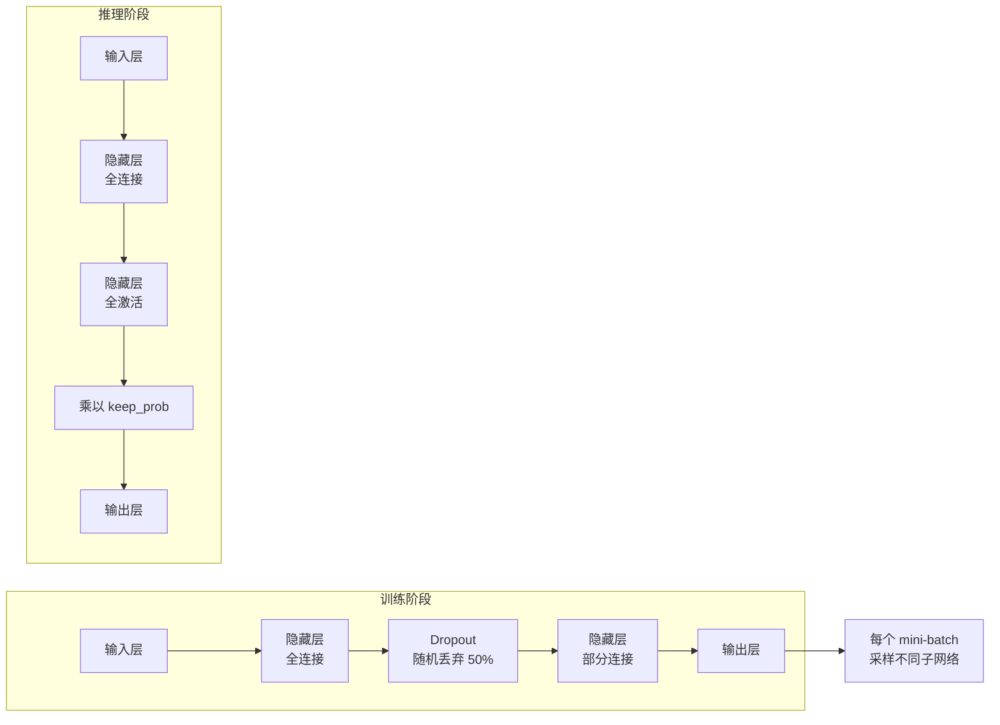
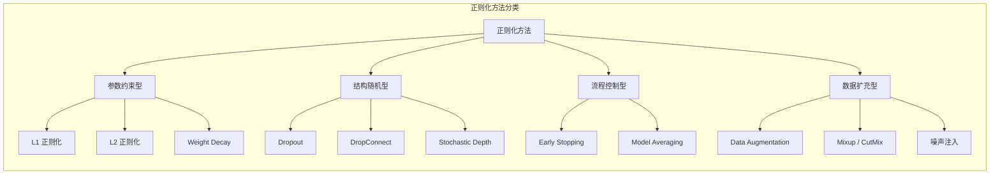

---
tags:
  - MachineLearning
  - DeepLearning
  - Regularization
  - TrainingTechnique
  - Math
  - 方法性
title: Regularization
created: 2026-06-01
---

# Regularization — L1/L2, Weight Decay, Dropout, Early Stopping, and Data Augmentation

> [!abstract] Overview
> 过拟合是深度学习中最常见的问题——模型在训练集上表现完美，在测试集上一塌糊涂。正则化是所有防止过拟合技术的统称，从参数约束（L1/L2、权重衰减）、结构随机化（Dropout）、训练流程控制（早停）到数据层面的扩充（数据增强），每种方法都有其适用场景和理论依据。本文以 CTM 的 Dropout + Selective L2 + 早停组合作为实践案例。

Related: [[Gradient Descent and Optimizers]] | [[Backpropagation]] | [[CTM - Training System]] | [[CTM - Loss Functions]]

---

## 1. Regularization — Core Principles

### What & Why

过拟合的本质：模型不仅学到了数据中的真实模式，还学到了噪声。正则化的目标是**在不显著增加偏差的前提下降低方差**——让模型泛化更好，而不是在训练集上做得更完美。

$$\underbrace{\mathbb{E}[(y - \hat{f}(x))^2]}_{\text{Test Error}} = \underbrace{\text{Bias}[\hat{f}(x)]^2}_{\text{偏差}} + \underbrace{\text{Var}[\hat{f}(x)]}_{\text{方差}} + \underbrace{\sigma^2}_{\text{不可约误差}}$$

正则化就是在偏差-方差权衡（Bias-Variance Tradeoff）中向右移动：接受一点额外的偏差（更约束的参数），换取更低的方差（更稳定的预测）。

> [!note] 正则化的另一层理解
> 从贝叶斯角度看，正则化等价于在参数上施加先验分布。L1 正则等价于 Laplace 先验（鼓励稀疏），L2 正则等价于 Gaussian 先验（鼓励小权重）。这解释了为什么正则化可以被理解为"告诉模型什么类型的参数更可能"。

### Mathematical / Theoretical Foundation

**L1 正则化（Lasso）**：在损失函数中加入参数的绝对值之和。

$$\mathcal{L}_{\text{reg}} = \mathcal{L}_{\text{data}} + \lambda \sum_i |w_i|$$

L1 的关键特性——诱导稀疏性。因为 L1 的惩罚函数在原点不可微，优化过程倾向于将不加区分的特征权重推到恰好为零。这实现了隐式的特征选择。

数学解释：L1 正则的梯度为 $\lambda \cdot \text{sign}(w_i)$，无论 $w_i$ 多小，其梯度幅度恒为 $\lambda$。这迫使小权重不断减少直到归零。

**L2 正则化（Ridge）**：在损失函数中加入参数的平方和。

$$\mathcal{L}_{\text{reg}} = \mathcal{L}_{\text{data}} + \frac{\lambda}{2} \sum_i w_i^2$$

L2 使所有权重趋近于零但很少完全到零。它的梯度为 $\lambda \cdot w_i$——权重越大，惩罚越大。这限制了权重不会变得过大，防止模型在某些特征上过度依赖。

在 SGD 中，L2 正则与权重衰减完全等价：

$$w_{t+1} = w_t - \eta(\nabla \mathcal{L}_{\text{data}} + \lambda w_t) = (1 - \eta\lambda)w_t - \eta\nabla \mathcal{L}_{\text{data}}$$

这表示每一步更新前权重先乘以 $(1 - \eta\lambda)$——这就是"权重衰减"名称的来源。

> [!warning] L2 正则与权重衰减在 Adam 中不等价
> ^weight-decay-vs-l2
> 在 Adam 中，L2 正则的效果会被自适应步长扭曲。因为 Adam 为每个参数维护独立学习率，L2 梯度的 $\lambda w$ 项会和学习率交互，导致对大权重的惩罚结果不可预测。AdamW（Decoupled Weight Decay）将权重衰减独立于梯度步骤执行：$w_{t+1} = w_t - \eta(\lambda w_t + \text{AdamUpdate})$，恢复了一致的正则化效果。详见 [[Gradient Descent and Optimizers]]。

**L1 vs L2 对比**：

| 维度 | L1 (Lasso) | L2 (Ridge) |
|------|-----------|-----------|
| **惩罚形式** | $\sum\|w_i\|$ | $\sum w_i^2$ |
| **结果** | 稀疏解（特征选择） | 稠密小权重 |
| **梯度** | $\lambda \cdot \text{sign}(w_i)$ | $\lambda \cdot w_i$ |
| **行为** | 小权重被推到 0 | 大权重被大幅缩减 |
| **适用** | 高维稀疏特征 | 密集特征、通用正则 |
| **贝叶斯视角** | Laplace 先验 | Gaussian 先验 |

**Dropout**：训练时随机"丢弃"一定比例神经元，强制网络学到冗余表示。

$$\tilde{y} = y \odot \text{Bernoulli}(p), \quad p = 1 - \text{drop\_rate}$$

关键洞察：Dropout 不只是"在训练集上加噪声"。从集成学习（Ensemble）的视角看，Dropout 可以被理解为在 $2^n$ 种不同的子网络上训练并共享权重——推理时使用全部神经元（乘以 $1-p$ 缩放），等效于对这些子网络输出做几何平均。



**早停 (Early Stopping)**：最简单的正则化——在验证集指标开始恶化时停止训练。

早停的正则化机制：梯度下降的"自由度"随训练进程增加。早期迭代对应低秩解（简单函数），后期迭代允许模型学习更复杂的函数。提前停止相当于限制了模型的"有效容量"，防止其学到过于复杂的决策边界。

$$\text{stop if } \max_{i > t-p} \text{val\_metric}_i \leq \text{best\_metric}$$

patience $p$ 的取值决定"容忍度"：太小训练不足（欠拟合），太大失去正则效果（过拟合）。

> [!note] 早停和 L2 正则的理论联系
> 对于线性模型，早停和 L2 正则可以达到相同的解路径。在梯度下降的早期停止，等价于在 L2 正则化下找到不同 $\lambda$ 对应的解——两者都限制了模型的有效范数。这建立了"早停在所有深度模型中都有正则化效果"的理论基础。

**数据增强 (Data Augmentation)**：不修改模型本身，而是从数据层面增加多样性。

常见的数据增强策略：

| 领域 | 增强方法 | 效果 |
|------|---------|------|
| **图像** | 随机裁剪、翻转、旋转、色彩抖动 | 增加平移/旋转不变性 |
| **文本** | 回译、同义词替换、Mask 填充 | 增加语义鲁棒性 |
| **时序** | 时间扭曲、噪声注入、缩放 | 增加时域不变性 |
| **音频** | 加噪、音高偏移、时间拉伸 | 增加噪声鲁棒性 |

> [!tip] 数据增强的本质
> 数据增强通过先验知识生成有效的新样本，本质上是将人类的理解（图像翻转后类别不变）编码为训练过程的一部分。好的数据增强应该保持标签不变，否则会引入噪声标签的问题。

**各正则化方法对比**：

| 方法 | 机制 | 优势 | 劣势 |
|------|------|------|------|
| **L1** | 参数稀疏化 | 特征选择、可解释 | 可能导致欠拟合，非光滑优化 |
| **L2 / Weight Decay** | 参数幅度约束 | 简单有效、广泛适用 | 不产生稀疏解 |
| **Dropout** | 子网络集成 | 防止单元间共适性 | 训练变慢（约 2x） |
| **Early Stopping** | 限制训练时间 | 几乎无额外成本 | 需要验证集，patience 调优 |
| **Data Augmentation** | 增加样本多样性 | 最"免费"的正则化 | 需领域知识设计 |
| **Batch Normalization** | 层间分布稳定化 | 加速训练 + 弱正则化 | 小 batch 效果差 |
| **Label Smoothing** | 软化标签分布 | 防止过置信 | 降低训练集精度 |



### Key Design Dimensions & Tradeoffs

正则化不是越多越好。多种方法组合使用时，需要考虑它们的交互：

| 组合 | 效果 | 注意 |
|-----|------|------|
| **L2 + Dropout** | 强正则化组合，大部分场景适用 | Dropout 率不宜过高（>0.5），否则和 L2 一起可能导致严重欠拟合 |
| **L1 + L2 (Elastic Net)** | 同时获得稀疏性和群组效应 | 需要调节两个超参数 |
| **Dropout + BN** | 可能相互削弱 | BN 在训练时的随机性与 Dropout 存在争议性的交互 |
| **早停 + 其他正则** | 早停几乎总是有益的补充 | 确保验证集不用于其他调参决策 |
| **数据增强 + Dropout** | 互补性强 | 数据增强从输入层面，Dropout 从模型层面 |

**Selective Regularization（选择性正则化）**：对不同层或不同参数应用不同的正则化强度。

某些层（如分类头）天然更容易过拟合（参数少、直接面对任务特有特征），而预训练层/浅层特征更通用需要更少的惩罚。CTM 中使用的 Selective L2 就是这种策略的体现。

$$\mathcal{L}_{\text{reg}} = \sum_{l} \lambda_l \cdot \|W^{(l)}\|^2$$

其中 $\lambda_l$ 逐层设置：浅层（通用特征）小 $\lambda$，深层（任务特化）大 $\lambda$。

---

## 2. Case Study: CTM Context

### How CTM Applies These Principles

CTM 使用了多层正则化策略来应对金融时序的低信噪比（SNR < 1）挑战：

| 正则化技术 | CTM 的具体应用 | 作用 |
|-----------|---------------|------|
| **Dropout** | `dropout` 和 `loop_dropout` 参数 | 防止 SSM 路径上的共适性；深层迭代使用递减 dropout |
| **Selective L2** | 不同层组独立 weight decay 控制 | 特征提取层低惩罚，预测头高惩罚 |
| **Early Stopping** | 验证 Sharpe 停滞 patience=10 | 防止窗口维度过拟合 |
| **循环迭代** | RecurrentCTM 的共享权重 | 参数共享本身的正则化效应 |
| **Walk-Forward** | 各窗口独立早停 | 时序交叉验证的正则化 |

**CTM 的 Dropout 体系**：

```python
# 主模型 Dropout
model = RecurrentCTM(
    d_model=128,
    dropout=0.1,          # 主 Dropout 率
    loop_dropout=0.3,     # 循环迭代中的 Dropout
    num_iterations=4
)
```

CTM 在循环迭代中使用渐进式 Dropout：

$$p_{\text{current}} = p_{\text{loop}} \times \left(1.0 - 0.7 \times \frac{i-1}{n-2}\right)$$

首次迭代使用完整的 $p_{\text{loop}}$，后续迭代逐步衰减到 $0.3 \times p_{\text{loop}}$。这是因为深层迭代的表示经过多次精炼，已经更加稳定，需要更少的随机性。

**Selective L2 的实施**：不同的参数组使用不同的 weight decay。

```python
# 概念示例：CTM 的选择性权重衰减
feature_params = model.feature_extractor.parameters()  # 低衰减
head_params = model.prediction_head.parameters()       # 正常衰减

optimizer = AdamW([
    {'params': feature_params, 'weight_decay': 0.001},
    {'params': head_params,   'weight_decay': 0.01},
], lr=learning_rate)
```

这种方法确保特征提取器（学习通用时序表示）不会受到过强约束，保持足够容量；而预测头（直接产生交易信号的层）受到更强正则化，防止在低信噪比环境下过拟合。

> [!warning] 金融时序中数据增强的特殊挑战
> CTM 未使用传统的数据增强，原因如下：对收益率序列做时间扭曲（伸缩时间轴）会破坏金融时序的时间依赖结构（波动率聚集效应、自相关结构）。线性变换（如缩放）则改变了收益率的分布——而 Sharpe Loss 假设收益率的均值和方差是训练目标的一部分。金融时序的数据增强仍是一个开放问题。

**正则化的综合效果**：

```
无正则化：
    训练 Loss: 0.02    验证 Sharpe: 0.3   →  过拟合
有 Dropout:
    训练 Loss: 0.05    验证 Sharpe: 0.6   →  泛化改善
+ Selective L2:
    训练 Loss: 0.06    验证 Sharpe: 0.7   →  进一步改善
+ Early Stopping:
    训练 Loss: 0.05    验证 Sharpe: 0.8   →  完全发挥
```

> [!note] 正则化不是降性能
> 正则化在降低训练集性能的同时，通常提升验证/测试集性能。CTM 场景下"训练 Loss 从 0.02 升到 0.05"不是坏事——它意味着模型不再死记硬背金融市场中的噪声。

---

## 3. Key Takeaways

### When to Use Which Regularization

| 场景 | 推荐策略 | 说明 |
|------|---------|------|
| **高维稀疏数据** | L1 或 Elastic Net | 自动特征选择，减少无关特征影响 |
| **密集数据、通用任务** | L2 / Weight Decay | 通用、稳定、几乎无副作用 |
| **深度网络** | Dropout + Weight Decay | 标准组合，多层堆叠时使用渐进式 Dropout |
| **小样本数据** | Early Stopping + 增强的 Dropout | 用更强的正则化补偿数据不足 |
| **两阶段训练** | Selective Regularization | 预训练层轻正则，微调头重正则 |
| **图像/语音任务** | Data Augmentation + Weight Decay | 利用领域先验增加有效数据 |

### Common Pitfalls to Avoid

- **Dropout 率过高**：> 0.5 的 Dropout 在深网络中可能切断关键信息流，导致欠拟合。经验值：0.1-0.3 对大多数架构足够
- **Weight Decay 过大导致欠拟合**：当一直观察不到过拟合时（训练和验证 loss 都高），检查 weight decay 是否过强
- **早停和 LR 调度冲突**：早停触发前 LR 已被调度器降到接近零，模型可能已经停止学习。确保 LR 衰减节奏和早停 patience 协调
- **数据增强破坏标签不变性**：对时序数据加噪可能改变标签（例如未来的价格取决于今日的噪声特征），需要验证增强后的样本标签是否仍然有效
- **正则化叠加过量**：三项及以上强正则化组合可能过度约束模型。建议从单一正则化开始，观察验证指标的变化后再添加其他
- **分布外（OOD）问题无法通过正则化解决**：如果验证集和测试集分布不同，正则化也无法挽救。需要检查数据分布或使用域适应（Domain Adaptation）

### Related Concepts & Further Reading

- [[Gradient Descent and Optimizers]] — AdamW 解耦权重衰减的讨论
- [[Backpropagation]] — Dropout 在反向传播中的特殊行为
- [[CTM - Training System]] — CTM 训练管线中对正则化的完整整合
- [[CTM - Loss Functions]] — 复合损失中的 L2 正则分量
- [[CTM - Walk-Forward Validation]] — 与早停配合的时序验证策略
- Srivastava et al., *Dropout: A Simple Way to Prevent Neural Networks from Overfitting* (JMLR 2014)
- Goodfellow, Bengio & Courville, *Deep Learning* — Chapter 7: Regularization — 最系统的正则化教科书章节
- Gal & Ghahramani, *Dropout as a Bayesian Approximation* (ICML 2016) — Dropout 的贝叶斯视角
