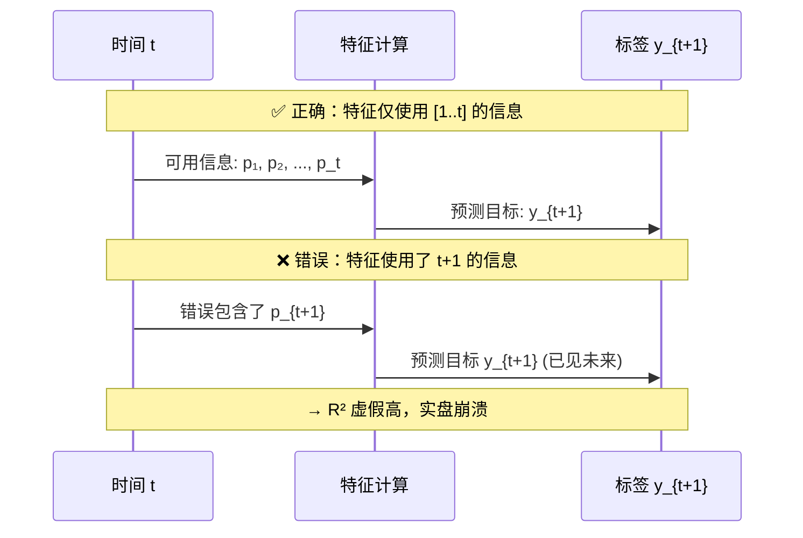
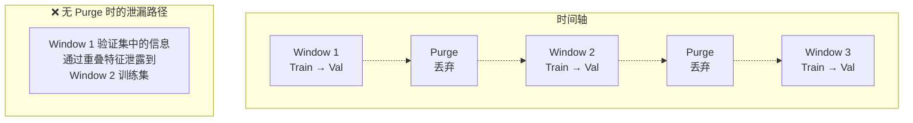

---
tags:
  - MachineLearning
  - TimeSeries
  - Stationarity
  - Autocorrelation
  - FeatureEngineering
  - 机器学习/时间序列
  - 概念性
title: Time Series Fundamentals
created: 2026-06-01
---

# Time Series Fundamentals — Structure, Decomposition, and the Leakage Trap

> [!abstract] Overview
> 时间序列数据与独立同分布（i.i.d.）假设的根本冲突使其成为机器学习中最特殊的任务类型。数据点之间的时间依赖关系既是信号（可预测的模式），也是陷阱（信息泄露）。理解平稳性、自相关、滞后结构以及因果性约束，是在时间序列上构建可靠模型的前提。本文以金融时间序列为主要语境，梳理核心概念和工程实践。

Related: [[CTM - Feature Engineering]] | [[CTM - Walk-Forward Validation]] | [[CTM - StockModel Architecture]] | [[CTM - MultiAsset Model]] | [[CTM - Loss Functions]]

---

## 1. Time Series — Core Principles

### Stationarity（平稳性）

平稳性是大多数时间序列建模方法的**基础假设**。一个**严格平稳（strictly stationary）** 的序列意味着其联合分布在时间平移下不变。在实际中我们通常要求 **弱平稳（weak stationarity / covariance stationarity）**：

- $\mathbb{E}[y_t] = \mu$（均值常数）
- $\text{Var}(y_t) = \sigma^2 < \infty$（方差常数）
- $\text{Cov}(y_t, y_{t-k}) = \gamma_k$（自协方差仅依赖于滞后 $k$）

**ADF 检验（Augmented Dickey-Fuller Test）** 是判断平稳性的标准统计检验：

$$H_0: \text{序列存在单位根（非平稳）}$$
$$H_1: \text{序列平稳}$$

若 p-value < 0.05，拒绝 $H_0$，可认为序列平稳。

```mermaid
flowchart TD
    TS[原始时间序列] --> ADF[ADF 检验]
    ADF --> p{p-value < 0.05?}
    p -->|是| Stationary[序列平稳 ✓<br/>可直接建模]
    p -->|否| Diff[进行差分]
    Diff --> ADF2[ADF 检验]
    ADF2 --> p2{p-value < 0.05?}
    p2 -->|是| DStationary[一阶差分后平稳<br/>→ I(1) 序列]
    p2 -->|否| Diff2[再次差分<br/>→ I(2) 或更高阶]
```

> [!warning] 平稳性 ≠ 正态性
> 平稳只约束均值和协方差稳定，不一定要求高斯分布。金融收益率通常是平稳的但有厚尾（fat tail）。

### Autocorrelation（自相关）

**ACF（Autocorrelation Function）** 衡量 $y_t$ 与其滞后值 $y_{t-k}$ 之间的相关性：

$$\rho_k = \frac{\text{Cov}(y_t, y_{t-k})}{\text{Var}(y_t)}$$

**PACF（Partial Autocorrelation Function）** 衡量剔除中间滞后影响后的条件相关性。

- ACF 缓慢衰减 → 可能存在趋势或季节成分
- PACF 在某滞后 $p$ 后截断 → 暗示 AR($p$) 过程
- ACF 在某滞后 $q$ 后截断 → 暗示 MA($q$) 过程

### Differencing（差分）

差分是使非平稳序列平稳化的标准工具：

**一阶差分（First Difference）**：
$$\Delta y_t = y_t - y_{t-1}$$

**季节差分（Seasonal Difference）**：
$$\Delta_s y_t = y_t - y_{t-s}$$

差分阶数需要谨慎选择——过度差分（over-differencing）引入不必要的噪声，损害预测能力。

### Seasonality Decomposition（季节性分解）

时间序列可分解为三个组成部分：

$$y_t = T_t + S_t + R_t \quad \text{（加法模型）}$$
$$y_t = T_t \times S_t \times R_t \quad \text{（乘法模型）}$$

- **趋势（Trend）$T_t$**：长期方向性变化
- **季节成分（Seasonal）$S_t$**：周期性波动（日、周、年）
- **残差（Residual）$R_t$**：去除趋势和季节后的不规则部分

常见分解方法包括 **STL（Seasonal-Trend decomposition using LOESS）** 和 **经典移动平均分解**。

### Lag Features & Rolling Windows

**滞后特征（Lag Features）** 是最简单也最有效的时间序列特征：

$$f_{t}^{(k)} = y_{t-k}$$

将时间维度信息转化为表格形式的特征向量，使标准 ML 模型可以处理时序依赖。

**滚动窗口（Rolling Windows）** 提供聚合统计量：

$$\text{rolling\_mean}_t^{(k)} = \frac{1}{k}\sum_{i=1}^{k} y_{t-i+1}$$
$$\text{rolling\_std}_t^{(k)} = \sqrt{\frac{1}{k}\sum_{i=1}^{k} (y_{t-i+1} - \bar{y})^2}$$

| 窗口类型 | 定义 | 特性 |
|---------|------|------|
| **扩展窗口** | $[1, t]$ | 使用全历史，统计量稳定但响应慢 |
| **滚动窗口** | $[t-k+1, t]$ | 固定大小，响应快但噪声大 |
| **指数加权** | $\sum \alpha(1-\alpha)^i y_{t-i}$ | 自适应衰减，介于两者之间 |

### Look-Ahead Bias & Label Leakage

**前视偏差（Look-Ahead Bias / Label Leakage）** 是时间序列 ML 中最致命的错误——在特征计算中使用了未来的信息。这导致训练时的表现完美，但实盘或样本外测试时崩溃。

常见泄漏来源：

| 泄漏类型 | 错误做法 | 正确做法 |
|---------|---------|---------|
| **特征泄漏** | 使用 $p_{t+1}$ 计算 $t$ 的特征 | 使用截至 $t$ 的数据 |
| **归一化泄漏** | 在全数据集上计算均值和标准差 | 扩展窗口或训练集固定统计量 |
| **差分泄漏** | 差分后未 shift，使 $\Delta y_t$ 包含 $y_t$ | 确认差分操作在样本内边界处正确截断 |
| **标签泄漏** | 使用 $t$ 的特征预测 $t+1$ 但特征中包含了 $t+1$ 的信息 | 严格检查 $t$ 时刻可用信息集 |
| **过滤泄漏** | 基于全数据筛选特征后再交叉验证 | 在每折训练集内重新筛选 |



> [!note] 时序泄漏的检测
> 一个简单检查：如果模型在时间序列上的 cross-validation 表现远好于时间外样本（OOS）表现，极大概率存在泄漏。'''惨痛经验：95% 的"高 Sharpe 策略"在回看时会发现泄漏问题。''' 详见 [[CTM - Walk-Forward Validation]]。

---

## 2. Case Study: CTM Implementation

### How CTM Handles Non-Stationary Financial Data

CTM 处理的股票价格 / 收益率数据具有典型的金融时间序列特征：
- **非平稳**：价格有趋势、波动率聚类
- **弱自相关**：日度收益率 ACF 接近 0，但平方收益率（波动率）强自相关
- **结构突变**：市场制度切换（牛/熊、高/低波动）

CTM 对每个时间窗口的应对：

| 时间序列问题 | CTM 的处理方式 | 原理 |
|-------------|---------------|------|
| 价格非平稳 | 使用收益率而非价格作为模型输入 | 收益率是一阶差分后近似平稳（I(0)）|
| 波动率聚类 | 特征中包含 `realized_vol_21` | 捕获条件异方差 |
| 制度切换 | Walk-forward 分窗口训练 | 每个窗口独立适应当前市场 regime |
| 趋势漂移 | 因果 Z-Score 归一化 | 扩展窗口统计量跟踪均值漂移 |

### Purged Walk-Forward Validation

时间序列交叉验证的标准做法是 **Purged Walk-Forward Validation**——在训练集和验证集之间插入一个**清洗期（purge period）**，防止相邻窗口之间的信息泄漏：

```python
for window_start, train_end, val_start, val_end in walk_forward_splits:
    # 训练: [window_start, train_end]
    # 验证: [val_start, val_end]
    # 清洗期: (train_end, val_start) — 不用于任何目的
    train_data = data[window_start:train_end]
    val_data = data[val_start:val_end]
    
    # 特征计算时确保因果性
    train_features = compute_features_causal(train_data)
    val_features = compute_features_causal(val_data)
    
    # 使用训练集统计量归一化验证集
    mu, sigma = train_features.expanding().mean(), train_features.expanding().std()
    val_normalized = (val_features - mu) / sigma
```



CTM 的 walk-forward 验证采用了与 [[CTM - Walk-Forward Validation]] 完全一致的策略，确保：

1. 每个窗口的训练数据完全独立于验证数据
2. 特征计算使用**因果卷积**和**扩展窗口归一化**（详见 [[CTM - Feature Engineering]]）
3. 早停和模型保存基于验证 Sharpe，杜绝了训练信息对模型选择的间接影响

> [!tip] 标签泄漏的时序等价
> 在 i.i.d. 数据上，shuffle 后的 CV 是安全的。在时间序列上，"shuffle"即作弊。每个时间点 $t$ 的特征只能使用 $[1, t-1]$ 的信息（严格因果）或 $[1, t]$ 的信息（弱因果——预测 $t+1$ 时不严格问题）。CTM 使用严格因果：$t$ 的特征仅包含 $[1, t]$ 的信息，预测 $y_{t+1}$。见 [[CTM - Feature Engineering]] 中的因果计算方法。

---

## 3. Key Takeaways

### When to Apply These Concepts

| 概念 | 适用场景 |
|------|---------|
| **ADF 检验** | 判断是否需要对原始序列差分，确定模型输入（价格 vs 收益率）|
| **ACF / PACF 分析** | 选择 ARIMA 阶数；判断滞后特征的有效窗口长度 |
| **差分** | 非平稳序列的预处理；金融中的收益率本质就是一阶差分 |
| **季节性分解** | 存在明显周期模式的数据（日频、周频、年频模式）|
| **滞后和滚动窗口** | 标准 ML 模型需要显式创建时序依赖特征 |
| **因果约束** | **所有**时间序列任务——这是第零法则 |
| **Purged Walk-Forward** | 需要可靠样本外评估时——即几乎所有时间序列任务 |

### Common Pitfalls to Avoid

1. **混淆平稳和非平稳**：在非平稳序列上训练线性模型会产生虚假回归。即使是深度模型，价格级别的输入也需要差分或归一化处理
2. **自相关被忽略**：残差存在自相关意味着模型未捕获到时序结构，预测间隔是不可靠的
3. **差分过度**：一阶差分通常足够。金融收益率本质上已接近白噪声，进一步差分只会丢弃信息
4. **滞后阶数随意选择**：Lag 太多引入噪声和共线性，Lag 太少遗漏依赖。ACF / PACF 是选择滞后阶数的依据
5. **静态划分训练集**：时间序列不能在随机打乱的数据上训练。保留时间顺序是基本要求
6. **purge period 过短或不存在**：相邻窗口的标签可能重叠（如重叠的预测期），purge period 应至少等于预测期长度。CTM 的 purge period 为 1 个完整窗口

### Related Concepts & Further Reading

- [[CTM - Feature Engineering]] — 时序特征的因果计算实现（因果卷积、扩展窗口归一化）
- [[CTM - Walk-Forward Validation]] — Purged Walk-Forward 的完整定义和实现
- [[CTM - StockModel Architecture]] — Mamba SSM 如何自然处理时间序列依赖
- [[CTM - MultiAsset Model]] — 跨资产的时间序列特征融合
- [[CTM - Loss Functions]] — 针对序列级排序（RankIC）和序列级收益（Sharpe）的损失函数
- Box, Jenkins et al., *Time Series Analysis: Forecasting and Control* — ARIMA 模型的经典参考
- Hyndman & Athanasopoulos, *Forecasting: Principles and Practice* — 现代时间序列预测的实践指南，在线可读
- Lopez de Prado, *Advances in Financial Machine Learning* — 金融时间序列中避免泄漏的权威参考（purged walk-forward 的原始来源）
