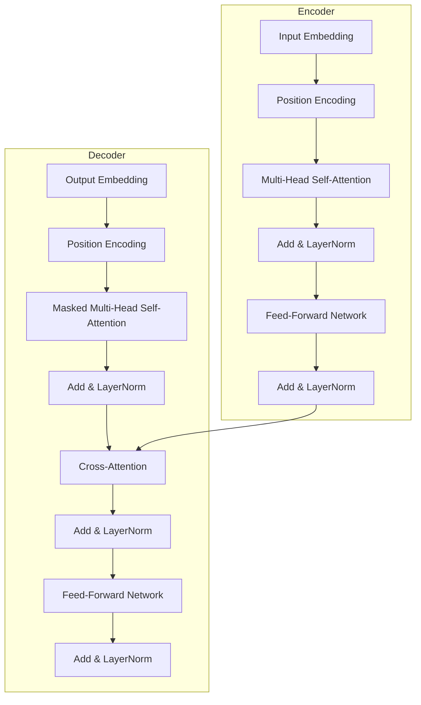

---
tags:
  - MachineLearning
  - DeepLearning
  - Architecture
  - SequenceModel
  - Attention
  - 定义性
title: Transformer
created: 2026-06-01
---

# Transformer

*编码器-解码器架构与自注意力机制的理论基础*

> [!abstract] Overview
> Transformer 是深度学习中序列建模的里程碑架构。它以自注意力机制替代了 RNN 的递推结构，通过并行化训练实现了前所未有的效率，同时保持了长程依赖捕获能力。Mamba 等选择性 SSM 正是作为 Transformer 的替代方案而出现的。理解 Transformer 的设计原理是理解其局限性的前提。

Related: [[Attention Mechanism]] | [[Mamba]] | [[LSTM]] | [[CTM - Mamba and S6 SSM]]

---

## 1. Core Principles — Transformer Architecture

### What & Why

Transformer (Vaswani et al., 2017) 的核心思想：

- **抛弃递推**：RNN 的 $h_t = f(h_{t-1}, x_t)$ 结构强制序列化计算，无法利用 GPU 并行
- **完全依赖注意力**：通过自注意力 (Self-Attention) 直接建模序列中任意两个位置的关系
- **并行训练**：所有时间步可同时计算（训练时无需递推）

### Architecture Overview

标准的 Transformer 由编码器 (Encoder) 和解码器 (Decoder) 两部分组成：



每个编码器层包含两个子层：多头自注意力 (Multi-Head Self-Attention) 和前馈网络 (Feed-Forward Network, FFN)。每个子层后都有一个残差连接 (Residual Connection) 和层归一化 (Layer Normalization)。

解码器与之类似，但多了掩码自注意力 (Masked Self-Attention, 防止看到未来时间步) 和交叉注意力 (Cross-Attention, 关注编码器输出)。

### Self-Attention

自注意力是 Transformer 的核心操作。对于输入序列 $X \in \mathbb{R}^{T \times d}$：

$$Q = XW_Q, \quad K = XW_K, \quad V = XW_V$$

$$\text{Attention}(Q, K, V) = \text{softmax}\left(\frac{QK^T}{\sqrt{d_k}}\right)V$$

其中 $Q, K, V$ 分别为查询 (Query)、键 (Key)、值 (Value) 矩阵。

| 组件 | 含义 | 维度 |
|------|------|------|
| $Q$ (Query) | 当前元素想查询什么 | $(T, d_k)$ |
| $K$ (Key) | 所有元素有什么可被查询 | $(T, d_k)$ |
| $V$ (Value) | 所有元素实际提供的信息 | $(T, d_v)$ |
| $\sqrt{d_k}$ | 缩放因子，防止点积结果过大 | 标量 |

$QK^T$ 计算所有位置对之间的相似度得分，形成 $T \times T$ 的注意力矩阵。缩放因子 $\sqrt{d_k}$ 的作用：当 $d_k$ 较大时，点积结果的方差变大，softmax 梯度趋于平缓，缩放后使梯度处于更合理的范围。

### Multi-Head Attention

多头注意力并行运行 $h$ 个独立的注意力头，每个头学习不同的关注模式：

$$\text{MultiHead}(Q, K, V) = \text{Concat}(\text{head}_1, \dots, \text{head}_h)W_O$$

$$\text{head}_i = \text{Attention}(QW_Q^i, KW_K^i, VW_V^i)$$

多头注意力的关键作用：

- 每个头可以专注于不同类型的关系（语法、语义、位置等）
- 通过不同的投影矩阵，每个头在子空间中学习独立的注意力模式
- 拼接后通过 $W_O$ 融合多头信息

| 头数 $h$ | 每头维度 $d_k$ | 总参数量 | 效果 |
|---------|---------------|---------|------|
| 1 (单头) | $d_{\text{model}}$ | 最低 | 只能学习一种关系模式 |
| 8 | $d_{\text{model}} / 8$ | 中等 | 能学习 8 种不同的关注模式 |
| 16 | $d_{\text{model}} / 16$ | 高 | 模式更多但每头维度降低 |

### Position Encoding

自注意力本身是**排列等变** (Permutation Equivariant) 的。打乱输入顺序不影响输出，因此必须显式注入位置信息。

**正弦位置编码** (原始 Transformer)：

$$PE_{(pos, 2i)} = \sin(pos / 10000^{2i/d_{\text{model}}})$$
$$PE_{(pos, 2i+1)} = \cos(pos / 10000^{2i/d_{\text{model}}})$$

**可学习位置编码**：将位置编码作为可学习参数，允许模型在训练中自适应调整。

**RoPE (Rotary Position Embedding)**：通过旋转矩阵将位置信息编码到 $Q$ 和 $K$ 中，使注意力自然包含相对位置信息。这是现代 LLM (LLaMA, GPT-NeoX) 的主流选择。

### Feed-Forward Network

每个 Transformer 层包含一个两层的 FFN，通常 $d_{\text{ff}} = 4 \times d_{\text{model}}$：

$$\text{FFN}(x) = W_2 \cdot \text{GELU}(W_1 x + b_1) + b_2$$

FFN 的作用是：**注意力层负责交换信息，FFN 层负责信息处理**。注意力层不做非线性变换（softmax 以外的操作都是线性变换），非线性变换全部由 FFN 完成。

> [!note] FFN 参数量
> FFN 通常占 Transformer 总参数的约 2/3。有人将其解释为键值存储——第一层将输入映射到高维空间，第二层压缩回原始维度，激活函数在此过程中选择性地激活不同类型的特征。

### Complexity Analysis

| 维度 | Transformer | RNN | SSM (Mamba) |
|------|-------------|-----|-------------|
| 时间复杂度 (训练) | $O(T^2 \cdot d)$ | $O(T \cdot d^2)$ | $O(T \cdot d)$ |
| 显存占用 | $O(T^2)$ (注意力矩阵) | $O(T)$ | $O(T)$ |
| 并行度 | 高 (全序列) | 低 (顺序) | 中 (关联扫描) |
| 长程依赖 | 直接连接任意位置 | 路径长度 $O(T)$ | 路径长度 $O(1)$ |

Transformer 的 $O(T^2)$ 复杂度源于注意力矩阵 $QK^T \in \mathbb{R}^{T \times T}$。当 $T$ 较大时（如超过 4096），这一平方级的开销成为瓶颈。SSM 的 $O(T)$ 复杂度使其在长序列场景中具有显著优势。

但 Transformer 的并行性使其在短序列上通常比 SSM 更快，因为注意力操作可以充分利用 GPU 矩阵乘法算力。

---

## 2. Case Study: CTM Context — Why Mamba over Transformer

### The Long Sequence Problem

CTM 处理的是金融时间序列。每个样本可能包含数千个时间步（分钟级数据乘数年回溯），$O(T^2)$ 的注意力机制在这种场景下难以承受。

| 序列长度 | 注意力矩阵大小 | 显存占用 (FP32) |
|---------|---------------|----------------|
| 512 | 512 x 512 | ~1 MB |
| 2048 | 2048 x 2048 | ~16 MB |
| 8192 | 8192 x 8192 | ~256 MB |
| 32768 | 32768 x 32768 | ~4 GB |

当序列长度进入数万级别时，仅注意力矩阵的存储就超过 GPU 可用显存。这正是在 CTM 中选择 Mamba (选择性 SSM) 的核心动机。

### 核心权衡

| 特性 | Transformer (注意力) | Mamba (选择性 SSM) |
|------|-------------------|------------------|
| 训练并行度 | 完全并行 | 关联扫描 (伪并行) |
| 推理复杂度 | $O(T^2)$ (需完整 KV 缓存) | $O(T)$ (递推) |
| 内容感知 | 通过 $QK^T$ 实现全局交互 | 通过输入依赖的 $\Delta, B, C$ |
| 长序列扩展 | 困难 (显存瓶颈) | 自然 (线性复杂度) |
| 短序列速度 | 快 (矩阵乘法优化充分) | 较慢 (扫描开销) |

### 架构对比

```
Transformer:                      Mamba:
x → Attn(x) → LN → FFN → LN      x → Conv → SSM → LN → Gate
    │                                  │
    └── O(T²) ──┘                      └── O(T) ──┘
```

两者在整体架构上都是"变换 + 归一化 + 非线性"的层结构。区别在于核心变换单元：Transformer 使用注意力机制（全局、二次复杂度），Mamba 使用选择性 SSM（递推、线性复杂度）。

> [!tip] 混合架构
> Transformer 和 SSM 并非完全替代关系。混合架构 (如 Jamba) 将两者的优势结合：用注意力层处理短程模式，用 SSM 层处理长程依赖。

---

## 3. Key Takeaways

### 何时用 Transformer

| 场景 | 推荐 | 原因 |
|------|------|------|
| 短序列 (T < 1024) | Transformer | 矩阵乘法优化充分，训练速度快 |
| 长序列 (T > 4096) | SSM | 显存和计算成本随 $T$ 线性增长 |
| 需要全局上下文交互 | Transformer | 注意力直接建模任意位置关系 |
| 严格递推推理 | SSM | 推理时 $O(T)$ 无 KV 缓存需求 |
| 硬件资源充足 | Transformer | 生态成熟，实践丰富 |

### 常见陷阱

- **忽略序列长度**：在短序列上用 SSM 可能不如 Transformer 快。扫描操作的常数因子比矩阵乘法大
- **位置编码缺失**：自注意力排列等变，不注入位置信息则模型无法区分不同顺序
- **注意力矩阵数值溢出**：$QK^T$ 的方差随 $d_k$ 增大而增大，必须除以 $\sqrt{d_k}$
- **因果掩码误用**：解码器中必须使用上三角掩码防止标签泄露

### 相关概念

- [[Attention Mechanism]] — 注意力的详细分解
- [[Normalization]] — LayerNorm 在 Transformer 中的关键作用
- [[Mamba]] — SSM 作为 Transformer 的线性复杂度替代
- [[CTM - Mamba and S6 SSM]] — CTM 中选择 SSM 而非 Transformer 的工程决策
