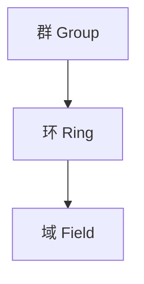

# Abstract Algebra MOC

Algebraic structures build upon each other in a strict hierarchy: each new structure inherits all previous axioms and adds new ones.

## 代数结构递进

## 笔记索引

| 笔记 | 类型 | 核心概念 |
|------|------|----------|
| [[Group]] | 定义性 | 群公理、子群、阿贝尔群 |
| [[Ring]] | 定义性/基本原理 | 环公理、整环、理想 |
| [[Field]] | 定义性/基本原理 | 域公理、有序域 |
| [[Cosets and Lagrange's Theorem]] | 定理性 | 陪集、指数、Lagrange 定理 |
| [[Group Homomorphisms]] | 概念性/定理性 | 同态、核、像、Cayley 定理 |
| [[Normal Subgroups and Quotient Groups]] | 定义性/基本原理 | 正规子群、商群 |
| [[Cyclic Groups]] | 定义性/定理性 | 生成元、Z_n、分类 |
| [[Isomorphism Theorems]] | 定理性/证明 | 三个同构定理 |
| [[Permutation Groups]] | 定义性/概念性 | 循环记号、交错群、S_n |
| [[Group Actions]] | 概念性/定理性 | 轨道-稳定子、Burnside |

## 学习路径

- **入门主线**（结构递进）：Group → Ring → Field
- **群论主线**：Group → Group Homomorphisms → Cosets and Lagrange's Theorem → Normal Subgroups and Quotient Groups → Isomorphism Theorems → Group Actions
- **群论旁支**：Cyclic Groups, Permutation Groups
