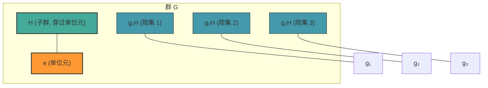

# Cosets and Lagrange's Theorem

> [!abstract] 概述
> **陪集 (Coset)** 是将子群"平移"到群的各个部分所得到的集合，它们将群划分为大小相同的等价类。**Lagrange 定理**则是这种划分的直接推论——子群的阶整除群的阶。这是群论中最早、最基本的计数定理。

---

## 陪集的定义

设 $G$ 是群，$H \leq G$ 是子群。对任意 $g \in G$：

- **左陪集 (Left Coset)**：$gH = \{ gh \mid h \in H \}$
- **右陪集 (Right Coset)**：$Hg = \{ hg \mid h \in H \}$

若 $G$ 是阿贝尔群，则 $gH = Hg$；但对非阿贝尔群，左右陪集一般不同。

> [!tip] 直觉
> 陪集是子群 $H$ 在 $G$ 中的"平移"——想象一条直线（$H$）在平面上平移到不同位置（$gH$）。$g$ 是平移向量。

---

## 陪集的关键性质

### 1. 陪集划分群

定义等价关系 $\sim$ 为 $a \sim b \iff a^{-1}b \in H$。易证这是等价关系：

- **自反性**：$a^{-1}a = e \in H$
- **对称性**：$a^{-1}b \in H \implies b^{-1}a = (a^{-1}b)^{-1} \in H$
- **传递性**：$a^{-1}b \in H,\; b^{-1}c \in H \implies a^{-1}c = (a^{-1}b)(b^{-1}c) \in H$

$a$ 所在的等价类恰为 $aH$。因此**所有左陪集构成 $G$ 的一个划分**。

### 2. 陪集等势于子群

映射 $h \mapsto gh$ 是从 $H$ 到 $gH$ 的双射，故

$$|gH| = |H| \quad \text{对所有 } g \in G$$

所有陪集大小相同。

### 3. 陪集要么相等要么不交

若 $aH \cap bH \neq \varnothing$，则 $aH = bH$。这是等价类的必然性质。

---

## Lagrange 定理

> [!theorem] Lagrange 定理
> 设 $G$ 是有限群，$H \leq G$。则 $|H|$ 整除 $|G|$。

**证明**：陪集 $\{gH\}_{g \in G}$ 划分 $G$（等价类），每个陪集大小均为 $|H|$。若记相异陪集个数为 $k$，则

$$|G| = k \cdot |H|$$

因此 $|H| \mid |G|$。$\square$

### 指数 (Index)

$k = |G|/|H|$ 称为 $H$ 在 $G$ 中的**指数**，记作 $[G:H]$ 或 $|G:H|$。

### 推论

1. **元素的阶整除群阶**：$G$ 有限，$g \in G$，则 $\operatorname{ord}(g) \mid |G|$。（因为 $\langle g \rangle \leq G$ 且 $|\langle g \rangle| = \operatorname{ord}(g)$。）

2. **素数阶群必为循环群**：若 $|G| = p$ 为素数，则 $G \cong \mathbb{Z}_p$。（取 $g \neq e$，则 $\operatorname{ord}(g) > 1$ 且整除 $p$，故 $\operatorname{ord}(g) = p = |G|$，$g$ 生成整个群。）

---

## 几何直觉

将子群 $H$ 视为穿过原点的直线，陪集 $gH$ 就是将该直线平移 $g$ 后的平行直线：

所有陪集互不相交，大小一致，铺满整个群——如同平面被一组平行直线等距划分。

---

## 例子

### 例 1：$\mathbb{Z}$ 中 $m\mathbb{Z}$ 的陪集

$G = \mathbb{Z}$（加法），$H = m\mathbb{Z} = \{ mk \mid k \in \mathbb{Z} \}$。

左陪集（加法下左陪集 = 右陪集）：$g + m\mathbb{Z}$，恰为模 $m$ 的剩余类：

- $0 + m\mathbb{Z}$ — 被 $m$ 整除的数
- $1 + m\mathbb{Z}$ — 模 $m$ 余 $1$ 的数
- $\vdots$
- $(m-1) + m\mathbb{Z}$ — 模 $m$ 余 $m-1$ 的数

共 $m$ 个陪集，$[\mathbb{Z} : m\mathbb{Z}] = m$。

### 例 2：$S_3$ 中 $\langle (12) \rangle$ 的陪集

$S_3 = \{ e, (12), (13), (23), (123), (132) \}$，$H = \langle (12) \rangle = \{ e, (12) \}$。

左陪集：
- $eH = H = \{ e, (12) \}$
- $(13)H = \{ (13), (13)(12) \} = \{ (13), (123) \}$
- $(23)H = \{ (23), (23)(12) \} = \{ (23), (132) \}$

共 $3$ 个陪集，$[S_3 : H] = 3$。验证：$|S_3| = 6 = 3 \cdot 2 = [S_3 : H] \cdot |H|$。

### 例 3：$D_4$ 中旋转子群的陪集

$D_4$ 是正方形的对称群（8 个元素）。旋转子群 $R = \{ e, r, r^2, r^3 \}$，$|R| = 4$。

$R$ 的陪集恰有两个：
- $R$ 自身 — 四个旋转
- $sR$（或 $Rs$）— 四个反射

其中 $s$ 是任意一个反射。$[D_4 : R] = 2$，$|D_4| = 8 = 2 \cdot 4$。

---

## Lagrange 定理的逆不成立

> [!warning] 逆否命题
> Lagrange 定理说：子群阶整除群阶。但反过来——若 $d \mid |G|$，$G$ 是否有 $d$ 阶子群？**不一定。**

**最小反例**：$A_4$（交错群，4 个元素的偶置换）。$|A_4| = 12$，整除 $12$ 的正因数有 $1, 2, 3, 4, 6, 12$。$A_4$ 有 $1, 2, 3, 4, 12$ 阶子群，但**没有 6 阶子群**。

> 这一事实说明，群的结构远不止在于元素个数——$12$ 阶的 $A_4$ 和 $12$ 阶的 $\mathbb{Z}_{12}$ 或 $D_6$ 有着本质不同的子群结构。

> [!note] Cauchy 定理与 Sylow 定理
> Lagrange 定理的逆在一定条件下成立：若 $p$ 是素数且 $p \mid |G|$，则 $G$ 必有 $p$ 阶元（Cauchy 定理）。更强的 Sylow 定理则保证 $p^k$ 阶子群的存在性。

---

## 核心连接

- [[Group#子群]] — 子群检验与陪集的基本构件
- [[Normal Subgroups and Quotient Groups]] — 陪集是商群的元素；当子群正规时，陪集构成群
- [[Field]] — 域中加法群和乘法群的陪集结构

### 类比：守恒律

陪集的"划分"与[[Rank and Nullity]]有惊人的平行结构：

| 代数结构 | 关系 | 解释 |
|:---------|:-----|:-----|
| 群 | $|G| = [G:H] \cdot |H|$ | 群阶 = 陪集个数 × 子群阶 |
| 线性映射 | $\dim V = \operatorname{rank} T + \operatorname{null} T$ | 维数守恒 |

两者都是"整体 = 部分 × 个数"式的**守恒律**。

---

## 参考来源

- Lang, S. *Algebra*, 3rd ed., Springer 2002.
- Dummit, D. & Foote, R. *Abstract Algebra*, 3rd ed., Wiley 2004.
- Artin, M. *Algebra*, 2nd ed., Pearson 2010.
