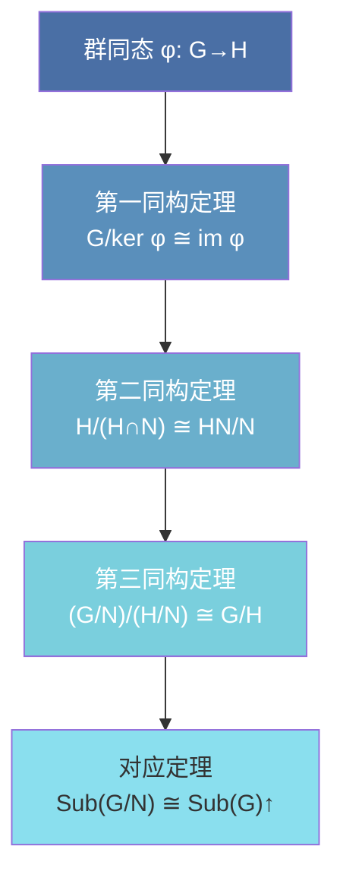
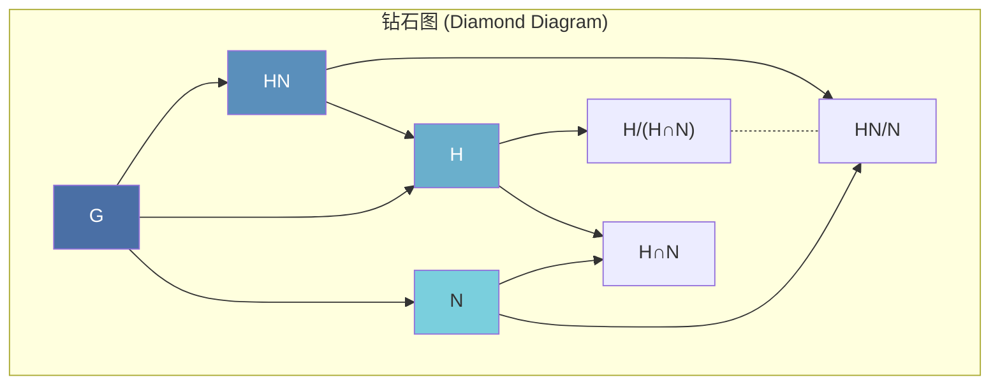
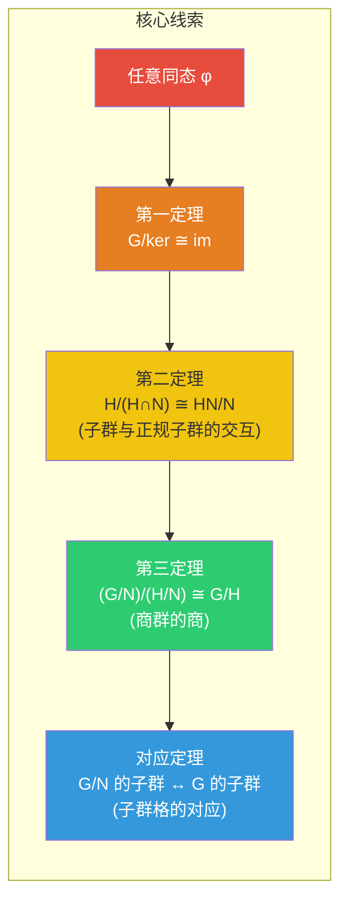

# Isomorphism Theorems

> [!abstract] 概述
> **同构定理 (Isomorphism Theorems)** 是群论中四个层层递进的定理，它们揭示了商群、同态像、子群之间最深层的关系。第一定理将任意同态分解为标准分解；第二定理处理"分子分母同时消去"；第三定理展示商群的商仍是商群；对应定理则给出了子群格的完整对应。这四者的精神贯穿环论、模论、泛代数，是抽象代数的支柱。

---

## 第一同构定理 (The First Isomorphism Theorem)

**定理.** 设 $\varphi: G \to H$ 是群同态。则 $\ker \varphi \trianglelefteq G$，且

$$G/\ker \varphi \cong \operatorname{im} \varphi.$$

**证明.** 构造 $\tilde{\varphi}: G/\ker\varphi \to \operatorname{im}\varphi$ 为 $\tilde{\varphi}(g \cdot \ker\varphi) = \varphi(g)$。

| 验证步骤 | 论证 |
|:---------|:-----|
| **良定义** | 若 $g\ker\varphi = g'\ker\varphi$，则 $g^{-1}g' \in \ker\varphi \Rightarrow \varphi(g)=\varphi(g')$ |
| **同态性** | $\tilde{\varphi}((g\ker)(h\ker)) = \tilde{\varphi}(gh\ker) = \varphi(gh) = \varphi(g)\varphi(h) = \tilde{\varphi}(g\ker)\tilde{\varphi}(h\ker)$ |
| **单射** | $\tilde{\varphi}(g\ker) = e_H \Rightarrow \varphi(g)=e_H \Rightarrow g\in\ker\varphi \Rightarrow g\ker = \ker\varphi$ |
| **满射** | 对任意 $\varphi(g) \in \operatorname{im}\varphi$，取陪集 $g\ker\varphi$ 即得 |

**例子.**

| 同态 | 核 | 同构 |
|:-----|:---|:-----|
| $\det: \operatorname{GL}_n(F) \to F^\times$ | $\operatorname{SL}_n(F)$ | $\operatorname{GL}_n(F)/\operatorname{SL}_n(F) \cong F^\times$ |
| $\operatorname{sgn}: S_n \to \{\pm 1\}$ | $A_n$ | $S_n/A_n \cong \mathbb{Z}_2$ |
| $\pi: \mathbb{Z} \to \mathbb{Z}_n,\; \pi(k) = k \bmod n$ | $n\mathbb{Z}$ | $\mathbb{Z}/n\mathbb{Z} \cong \mathbb{Z}_n$ |

> [!tip] 意义
> 第一同构定理将任意同态分解为三步：**满射** $G \to G/\ker\varphi$ → **同构** $G/\ker\varphi \cong \operatorname{im}\varphi$ → **单射** $\operatorname{im}\varphi \hookrightarrow H$。任何同态本质上都是商群的嵌入。

---

## 第二同构定理 (The Second / Diamond Isomorphism Theorem)

**定理.** 设 $H \leq G$，$N \trianglelefteq G$。则 $H \cap N \trianglelefteq H$，且

$$H/(H \cap N) \cong HN/N.$$

**直觉.** "分子分母同时消去 $N$ 的交集"——从 $H$ 中模去与 $N$ 重合的部分，等价于从 $HN$ 中模去整个 $N$。

**例子.** 取 $G = \mathbb{Z}$（加法），$H = 4\mathbb{Z}$，$N = 6\mathbb{Z}$。则 $H\cap N = 12\mathbb{Z}$（4 和 6 的最小公倍数），$HN = 2\mathbb{Z}$（4 和 6 生成的最大公约数）。定理给出：

$$4\mathbb{Z}/12\mathbb{Z} \cong 2\mathbb{Z}/6\mathbb{Z} \cong \mathbb{Z}_3.$$

验证：$4\mathbb{Z}/12\mathbb{Z}$ 中的陪集为 $\{0,4,8\} \bmod 12$，确实同构于 $\mathbb{Z}_3$。

---

## 第三同构定理 (The Third Isomorphism Theorem)

**定理.** 设 $N \trianglelefteq G$，且 $N \leq H \trianglelefteq G$。则

$$(G/N) \big/ (H/N) \cong G/H.$$

**直觉.** "先模 $N$ 再模 $H/N$，等于直接模 $H$"——商群的商回到了更简单的形式。

> [!tip] 类比
> 如同算术中的约分：$(a/c)/(b/c) = a/b$。这里的 $G$ 是分子，$H$ 是要模去的部分，$N$ 是先模掉的"公因子"。

**例子.** 取 $G = \mathbb{Z}_{24}$（加法），$N = \langle 8 \rangle \cong \mathbb{Z}_3$（24 中 8 生成的子群），$H = \langle 4 \rangle \cong \mathbb{Z}_6$。

- $G/N = \mathbb{Z}_{24} / \mathbb{Z}_3 \cong \mathbb{Z}_8$（24/3=8）
- $H/N = \mathbb{Z}_6 / \mathbb{Z}_3 \cong \mathbb{Z}_2$（6/3=2）
- $(G/N)/(H/N) \cong \mathbb{Z}_8 / \mathbb{Z}_2 \cong \mathbb{Z}_4$
- $G/H = \mathbb{Z}_{24} / \mathbb{Z}_6 \cong \mathbb{Z}_4$ ✓

---

## 对应定理 (Correspondence / Lattice Isomorphism Theorem)

**定理.** 设 $N \trianglelefteq G$。则商群 $G/N$ 的子群与 $G$ 中包含 $N$ 的子群之间存在一一对应：

$$\{ \text{子群 } \bar{H} \leq G/N \} \;\longleftrightarrow\; \{ \text{子群 } H \leq G \mid N \leq H \}.$$

对应方式为 $\bar{H} \mapsto \pi^{-1}(\bar{H})$（取原像），其逆为 $H \mapsto H/N$（取像）。

**该对应保持以下性质：**

| 性质 | 对应关系 |
|:-----|:---------|
| **包含** | $H_1 \leq H_2 \iff H_1/N \leq H_2/N$ |
| **正规性** | $H \trianglelefteq G \iff H/N \trianglelefteq G/N$ |
| **指数** | $[G : H] = [G/N : H/N]$（指数不变） |
| **交与积** | $(H_1 \cap H_2)/N = (H_1/N) \cap (H_2/N)$，$(H_1H_2)/N = (H_1/N)(H_2/N)$ |

**例子.** 考虑 $G = S_4$，$N = V_4$（Klein 四元群，$S_4$ 的正规子群）。则 $S_4/V_4 \cong S_3$，且 $S_3$ 的子群（共 6 个）一一对应于 $S_4$ 中包含 $V_4$ 的子群：

| $S_3$ 的子群 | $S_4$ 中对应的子群 |
|:-------------|:-------------------|
| $\{1\}$ | $V_4$ |
| $\langle (12) \rangle \cong \mathbb{Z}_2$ | $\langle (12), V_4 \rangle \cong D_4$ |
| $\langle (123) \rangle \cong \mathbb{Z}_3$ | $\langle (123), V_4 \rangle \cong A_4$ |
| $A_3 \cong \mathbb{Z}_3$ | $\langle (123) \rangle V_4 = A_4$ |
| $S_3$ | $S_4$ 自身 |

---

## 关键连接

| 概念 | 链接 | 与本篇的关系 |
|:-----|:-----|:-------------|
| **群同态** | [[Group Homomorphisms]] | 核、像的定义——第一同构定理的原料 |
| **正规子群与商群** | [[Normal Subgroups and Quotient Groups]] | 商群构造——所有定理的共同基础 |
| **陪集与 Lagrange 定理** | [[Cosets and Lagrange's Theorem]] | 陪集的阶和对对应定理中指数的理解 |
| **线性变换的同构** | [[Linear Transformations#6.3 同构]] | 线性代数中的同构概念对比 |
| **商空间** | [[Quotient Space]] | $V/\ker T \cong \operatorname{im}T$——第一同构定理在线性代数中的精确类比 |
| **循环群** | [[Cyclic Groups]] | $\mathbb{Z}/n\mathbb{Z}$ 的具体结构 |

---

## 四个定理的关系

> [!summary] 统一视角
> - **第一定理** 是从"映射"到"结构"的桥梁（同态 → 商群同构）
> - **第二定理** 处理**两个子群的交互**（$H$ 和 $N$ 如何拼接）
> - **第三定理** 处理**商群的商**（多层商结构化简）
> - **对应定理** 给出**子群格的全局图景**（升/降对应）
>
> 在环论中，四者完全平行成立（只需将"子群"换为"子环/理想"）。在模论中也成立。这就是抽象代数的力量：**一次证明，到处适用**。
