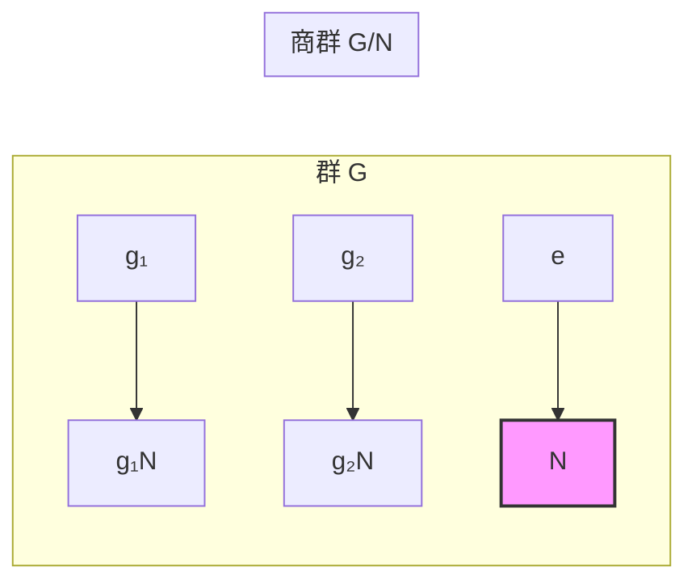

# Normal Subgroups and Quotient Groups

> [!abstract] 概述
> **正规子群 (Normal Subgroup)** 是子群的一种特殊类型，其左陪集等于右陪集。这一看似简单的性质使得**陪集之间的乘法有良好定义**，从而能将群 $G$ "模去"其正规子群 $N$ 得到一个更小的结构——**商群 (Quotient Group)** $G/N$。商群是抽象代数中最核心的构造之一，也是群论中"做大做小"的基本方法。

## 定义与等价条件

设 $N$ 是群 $G$ 的子群。称 $N \trianglelefteq G$（正规子群），若满足：

$$\forall g \in G,\; gNg^{-1} = N$$

其中 $gNg^{-1} = \{ gng^{-1} \mid n \in N \}$ 是 $N$ 的**共轭子群**。

| 等价条件 | 表述 | 说明 |
|:---------|:-----|:-----|
| 共轭不变性 | $gNg^{-1} = N$ | 共轭不改变子群 |
| 左=右陪集 | $gN = Ng$ | 左右陪集重合 |
| 元条件 | $\forall g \in G,\forall n \in N,\; gng^{-1} \in N$ | 最便于检验的形式 |

> [!warning] "$gN = Ng$" 不意味 $\forall g,\forall n,\; gn = ng$
> 这是**集合**相等：$\{gn \mid n\in N\} = \{ng \mid n\in N\}$。只需 $gng^{-1} \in N$，不要求 $g$ 与每个 $n$ 交换。

## 商群构造

给定 $N \trianglelefteq G$，定义 $G/N = \{ gN \mid g \in G \}$，运算为：

$$(gN)(hN) = (gh)N$$

| 要素 | 内容 |
|:-----|:-----|
| 载体 | 所有陪集 $\{gN \mid g \in G\}$ |
| 运算 | $(gN)(hN) = (gh)N$ |
| 单位元 | $N = eN$ |
| 逆元 | $(gN)^{-1} = g^{-1}N$ |

**为什么需要正规性？** 设 $gN = g'N$、$hN = h'N$，需证 $(gh)N = (g'h')N$。由 $N \trianglelefteq G$，可设 $g' = gn_1$、$h' = hn_2$，则 $g'h' = gn_1h n_2 = gh(h^{-1}n_1 h)n_2 \in ghN$（因为 $h^{-1}n_1 h \in N$）。若 $N$ 不正規，不同代表元可能给出不同陪集，运算不 well-defined。

> [!note] 为什么叫"正规"？
> 这个性质使得陪集乘法有良好定义——但 **大多数子群并不正规**。更贴切的理解是：正规子群是"可以安全地模掉"的子群，在商群构造中扮演标准角色。

## 例子

| 群 $G$ | 正规子群 $N$ | 商群 $G/N$ | 说明 |
|:-------|:------------|:-----------|:-----|
| 任意 $G$ | $\{e\}$ | $G$ | 平凡正规子群 |
| 任意 $G$ | $G$ | $\{e\}$ | 平凡正规子群 |
| $S_n$ | $A_n$ | $\mathbb{Z}/2\mathbb{Z}$ | 指数 $2$ $\Rightarrow$ 自动正规 |
| $GL_n(\mathbb{R})$ | $SL_n(\mathbb{R})$ | $\mathbb{R}^\times$ | $\det$ 同态的核 |
| $\mathbb{Z}$（加法） | $n\mathbb{Z}$ | $\mathbb{Z}/n\mathbb{Z}$ | $\mathbb{Z}$ 阿贝尔 $\Rightarrow$ 一切子群正规 |
| 阿贝尔群 $A$ | 任意子群 $H$ | $A/H$ | $gHg^{-1}=H$ 自动成立 |

> [!tip] 指数 $2$ 的子群一定正规
> $[G:N] = 2$ 时只有两个陪集：$N$ 和 $gN$，必有 $gN = Ng$。$A_n \trianglelefteq S_n$ 直接由此推出。

### 实例：$\mathbb{Z}/n\mathbb{Z}$

加法群 $\mathbb{Z}$ 中 $n\mathbb{Z} \trianglelefteq \mathbb{Z}$。商群：

$$\mathbb{Z}/n\mathbb{Z} = \{ n\mathbb{Z},\; 1+n\mathbb{Z},\; \dots,\; (n-1)+n\mathbb{Z} \}$$

运算为模 $n$ 加法：$(a + n\mathbb{Z}) + (b + n\mathbb{Z}) = (a+b) + n\mathbb{Z}$。这正是**模 $n$ 整数群** $\mathbb{Z}_n$。

## 商群的阶

由 [[Cosets and Lagrange's Theorem|Lagrange 定理]]，若 $G$ 有限：

$$|G/N| = \frac{|G|}{|N|}$$

陪集划分群 $G$，每个陪集大小 $|N|$，故陪集数量为 $|G|/|N|$。

## 几何直觉

商群 $G/N$ 是将 $N$ 全部"捏成同一个点"后的简化结构：

- **投影类比**：$\mathbb{R}^3 \to \mathbb{R}^2$ 丢失法线方向信息。类似地，所有差一个 $N$ 中元素的群元素被归入同一陪集

映射 $G \to G/N$ 是**自然满同态** (canonical projection)，核为 $N$。

## 核心连接

- [[Cosets and Lagrange's Theorem]] — 商群元素是陪集；Lagrange 定理给出 $|G/N|$ 的计算
- [[Group Homomorphisms]] — $\ker\varphi \trianglelefteq G$；$G/\ker\varphi \cong \text{im}\,\varphi$（第一同构定理）
- [[Group]] — 群的定义
- [[Field]] — 商环 $R/I$ 是商群在环论中的推广
- [[Quotient Space]] — 商空间 $V/W$ 是商群的线性代数类比

## 相关链接

- [[Cosets and Lagrange's Theorem]] — 陪集与 Lagrange 定理
- [[Group Homomorphisms]] — 同态与第一同构定理
- [[Group]] — 群的定义
- [[Field]] — 域与商环
- [[Quotient Space]] — 商空间类比

## 参考来源

- Lang, S. *Algebra*, 3rd ed., Springer 2002.
- Dummit, D. & Foote, R. *Abstract Algebra*, 3rd ed., Wiley 2004.
- Artin, M. *Algebra*, 2nd ed., Pearson 2010.
