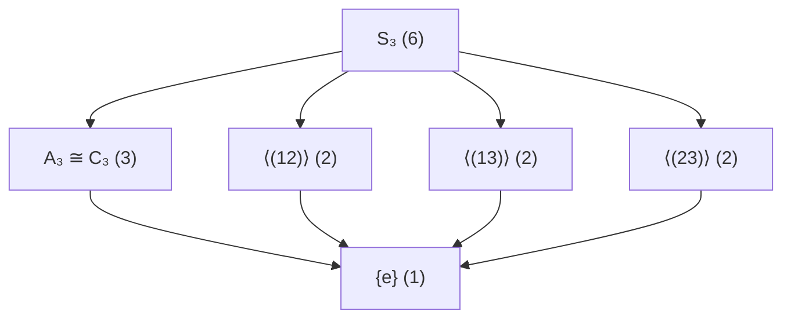

# Permutation Groups

> [!abstract] 概述
> **置换群 (Permutation Group)** 是研究对称性最直接的数学工具——所有双射变换构成群。从 $S_3$ 到 $S_n$，置换群不仅是群论的基本例子，更通过 Cayley 定理揭示了"所有群都是置换群"这一深刻事实。

## 对称群 $S_n$

**定义.** 设 $[n] = \{1, 2, \dots, n\}$。$[n]$ 上所有**置换 (permutation)**（即双射 $\sigma: [n] \to [n]$）的集合，配以映射的复合运算，构成 $n$ **次对称群 (symmetric group)**，记作 $S_n$。

$$|S_n| = n!$$

> [!example] $S_3$ 的六个元素
> $$
> \begin{aligned}
> e &= () \quad &\text{(恒等置换)} \\
> (12) &\quad (13) \quad (23) &\text{(对换, order 2)} \\
> (123) &\quad (132) &\text{(3-循环, order 3)}
> \end{aligned}
> $$
> $S_3$ 是最小的**非阿贝尔群**——任意 $n \ge 3$ 的 $S_n$ 均非阿贝尔，因为 $(12)(13) = (132) \neq (123) = (13)(12)$。

## 循环记号 (Cycle Notation)

**定义.** 循环 $(a_1\; a_2\; \dots\; a_k)$ 表示 $a_1 \mapsto a_2 \mapsto \cdots \mapsto a_k \mapsto a_1$，其余元素保持不变。$k$ 为循环**长度**。

**基本性质：**
- **不相交循环可交换**：若循环间无公共元素，则复合顺序无关。
- **唯一分解**：每个置换可**唯一**地分解为不相交循环的复合（不计顺序）。
- 长度为 1 的循环（不动点）通常省略不写。

> [!example] 循环分解
> $$
> \sigma = \begin{pmatrix}1&2&3&4&5&6\\3&4&1&2&6&5\end{pmatrix} = (1\;3)(2\;4)(5\;6)
> $$
> 三个不相交的对换，两两交换。

## 对换 (Transposition)

**定义.** 长度为 2 的循环称为**对换 (transposition)**。任意 $k$-循环可写成 $k-1$ 个对换的复合：
$$(a_1\; a_2\; \dots\; a_k) = (a_1\; a_k)(a_1\; a_{k-1})\cdots(a_1\; a_2)$$
分解不唯一，但对换个数的**奇偶性**唯一确定。

> [!example] 不同的分解
> $$
> (1\;2\;3) = (1\;3)(1\;2) = (2\;3)(1\;3) = (1\;2)(2\;3)
> $$
> 三种分解均使用 2 个对换（偶数个）。

## 符号与交错群

**符号同态 (Sign Homomorphism).** $\operatorname{sign}: S_n \to \{\pm 1\}$，$\operatorname{sign}(\sigma) = (-1)^{\#\text{对换}}$，是**群同态**：$\operatorname{sign}(\sigma\tau) = \operatorname{sign}(\sigma)\,\operatorname{sign}(\tau)$。

**交错群 (Alternating Group).** 所有偶置换（$\operatorname{sign}(\sigma)=+1$）构成正规子群 $A_n \trianglelefteq S_n$，$|A_n| = n!/2$（参见 [[Normal Subgroups and Quotient Groups]]）。

> [!warning] $A_n$ 的单性
> $A_n$ 对 $n \ge 5$ 是**单群**（无非平凡正规子群），这是 Galois 理论中"五次方程无根式解"的群论根源。

## 实例：$S_3$ 的乘法表与子群格

**乘法表**（右乘：行 × 列，即 $\sigma\tau$ 先施 $\tau$ 后施 $\sigma$。表项 (row, col) = row $\circ$ col）：

| $\circ$ | $e$ | $(12)$ | $(13)$ | $(23)$ | $(123)$ | $(132)$ |
|:-------:|:---:|:------:|:------:|:------:|:-------:|:-------:|
| $e$     | $e$ | $(12)$ | $(13)$ | $(23)$ | $(123)$ | $(132)$ |
| $(12)$  | $(12)$ | $e$ | $(132)$ | $(123)$ | $(23)$ | $(13)$ |
| $(13)$  | $(13)$ | $(123)$ | $e$ | $(132)$ | $(12)$ | $(23)$ |
| $(23)$  | $(23)$ | $(132)$ | $(123)$ | $e$ | $(13)$ | $(12)$ |
| $(123)$ | $(123)$ | $(13)$ | $(23)$ | $(12)$ | $(132)$ | $e$ |
| $(132)$ | $(132)$ | $(23)$ | $(12)$ | $(13)$ | $e$ | $(123)$ |

**验证非交换性：** $(12)(123) = (23) \neq (13) = (123)(12)$。

**子群格：**

其中 $A_3$ 是唯一非平凡正规子群（指数 2），三个 2 阶子群互相共轭。

## 实例：$S_4$ 与 Klein 四元群

$S_4$ 有 24 个元素。其**Klein 四元群 (Klein Four-Group)**
$$V_4 = \{e,\; (12)(34),\; (13)(24),\; (14)(23)\}$$
是 $S_4$ 的正规子群，且 $S_4 / V_4 \cong S_3$。$V_4$ 也包含于 $A_4$ 中，是 $A_4$ 唯一的 Sylow 2-子群。

$A_4$ 有 12 个元素，是 $S_4$ 中指数 2 的正规子群。有趣的是 $A_4$ **没有** 6 阶子群——这是 Lagrange 定理逆命题不成立的标准反例。

## Cayley 定理

> [!theorem] Cayley 定理
> 任意群 $G$ 同构于某个置换群的子群。特别地，若 $|G| = n$，则 $G \cong H \le S_n$。

**证明思路：** 左乘映射 $L_g: G \to G$ 是 $G$ 上的置换，$g \mapsto L_g$ 是 $G \to S_G$ 的单同态。（参见 [[Group Homomorphisms]]。）

> [!note] 理论意义
> Cayley 定理将**抽象群**还原为**具体置换群**——研究"所有置换群"等价于研究"所有群"。

## 小阶置换群的分类

| 群 | 阶 | 同构 | 备注 |
|:--|:--:|:----|:-----|
| $S_1$ | 1 | 平凡群 | 仅有恒等置换 |
| $S_2$ | 2 | $C_2$ | 对换 $(12)$ 生成 |
| $S_3$ | 6 | $D_3$ | 三角形二面体群，最小非阿贝尔群 |
| $A_3$ | 3 | $C_3$ | 3 阶循环群 |
| $S_4$ | 24 | — | $S_4 / V_4 \cong S_3$ |
| $A_4$ | 12 | — | 无 6 阶子群 |
| $S_5$ | 120 | — | 非可解（$A_5$ 单） |

## 核心连接

- [[Group Homomorphisms]] — sign 同态、Cayley 定理嵌入
- [[Normal Subgroups and Quotient Groups]] — $A_n \trianglelefteq S_n$，$S_n/A_n \cong C_2$，$S_4/V_4 \cong S_3$
- [[Cosets and Lagrange's Theorem]] — $|S_n : A_n| = 2$
- [[Group Actions]] — $S_n$ 在 $[n]$ 上的忠实传递作用
- [[Group]] — $S_3$ 作为非阿贝尔群的典型例子

> [!example] 应用预览
> 置换群是 Galois 理论的语言——多项式 Galois 群为 $S_n$ 子群，可解性等价于根式可解。

## 参考来源

- Dummit & Foote, *Abstract Algebra*, 3rd ed., Wiley 2004.
- Artin, *Algebra*, 2nd ed., Pearson 2010.
- Rotman, *An Introduction to the Theory of Groups*, 4th ed., Springer 1995.
