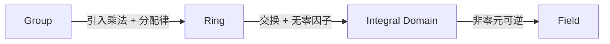

# Ring (环)

## 概述

环 (Ring) 是[[Group|群]]到[[Field|域]]之间的代数结构。$(R,+)$ 是阿贝尔群，$(R,\times)$ 是半群，分配律连接二者。

> [!note] 结构递进：群 → 环 → 域，每步加强约束。
## 形式定义

$R$ 配备 $+$ 和 $\times$ 称为环，当：

| 公理 | 加法 | 乘法 |
|------|------|------|
| 封闭 | $a+b \in R$ | $ab \in R$ |
| 结合 | $(a+b)+c = a+(b+c)$ | $(ab)c = a(bc)$ |
| 交换 | $a+b = b+a$ | 不要求 |
| 单位元 | $\exists 0,\; a+0=a$ | 可选（含幺则 $\exists 1$） |
| 逆元 | $\forall a,\; \exists -a,\; a+(-a)=0$ | 不要求 |
| 分配律 | — | $a(b+c)=ab+ac,\; (a+b)c=ac+bc$ |
## 重要例子

- $\mathbb{Z}$ — 整数环，最标准
- $\mathbb{Z}/n\mathbb{Z}$ — 模 $n$ 剩余类环，有限环
- $R[x]$ — 多项式环；若 $R$ 是整环则 $R[x]$ 也是
- $M_n(R)$ — $n \ge 2$ 时非交换矩阵环
- $\mathbb{Z}[i]$ — 高斯整数环
## 基本性质

- **零乘**：$a \cdot 0 = 0 \cdot a = 0$
- **符号**：$(-a)b = a(-b) = -(ab)$，$(-a)(-b) = ab$
- **加法消去**：由阿贝尔群自动成立

> [!warning] 乘法消去律不成立
> $ab = ac$ 且 $a \neq 0$ 不能推出 $b = c$，这是零因子问题的来源。
## 分类

- **交换环**：$ab = ba$，如 $\mathbb{Z}, \mathbb{Z}/n\mathbb{Z}$
- **非交换环**：如 $M_n(\mathbb{R})\;(n \ge 2)$
- **含幺环**：存在 $1$ 使 $1 \cdot a = a \cdot 1 = a$
- **不含幺环**：如 $2\mathbb{Z}$（偶数环）

## 特殊环对比

| 结构 | 交换 | 含幺 | 无零因子 | 非零元可逆 |
|------|:----:|:----:|:--------:|:----------:|
| 环 | 可选 | 可选 | 可选 | 可选 |
| 整环 | ✓ | ✓ | ✓ | ✗ |
| 域 | ✓ | ✓ | ✓ | ✓ |

- **整环**：$ab = 0 \implies a=0$ 或 $b=0$
- **域**：非零元均可逆，$\subsetneq$ 整环 $\subsetneq$ 交换含幺环

## 理想与商环

**理想 (ideal)** $I \subseteq R$ 满足：$(I,+)$ 是子群，且 $\forall r \in R,\; a \in I$ 有 $ra, ar \in I$。商环 $R/I$ 的陪集运算构成环，$\mathbb{Z}/n\mathbb{Z}$ 即典型例子。

## 联系

- [[Group]] — $(R,+)$ 是阿贝尔群
- [[Field]] — 域是特殊的环
- $\mathbb{Z}/n\mathbb{Z}$ 是[[Cyclic Groups|循环群]]的典型例子

> [!tip] 从 $\mathbb{Z}$ 和 $\mathbb{Z}/n\mathbb{Z}$ 入手理解环，它们承载了环论的大部分直观。
