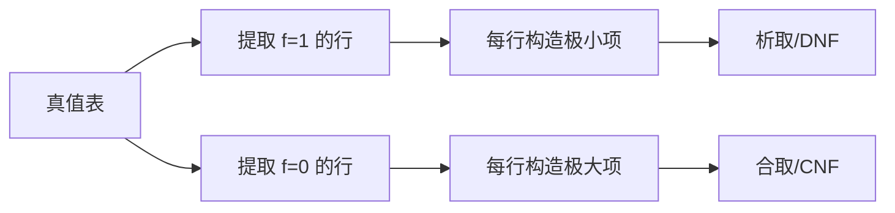
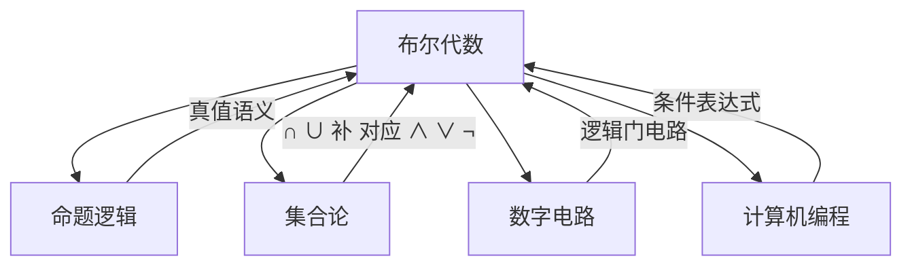

---
tags:
  - Math
  - Logic
  - 定义性
  - 基本原理
title: Boolean Algebra
created: 2026-05-21
---

[[Propositional Logic]]
[[Set_Theory/function mapping]]
[[Lambda Calculus]]
# Boolean Algebra 布尔代数

> [!note] 定义
> **布尔代数**（Boolean Algebra）是一种代数结构，其载体为集合 $\{0,1\}$（或 $\{\bot,\top\}$），配备三个基本运算：**合取**（AND，$\land$）、**析取**（OR，$\lor$）和**否定**（NOT，$\lnot$）。由 **George Boole** 在 19 世纪中叶提出，是数理逻辑和数字电路的理论基础。

## 基本运算

布尔代数的三个基本运算定义如下：

| 运算 | 符号 | 名称 | 说明 |
|------|------|------|------|
| 合取 | $x \land y$ | AND / 逻辑与 | 当且仅当 $x=y=1$ 时结果为 $1$ |
| 析取 | $x \lor y$ | OR / 逻辑或 | 当 $x=1$ 或 $y=1$ 时结果为 $1$ |
| 否定 | $\lnot x$ | NOT / 逻辑非 | 当 $x=0$ 时结果为 $1$，否则为 $0$ |

### 真值表

> [!abstract] AND / OR / NOT 真值表

| $x$ | $y$ | $x \land y$ | $x \lor y$ | $\lnot x$ |
|:---:|:---:|:-----------:|:----------:|:---------:|
| 0 | 0 | 0 | 0 | 1 |
| 0 | 1 | 0 | 1 | 1 |
| 1 | 0 | 0 | 1 | 0 |
| 1 | 1 | 1 | 1 | 0 |

## 基本定律

布尔代数满足以下基本定律（对偶形式并列）：

| 定律 | AND 形式 | OR 形式 |
|------|----------|---------|
| 交换律 | $x \land y = y \land x$ | $x \lor y = y \lor x$ |
| 结合律 | $(x \land y) \land z = x \land (y \land z)$ | $(x \lor y) \lor z = x \lor (y \lor z)$ |
| 分配律 | $x \land (y \lor z) = (x \land y) \lor (x \land z)$ | $x \lor (y \land z) = (x \lor y) \land (x \lor z)$ |
| 同一律 | $x \land 1 = x$ | $x \lor 0 = x$ |
| 零律 | $x \land 0 = 0$ | $x \lor 1 = 1$ |
| 互补律 | $x \land \lnot x = 0$ | $x \lor \lnot x = 1$ |
| 幂等律 | $x \land x = x$ | $x \lor x = x$ |
| 吸收律 | $x \land (x \lor y) = x$ | $x \lor (x \land y) = x$ |

> [!tip] 对偶原理
> 布尔代数中的每一定律，若将 $\land$ 与 $\lor$ 互换、$0$ 与 $1$ 互换，得到的命题仍然成立。这称为**对偶原理**（Duality Principle）。

## De Morgan 律

**De Morgan 律**（德摩根定律）描述了 $\land$ 与 $\lor$ 在否定下的对偶关系：

$$
\lnot (x \land y) = \lnot x \lor \lnot y
\qquad
\lnot (x \lor y) = \lnot x \land \lnot y
$$

推广到 $n$ 个变量：

$$
\lnot \left( \bigwedge_{i=1}^n x_i \right) = \bigvee_{i=1}^n \lnot x_i
\qquad
\lnot \left( \bigvee_{i=1}^n x_i \right) = \bigwedge_{i=1}^n \lnot x_i
$$

## 布尔函数与范式

任意 $n$ 元布尔函数均可表示为两种标准形式：

### 析取范式（DNF）
每个极小项（minterm）是 $n$ 个变量的合取，DNF 是若干极小项的析取：

$$
f(x_1,\dots,x_n) = \bigvee m_i
$$

### 合取范式（CNF）
每个极大项（maxterm）是 $n$ 个变量的析取，CNF 是若干极大项的合取：

$$
f(x_1,\dots,x_n) = \bigwedge M_i
$$

## 与其他领域的联系

- **命题逻辑**：布尔代数是命题逻辑的真值语义基础，[[Propositional Logic]] 中的连接词 $\lnot,\land,\lor$ 直接对应布尔运算
- **集合论**：集合的交 $\cap$、并 $\cup$、补 $'$ 构成一个布尔代数，[[Set_Theory/function mapping]] 中的示性函数亦是布尔函数的特例
- **Lambda 演算**：丘奇编码（Church encoding）用函数表示布尔值 $\text{true} = \lambda x.\lambda y.x$，$\text{false} = \lambda x.\lambda y.y$，参见 [[Lambda Calculus]]
- **数字电路**：AND、OR、NOT 门直接实现布尔运算，是计算机硬件的数学基础

## 布尔代数的公理化

布尔代数也可公理化定义为满足以下条件的代数结构 $(B,\land,\lor,\lnot,0,1)$：

1. $B$ 是一个非空集合
2. $\land,\lor$ 是 $B$ 上的二元运算，$\lnot$ 是一元运算
3. $0,1 \in B$ 是常数
4. 满足交换律、分配律、互补律和同一律

> [!note] 布尔代数 vs 命题逻辑
> 布尔代数与命题逻辑本质上是同一数学结构的两种视角：布尔代数从**代数**的角度研究 $\{0,1\}$ 上的运算律，命题逻辑从**逻辑**的角度研究命题真值的组合规律。二者通过 $\{0,1\}$ 与 $\{\bot,\top\}$ 的同构对应起来。

## 相关链接

- [[Propositional Logic]] — 命题逻辑，布尔代数的逻辑对应
- [[function mapping]] — 函数与集合的示性函数
- [[Lambda Calculus]] — λ演算中的丘奇编码
- [[Formal Systems]] — 形式系统
- [[First-Order Logic]] — 一阶逻辑
