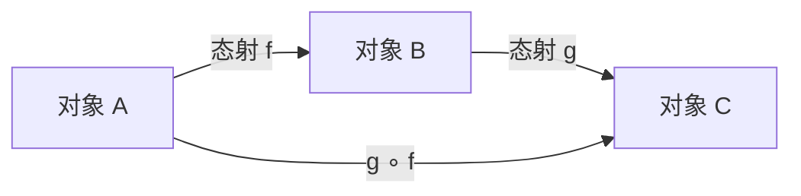

# Category Theory

> [!abstract] 概述
> **范畴论 (Category Theory)** 是数学中一门高度抽象的学科，研究数学结构之间的"关系"而非结构内部的具体元素。它以**对象 (Objects)** 和**态射 (Morphisms/Arrows)** 为原始概念，为不同数学领域提供统一的语言框架，被誉为"数学的数学"。

## 目录

- [[Category Theory#1 范畴的定义|1 范畴的定义]]
- [[Category Theory#2 范畴的例子|2 范畴的例子]]
- [[Category Theory#3 泛性质|3 泛性质]]
- [[Category Theory#4 相关概念|4 相关概念]]
- [[Category Theory#5 范畴论的基本定理|5 范畴论的基本定理]]
- [[Category Theory#6 与其他领域的关系|6 与其他领域的关系]]

## 1 范畴的定义

> [!note] 范畴 (Category)
> 一个**范畴** $\mathcal{C}$ 包含以下数据：
> - 一个对象类 $\operatorname{Ob}(\mathcal{C})$
> - 对任意两个对象 $A, B \in \operatorname{Ob}(\mathcal{C})$，一个态射集 $\operatorname{Hom}_{\mathcal{C}}(A, B)$（记作 $\mathcal{C}(A, B)$）
> - 对任意对象 $A$，单位态射 $\operatorname{id}_A \in \mathcal{C}(A, A)$
> - 复合运算 $\circ: \mathcal{C}(B, C) \times \mathcal{C}(A, B) \to \mathcal{C}(A, C)$
>
> 满足以下公理：
> 1. **结合律**：$(f \circ g) \circ h = f \circ (g \circ h)$
> 2. **单位律**：$f \circ \operatorname{id}_A = f = \operatorname{id}_B \circ f$，其中 $f: A \to B$



> [!tip] 精神实质
> 范畴论的核心洞见是：**结构由外部关系定义，而非内部构造**。要理解一个对象，应当看它如何与其他对象连接，而非看它"由什么构成"。

### 1.1 小范畴与大范畴

- **小范畴 (Small Category)**：对象构成一个集合（而非真类）
- **大范畴 (Large Category)**：对象构成一个真类
- **局部小范畴 (Locally Small Category)**：每个 $\operatorname{Hom}$-集是集合（大多数实用范畴）

### 1.2 态射的特殊性质

| 类型 | 定义 | 记号 |
|:---|:---|:---|
| **同构 (Isomorphism)** | $\exists g: f \circ g = \operatorname{id}_B$ 且 $g \circ f = \operatorname{id}_A$ | $f: A \cong B$ |
| **单态射 (Monomorphism)** | $f \circ g_1 = f \circ g_2 \implies g_1 = g_2$（左可消） | $f: A \rightarrowtail B$ |
| **满态射 (Epimorphism)** | $g_1 \circ f = g_2 \circ f \implies g_1 = g_2$（右可消） | $f: A \twoheadrightarrow B$ |
| **自同构 (Automorphism)** | $f$ 是同构且 $A = B$ | — |
| **自态射 (Endomorphism)** | $A = B$ | $\operatorname{End}(A)$ |

> [!warning] 注意
> 在一般范畴中，单态射 + 满态射 $\not\Rightarrow$ 同构。这在 $\mathbf{Set}$ 中成立，但在其他范畴（如环范畴）中不成立。

## 2 范畴的例子

### 2.1 常见范畴

| 范畴 | 对象 | 态射 |
|:---|:---|:---|
| $\mathbf{Set}$ | 集合 | 函数 |
| $\mathbf{Grp}$ | 群 | 群同态 |
| $\mathbf{Ab}$ | Abel 群 | 群同态 |
| $\mathbf{Ring}$ | 环 | 环同态 |
| $\mathbf{Mod}_R$ | $R$-模 | $R$-模同态 |
| $\mathbf{Vect}_k$ | $k$-向量空间 | 线性映射 |
| $\mathbf{Top}$ | 拓扑空间 | 连续映射 |
| $\mathbf{Pos}$ | 偏序集 | 保序映射 |
| $\mathbf{Man}^\infty$ | 光滑流形 | 光滑映射 |
| $\mathbf{Meas}$ | 可测空间 | 可测映射 |

### 2.2 逻辑与计算机科学中的范畴

| 范畴 | 对象 | 态射 |
|:---|:---|:---|
| $\mathbf{Hask}$ | Haskell 类型 | 函数 |
| $\mathbf{Prop}$ | 命题 | 蕴涵（$P \to Q$ 有证明时存在唯一态射） |
| $\mathbf{FHilb}$ | 有限维 Hilbert 空间 | 线性映射（量子计算） |
| $\mathbf{Cob}$ | $n$ 维流形 | $n+1$ 维协边（拓扑量子场论） |

### 2.3 退化范畴

> [!info] 特殊范畴
> - **离散范畴 (Discrete Category)**：仅有单位态射，无其他态射——等价于集合
> - **平凡范畴 (Trivial Category)**：仅一个对象和一个态射
> - **预序范畴 (Preorder Category)**：任意两个对象之间至多一个态射——等价于预序集

## 3 泛性质

> [!note] 泛性质 (Universal Property)
> 泛性质是范畴论的核心方法论：**通过对与所有其他对象的映射关系来定义对象**。满足某个泛性质的对象如果在范畴中存在，则在同构意义下唯一。

### 3.1 始对象与终对象

| 概念 | 定义 |
|:---|:---|
| **始对象 (Initial Object)** | 对任意对象 $X$，存在唯一的态射 $0 \to X$ |
| **终对象 (Terminal Object)** | 对任意对象 $X$，存在唯一的态射 $X \to 1$ |
| **零对象 (Zero Object)** | 既是始对象也是终对象（如 $\mathbf{Grp}$ 中的平凡群） |

> [!example] 具体例子
> - $\mathbf{Set}$ 中，$\emptyset$ 是始对象，$\{*\}$ 是终对象
> - $\mathbf{Grp}$ 与 $\mathbf{Ab}$ 中，平凡群 $\{e\}$ 是零对象
> - $\mathbf{Vect}_k$ 中，零向量空间 $\{0\}$ 是零对象

### 3.2 积与余积

> [!note] 积与余积
> **积 (Product)** $A \times B$ 带有投影态射 $\pi_A, \pi_B$，满足：对任意 $X$ 及 $f: X \to A$, $g: X \to B$，存在唯一的 $\langle f, g \rangle: X \to A \times B$ 使下图交换。
>
> **余积 (Coproduct)** $A \sqcup B$ 是积的对偶概念（反转所有箭头）。

```mermaid
flowchart LR
    X-->|"⟨f,g⟩"|A×B
    X-->|f|A
    X-->|g|B
    A×B-->|π_A|A
    A×B-->|π_B|B
```

> [!example]
> - $\mathbf{Set}$ 中，积 = 笛卡尔积，余积 = 无交并
> - $\mathbf{Grp}$ 中，积 = 直积，余积 = 自由积
> - $\mathbf{Vect}_k$ 中，积 = 直和 $=$ 余积（即双积）

### 3.3 等值子与回拉

| 概念 | 定义 | $\mathbf{Set}$ 中的例子 |
|:---|:---|:---|
| **等值子 (Equalizer)** | 给定 $f, g: A \to B$，最大的子集 $E \subseteq A$ 使 $f|_E = g|_E$ | $\{x \in A \mid f(x) = g(x)\}$ |
| **余等值子 (Coequalizer)** | 等值子的对偶 | $B / \sim$，其中 $\sim$ 由 $f(x) \sim g(x)$ 生成 |
| **回拉 (Pullback)** | 沿 $f: A \to C$ 和 $g: B \to C$ 的"纤维积" | $\{(a,b) \mid f(a) = g(b)\} \subseteq A \times B$ |
| **推出 (Pushout)** | 回拉的对偶 | 沿公共子结构的并 |

## 4 相关概念

### 4.1 对偶范畴

将 $\mathcal{C}$ 中所有箭头反向所得范畴称为 **对偶范畴 (Opposite Category)** $\mathcal{C}^{\operatorname{op}}$。大量概念成对出现：

$$
\text{积 } \longleftrightarrow \text{ 余积} \quad
\text{等值子 } \longleftrightarrow \text{ 余等值子} \quad
\text{极限 } \longleftrightarrow \text{ 余极限}
$$

### 4.2 函子

[[Functor]]

### 4.3 自然变换

[[Natural Transformation|自然变换]]

### 4.4 等价与同构

> [!definition] 范畴等价 (Equivalence of Categories)
> 范畴 $\mathcal{C}$ 与 $\mathcal{D}$ **等价**，当存在函子 $F: \mathcal{C} \to \mathcal{D}$ 和 $G: \mathcal{D} \to \mathcal{C}$，以及自然同构 $G \circ F \cong \operatorname{Id}_{\mathcal{C}}$ 和 $F \circ G \cong \operatorname{Id}_{\mathcal{D}}$。
>
> 等价比同构弱（不要求对象一一对应），但保留了所有范畴论性质（"一一态射"）。

### 4.5 极限与余极限

> [!note] 极限 (Limit)
> **极限** 统一了积、等值子、回拉等概念。给定图示 $D: \mathcal{J} \to \mathcal{C}$（$\mathcal{J}$ 小范畴），其极限是带有到每个顶点的相容投影的通用锥。
>
> **余极限 (Colimit)** 是极限的对偶概念，统一了余积、余等值子、推出。

| 索引范畴 $\mathcal{J}$ | 极限 | 余极限 |
|:---|:---|:---|
| 离散范畴（两个对象） | 积 $A \times B$ | 余积 $A \sqcup B$ |
| $\bullet \rightrightarrows \bullet$ | 等值子 | 余等值子 |
| $\bullet \to \bullet \leftarrow \bullet$ | 回拉 | — |
| $\bullet \leftarrow \bullet \to \bullet$ | — | 推出 |
| 空范畴 | 终对象 | 始对象 |

### 4.6 伴随函子

> [!definition] 伴随 (Adjoint Functor)
> 函子 $F: \mathcal{C} \to \mathcal{D}$ 与 $G: \mathcal{D} \to \mathcal{C}$ 构成**伴随** $F \dashv G$，当存在双射：
>
> $$
> \operatorname{Hom}_{\mathcal{D}}(F(X), Y) \cong \operatorname{Hom}_{\mathcal{C}}(X, G(Y))
> $$
>
> 对任意 $X \in \mathcal{C}, Y \in \mathcal{D}$ 自然成立。

> [!tip] 伴随的普遍存在
> 伴随函子在数学中无处不在。许多"自由构造"是遗忘函子的左伴随。例如：
> - 自由群函子 $F: \mathbf{Set} \to \mathbf{Grp}$ 是遗忘函子 $U: \mathbf{Grp} \to \mathbf{Set}$ 的左伴随
> - 张量积 $(-) \otimes W$ 是 $\operatorname{Hom}(W, -)$ 的左伴随（Cartesian 闭范畴的雏形）

### 4.7 幺半范畴与充实范畴

| 概念 | 说明 |
|:---|:---|
| **幺半范畴 (Monoidal Category)** | 带有张量积 $\otimes$ 和单位对象的范畴（如 $(\mathbf{Vect}_k, \otimes, k)$） |
| **充实范畴 (Enriched Category)** | $\operatorname{Hom}$-集被赋予额外结构（如 $\mathbf{Cat}$ 是 $\mathbf{Cat}$-充实的） |
| **闭范畴 (Closed Category)** | $\operatorname{Hom}$ 自身是范畴对象（$\operatorname{Hom}(A, B)$ 也是内部对象） |

## 5 范畴论的基本定理

### 5.1 Yoneda 引理

> [!theorem] Yoneda 引理
> 对任意局部小范畴 $\mathcal{C}$，对象 $A$ 和集合值函子 $F: \mathcal{C}^{\operatorname{op}} \to \mathbf{Set}$：
>
> $$
> \operatorname{Nat}(\operatorname{Hom}_{\mathcal{C}}(-, A), F) \cong F(A)
> $$
>
> 作为集合自然同构。特别地，$\operatorname{Nat}(\operatorname{Hom}(-, A), \operatorname{Hom}(-, B)) \cong \operatorname{Hom}(A, B)$，即：**对象完全由它与所有其他对象的关系决定**。

> [!quote] Yoneda 引理的精神
> "对象就是它的关系统计图"——一个对象完全由从它出发和通向它的所有态射决定。

### 5.2 Kan 扩张

> [!definition] Kan 扩张
> 给定 $F: \mathcal{A} \to \mathcal{C}$ 和 $K: \mathcal{A} \to \mathcal{B}$，$F$ 沿 $K$ 的 **左 Kan 扩张** 是函子 $\operatorname{Lan}_K F: \mathcal{B} \to \mathcal{C}$，带有自然变换 $\eta: F \to \operatorname{Lan}_K F \circ K$，并且泛于所有这样的三角。
>
> 右 Kan 扩张是对偶概念。Kan 扩张统一了前推、拉回、诱导表示、伴随函子等众多构造。

### 5.3 Freyd 伴随函子定理

> [!theorem]
> 如果 $\mathcal{C}$ 完备（所有小极限存在）且 $\mathcal{C}$ 满足解集条件，则一个保极限的函子 $G: \mathcal{D} \to \mathcal{C}$ 有左伴随当且仅当它保极限。对偶地有右伴随函子定理。

## 6 与其他领域的关系

### 6.1 代数拓扑

范畴论诞生于代数拓扑（Eilenberg & Mac Lane, 1945）。基本群 $\pi_1$ 是 $\mathbf{Top}_* \to \mathbf{Grp}$ 的函子，同调群 $H_n$ 是 $\mathbf{Top} \to \mathbf{Ab}$ 的函子。[[Linear_Algebra/Bilinear Forms|双线性形式]]的张量积也是范畴论构造。

### 6.2 逻辑与类型论

- **Curry-Howard-Lambek 对应**：类型 $\cong$ 命题 $\cong$ 对象；程序 $\cong$ 证明 $\cong$ 态射
- **笛卡尔闭范畴 (CCC)** 与简单类型 $\lambda$ 演算一一对应（[[Lambda Calculus]]）
- **局部笛卡尔闭范畴** 与依值类型论对应
- **Topos** 是"可做逻辑的范畴"——内蕴一个直觉主义高阶逻辑

### 6.3 计算机科学

- **Monad**（[[Functor#4 Monad|Monad]]）是 Haskell 中处理副作用的标准机制
- **Applicative Functor** 是 lax monoidal 函子
- **Lens** 基于余米田引理 (coYoneda)
- **GADT** 与余极限 (colimit) 有深刻联系

### 6.4 数学物理

- **Feynman 路径积分**与协边范畴 $\mathbf{Cob}$ 有关
- **拓扑量子场论 (TQFT)** 定义为对称幺半函子 $\mathbf{Cob}_n \to \mathbf{Vect}_k$
- **量子群**是 Hopf 代数，在幺半范畴中研究其表示

### 6.5 语言学

- 范畴语法 (Categorial Grammar) 用紧凑闭范畴 (Compact Closed Category) 建模语法类型
- "选择函数" (Choice Function) 的语义可用范畴论函子刻画

## 相关笔记

- [[Functor]]
- [[Natural Transformation|自然变换]]
- [[Category_Theory_MOC]]
- [[Abstract_Algebra/Group]]
- [[Lambda Calculus]]
- [[Set_Theory/Cartesian product]]

> [!quote] 经典教材推荐
> - **入门级**: *Category Theory*（Steve Awodey），*Basic Category Theory*（Tom Leinster）
> - **标准教材**: *Categories for the Working Mathematician*（Saunders Mac Lane）——领域圣经
> - **计算机科学方向**: *Category Theory for Programmers*（Bartosz Milewski）
> - **逻辑方向**: *Sheaves in Geometry and Logic*（Mac Lane & Moerdijk）
