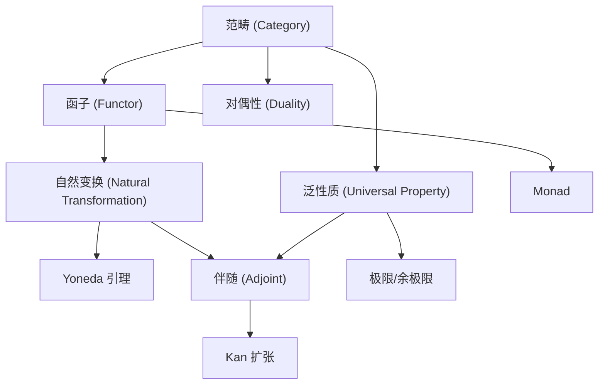
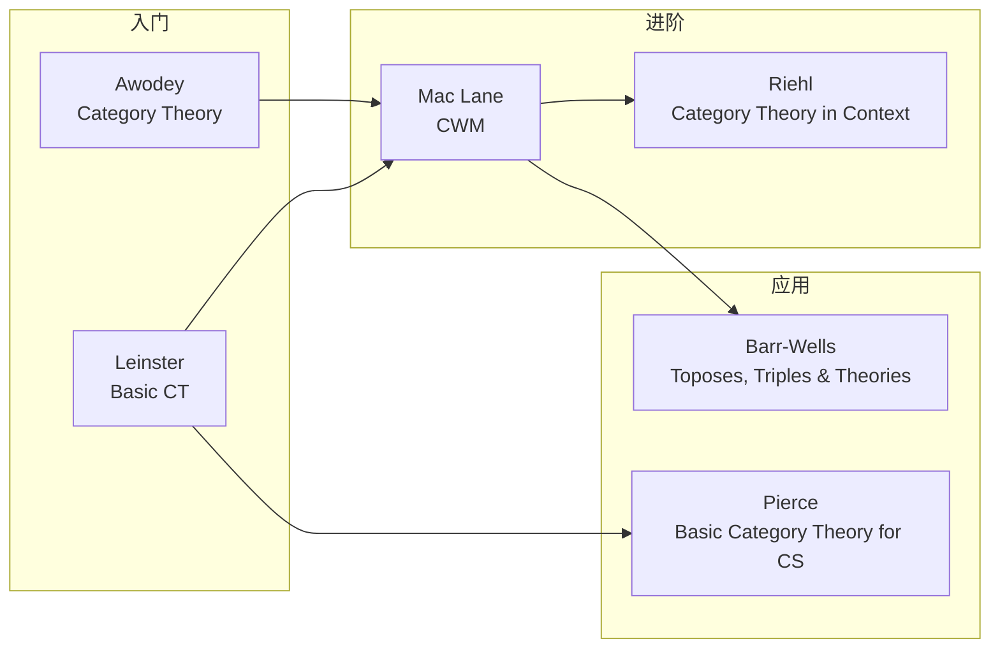

# Category Theory MOC

> [!abstract] 范畴论概览
> 范畴论提供了一种以"关系"为核心的数学语言。以下是本 Vault 中范畴论相关笔记的地图。

## 核心概念

| 概念 | 层级 | 关联领域 |
|:---|:---:|:---|
| [[Category Theory|范畴 (Category)]] | 基础 | 所有数学领域 |
| [[Functor|函子 (Functor)]] | 基础 | 代数拓扑、代数几何 |
| [[Natural Transformation|自然变换 (Natural Transformation)]] | 中阶 | 同调代数、表示论 |
| Yoneda 引理 | 核心 | 所有领域 |
| 伴随 (Adjoint) | 核心 | 泛代数、拓扑 |
| 极限与余极限 (Limit/Colimit) | 中阶 | 代数几何、拓扑 |
| Monad | 进阶 | 计算机科学、代数 |

## 连接图

## 与其他学科的交汇

### 数学分支

| 领域 | 主要概念 | 相关笔记 |
|:---|:---|:---|
| [[Abstract_Algebra/Group|群论]] | 群范畴 $\mathbf{Grp}$、表示函子 | [[Abstract_Algebra/Group Homomorphisms]] |
| 线性代数 | $\mathbf{Vect}_k$、对偶、张量积 | [[Linear_Algebra/Tensor Products]], [[Linear_Algebra/Dual Space]] |
| 拓扑学 | $\mathbf{Top}$、基本群、同调 | — |
| 逻辑学 | Curry-Howard、Topos | [[Lambda Calculus]] |
| 代数几何 | 层、Scheme、Grothendieck 拓扑 | — |
| 集合论 | $\mathbf{Set}$、幂集函子 | [[Set_Theory/Cartesian product]] |

### 计算机科学

| 概念 | 范畴论解释 |
|:---|:---|
| 类型与函数 | 笛卡尔闭范畴的对象与态射 |
| 多态 (Polymorphism) | 参数多态 = 自然变换 |
| Functor (Haskell) | $fmap$ = 自函子上的态射映射 |
| Monad (Haskell) | 自函子上的幺半群 |
| Applicative | Lax monoidal 函子 |
| Lens | CoYoneda + Store comonad |

### 物理

| 概念 | 范畴论解释 |
|:---|:---|
| TQFT | 对称幺半函子 $\mathbf{Cob}_n \to \mathbf{Vect}_k$ |
| 量子纠缠 | 紧凑闭范畴中的态 |
| 重整化群 | 函子（尺度变化） |

## 推荐阅读路径

## 笔记清单

1. [[Category Theory]] — 核心：定义、例子、泛性质
2. [[Functor]] — 函子：协变/逆变、Monad
3. [[Natural Transformation|自然变换]] — 函子间的映射、函子范畴
4. *待建: 伴随函子 (Adjoint Functor)*
5. *待建: 极限与余极限 (Limits and Colimits)*
6. *待建: Yoneda 引理 (Yoneda Lemma)*
