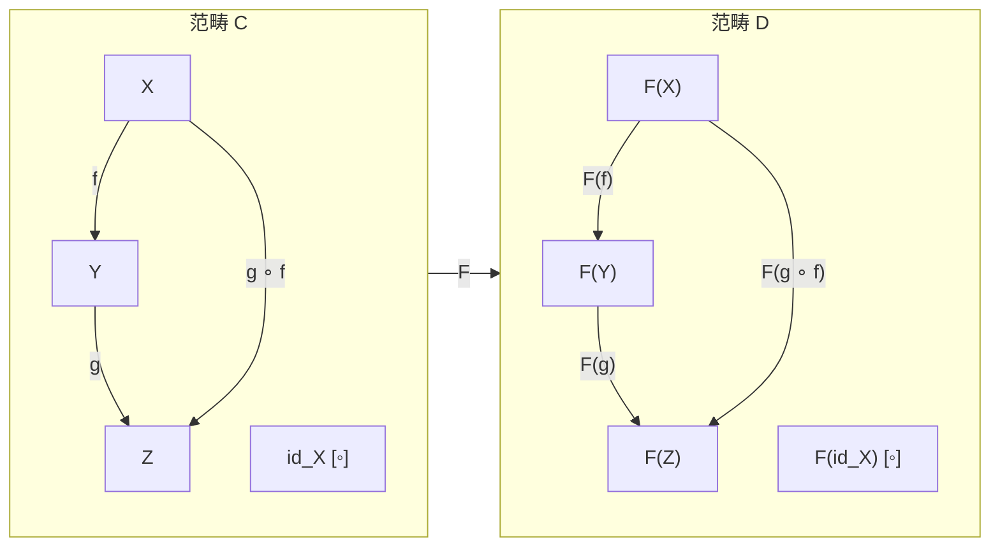
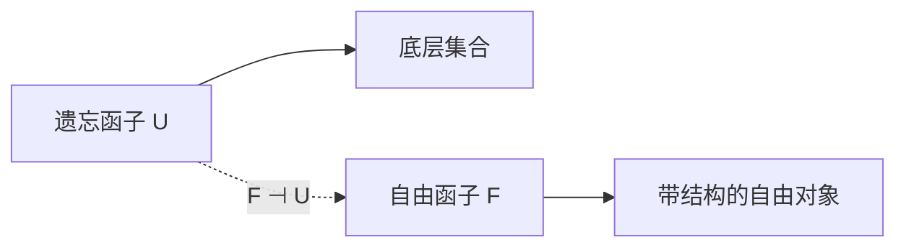
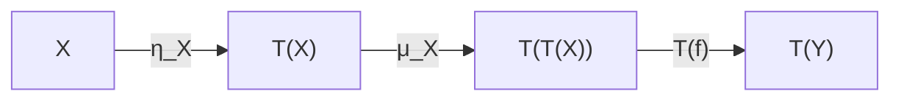

# Functor

> [!abstract] 概述
> **函子 (Functor)** 是范畴之间的"结构保持映射"：将源范畴的对象映到目标范畴的对象、态射映到态射，并保持复合与单位元。函子是范畴论中"把一切放在一起看"的基本工具。

## 定义

> [!definition] 函子
> 从范畴 $\mathcal{C}$ 到 $\mathcal{D}$ 的（协变）**函子** $F: \mathcal{C} \to \mathcal{D}$ 由以下构成：
> - 对象映射：每个 $X \in \operatorname{Ob}(\mathcal{C})$ 对应 $F(X) \in \operatorname{Ob}(\mathcal{D})$
> - 态射映射：每个 $f: X \to Y$ 对应 $F(f): F(X) \to F(Y)$
>
> 满足：
> 1. **保复合**：$F(g \circ f) = F(g) \circ F(f)$
> 2. **保单位元**：$F(\operatorname{id}_X) = \operatorname{id}_{F(X)}$

## 2 协变与逆变

| 类型 | 态射方向 | 复合规则 | 记号 |
|:---|:---|:---|:---|
| **协变 (Covariant)** | $f: X \to Y$ $\mapsto$ $F(f): F(X) \to F(Y)$ | $F(g \circ f) = F(g) \circ F(f)$ | $F: \mathcal{C} \to \mathcal{D}$ |
| **逆变 (Contravariant)** | $f: X \to Y$ $\mapsto$ $F(f): F(Y) \to F(X)$ | $F(g \circ f) = F(f) \circ F(g)$ | $F: \mathcal{C}^{\operatorname{op}} \to \mathcal{D}$ |

> [!example] 逆变的典型例子
> - $\operatorname{Hom}(-, A): \mathcal{C}^{\operatorname{op}} \to \mathbf{Set}$ 将 $X$ 映为 $\operatorname{Hom}(X, A)$
> - 对偶空间 $(-)^*: \mathbf{Vect}_k^{\operatorname{op}} \to \mathbf{Vect}_k$
> - 层空间 $\Gamma(-, \mathcal{F}): \mathbf{Top}^{\operatorname{op}} \to \mathbf{Set}$

## 3 函子的例子

### 3.1 常见函子

| 函子 | 源范畴 $\to$ 目标范畴 | 作用方式 |
|:---|:---|:---|
| 遗忘函子 | $\mathbf{Grp} \to \mathbf{Set}$ | 忘记群结构，只保留底层集合 |
| 自由群函子 | $\mathbf{Set} \to \mathbf{Grp}$ | 集合生成自由群 |
| 基本群 $\pi_1$ | $\mathbf{Top}_* \to \mathbf{Grp}$ | 拓扑空间到其基本群 |
| 奇异同调 $H_n$ | $\mathbf{Top} \to \mathbf{Ab}$ | 拓扑空间到第 $n$ 个同调群 |
| 幂集函子 $\mathcal{P}$ | $\mathbf{Set} \to \mathbf{Set}$ | 集合到其幂集（协变或逆变） |
| 对偶空间 $(-)^*$ | $\mathbf{Vect}_k^{\operatorname{op}} \to \mathbf{Vect}_k$ | 向量空间到其对偶空间（逆变） |

### 3.2 遗忘函子 (Forgetful Functor)

> [!info]
> 遗忘函子 $U: \mathcal{C} \to \mathbf{Set}$ "忘记" 代数结构，只留下底层集合。在代数中几乎无处不在。它的左伴随通常是"自由构造"。

## 4 特殊类型的函子

| 类型 | 定义 | 重要性 |
|:---|:---|:---|
| **忠实 (Faithful)** | $\operatorname{Hom}(X,Y) \to \operatorname{Hom}(FX,FY)$ 是单射 | 嵌入子范畴 |
| **满 (Full)** | $\operatorname{Hom}(X,Y) \to \operatorname{Hom}(FX,FY)$ 是满射 | 体现结构的全部关系 |
| **本质满 (Essentially Surjective)** | 每个 $D$ 对象同构于某个 $F(C)$ | 覆盖目标范畴 |
| **稠密 (Dense)** | 每个对象是某 $F(C)$ 的余极限 | 生成范畴 |
| **表现函子 (Representable)** | $\operatorname{Hom}(-, A) \cong F$（Yoneda 意义下） | 连接集合值函子与对象 |

> [!tip] 等价性判断
> 函子 $F$ 是**范畴等价**当且仅当 $F$ 同时是忠实、满和本质满的。这是[[Category Theory#4.4 等价与同构|范畴等价]]的等价刻画。

## 5 函子间的操作

### 5.1 复合

函子可以复合：$(G \circ F)(X) = G(F(X))$，复合仍然是函子。这使我们能定义**函子范畴**：

$$
\operatorname{Fun}(\mathcal{C}, \mathcal{D}) = \text{以函子为对象、自然变换为态射的范畴}
$$

### 5.2 图范畴 (Diagram Category)

## 4 Monad

> [!definition] Monad
> 范畴 $\mathcal{C}$ 上的 **Monad** 由一个函子 $T: \mathcal{C} \to \mathcal{C}$ 和两个自然变换构成：
> - **单位 (Unit)**：$\eta: \operatorname{Id}_{\mathcal{C}} \Rightarrow T$
> - **乘 (Multiplication)**：$\mu: T \circ T \Rightarrow T$
>
> 满足结合律 $\mu \circ T\mu = \mu \circ \mu T$ 和单位律 $\mu \circ T\eta = \operatorname{id}_T = \mu \circ \eta T$。

> [!example] Monad 的例子
> - **Maybe Monad**（Haskell）：$T(X) = X \sqcup \{*\}$，处理失败
> - **List Monad**：$T(X) = X^*$，非确定性
> - **State Monad**：$T(X) = (S \to X \times S)$，带状态的计算
> - **Writer Monad**：$T(X) = X \times M$（其中 $M$ 是幺半群），日志记录
> - **幂集 Monad**：$T(X) = \mathcal{P}(X)$（$\mathbf{Set}$ 上）

> [!quote] Monad 的核心思想
> Monad 是"带额外结构的自函子"——在类型论中，它统一了程序语言中各种"效果"（副作用、失败、非确定性、状态、I/O）的数学建模。

## 相关链接

- [[Category Theory]]
- [[Natural Transformation|自然变换]]
- [[Category_Theory_MOC]]
- [[Lambda Calculus]]
- [[Set_Theory/Cartesian product]]
