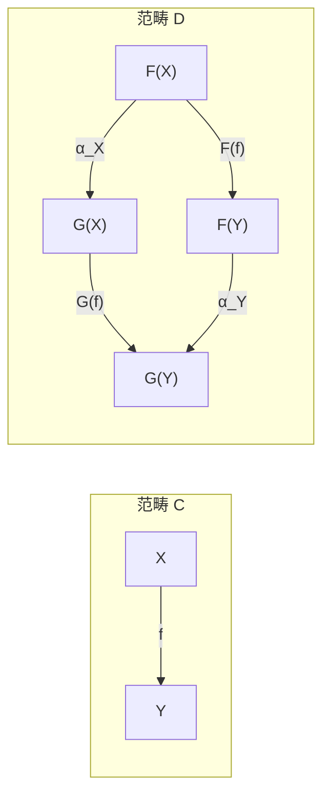

# Natural Transformation

> [!abstract] 概述
> **自然变换 (Natural Transformation)** 是两个函子之间的"映射之映射"：给定平行函子 $F, G: \mathcal{C} \to \mathcal{D}$，自然变换 $\alpha: F \Rightarrow G$ 为每个对象 $X \in \mathcal{C}$ 指派一个态射 $\alpha_X: F(X) \to G(X)$，使得所有"方图交换"。

## 1 定义

> [!definition] 自然变换
> 设 $F, G: \mathcal{C} \to \mathcal{D}$ 是两个（协变）函子。**自然变换** $\alpha: F \Rightarrow G$ 由一族态射 $\{\alpha_X: F(X) \to G(X)\}_{X \in \mathcal{C}}$ 组成，使得对任意 $f: X \to Y$ 在 $\mathcal{C}$ 中，下图交换：
>
> $$
> \begin{CD}
> F(X) @>{F(f)}>> F(Y) \\
> @V{\alpha_X}VV @VV{\alpha_Y}V \\
> G(X) @>>{G(f)}> G(Y)
> \end{CD}
> $$
>
> 即 $G(f) \circ \alpha_X = \alpha_Y \circ F(f)$。

> [!tip] 核心精神
> "自然"意味着变换不依赖于特定对象的内部结构——它在整个范畴中协调一致。"自然变换"这个名称来源于"自然的"映射（如向量空间到双对偶空间的嵌入 $V \to V^{**}$）这一直觉。

## 2 "自然性"的哲学意义

> [!quote] Eilenberg & Mac Lane (1945)
> 范畴与函子的引入正是为了定义"自然变换"。一个映射是"自然的"，当它不依赖于任意选择，而是由结构本身唯一确定。

> [!example] 经典的自然变换
> - **双重对偶**：$V \to V^{**}$（有限维向量空间中为自然同构）
> - **行列式**：$\det: \operatorname{GL}_n(-) \Rightarrow (-)^\times$（作为 $\mathbf{Ring}$ 上的自然变换）
> - **基变换**：$H^*(-, \mathbb{R}) \otimes \mathbb{C} \Rightarrow H^*(-, \mathbb{C})$（上同调的系数扩张）
> - **忘却与自由**：自由群 $\to$ 底层集合 $\to$ 自由群（Monad 的单位）
> - **线性映射的转置**：$(-)^T: \operatorname{Hom}(V, W) \to \operatorname{Hom}(W^*, V^*)$

## 3 自然同构

> [!definition] 自然同构 (Natural Isomorphism)
> $\alpha: F \Rightarrow G$ 是**自然同构**，当每个 $\alpha_X$ 在 $\mathcal{D}$ 中都是同构。记作 $F \cong G$。

> [!warning] 重要区分
> **逐点同构** $\not\Rightarrow$ **自然同构**。对所有 $X$ 可能 $F(X) \cong G(X)$，但不存在统一的自然变换使方块交换。"自然"是额外的全局条件。

> [!example] 双重对偶
> - 在 $\mathbf{Vect}_k^{\operatorname{fd}}$（有限维）中，$V \cong V^{**}$ 是**自然同构**
> - 在 $\mathbf{Vect}_k$（无限维）中，$V \cong V^{**}$ **不成立**（后者严格更大）
> - $V \cong V^*$ 在任何非平凡情形下都**不是自然**的（依赖于基的选取）

## 4 操作

### 4.1 竖复合 (Vertical Composition)

$$
\alpha: F \Rightarrow G,\ \beta: G \Rightarrow H \quad\Longrightarrow\quad \beta \circ \alpha: F \Rightarrow H
$$

逐点定义为 $(\beta \circ \alpha)_X = \beta_X \circ \alpha_X$。

### 4.2 横复合 (Horizontal Composition / Godement Product)

$$
\alpha: F \Rightarrow G,\ \beta: H \Rightarrow K \quad\Longrightarrow\quad \beta * \alpha: H \circ F \Rightarrow K \circ G
$$

这是函子复合层面上的自然变换复合。

### 4.3 交换律

竖复合与横复合满足**交换律 (Interchange Law)**：

$$
(\beta' \circ \alpha') * (\beta \circ \alpha) = (\beta' * \beta) \circ (\alpha' * \alpha)
$$

## 5 函子范畴

> [!definition] 函子范畴 (Functor Category)
> 对任意两个范畴 $\mathcal{C}, \mathcal{D}$，**函子范畴** $[\mathcal{C}, \mathcal{D}]$（或 $\operatorname{Fun}(\mathcal{C}, \mathcal{D})$）以函子 $F: \mathcal{C} \to \mathcal{D}$ 为对象、自然变换为态射。

- 自然同构 $\cong$ 函子范畴中的同构
- Yoneda 嵌入 $\mathcal{C} \to [\mathcal{C}^{\operatorname{op}}, \mathbf{Set}]$ 是全忠实函子（Yoneda 引理）
- 若 $\mathcal{D}$ 完备/余完备，则 $[\mathcal{C}, \mathcal{D}]$ 也完备/余完备（极限逐点构造）

## 6 常见自然变换速查

| 名称 | 函子 $F \Rightarrow G$ | 分量 $\alpha_X$ |
|:---|:---|:---|
| 双重对偶 | $\operatorname{Id} \Rightarrow (-)^{**}$ | $v \mapsto (\phi \mapsto \phi(v))$ |
| 交换同构 | $(-) \times A \Rightarrow A \times (-)$ | $(x,a) \mapsto (a,x)$ |
| 结合同构 | $(- \times A) \times B \Rightarrow - \times (A \times B)$ | $((x,a),b) \mapsto (x,(a,b))$ |
| 求值 | $\operatorname{Hom}(A,-) \times A \Rightarrow \operatorname{Id}$ | $(f, a) \mapsto f(a)$ |
| Currying | $\operatorname{Hom}(A \times B, -) \Rightarrow \operatorname{Hom}(A, \operatorname{Hom}(B, -))$ | $f \mapsto (a \mapsto f(a,-))$ |

## 相关链接

- [[Category Theory]]
- [[Functor]]
- [[Category_Theory_MOC]]
- [[Abstract_Algebra/Group Homomorphisms]]
