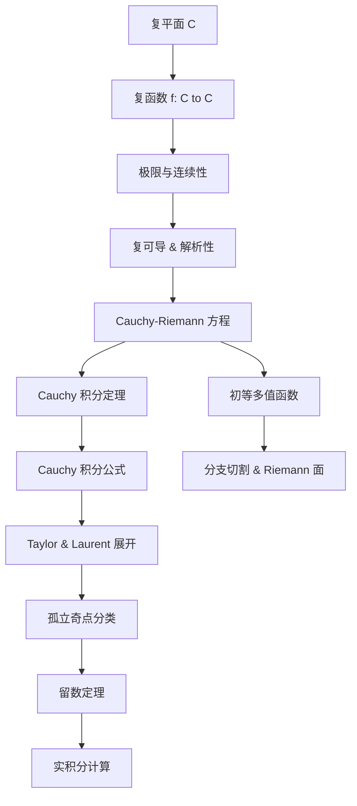
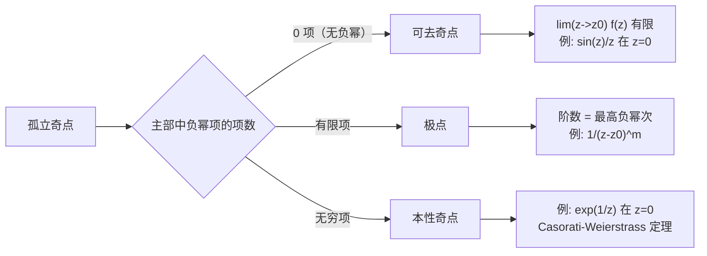
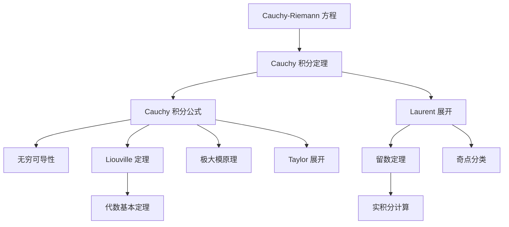

# Complex Analysis

> [!abstract] 概述
> **复分析 (Complex Analysis)** 研究定义在复平面 $\mathbb{C}$ 上的复变函数。它与实分析风格截然不同。在实轴上，可导、无穷可导、解析是三个不同层次；在复平面上，**一次复可导**就蕴含无穷可导、解析展开与 Cauchy 积分公式。这种刚性 (rigidity) 是复分析最深刻的结构特征。本章从 [[Mathematical_Analysis/Complex Field|复数域]] 出发，建立解析函数理论、复积分理论，最终到达留数定理及其在实积分中的应用。

## 概念结构



## 1. 复平面与复函数

### 1.1 复平面 $\mathbb{C}$

复数 $z = x + iy$ 可视为 $\mathbb{R}^2$ 中的点 $(x, y)$。与 [[Mathematical_Analysis/Real Field|实数域]] 不同，$\mathbb{C}$ **不能**成为有序域——$i^2 = -1 < 0$ 会与序公理矛盾。复数的模 $|z| = \sqrt{x^2 + y^2}$ 和共轭 $\overline{z} = x - iy$ 是基本运算。

> [!definition] 复函数
> 复函数 $f: D \subset \mathbb{C} \to \mathbb{C}$ 将复平面上的区域 $D$ 映射到复平面。记 $z = x + iy$，则可拆分为实部与虚部：
> $$f(z) = u(x, y) + i\,v(x, y)$$
> 其中 $u, v: \mathbb{R}^2 \to \mathbb{R}$ 是实值函数。

> [!example] 例 1 — 多项式函数
> $f(z) = z^2$。
> $$f(x + iy) = (x + iy)^2 = (x^2 - y^2) + i(2xy)$$
> 实部 $u(x,y) = x^2 - y^2$，虚部 $v(x,y) = 2xy$。

> [!example] 例 2 — 复指数函数
> $f(z) = e^z = e^{x+iy}$。
> $$e^z = e^x(\cos y + i\sin y)$$
> $u(x,y) = e^x\cos y$，$v(x,y) = e^x\sin y$。关键性质：$e^{z_1+z_2} = e^{z_1}e^{z_2}$，且 $e^{z+2\pi i} = e^z$（纯虚数方向以 $2\pi$ 为周期）。

### 1.2 极限与连续性

> [!definition] 复极限
> 设 $f$ 在 $z_0$ 的某去心邻域内有定义。称 $\lim_{z \to z_0} f(z) = L$，如果：
> $$\forall\varepsilon > 0,\; \exists\delta > 0,\; 0 < |z - z_0| < \delta \implies |f(z) - L| < \varepsilon$$

注意这里 $|z - z_0|$ 是**复平面上的距离**——极限必须在二维邻域中各个方向上都存在且相等，比实轴上只有左右两个方向严格得多。这决定了复可导比实可导强得多的本质原因。连续性的定义与 [[Mathematical_Analysis/continuity|实分析连续性]] 类同：$\lim_{z \to z_0} f(z) = f(z_0)$。

> [!warning] 实分析与复分析的关键差异
> 在 $\mathbb{R}$ 中，$x \to x_0$ 只有从左和从右两种逼近方式；在 $\mathbb{C}$ 中，$z \to z_0$ 有无穷多种逼近方向。这种**多维刚性**是复分析一切强结论的根源。

## 2. 解析函数与 Cauchy-Riemann 方程

### 2.1 复可导性 (Complex Differentiability)

> [!definition] 复导数
> $f$ 在 $z_0$ 处**复可导**，如果下述极限存在：
> $$f'(z_0) = \lim_{\Delta z \to 0} \frac{f(z_0 + \Delta z) - f(z_0)}{\Delta z}$$
> 其中 $\Delta z = \Delta x + i\Delta y$ 是**复数**增量，极限必须在 $\Delta z$ 以任意方式 $\to 0$ 时都相同。

这与 [[Mathematical_Analysis/Differentiability and Continuity|实可导性]] 的形式定义一致，但 $\Delta z$ 是二维增量。当 $\Delta z$ 分别沿实轴 ($\Delta y = 0$) 和虚轴 ($\Delta x = 0$) 趋近时，必须得到相同的极限值，从而导出 Cauchy-Riemann 方程。

### 2.2 Cauchy-Riemann 方程

> [!theorem] Cauchy-Riemann 方程
> 设 $f(z) = u(x,y) + i\,v(x,y)$ 在 $z_0 = x_0 + iy_0$ 处可导，则 $u$ 和 $v$ 在该点的一阶偏导数存在且满足：
> $$\frac{\partial u}{\partial x} = \frac{\partial v}{\partial y},\qquad \frac{\partial u}{\partial y} = -\frac{\partial v}{\partial x}$$

**推导**：取 $\Delta z = \Delta x$（水平方向）：
$$f'(z_0) = \frac{\partial u}{\partial x} + i\frac{\partial v}{\partial x}$$
取 $\Delta z = i\Delta y$（竖直方向）：
$$f'(z_0) = \frac{\partial v}{\partial y} - i\frac{\partial u}{\partial y}$$
令两者相等，分别匹配实部和虚部即得。

> [!tip] 充分条件
> 若 $u, v$ 在 $z_0$ 的邻域内 $C^1$（一阶偏导连续）且满足 C-R 方程，则 $f$ 在 $z_0$ 处复可导。进一步，若 $f$ 在开集上处处复可导，则称 $f$ 在该开集上**解析 (analytic)** 或**全纯 (holomorphic)**。

> [!example] 例 3 — 验证 $f(z) = \overline{z}$ 不解析
> $f(z) = \overline{z} = x - iy$，则 $u = x$，$v = -y$。计算偏导：
> $$\frac{\partial u}{\partial x} = 1,\quad \frac{\partial v}{\partial y} = -1$$
> $1 \neq -1$，C-R 方程不成立，故 $f(z) = \overline{z}$ **处处不可导**。这揭示了复分析的一个深层事实：看似"光滑"的函数（如取共轭）在复意义下甚至不可导。

> [!example] 例 4 — $f(z) = |z|^2$ 仅在 $z=0$ 可导
> $f(z) = |z|^2 = x^2 + y^2 = (x^2 + y^2) + i\cdot 0$，故 $u = x^2 + y^2$，$v = 0$。C-R 方程：
> $$\frac{\partial u}{\partial x} = 2x = \frac{\partial v}{\partial y} = 0 \implies x=0$$
> $$\frac{\partial u}{\partial y} = 2y = -\frac{\partial v}{\partial x} = 0 \implies y=0$$
> 故仅在 $z=0$ 处满足 C-R 方程。但即便如此，该函数在 $z=0$ 的**任意邻域**内不解析——解析性要求在一个开集上可导，而非仅在一个点上。

### 2.3 调和共轭

若 $f = u + iv$ 解析，则 $u$ 和 $v$ 都满足 Laplace 方程 $\Delta u = \Delta v = 0$（即两者都调和）。此时 $v$ 称为 $u$ 的**调和共轭 (harmonic conjugate)**。给定 $u$，可通过 C-R 方程求出 $v$（在单连通区域上，$v$ 在相差一个常数下唯一确定）。

## 3. 初等多值函数

在复平面上，许多"初等"函数并非真正单值——这种**多值性**是复分析独有的丰富现象。

### 3.1 复对数 $\log z$

> [!definition] 复对数
> 设 $z = re^{i\theta} \neq 0$（$r > 0$，$\theta$ 是辐角），则：
> $$\log z = \ln r + i(\theta + 2\pi k),\quad k \in \mathbb{Z}$$
> 即**无穷多值**——辐角可以加任意整数倍的 $2\pi$。

**主支 (principal branch)**：限制 $\theta \in (-\pi, \pi]$，记作 $\operatorname{Log} z$，它是单值解析函数，但沿负实轴有一个跳跃（**分支切割**，branch cut）。

> [!example] 例 5 — $\operatorname{Log}(-1)$
> $-1 = 1 \cdot e^{i\pi}$，故 $\operatorname{Log}(-1) = \ln 1 + i\pi = i\pi$。一般支值为 $i\pi + 2\pi i k$。

> [!warning] 多值函数的陷阱
> 对多值函数，"$\log z_1 z_2 = \log z_1 + \log z_2$" 仅在相差 $2\pi i$ 的整数倍的意义下成立。例如：$\operatorname{Log}(-1 \cdot -1) = \operatorname{Log}(1) = 0$，但 $\operatorname{Log}(-1) + \operatorname{Log}(-1) = 2\pi i$——两者相差 $2\pi i$，来自不同的分支选择。

### 3.2 复幂函数 $z^\alpha$

> [!definition] 复幂
> 对 $\alpha \in \mathbb{C}$，定义 $z^\alpha = e^{\alpha \log z}$。由此继承了 $\log z$ 的多值性。
> - 当 $\alpha$ 为整数时，$z^\alpha$ 是单值的（多值项 $e^{2\pi i \alpha k}$ 恒为 $1$）
> - 当 $\alpha$ 为有理数 $p/q$（既约）时，$q$ 个不同值（$q$ 次单位根旋转）
> - 当 $\alpha$ 为无理数或非实数时，无穷多值

> [!example] 例 6 — $\sqrt{z} = z^{1/2}$
> $$z^{1/2} = e^{\frac{1}{2}\log z} = e^{\frac{1}{2}(\ln r + i\theta + 2\pi i k)} = \sqrt{r}\,e^{i(\theta/2 + \pi k)},\quad k = 0,1$$
> 两个值相差一个符号（$e^{i\pi} = -1$），符合直觉。分支切割常取负实轴。

### 3.3 复三角函数与双曲函数

由欧拉公式 $e^{iz} = \cos z + i\sin z$ 推广：
$$\cos z = \frac{e^{iz} + e^{-iz}}{2},\qquad \sin z = \frac{e^{iz} - e^{-iz}}{2i}$$
$$\cosh z = \frac{e^z + e^{-z}}{2},\qquad \sinh z = \frac{e^z - e^{-z}}{2}$$

> [!tip] 复三角函数失去了有界性
> 在实轴上 $|\cos x| \leq 1$，但在复平面上：
> $$\cos(iy) = \frac{e^{-y} + e^{y}}{2} = \cosh y$$
> 当 $y \to \infty$ 时 $\cos(iy) \to \infty$——复三角函数**无界**。这是 Liouville 定理（见下文）的自然推论：非常数的有界整函数不可能存在，而 $\cos z$ 是整函数，故必无界。

> [!example] 例 7 — $\sin(i)$
> $$\sin(i) = \frac{e^{i\cdot i} - e^{-i\cdot i}}{2i} = \frac{e^{-1} - e}{2i} = i\sinh(1) \approx 1.175i$$

## 4. 复积分与 Cauchy 积分定理

### 4.1 围道积分

> [!definition] 复围道积分
> 设 $\gamma: [a,b] \to \mathbb{C}$ 是分段光滑曲线，$f$ 在 $\gamma$ 上连续。定义：
> $$\int_\gamma f(z)\,dz = \int_a^b f(\gamma(t))\,\gamma'(t)\,dt$$

与 [[Mathematical_Analysis/Definite Integrals|实定积分]] 不同，复积分的路径 $\gamma$ 是在二维平面上的曲线。记 $\gamma$ 为闭合曲线（围道），则 $\oint_\gamma$ 表示沿闭合路径积分。

> [!example] 例 8 — $\oint_{|z|=1} \frac{1}{z}\,dz$
> 取参数化 $z = e^{i\theta}$，$\theta \in [0, 2\pi]$，$dz = ie^{i\theta}d\theta$：
> $$\oint_{|z|=1} \frac{1}{z}\,dz = \int_0^{2\pi} \frac{1}{e^{i\theta}} \cdot ie^{i\theta}\,d\theta = i\int_0^{2\pi} d\theta = 2\pi i$$
> 这是复分析中最基本的围道积分，$2\pi i$ 的出现是所有 Cauchy 理论的起点。

### 4.2 Cauchy 积分定理

> [!theorem] Cauchy 积分定理 (Cauchy-Goursat)
> 设 $f$ 在**单连通**区域 $D$ 内解析，$\gamma$ 是 $D$ 内任一可缩闭曲线，则：
> $$\oint_\gamma f(z)\,dz = 0$$

**直观**：解析函数的积分为零，只要区域没有"洞"。这从 Cauchy-Riemann 方程结合 Green 定理可证（需要 $f'$ 连续），Goursat 则去掉了这一假设。

> [!tip] 推论 — 路径变形不变性
> 若 $f$ 在区域（可以有洞）内解析，则积分值只依赖于路径的**同伦类**——两条在不离开解析区域的条件下可连续变形的闭合曲线给出相同的积分。这为避开奇点提供了灵活性。

**多连通区域推广**：设 $\gamma_1, \dots, \gamma_n$ 是围绕 $n$ 个"洞"的简单闭曲线（方向与外围方向一致），则：
$$\oint_\Gamma f(z)\,dz = \sum_{k=1}^n \oint_{\gamma_k} f(z)\,dz$$
其中 $\Gamma$ 是外边界围道。这相当于将大面积上的积分分解为环绕每个奇点的积分。

## 5. Cauchy 积分公式及其推论

### 5.1 Cauchy 积分公式

> [!theorem] Cauchy 积分公式
> 设 $f$ 在简单闭曲线 $\gamma$ 内部及其上解析，则对 $\gamma$ 内部任一点 $a$：
> $$f(a) = \frac{1}{2\pi i} \oint_\gamma \frac{f(z)}{z - a}\,dz$$

这意味着**解析函数在区域内部的值完全由其边界值决定**——这是复分析独有的"刚性"：边界值唯一确定了内部所有点的函数值。反复求导可得导数的积分公式：
$$f^{(n)}(a) = \frac{n!}{2\pi i} \oint_\gamma \frac{f(z)}{(z - a)^{n+1}}\,dz$$

关键推论：一次复可导 $\implies$ **无穷次可导**（与实分析截然不同）。在实轴上，$f(x) = x^2\sin(1/x)$ 在 $x=0$ 处可导但导数不连续；在复平面上，不存在这样的例子——每个解析函数都是 $C^\infty$ 甚至 $C^\omega$（实解析）。

### 5.2 Liouville 定理与代数基本定理

> [!theorem] Liouville 定理
> 若 $f$ 在 $\mathbb{C}$ 上处处解析（称为**整函数**，entire function）且有界，则 $f$ 必为常数。

**证明思路**：对任意 $a, b \in \mathbb{C}$，取半径为 $R$ 的大圆为围道。由导数积分公式：
$$f'(a) = \frac{1}{2\pi i} \oint_{|z-a|=R} \frac{f(z)}{(z-a)^2}\,dz$$
取模估计：
$$|f'(a)| \leq \frac{1}{2\pi} \cdot \frac{M \cdot 2\pi R}{R^2} = \frac{M}{R}$$
其中 $M$ 是 $|f|$ 的上界。令 $R \to \infty$ 得 $f'(a) = 0$，对所有 $a$ 成立，故 $f$ 为常数。$\square$

> [!theorem] 代数基本定理 (复证明)
> 任意非常数复系数多项式 $P(z) = a_n z^n + \cdots + a_0$（$a_n \neq 0$，$n \geq 1$）在 $\mathbb{C}$ 中至少有一个根。

**证明思路**：反设 $P(z) \neq 0$ 对所有 $z \in \mathbb{C}$ 成立。则 $f(z) = 1/P(z)$ 在 $\mathbb{C}$ 上解析。当 $|z| \to \infty$ 时 $|P(z)| \sim |a_n||z|^n \to \infty$，故 $|f(z)| \to 0$，从而 $f$ 有界。由 Liouville 定理，$f$ 是常数，矛盾。$\square$

代数学基本定理的复证明极其简洁——与代数方法相比，这展示了复分析独有的证明威力：通过积分的有界性估计直接消去所有代数复杂性。

> [!tip] 极大模原理
> 若 $f$ 在区域 $D$ 内解析且非常数，则 $|f(z)|$ 在 $D$ 内**不能**取到极大值（除非 $f$ 为常数）。极大值只能在边界上取到。这一原理与调和函数的极大值原理同源，是 C-R 方程的深刻推论。

## 6. Taylor 展开与 Laurent 展开

### 6.1 Taylor 展开

> [!theorem] Taylor 展开定理
> 设 $f$ 在圆盘 $|z - z_0| < R$ 内解析，则在此圆盘内：
> $$f(z) = \sum_{n=0}^\infty a_n (z - z_0)^n,\qquad a_n = \frac{f^{(n)}(z_0)}{n!} = \frac{1}{2\pi i} \oint_\gamma \frac{f(\zeta)}{(\zeta - z_0)^{n+1}}\,d\zeta$$
> 级数在圆盘内绝对收敛且收敛半径至少为 $R$。

这与实分析中的 Taylor 级数形式相同，但关键差异在于：对解析函数，**级数在其收敛半径内的每一点都收敛到该函数本身**——不存在类似 $f(x) = e^{-1/x^2}$ 这种 $C^\infty$ 但非解析的"病态"例子。在复分析中，$C^1$（甚至一次可导）就保证了 $C^\omega$（实解析性）。

> [!example] 例 9 — $e^z$ 的 Taylor 展开
> $e^z$ 是整函数，收敛半径 $R = \infty$：
> $$e^z = \sum_{n=0}^\infty \frac{z^n}{n!} = 1 + z + \frac{z^2}{2!} + \frac{z^3}{3!} + \cdots$$
> 在 $z=0$ 处展开，对 $\forall z \in \mathbb{C}$ 成立。

### 6.2 Laurent 展开

> [!theorem] Laurent 展开定理
> 设 $f$ 在圆环 $r < |z - z_0| < R$ 内解析，则在此圆环内：
> $$f(z) = \sum_{n=-\infty}^\infty a_n (z - z_0)^n$$
> 其中：
> $$a_n = \frac{1}{2\pi i} \oint_\gamma \frac{f(\zeta)}{(\zeta - z_0)^{n+1}}\,d\zeta,\qquad \forall n \in \mathbb{Z}$$
> $\gamma$ 为圆环内包围 $z_0$ 的任一闭曲线。级数在圆环内绝对收敛。

Laurent 展开引入了**负幂次项**——这些项编码了 $f$ 在 $z_0$ 处的奇点行为。负幂次部分 $\sum_{n=-\infty}^{-1}$ 称为**主部 (principal part)**。

> [!example] 例 10 — $f(z) = \frac{1}{z(1-z)}$ 的 Laurent 展开
> 该函数在 $0 < |z| < 1$ 内解析（奇点位于 $z=0$ 和 $z=1$）。在圆环 $0 < |z| < 1$ 内：
> $$f(z) = \frac{1}{z} \cdot \frac{1}{1-z} = \frac{1}{z}\sum_{n=0}^\infty z^n = \sum_{n=-1}^\infty z^n = \frac{1}{z} + 1 + z + z^2 + \cdots$$
> 主部仅含一项 $a_{-1} = 1$（即留数）。

## 7. 孤立奇点分类

> [!definition] 孤立奇点
> $z_0$ 称为 $f$ 的**孤立奇点**，如果存在某去心邻域 $0 < |z - z_0| < \varepsilon$ 内 $f$ 解析，但在 $z_0$ 处不解析。根据 Laurent 展开的主部可分类如下：



| 类型 | Laurent 主部 | 等价刻画 | 例子 |
|:-----|:------------|:---------|:-----|
| **可去奇点** (removable) | 无（所有 $a_n=0$，$n<0$） | $\lim_{z\to z_0} f(z)$ 存在且有限 | $f(z) = \frac{\sin z}{z}$ 在 $z=0$ |
| **极点** (pole) | 有限项，最高次 $m$ | $\lim_{z\to z_0} |f(z)| = \infty$ | $f(z) = \frac{1}{(z-1)^3}$（三阶极点） |
| **本性奇点** (essential) | 无穷多项负幂 | $\lim_{z\to z_0} f(z)$ 不存在（极其复杂） | $f(z) = e^{1/z}$ 在 $z=0$ |

> [!theorem] Casorati-Weierstrass 定理
> 设 $f$ 在 $z_0$ 处有本性奇点，则对任意 $w \in \mathbb{C} \cup \{\infty\}$，存在序列 $z_n \to z_0$ 使得 $f(z_n) \to w$。换言之，本性奇点附近的像在 $\mathbb{C}$ 中**稠密**——Picard 大定理进一步证明：$f$ 在任意去心邻域内取遍所有复数值（至多有一个例外）。

## 8. 留数定理与实积分的计算

### 8.1 留数与留数定理

> [!definition] 留数 (Residue)
> $f$ 在孤立奇点 $z_0$ 处的**留数** $\operatorname{Res}(f, z_0)$ 是其 Laurent 展开中 $(z - z_0)^{-1}$ 的系数 $a_{-1}$。等价公式：
> - 一阶极点：$\operatorname{Res}(f, z_0) = \lim_{z \to z_0} (z - z_0)f(z)$
> - $m$ 阶极点：$\operatorname{Res}(f, z_0) = \frac{1}{(m-1)!}\lim_{z \to z_0} \frac{d^{m-1}}{dz^{m-1}}\big[(z - z_0)^m f(z)\big]$

> [!theorem] 留数定理
> 设 $f$ 在简单闭曲线 $\gamma$ 内部除有限个孤立奇点 $z_1, \dots, z_k$ 外解析，在 $\gamma$ 上连续，则：
> $$\oint_\gamma f(z)\,dz = 2\pi i \sum_{j=1}^k \operatorname{Res}(f, z_j)$$

**意义**：积分 = $2\pi i \times$ 所有奇点留数之和。这极大简化了复积分的计算——只需找出奇点并计算留数，无需做参数化积分。

### 8.2 应用于实积分

留数定理在实积分计算中有强大的应用。典型策略：将实积分 $\int_{-\infty}^\infty$ 延拓为上半平面（或下半平面）围道积分，使实轴上的积分加上大半圆弧（半径 $R \to \infty$，贡献趋于 0）等于 $2\pi i$ 乘以上半平面奇点的留数和。

```mermaid
graph TD
    A[实积分 int_R f(x)dx] --> B[选取适当围道]
    B --> C[上半平面 / 扇形 / 矩形 / 哑铃形围道]
    C --> D[计算围道内奇点留数和]
    D --> E[取极限: 弧段贡献 -> 0]
    E --> F[实积分 = 2πi × Σ留数]
```

> [!example] 例 11 — $\int_{-\infty}^\infty \frac{1}{1+x^2}\,dx$ 用留数计算
> 考虑 $f(z) = \frac{1}{1+z^2} = \frac{1}{(z-i)(z+i)}$。上半平面内有奇点 $z = i$（一阶极点）。
> $$\operatorname{Res}(f, i) = \lim_{z \to i} (z-i)\frac{1}{(z-i)(z+i)} = \frac{1}{2i}$$
> 以 $[-R, R]$ 和上半圆弧构成围道，当 $R \to \infty$ 时弧段积分 $\to 0$。由留数定理：
> $$\int_{-\infty}^\infty \frac{1}{1+x^2}\,dx = 2\pi i \cdot \frac{1}{2i} = \pi$$
> 这与 $\arctan x\big|_{-\infty}^\infty = \pi$ 一致。

> [!example] 例 12 — $\int_0^\infty \frac{\sin x}{x}\,dx$（Dirichlet 积分）
> 考虑 $f(z) = \frac{e^{iz}}{z}$，沿上半平面半圆形围道（绕开 $z=0$ 的小半圆 + 实轴 + 大半圆）。$z=0$ 是一阶极点，留数为 $1$。大半圆弧由 Jordan 引理贡献 $\to 0$，小半圆（绕奇点）贡献 $-\pi i$。最终：
> $$\int_{-\infty}^\infty \frac{e^{ix}}{x}dx = \pi i \implies \int_{-\infty}^\infty \frac{\sin x}{x}dx = \pi$$
> 由偶函数性质，$\int_0^\infty \frac{\sin x}{x}dx = \frac{\pi}{2}$。这是实分析方法极难直接计算的经典积分。

> [!tip] 留数计算的实用策略
> - **有理函数积分** $\int_{-\infty}^\infty \frac{P(x)}{Q(x)}dx$（$\deg Q \geq \deg P + 2$）：上半平面围道
> - **Fourier 型积分** $\int_{-\infty}^\infty f(x)e^{i\omega x}dx$：利用 Jordan 引理，依 $\omega$ 的符号选择上半或下半平面
> - **有理三角函数积分** $\int_0^{2\pi} R(\cos\theta, \sin\theta)d\theta$：令 $z = e^{i\theta}$ 化为单位圆上的围道积分
> - **涉及支点 (branch point) 的积分**：使用钥匙孔围道 (keyhole contour)，需小心分支切割的位置

## 9. 核心定理关系



## 相关笔记

- [[Mathematical_Analysis/Complex Field]] — $\mathbb{C}$ 的域结构与基本性质，Schwarz 不等式
- [[Mathematical_Analysis/Differentiability and Continuity]] — 实可导性与实连续性
- [[Mathematical_Analysis/limit]] — 极限的 $\varepsilon$-$\delta$ 定义
- [[Mathematical_Analysis/Definite Integrals]] — 实定积分的 Riemann 定义与基本性质
- [[Linear_Algebra/Bilinear Forms]] — 双线性型，与复内积空间 $\langle\cdot,\cdot\rangle$（Hermitian 型）相关
- [[Topology/Topology]] — 开/闭集、连通性、紧性等拓扑概念是复分析的基础语言

## 参考来源

- Ahlfors, L. *Complex Analysis*, 3rd ed., McGraw-Hill 1979.
- Stein, E. & Shakarchi, R. *Complex Analysis*, Princeton University Press 2003.
- Rudin, W. *Real and Complex Analysis*, 3rd ed., McGraw-Hill 1987.
- Needham, T. *Visual Complex Analysis*, Oxford University Press 1997.
