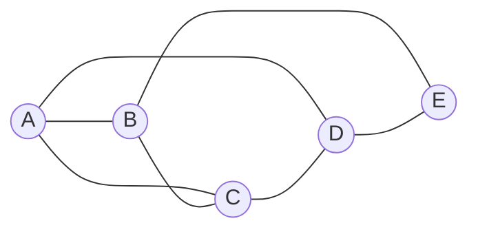
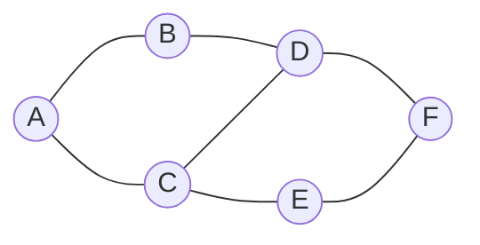
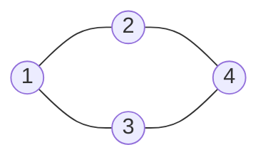
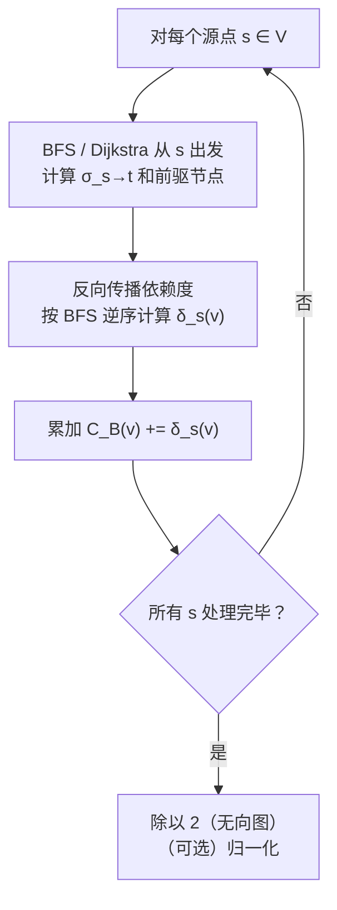
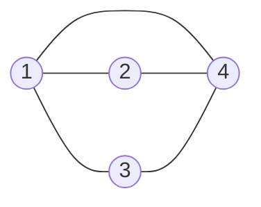
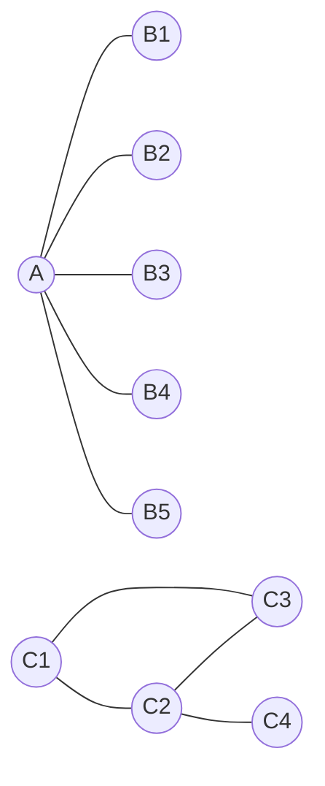
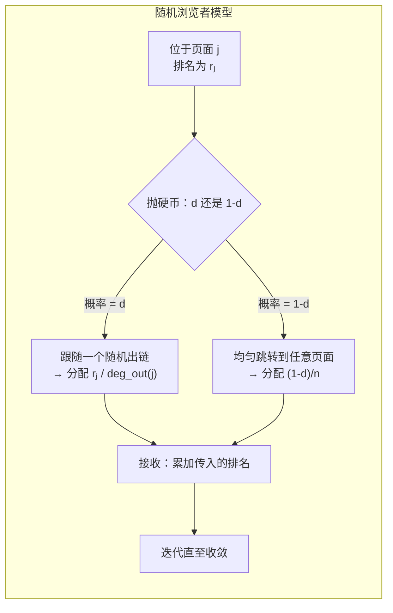
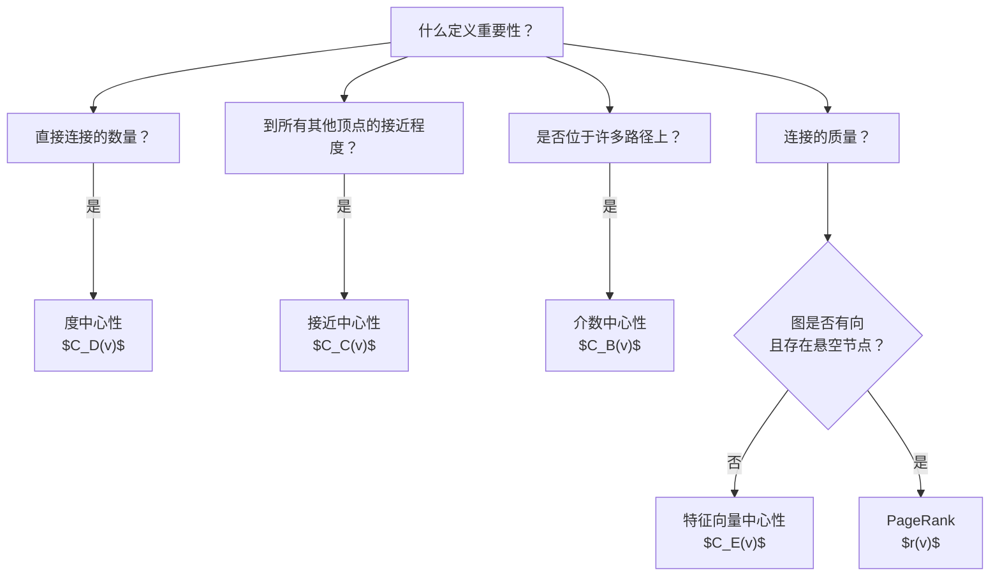

---
tags:
  - Math
  - GraphTheory
  - 概念性
  - 方法性
title: Centrality Measures
created: 2026-07-03
modified:
---

# 图的中心性度量 (Graph Centrality Measures)

> [!info] 来源
> Christopher Griffin, *Applied Graph Theory* (2023), §3.4 中心性导论 & §10.1 特征向量中心性；另见 Bavelas (1950)、Freeman (1978) 关于接近中心性。

---

## 1. 为什么需要中心性？(Why Centrality?)

在图论的许多应用中，我们需要回答一个看似简单的问题：**哪些顶点最重要？**

答案完全取决于"重要性"在特定语境中的含义：

| 语境 | "重要"的含义 |
|:-----|:-------------|
| 社交网络 | 谁的朋友最多？谁连接了不同社群？ |
| 网页搜索 | 哪个页面与查询最相关？ |
| 交通网络 | 哪个机场处理的中转流量最多？ |
| 电网 | 移除哪个变电站会造成最大 disruption？ |
| 引文网络 | 哪篇论文最具影响力？ |
| 流行病学 | 哪个人如果被感染，会最快传播疾病？ |

中心性度量（centrality measures）将顶点重要性的不同概念形式化。**没有一种度量是普遍正确的**——每种度量都捕捉了不同的结构直觉。

> [!tip] 核心见解
> 希腊语 *κέντρον*（kéntron）意为"尖点"或"中心"。在图论中，中心性关注的是寻找图的"中心"——但"中心"的不同定义会给出不同的答案。

**Griffin 的框架（Remark 3.50）：** "在许多情境中，我们希望衡量图中某个顶点的重要性。衡量这一量值的问题通常被称为确定顶点的*中心性*（centrality）。"

本文涵盖五种主要的中心性度量，并预览两种更高级的变体。除特别说明外，均假设图为无向无权图 $G = (V, E)$，其中 $n = |V|$ 为顶点数，$m = |E|$ 为边数。

---

## 2. 度中心性 (Degree Centrality)

### 2.1 定义

**定义 3.51（度中心性，Degree Centrality）**。设 $G = (V, E)$ 为一图。顶点的**度中心性**即为其度：

$$C_D(v) = \deg(v)$$

直觉：拥有更多邻居的顶点比邻居少的顶点更中心。在社交网络中，这等价于"朋友数量"。

**归一化（Normalization）**。为了在不同规模的图之间进行比较，可以归一化到 $[0, 1]$：

$$\hat{C}_D(v) = \frac{\deg(v)}{2|E|} = \frac{\deg(v)}{\sum_{u \in V} \deg(u)}$$

这表达的是度占总度数之和的比例。另一种归一化方式是用 $n - 1$ 做除数（简单图中可能的最大度）：

$$\hat{C}_D'(v) = \frac{\deg(v)}{n - 1}$$

### 2.2 示例

考虑以下图：

**度中心性值：**

| 顶点 | $C_D(v)$ | $\hat{C}_D(v)$ | $\hat{C}_D'(v)$ |
|:----:|:--------:|:--------------:|:---------------:|
| A | 3 | $\frac{3}{10} = 0.30$ | $\frac{3}{4} = 0.75$ |
| B | 3 | $\frac{3}{10} = 0.30$ | $\frac{3}{4} = 0.75$ |
| C | 3 | $\frac{3}{10} = 0.30$ | $\frac{3}{4} = 0.75$ |
| D | 2 | $\frac{2}{10} = 0.20$ | $\frac{2}{4} = 0.50$ |
| E | 1 | $\frac{1}{10} = 0.10$ | $\frac{1}{4} = 0.25$ |

> [!note]
> $A$、$B$ 和 $C$ 具有相同的度中心性，尽管它们在图中的位置不同。这是度中心性的局限——它忽略了直接邻居之外的结构。

### 2.3 性质

| 性质 | 描述 |
|:-----|:-----|
| **复杂度** | 计算所有顶点为 $O(n)$ |
| **范围** | 仅使用直接邻域——纯局部度量 |
| **取值范围** | $[0, n-1]$（原始值）；$[0, 1]$（归一化后） |
| **局限** | 将所有的邻居视为同等价值；忽略全局结构 |

> [!warning]
> 度中心性是最**粗糙**的度量。一个高度数顶点在全局意义上可能是边缘性的（例如，它的所有邻居本身可能度数很低或与图的其他部分不连通）。

---

## 3. 接近中心性 (Closeness Centrality)

### 3.1 定义

**定义（接近中心性，Closeness Centrality）**。设 $G = (V, E)$ 为连通图。顶点 $v$ 的**接近中心性**是 $v$ 到所有其他顶点的测地距离（geodesic distance）之和的倒数：

$$C_C(v) = \frac{1}{\sum_{u \in V \setminus \{v\}} d_G(v, u)}$$

其中 $d_G(v, u)$ 是 $v$ 和 $u$ 之间的最短路径距离（边数）。

直觉：平均而言"接近"所有其他顶点的顶点可以快速到达整个网络——它处于"行动的中心"。

**归一化（Normalization）**。对于具有 $n$ 个顶点的图，当顶点与所有其他顶点距离均为 1（星形中心）时达到最大接近度。归一化版本为：

$$\hat{C}_C(v) = \frac{n - 1}{\sum_{u \in V \setminus \{v\}} d_G(v, u)}$$

该值归一化到 $[0, 1]$，当 $v$ 与所有其他顶点都相邻时 $\hat{C}_C(v) = 1$。

> [!note] 非连通图
> 若 $G$ 不连通，位于不同连通分量中的顶点之间 $d_G(v, u) = \infty$。常见的处理方式：(1) 限定在 $v$ 所在的连通分量内计算，或 (2) 使用调和中心性（harmonic centrality）$\sum_{u \neq v} 1 / d_G(v, u)$（可优雅处理 $\infty$ 情形）。

### 3.2 示例

**计算各顶点到其他顶点的距离：**

| $(v, u)$ | $d(A, u)$ | $d(B, u)$ | $d(C, u)$ | $d(D, u)$ | $d(E, u)$ | $d(F, u)$ |
|:--------:|:---------:|:---------:|:---------:|:---------:|:---------:|:---------:|
| 到 A | — | 1 | 1 | 2 | 2 | 3 |
| 到 B | 1 | — | 2 | 1 | 3 | 2 |
| 到 C | 1 | 2 | — | 1 | 1 | 2 |
| 到 D | 2 | 1 | 1 | — | 2 | 1 |
| 到 E | 2 | 3 | 1 | 2 | — | 1 |
| 到 F | 3 | 2 | 2 | 1 | 1 | — |
| $\sum$ | **9** | **9** | **7** | **6** | **9** | **9** |

**接近中心性（归一化后）：**

| 顶点 | $\sum d_G(v, u)$ | $C_C(v)$ | $\hat{C}_C(v)$ |
|:----:|:---------------:|:--------:|:--------------:|
| A | 9 | 0.111 | $\frac{5}{9} \approx 0.556$ |
| B | 9 | 0.111 | $\frac{5}{9} \approx 0.556$ |
| C | 7 | 0.143 | $\frac{5}{7} \approx 0.714$ |
| D | **6** | **0.167** | **$\frac{5}{6} \approx 0.833$** |
| E | 9 | 0.111 | $\frac{5}{9} \approx 0.556$ |
| F | 9 | 0.111 | $\frac{5}{9} \approx 0.556$ |

> [!tip]
> 顶点 D 的接近中心性最高——它位于一个使得到所有其他顶点的距离之和最小化的"枢纽点"。尽管 D 的度数为 2（低于 C 的度数 3），但在此度量下 D 在全局意义上更中心。

### 3.3 性质

| 性质 | 描述 |
|:-----|:-----|
| **复杂度** | $O(n(m + n \log n))$，通过 Johnson 算法或 Floyd–Warshall 算法（全源最短路径） |
| **范围** | 全局——使用整个图结构 |
| **取值范围** | $[0, (n-1)^{-1}]$（原始值）；$[0, 1]$（归一化后） |
| **局限** | 要求图为连通图；对图的微小变化敏感 |

---

## 4. 介数中心性 (Betweenness Centrality)

### 4.1 定义

**定义 3.53（测地/介数中心性，Geodesic / Betweenness Centrality）**。设 $G = (V, E)$ 为一图。顶点 $v \in V$ 的**介数中心性**（也称测地中心性）是所有其他顶点对之间的最短路径中经过 $v$ 的比例：

$$C_B(v) = \sum_{s \neq t \neq v} \frac{\sigma_{st}(v)}{\sigma_{st}}$$

其中：
- $\sigma_{st}$——$s$ 与 $t$ 之间的最短路径总数
- $\sigma_{st}(v)$——这些最短路径中包含 $v$ 的数目

直觉：若一个顶点位于许多其他顶点之间的最短路径上，它扮演着**桥梁**或**瓶颈**的角色。移除该顶点会使许多顶点对之间不再连通。

> [!quote] Griffin, Remark 3.55
> "从这一分析可以清楚地看出，若割点（cut vertex）连接图的两个大分量，则其应具有较高的测地中心性。因此，从某些度量标准来看，割点是图中非常重要的元素。"

**归一化（Normalization）**。对于具有 $n$ 个顶点的图，当 $v$ 位于所有 $\binom{n-1}{2}$ 个顶点对之间的所有最短路径上时达到最大介数：

$$\hat{C}_B(v) = \frac{2}{(n-1)(n-2)} \cdot C_B(v)$$

该值归一化到 $[0, 1]$。

### 4.2 示例

考虑 Griffin 图 3.9 中使用的图：

**介数计算：**

| 顶点对 | 路径 | $\sigma_{st}$ | 1 | 2 | 3 | 4 |
|:------:|:-----|:-------------:|:-:|:-:|:-:|:-:|
| (1,2) | 1–2 | 1 | — | — | 0 | 0 |
| (1,3) | 1–3 | 1 | — | 0 | — | 0 |
| (1,4) | 1–2–4, 1–3–4 | 2 | — | $\frac12$ | $\frac12$ | — |
| (2,3) | 2–1–3 | 1 | 0 | — | — | 0 |
| (2,4) | 2–4 | 1 | 0 | — | 0 | — |
| (3,4) | 3–4 | 1 | 0 | 0 | — | — |
| **$C_B(v)$** | | | **0** | **$\frac12$** | **$\frac12$** | **0** |

归一化后：$\hat{C}_B(1) = 0$，$\hat{C}_B(2) = \frac12$，$\hat{C}_B(3) = \frac12$，$\hat{C}_B(4) = 0$。

> [!note]
> 顶点 2 和 3 的介数最高——它们是位于顶点 1 和 4 之间最短路径上的唯一顶点。顶点 1 和 4 作为端点，从不出现在其他顶点之间的最短路径上。

### 4.3 Brandes 算法

通过枚举所有点对的最短路径来计算 $C_B(v)$ 的复杂度为 $O(n^3)$。**Brandes 算法**（2001）能够在 $O(nm + n^2 \log n)$ 时间内计算加权图中所有顶点的介数中心性（无权图 $O(nm)$）。

**核心思想（Brandes 算法）：** 对每个源顶点 $s$，执行 BFS（无权图）或 Dijkstra（加权图）以计算：
1. 从 $s$ 到每个 $t$ 的最短路径数量 $\sigma_{s \to t}$
2. $s$ 对每个 $v$ 的**依赖度**（dependency）：$\delta_{s}(v) = \sum_{t} \frac{\sigma_{sv}}{\sigma_{st}} \cdot (1 + \delta_s(t))$

然后累加：$C_B(v) = \sum_{s \neq v} \delta_s(v)$。

> [!tip] 复杂度
> Brandes 算法：$O(nm)$（无权图），$O(nm + n^2 \log n)$（加权图）。朴素方法：$O(n^3)$。

### 4.4 性质

| 性质 | 描述 |
|:-----|:-----|
| **复杂度** | $O(nm)$（无权图，使用 Brandes 算法） |
| **范围** | 全局——捕捉桥梁/瓶颈角色 |
| **取值范围** | $[0, \binom{n-1}{2}]$（原始值）；$[0, 1]$（归一化后） |
| **局限** | 假设信息沿最短路径传播（并非总是符合现实） |

> [!warning] 边介数（Edge Betweenness）
> 一个相关的度量——**边介数**（edge betweenness），将相同的思想应用于边而非顶点：经过某条边的最短路径的比例。边介数是 Girvan–Newman 社区检测算法的基础。

---

## 5. 特征向量中心性 (Eigenvector Centrality)

### 5.1 定义

**推导 10.3（特征向量中心性，Eigenvector Centrality，源于 Spizzirri）。** 与度中心性（统计邻居数量）不同，特征向量中心性基于以下思想对每个顶点评分：**重要性是自我指涉的**——重要的顶点是因为它们与其他重要的顶点相连。

> [!quote] Griffin
> "重要的顶点之所以重要，恰恰是因为它们与其他重要的顶点相邻。（这是高中里'近朱者赤'的概念。）"

令 $x_i$ 为顶点 $v_i$ 的中心性得分。将 $x_i$ 定义为其邻居得分的（缩放）和：

$$x_i = \frac{1}{\lambda} \sum_{v_j \in N(v_i)} x_j = \frac{1}{\lambda} \sum_{j=1}^n M_{ij} x_j$$

其中 $M$ 是邻接矩阵（adjacency matrix），$\lambda$ 是内生确定的常数。矩阵形式为：

$$\lambda x = M x \quad \Longrightarrow \quad M x = \lambda x$$

因此，$x$ 是 $M$ 的一个**特征向量**（eigenvector），$\lambda$ 是其**特征值**（eigenvalue）。

**取哪一个特征向量？** 根据 Perron–Frobenius 定理，连通图的邻接矩阵具有唯一的模最大特征值 $\lambda_1$，且对应的特征向量 $x$ 的所有分量均为正。这就是 **Perron–Frobenius 特征向量**，它定义了特征向量中心性 $C_E(v)$：

$$C_E(v_i) = x_i \quad \text{其中 } M x = \lambda_1 x,\; x_i > 0$$

**归一化（Normalization）。** 特征向量中心性通常归一化为分量和为 1：

$$\hat{C}_E(v_i) = \frac{x_i}{\sum_j x_j}$$

### 5.2 示例及与度中心性的比较

考虑 Griffin 图 10.1 中的图：

**邻接矩阵：**

$$M = \begin{bmatrix}
0 & 1 & 1 & 1 \\
1 & 0 & 0 & 1 \\
1 & 0 & 0 & 1 \\
1 & 1 & 1 & 0
\end{bmatrix}$$

**特征值：** $\lambda_1 = \frac12(1 + \sqrt{17}) \approx 2.562$，$\lambda_2 = \frac12(1 - \sqrt{17}) \approx -1.562$，$\lambda_3 = -1$，$\lambda_4 = 0$。

**特征向量中心性（Perron–Frobenius 特征向量，归一化后）：**

$$\hat{C}_E \approx [0.28,\; 0.22,\; 0.22,\; 0.28]$$

**度中心性与特征向量中心性对比：**

| 顶点 | $C_D(v)$ | $\hat{C}_D(v)$（归一化） | $\hat{C}_E(v)$ | 度排名 | 特征向量排名 |
|:----:|:--------:|:-----------------------:|:--------------:|:------:|:----------:|
| 1 | 3 | 0.75 | **0.28** | 1 | 1 |
| 2 | 2 | 0.50 | 0.22 | 2 | 2 |
| 3 | 2 | 0.50 | 0.22 | 2 | 2 |
| 4 | 3 | 0.75 | **0.28** | 1 | 1 |

> [!tip]
> 在此例中，度中心性和特征向量中心性的排名一致。但在某些情况下它们会**不一致**——比如一个顶点有许多低地位的邻居（高度数、低特征向量），或者有少数高地位的邻居（低度数、高特征向量）。

**游走解释（Griffin Remark 10.6）：** 令 $e_i$ 为第 $i$ 个标准基向量。那么 $(M^k e_i)_j$ 统计了从 $v_j$ 到 $v_i$ 长度为 $k$ 的游走（walk）数量。当 $k \to \infty$ 时：

$$\lim_{k \to \infty} \frac{M^k e_i}{\lambda_1^k} \propto x$$

因此，特征向量中心性正比于到达每个顶点的**长游走**的数量——到达某一顶点的长路径越多，该顶点越中心。

### 5.3 度中心性与特征向量中心性不一致的情形

考虑一个图，其中某个顶点有许多邻居，但这些邻居本身都是外围顶点：

| 顶点 | $C_D$ | $C_E$（近似） | 解释 |
|:----:|:-----:|:-------------:|:-----|
| A | 5 | 低 | 高度数，但邻居都是死胡同 |
| C1 | 2 | 高 | 低度数，但连接到高度互联的簇 |
| C2 | 3 | 高 | 紧密子图内部的枢纽 |
| B1–B5 | 1 | 非常低 | 附着在低地位顶点上的叶子 |

> [!note]
> 特征向量中心性更加**细腻**：它"惩罚"那些邻居连接不佳的顶点，即使这些顶点拥有大量邻居。这就是 PageRank（特征向量中心性的扩展）在网页搜索中优于简单度计数的原因。

### 5.4 性质

| 性质 | 描述 |
|:-----|:-----|
| **复杂度** | 每次幂迭代 $O(m)$；通常 $O(\log n)$ 次迭代收敛 |
| **范围** | 全局，具有"涟漪"效应 |
| **取值范围** | 取决于归一化方式；所有分量均为正 |
| **要求** | 图必须连通（或不可约），以保证唯一的正特征向量 |
| **局限** | 对稠密子图敏感；可能被单个高度数枢纽主导 |

---

## 6. Katz 中心性与 PageRank 预览 (Katz / PageRank Preview)

两种重要的变体扩展了特征向量中心性以处理实际问题。

### 6.1 Katz 中心性 (Katz Centrality)

由 Leo Katz（1953）提出，Katz 中心性为每个顶点添加一个小的常数"奖励"项 $\beta$，确保即使入度为零的顶点（在有向图中）也能获得正分数：

$$C_{\text{Katz}}(v_i) = \alpha \sum_{j} M_{ij} \, C_{\text{Katz}}(v_j) + \beta$$

矩阵形式：$x = \alpha M x + \beta \mathbf{1}$，解得：

$$x = \beta (I - \alpha M)^{-1} \mathbf{1}$$

其中 $\alpha$ 为衰减因子（attenuation factor，$0 < \alpha < 1 / \lambda_1$），$\beta$ 控制基准中心性（base centrality）。

> [!quote] Griffin（章节注释，§3.5）
> "Katz 中心性……类似于 PageRank 中心性，我们将在后续章节中讨论。"

### 6.2 PageRank

由 Brin 和 Page（1998）为 Google 搜索引擎开发，PageRank 通过**出度归一化**和**阻尼因子** $d$（通常 $d = 0.85$）修改了 Katz 中心性：

$$r_i = \frac{1-d}{n} + d \sum_{j: (j,i) \in E} \frac{r_j}{\deg_{\text{out}}(j)}$$

这模拟了一个随机网络浏览者（random surfer），他以概率 $d$ 跟随链接，以概率 $1 - d$ "跳转"（teleport）到一个随机页面。

**与特征向量中心性的关键区别：**

| 方面 | 特征向量中心性 | PageRank |
|:-----|:-------------|:---------|
| 邻居贡献方式 | $\sum M_{ij} x_j$ | $\sum \frac{M_{ij}}{\deg_{\text{out}}(j)} r_j$ |
| 阻尼 | 无 | 有（$d = 0.85$） |
| 连通性要求 | 图必须连通 | 可处理悬空节点（dangling nodes） |
| 跳转机制 | 无 | 有（均匀跳转） |

> [!seealso]
> 关于 PageRank 和马尔可夫链（Markov chain）公式的完整讨论，请参见 [[Random Walks & PageRank]]。

---

## 7. 对比表 (Comparison Table)

| 度量 | 符号 | 衡量内容 | 局部/全局 | 原始取值范围 | 复杂度 | 核心直觉 |
|:-----|:----:|:---------|:---------:|:-----------:|:------:|:---------|
| **度中心性** | $C_D(v)$ | 邻居数量 | 局部 | $[0, n-1]$ | $O(n)$ | "有多少朋友？" |
| **接近中心性** | $C_C(v)$ | 到所有其他顶点的总距离的倒数 | 全局 | $(0, 1/(n-1)]$ | $O(n(m + n \log n))$ | "我多快能到达每个人？" |
| **介数中心性** | $C_B(v)$ | 经过 $v$ 的最短路径比例 | 全局 | $[0, \binom{n-1}{2}]$ | $O(nm)$（Brandes） | "我控制了多少座桥？" |
| **特征向量中心性** | $C_E(v)$ | 邻居中心性之和（自我指涉） | 全局 | 正特征向量分量 | $O(m \cdot \text{iter})$ | "我的朋友是谁？"（质量重要） |
| **Katz 中心性** | $C_K(v)$ | 特征向量 + 常数基准中心性 | 全局 | 正数 | $O(n^3)$（直接求解）或迭代 | "带有底线的特征向量" |
| **PageRank** | $r(v)$ | 随机浏览者的平稳分布 | 全局 | $[0, 1]$ | $O(m \cdot \text{iter})$ | "随机浏览者最终会到哪里？" |

### 何时使用哪种度量

### 快速参考：优势与劣势

| 度量 | 优势 | 劣势 |
|:-----|:-----|:-----|
| $C_D$ | 快速、直观 | 忽略全局结构 |
| $C_C$ | 捕捉全局位置 | 不适用于非连通图 |
| $C_B$ | 识别桥梁/瓶颈 | 假设最短路径路由 |
| $C_E$ | 通过邻居质量区分 | 需连通图，可能被主导 |
| PageRank | 处理真实网络图 | 参数 $d$ 有些任意 |

> [!warning]
> 中心性度量之间**相关但不相同**。在许多真实图中，度中心性和特征向量中心性呈中等程度相关（$\rho \approx 0.5\text{--}0.8$），但异常值——即在一种度量上排名高而在另一种上排名低的顶点——通常是结构上最有趣的。

---

## 符号速查

| 符号 | 含义 |
|:-----|:-----|
| $C_D(v)$ | 度中心性（Degree Centrality），即 $\deg(v)$ |
| $C_C(v)$ | 接近中心性（Closeness Centrality） |
| $C_B(v)$ | 介数中心性 / 测地中心性（Betweenness / Geodesic Centrality） |
| $C_E(v)$ | 特征向量中心性（Eigenvector Centrality） |
| $\hat{C}(v)$ | 归一化后的中心性值 |
| $\sigma_{st}$ | 从 $s$ 到 $t$ 的最短路径总数 |
| $\sigma_{st}(v)$ | 从 $s$ 到 $t$ 且经过 $v$ 的最短路径数 |
| $d_G(v, u)$ | 在 $G$ 中 $v$ 到 $u$ 的最短距离 |
| $M$ | 邻接矩阵（Adjacency Matrix） |
| $\lambda_1$ | 邻接矩阵的最大特征值（Perron–Frobenius eigenvalue） |
| $d$ | PageRank 阻尼因子（通常 $d = 0.85$） |

---

## 相关链接

- [[Walks, Cycles & Connectivity]] — 路径、回路、图论基本性质
- [[Adjacency Matrix & Spectrum]] — 邻接矩阵与谱图理论
- [[Random Walks & PageRank]] — 随机游走与 PageRank 详解
- [[Laplacian & Spectral Clustering]] — 拉普拉斯矩阵与谱聚类

> [!seealso] 延伸阅读
> - **Griffin (2023), §3.4** — 度中心性与测地（介数）中心性
> - **Griffin (2023), §10.1** — 特征向量中心性的推导与示例
> - **Griffin (2023), §10.2–10.3** — 马尔可夫链、随机游走、PageRank
> - **Freeman (1978)** — "Centrality in Social Networks: Conceptual Clarification"（统一度/接近/介数中心性的开创性论文）
> - **Brandes (2001)** — "A Faster Algorithm for Betweenness Centrality"
> - **Newman (2010)** — *Networks: An Introduction*（中心性度量的详尽论述）

---
