---
tags:
  - Math
  - GraphTheory
  - 定义性
  - 基本原理
title: 度序列与子图 (Degree Sequences & Subgraphs)
created: 2026-07-03
modified:
---
# 度序列与子图 (Degree Sequences & Subgraphs)

> [!info] 来源
> Christopher Griffin, *Applied Graph Theory* (2023), 第 2 章：度序列与子图

## 1. 度序列 (Degree Sequences)

### 1.1 度序列的定义

**定义 2.1 (度序列, Degree Sequence).** 设 $G = (V, E)$ 是一个图，$V = \{v_1, v_2, \dots, v_n\}$。图 $G$ 的**度序列**是其各顶点度数按非增顺序排列的列表：

$$\deg(v_1) \ge \deg(v_2) \ge \cdots \ge \deg(v_n)$$

等价地，它是降序排列的有序 $n$ 元组 $(\deg(v_1), \deg(v_2), \dots, \deg(v_n))$。

> 有些文献将度序列写作无序多重集。Griffin (2023) 中的惯例是排序后的降序列表。

**示例.**

| 图 | 度序列 | 说明 |
|:------|:----------------|:-------------|
| $K_4$（4 个顶点的完全图） | $(3, 3, 3, 3)$ | 每个顶点与其他 3 个顶点相连 |
| $P_4$（4 个顶点的路） | $(2, 2, 1, 1)$ | 两个端点 (deg 1)，两个内部顶点 (deg 2) |
| $C_5$（5 个顶点的圈） | $(2, 2, 2, 2, 2)$ | 每个顶点的度数均为 2 |
| $K_{3,3}$（完全二分图） | $(3, 3, 3, 3, 3, 3)$ | 所有顶点的度数均为 3 |

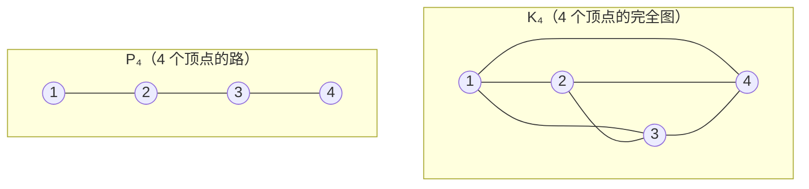

> **符号**：$\deg(v)$ 表示顶点 $v$ 的度数。对图 $G$，$\Delta(G) = \max_{v \in V} \deg(v)$ 称为**最大度 (maximum degree)**，$\delta(G) = \min_{v \in V} \deg(v)$ 称为**最小度 (minimum degree)**。

### 1.2 握手引理 (Handshaking Lemma)

**定理 2.2 (握手引理, Handshaking Lemma).** 设 $G = (V, E)$ 是一个图，则：

$$\sum_{v \in V} \deg(v) = 2|E|$$

> *证明.* 每条边 $\{u, v\}$ 对 $\deg(u)$ 贡献 1，对 $\deg(v)$ 贡献 1。自环 $\{v\}$ 对 $\deg(v)$ 贡献 2（由定义 1.13）。对所有顶点求和时，每条边恰好被计数两次。因此度数之和等于 $2|E|$。

**推论 2.2.1.** 在任何图中，度数为奇数的顶点个数为偶数。

> *证明.* 设 $V_{\text{odd}}$ 为度数为奇数的顶点集，$V_{\text{even}}$ 为度数为偶数的顶点集，则：
> $$2|E| = \sum_{v \in V_{\text{odd}}} \deg(v) + \sum_{v \in V_{\text{even}}} \deg(v)$$
> 右边为偶数。$\sum_{v \in V_{\text{even}}} \deg(v)$ 为偶数（偶数之和）。因此 $\sum_{v \in V_{\text{odd}}} \deg(v)$ 也必为偶数。由于该和中的每一项都是奇数，项数 $|V_{\text{odd}}|$ 必须为偶数。

> [!tip] 直观理解
> 握手引理得名于如下场景：若聚会中人们相互握手，则握手总次数（边数）等于每个人握手次数（度数）之和的一半。该推论告诉我们：握了奇数次手的人数总是偶数。

**示例.**

| 图 | $\sum \deg(v)$ | $|E|$ | 验证 |
|:------|:---------------|:------|:-------------|
| $K_4$ | $3+3+3+3 = 12$ | 6 | $12 = 2 \times 6$ ✓ |
| $P_4$ | $1+2+2+1 = 6$ | 3 | $6 = 2 \times 3$ ✓ |
| $C_5$ | $2 \times 5 = 10$ | 5 | $10 = 2 \times 5$ ✓ |

### 1.3 图序列 (Graphic Sequences)

**定义 (图序列, Graphic Sequence).** 非负整数的非增序列 $d_1 \ge d_2 \ge \cdots \ge d_n$ 称为**可图的**（即存在一个**图序列**），若存在一个简单图（无自环、无重边）其度序列恰好为 $(d_1, d_2, \dots, d_n)$。

并非每个非增整数序列都能实现为某个简单图的度序列。

> [!example] 反例
> 序列 $(3, 3, 1, 1)$ **不是**图序列。由握手引理，其和为 $3+3+1+1 = 8$，因此任何图都有 $|E| = 4$。但 4 个顶点的简单图最多有 $\binom{4}{2} = 6$ 条边——问题更为微妙。要拥有两个度数为 3 的顶点，每个都必须与所有其他 3 个顶点相连，但这样剩下的两个顶点各自度数至少为 2，与度数为 1 矛盾。

**定理 2.3 (Havel–Hakimi 定理).** 非负整数的非增序列 $d_1 \ge d_2 \ge \cdots \ge d_n$（其中 $n \ge 2$）是图序列，当且仅当将序列

$$d_2 - 1, \; d_3 - 1, \; \dots, \; d_{d_1+1} - 1, \; d_{d_1+2}, \; \dots, \; d_n$$

重新排序为非增顺序后得到的序列是图序列。

> *证明思路.* 若某序列是图序列，取最大度 $d_1$ 对应的顶点 $v$。它必须与 $d_1$ 个其他顶点相邻。通过适当的图变换，我们可以假设它与度数次大的 $d_1$ 个顶点相邻。移除 $v$ 并递减这些顶点的度数，得到长度为 $n-1$ 的图序列。反之，通过加回 $v$ 构造原图。

**算法 (Havel–Hakimi 算法).**

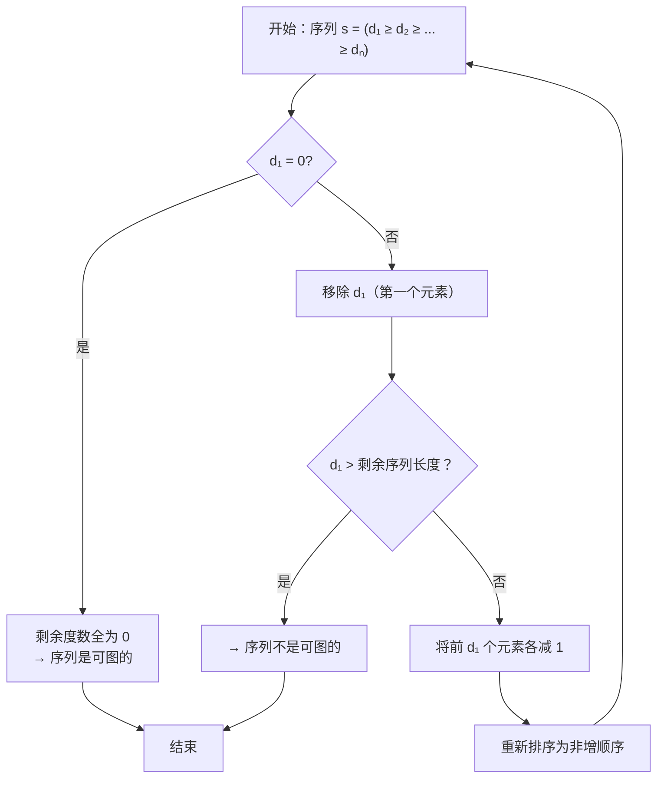

**示例：$(3, 3, 2, 2, 2)$ 是图序列吗？**

| 步骤 | 序列 | 操作 |
|:-----|:---------|:-------|
| 1 | $(3, 3, 2, 2, 2)$ | 原序列；$d_1 = 3$ |
| 2 | $(2, 1, 1, 2)$ | 移除 3，前 3 项各减 1: $(3-1, 2-1, 2-1, 2) = (2, 1, 1, 2)$ |
| 3 | $(2, 2, 1, 1)$ | 重新排序 |
| 4 | $(1, 0, 1)$ | $d_1 = 2$，移除，前 2 项各减 1: $(2-1, 1-1, 1) = (1, 0, 1)$ |
| 5 | $(1, 1, 0)$ | 重新排序 |
| 6 | $(0, 0)$ | $d_1 = 1$，移除，前 1 项减 1: $(1-1, 0) = (0, 0)$ |
| 7 | $(0, 0)$ | 重新排序（已排好） |
| 8 | — | $d_1 = 0$ → 序列**是可图的** ✓ |

> [!check] 验证
> 实现 $(3, 3, 2, 2, 2)$ 的图是一个**5 顶点图**，其中两个度数为 3 的顶点与所有其他顶点相连，三个度数为 2 的顶点彼此构成三角形——即 $K_5$ 减去一个完美匹配 (perfect matching)。

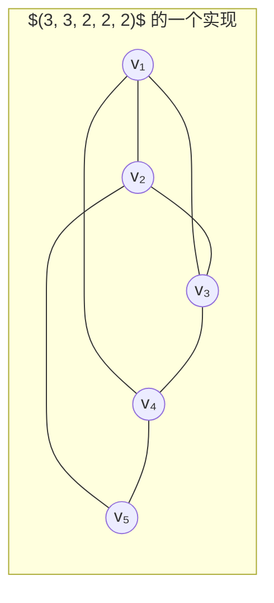

> $\deg(v_1) = 3$，$\deg(v_2) = 3$，$\deg(v_3) = 2$，$\deg(v_4) = 2$，$\deg(v_5) = 2$

**示例：$(4, 4, 3, 2, 1)$ 是图序列吗？**

| 步骤 | 序列 | 操作 |
|:-----|:---------|:-------|
| 1 | $(4, 4, 3, 2, 1)$ | 原序列；$d_1 = 4$ |
| 2 | $(3, 2, 1, 0)$ | 移除 4，前 4 项各减 1: $(4-1, 3-1, 2-1, 1-1) = (3, 2, 1, 0)$ |
| 3 | $(3, 2, 1, 0)$ | 已排好 |
| 4 | $(1, 0, -1)$ | $d_1 = 3$，移除，前 3 项各减 1: $(2-1, 1-1, 0-1) = (1, 0, -1)$ |

出现 $-1$，因此序列**不是可图的**。

### 1.4 正则图 (Regular Graphs)

**定义 2.5 (正则图, Regular Graph).** 图 $G = (V, E)$ 称为**$k$-正则的**（记作 $k$-regular），若对所有 $v \in V$ 有 $\deg(v) = k$。即每个顶点都具有相同的度数 $k$。

> [!note] 术语
> - **0-正则图**无边（$n$ 个顶点上的空图）
> - **1-正则图**是若干条边的无交并（一个完美匹配, perfect matching）
> - **2-正则图**是若干个圈的无交并
> - **3-正则图**称为**三次图 (cubic graph)**

**正则图示例.**

| $k$ | 示例 | 顶点数 | 说明 |
|:---:|:--------|:--------:|:------|
| 0 | $n$ 个孤立顶点 | $n$ | 空图 $\overline{K_n}$ |
| 1 | $K_2$ 或 $m$ 条无交边 | $2m$ | 完美匹配 |
| 2 | $C_n$（圈图） | $n \ge 3$ | 连通 2-正则图 |
| $n-1$ | $K_n$（完全图） | $n$ | 可能的最大正则性 |
| 3 | Petersen 图 | 10 | 经典三次图 |

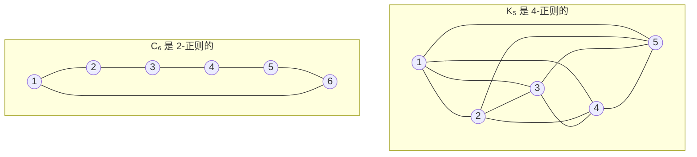

**正则图的性质.**

1. 若 $G$ 是 $n$ 个顶点上的 $k$-正则图，则 $|E| = \frac{nk}{2}$（由握手引理）。
2. $n$ 个顶点上的 $k$-正则图存在的必要条件是 $nk$ 为偶数且 $k \le n-1$。
3. **补图性质**：若 $G$ 是 $n$ 个顶点上的 $k$-正则图，则其补图 $\overline{G}$ 是 $(n-1-k)$-正则的。

> [!warning] 正则性与存在性
> 并非所有满足 $nk$ 为偶数且 $k \le n-1$ 的 $(n, k)$ 组合都存在 $k$-正则简单图。图实现存在额外的约束条件，尤其对较小的 $n$。

## 2. 子图 (Subgraphs)

### 2.1 定义

**定义 2.7 (子图, Subgraph).** 设 $G = (V, E)$ 和 $G' = (V', E')$ 是图。$G'$ 称为 $G$ 的**子图**（记为 $G' \subseteq G$），若：
- $V' \subseteq V$，且
- $E' \subseteq E$（其中 $E'$ 中的每条边的两个端点都在 $V'$ 中）

**子图的特殊类型.**

| 类型 | 定义 | 记法 |
|:-----|:-----------|:---------|
| **生成子图 (Spanning subgraph)** | $V' = V$（保留所有顶点） | $G' \subseteq G$ 且 $V' = V$ |
| **诱导子图 (Induced subgraph)** | $V' = S \subseteq V$，$E' = \{\{u,v\} \in E : u, v \in S\}$ | $G[S]$ |
| **边诱导子图 (Edge-induced subgraph)** | $E' \subseteq E$，$V' =$ $E'$ 中所有边的端点 | $G[E']$ |

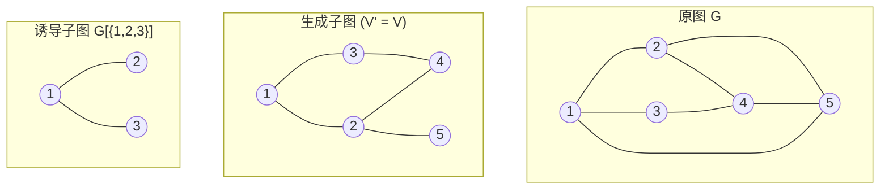

> **生成子图**：保留所有原顶点，但可能省略部分边。注意边 {3,4}、{4,5}、{1,5} 已被移除。
>
> **诱导子图 $G[\{1,2,3\}]$**：保留顶点 1、2、3 以及它们之间的所有原边。原图 $G$ 中不存在边 {2,3}，因此它也不在诱导子图中。

**示例：诱导子图与非诱导子图的区别.**

考虑图 $G$ 为三角形 $K_3$（顶点 $\{1,2,3\}$）加上一个孤立顶点 $4$。

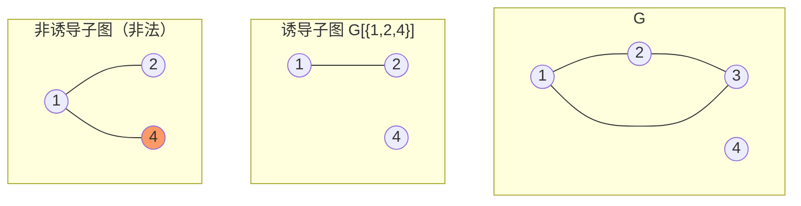

在非诱导子图中，边 {1,4} 在原图 $G$ 中不存在。这是**不允许的**——子图的边集必须是 $G$ 边集的子集。在顶点集 $\{1,2,4\}$ 上合法的子图只能包含已存在的边 $\{1,2\}$。

### 2.2 图操作 (Graph Operations)

**删除边 (Edge Deletion).** $G - e$ 是从 $G$ 中移除边 $e$ 后得到的图，顶点保持不变。

> $G - e$ 是 $G$ 的一个生成子图。

**删除顶点 (Vertex Deletion).** $G - v$ 是从 $G$ 中移除顶点 $v$ 及其关联的所有边后得到的图。

> $G - v$ 是 $G$ 在 $V \setminus \{v\}$ 上的诱导子图，即 $G - v = G[V \setminus \{v\}]$。

**收缩边 (Edge Contraction).** $G / e$ 是通过将边 $e$ 的两个端点合并为一个顶点、移除 $e$ 并保留所有其他边（平行边予以保留）而得到的图。

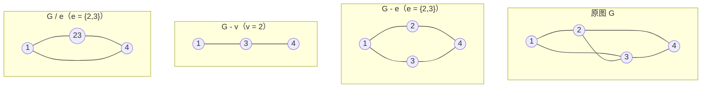

> [!note]
> 边收缩是图子式理论 (graph minor theory) 中的基本操作。图 $H$ 是 $G$ 的**子式 (minor)**，若 $H$ 可以通过对 $G$ 依次执行边删除、顶点删除和边收缩操作得到。

## 3. 团、独立集、补图与顶点覆盖 (Cliques, Independent Sets, Complements & Covers)

### 3.1 团 (Cliques)

**定义 2.11 (团, Clique).** 设 $G = (V, E)$ 是一个图。子集 $S \subseteq V$ 称为一个**团**，若 $S$ 中任意两个不同的顶点都相邻——即 $G[S]$ 是完全图。

- **极大团 (maximal clique)** 是不被任何更大的团真包含的团。
- **最大团 (maximum clique)** 是 $G$ 中具有最大可能规模的团。
- **团数 $\omega(G)$ (clique number)** 是 $G$ 中最大团的大小。

> [!tip] 极大 vs. 最大
> 每个最大团都是极大的，但反之不成立。极大团不能再被扩大，而最大团是所有可能中最大的（可能存在多个不同大小的极大团）。

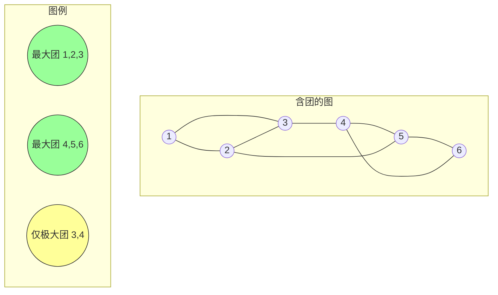

上图中：
- 顶点 $\{1,2,3\}$ 构成一个最大团：$\omega(G) = 3$
- 顶点 $\{4,5,6\}$ 也构成一个大小为 3 的最大团
- 顶点 $\{3,4\}$ 构成一个大小为 2 的团——它是极大的（没有顶点能被加入以构成同时包含 3 和 4 的更大团），但不是最大的

**团数示例.**

| 图 | $\omega(G)$ | 最大团 |
|:------|:-----------:|:------------------|
| $K_n$ | $n$ | 全部顶点 |
| $P_n$ ($n \ge 2$) | $2$ | 任意一条边 |
| $C_n$ ($n \ge 3$) | $2$（若 $n=3$ 则为 $3$） | $C_3$（三角形）的 $\omega = 3$ |
| $K_{m,n}$ | $2$ | 任意一条边（二分图中无三角形） |
| Petersen 图 | $2$ | 无三角形 |
| 空图 $\overline{K_n}$ | $1$ | 任意单个顶点 |

**命题.** $\omega(G) \ge 3$ 当且仅当 $G$ 包含一个三角形。

### 3.2 独立集 (Independent Sets)

**定义 2.14 (独立集, Independent Set).** 设 $G = (V, E)$ 是一个图。子集 $S \subseteq V$ 称为**独立集**（或**稳定集, stable set**），若 $S$ 中任意两个顶点都不相邻。

- **极大独立集 (maximal independent set)** 是不被任何更大的独立集真包含的独立集。
- **最大独立集 (maximum independent set)** 是具有最大可能规模的独立集。
- **独立数 $\alpha(G)$ (independence number)** 是 $G$ 中最大独立集的大小。

> [!note] 对偶性
> 团与独立集是对偶概念：
> - $S$ 是 $G$ 中的团 $\iff$ $S$ 是补图 $\overline{G}$ 中的独立集
> - $S$ 是 $G$ 中的独立集 $\iff$ $S$ 是 $\overline{G}$ 中的团
> - 因此：$\omega(G) = \alpha(\overline{G})$ 且 $\alpha(G) = \omega(\overline{G})$

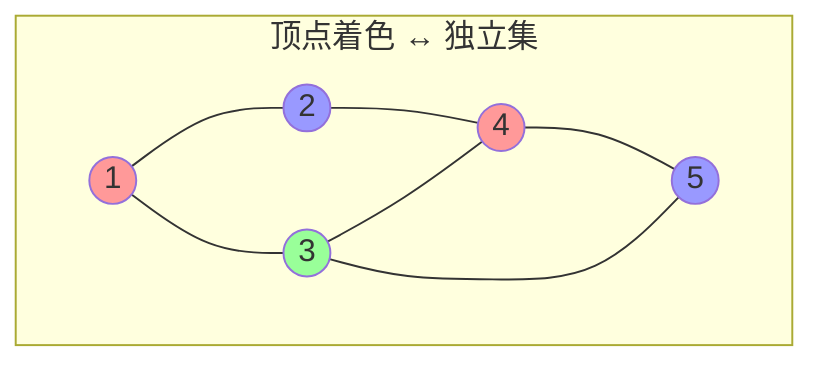

> 相同颜色的顶点构成一个独立集：
> - 红色：$\{1, 4\}$（大小 2）
> - 蓝色：$\{2, 5\}$（大小 2）
> - 绿色：$\{3\}$（大小 1）
>
> 此处 $\alpha(G) = 2$。

**示例.**

| 图 | $\alpha(G)$ | 最大独立集 |
|:------|:----------:|:-----------------------|
| $K_n$ | $1$ | 任意单个顶点 |
| $P_n$ | $\lceil n/2 \rceil$ | 交替选取顶点 |
| $C_n$ ($n \ge 3$) | $\lfloor n/2 \rfloor$ | 交替选取顶点 |
| $K_{m,n}$ | $\max(m, n)$ | 较大的那一部 |
| 空图 $\overline{K_n}$ | $n$ | 所有顶点 |

### 3.3 补图 (Graph Complement)

**定义 2.16 (补图, Graph Complement).** 设 $G = (V, E)$ 是一个图。$G$ 的**补图**，记为 $\overline{G}$，是在相同顶点集 $V$ 上的图，其中 $\{u, v\}$ 是 $\overline{G}$ 中的边当且仅当 $\{u, v\}$ **不是** $G$ 中的边（且 $u \ne v$）。

$$\overline{G} = (V, \{\{u, v\} : u \ne v,\; \{u, v\} \notin E\})$$

> [!note]
> 自环不在补图中考虑——$\overline{G}$ 总是简单图（无自环）。

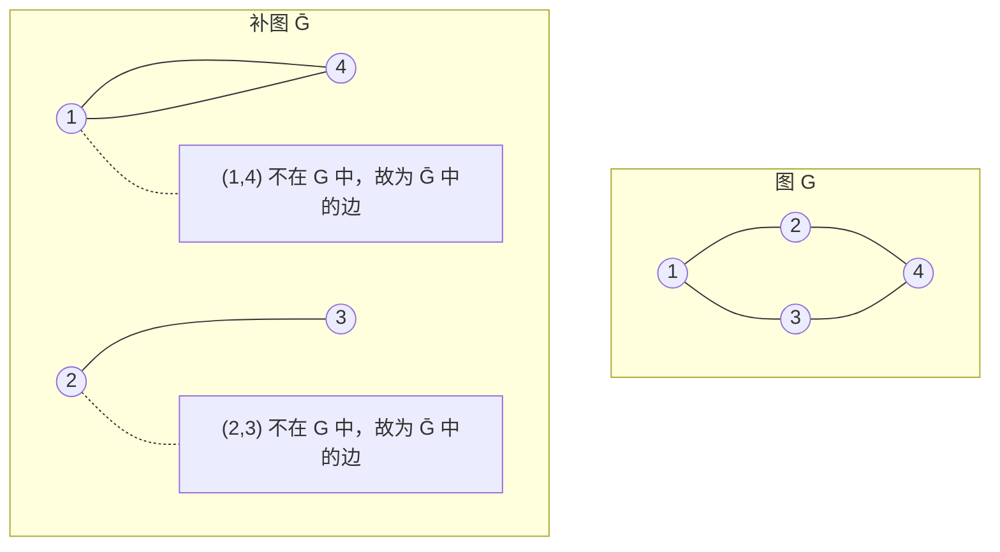

**补图的性质.**

1. $\overline{\overline{G}} = G$
2. $|E(\overline{G})| = \binom{n}{2} - |E(G)|$
3. 若 $G$ 不连通，$\overline{G}$ 可能连通，反之亦然。
4. $\omega(G) = \alpha(\overline{G})$ 且 $\alpha(G) = \omega(\overline{G})$
5. $\Delta(\overline{G}) = n - 1 - \delta(G)$
6. $\delta(\overline{G}) = n - 1 - \Delta(G)$

> [!tip] 自补图 (Self-Complementary Graphs)
> 图 $G$ 称为**自补的 (self-complementary)**，若 $G \cong \overline{G}$。此类图仅当 $n \equiv 0$ 或 $1 \pmod{4}$ 时存在。示例：$P_4$、$C_5$。

### 3.4 顶点覆盖 (Vertex Covers)

**定义 2.18 (顶点覆盖, Vertex Cover).** 设 $G = (V, E)$ 是一个图。子集 $C \subseteq V$ 称为**顶点覆盖**，若每条边 $e \in E$ 至少有一个端点在 $C$ 中。

- **最小顶点覆盖 (minimum vertex cover)** 是具有最小可能大小的顶点覆盖。
- **顶点覆盖数 $\tau(G)$ (vertex cover number)** 是 $G$ 中最小顶点覆盖的大小。

> [!note] 等价性
> $C \subseteq V$ 是顶点覆盖 $\iff$ $V \setminus C$ 是独立集。
>
> *证明.* 若每条边都触及 $C$，则不存在两个端点都在 $V \setminus C$ 中的边，故 $V \setminus C$ 为独立集。反之，若 $V \setminus C$ 为独立集，则没有边完全位于 $C$ 之外，因此每条边都触及 $C$。

**推论.** 对任意顶点覆盖 $C$ 和独立集 $S$（其中 $C = V \setminus S$），有 $|C| + |S| = |V|$。因此：

$$\tau(G) + \alpha(G) = |V|$$

其中 $\tau(G)$ 是顶点覆盖数（最小顶点覆盖的大小），$\alpha(G)$ 是独立数。

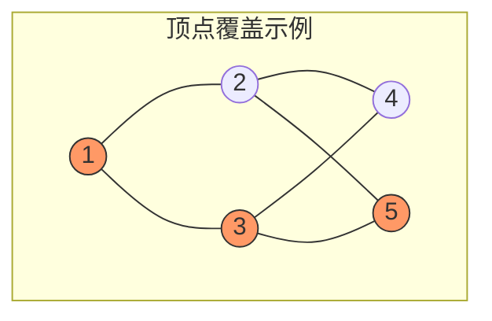

> 顶点 $\{1, 3, 5\}$（橙色）构成一个顶点覆盖：每条边至少有一个橙色端点。补集 $\{2, 4\}$ 是独立集。这是**最小**顶点覆盖吗？$\tau(G) = 2$（例如顶点 $\{3, 2\}$ 也能覆盖所有边）。

**König 定理（对二分图）.**

**定理 (König, 1931).** 对任意二分图 $G = (V, E)$，

$$\tau(G) = \nu(G)$$

其中 $\tau(G)$ 是最小顶点覆盖的大小，$\nu(G)$ 是最大匹配 (maximum matching) 的大小。

> [!note] 重要性
> König 定理是组合优化中的经典结论。对一般（非二分）图，$\tau(G) \ge \nu(G)$，但等号不一定成立。其差异由 **Kőnig–Egerváry 定理**和**完美图 (perfect graph)** 理论刻画。

**示例：二分图.**

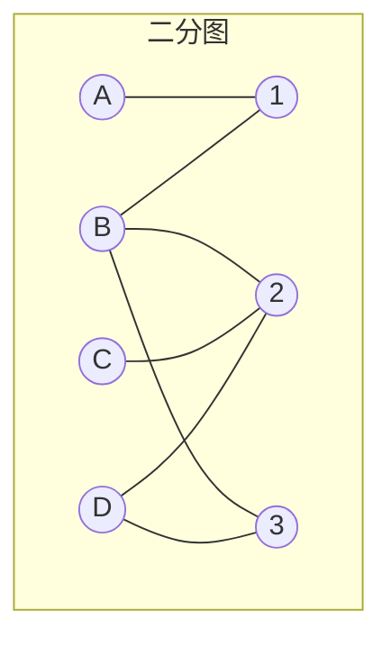

最大匹配（大小 $\nu = 2$）：例如 $\{A{-}1, B{-}2\}$ 或 $\{A{-}1, D{-}3\}$。
最小顶点覆盖（大小 $\tau = 2$）：例如 $\{B, R2\}$ 或 $\{L2, 2\}$。

## 4. 练习示例 (Practice Examples)

### 示例 1：度序列 → 图序列判定 → 团/独立集分析

**问题.** 给定度序列 $(4, 4, 3, 3, 2)$：

1. 使用 Havel–Hakimi 算法判断其是否为图序列。
2. 构造实现该序列的图。
3. 求 $\omega(G)$、$\alpha(G)$ 及一个最小顶点覆盖。

**解答.**

**步骤 1：Havel–Hakimi 算法.**

| 步骤 | 序列 | 操作 |
|:-----|:---------|:-------|
| 1 | $(4, 4, 3, 3, 2)$ | 原序列 |
| 2 | $(3, 2, 2, 1)$ | 移除 4，前 4 项各减 1: $(3, 2, 2, 1)$ |
| 3 | $(3, 2, 2, 1)$ | 已排好 |
| 4 | $(1, 1, 0)$ | 移除 3，前 3 项各减 1: $(1, 1, 0)$ |
| 5 | $(1, 1, 0)$ | 已排好 |
| 6 | $(0, 0)$ | 移除 1，前 1 项减 1: $(0, 0)$ |
| 7 | $(0, 0)$ | $d_1 = 0$ → **可图的** ✓ |

**步骤 2：构造图.**

从 Havel–Hakimi 反向构造，得到如下实现图：

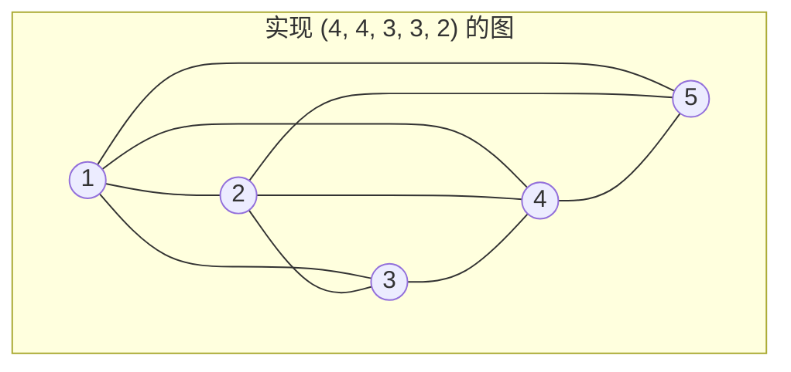

> $\deg(1) = 4$，$\deg(2) = 4$，$\deg(3) = 3$，$\deg(4) = 3$，$\deg(5) = 2$

**步骤 3：参数.**

- 最大团：$\{1, 2, 3, 4\}$ 构成 $K_4$ → $\omega(G) = 4$
- 最大独立集：$\{3, 5\}$（或 $\{4, 5\}$） → $\alpha(G) = 2$
- 最小顶点覆盖：$\tau(G) = n - \alpha(G) = 5 - 2 = 3$（例如 $\{1, 2, 4\}$）

### 示例 2：补图与自补图

**问题.** 证明 $P_4$（4 个顶点的路）是自补图。

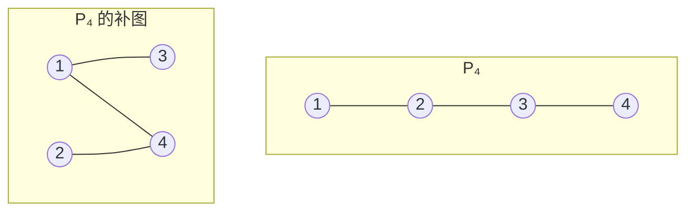

在顶点映射 $(1 \mapsto 2,\; 2 \mapsto 4,\; 3 \mapsto 1,\; 4 \mapsto 3)$ 下，补图与原 $P_4$ 同构。因此 $P_4$ 是自补图。

**验证：** |E(P₄)| = 3，|E(overline(P₄))| = C(4,2) - 3 = 3。✓

### 示例 3：通过 König 定理求顶点覆盖

**问题.** 在下面的二分图中，求一个最大匹配和一个最小顶点覆盖。

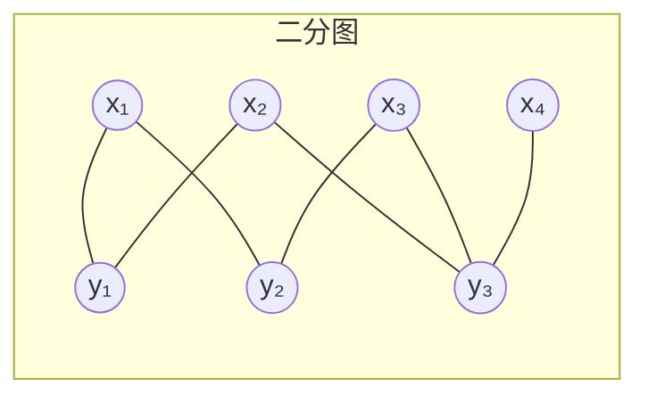

**最大匹配.** $\nu = 3$：例如 $\{x_1{-}y_2,\; x_2{-}y_1,\; x_4{-}y_3\}$

**最小顶点覆盖.** 由 König 定理，$\tau = \nu = 3$：例如 $\{x_2, x_3, y_2\}$ 或 $\{y_1, y_2, y_3\}$。

**验证.** 集合 $\{y_1, y_2, y_3\}$ 触及每一条边：边 $\{x_1,y_1\}$、$\{x_1,y_2\}$、$\{x_2,y_1\}$、$\{x_2,y_3\}$、$\{x_3,y_2\}$、$\{x_3,y_3\}$、$\{x_4,y_3\}$ 都至少有一个端点在 $\{y_1, y_2, y_3\}$ 中。补集 $\{x_1, x_2, x_3, x_4\}$ 是独立集。

## 符号速查

| 符号 | 含义 | 首次出现 |
|:-----|:-----|:---------|
| $\deg(v)$ | 顶点 $v$ 的度 | §1.1 |
| $\Delta(G)$ | 图 $G$ 的最大度 $\max\deg(v)$ | §1.1 |
| $\delta(G)$ | 图 $G$ 的最小度 $\min\deg(v)$ | §1.1 |
| $G' \subseteq G$ | $G'$ 是 $G$ 的子图 | §2.1 |
| $G[S]$ | 顶点子集 $S$ 诱导的子图 | §2.1 |
| $G - e$ | 删除边 $e$ | §2.2 |
| $G - v$ | 删除顶点 $v$ | §2.2 |
| $G / e$ | 收缩边 $e$ | §2.2 |
| $\omega(G)$ | 团数（最大团的大小） | §3.1 |
| $\alpha(G)$ | 独立数（最大独立集的大小） | §3.2 |
| $\overline{G}$ | 图 $G$ 的补图 | §3.3 |
| $\tau(G)$ | 顶点覆盖数（最小顶点覆盖的大小） | §3.4 |
| $\nu(G)$ | 匹配数（最大匹配的大小） | §3.4 |
| $K_n$ | $n$ 个顶点的完全图 | §1.1 |
| $P_n$ | $n$ 个顶点的路 | §1.1 |
| $C_n$ | $n$ 个顶点的圈 | §1.4 |
| $K_{m,n}$ | 完全二分图（两部分大小分别为 $m$ 和 $n$） | §1.1 |

## 相关链接

- [[Definitions]] — 基本定义（图、邻接、度、有向图、多重图）
- [[Walks, Cycles & Connectivity]] — 路径、回路、连通性
- [[../../Linear_Algebra/Linear_Algebra_MOC]] — 线性代数总览（图论中的邻接矩阵、拉普拉斯矩阵相关）
- [[../Set_Theory/Cartesian product|Cartesian Product]] — 集合论基础（图的笛卡尔积运算）

> [!seealso] 延伸阅读
> - **Griffin (2023) 第 2 章** 还涵盖了以下主题：图的并、交和笛卡尔积运算。
> - **Dirac 定理**和**Ore 定理**（第 4 章）基于度数约束给出了哈密顿圈存在的充分条件。
> - **Erdős–Gallai 定理**提供了图序列的另一种判定方法（在大 $n$ 下比 Havel–Hakimi 更高效）。
