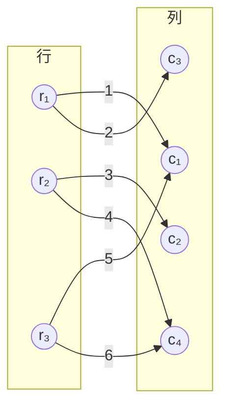
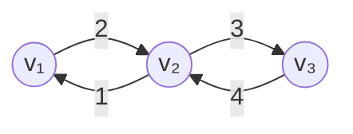
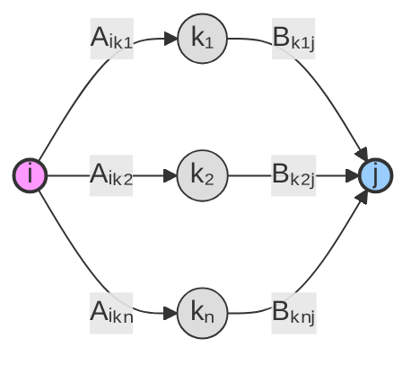
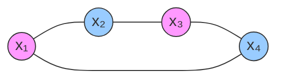
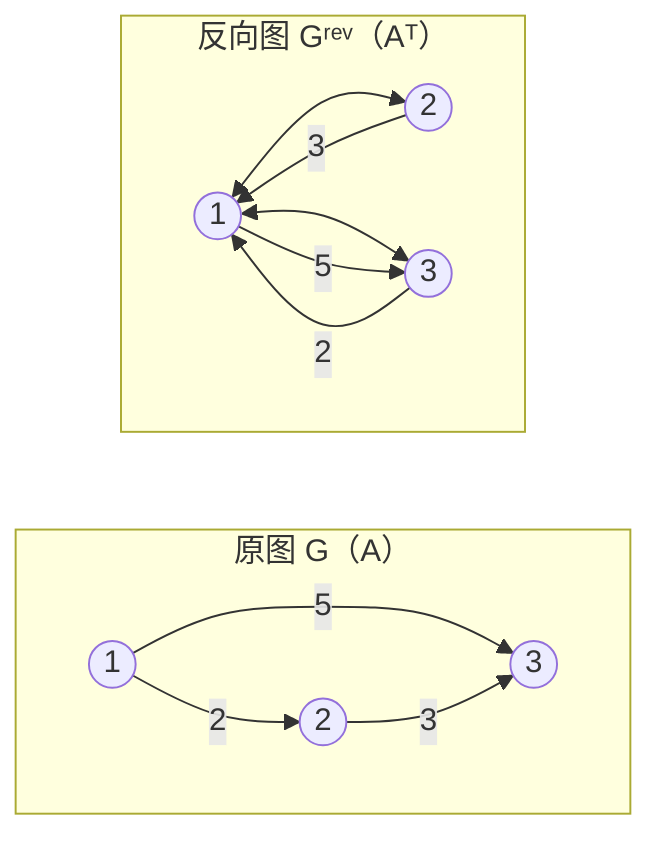
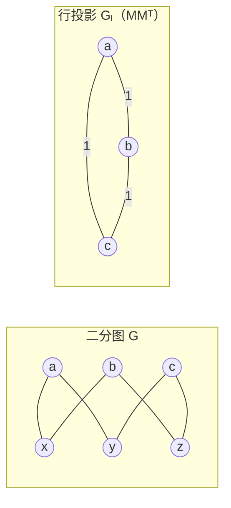
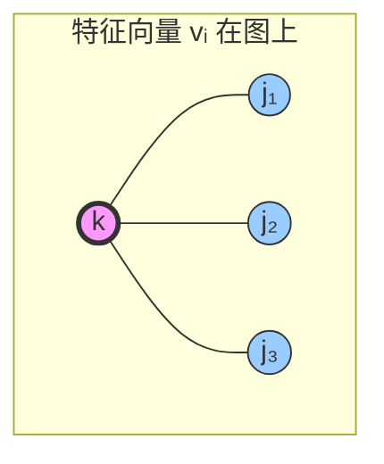
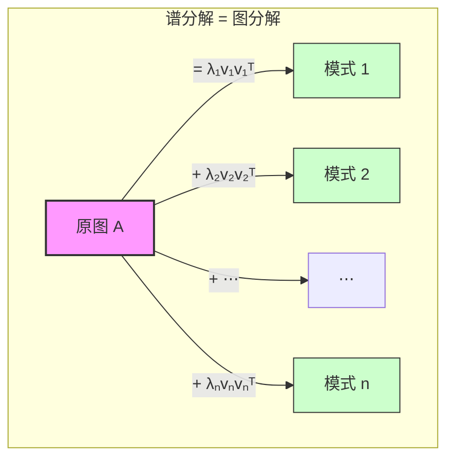

---
tags:
  - Math
  - GraphTheory
  - LinearAlgebra
  - Idea
  - 概念性
title: Every Matrix is a Graph
created: 2026-07-03
modified:
aliases:
  - Matrix-Graph Duality
  - 矩阵即图
---

# Every Matrix is a Graph

> **Path C 视角** — 用图论理解线性代数。这不是 Griffin 教材的逐章笔记，而是一种概念性综合：矩阵和图的二元性构成了组合数学与代数思维之间的桥梁。

---

## 1. 核心思想 (The Core Insight)

线性代数与图论之间存在着深层而优雅的二元性：

| 线性代数对象 | 图论对应物 |
|:------------|:-----------|
| $m \times n$ 矩阵 $M$ | 加权二分图（$m$ 个行顶点 + $n$ 个列顶点） |
| $n \times n$ 方阵 $A$ | 加权有向图（$n$ 个顶点） |
| 非零元 $M_{ij} \neq 0$ | 从 $i$ 到 $j$ 的边 |
| 矩阵乘法 $(AB)_{ij}$ | 长度为 2 的路径计数 |
| $A^k_{ij}$ | 长度为 $k$ 的行走 (walk) 计数 |
| 转置 $A^\top$ | 边方向反转 |
| 秩 $\operatorname{rank}(A)$ | 图结构的不变量 |
| 特征值 $\lambda_i$ | 图的"自然振动模式" |

> [!quote] 核心理念
> **任何矩阵都是一个图；任何图都对应一个矩阵。** 线性代数的每一个运算都可以在图论中找到组合解释，反之亦然。这种二元性让代数直觉与几何/组合直觉能够相互印证。

---

## 2. Every Matrix as a Bipartite Graph

**定义**：设 $M \in \mathbb{F}^{m \times n}$ 是域 $\mathbb{F}$ 上的 $m \times n$ 矩阵。$M$ 的**加权二分图表示** $G(M) = (L, R, E, w)$ 定义为：

- **左顶点集** $L = \{r_1, \dots, r_m\}$（对应行）
- **右顶点集** $R = \{c_1, \dots, c_n\}$（对应列）
- **边集** $E = \{(r_i, c_j) : M_{ij} \neq 0\}$
- **权重函数** $w(r_i, c_j) = M_{ij}$

> 矩阵的非零模式决定了二分图的结构；权重决定了边的数值。

### 示例：$3 \times 4$ 矩阵

考虑矩阵：

$$
M = \begin{pmatrix}
1 & 0 & 2 & 0 \\
0 & 3 & 0 & 4 \\
5 & 0 & 0 & 6
\end{pmatrix}
$$

其二分图表示如下。**左**为行顶点，**右**为列顶点，边权重标在边上。

> 矩阵的第 $i$ 行对应左顶点 $r_i$ 的出边，第 $j$ 列对应右顶点 $c_j$ 的入边。

### 性质

1. **稀疏性**：$M$ 中的非零元个数 $= |E|$。稀疏矩阵对应稀疏二分图。
2. **二分性**：所有边都从 $L$ 指向 $R$，没有 $L$-$L$ 或 $R$-$R$ 边。这个二分结构天然反映了输入-输出关系。
3. **零矩阵**：$M = \mathbf{0}$ 对应无边图（空图）。
4. **完全矩阵**：所有元素非零的矩阵对应完全二分图 $K_{m,n}$。

---

## 3. Square Matrices as Directed Graphs

方阵是一类特殊但极其重要的情形：因为行数和列数相等，左右顶点集可以合并为同一个顶点集。

**定义**：设 $A \in \mathbb{F}^{n \times n}$。$A$ 的**有向图表示** $G(A) = (V, E, w)$ 定义为：

- **顶点集** $V = \{v_1, \dots, v_n\}$
- **边集** $E = \{(v_i, v_j) : A_{ij} \neq 0\}$
- **权重函数** $w(v_i, v_j) = A_{ij}$

### 示例：$3 \times 3$ 矩阵

$$
A = \begin{pmatrix}
0 & 2 & 0 \\
1 & 0 & 3 \\
0 & 4 & 0
\end{pmatrix}
$$

> 左边的 $A$ 对应一个 3 顶点有向图。注意 $A_{12} = 2$ 和 $A_{21} = 1$ 是两条不同的有向边，方向相反，权重可能不同。

### 特殊情形

| 矩阵类型 | 图性质 |
|:---------|:-------|
| **对称矩阵** $A = A^\top$ | 有向图 → 无向图（每对方向相反的边合并为一条无向边） |
| **对角矩阵** $A = \operatorname{diag}(d_1, \dots, d_n)$ | 仅有自环 (self-loop)，没有顶点之间的边 |
| **置换矩阵** $P_\sigma$ | 若干个不相交的有向圈 (directed cycles) |
| **上三角矩阵** $a_{ij} = 0$ for $i > j$ | 有向无环图 (DAG) — 边只能从小编号指向大编号 |
| **邻接矩阵** $A_{ij} \in \{0, 1\}$ | 无权有向图（仅表示边的存在性） |
| **随机矩阵** (列和为 1) | 每个顶点的出边权重之和为 1 — Markov 链转移图 |
| **幂零矩阵** $A^k = 0$ 对某 $k$ | 图上没有长度 $\ge k$ 的 walk（有向无环 + 严格分层） |

> [!note] 对称情形
> 当 $A$ 对称时，$A_{ij} = A_{ji}$。对应的有向图中有双向边 $(v_i, v_j)$ 和 $(v_j, v_i)$。在无向图的约定中，这两条边被视为同一条无向边。因此，**对称矩阵对应于无向图**，这是谱图理论的起点。详见 [[Graph - Adjacency Matrix & Spectrum]]。

---

## 4. Matrix Multiplication as Path Counting

这是矩阵-图二元性中最深刻、最优美的联系：**矩阵的代数乘法等价于图上行走的组合计数**。

### 4.1 长度-2 路径

对两个矩阵 $A \in \mathbb{F}^{m \times n}$ 和 $B \in \mathbb{F}^{n \times p}$，乘积 $C = AB$ 的 $(i,j)$ 元素为：

$$C_{ij} = \sum_{k=1}^{n} A_{ik} B_{kj}$$

在图论语言中：
- $A_{ik} \neq 0$ 表示从 $i$ 到 $k$ 有一条边
- $B_{kj} \neq 0$ 表示从 $k$ 到 $j$ 有一条边
- 它们的乘积 $A_{ik} B_{kj}$ 是从 $i$ 到 $j$、经过 $k$ 的**长度为 2 的路径的权重乘积**
- 求和 $\sum_k$ 就是枚举所有中间节点 $k$

**因此：$(AB)_{ij}$ = 所有从 $i$ 到 $j$ 的长度为 2 的路径的权重乘积之和。**

> $(AB)_{ij} = A_{ik_1}B_{k_1j} + A_{ik_2}B_{k_2j} + \dots + A_{ik_n}B_{k_nj}$。每个中间顶点 $k$ 贡献一条长度为 2 的路径。

### 4.2 矩阵幂与行走计数

**核心定理**：对 $n \times n$ 矩阵 $A$，$(A^k)_{ij}$ 等于从 $v_i$ 到 $v_j$ 的**所有长度为 $k$ 的行走 (walk)** 的权重乘积之和。

**证明**（归纳法）：
- $k = 1$ 时，$(A^1)_{ij} = A_{ij}$，对应单步边（长度为 1 的行走）。
- 假设 $A^{k-1}_{ij}$ 计数字长度为 $k-1$ 的行走。则
  $$(A^k)_{ij} = \sum_\ell (A^{k-1})_{i\ell} A_{\ell j}$$
  每个 $(A^{k-1})_{i\ell}$ 是长度为 $k-1$、终点为 $\ell$ 的行走权重和。再乘以 $A_{\ell j}$（从 $\ell$ 到 $j$ 的边），总和即为长度为 $k$ 的所有行走。

> [!info] 代数 ⇔ 组合的等价关系
> $$
> \boxed{(AB)_{ij} = \sum_k A_{ik}B_{kj} \;\Longleftrightarrow\; \text{求和所有经过 $k$ 的路径}}
> $$
> 这个等式是全部矩阵-图联系的基础。**线性代数中的每一次乘法，在组合世界中都是路径枚举。**

### 4.3 应用举例

| 代数表达式 | 图论解释 |
|:----------|:---------|
| $A^k_{ij}$ | 从 $i$ 到 $j$ 的长度 $k$ 行走数 |
| $(I + A)^k_{ij}$ | 长度 $\le k$ 的行走数（$I$ 贡献零步行走） |
| $(I - A)^{-1} = \sum_{k=0}^\infty A^k$ | 所有长度的行走总数（生成函数，要求谱半径 $< 1$） |
| $e^{A}_{ij} = \sum_{k=0}^\infty \frac{A^k}{k!}$ | 指数加权行走和（网络传播模型） |

---

## 5. Rank and the Structure of Graphs

矩阵的秩是线性代数中最基本的不变量之一。在图论的语境中，秩揭示了图的深层结构信息。

### 5.1 邻接矩阵的秩

设 $A$ 是图 $G = (V, E)$ 的邻接矩阵（无向图，无自环）。$\operatorname{rank}(A)$ 满足以下性质：

**下界**（秩与边数的关系）：

$$
\operatorname{rank}(A) \ge \frac{2|E|}{n} \quad \text{（平均度的函数）}
$$

更精确地，对无环无向图的邻接矩阵 $A$：

$$
\operatorname{rank}(A) \le n - 1 \quad\text{（除非 $G$ 有奇圈且连通，此时 $\operatorname{rank}(A)=n$）}
$$

**秩与连通分量**：

若 $G$ 有 $c$ 个连通分量，且每个分量都不是二分图（即包含奇圈），则：

$$\operatorname{rank}(A) = n - c$$

若某个连通分量是二分图，则 $\operatorname{rank}(A)$ 会进一步降低（因为二分图的邻接矩阵有线性相关的行）。

> [!warning] 二分图的降秩
> 对连通二分图，邻接矩阵的秩 $\le n - 2$。这是因为二分图的邻接矩阵可以写为分块形式 $\begin{pmatrix}0 & B \\ B^\top & 0\end{pmatrix}$，其行具有内在的线性相关性。

### 5.2 关联矩阵与秩

设 $B \in \mathbb{R}^{n \times m}$ 是图 $G$ 的**关联矩阵**（incidence matrix）：$B_{v,e} = 1$ 若顶点 $v$ 关联于边 $e$，否则为 0。

对连通图 $G$（无自环）：

$$\operatorname{rank}(B) = n - 1$$

若 $G$ 有 $c$ 个连通分量，则 $\operatorname{rank}(B) = n - c$。

> 关联矩阵的秩等于图中"独立顶点"的数量。零空间对应于各连通分量上的常值向量。

### 5.3 零空间与图的结构

代数上，零空间 $\mathcal{N}(A) = \{x : Ax = 0\}$ 中的向量是满足以下条件的顶点权重分配：

$$\sum_{j: \{i,j\} \in E} A_{ij} \, x_j = 0 \quad \text{对每个 $i$}$$

即：每个顶点的**邻域权重和为零**。

> 对于 4-圈 $C_4$，邻接矩阵 $A$ 的零空间维数为 2（特征值 0 的代数重数为 2）。正确的零空间向量为 $x_1 = (1, 0, -1, 0)^\top$ 和 $x_2 = (0, 1, 0, -1)^\top$。验证：$A x_1 = (0 + 0, 1 + (-1), 0 + 0, 1 + (-1))^\top = (0,0,0,0)^\top$。直观上，零空间向量描述了图上的

> [!note] 零空间的图论含义
> 零空间的维数 $\dim \mathcal{N}(A)$ 就是图的结构性冗余度量。对无向图，零空间维数 = $n - \operatorname{rank}(A)$，其大小与图的二分结构、对称性、以及自同构群都有关系。详见 [[Linear_Algebra/Rank and Nullity]]。

---

## 6. Transpose as Reversal

矩阵转置在图论中有非常自然的对应：**反转所有边的方向**。

### 6.1 有向图情形

设 $A$ 是有向图 $G$ 的加权邻接矩阵。那么：

- $A^\top$ 对应**反向图** $G^\text{rev}$：$G^\text{rev}$ 的顶点集与 $G$ 相同，但每条边 $(v_i, v_j)$ 被替换为 $(v_j, v_i)$，权重不变。

> 左图 $A$ 中的边 $1\to2$（权重 2）在右图 $A^\top$ 中变为 $2\to1$（权重 2）。若原图是对称的，则 $A = A^\top$，反向图与原图相同。

### 6.2 对称化与反对称化

- **对称部分**：$\frac{A + A^\top}{2}$ 对应**无向化** — 忽略所有方向，得到底层无向图。这个矩阵是对称的，它的谱是实的（实对称矩阵谱定理）。
- **反对称部分**：$\frac{A - A^\top}{2}$ 对应**方向性偏差** — 捕捉了边方向上的非对称性。它的谱是纯虚数或零。

| 运算 | 图论意义 | 矩阵性质 |
|:----|:---------|:---------|
| $A + A^\top$ | 合并双向边为单条无向边 | 对称，半正定？取决于权重 |
| $A - A^\top$ | 边的方向偏差（净流量） | 斜对称 (skew-symmetric) |
| $A A^\top$ | 行之间的共享列（共同邻居） | Gram 矩阵，半正定 |
| $A^\top A$ | 列之间的共享行（共同邻居） | Gram 矩阵，半正定 |

> $A A^\top$ 和 $A^\top A$ 在实践中极其重要。对二分图 $(L, R, E)$，$A A^\top$ 的 $(i,j)$ 元素给出左顶点 $i$ 和 $j$ 的共同邻居数（在右顶点中）。这正是协同过滤和推荐系统的核心。

### 6.3 对称化实例

对任意矩阵 $M$，乘积 $M^\top M$ 和 $M M^\top$ 是对称半正定矩阵，具有相同的非零特征值。在图论中：

- $M^\top M$ = 列-列相似度矩阵（列的共同顶点数）
- $M M^\top$ = 行-行相似度矩阵（行的共同顶点数）

这些矩阵对应于原始二分图的**顶点投影 (vertex projection)** — 将二分图投影到仅含左顶点或仅含右顶点的图上，边权重为共同邻居数。

> $M M^\top$ 中 $(a, b)$ = 1（共享列 $x$），$(a, c)$ = 1（共享 $y$），$(b, c)$ = 1（共享 $z$）。

---

## 7. Spectral Decomposition = Graph Decomposition

这是矩阵-图联系中最深刻的部分：**谱分解揭示了一个图的固有结构模式**。

### 7.1 实对称矩阵的谱定理

对实对称矩阵 $A$（对应无向图）：

$$A = \sum_{i=1}^n \lambda_i \, v_i v_i^\top$$

其中 $\lambda_i \in \mathbb{R}$ 是特征值，$v_i \in \mathbb{R}^n$ 是相应的正交单位特征向量。

> 每个 $\lambda_i$ 衡量图在方向 $v_i$ 上的"放大倍数"（或"收缩倍数"）。

### 7.2 每个特征向量是一个顶点加权方案

特征向量 $v_i = (v_{i1}, v_{i2}, \dots, v_{in})^\top$ 给每个顶点 $j$ 赋予一个权重 $v_{ij}$。

**关键方程** $A v_i = \lambda_i v_i$ 在顶点层面上写为：

$$\sum_{\text{邻居 } j \text{ of } k} A_{kj} v_{ij} = \lambda_i \, v_{ik} \quad \text{对每个顶点 $k$}$$

即：**顶点的特征向量值乘以 $\lambda_i$ 等于其所有邻居的特征向量值的加权和。**

> 关系式：$\displaystyle \sum_{j \in N(k)} A_{kj} v_{ij} = \lambda_i v_{ik}$。顶点 $k$ 的"信号" $\lambda_i v_{ik}$ 是其邻域信号的和。特征向量是使这种邻域求和关系在所有顶点同时成立的权重分配。

### 7.3 特征值的图论解释

| 特征值范围 | 图论含义 |
|:-----------|:---------|
| $\lambda_\max$（最大正特征值） | 图的谱半径，衡量图的整体"膨胀"程度 |
| $\lambda_2$（次大特征值，代数连通度相关） | 在拉普拉斯矩阵中，$-\lambda_2$ 或 $\mu_2$ 给出**代数连通度**（Fiedler 值） |
| $\lambda_\min$（最小特征值） | 对二分图，$\lambda_\min = -\lambda_\max$；非二分图则 $|\lambda_\min| < \lambda_\max$ |
| **特征值间隙** $\lambda_\max - \lambda_2$ | 图的**扩展性 (expansion)** — 大间隙表示好扩展器 |

> [!info] 谱与图的全局结构
> 谱不是图的完全不变量（存在非同构图有相同谱，即"同谱图"），但它携带了丰富的全局信息：连通性、二分性、团结构、扩展性质等。见 [[Graph - Laplacian & Spectral Clustering]]。

### 7.4 谱分解 = 图分解

谱分解 $A = \sum \lambda_i v_i v_i^\top$ 可以理解为将图分解为 $n$ 个"层"：

$$
A = \underbrace{\lambda_1 v_1 v_1^\top}_{\text{主模式}} \;+\; \underbrace{\lambda_2 v_2 v_2^\top}_{\text{次模式}} \;+\; \cdots \;+\; \underbrace{\lambda_n v_n v_n^\top}_{\text{噪声模式}}
$$

每个 $\lambda_i v_i v_i^\top$ 是一个**秩-1 矩阵**，对应一个完全图（所有顶点对之间都有边），权重模式为 $v_i v_i^\top$。谱分解将原图分解为 $n$ 个这样的"模式图"的加权和。

> 每个模式 $v_i v_i^\top$ 是一个完全图，边 $(p,q)$ 的权重是 $v_{ip} v_{iq}$。**原图 = 这些完全图的加权和。** 这不是"分解为子图"，而是"重构为模式之和"。

### 7.5 Fiedler 向量与谱聚类

拉普拉斯矩阵 $L = D - A$（其中 $D$ 是度矩阵）的第二小特征值对应的特征向量称为 **Fiedler 向量**。它给出了图的一个谱嵌入，可将图的顶点排序后二分切割。

$$L = D - A = \sum_{i=1}^n \mu_i u_i u_i^\top, \quad 0 = \mu_1 < \mu_2 \le \dots \le \mu_n$$

- $\mu_2 > 0 \iff G$ 连通
- $\mu_2$ 越大，图越难被切割成两个大分量
- $u_2$（Fiedler 向量）的符号给出了近最优图划分

详见 [[Graph - Laplacian & Spectral Clustering]]。

---

## 8. 矩阵-图二元性一览表

| 线性代数概念 | 图论对应 | 深层含义 |
|:------------|:---------|:---------|
| 矩阵 $M \in \mathbb{F}^{m \times n}$ | 加权二分图 $G(M)$ | 行和列是两种不同类型的顶点 |
| 方阵 $A \in \mathbb{F}^{n \times n}$ | 加权有向图 $G(A)$ | 同类顶点之间的关系 |
| 矩阵乘法 $(AB)_{ij}$ | 长度 2 的路径求和 | 代数运算 = 组合枚举 |
| 矩阵幂 $A^k$ | 长度 $k$ 的行走数 | 幂 = 路径生成函数 |
| 转置 $A^\top$ | 反转所有边方向 | 对偶关系 |
| 对称矩阵 $A = A^\top$ | 无向图 | 关系可逆 |
| $A + A^\top$ | 底层无向图 | 方向忽略后的对称核 |
| $A A^\top$ （Gram 矩阵） | 行顶点的共同邻居投影 | 相似度矩阵 |
| $\operatorname{rank}(A)$ | 图结构的代数不变量 | 线性相关 = 结构冗余 |
| $\mathcal{N}(A)$（零空间） | 邻域和为零的顶点权重分配 | 驻波 / 平衡分配 |
| 谱分解 $A = \sum \lambda_i v_i v_i^\top$ | 图分解为模式之和 | 特征值 = 模式强度 |
| 特征向量 $v_i$ | 图上的驻波模式 | 各顶点同步振荡相位 |
| 最大特征值 $\lambda_\max$ | 谱半径 = 图扩张率 | 图的最快增长方向 |
| Fiedler 向量 $u_2$ | 谱划分 / 图二分 | 最小割的连续松弛 |

---

## 相关笔记

- [[Graph - Adjacency Matrix & Spectrum]] — 邻接矩阵的谱性质、特征值与图结构
- [[Graph - Laplacian & Spectral Clustering]] — 拉普拉斯矩阵、Fiedler 向量、谱聚类算法
- [[Linear_Algebra/Matrix Operations]] — 矩阵乘法、转置、求逆等基础运算
- [[Linear_Algebra/Rank and Nullity]] — 秩-零度定理、矩阵的秩与线性相关性
- [[Linear_Algebra/Eigenvalues and Eigenvectors]] — 特征值与特征向量的代数定义与计算
- [[Linear_Algebra/Spectral Theorem]] — 实对称矩阵的谱分解
- [[Vector Spaces and Subspaces]] — 向量空间基础，零空间和列空间

---

## 延伸阅读

### 经典读物

1. **Biggs, N. (1993).** *Algebraic Graph Theory.* Cambridge University Press. — 经典教材，第 1-4 章覆盖邻接矩阵、特征值、正则图。
2. **Brualdi, R. A. & Cvetković, D. (2009).** *A Combinatorial Approach to Matrix Theory and Its Applications.* CRC Press. — 直接讨论"矩阵作为图"的视角，非常契合本笔记主题。
3. **Godsil, C. & Royle, G. (2001).** *Algebraic Graph Theory.* Springer. — 现代代数图论标准教材，第 8-13 章涉及谱。
4. **Chung, F. R. K. (1997).** *Spectral Graph Theory.* AMS. — 谱图理论的权威著作，深入讨论拉普拉斯矩阵。

### 应用导向

5. **Spielman, D. A. (2019).** "Spectral and Algebraic Graph Theory." — 耶鲁大学讲义，http://www.cs.yale.edu/homes/spielman/sagt/ — 极具可读性的现代处理。
6. **von Luxburg, U. (2007).** "A Tutorial on Spectral Clustering." *Statistics and Computing*, 17(4), 395–416. — 谱聚类的入门文献，清晰解释了拉普拉斯矩阵与图划分的联系。
7. **Leskovec, J., Rajaraman, A. & Ullman, J. D. (2014).** *Mining of Massive Datasets.* Cambridge University Press. — 第 10 章讨论共现矩阵、奇异值分解与图挖掘。

### 概念拓展

8. **Brualdi, R. A. (2006).** "The Many Facets of Combinatorial Matrix Theory." — 综述矩阵论中的组合视角。
9. **Butler, S. (2015).** "Eigenvalues and Structures of Graphs." — 短篇综述，面向入门读者。
10. **Stanley, R. P. (1999).** *Enumerative Combinatorics, Vol. 2.* Cambridge University Press. — 第 7 章与矩阵幂的路径计数解释深度相关。

> "矩阵乘法就是路径计数" — 这个格言概括了线性代数和图论之间最美丽的桥梁。一旦你看到它，就再也无法忘怀。

---
