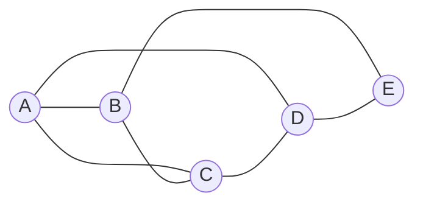
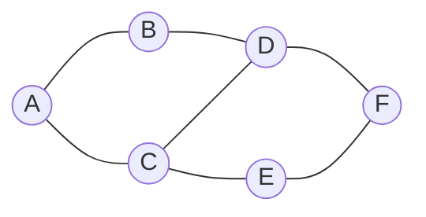
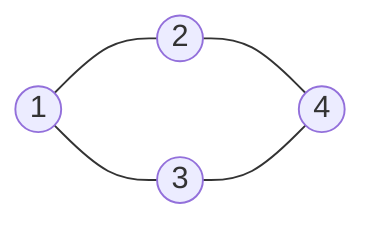
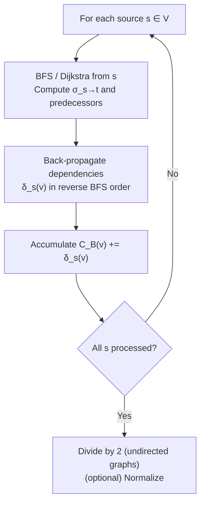
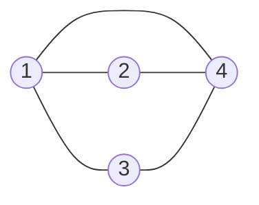
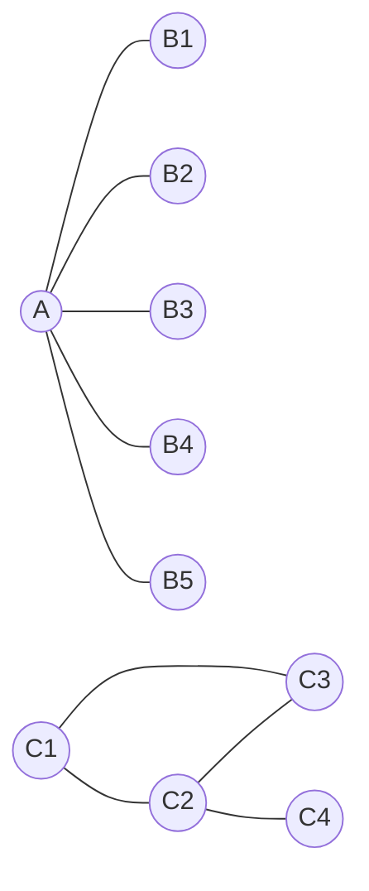
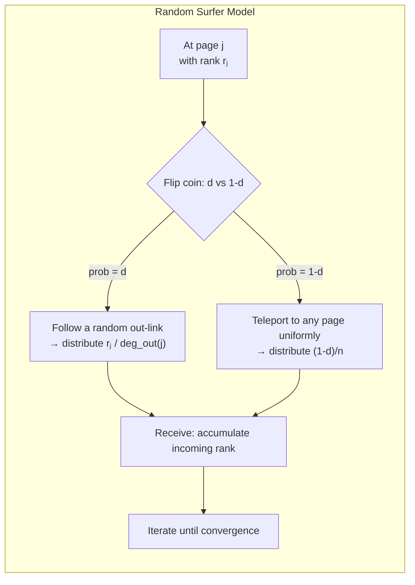
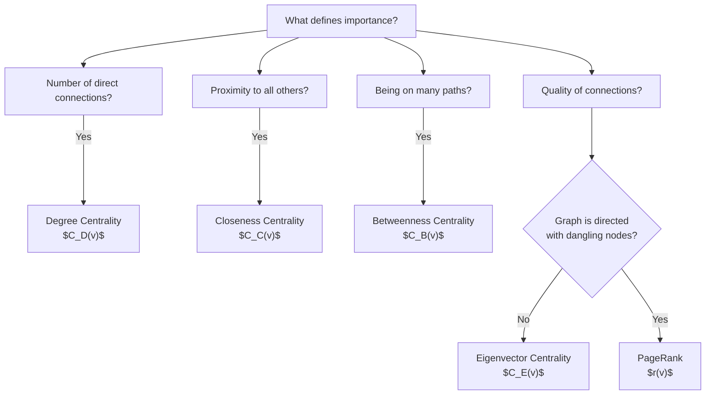

---
tags:
  - Math
  - GraphTheory
  - 概念性
  - 方法性
title: Graph - Centrality Measures
created: 2026-07-03
modified:
---

# Graph - Centrality Measures

> [!info] Source
> Christopher Griffin, *Applied Graph Theory* (2023), §3.4 Introduction to Centrality & §10.1 Eigenvector Centrality; also Bavelas (1950), Freeman (1978) for closeness centrality.

---

## 1. Why Centrality?

In many applications of graph theory, we need to answer a deceptively simple question: **which vertices are most important?**

The answer depends entirely on what "importance" means in a given context:

| Context | Notion of "Important" |
|:--------|:----------------------|
| Social network | Who has the most friends? Who bridges communities? |
| Web search | Which page is most relevant to a query? |
| Transportation | Which airport handles the most connecting traffic? |
| Power grid | Which substation, if removed, would cause the most disruption? |
| Citation network | Which paper is most influential? |
| Epidemiology | Which person, if infected, would spread a disease fastest? |

Centrality measures formalize different notions of vertex importance. **No single measure is universally correct** — each captures a distinct structural intuition.

> [!tip] Key Insight
> The Greek *κέντρον* (kéntron) means "sharp point" or "center." In graph theory, centrality is about locating the center(s) of a graph — but different definitions of "center" yield different answers.

**Griffin's framing (Remark 3.50):** "There are many situations in which we'd like to measure the importance of a vertex in a graph. The problem of measuring this quantity is usually called determining a vertex's *centrality*."

This note covers five major centrality measures and previews two more advanced variants. All assume an undirected, unweighted graph $G = (V, E)$ with $n = |V|$ vertices and $m = |E|$ edges, unless otherwise stated.

---

## 2. Degree Centrality

### 2.1 Definition

**Definition 3.51 (Degree Centrality).** Let $G = (V, E)$ be a graph. The **degree centrality** of a vertex is simply its degree:

$$C_D(v) = \deg(v)$$

The intuition: a vertex with many neighbors is more central than one with few neighbors. In a social network, this is "number of friends."

**Normalization.** To compare across graphs of different sizes, we can normalize to $[0, 1]$:

$$\hat{C}_D(v) = \frac{\deg(v)}{2|E|} = \frac{\deg(v)}{\sum_{u \in V} \deg(u)}$$

This expresses degree as a fraction of total degree sum. An alternative normalization divides by $n - 1$ (the maximum possible degree in a simple graph):

$$\hat{C}_D'(v) = \frac{\deg(v)}{n - 1}$$

### 2.2 Example

Consider the following graph:

**Degree centrality values:**

| Vertex | $C_D(v)$ | $\hat{C}_D(v)$ | $\hat{C}_D'(v)$ |
|:------:|:---------:|:--------------:|:---------------:|
| A | 3 | $\frac{3}{10} = 0.30$ | $\frac{3}{4} = 0.75$ |
| B | 3 | $\frac{3}{10} = 0.30$ | $\frac{3}{4} = 0.75$ |
| C | 3 | $\frac{3}{10} = 0.30$ | $\frac{3}{4} = 0.75$ |
| D | 2 | $\frac{2}{10} = 0.20$ | $\frac{2}{4} = 0.50$ |
| E | 1 | $\frac{1}{10} = 0.10$ | $\frac{1}{4} = 0.25$ |

> [!note]
> $A$, $B$, and $C$ have equal degree centrality despite having different positions in the graph. This is a limitation — degree centrality ignores the structure beyond immediate neighbors.

### 2.3 Properties

| Property | Description |
|:---------|:------------|
| **Complexity** | $O(n)$ to compute for all vertices |
| **Locality** | Only uses immediate neighborhood — purely local |
| **Range** | $[0, n-1]$ (raw); $[0, 1]$ (normalized) |
| **Limitation** | Treats all neighbors as equally valuable; ignores global structure |

> [!warning]
> Degree centrality is the **coarsest** measure. A vertex with high degree may be peripheral in a global sense (e.g., all its neighbors may themselves have low degree or be disconnected from the rest of the graph).

---

## 3. Closeness Centrality

### 3.1 Definition

**Definition (Closeness Centrality).** Let $G = (V, E)$ be a connected graph. The **closeness centrality** of a vertex $v$ is the reciprocal of the sum of geodesic distances from $v$ to all other vertices:

$$C_C(v) = \frac{1}{\sum_{u \in V \setminus \{v\}} d_G(v, u)}$$

where $d_G(v, u)$ is the shortest-path distance (number of edges) between $v$ and $u$.

The intuition: a vertex that is close (on average) to all others can quickly reach the entire network — it is "close to the action."

**Normalization.** For a graph with $n$ vertices, the maximum possible closeness is achieved when a vertex is distance 1 from all others (star-center). The normalized version is:

$$\hat{C}_C(v) = \frac{n - 1}{\sum_{u \in V \setminus \{v\}} d_G(v, u)}$$

This normalizes to $[0, 1]$, where $\hat{C}_C(v) = 1$ if $v$ is adjacent to all other vertices.

> [!note] Disconnected Graphs
> If $G$ is disconnected, $d_G(v, u) = \infty$ for vertices in different components. Common fixes: (1) restrict to the component of $v$, or (2) use the harmonic centrality $\sum_{u \neq v} 1 / d_G(v, u)$ (which handles $\infty$ gracefully).

### 3.2 Example

**Compute distances from each vertex:**

| $(v, u)$ | $d(A, u)$ | $d(B, u)$ | $d(C, u)$ | $d(D, u)$ | $d(E, u)$ | $d(F, u)$ |
|:--------:|:---------:|:---------:|:---------:|:---------:|:---------:|:---------:|
| to A | — | 1 | 1 | 2 | 2 | 3 |
| to B | 1 | — | 2 | 1 | 3 | 2 |
| to C | 1 | 2 | — | 1 | 1 | 2 |
| to D | 2 | 1 | 1 | — | 2 | 1 |
| to E | 2 | 3 | 1 | 2 | — | 1 |
| to F | 3 | 2 | 2 | 1 | 1 | — |
| $\sum$ | **9** | **9** | **7** | **6** | **9** | **9** |

**Closeness centrality (normalized):**

| Vertex | $\sum d_G(v, u)$ | $C_C(v)$ | $\hat{C}_C(v)$ |
|:------:|:----------------:|:--------:|:--------------:|
| A | 9 | 0.111 | $\frac{5}{9} \approx 0.556$ |
| B | 9 | 0.111 | $\frac{5}{9} \approx 0.556$ |
| C | 7 | 0.143 | $\frac{5}{7} \approx 0.714$ |
| D | **6** | **0.167** | **$\frac{5}{6} \approx 0.833$** |
| E | 9 | 0.111 | $\frac{5}{9} \approx 0.556$ |
| F | 9 | 0.111 | $\frac{5}{9} \approx 0.556$ |

> [!tip]
> Vertex D has the highest closeness centrality — it sits at a "junction" that minimizes the sum of distances to all other vertices. Even though D has degree 2 (lower than C's degree 3), D is globally more central by this measure.

### 3.3 Properties

| Property | Description |
|:---------|:------------|
| **Complexity** | $O(n(m + n \log n))$ via Johnson's / Floyd–Warshall (all-pairs shortest paths) |
| **Scope** | Global — uses the entire graph structure |
| **Range** | $[0, (n-1)^{-1}]$ (raw); $[0, 1]$ (normalized) |
| **Limitation** | Requires connected graph; sensitive to small graph changes |

---

## 4. Betweenness Centrality

### 4.1 Definition

**Definition 3.53 (Geodesic / Betweenness Centrality).** Let $G = (V, E)$ be a graph. The **betweenness centrality** (also called geodesic centrality) of a vertex $v \in V$ is the fraction of shortest paths between all pairs of other vertices that pass through $v$:

$$C_B(v) = \sum_{s \neq t \neq v} \frac{\sigma_{st}(v)}{\sigma_{st}}$$

where:
- $\sigma_{st}$ — total number of shortest paths between $s$ and $t$
- $\sigma_{st}(v)$ — number of those shortest paths that include $v$

The intuition: a vertex that lies on many shortest paths between others acts as a **bridge** or **bottleneck**. Its removal would disconnect many pairs of vertices.

> [!quote] Griffin, Remark 3.55
> "It's clear from this analysis that cut vertices should have high geodesic centrality if they connect two large components of a graph. Thus, by some measures, cut vertices are very important elements of graphs."

**Normalization.** For a graph with $n$ vertices, the maximum betweenness occurs when $v$ lies on all shortest paths among all $\binom{n-1}{2}$ vertex pairs:

$$\hat{C}_B(v) = \frac{2}{(n-1)(n-2)} \cdot C_B(v)$$

This normalizes to $[0, 1]$.

### 4.2 Example

Consider the same graph used in Griffin Fig. 3.9:

**Betweenness computation:**

| Vertex Pair | Paths | $\sigma_{st}$ | 1 | 2 | 3 | 4 |
|:-----------:|:------|:-------------:|:-:|:-:|:-:|:-:|
| (1,2) | 1–2 | 1 | — | — | 0 | 0 |
| (1,3) | 1–3 | 1 | — | 0 | — | 0 |
| (1,4) | 1–2–4, 1–3–4 | 2 | — | $\frac12$ | $\frac12$ | — |
| (2,3) | 2–1–3 | 1 | 0 | — | — | 0 |
| (2,4) | 2–4 | 1 | 0 | — | 0 | — |
| (3,4) | 3–4 | 1 | 0 | 0 | — | — |
| **$C_B(v)$** | | | **0** | **$\frac12$** | **$\frac12$** | **0** |

Normalized: $\hat{C}_B(1) = 0$, $\hat{C}_B(2) = \frac12$, $\hat{C}_B(3) = \frac12$, $\hat{C}_B(4) = 0$.

> [!note]
> Vertices 2 and 3 have the highest betweenness — they are the only vertices that lie on the shortest path between 1 and 4. Vertices 1 and 4, being endpoints, never appear on shortest paths between others.

### 4.3 Brandes Algorithm

Computing $C_B(v)$ by enumerating all-pairs shortest paths is $O(n^3)$. **Brandes' algorithm** (2001) computes betweenness centrality for all vertices in $O(nm + n^2 \log n)$ for weighted graphs ($O(nm)$ for unweighted).

**Key idea (Brandes):** For each source vertex $s$, perform BFS (unweighted) or Dijkstra (weighted) to compute:
1. The number of shortest paths $\sigma_{s \to t}$ from $s$ to each $t$
2. The **dependency** of $s$ on each $v$: $\delta_{s}(v) = \sum_{t} \frac{\sigma_{sv}}{\sigma_{st}} \cdot (1 + \delta_s(t))$

Then accumulate: $C_B(v) = \sum_{s \neq v} \delta_s(v)$.

> [!tip] Complexity
> Brandes: $O(nm)$ (unweighted), $O(nm + n^2 \log n)$ (weighted). Naïve: $O(n^3)$.

### 4.4 Properties

| Property | Description |
|:---------|:------------|
| **Complexity** | $O(nm)$ via Brandes (unweighted) |
| **Scope** | Global — captures bridge/bottleneck role |
| **Range** | $[0, \binom{n-1}{2}]$ (raw); $[0, 1]$ (normalized) |
| **Limitation** | Assumes information travels via shortest paths (not always realistic) |

> [!warning] Edge Betweenness
> A related measure, **edge betweenness**, applies the same idea to edges rather than vertices: the fraction of shortest paths that traverse a given edge. Edge betweenness is the foundation of the Girvan–Newman community detection algorithm.

---

## 5. Eigenvector Centrality

### 5.1 Definition

**Derivation 10.3 (Eigenvector Centrality, after Spizzirri).** Unlike degree centrality (which counts neighbors), eigenvector centrality scores each vertex based on the idea that **importance is self-referential**: important vertices are those connected to other important vertices.

> [!quote] Griffin
> "Important vertices are important precisely because they are adjacent to other important vertices. (This is the high-school concept of 'coolness by association.')"

Let $x_i$ be the centrality score of vertex $v_i$. Define $x_i$ as a (scaled) sum of the scores of its neighbors:

$$x_i = \frac{1}{\lambda} \sum_{v_j \in N(v_i)} x_j = \frac{1}{\lambda} \sum_{j=1}^n M_{ij} x_j$$

where $M$ is the adjacency matrix and $\lambda$ is a constant chosen endogenously. In matrix form:

$$\lambda x = M x \quad \Longrightarrow \quad M x = \lambda x$$

Thus, $x$ is an **eigenvector** of $M$, and $\lambda$ is its **eigenvalue**.

**Which eigenvector?** By the Perron–Frobenius theorem, a connected graph's adjacency matrix has a unique eigenvalue $\lambda_1$ of maximum magnitude with a corresponding eigenvector $x$ having all positive entries. This is the **Perron–Frobenius eigenvector**, and it defines eigenvector centrality $C_E(v)$:

$$C_E(v_i) = x_i \quad \text{where } M x = \lambda_1 x,\; x_i > 0$$

**Normalization.** Eigenvector centrality is usually normalized so that the entries sum to 1:

$$\hat{C}_E(v_i) = \frac{x_i}{\sum_j x_j}$$

### 5.2 Example and Comparison with Degree

Consider the graph from Griffin Fig. 10.1:

**Adjacency matrix:**

$$M = \begin{bmatrix}
0 & 1 & 1 & 1 \\
1 & 0 & 0 & 1 \\
1 & 0 & 0 & 1 \\
1 & 1 & 1 & 0
\end{bmatrix}$$

**Eigenvalues:** $\lambda_1 = \frac12(1 + \sqrt{17}) \approx 2.562$, $\lambda_2 = \frac12(1 - \sqrt{17}) \approx -1.562$, $\lambda_3 = -1$, $\lambda_4 = 0$.

**Eigenvector centrality (Perron–Frobenius eigenvector, normalized):**

$$\hat{C}_E \approx [0.28,\; 0.22,\; 0.22,\; 0.28]$$

**Comparison: Degree vs. Eigenvector:**

| Vertex | $C_D(v)$ | $\hat{C}_D(v)$ (norm) | $\hat{C}_E(v)$ | Rank (deg) | Rank (eig) |
|:------:|:--------:|:---------------------:|:--------------:|:----------:|:----------:|
| 1 | 3 | 0.75 | **0.28** | 1 | 1 |
| 2 | 2 | 0.50 | 0.22 | 2 | 2 |
| 3 | 2 | 0.50 | 0.22 | 2 | 2 |
| 4 | 3 | 0.75 | **0.28** | 1 | 1 |

> [!tip]
> Here degree and eigenvector centrality agree on the ranking. But they **disagree** in cases where a vertex has many low-status neighbors (high degree, low eigenvector) versus few high-status neighbors (low degree, high eigenvector).

**Walk interpretation (Griffin Remark 10.6):** Let $e_i$ be the $i$th standard basis vector. Then $(M^k e_i)_j$ counts the number of walks of length $k$ from $v_j$ to $v_i$. As $k \to \infty$:

$$\lim_{k \to \infty} \frac{M^k e_i}{\lambda_1^k} \propto x$$

Thus, eigenvector centrality is proportional to the number of **long walks** arriving at each vertex — the more long paths lead to a vertex, the more central it is.

### 5.3 When Degree and Eigenvector Disagree

Consider a graph where a vertex has many neighbors that are themselves peripheral:

| Vertex | $C_D$ | $C_E$ (approx) | Explanation |
|:------:|:-----:|:--------------:|:------------|
| A | 5 | Low | High degree, but neighbors are dead ends |
| C1 | 2 | High | Low degree, but connects to a well-connected cluster |
| C2 | 3 | High | Hub within a tightly connected subgraph |
| B1–B5 | 1 | Very low | Leaves attached to a low-status vertex |

> [!note]
> Eigenvector centrality is more **nuanced**: it penalizes vertices whose neighbors are poorly connected, even if they have many of them. This is why PageRank (which extends eigenvector centrality) performs better for web search than simple degree counting.

### 5.4 Properties

| Property | Description |
|:---------|:------------|
| **Complexity** | $O(m)$ per power iteration; typically converges in $O(\log n)$ iterations |
| **Scope** | Global, with a "ripple" effect |
| **Range** | Depends on normalization; all entries positive |
| **Requirement** | Graph must be connected (or irreducible) for a unique positive eigenvector |
| **Limitation** | Sensitive to dense subgraphs; can be dominated by a single high-degree hub |

---

## 6. Katz / PageRank Preview

Two important variants extend eigenvector centrality to handle practical issues.

### 6.1 Katz Centrality

Proposed by Leo Katz (1953), Katz centrality adds a small constant "bonus" term to every vertex, ensuring that even vertices with zero in-degree (in directed graphs) receive a positive score:

$$C_{\text{Katz}}(v_i) = \alpha \sum_{j} M_{ij} \, C_{\text{Katz}}(v_j) + \beta$$

In matrix form: $x = \alpha M x + \beta \mathbf{1}$, which solves to:

$$x = \beta (I - \alpha M)^{-1} \mathbf{1}$$

where $\alpha$ is an attenuation factor ($0 < \alpha < 1 / \lambda_1$) and $\beta$ controls the base centrality.

> [!quote] Griffin (Chapter Notes, §3.5)
> "Katz centrality ... is similar to PageRank centrality, which we will discuss in later chapters."

### 6.2 PageRank

Developed by Brin and Page (1998) for the Google search engine, PageRank modifies Katz centrality with **normalization** by out-degree and a **damping factor** $d$ (typically $d = 0.85$):

$$r_i = \frac{1-d}{n} + d \sum_{j: (j,i) \in E} \frac{r_j}{\deg_{\text{out}}(j)}$$

This models a random web surfer who follows links with probability $d$ and "teleports" to a random page with probability $1 - d$.

**Key differences from eigenvector centrality:**

| Aspect | Eigenvector | PageRank |
|:-------|:-----------|:---------|
| Neighbor contribution | $\sum M_{ij} x_j$ | $\sum \frac{M_{ij}}{\deg_{\text{out}}(j)} r_j$ |
| Damping | No | Yes ($d = 0.85$) |
| Connectivity requirement | Connected graph | Handles dangling nodes |
| Teleportation | No | Yes (uniform jump) |

> [!seealso]
> For full coverage of PageRank and Markov chain formulations, see [[Graph - Random Walks & PageRank]].

---

## 7. Comparison Table

| Measure | Symbol | What It Measures | Local/Global | Raw Range | Complexity | Key Intuition |
|:--------|:------:|:----------------|:------------:|:---------:|:----------:|:--------------|
| **Degree** | $C_D(v)$ | Number of neighbors | Local | $[0, n-1]$ | $O(n)$ | "How many friends?" |
| **Closeness** | $C_C(v)$ | Reciprocal of total distance to all others | Global | $(0, 1/(n-1)]$ | $O(n(m + n \log n))$ | "How quickly can I reach everyone?" |
| **Betweenness** | $C_B(v)$ | Fraction of shortest paths passing through $v$ | Global | $[0, \binom{n-1}{2}]$ | $O(nm)$ (Brandes) | "How many bridges do I control?" |
| **Eigenvector** | $C_E(v)$ | Sum of neighbors' centralities (self-referential) | Global | Positive eigenvector entries | $O(m \cdot \text{iter})$ | "Who are my friends?" (quality matters) |
| **Katz** | $C_K(v)$ | Eigenvector + constant base centrality | Global | Positive | $O(n^3)$ (direct solve) or iterative | "Eigenvector with a floor" |
| **PageRank** | $r(v)$ | Stationary distribution of random surfer | Global | $[0, 1]$ | $O(m \cdot \text{iter})$ | "Where does a random surfer end up?" |

### When to Use Which

### Quick Reference: Strengths and Weaknesses

| Measure | Strength | Weakness |
|:--------|:---------|:---------|
| $C_D$ | Fast, intuitive | Ignores global structure |
| $C_C$ | Captures global position | Fails on disconnected graphs |
| $C_B$ | Identifies bridges/bottlenecks | Assumes shortest-path routing |
| $C_E$ | Differentiates by neighbor quality | Needs connected graph, can be dominated |
| PageRank | Handles real-world web graphs | Parameter $d$ is somewhat arbitrary |

> [!warning]
> Centrality measures are **correlated** but not identical. In many real-world graphs, degree and eigenvector centrality are moderately correlated ($\rho \approx 0.5\text{--}0.8$), but outliers — vertices that rank high on one measure and low on another — are often the most structurally interesting.

---

## 符号速查

| 符号 | 含义 |
|:-----|:-----|
| $C_D(v)$ | 度中心性（Degree Centrality），即 $\deg(v)$ |
| $C_C(v)$ | 接近中心性（Closeness Centrality） |
| $C_B(v)$ | 中介中心性 / 测地中心性（Betweenness / Geodesic Centrality） |
| $C_E(v)$ | 特征向量中心性（Eigenvector Centrality） |
| $\hat{C}(v)$ | 归一化后的中心性值 |
| $\sigma_{st}$ | 从 $s$ 到 $t$ 的最短路径总数 |
| $\sigma_{st}(v)$ | 从 $s$ 到 $t$ 且经过 $v$ 的最短路径数 |
| $d_G(v, u)$ | 在 $G$ 中 $v$ 到 $u$ 的最短距离 |
| $M$ | 邻接矩阵（Adjacency Matrix） |
| $\lambda_1$ | 邻接矩阵的最大特征值（Perron–Frobenius eigenvalue） |
| $d$ | PageRank 阻尼因子（通常 $d = 0.85$） |

---

## 相关链接

- [[Graph - Walks, Cycles & Connectivity]] — 路径、回路、图论基本性质
- [[Graph - Adjacency Matrix & Spectrum]] — 邻接矩阵与谱图理论
- [[Graph - Random Walks & PageRank]] — 随机游走与 PageRank 详解
- [[Graph - Laplacian & Spectral Clustering]] — 拉普拉斯矩阵与谱聚类

> [!seealso] Further Reading
> - **Griffin (2023), §3.4** — Degree and geodesic (betweenness) centrality
> - **Griffin (2023), §10.1** — Eigenvector centrality derivation and example
> - **Griffin (2023), §10.2–10.3** — Markov chains, random walks, PageRank
> - **Freeman (1978)** — "Centrality in Social Networks: Conceptual Clarification" (seminal paper unifying degree/closeness/betweenness)
> - **Brandes (2001)** — "A Faster Algorithm for Betweenness Centrality"
> - **Newman (2010)** — *Networks: An Introduction* (extensive treatment of centrality measures)

---
