---
tags:
  - Math
  - GraphTheory
  - ComputerScience
  - 定义性
  - 基本原理
title: Graph - Definations
created: 2026-03-09T11:20:00
modified:
---
# Graph - Definations
## 1. 图 (Graph)

**定义 1.2**：图是一个二元组 $G = (V, E)$，其中：
- $V$ 是有限顶点集
- $E$ 是有限边集，包含 $V$ 的单元素或双元素子集

> 每条边要么是单元素子集（自环），要么是双元素子集（连接两个顶点）。

**直观理解**：顶点用点（圆圈、方块等）表示，边用线或曲线表示。

**示例图**：$V = \{1, 2, 3, 4\}$，$E = \{\{1,2\}, \{2,3\}, \{3,4\}, \{4,1\}\}$

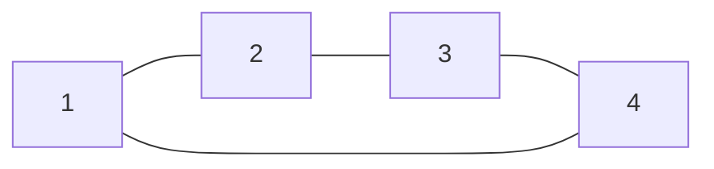

---

## 2. 自环 (Self-loop)

**定义 1.5**：若 $G = (V, E)$ 是图，$v \in V$，且 $e = \{v\}$，则边 $e$ 称为**自环**。

> 自环是只包含一个顶点的边，在图中表现为从顶点出发又回到自身的环。

**示例**：顶点 1 上的自环

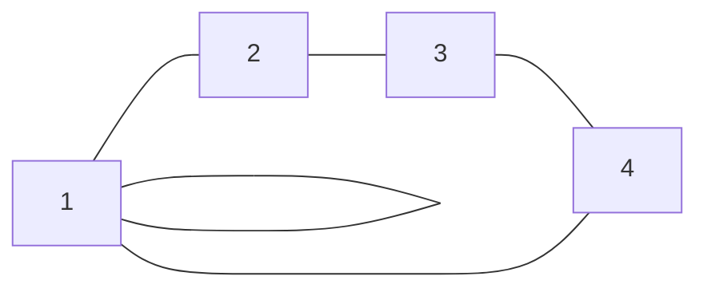

---

## 3. 邻接 (Adjacency)

### 3.1 顶点邻接 (Vertex Adjacency)

**定义 1.7**：两顶点 $v_1$ 和 $v_2$ 称为**邻接的**，若存在边 $e \in E$ 使得 $e = \{v_1, v_2\}$。

顶点 $v$ 是**自邻接的**，若 $e = \{v\} \in E$（即存在自环）。

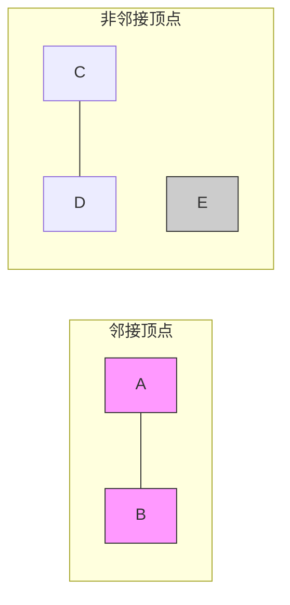

> 上图中：A 与 B 邻接；C 与 D 邻接；E 与任何顶点都不邻接。

### 3.2 边邻接 (Edge Adjacency)

**定义 1.8**：
- 两边 $e_1$ 和 $e_2$ 称为**邻接的**，若存在顶点 $v$ 同时属于 $e_1$ 和 $e_2$（作为集合）
- 边 $e$ 与顶点 $v$ 邻接，若 $v \in e$

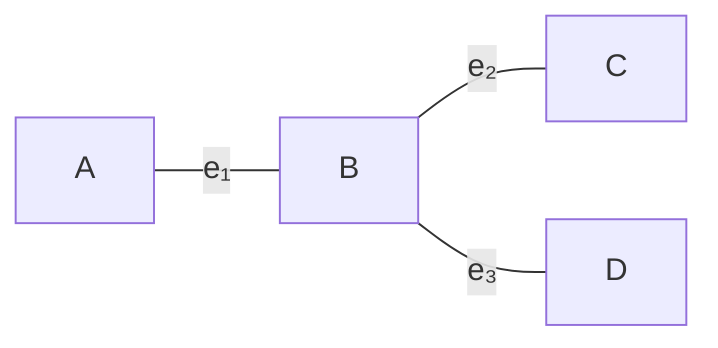

> 边 $e_1$ 和 $e_2$ 邻接（共享顶点 B）；边 $e_1$ 和 $e_3$ 邻接（共享顶点 B）。

---

## 4. 邻域 (Neighborhood)

**定义 1.9**：设 $G = (V, E)$ 是图，$v \in V$：

$$N(v) = \{u \in V : \exists e \in E \text{ s.t. } e = \{u, v\} \text{ or } (u = v \text{ and } e = \{v\})\}$$

| 符号 | 名称 | 定义 |
|------|------|------|
| $N(v)$ | 开邻域 | 与 $v$ 邻接的所有顶点 |
| $N[v]$ | 闭邻域 | $N(v) \cup \{v\}$ |
| $N_G(v)$ | 图 $G$ 中 $v$ 的邻域 | 当 $v$ 属于多个图时使用 |

> **注意**：当图存在自环时，**顶点可能属于其自身的开邻域**

**示例**：求顶点 B 的邻域

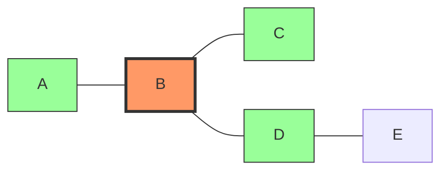

> - $N(B) = \{A, C, D\}$（绿色顶点）
> - $N[B] = \{A, B, C, D\}$

---

## 5. 度 (Degree)

**定义 1.13**：顶点 $v$ 的度记为 $\deg(v)$：

$$\deg(v) = |\{e \in E : \exists u \in V, e = \{u, v\}\}| + 2 \cdot |\{e \in E : e = \{v\}\}|$$

即：**非自环边数 + 2 × 自环数**

> 自环对度的贡献为 2（因为从该顶点出发又回到自身）。

**示例**：计算各顶点的度

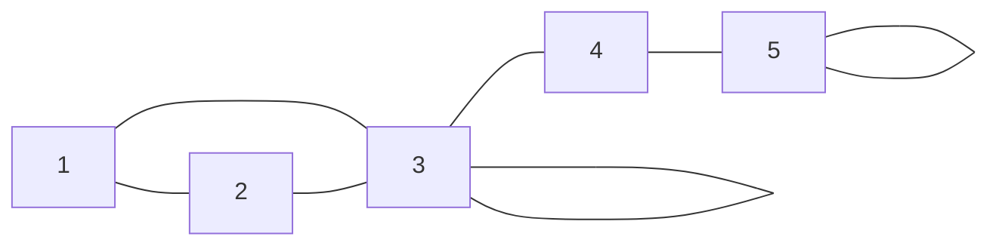

> - $\deg(1) = 2$（边 {1,2}, {1,3}）
> - $\deg(2) = 2$（边 {1,2}, {2,3}）
> - $\deg(3) = 4$（边 {2,3}, {3,4}, {3,3} → 1 + 1 + 2 = 4）
> - $\deg(4) = 2$（边 {3,4}, {4,5}）
> - $\deg(5) = 3$（边 {4,5}, {5,5} → 1 + 2 = 3）

### 最大/最小度

**定义**：
- $\Delta(G) = \max_{v \in V} \deg(v)$ — 最大度
- $\delta(G) = \min_{v \in V} \deg(v)$ — 最小度

> 上例中：$\Delta(G) = 4$，$\delta(G) = 2$

---

## 6. 有向图 (Directed Graph)

**定义 1.22 (有向图)**：有向图是一个二元组 $G = (V, E)$，其中 $V$ 是（有限）顶点集，$E$ 是 $V \times V$ 的元素集合，即有序对（有向边）的集合。

$$E \subseteq V \times V$$

> 有向边 $(u, v)$ 表示从 $u$ 指向 $v$ 的弧，$u$ 称为**源点 (source/tail)**，$v$ 称为**目标点 (destination/sink/head)**（定义 1.23）。

**示例有向图**：$V = \{1, 2, 3, 4\}$，$E = \{(1,2), (2,3), (3,4), (4,1), (1,3)\}$

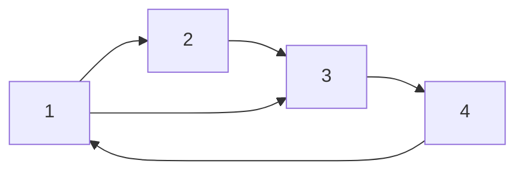

> [!note] 有向图与无向图的区别
> 有向图用**有序对** $(v_1, v_2)$ 代替无向图的**无序对** $\{v_1, v_2\}$，边的方向赋予图以流向的概念。有序对 $(v_1, v_2)$ 与 $(v_2, v_1)$ 是不同的边，因此同时存在两者不构成多重图（定义 1.25）。

**定义 1.23 (源点/目标点)**：设有向边 $e = (v_1, v_2)$，则 $v_1$ 称为 $e$ 的**源点 (source/tail)**，$v_2$ 称为 $e$ 的**目标点 (destination/sink/head)**。

### 6.1 入度与出度 (In-degree and Out-degree)

**定义 1.27 (入度/出度)**：设 $G = (V, E)$ 是有向图，顶点 $v$ 的：

- **出度 (out-degree)**：以 $v$ 为源点的有向边数量，记为 $\deg_{\text{out}}(v)$
  $$\deg_{\text{out}}(v) = |\{(v, u) \in E : u \in V\}|$$
- **入度 (in-degree)**：以 $v$ 为目标点的有向边数量，记为 $\deg_{\text{in}}(v)$
  $$\deg_{\text{in}}(v) = |\{(u, v) \in E : u \in V\}|$$

也可记作 $\deg^+(v)$（出度）和 $\deg^-(v)$（入度）。

> 顶点 $v$ 的总度 $\deg(v) = \deg_{\text{out}}(v) + \deg_{\text{in}}(v)$。

**基本定理**：在任何有向图中，出度之和等于入度之和等于边数：

$$\sum_{v \in V} \deg_{\text{out}}(v) = \sum_{v \in V} \deg_{\text{in}}(v) = |E|$$

> 每条有向边恰好贡献一个出度（给其源点）和一个入度（给其目标点）。

**示例**：计算下图中各顶点的入度和出度

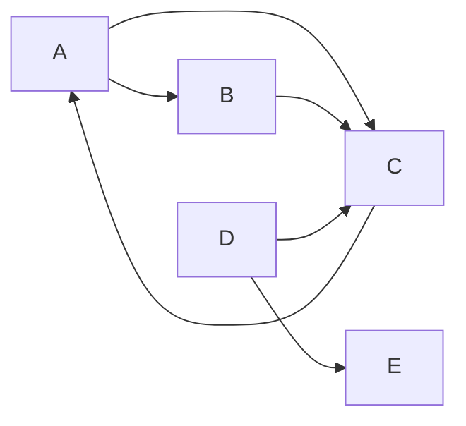

> - $\deg_{\text{out}}(A) = 2$（A→B, A→C），$\deg_{\text{in}}(A) = 1$（C→A）
> - $\deg_{\text{out}}(B) = 1$（B→C），$\deg_{\text{in}}(B) = 1$（A→B）
> - $\deg_{\text{out}}(C) = 1$（C→A），$\deg_{\text{in}}(C) = 3$（A→C, B→C, D→C）
> - $\deg_{\text{out}}(D) = 2$（D→C, D→E），$\deg_{\text{in}}(D) = 0$
> - $\deg_{\text{out}}(E) = 0$，$\deg_{\text{in}}(E) = 1$（D→E）

### 6.2 底层图 (Underlying Graph)

**定义 1.28 (底层图)**：设 $G = (V, E)$ 是有向图，$G$ 的**底层图**是将每条有向边 $(v_1, v_2)$ 替换为无序对 $\{v_1, v_2\}$ 后得到的（多重）图。若是有向自环 $(v, v)$，则替换为单元素集 $\{v\}$。

> 底层图剥离了方向信息，只保留顶点之间是否存在连接以及多重性。

**示例**：将有向图转换为其底层图

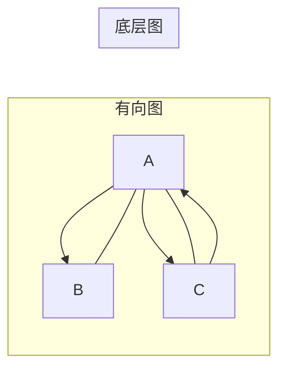

> 左图的有向边 (A→B) 和 (A→C)、(C→A) 在右图的底层图中分别变为无向边 {A,B} 和 {A,C}；注意 (A→C) 和 (C→A) 两条不同的有向边在底层图中合并为同一条无向边 {A,C}，如果同时存在则构成多重边。

**Remark 1.29**：顶点邻接、边邻接、邻域等概念可以通过底层图自然地扩展到有向图上。即有向图 $G$ 中顶点 $v$ 的邻域 $N(v)$ 是在其底层图上计算的。

---

## 7. 多重图 (Multigraph)

**定义 1.17**：若图 $G = (V, E)$ 中存在两条边 $e_1, e_2$ 作为集合相等（即 $e_1 = e_2 = \{v_1, v_2\}$），则称为**多重图**。

> 边集 $E$ 是多重集，允许重复边（平行边）。

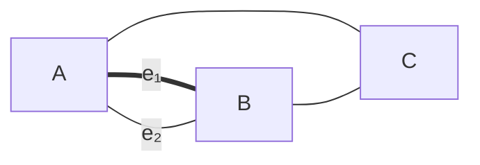

> 上图 A 和 B 之间有两条平行边，构成多重图。

---

## 8. 柯尼斯堡桥问题 (Königsberg Bridge Problem)

**历史背景**：图论起源于 Euler 对柯尼斯堡桥问题的研究。

**问题**：能否从一座岛屿出发，经过每座桥恰好一次？

**建模**：
- 岛屿 → 顶点
- 桥 → 边

得到的多重图中，每个顶点的度都是奇数。Euler 证明了这样的路径不存在，奠定了图论基础。

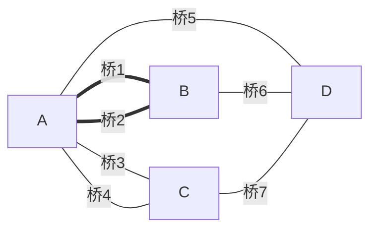

> 所有顶点的度都是奇数：$\deg(A)=5$, $\deg(B)=3$, $\deg(C)=3$, $\deg(D)=3$

---

## 符号速查

| 符号 | 含义 |
|------|------|
| $G = (V, E)$ | 图（顶点集 + 边集） |
| $\{u, v\}$ | 连接 $u$ 和 $v$ 的边 |
| $\{v\}$ | 顶点 $v$ 上的自环 |
| $N(v)$ | 开邻域 |
| $N[v]$ | 闭邻域 |
| $\deg(v)$ | 顶点 $v$ 的度（无向图） |
| $\Delta(G)$ | 图 $G$ 的最大度 |
| $\delta(G)$ | 图 $G$ 的最小度 |
| $\deg_{\text{out}}(v)$ 或 $\deg^+(v)$ | 顶点 $v$ 的出度（有向图） |
| $\deg_{\text{in}}(v)$ 或 $\deg^-(v)$ | 顶点 $v$ 的入度（有向图） |