---
tags:
  - Math
  - GraphTheory
  - 定义性
  - 基本原理
title: Graph - Degree Sequences & Subgraphs
created: 2026-07-03
modified:
---
# Graph - Degree Sequences & Subgraphs

> [!info] Source
> Christopher Griffin, *Applied Graph Theory* (2023), Chapter 2: Degree Sequences and Subgraphs

## 1. Degree Sequences

### 1.1 Definition of Degree Sequence

**Definition 2.1 (Degree Sequence).** Let $G = (V, E)$ be a graph with $V = \{v_1, v_2, \dots, v_n\}$. The **degree sequence** of $G$ is the nonincreasing list of the degrees of its vertices:

$$\deg(v_1) \ge \deg(v_2) \ge \cdots \ge \deg(v_n)$$

Equivalently, it is the ordered $n$-tuple $(\deg(v_1), \deg(v_2), \dots, \deg(v_n))$ sorted in descending order.

> In some texts, the degree sequence is written as an unordered multiset. The convention in Griffin (2023) is the sorted descending list.

**Examples.**

| Graph | Degree Sequence | Illustration |
|:------|:----------------|:-------------|
| $K_4$ (complete graph on 4 vertices) | $(3, 3, 3, 3)$ | Every vertex connects to the other 3 |
| $P_4$ (path on 4 vertices) | $(2, 2, 1, 1)$ | Two endpoints (deg 1), two internal vertices (deg 2) |
| $C_5$ (cycle on 5 vertices) | $(2, 2, 2, 2, 2)$ | Every vertex has degree 2 |
| $K_{3,3}$ (complete bipartite) | $(3, 3, 3, 3, 3, 3)$ | All vertices have degree 3 |

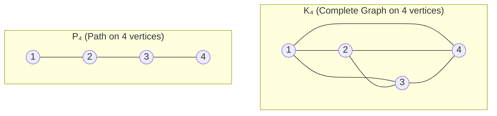

> **Notation**: $\deg(v)$ denotes the degree of vertex $v$. For a graph $G$, $\Delta(G) = \max_{v \in V} \deg(v)$ is the **maximum degree** and $\delta(G) = \min_{v \in V} \deg(v)$ is the **minimum degree**.

### 1.2 Handshaking Lemma

**Theorem 2.2 (Handshaking Lemma).** Let $G = (V, E)$ be a graph. Then:

$$\sum_{v \in V} \deg(v) = 2|E|$$

> *Proof.* Each edge $\{u, v\}$ contributes 1 to $\deg(u)$ and 1 to $\deg(v)$. A self-loop $\{v\}$ contributes 2 to $\deg(v)$ (by Definition 1.13). Summing over all vertices, every edge is counted exactly twice. Hence the sum of degrees equals $2|E|$.

**Corollary 2.2.1.** In any graph, the number of vertices with odd degree is even.

> *Proof.* Let $V_{\text{odd}}$ be the set of vertices with odd degree and $V_{\text{even}}$ the set with even degree. Then:
> $$2|E| = \sum_{v \in V_{\text{odd}}} \deg(v) + \sum_{v \in V_{\text{even}}} \deg(v)$$
> The RHS is even. The sum over $V_{\text{even}}$ is even (sum of evens). Therefore the sum over $V_{\text{odd}}$ must also be even. Since each term in that sum is odd, the number of terms $|V_{\text{odd}}|$ must be even.

> [!tip] Intuition
> The Handshaking Lemma is called so because if people shake hands at a party, the total number of handshakes (edges) is half the sum of handshakes per person (degrees). The corollary tells us that the number of people who shook an odd number of hands is always even.

**Examples.**

| Graph | $\sum \deg(v)$ | $|E|$ | Verification |
|:------|:---------------|:------|:-------------|
| $K_4$ | $3+3+3+3 = 12$ | 6 | $12 = 2 \times 6$ ✓ |
| $P_4$ | $1+2+2+1 = 6$ | 3 | $6 = 2 \times 3$ ✓ |
| $C_5$ | $2 \times 5 = 10$ | 5 | $10 = 2 \times 5$ ✓ |

### 1.3 Graphic Sequences

**Definition (Graphic Sequence).** A nonincreasing sequence of nonnegative integers $d_1 \ge d_2 \ge \cdots \ge d_n$ is called **graphic** if there exists a simple graph (no loops, no multiple edges) whose degree sequence is exactly $(d_1, d_2, \dots, d_n)$.

Not every nonincreasing sequence of integers is realizable as a degree sequence of a simple graph.

> [!example] Counterexample
> The sequence $(3, 3, 1, 1)$ is **not** graphic. By the Handshaking Lemma, the sum is $3+3+1+1 = 8$, so any graph would have $|E| = 4$. But a simple graph on 4 vertices can have at most $\binom{4}{2} = 6$ edges — the problem is more subtle. To have two vertices of degree 3, each must connect to all 3 other vertices, but then the remaining two vertices would each have degree at least 2, contradicting degree 1.

**Theorem 2.3 (Havel–Hakimi Theorem).** A nonincreasing sequence $d_1 \ge d_2 \ge \cdots \ge d_n$ of nonnegative integers with $n \ge 2$ is graphic if and only if the sequence

$$d_2 - 1, \; d_3 - 1, \; \dots, \; d_{d_1+1} - 1, \; d_{d_1+2}, \; \dots, \; d_n$$

re-sorted into nonincreasing order is graphic.

> *Proof idea.* If a sequence is graphic, take a vertex $v$ of maximum degree $d_1$. It must be adjacent to $d_1$ other vertices. By a suitable graph transformation, we can assume it is adjacent to the $d_1$ vertices with the next largest degrees. Removing $v$ and decrementing those degrees gives a graphic sequence of length $n-1$. The converse constructs a graph by adding $v$ back.

**Algorithm (Havel–Hakimi).**

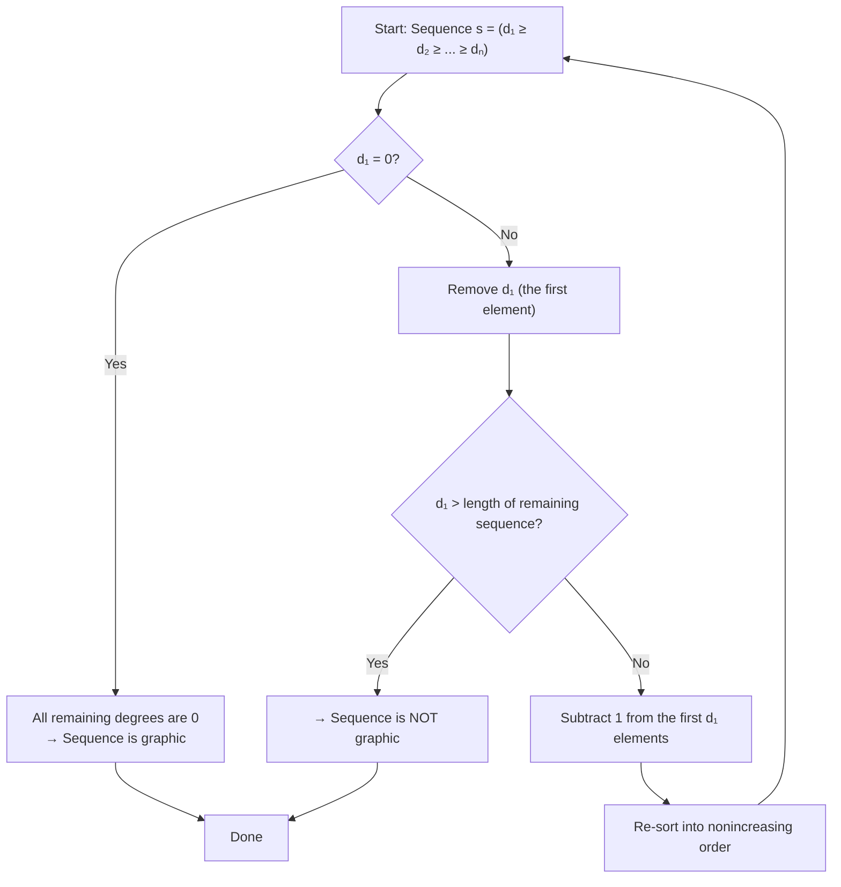

**Example: Is $(3, 3, 2, 2, 2)$ graphic?**

| Step | Sequence | Action |
|:-----|:---------|:-------|
| 1 | $(3, 3, 2, 2, 2)$ | Original; $d_1 = 3$ |
| 2 | $(2, 1, 1, 2)$ | Remove 3, subtract 1 from first 3 entries: $(3-1, 2-1, 2-1, 2) = (2, 1, 1, 2)$ |
| 3 | $(2, 2, 1, 1)$ | Re-sort |
| 4 | $(1, 0, 1)$ | $d_1 = 2$, remove, subtract 1 from first 2: $(2-1, 1-1, 1) = (1, 0, 1)$ |
| 5 | $(1, 1, 0)$ | Re-sort |
| 6 | $(0, 0)$ | $d_1 = 1$, remove, subtract 1 from first 1: $(1-1, 0) = (0, 0)$ |
| 7 | $(0, 0)$ | Re-sort (already sorted) |
| 8 | — | $d_1 = 0$ → sequence is **graphic** ✓ |

> [!check] Verification
> The graph realizing $(3, 3, 2, 2, 2)$ is a **5-vertex graph** where the two degree-3 vertices connect to all others, and the three degree-2 vertices form a triangle among themselves — this is $K_5$ minus a perfect matching.

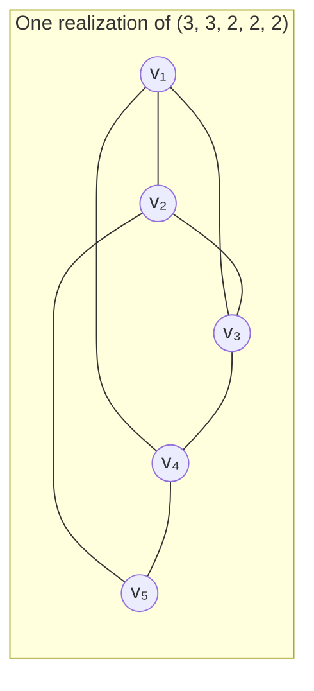

> $\deg(v_1) = 3$, $\deg(v_2) = 3$, $\deg(v_3) = 2$, $\deg(v_4) = 2$, $\deg(v_5) = 2$

**Example: Is $(4, 4, 3, 2, 1)$ graphic?**

| Step | Sequence | Action |
|:-----|:---------|:-------|
| 1 | $(4, 4, 3, 2, 1)$ | Original; $d_1 = 4$ |
| 2 | $(3, 2, 1, 0)$ | Remove 4, subtract 1 from first 4: $(4-1, 3-1, 2-1, 1-1) = (3, 2, 1, 0)$ |
| 3 | $(3, 2, 1, 0)$ | Already sorted |
| 4 | $(1, 0, -1)$ | $d_1 = 3$, remove, subtract 1 from first 3: $(2-1, 1-1, 0-1) = (1, 0, -1)$ |

Since $-1$ appears, the sequence is **not graphic**.

### 1.4 Regular Graphs

**Definition 2.5 (Regular Graph).** A graph $G = (V, E)$ is called **$k$-regular** if $\deg(v) = k$ for all $v \in V$. That is, every vertex has the same degree $k$.

> [!note] Terminology
> - A **0-regular** graph has no edges (empty graph on $n$ vertices)
> - A **1-regular** graph is a disjoint union of edges (a perfect matching)
> - A **2-regular** graph is a disjoint union of cycles
> - A **3-regular** graph is called **cubic**

**Examples of Regular Graphs.**

| $k$ | Example | Vertices | Notes |
|:---:|:--------|:--------:|:------|
| 0 | $n$ isolated vertices | $n$ | Empty graph $\overline{K_n}$ |
| 1 | $K_2$, or $m$ disjoint edges | $2m$ | Perfect matching |
| 2 | $C_n$ (cycle graph) | $n \ge 3$ | Connected 2-regular |
| $n-1$ | $K_n$ (complete graph) | $n$ | Maximum possible regularity |
| 3 | Petersen graph | 10 | Classic cubic graph |

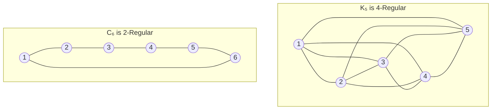

**Properties of Regular Graphs.**

1. If $G$ is $k$-regular on $n$ vertices, then $|E| = \frac{nk}{2}$ (by the Handshaking Lemma).
2. A $k$-regular graph on $n$ vertices exists only if $nk$ is even and $k \le n-1$.
3. **Complement**: If $G$ is $k$-regular on $n$ vertices, then its complement $\overline{G}$ is $(n-1-k)$-regular.

> [!warning] Regularity and Existence
> Not all combinations $(n, k)$ with $nk$ even and $k \le n-1$ admit a $k$-regular simple graph. Additional constraints from graph realization exist, especially for small $n$.

## 2. Subgraphs

### 2.1 Definitions

**Definition 2.7 (Subgraph).** Let $G = (V, E)$ and $G' = (V', E')$ be graphs. $G'$ is a **subgraph** of $G$ (denoted $G' \subseteq G$) if:
- $V' \subseteq V$, and
- $E' \subseteq E$ (where every edge in $E'$ has both endpoints in $V'$)

**Special types of subgraphs.**

| Type | Definition | Notation |
|:-----|:-----------|:---------|
| **Spanning subgraph** | $V' = V$ (all vertices retained) | $G' \subseteq G$ with $V' = V$ |
| **Induced subgraph** | $V' = S \subseteq V$, $E' = \{\{u,v\} \in E : u, v \in S\}$ | $G[S]$ |
| **Edge-induced subgraph** | $E' \subseteq E$, $V' =$ all endpoints of edges in $E'$ | $G[E']$ |

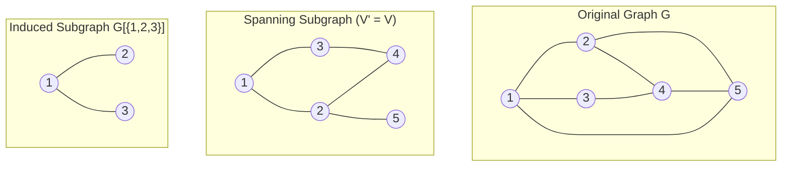

> **Spanning subgraph**: retains all original vertices but may omit edges. Note edges {3,4}, {4,5}, {1,5} are removed.
>
> **Induced subgraph $G[\{1,2,3\}]$**: retains vertices 1, 2, 3 and all original edges among them. Edge {2,3} is not in original $G$, so it is absent.

**Example: Induced vs. non-induced subgraph.**

Consider $G$ as a triangle $K_3$ on vertices $\{1,2,3\}$ plus an isolated vertex $4$.

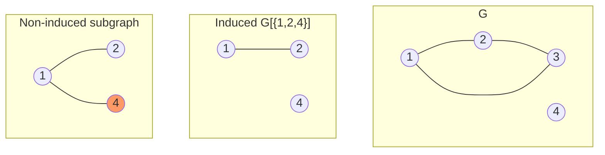

In the non-induced subgraph, edge {1,4} is added that did not exist in $G$. This is **not** allowed — a subgraph's edge set must be a subset of $G$'s edge set. The valid edge set for a subgraph on $\{1,2,4\}$ can only include existing edges $\{1,2\}$.

### 2.2 Graph Operations

**Edge Deletion.** $G - e$ is the graph obtained by removing edge $e$ from $G$. Vertices remain unchanged.

> $G - e$ is a spanning subgraph of $G$.

**Vertex Deletion.** $G - v$ is the graph obtained by removing vertex $v$ and all edges incident to $v$.

> $G - v$ is an induced subgraph of $G$ on $V \setminus \{v\}$, i.e., $G - v = G[V \setminus \{v\}]$.

**Edge Contraction.** $G / e$ is the graph obtained by identifying (merging) the two endpoints of edge $e$ into a single vertex, removing $e$, and retaining all other edges (with parallel edges kept).

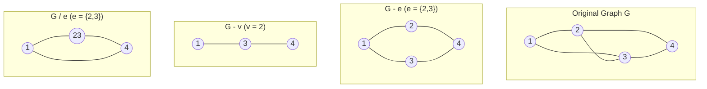

> [!note]
> Edge contraction is a fundamental operation in graph minor theory. A graph $H$ is a **minor** of $G$ if $H$ can be obtained from $G$ by a sequence of edge deletions, vertex deletions, and edge contractions.

## 3. Cliques, Independent Sets, Complements & Covers

### 3.1 Cliques

**Definition 2.11 (Clique).** Let $G = (V, E)$ be a graph. A subset $S \subseteq V$ is a **clique** if every pair of distinct vertices in $S$ is adjacent — i.e., $G[S]$ is a complete graph.

- A **maximal clique** is a clique that is not properly contained in any larger clique.
- A **maximum clique** is a clique of largest possible size in $G$.
- The **clique number** $\omega(G)$ is the size of a maximum clique in $G$.

> [!tip] Maximal vs. Maximum
> Every maximum clique is maximal, but not vice versa. A maximal clique cannot be enlarged, while a maximum clique is the largest possible (there could be many maximal cliques of different sizes).

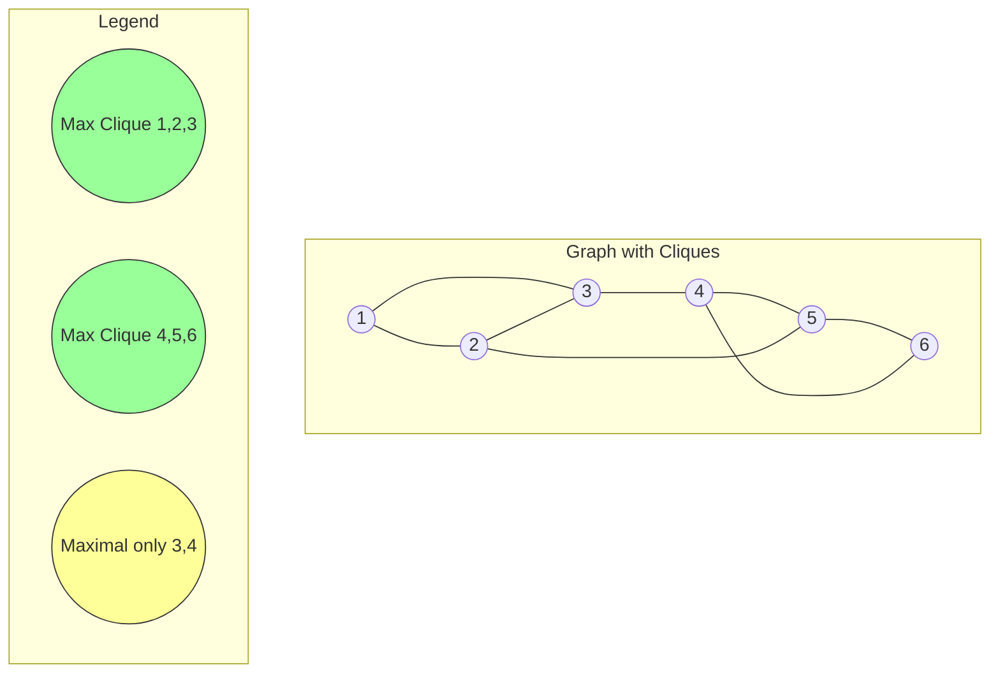

In the example above:
- Vertices $\{1,2,3\}$ form a maximum clique: $\omega(G) = 3$
- Vertices $\{4,5,6\}$ also form a maximum clique of size 3
- Vertices $\{3,4\}$ form a clique of size 2 — it is maximal (no vertex can be added to form a larger clique containing both 3 and 4) but not maximum

**Examples of Clique Numbers.**

| Graph | $\omega(G)$ | Maximum Clique(s) |
|:------|:-----------:|:------------------|
| $K_n$ | $n$ | The entire vertex set |
| $P_n$ ($n \ge 2$) | $2$ | Any edge |
| $C_n$ ($n \ge 3$) | $2$ (if $n=3$, $3$) | $C_3$ (triangle) has $\omega = 3$ |
| $K_{m,n}$ | $2$ | Any edge (no triangles in bipartite graphs) |
| Petersen graph | $2$ | No triangles |
| Empty graph $\overline{K_n}$ | $1$ | Any single vertex |

**Proposition.** $\omega(G) \ge 3$ if and only if $G$ contains a triangle.

### 3.2 Independent Sets

**Definition 2.14 (Independent Set).** Let $G = (V, E)$ be a graph. A subset $S \subseteq V$ is an **independent set** (or **stable set**) if no two vertices in $S$ are adjacent.

- A **maximal independent set** is an independent set not properly contained in any larger independent set.
- A **maximum independent set** is an independent set of largest possible size.
- The **independence number** $\alpha(G)$ is the size of a maximum independent set in $G$.

> [!note] Duality
> Cliques and independent sets are dual concepts:
> - $S$ is a clique in $G$ $\iff$ $S$ is an independent set in the complement $\overline{G}$
> - $S$ is an independent set in $G$ $\iff$ $S$ is a clique in $\overline{G}$
> - Consequently: $\omega(G) = \alpha(\overline{G})$ and $\alpha(G) = \omega(\overline{G})$

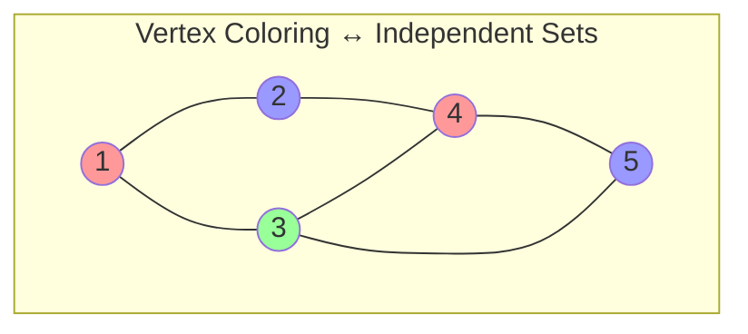

> Vertices of the same color form an independent set:
> - Red: $\{1, 4\}$ (size 2)
> - Blue: $\{2, 5\}$ (size 2)
> - Green: $\{3\}$ (size 1)
>
> Here $\alpha(G) = 2$.

**Examples.**

| Graph | $\alpha(G)$ | Maximum Independent Set |
|:------|:----------:|:-----------------------|
| $K_n$ | $1$ | Any single vertex |
| $P_n$ | $\lceil n/2 \rceil$ | Alternating vertices |
| $C_n$ ($n \ge 3$) | $\lfloor n/2 \rfloor$ | Alternating vertices |
| $K_{m,n}$ | $\max(m, n)$ | The larger partition |
| Empty graph $\overline{K_n}$ | $n$ | All vertices |

### 3.3 Graph Complement

**Definition 2.16 (Graph Complement).** Let $G = (V, E)$ be a graph. The **complement** of $G$, denoted $\overline{G}$, is the graph on the same vertex set $V$ where $\{u, v\}$ is an edge in $\overline{G}$ if and only if $\{u, v\}$ is **not** an edge in $G$ (and $u \ne v$).

$$\overline{G} = (V, \{\{u, v\} : u \ne v,\; \{u, v\} \notin E\})$$

> [!note]
> Self-loops are not considered in the complement — $\overline{G}$ is always a simple graph (no loops).

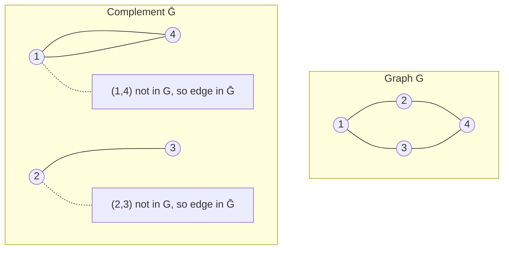

**Properties of Complements.**

1. $\overline{\overline{G}} = G$
2. $|E(\overline{G})| = \binom{n}{2} - |E(G)|$
3. If $G$ is disconnected, $\overline{G}$ may be connected, and vice versa.
4. $\omega(G) = \alpha(\overline{G})$ and $\alpha(G) = \omega(\overline{G})$
5. $\Delta(\overline{G}) = n - 1 - \delta(G)$
6. $\delta(\overline{G}) = n - 1 - \Delta(G)$

> [!tip] Self-Complementary Graphs
> A graph $G$ is **self-complementary** if $G \cong \overline{G}$. Such graphs exist only when $n \equiv 0$ or $1 \pmod{4}$. Examples: $P_4$, $C_5$.

### 3.4 Vertex Covers

**Definition 2.18 (Vertex Cover).** Let $G = (V, E)$ be a graph. A subset $C \subseteq V$ is a **vertex cover** if every edge $e \in E$ has at least one endpoint in $C$.

- A **minimum vertex cover** is a vertex cover of smallest possible size.
- The **vertex cover number** $\tau(G)$ is the size of a minimum vertex cover in $G$.

> [!note] Equivalence
> $C \subseteq V$ is a vertex cover $\iff$ $V \setminus C$ is an independent set.
>
> *Proof.* If every edge touches $C$, then no edge has both endpoints in $V \setminus C$, so $V \setminus C$ is independent. Conversely, if $V \setminus C$ is independent, no edge lies entirely outside $C$, so every edge touches $C$.

**Corollary.** $|C| + |S| = |V|$ for any vertex cover $C$ and independent set $S$ with $C = V \setminus S$. Therefore:

$$\tau(G) + \alpha(G) = |V|$$

where $\tau(G)$ is the vertex cover number (size of minimum vertex cover) and $\alpha(G)$ is the independence number.

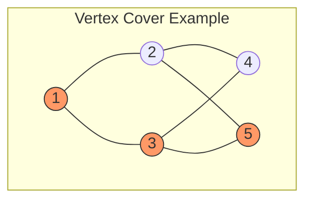

> Vertices $\{1, 3, 5\}$ (orange) form a vertex cover: every edge has at least one orange endpoint. The complementary set $\{2, 4\}$ is independent. Is this a **minimum** vertex cover? $\tau(G) = 2$ (e.g., vertices $\{3, 2\}$ also cover all edges).

**König's Theorem (for Bipartite Graphs).**

**Theorem (König, 1931).** In any bipartite graph $G = (V, E)$,

$$\tau(G) = \nu(G)$$

where $\tau(G)$ is the size of a minimum vertex cover and $\nu(G)$ is the size of a maximum matching.

> [!note] Significance
> König's theorem is a classic result in combinatorial optimization. For general (non-bipartite) graphs, $\tau(G) \ge \nu(G)$, but equality is not guaranteed. The difference is captured by the **Kőnig–Egerváry theorem** and the theory of **perfect graphs**.

**Example: Bipartite Graph.**

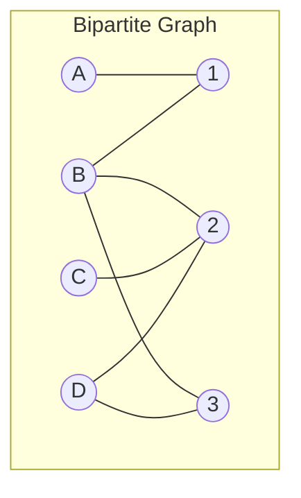

A maximum matching (size $\nu = 2$): e.g., $\{A{-}1, B{-}2\}$ or $\{A{-}1, D{-}3\}$.
A minimum vertex cover (size $\tau = 2$): e.g., $\{B, R2\}$ or $\{L2, 2\}$.

## 4. Practice Examples

### Example 1: Degree Sequence → Graphic → Clique/Independent Set Analysis

**Problem.** Given the degree sequence $(4, 4, 3, 3, 2)$:

1. Determine if it is graphic using Havel–Hakimi.
2. Construct a graph realizing this sequence.
3. Find $\omega(G)$, $\alpha(G)$, and a minimum vertex cover.

**Solution.**

**Step 1: Havel–Hakimi.**

| Step | Sequence | Action |
|:-----|:---------|:-------|
| 1 | $(4, 4, 3, 3, 2)$ | Original |
| 2 | $(3, 2, 2, 1)$ | Remove 4, subtract 1 from first 4: $(3, 2, 2, 1)$ |
| 3 | $(3, 2, 2, 1)$ | Already sorted |
| 4 | $(1, 1, 0)$ | Remove 3, subtract 1 from first 3: $(1, 1, 0)$ |
| 5 | $(1, 1, 0)$ | Already sorted |
| 6 | $(0, 0)$ | Remove 1, subtract 1 from first 1: $(0, 0)$ |
| 7 | $(0, 0)$ | $d_1 = 0$ → **Graphic** ✓ |

**Step 2: Construction.**

Working backwards from Havel–Hakimi, we realize the graph:

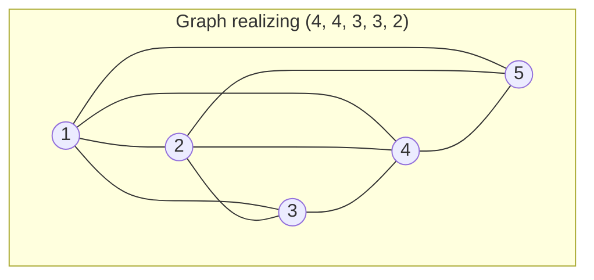

> $\deg(1) = 4$, $\deg(2) = 4$, $\deg(3) = 3$, $\deg(4) = 3$, $\deg(5) = 2$

**Step 3: Parameters.**

- Maximum clique: $\{1, 2, 3, 4\}$ forms $K_4$ → $\omega(G) = 4$
- Maximum independent set: $\{3, 5\}$ (or $\{4, 5\}$) → $\alpha(G) = 2$
- Minimum vertex cover: $\tau(G) = n - \alpha(G) = 5 - 2 = 3$ (e.g., $\{1, 2, 4\}$)

### Example 2: Complements and Self-Complementary Graphs

**Problem.** Show that $P_4$ (the path on 4 vertices) is self-complementary.

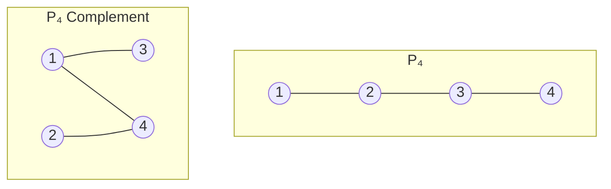

Under the vertex mapping $(1 \mapsto 2,\; 2 \mapsto 4,\; 3 \mapsto 1,\; 4 \mapsto 3)$, the complement is isomorphic to the original $P_4$. Hence $P_4$ is self-complementary.

**Verify:** |E(P₄)| = 3, |E(overline(P₄))| = C(4,2) - 3 = 3. ✓

### Example 3: Vertex Cover via König's Theorem

**Problem.** In the bipartite graph below, find a maximum matching and a minimum vertex cover.

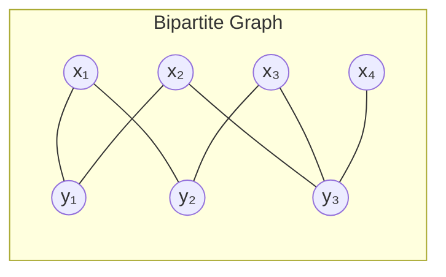

**Maximum Matching.** $\nu = 3$: e.g., $\{x_1{-}y_2,\; x_2{-}y_1,\; x_4{-}y_3\}$

**Minimum Vertex Cover.** By König, $\tau = \nu = 3$: e.g., $\{x_2, x_3, y_2\}$ or $\{y_1, y_2, y_3\}$.

**Verification.** The set $\{y_1, y_2, y_3\}$ touches every edge: edges $\{x_1,y_1\}$, $\{x_1,y_2\}$, $\{x_2,y_1\}$, $\{x_2,y_3\}$, $\{x_3,y_2\}$, $\{x_3,y_3\}$, $\{x_4,y_3\}$ all have at least one endpoint in $\{y_1, y_2, y_3\}$. The complement $\{x_1, x_2, x_3, x_4\}$ is independent.

## 符号速查

| 符号 | 含义 | 首次出现 |
|:-----|:-----|:---------|
| $\deg(v)$ | 顶点 $v$ 的度 | §1.1 |
| $\Delta(G)$ | 图 $G$ 的最大度 $\max\deg(v)$ | §1.1 |
| $\delta(G)$ | 图 $G$ 的最小度 $\min\deg(v)$ | §1.1 |
| $G' \subseteq G$ | $G'$ 是 $G$ 的子图 | §2.1 |
| $G[S]$ | 顶点子集 $S$ 诱导的子图 | §2.1 |
| $G - e$ | 删除边 $e$ | §2.2 |
| $G - v$ | 删除顶点 $v$ | §2.2 |
| $G / e$ | 收缩边 $e$ | §2.2 |
| $\omega(G)$ | 团数（最大团的大小） | §3.1 |
| $\alpha(G)$ | 独立数（最大独立集的大小） | §3.2 |
| $\overline{G}$ | 图 $G$ 的补图 | §3.3 |
| $\tau(G)$ | 顶点覆盖数（最小顶点覆盖的大小） | §3.4 |
| $\nu(G)$ | 匹配数（最大匹配的大小） | §3.4 |
| $K_n$ | $n$ 个顶点的完全图 | §1.1 |
| $P_n$ | $n$ 个顶点的路 | §1.1 |
| $C_n$ | $n$ 个顶点的圈 | §1.4 |
| $K_{m,n}$ | 完全二分图（两部分大小分别为 $m$ 和 $n$） | §1.1 |

## 相关链接

- [[Graph - Definitions]] — 基本定义（图、邻接、度、有向图、多重图）
- [[Graph - Walks, Cycles & Connectivity]] — 路径、回路、连通性
- [[../../Linear_Algebra/Linear_Algebra_MOC]] — 线性代数总览（图论中的邻接矩阵、拉普拉斯矩阵相关）
- [[../Set_Theory/Cartesian product|Cartesian Product]] — 集合论基础（图的笛卡尔积运算）

> [!seealso] Further Reading
> - **Chapter 2 of Griffin (2023)** covers additional topics: graph unions, intersections, and Cartesian products.
> - **Dirac's theorem** and **Ore's theorem** (Ch. 4) provide sufficient conditions for Hamiltonian cycles based on degree constraints.
> - The **Erdős–Gallai theorem** gives an alternative characterization of graphic sequences (more efficient than Havel–Hakimi for large $n$).
