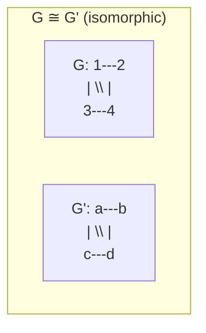
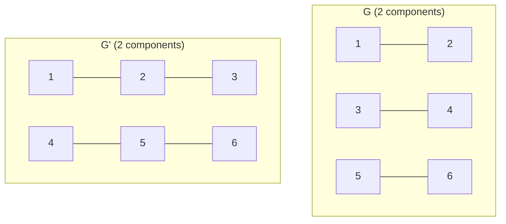
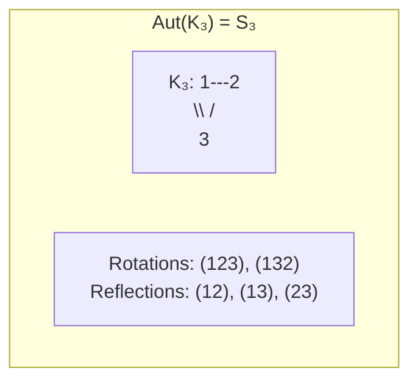
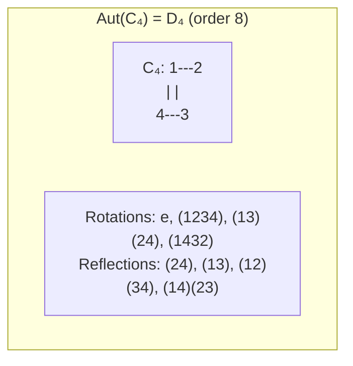
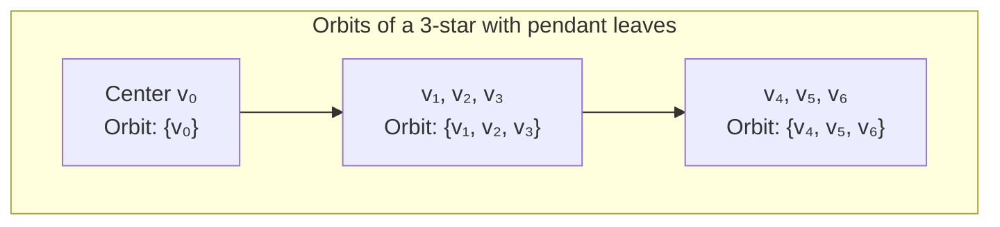
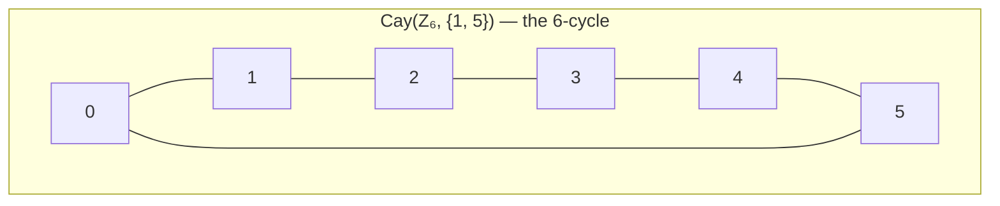
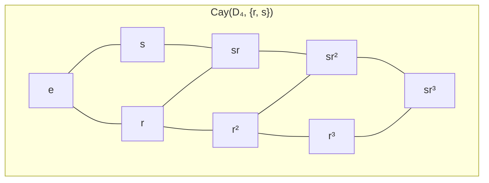
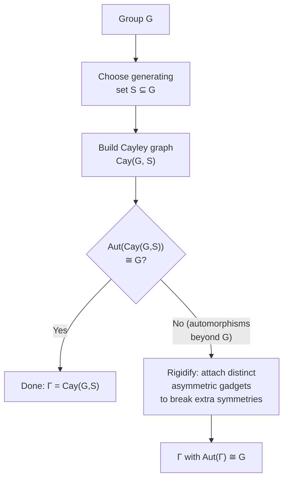
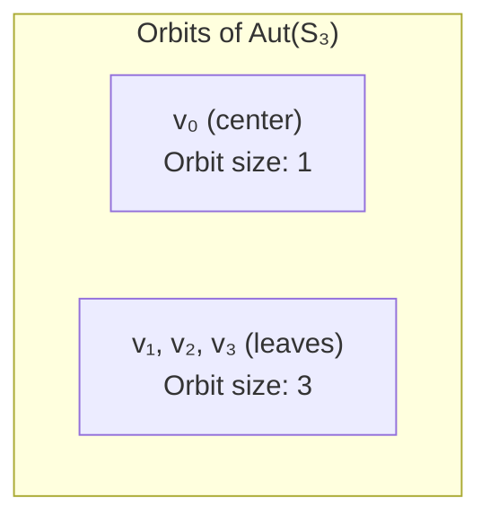

---
tags:
  - Math
  - GraphTheory
  - AbstractAlgebra
  - 概念性
  - 定理性
title: Graph - Isomorphism & Automorphism
created: 2026-07-03
modified:
---
# Graph - Isomorphism & Automorphism

> [!info] Source
> Christopher Griffin, *Applied Graph Theory* (2023), Chapter 8: Algebraic Graph Theory with Abstract Algebra

## 1. Graph Isomorphism

### 1.1 Definition

**Definition 8.6 (Graph isomorphism).** Let $G = (V, E)$ and $G' = (V', E')$ be graphs. $G$ and $G'$ are **isomorphic**, denoted $G \cong G'$, if there exists a **bijection** $f : V \to V'$ such that for all $v_1, v_2 \in V$:

$$\{v_1, v_2\} \in E \iff \{f(v_1), f(v_2)\} \in E'$$

The map $f$ is called a **graph isomorphism**. If $G \cong G'$, then $G$ and $G'$ are the same graph up to renaming of vertices — they have **identical structure**.

> [!note] Intuition
> Isomorphism is vertex renaming. You can relabel vertices arbitrarily; if the edge relation matches after relabeling, the graphs are structurally identical.

**Definition 8.7 (Isomorphism class).** Let $G = (V, E)$ be a graph. The set $\{H : H \cong G\}$ is called the **isomorphism type** (or **isomorphism class**) of $G$.

> The two 4-vertex graphs above are isomorphic: map $1 \mapsto a$, $2 \mapsto b$, $3 \mapsto c$, $4 \mapsto d$.

### 1.2 Isomorphic vs. Non-Isomorphic — A Cautionary Example

Having the same degree sequence is **necessary** for isomorphism but **not sufficient**. Consider the graphs in Fig. 8.2 of Griffin:

Both graphs above have degree sequence $d = (2,2,2,2,2,2) = d'$ and both have two components — yet they are **not isomorphic**: $G$ consists of three disjoint $K_2$ components, while $G'$ consists of two disjoint $P_3$ paths. No bijection can map a component of size 2 to a component of size 3.

> [!warning] Key lesson
> A matching degree sequence is **necessary** but **not sufficient** to prove isomorphism. One must check deeper structural invariants.

### 1.3 Graph Invariants

**Theorem 8.8 (Graph invariant theorem).** Let $G = (V, E)$ and $G' = (V', E')$ be graphs with $G \cong G'$ and $f : V \to V'$ the isomorphism. Then:

| # | Invariant | Notation | Preserved? |
|:-:|:---------|:--------:|:----------:|
| 1 | Number of vertices | $|V| = |V'|$ | ✅ |
| 2 | Number of edges | $|E| = |E'|$ | ✅ |
| 3 | Degree of each vertex | $\deg(v) = \deg(f(v))$ | ✅ |
| 4 | Degree sequence | $d = d'$ | ✅ |
| 5 | Eccentricity | $\operatorname{ecc}(v) = \operatorname{ecc}(f(v))$ | ✅ |
| 6 | Clique number | $\omega(G) = \omega(G')$ | ✅ |
| 7 | Independence number | $\alpha(G) = \alpha(G')$ | ✅ |
| 8 | Number of components | $c(G) = c(G')$ | ✅ |
| 9 | Diameter | $\operatorname{diam}(G) = \operatorname{diam}(G')$ | ✅ |
| 10 | Radius | $\operatorname{rad}(G) = \operatorname{rad}(G')$ | ✅ |
| 11 | Girth | $\text{girth}(G) = \text{girth}(G')$ | ✅ |
| 12 | Circumference | $\text{circ}(G) = \text{circ}(G')$ | ✅ |
| 13 | **Spectrum** | $\operatorname{spec}(G) = \operatorname{spec}(G')$ | ✅ |

**Proof sketch.** Each follows directly from the definition: since $f$ is a bijection that preserves adjacency, any property defined purely in terms of the adjacency relation is invariant under renaming of vertices. For the spectrum: isomorphic graphs have identical adjacency matrices up to permutation similarity $A' = P A P^{\sf T}$, so eigenvalues coincide (see [[Graph - Adjacency Matrix & Spectrum]]).

### 1.4 Necessary vs. Sufficient Conditions

The invariants in Theorem 8.8 are **necessary** conditions for isomorphism — if any differs, the graphs cannot be isomorphic. However, they are **not sufficient**: there exist non-isomorphic graphs that share all these invariants.

| Condition | Status |
|:---------|:------:|
| Matching degree sequence | ❌ Not sufficient |
| Matching number of cycles of each length | ❌ Not sufficient |
| Matching spectrum | ❌ **Not sufficient** (cospectral non-isomorphic graphs exist) |
| Matching all known invariants | ❌ Still not proven sufficient |
| Existence of an explicit bijection preserving adjacency | ✅ **Necessary and sufficient** (by definition) |

The **graph isomorphism problem** (Definition 8.13) — determining whether two given graphs are isomorphic — is of unknown complexity. It is not known to be in P nor NP-complete, though it is widely believed to be solvable in quasipolynomial time (Babai, 2016). The **subgraph isomorphism problem** (Definition 8.14) — determining whether $G$ contains a subgraph isomorphic to $H$ — is **NP-complete**.

> [!note] Trees
> There is a **linear-time** algorithm for determining isomorphism of two trees.

### 1.5 Spectrum as an Invariant

The **adjacency spectrum** of $G$ is the multiset of eigenvalues of its adjacency matrix $A(G)$. If $G \cong G'$, then $A' = P A P^{\sf T}$ for some permutation matrix $P$, so $\operatorname{spec}(G) = \operatorname{spec}(G')$. The converse is false: **cospectral** (same spectrum) non-isomorphic graphs exist.

> [!example] Cospectral non-isomorphic pair
> The 5-vertex graphs $C_4 \cup K_1$ (a 4-cycle with an isolated vertex) and $K_{1,4}$ (the star with 4 leaves) share the same spectrum $\{2, 0, 0, 0, -2\}$, yet they are clearly not isomorphic (different degree sequences). More subtle cospectral pairs exist where all invariants in Theorem 8.8 match.

See [[Graph - Adjacency Matrix & Spectrum]] for a full treatment.

---

## 2. Graph Automorphism

### 2.1 Definition

**Definition 8.16 (Automorphism).** Let $G = (V, E)$ be a graph. An **automorphism** is an isomorphism from $G$ to itself — a bijection $f : V \to V$ such that for all $v_1, v_2 \in V$:

$$\{v_1, v_2\} \in E \iff \{f(v_1), f(v_2)\} \in E$$

An automorphism is a symmetry of the graph: a permutation of vertices that preserves all adjacency relationships.

**Lemma 8.18 (Inverse).** If $f$ is an automorphism of $G$, then $f^{-1}$ is also an automorphism of $G$.

**Lemma 8.20 (Composition).** If $f$ and $g$ are automorphisms of $G$, then $f \circ g$ is also an automorphism of $G$.

### 2.2 The Automorphism Group $\operatorname{Aut}(G)$

**Theorem 8.26.** Let $G = (V, E)$ be a graph. The set of all automorphisms of $G$, denoted $\operatorname{Aut}(G)$, together with function composition $\circ$, forms a **group**.

*Proof.*
- **Closure** — Lemma 8.20: $f \circ g \in \operatorname{Aut}(G)$.
- **Associativity** — Function composition is always associative.
- **Identity** — The identity map $\operatorname{id}_V(v) = v$ is an automorphism.
- **Inverses** — Lemma 8.18: every automorphism has an inverse.
$\square$

Thus $\operatorname{Aut}(G)$ is a subgroup of the symmetric group $S_{|V|}$ — it is a **permutation group** acting on the vertex set $V$ (see [[Abstract_Algebra/Permutation Groups]]).

### 2.3 Examples

#### Complete graphs: $\operatorname{Aut}(K_n) \cong S_n$

Every permutation of vertices preserves adjacency (all pairs are adjacent), so $\operatorname{Aut}(K_n) = S_n$ and $|\operatorname{Aut}(K_n)| = n!$.

| Permutation | Type | Geometric interpretation (equilateral triangle) |
|:-----------:|:----:|:-----------------------------------------------:|
| $e$ | Identity | No movement |
| $(1\;2\;3)$ | 3-cycle | Rotation $120^\circ$ counterclockwise |
| $(1\;3\;2)$ | 3-cycle | Rotation $120^\circ$ clockwise |
| $(1\;2)$ | Transposition | Reflection across median through vertex 3 |
| $(1\;3)$ | Transposition | Reflection across median through vertex 2 |
| $(2\;3)$ | Transposition | Reflection across median through vertex 1 |

#### Cycle graphs: $\operatorname{Aut}(C_n) \cong D_n$

The automorphism group of an $n$-cycle is the **dihedral group** $D_n$ of order $2n$, consisting of $n$ rotations and $n$ reflections.

For $C_n$:
- **Rotations**: $\rho^k$ for $k = 0, 1, \dots, n-1$, where $\rho = (1\;2\;3\;\dots\;n)$.
- **Reflections**: If $n$ is odd, $n$ reflections each fixing one vertex; if $n$ is even, $n/2$ reflections fixing two opposite vertices and $n/2$ reflections fixing no vertices (pairwise swaps).

#### Path graphs: $\operatorname{Aut}(P_n) \cong S_1$ or $S_2$

- $\operatorname{Aut}(P_1) \cong S_1$ (trivial group).
- $\operatorname{Aut}(P_n) \cong S_2$ (order 2) for $n \ge 2$, generated by the reversal map $i \mapsto n+1-i$.

#### Star graphs: $\operatorname{Aut}(S_n) \cong S_n$

The star graph $S_n$ has $n+1$ vertices: one center $v_0$ connected to $n$ leaves $v_1, \dots, v_n$. The center must map to itself (unique degree $n$), while the $n$ leaves can be permuted arbitrarily. Hence $|\operatorname{Aut}(S_n)| = n!$.

#### Asymmetric graphs

Most graphs have **trivial automorphism group** $\operatorname{Aut}(G) \cong \{e\}$. Such graphs are called **asymmetric** (or rigid). As $n \to \infty$, the proportion of $n$-vertex graphs with $\operatorname{Aut}(G) \cong \{e\}$ approaches 1.

### 2.4 Vertex Orbits

The automorphism group $\operatorname{Aut}(G)$ acts on $V$ by permutation. The **orbit** of a vertex $v \in V$ under this action is:

$$\operatorname{Orb}(v) = \{g(v) : g \in \operatorname{Aut}(G)\}$$

Vertices in the same orbit are **structurally indistinguishable** — there is an automorphism mapping one to the other. The **stabilizer** of $v$ is $\operatorname{Stab}(v) = \{g \in \operatorname{Aut}(G) : g(v) = v\}$.

> **Example:** In a rooted tree with three levels, vertices at the same depth and with isomorphic subtrees belong to the same orbit. The center (unique degree 3) forms a singleton orbit; the three middle vertices form one orbit; the six leaves form another.

**Orbit-Stabilizer Theorem** (applied to $\operatorname{Aut}(G)$):

$$|\operatorname{Orb}(v)| \cdot |\operatorname{Stab}(v)| = |\operatorname{Aut}(G)|$$

---

## 3. Groups in Graph Theory

### 3.1 Group Axioms (Review)

A **group** $(S, \circ)$ is a set $S$ with a binary operation $\circ : S \times S \to S$ satisfying:

1. **Associativity**: $(a \circ b) \circ c = a \circ (b \circ c)$
2. **Identity**: $\exists e \in S$ such that $e \circ a = a \circ e = a$ for all $a \in S$
3. **Inverses**: $\forall a \in S$, $\exists a^{-1} \in S$ such that $a \circ a^{-1} = a^{-1} \circ a = e$

If also $a \circ b = b \circ a$ for all $a, b$, the group is **abelian**.

Groups appear naturally in graph theory as automorphism groups $\operatorname{Aut}(G)$ (Theorem 8.26). See [[Abstract_Algebra/Group]] for a complete treatment.

### 3.2 Permutation Groups

A **permutation** on a set $V = \{1, \dots, n\}$ is a bijection $f : V \to V$. A **permutation group** on $V$ is a set of permutations closed under composition. The **symmetric group** $S_n$ is the set of all permutations on $n$ elements; $|S_n| = n!$.

Since a graph automorphism is a permutation of vertices that preserves adjacency, $\operatorname{Aut}(G)$ is always a **subgroup** of $S_{|V|}$. See [[Abstract_Algebra/Permutation Groups]] for detailed coverage of cycle notation, transpositions, sign homomorphisms, and the alternating group.

---

## 4. Permutation Groups and Graph Automorphisms

### 4.1 Cayley's Theorem

> [!theorem] Cayley's Theorem
> Every group $G$ of order $n$ is isomorphic to a subgroup of $S_n$. In other words, **every group is a permutation group**.

*Proof sketch.* For each $g \in G$, define the left-multiplication map $L_g : G \to G$ by $L_g(h) = gh$. Each $L_g$ is a permutation of $G$. The map $\phi : G \to S_G$, $\phi(g) = L_g$, is an injective group homomorphism. $\square$

This foundational result connects abstract groups to concrete permutation groups, and through Frucht's theorem (below) to graph automorphism groups.

### 4.2 Cayley Graphs

**Definition (Cayley graph).** Let $G$ be a group and $S \subseteq G$ a **generating set** (closed under inverses, $S = S^{-1}$, and $e \notin S$). The **Cayley graph** $\operatorname{Cay}(G, S)$ is the directed graph (or undirected when $S = S^{-1}$) with:

- **Vertex set**: $G$ (each group element is a vertex).
- **Edge set**: For each $g \in G$ and $s \in S$, a directed edge $g \xrightarrow{s} g s$ (or undirected edge when $s = s^{-1}$).

> $\operatorname{Cay}(\mathbb{Z}_6, \{1, 5\})$ is a 6-cycle $C_6$, since the generating set $\{1, 5\}$ corresponds to $\pm 1$ modulo 6.

**Properties of Cayley graphs:**

- $\operatorname{Cay}(G, S)$ is **regular** of degree $|S|$.
- $\operatorname{Cay}(G, S)$ is **connected** iff $S$ generates $G$.
- The **automorphism group** of $\operatorname{Cay}(G, S)$ always contains $G$ itself (acting by left multiplication). That is, $G \hookrightarrow \operatorname{Aut}(\operatorname{Cay}(G, S))$.
- In many cases (when $S$ is well-chosen), $\operatorname{Aut}(\operatorname{Cay}(G, S)) \cong G$.

**Example — Cayley graph of $D_4$:**

> The Cayley graph of the dihedral group $D_4 = \langle r, s \mid r^4 = s^2 = e, srs = r^{-1} \rangle$ with generating set $\{r, s\}$ yields an 8-vertex graph whose automorphism group contains $D_4$ itself.

### 4.3 Frucht's Theorem

> [!theorem] Frucht's Theorem (1939)
> For every finite group $G$, there exists a finite graph $\Gamma$ such that $\operatorname{Aut}(\Gamma) \cong G$. That is, **every finite group is the automorphism group of some graph**.

*Proof strategy.*
1. Take a generating set $S$ of $G$ and construct the Cayley graph $\operatorname{Cay}(G, S)$.
2. The Cayley graph's automorphism group contains $G$ but may be larger.
3. "Rigidify" $\operatorname{Cay}(G, S)$ by attaching distinct asymmetric subgraphs (e.g., paths of distinct lengths) to vertices corresponding to generators, breaking any extra symmetries while preserving the $G$-action.
4. The resulting graph has $\operatorname{Aut}$ exactly $G$.

> [!note] Historical significance
> Frucht's theorem shows that groups and graphs are in a precise sense **equi-expressive**: any finite group can be realized as the symmetries of some graph. This result launched the field of **graphical regular representations** and deepened the connection between group theory and graph theory.

### 4.4 Summary: The Group–Graph Connection

| Theorem | Statement | Significance |
|:--------|:----------|:-------------|
| Cayley's theorem | Every group $G \hookrightarrow S_n$ | Groups = permutation groups |
| Cayley graphs | $G \hookrightarrow \operatorname{Aut}(\operatorname{Cay}(G, S))$ | Groups appear as graph automorphisms |
| Frucht's theorem | $\forall G\; \exists \Gamma : \operatorname{Aut}(\Gamma) \cong G$ | All finite groups are graph symmetry groups |

---

## 5. Fixed Points, Transitivity, and Orbit Structure

### 5.1 Fixed Points

An automorphism $f \in \operatorname{Aut}(G)$ has a **fixed point** $v \in V$ if $f(v) = v$.

- The identity automorphism fixes every vertex.
- A non-identity automorphism may have any number of fixed points from $0$ to $|V|-2$ (it cannot fix all but one vertex unless it is identity).
- Determining whether a graph has an **automorphism with no fixed points** is **NP-complete**.

### 5.2 Transitivity

An automorphism group action on $V$ is:

- **Vertex-transitive**: For any $u, v \in V$, there exists $f \in \operatorname{Aut}(G)$ such that $f(u) = v$ (i.e., one orbit).
- **Edge-transitive**: For any edges $e_1, e_2 \in E$, there exists $f \in \operatorname{Aut}(G)$ such that $f(e_1) = e_2$.
- **Regular**: For any $u, v \in V$, there exists **exactly one** $f \in \operatorname{Aut}(G)$ such that $f(u) = v$.

| Graph | $\operatorname{Aut}(G)$ | Vertex-transitive? | Edge-transitive? |
|:------|:----------------------:|:------------------:|:----------------:|
| $K_n$ | $S_n$ | ✅ | ✅ |
| $C_n$ ($n\ge 3$) | $D_n$ | ✅ | ✅ |
| $P_n$ ($n\ge 2$) | $S_2$ | ❌ | ❌ |
| Star $S_n$ ($n\ge 2$) | $S_n$ | ❌ | ✅ |
| Petersen graph | $S_5$ | ✅ | ✅ |

**Example — orbit structure of the star graph $S_3$:**

> $\operatorname{Aut}(S_3) \cong S_3$: the center $v_0$ forms a singleton orbit (it is the unique vertex of degree 3); the three leaves form a single orbit of size 3.

### 5.3 Orbit-Stabilizer for Automorphism Groups

For any vertex $v \in V$:

$$|\operatorname{Aut}(G)| = |\operatorname{Orb}(v)| \cdot |\operatorname{Stab}(v)|$$

where $\operatorname{Stab}(v) = \{f \in \operatorname{Aut}(G) : f(v) = v\}$ is the stabilizer subgroup of $v$.

- Orbits partition $V$ into structurally indistinguishable classes.
- The size of each orbit divides $|\operatorname{Aut}(G)|$.
- If $\operatorname{Aut}(G)$ is vertex-transitive, then $|V|$ divides $|\operatorname{Aut}(G)|$.

---

## References

- Griffin, C. *Applied Graph Theory: An Introduction with Graph Optimization and Algebraic Graph Theory*. World Scientific, 2023. Chapter 8.
- Frucht, R. "Herstellung von Graphen mit vorgegebener abstrakter Gruppe." *Compositio Mathematica* 6 (1939): 239–250.
- Babai, L. "Graph Isomorphism in Quasipolynomial Time." *Proceedings of the 48th ACM STOC* (2016): 684–697.
- Godsil, C. & Royle, G. *Algebraic Graph Theory*. Springer, 2001.

## Related Notes

- [[Graph - Definitions]] — basic graph vocabulary
- [[Graph - Degree Sequences & Subgraphs]] — degree sequences, subgraphs
- [[Graph - Adjacency Matrix & Spectrum]] — adjacency matrix, spectral invariants
- [[Abstract_Algebra/Group]] — group axioms and basic theory
- [[Abstract_Algebra/Permutation Groups]] — $S_n$, cycle notation, Cayley's theorem
