---
tags:
  - Math
  - GraphTheory
  - LinearAlgebra
  - 定理性
  - 概念性
title: Graph - Laplacian & Spectral Clustering
created: 2026-07-03
modified:
---

# Graph — Laplacian & Spectral Clustering

> [!info] Source
> Christopher Griffin, *Applied Graph Theory* (2023), §10.4 The Graph Laplacian; also von Luxburg (2007), *A Tutorial on Spectral Clustering*; Chung (1997), *Spectral Graph Theory*.

**Prerequisites:** [[Linear_Algebra/Eigenvalues and Eigenvectors]], [[Linear_Algebra/Spectral Theorem]], [[Linear_Algebra/Diagonalization]], [[Graph - Adjacency Matrix & Spectrum]]

**Related:** [[Graph - Random Walks & PageRank]] (the normalized Laplacian $I - P$ links directly to random walks)

---

The graph Laplacian bridges **algebraic graph theory** and **unsupervised learning**. Its spectrum encodes connectivity, partitioning, and expansion properties of a graph, making it the central object in spectral graph theory.

---

## 1. The Graph Laplacian

### 1.1 Degree Matrix

**Definition 10.32 (Degree matrix).** Let $G = (V, E)$ be a simple graph with $V = \{v_1, \dots, v_n\}$. The **degree matrix** is the diagonal matrix

$$D_{ij} = \begin{cases}
\deg(v_i) & i = j \\[2pt]
0 & i \neq j
\end{cases}$$

**Example 10.33.** For the triangle graph $K_3$:

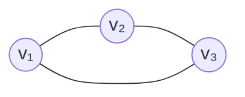

$$D = \begin{pmatrix}
2 & 0 & 0 \\
0 & 2 & 0 \\
0 & 0 & 2
\end{pmatrix}$$

since each vertex has degree 2.

---

### 1.2 Laplacian Matrix

**Definition 10.34 (Laplacian matrix).** Let $G = (V, E)$ be a simple graph with adjacency matrix $A$ and degree matrix $D$. The **graph Laplacian** (also called the *unnormalized* Laplacian) is

$$\boxed{L = D - A}$$

**Example 10.35.** For $K_3$:

$$A = \begin{pmatrix}
0 & 1 & 1 \\
1 & 0 & 1 \\
1 & 1 & 0
\end{pmatrix}
\qquad
L = \begin{pmatrix}
2 & -1 & -1 \\
-1 & 2 & -1 \\
-1 & -1 & 2
\end{pmatrix}$$

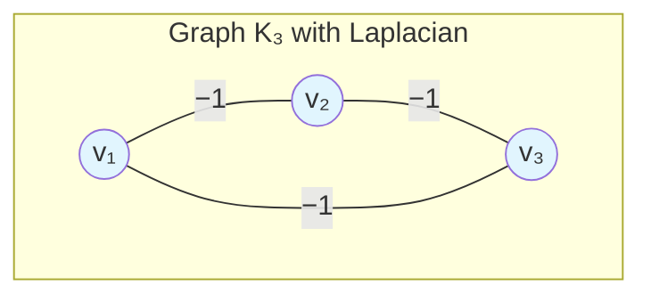

> Each off-diagonal entry $L_{ij} = -1$ when $(i,j) \in E$, and each diagonal entry $L_{ii} = \deg(v_i)$. The row sums of $L$ are always zero (Corollary 10.39).

---

### 1.3 The Quadratic Form (Fundamental Connection)

The power of the Laplacian comes from its **quadratic form**. For any vector $x \in \mathbb{R}^n$:

$$\boxed{x^T L x = \sum_{(i,j) \in E} (x_i - x_j)^2}$$

**Proof.** Expanding $L = D - A$:

$$
\begin{aligned}
x^T L x &= x^T D x - x^T A x \\
&= \sum_{i=1}^n d_i x_i^2 - \sum_{i,j} a_{ij} x_i x_j \\
&= \frac{1}{2} \left( \sum_{i,j} a_{ij} (x_i^2 + x_j^2) - 2 \sum_{i,j} a_{ij} x_i x_j \right) \\
&= \frac{1}{2} \sum_{i,j} a_{ij} (x_i - x_j)^2 = \sum_{(i,j) \in E} (x_i - x_j)^2
\end{aligned}
$$

> [!tip] Why this matters
> This identity connects $L$ to **smoothness** on the graph: if two adjacent vertices have very different values $x_i$, $x_j$, the quadratic form is large. A graph cut asks exactly which edges connect vertices assigned to different clusters.

---

### 1.4 Basic Properties

| Property | Statement |
|:---------|:----------|
| **Symmetry** | $L^T = L$ (Proposition 10.37) |
| **Positive semidefinite** | $x^T L x \ge 0$ for all $x \in \mathbb{R}^n$ |
| **Row sum = 0** | $L \cdot \mathbf{1} = 0$ (Corollary 10.39) |
| **Eigenvalues** | $0 = \lambda_1 \le \lambda_2 \le \cdots \le \lambda_n$ |
| **Eigenvector of $\lambda_1$** | $\mathbf{1} = (1,1,\dots,1)$ (Theorem 10.40) |

> [!proof] (Theorem 10.40)
> Let $\mathbf{1} = (1,1,\dots,1)^T$. The $i$-th component of $L\mathbf{1}$ is
> $$(L\mathbf{1})_i = \deg(v_i) - \sum_{j \neq i} a_{ij} = \deg(v_i) - \deg(v_i) = 0$$
> Hence $L\mathbf{1} = 0 = 0 \cdot \mathbf{1}$, so $\mathbf{1}$ is an eigenvector with eigenvalue $0$.

Positive semidefiniteness follows directly from the quadratic form: every term $(x_i - x_j)^2 \ge 0$.

---

## 2. Spectral Properties of the Laplacian

### 2.1 Eigenvalue Zero and Connected Components

The most important structural theorem about the Laplacian:

> [!theorem] Theorem 10.43 (Multiplicity = Components)
> Let $G = (V, E)$ be a graph with Laplacian $L$. The **algebraic multiplicity** of the eigenvalue $0$ equals the **number of connected components** of $G$.

**Proof sketch.** If $G$ has $k$ components $H_1, \dots, H_k$, then $L$ is block diagonal with blocks $L_1, \dots, L_k$, where each $L_i$ is the Laplacian of $H_i$. Each $L_i$ has eigenvector $\mathbf{1}_i$ (the all-ones vector of length $n_i$) with eigenvalue $0$. These $k$ eigenvectors are linearly independent, giving multiplicity at least $k$. The rank of $L$ is $\sum_i (n_i - 1) = n - k$, so by rank–nullity, the nullity is exactly $k$. ∎

> [!warning] Consequence
> - $\lambda_1 = 0$ always (with eigenvector $\mathbf{1}$)
> - $\lambda_2 > 0$ **iff** the graph is connected
> - $\lambda_2 = 0$ iff the graph has at least 2 components

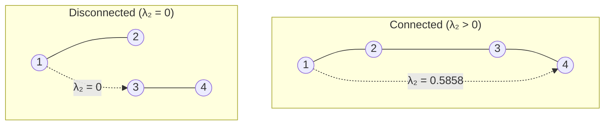

---

### 2.2 The Fiedler Value and Fiedler Vector

**Definition 10.46 (Fiedler value/vector).** For a connected graph, the **second smallest eigenvalue** $\lambda_2 > 0$ is called the **Fiedler value** (or *algebraic connectivity*). Its corresponding eigenvector is the **Fiedler vector**.

> [!theorem] Proposition 10.47
> $\lambda_2 > 0$ if and only if $G$ is connected.

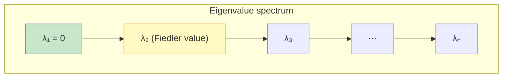

**Interpretation of $\lambda_2$:**

| Large $\lambda_2$ | Small $\lambda_2$ |
|:------------------|:------------------|
| Well-connected graph | Nearly disconnected |
| Strong community structure | Weak link between clusters |
| Good expansion properties | Bottleneck exists |
| Large Cheeger constant | Small cut separates parts |

**Bounds on the Fiedler value:**

$$\frac{2}{n} \cdot \kappa(G) \le \lambda_2 \le \frac{n}{n-1} \cdot \delta(G)$$

where $\kappa(G)$ is vertex connectivity and $\delta(G)$ is minimum degree. The upper bound follows from the Rayleigh quotient:

$$\lambda_2 \le \min_{x \perp \mathbf{1}} \frac{x^T L x}{x^T x}$$

---

### 2.3 The Fiedler Vector and Spectral Partitioning

> [!theorem] Theorem 10.49 (Connected subgraph property)
> Let $v$ be the Fiedler vector (eigenvector of $\lambda_2$). For any threshold $c$, the subgraph induced by
> $$V(v, c) = \{v_i \in V : v_i \ge c\}$$
> is a **connected subgraph** of $G$.

This is a remarkable property: **thresholding the Fiedler vector always yields a connected subgraph.** Setting $c = 0$ partitions vertices by the sign of their Fiedler vector entries — a **spectral clustering** (also called a **Cheeger cut**).

**Example 10.51 (Social network).** Consider this graph:

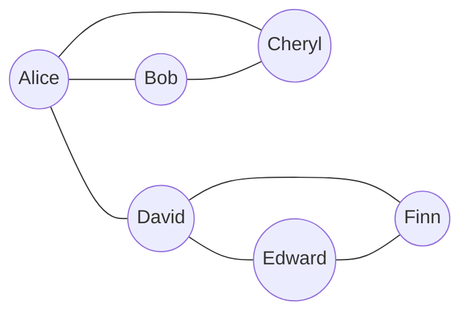

The Fiedler value is $\lambda_2 = 3 - \sqrt{5} \approx 0.7639$ (connected). The Fiedler vector (vertices in alphabetical order) is approximately:

$$v \approx \begin{pmatrix} -1.618 \\ -1.618 \\ -0.382 \\ 1 \\ 1.618 \\ 1 \end{pmatrix}$$

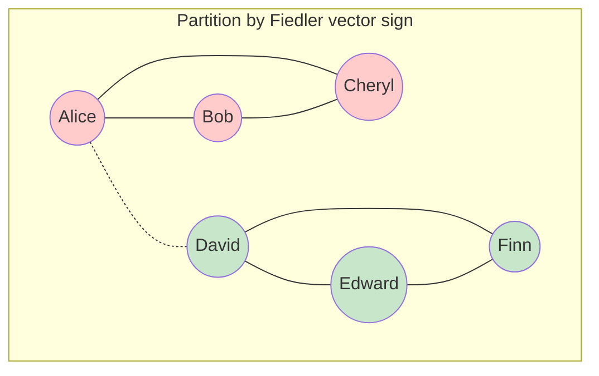

| Vertex | Fiedler entry | Sign | Cluster |
|:------:|:------------:|:----:|:-------:|
| Alice  | $-1.618$ | negative | $V_1$ |
| Bob    | $-1.618$ | negative | $V_1$ |
| Cheryl | $-0.382$ | negative | $V_1$ |
| David  | $1$      | positive | $V_2$ |
| Edward | $1.618$  | positive | $V_2$ |
| Finn   | $1$      | positive | $V_2$ |

The partition is exactly the two triangles $\{A,B,C\}$ and $\{D,E,F\}$ — the edge $A$-$D$ is the cut edge.

> [!note] Zero entries
> If a vertex has Fiedler entry exactly $0$, it can be placed in either partition (or left as a singleton). Such vertices typically bridge two otherwise separate groups.

---

## 3. Normalized Laplacians

For many applications (especially when degree distributions are uneven), the **unnormalized** Laplacian $L = D - A$ is replaced by one of two normalized variants.

### 3.1 Symmetric Normalized Laplacian

$$L_{\text{sym}} = D^{-1/2} L D^{-1/2} = I - D^{-1/2} A D^{-1/2}$$

**Properties:**
- Symmetric: $L_{\text{sym}}^T = L_{\text{sym}}$
- Positive semidefinite
- Eigenvalues $0 = \nu_1 \le \nu_2 \le \cdots \le \nu_n \le 2$ (for non-bipartite graphs, $\nu_n < 2$)
- Quadratic form: $x^T L_{\text{sym}} x = \sum_{(i,j)\in E} \left( \frac{x_i}{\sqrt{d_i}} - \frac{x_j}{\sqrt{d_j}} \right)^2$

### 3.2 Random-Walk Normalized Laplacian

$$L_{\text{rw}} = D^{-1} L = I - D^{-1} A = I - P$$

where $P = D^{-1}A$ is the transition matrix of a random walk on $G$.

**Properties:**
- Not symmetric (but similar to $L_{\text{sym}}$ via $L_{\text{rw}} = D^{-1/2} L_{\text{sym}} D^{1/2}$)
- Has the same eigenvalues as $L_{\text{sym}}$
- Eigenvectors of $L_{\text{rw}}$ satisfy $L_{\text{rw}} u = \nu u$ ⇒ the Rayleigh quotient for $L_{\text{rw}}$ is the **normalized cut** objective
- $L_{\text{rw}}$ is the **generator** of the random walk: $\frac{d}{dt} p(t) = -L_{\text{rw}} p(t)$

### 3.3 Comparison

| Laplacian | Formula | Symmetric | Eigenvalue range | Best for |
|:----------|:--------|:---------:|:----------------:|:---------|
| Unnormalized $L$ | $D - A$ | ✅ | $[0, \Delta]$ | Regular graphs, theory |
| Symmetric $L_{\text{sym}}$ | $I - D^{-1/2} A D^{-1/2}$ | ✅ | $[0, 2]$ | Degree-normalized analysis |
| Random-walk $L_{\text{rw}}$ | $I - D^{-1}A$ | ❌ | $[0, 2]$ | Spectral clustering (Ncut) |

> [!tip] Which to use?
> For spectral clustering, **$L_{\text{rw}}$ is recommended** (von Luxburg, 2007) because its eigenvectors directly solve the normalized cut relaxation. The unnormalized Laplacian can fail on graphs with highly varying degrees.

---

## 4. Matrix-Tree Theorem (Kirchhoff's Theorem)

The Laplacian also counts **spanning trees** — one of the most beautiful connections in graph theory.

> [!theorem] Kirchhoff's Matrix-Tree Theorem
> For a connected graph $G$ with Laplacian $L$, the number of spanning trees $\tau(G)$ is equal to **any cofactor** of $L$:
> $$\tau(G) = (-1)^{i+j} \det(L^{(ij)})$$
> where $L^{(ij)}$ is $L$ with row $i$ and column $j$ removed. Equivalently,
> $$\tau(G) = \frac{1}{n} \prod_{k=2}^n \lambda_k$$
> where $\lambda_2, \dots, \lambda_n$ are the non-zero eigenvalues of $L$.

### 4.1 Example: $K_4$ (Complete Graph on 4 Vertices)

$$K_4 \text{ Laplacian:} \quad L = \begin{pmatrix}
3 & -1 & -1 & -1 \\
-1 & 3 & -1 & -1 \\
-1 & -1 & 3 & -1 \\
-1 & -1 & -1 & 3
\end{pmatrix}$$

Remove row 4 and column 4:

$$L^{(44)} = \begin{pmatrix}
3 & -1 & -1 \\
-1 & 3 & -1 \\
-1 & -1 & 3
\end{pmatrix}$$

Compute determinant:

$$\det(L^{(44)}) = 3 \cdot (9 - 1) - (-1)(-3 + 1) + (-1)(1 - 3) = 24 + (-2) + 2 = 16$$

Using the eigenvalue formula: eigenvalues of $L$ for $K_4$ are $\{0, 4, 4, 4\}$, so

$$\tau(K_4) = \frac{1}{4} \cdot (4 \cdot 4 \cdot 4) = \frac{64}{4} = 16$$

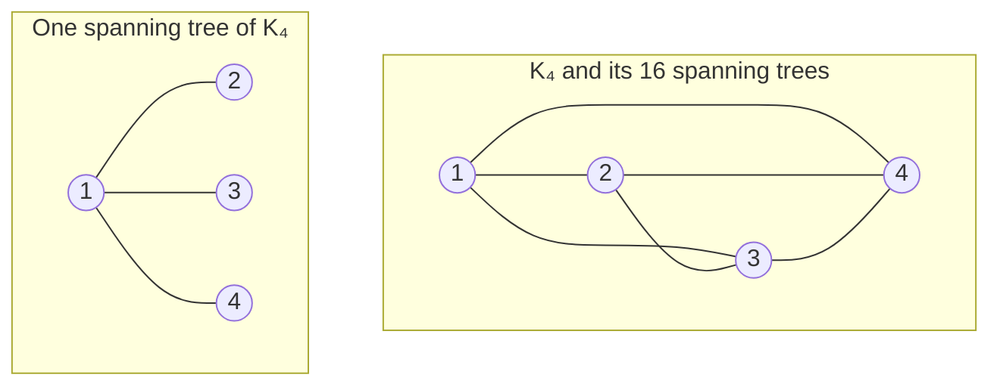

> [!check] Check
> Cayley's formula gives $\tau(K_n) = n^{n-2}$, so $\tau(K_4) = 4^{2} = 16$. ✓

---

## 5. Spectral Clustering

Spectral clustering is the most practically important application of the graph Laplacian. It uses eigenvectors of $L$ (or $L_{\text{rw}}$) to partition data when clusters are **non-convex** — a setting where $k$-means fails.

### 5.1 The Intuition

Clustering data points can be rephrased as a **graph partitioning** problem:
1. Build a similarity graph (e.g., $k$-NN, $\epsilon$-neighborhood, Gaussian kernel)
2. The weight $w_{ij}$ reflects similarity between points $i$ and $j$
3. Partition the graph to minimize **edges between clusters**

### 5.2 Ratio Cut and Normalized Cut

For a partition of $V$ into $k$ subsets $A_1, \dots, A_k$:

$$\text{RatioCut}(A_1, \dots, A_k) = \sum_{i=1}^k \frac{\text{cut}(A_i, \bar{A}_i)}{|A_i|}$$

$$\text{NCut}(A_1, \dots, A_k) = \sum_{i=1}^k \frac{\text{cut}(A_i, \bar{A}_i)}{\text{vol}(A_i)}$$

where $\text{cut}(A, B) = \sum_{i \in A, j \in B} w_{ij}$ and $\text{vol}(A) = \sum_{i \in A} d_i$.

Both are NP-hard to minimize directly. **Spectral clustering solves a continuous relaxation.**

### 5.3 The Relaxation

For $k = 2$, RatioCut minimization can be relaxed to:

$$\min_{x \perp \mathbf{1}} \frac{x^T L x}{x^T x}$$

whose solution is the **Fiedler vector** (eigenvector of $\lambda_2$). For NCut, the relaxation involves $L_{\text{rw}}$:

$$\min_{y} \frac{y^T L y}{y^T D y}$$

solved by the eigenvector of $L_{\text{rw}}$ with second smallest eigenvalue.

### 5.4 Algorithm: Spectral Clustering

**Input:** Data points $\{p_1, \dots, p_n\}$, desired clusters $k$

| Step | Action |
|:----|:-------|
| **1** | Build similarity graph $G$ (e.g., $k$-NN with Gaussian kernel $w_{ij} = \exp(-\|p_i - p_j\|^2 / 2\sigma^2)$) |
| **2** | Compute Laplacian: choose $L$, $L_{\text{sym}}$, or $L_{\text{rw}}$ |
| **3** | Compute the first $k$ eigenvectors $u_1, \dots, u_k$ of the chosen Laplacian |
| **4** | Form $U \in \mathbb{R}^{n \times k}$ with eigenvectors as columns |
| **5** | Treat each row of $U$ as a point in $\mathbb{R}^k$; run $k$-means |

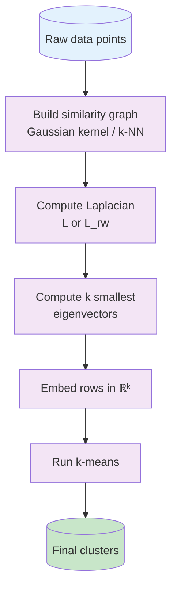

### 5.5 Why Spectral Clustering Works (Non-Convex Clusters)

Traditional $k$-means assumes spherical (convex) clusters and fails on concentric rings or intertwined moons:

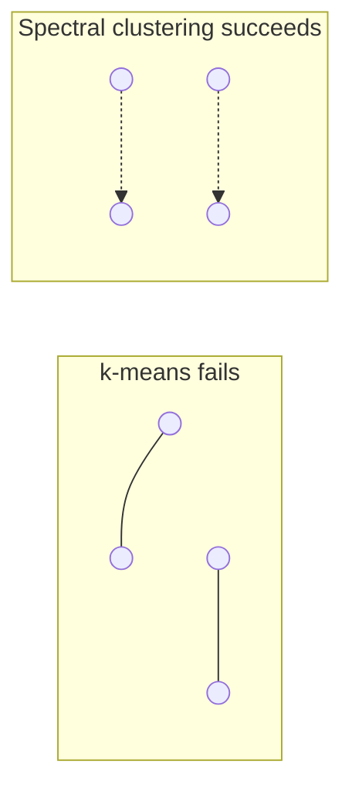

**Spectral clustering converts the non-convex spatial problem into a linear separability problem in the eigenvector embedding.** The Fiedler vector components of points from the same cluster are nearly constant, making them separable by simple thresholding or $k$-means.

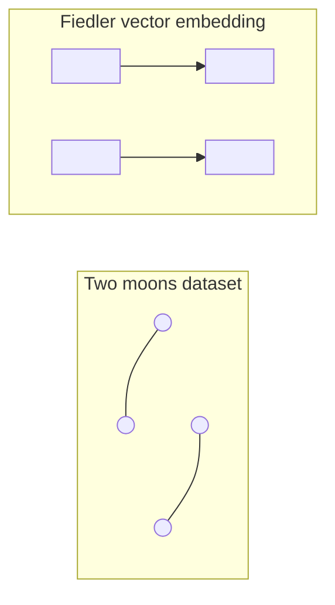

### 5.6 Choosing $k$

Several heuristics exist:

| Method | Description |
|:-------|:------------|
| **Eigengap** | Look for largest gap $\lambda_{k+1} - \lambda_k$; choose $k$ at the gap |
| **Silhouette** | Compute silhouette score on eigen-embedded data for various $k$ |
| **Stability** | Run spectral clustering multiple times with noise; choose $k$ giving most stable results |

### 5.7 Comparison: Spectral vs Traditional Clustering

| Aspect | $k$-means | Spectral clustering |
|:-------|:----------|:-------------------|
| Cluster shape | Convex, spherical | Arbitrary (non-convex) |
| Input | Raw points | Similarity graph |
| Objective | Minimize within-cluster variance | Minimize normalized cut |
| Determinism | Random initialization | Often deterministic (up to sign) |
| Scalability | $O(n)$ | $O(n^3)$ naive; $O(n^2)$ with sparse graphs |
| Assumption | Euclidean metric | Pairwise similarities |

---

## 6. Applications

### 6.1 Image Segmentation

Treat each pixel (or superpixel) as a graph vertex. Edge weights encode:
- Pixel intensity/color similarity
- Spatial proximity
- Texture similarity

The Fiedler vector then separates foreground from background:

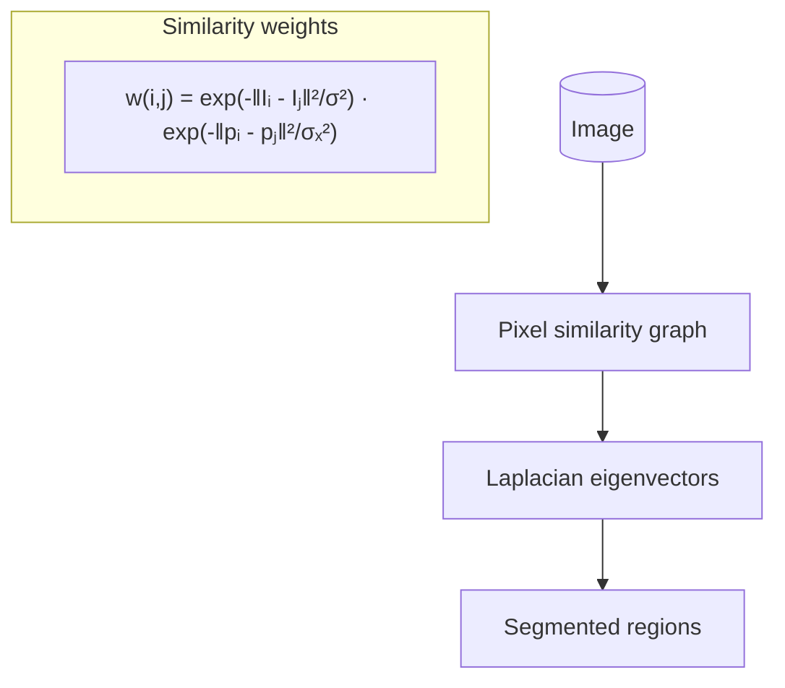

**Shi & Malik (2000)** pioneered normalized cut for image segmentation, using $L_{\text{rw}}$ eigenvectors to recursively partition images.

### 6.2 Community Detection in Social Networks

Social networks often have **community structure** — groups with dense internal connections and sparse external connections. Spectral clustering on the graph Laplacian reveals these communities.

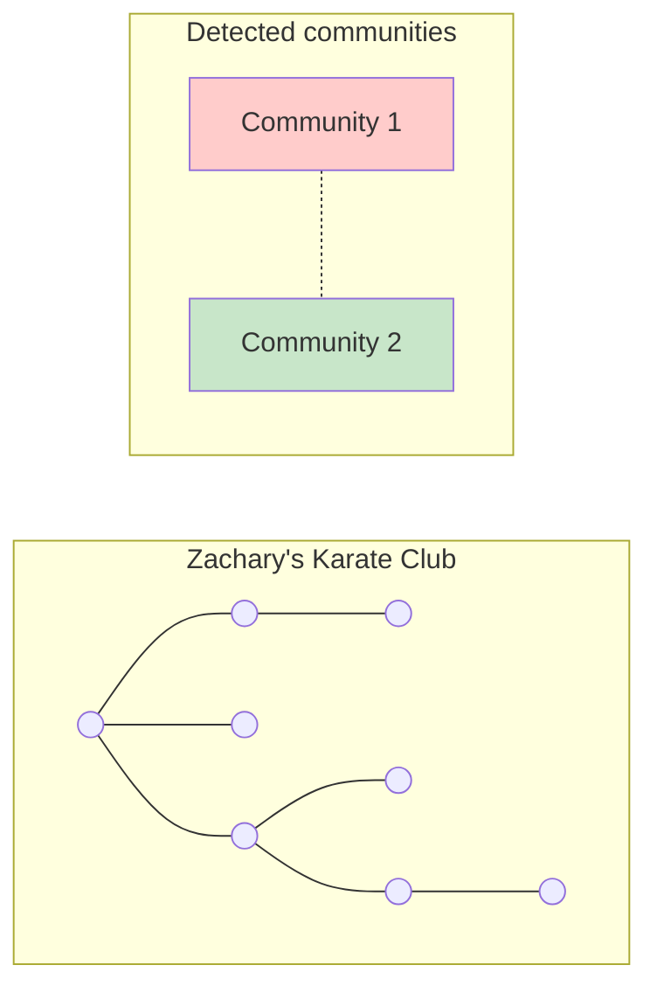

> [!note] Classic dataset
> Zachary's karate club network (1977) is the canonical example: spectral clustering on $L$ recovers the split that actually occurred during the study with nearly perfect accuracy.

### 6.3 Graph Partitioning for Parallel Computing

Large-scale scientific computing distributes data across processors. The goal: **minimize communication** (edges between partitions) while **balancing load** (partition sizes). This is exactly the RatioCut/Ncut problem.

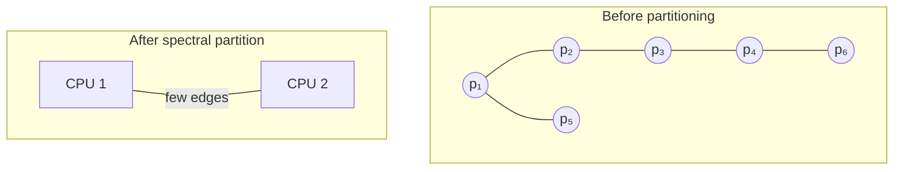

**METIS** (Karypis & Kumar) and **Scotch** are practical graph partitioners; spectral methods provide theoretical guarantees and initialization.

### 6.4 Other Applications

| Domain | Application |
|:-------|:------------|
| **Biology** | Gene expression clustering, protein interaction networks |
| **NLP** | Document clustering, word sense disambiguation |
| **Recommendation** | User-item graph partitioning |
| **Semi-supervised learning** | Laplacian regularization ($x^T L x$ as smoothness penalty) |
| **Manifold learning** | Laplacian Eigenmaps (dimensionality reduction via $L_{\text{sym}}$) |

---

## 7. Summary

| Concept | Key result |
|:--------|:-----------|
| **Laplacian** | $L = D - A$, with quadratic form $x^T L x = \sum_{(i,j)\in E} (x_i - x_j)^2$ |
| **Zero eigenvalue** | Multiplicity = number of connected components |
| **Fiedler value** | $\lambda_2 > 0$ iff graph connected; measures algebraic connectivity |
| **Fiedler vector** | Thresholding gives a connected subgraph; sign gives Cheeger cut |
| **Normalized Laplacians** | $L_{\text{sym}}$, $L_{\text{rw}}$ — better for degree-heterogeneous graphs |
| **Matrix-Tree Theorem** | $\tau(G) = \frac{1}{n} \prod_{k=2}^n \lambda_k$ |
| **Spectral clustering** | Embed vertices in eigenvector space, then cluster with $k$-means |
| **Applications** | Image segmentation, community detection, parallel computing |

---

## References

- Griffin, C. (2023). *Applied Graph Theory*, §10.4. — Primary source for this note.
- von Luxburg, U. (2007). A tutorial on spectral clustering. *Statistics and Computing*, 17(4), 395–416. — Definitive tutorial with convergence analysis.
- Chung, F. R. K. (1997). *Spectral Graph Theory*. CBMS Regional Conference Series.
- Shi, J. & Malik, J. (2000). Normalized cuts and image segmentation. *IEEE TPAMI*, 22(8), 888–905.
- Fiedler, M. (1973). Algebraic connectivity of graphs. *Czechoslovak Mathematical Journal*, 23(2), 298–305.
- Ng, A., Jordan, M., & Weiss, Y. (2002). On spectral clustering: Analysis and an algorithm. *NeurIPS*.

---

## See Also

- [[Graph - Adjacency Matrix & Spectrum]] — adjacency matrix, graph spectrum, Perron–Frobenius
- [[Graph - Random Walks & PageRank]] — random walks, $L_{\text{rw}}$ as generator, PageRank
- [[Linear_Algebra/Eigenvalues and Eigenvectors]] — eigenvalue fundamentals
- [[Linear_Algebra/Spectral Theorem]] — symmetric matrix diagonalization
- [[Linear_Algebra/Diagonalization]] — diagonalization and quadratic forms

---
