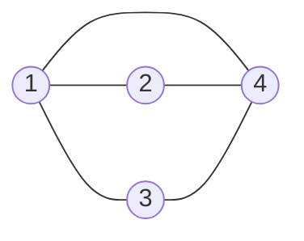
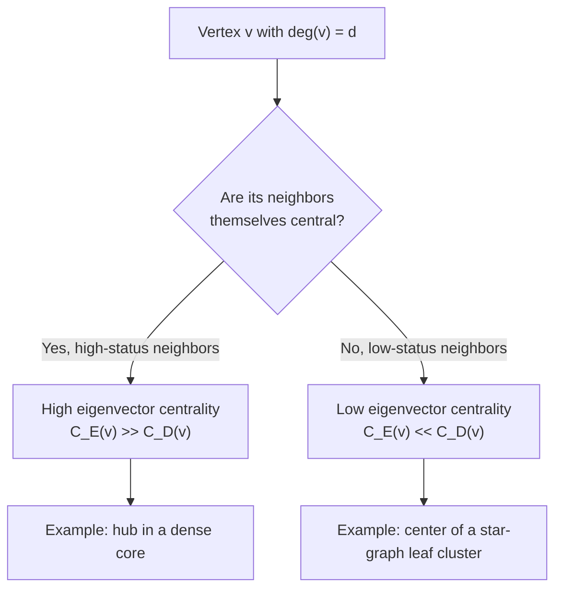
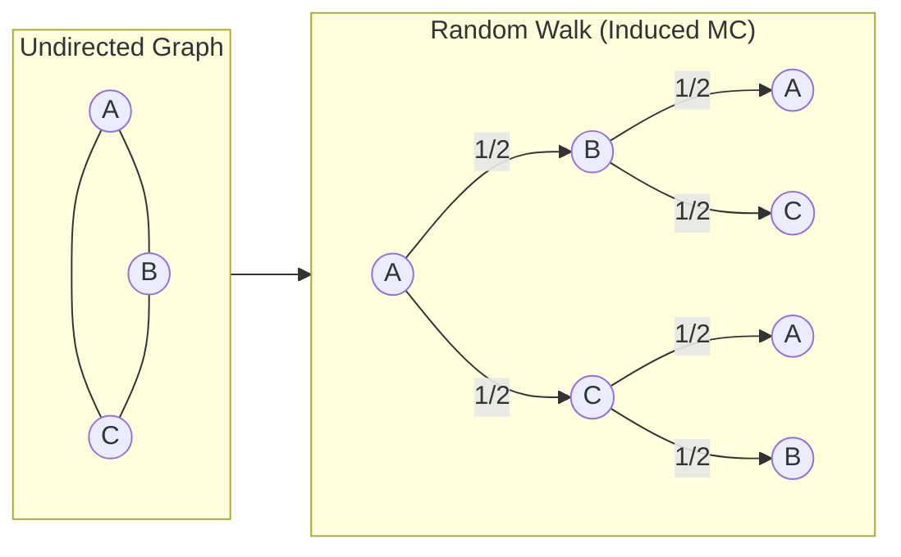
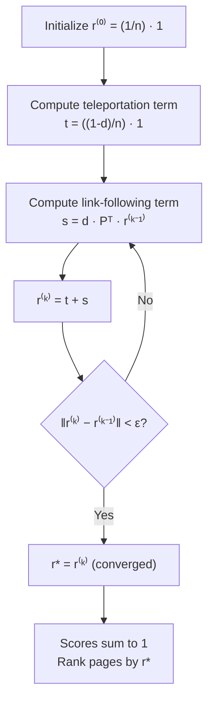
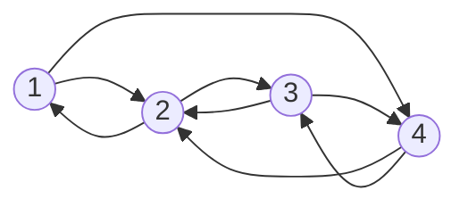

---
tags:
  - Math
  - GraphTheory
  - Probability
  - 概念性
  - 方法性
title: Graph - Random Walks & PageRank
created: 2026-07-03
modified:
---

# Graph - Random Walks & PageRank

> [!info] Source
> Christopher Griffin, *Applied Graph Theory* (2023), Chapter 10 *Applications of Algebraic Graph Theory*, §10.1–10.3.

---

## Overview

This note connects three ideas that build on each other:

1. **Eigenvector centrality** — a spectral measure of vertex importance
2. **Markov chains and random walks** — probabilistic dynamics on graphs
3. **PageRank** — the random-surfer model that made Google's search engine work

The thread is the Perron–Frobenius theorem: each problem reduces to finding a **principal eigenvector** of a relevant matrix.

---

## 1. Eigenvector Centrality (§10.1)

### 1.1 Definition

The idea is **self-referential**: a vertex is important if it is connected to other important vertices.

> [!quote] Griffin, Derivation 10.3
> "Important vertices are important precisely because they are adjacent to other important vertices. (This is the high-school concept of 'coolness by association.')"

Let $x_i$ be the centrality of vertex $v_i$. Define it as a scaled sum of its neighbors' scores:

$$x_i = \frac{1}{\lambda} \sum_{v_j \in N(v_i)} x_j
      = \frac{1}{\lambda} \sum_{j=1}^n M_{ij} x_j$$

where $M$ is the adjacency matrix and $\lambda$ is a constant to be determined. In matrix form:

$$\lambda x = M x \quad \Longrightarrow \quad M x = \lambda x$$

Thus $x$ is an **eigenvector** of $M$ and $\lambda$ its eigenvalue.

**Which eigenvector?** By the Perron–Frobenius theorem (Theorem 9.19), a connected graph's adjacency matrix has a unique eigenvalue $\lambda_1$ of maximum magnitude with a corresponding eigenvector $x$ whose entries are all positive. This is the **Perron–Frobenius eigenvector**, and it defines eigenvector centrality:

$$C_E(v_i) = x_i \quad \text{where } M x = \lambda_1 x, \; x_i > 0$$

Entries are typically normalized so they sum to 1.

### 1.2 Walk Interpretation

> [!quote] Griffin, Remark 10.6
> "As $k \to \infty$, the eigenvector centrality of vertex $v_i$ is just counting (a scaled version) of the number of long paths leading to that vertex."

Let $x$ be a vector with 1 at index $i$ and 0 elsewhere. Then $M^k x$ is a vector whose $j$th element counts the number of walks of length $k$ from $v_j$ to $v_i$. Theorem 10.5 shows:

$$\lim_{k \to \infty} \frac{M^k x}{\lambda_1^k} = \alpha_0 v_0$$

where $v_0$ is the Perron–Frobenius eigenvector. So **eigenvector centrality rewards vertices that are reached by many long walks**.

### 1.3 Example (Griffin Fig. 10.1)



$$M = \begin{bmatrix}
0 & 1 & 1 & 1 \\
1 & 0 & 0 & 1 \\
1 & 0 & 0 & 1 \\
1 & 1 & 1 & 0
\end{bmatrix}$$

**Eigenvalues:** $\lambda_1 = \frac12(1 + \sqrt{17}) \approx 2.562$, $\lambda_2 = \frac12(1 - \sqrt{17}) \approx -1.562$, $\lambda_3 = -1$, $\lambda_4 = 0$.

**Normalized eigenvector centrality:** $v_0 \approx [0.28,\; 0.22,\; 0.22,\; 0.28]$

Vertices 1 and 4 tie for highest score; vertices 2 and 3 tie lower.

### 1.4 Comparison with Degree Centrality

| Vertex | $\deg(v)$ | Degree rank | Eigenvector centrality | Eigenvector rank |
|:------:|:---------:|:-----------:|:---------------------:|:----------------:|
| 1 | 3 | 1 | 0.28 | 1 |
| 2 | 2 | 2 | 0.22 | 2 |
| 3 | 2 | 2 | 0.22 | 2 |
| 4 | 3 | 1 | 0.28 | 1 |

Here the rankings agree, but they can diverge dramatically (see the decision diagram below).



### 1.5 Limitation: Acyclic Digraphs

For a directed acyclic graph (DAG), the adjacency matrix can be permuted to strictly upper-triangular form, so all eigenvalues are zero. Eigenvector centrality collapses to zero for every vertex — a **degenerate** result. Katz centrality and PageRank fix this by adding a constant base score.

---

## 2. Markov Chains and Random Walks (§10.2)

### 2.1 Definition

A **random walk** on a graph models a process that moves from vertex to vertex along edges with fixed probabilities.

**Definition 10.9 (Markov chain).** A discrete-time Markov chain is a pair $\mathcal{M} = (G, p)$ where:
- $G = (V, E)$ is a directed graph (vertices = **states**, edges = **transitions**)
- $p: E \to [0, 1]$ is a probability assignment satisfying $\sum_{v' \in N_o(v)} p(v, v') = 1$ for all $v \in V$

The **stochastic matrix** (or probability transition matrix) is:

$$P_{ij} = p(v_i, v_j)$$

Each row sums to 1 — the matrix is **row-stochastic**.

> [!example] Griffin Example 10.11, Fig. 10.2
> A two-state Markov chain:
> ```mermaid
> graph LR
>     1((1)) -->|1/2| 1
>     1 -->|1/2| 2((2))
>     2 -->|1/7| 1
>     2 -->|6/7| 2
> ```
> $$P = \begin{bmatrix}
> 1/2 & 1/2 \\[4pt]
> 1/7 & 6/7
> \end{bmatrix}$$

### 2.2 Random Walk on a Graph

Given an **undirected** graph $G = (V, E)$, the simplest random walk is the **induced Markov chain** (Definition 10.27):
- Replace each undirected edge $\{v, v'\}$ with two directed edges $(v, v')$ and $(v', v)$
- From vertex $v$, choose an outgoing edge uniformly at random:

$$p(v, v') = \frac{1}{\deg(v)}$$

The transition matrix is $P = D^{-1}A$ where $D = \operatorname{diag}(\deg(v_1), \dots, \deg(v_n))$ is the degree matrix.



### 2.3 State Evolution

**Definition 10.14 (State probability vector).** A vector $x \in \mathbb{R}^{n \times 1}$ with $x_i \geq 0$, $\sum_i x_i = 1$, where $x_i$ is the probability of being in state $i$.

**Theorem 10.16.** After $k$ steps starting from initial distribution $x^{(0)}$:

$$x^{(k)} = (P^T)^k x^{(0)} \quad \text{(column-vector convention)}$$

Or equivalently for row vectors: $x^{(k)} = x^{(0)} P^k$.

### 2.4 Stationary Distribution

**Definition 10.19 (Stationary probability vector).** A vector $\pi$ is stationary for $\mathcal{M}$ if:

$$\pi = P^T \pi \quad \Longleftrightarrow \quad \pi P = \pi$$

That is, $\pi$ is a **left eigenvector** of $P$ with eigenvalue 1.

> [!quote] Griffin, Remark 10.21
> "Equation (10.14) should look familiar. It says that $P^T$ has an eigenvalue of 1 and a corresponding eigenvector whose entries are all non-negative ... this looks very similar to the equation we used for eigenvector centrality."

**Existence and uniqueness (Theorem 10.25).** If $P^T$ is **irreducible** (i.e., $G$ is strongly connected), then $P$ has a unique stationary distribution $\pi$.

### 2.5 Undirected Connected Non-Bipartite Graphs

For an undirected, connected, non-bipartite graph, the random walk is both irreducible and aperiodic. The stationary distribution has a closed form:

$$\pi_i = \frac{\deg(i)}{2|E|}$$

This is intuitive: the walker spends proportionally more time at high-degree vertices.

### 2.6 Mixing Time and Spectral Gap

The **mixing time** is the number of steps needed for $x^{(k)}$ to approach $\pi$ within a given tolerance $\varepsilon$. It is governed by the **spectral gap**:

$$\gamma = 1 - \max\{|\lambda_2(P)|, |\lambda_n(P)|\}$$

where $\lambda_2$ is the second-largest eigenvalue (in magnitude). A larger spectral gap → faster mixing.

| Property | Condition | Mixing |
|:---------|:----------|:-------|
| Irreducible | Strongly connected graph | Reaches unique $\pi$ |
| Aperiodic | No fixed cycle length | Approaches $\pi$ smoothly |
| Spectral gap > 0 | $|\lambda_2| < 1$ | Mixing time $O(1/\gamma \cdot \log(1/\varepsilon))$ |
| Spectral gap = 0 | Periodic (e.g., bipartite) | Never converges to $\pi$ |

---

## 3. PageRank (§10.3)

### 3.1 Motivation: Why Not Just Use the Stationary Distribution?

Given a directed web graph, we could induce a Markov chain (uniform out-link probability) and rank pages by the stationary distribution. Two problems arise:

1. **Dangling nodes** — pages with no out-links break the stochastic matrix (rows sum to 0)
2. **Non-stationary PDF** — the induced chain may not converge to a unique stationary distribution if the graph is not strongly connected

**PageRank** (Brin & Page, 1998) fixes both with the **random surfer model**.

### 3.2 Random Surfer Model

**Derivation 10.29 (PageRank).** A random surfer:
- Follows an out-link from the current page with probability $d$ (the **damping factor**, typically $d = 0.85$)
- Gets bored and **teleports** to a uniformly random page with probability $1 - d$
- Dangling pages are handled by treating them as teleporting to all pages with equal probability

This yields the **PageRank equation**:

$$r_i = \frac{1-d}{n} + d \sum_{j=1}^n P_{ji} \, r_j \qquad \text{for } i = 1, \dots, n$$

where $P_{ji}$ is the probability of moving from $j$ to $i$ in the induced Markov chain (i.e., $1/\deg_{\text{out}}(j)$ if $j$ links to $i$, 0 otherwise).

In matrix form:

$$r = \frac{1-d}{n} \mathbf{1} + d P^T r$$

where $\mathbf{1}$ is the all-ones vector.

### 3.3 Solution by Power Iteration

For web-scale graphs ($n$ in the billions), direct matrix inversion is impossible. PageRank uses the **power method**:

$$r^{(k)} = \frac{1-d}{n} \mathbf{1} + d P^T r^{(k-1)}$$

starting from $r^{(0)} = \frac{1}{n} \mathbf{1}$.



**Convergence.** The power method converges geometrically at rate $d$ (e.g., $d = 0.85$ → linear convergence). The analytic solution:

$$r = (I - d P^T)^{-1} \left(\frac{1-d}{n}\right) \mathbf{1}$$

exists because $(I - d P^T)$ is invertible for $d < 1$, but is never computed explicitly for large $n$.

### 3.4 Example (Griffin Example 10.30, Fig. 10.3)



**Original graph** (4 vertices, directed edges as shown). The induced Markov chain replaces the directed graph's transition rule: from each vertex, follow any outgoing edge uniformly. The stationary distribution of the induced chain is:

$$\pi^* = \left[\frac{3}{8},\; \frac{2}{8},\; \frac{2}{8},\; \frac{1}{8}\right]^\mathsf{T}$$

**PageRank with $d = 0.85$**, starting from $r^{(0)} = [1/4, 1/4, 1/4, 1/4]^\mathsf{T}$:

| Iteration $k$ | $r_1$ | $r_2$ | $r_3$ | $r_4$ |
|:-------------:|:-----:|:-----:|:-----:|:-----:|
| 0 | 0.2500 | 0.2500 | 0.2500 | 0.2500 |
| 1 | 0.4625 | 0.2146 | 0.2146 | 0.1083 |
| 2 | 0.3120 | 0.2600 | 0.2600 | 0.1680 |
| 3 | 0.3405 | 0.2543 | 0.2543 | 0.1509 |
| 4 | 0.3314 | 0.2550 | 0.2550 | 0.1586 |
| 5 | 0.3345 | 0.2525 | 0.2525 | 0.1605 |
| 10 | 0.3443 | 0.2503 | 0.2503 | 0.1551 |
| **∞** | **0.367** | **0.246** | **0.246** | **0.141** |

Converged scores: $r^* \approx [0.367,\; 0.246,\; 0.246,\; 0.141]^\mathsf{T}$.

The ordinal ranking is: **1 > 2 = 3 > 4**, the same as eigenvector centrality. However, the damping factor $d < 1$ softens differences compared to the undamped stationary distribution.

### 3.5 Relationship to Eigenvector Centrality

| Aspect | Eigenvector Centrality | PageRank |
|:-------|:----------------------|:---------|
| Matrix | Adjacency matrix $A$ | Column-stochastic $P^T$ |
| Equation | $A x = \lambda x$ | $r = \frac{1-d}{n}\mathbf{1} + d P^T r$ |
| Edge weighting | Binary (0/1) | Normalized by out-degree |
| Dangling nodes | Zero centrality | Teleportation handles them |
| Base centrality | None | Constant $(1-d)/n$ ensures all $>0$ |
| Convergence | Not always (DAG) | Always for $d < 1$ |

Note that when $d = 1$, PageRank reduces to the stationary distribution of the induced Markov chain, which is an eigenvector problem. The damping factor $d < 1$ makes the matrix $(I - dP^T)$ invertible, guaranteeing both existence and uniqueness.

### 3.6 Damping Factor Choice

The damping factor $d$ controls the trade-off between graph structure and uniform teleportation:

| $d$ | Behavior | Typical use |
|:---:|:---------|:-----------|
| 0 | Uniform random — all pages equal | Baseline |
| 0.50 | Fast mixing, less sensitive to link structure | Small graphs |
| **0.85** | **Standard Google value** | **Web search** |
| 0.95 | Slow mixing, very sensitive to link structure | Research citation networks |
| 1.0 | Stationary distribution; may not exist uniquely | Theoretical limit |

> [!tip] Why 0.85?
> The value $d = 0.85$ is an empirical choice from Brin & Page (1998). It balances sensitivity to the link graph with fast convergence of the power method (rate $d$). At $d = 0.85$, the method converges to $10^{-6}$ tolerance in roughly $-\log(10^{-6}) / \log(0.85) \approx 85$ iterations.

---

## 4. Applications

### 4.1 Web Search Ranking

PageRank was the core of Google's original search engine (Brin & Page, 1998). Combined with text relevance (TF-IDF, anchor text), PageRank provided a query-independent measure of page authority that proved remarkably robust against spam.

### 4.2 Recommendation Systems

Random-walk methods power collaborative filtering:
- **Item-based**: Random walk on a bipartite user–item graph
- **Personalized PageRank**: Teleportation vector $\mathbf{v}$ biased toward a user's preferences
- **TrustRank**: Teleport to a seed set of trusted pages to filter spam

### 4.3 Network Science

| Domain | Application |
|:-------|:------------|
| Biology | Protein–protein interaction networks (identify essential proteins) |
| Neuroscience | Functional brain network hubs via eigenvector centrality |
| Social networks | Influencer identification, community detection |
| Citation analysis | Eigenfactor, Article Influence Score |
| Transportation | Airport centrality, traffic flow prediction |

### 4.4 Variants

| Variant | Key modification | Use case |
|:--------|:----------------|:---------|
| **Personalized PageRank** | Teleport vector $\mathbf{v}$ biased by user | Recommendations, local clustering |
| **Topic-Sensitive PageRank** | Multiple teleport vectors per topic | Query-dependent ranking |
| **TrustRank** | Teleport to trusted seed set | Web spam detection |
| **Katz centrality** | $x = \alpha A x + \beta\mathbf{1}$ | General graph (no damping) |
| **Heat kernel** | $e^{t(A - D)}$ instead of PageRank | Temporal network analysis |

---

## 符号速查

| 符号 | 含义 |
|:-----|:------|
| $M$ (Ch. 10) | 邻接矩阵 (adjacency matrix) |
| $P$ | 随机矩阵 (stochastic / transition matrix), $P = D^{-1}A$ |
| $D$ | 度矩阵 (degree matrix), $D_{ii} = \deg(v_i)$ |
| $\lambda_1$ | 最大特征值 (Perron–Frobenius eigenvalue) |
| $C_E(v)$ | 特征向量中心性 (eigenvector centrality) |
| $x^{(k)}$ | 第 $k$ 步状态概率向量 |
| $\pi$ | 平稳分布 (stationary distribution) |
| $d$ | PageRank 阻尼因子, 通常 $0.85$ |
| $\mathbf{1}$ | 全 1 向量 |
| $\gamma$ | 谱间隙 (spectral gap), $\gamma = 1 - |\lambda_2|$ |

---

## 相关链接

- [[Graph - Adjacency Matrix & Spectrum]] — 邻接矩阵与谱图理论
- [[Graph - Centrality Measures]] — 中心性度量总览（含 Eigenvector / Katz / PageRank 预览）
- [[Graph - Laplacian & Spectral Clustering]] — 拉普拉斯矩阵与谱聚类
- [[Linear_Algebra/Eigenvalues and Eigenvectors]] — 特征值与特征向量基础

> [!seealso] Further Reading
> - **Griffin (2023), §10.1–10.3** — Primary source for this note
> - **Brin & Page (1998)** — "The Anatomy of a Large-Scale Hypertextual Web Search Engine" (original PageRank paper)
> - **Langville & Meyer (2006)** — *Google's PageRank and Beyond: The Science of Search Engine Rankings*
> - **Lovász (1993)** — "Random Walks on Graphs: A Survey" (comprehensive treatment of mixing times)
> - **Newman (2010)** — *Networks: An Introduction* (Ch. 7 for random walks, Ch. 8 for PageRank)

---
