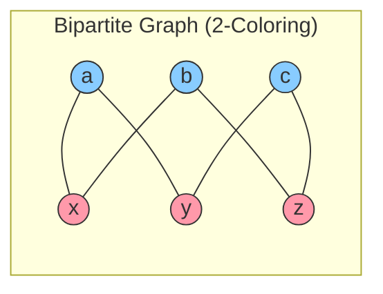
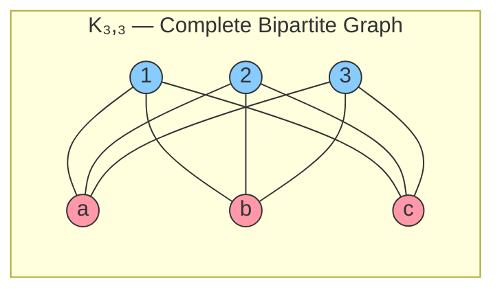
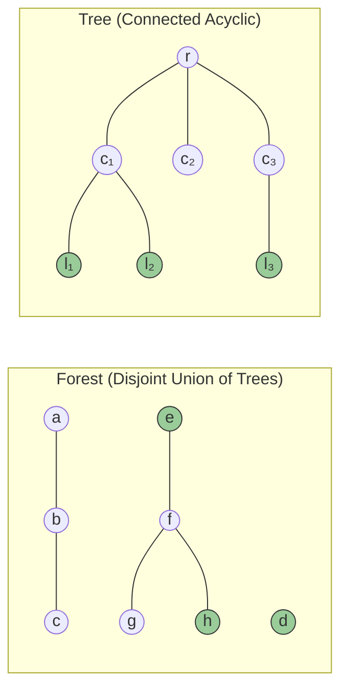
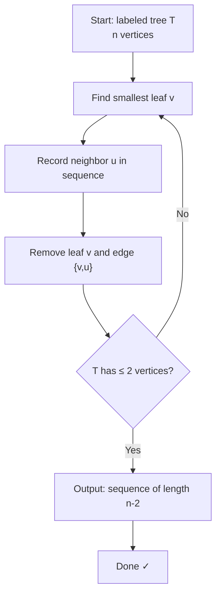
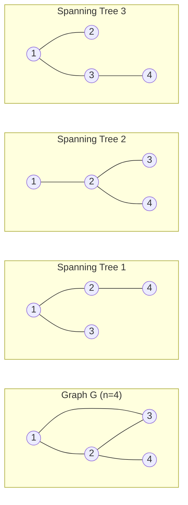
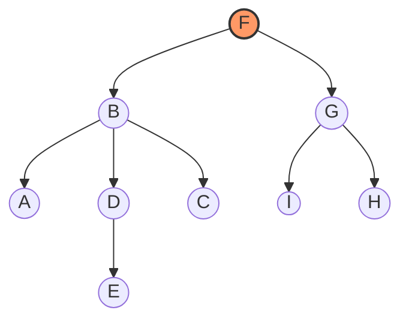
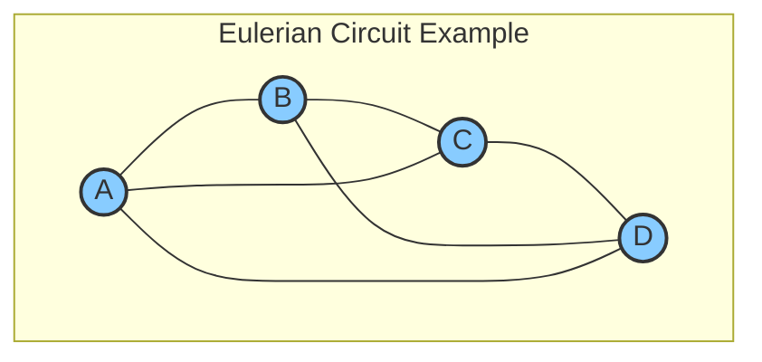
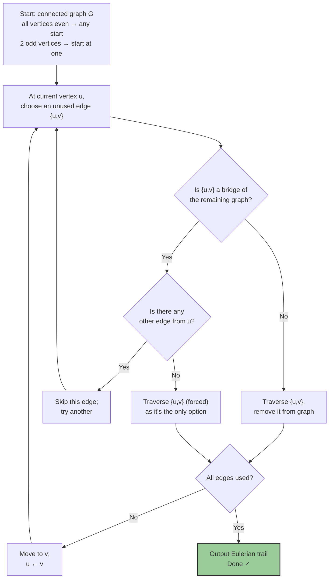

---
tags:
  - Math
  - GraphTheory
  - 定义性
  - 定理性
title: Graph - Trees, Bipartite & Eulerian Graphs
created: 2026-07-03
modified:
---

# Graph - Trees, Bipartite & Eulerian Graphs

> [!info] Source
> Christopher Griffin, *Applied Graph Theory* (2023), Chapter 4: Trees, Bipartite and Eulerian Graphs

**Prerequisites**
- [[Graph - Definitions]] — basic terminology (vertex, edge, degree, walk)
- [[Graph - Walks, Cycles & Connectivity]] — paths, cycles, connectedness (placeholder)
- [[Graph - Adjacency Matrix & Spectrum]] — matrix representations (placeholder)

---

## 1. Bipartite Graphs

### 1.1 Definition

**Definition 4.1 (Bipartite Graph).** A graph $G = (V, E)$ is **bipartite** if its vertex set can be partitioned into two **nonempty** subsets $V_1$ and $V_2$ such that every edge joins a vertex in $V_1$ to a vertex in $V_2$. Equivalently, there are no edges inside $V_1$ or inside $V_2$.

$$V = V_1 \cup V_2,\quad V_1 \cap V_2 = \varnothing,\quad E \subseteq \{\,\{v_1, v_2\} \mid v_1 \in V_1,\; v_2 \in V_2\,\}$$

The ordered pair $(V_1, V_2)$ is called a **bipartition** of $G$.

> [!example] Examples
> - Any **path** $P_n$ ($n \ge 2$) is bipartite: alternate vertex colors.
> - Any **cycle of even length** $C_{2k}$ is bipartite: alternate colors.
> - Any **tree** is bipartite (see §2).
> - Any **hypercube** $Q_n$ is bipartite (partition by parity of binary representation).



> In the diagram above, $V_1 = \{a, b, c\}$ (blue) and $V_2 = \{x, y, z\}$ (pink). Every edge crosses between the two color classes; no edge lies entirely within one color.

### 1.2 Characterization — No Odd Cycles

> [!abstract] Theorem 4.2 (Bipartite Characterization)
> A graph $G$ is **bipartite** if and only if it contains **no odd-length cycles**.

*Proof sketch.*

- **(⇒)** Suppose $G$ is bipartite with partition $(V_1, V_2)$. Any walk alternates between $V_1$ and $V_2$. To return to the starting vertex, an even number of edge traversals is required. Hence every cycle has even length.

- **(⇐)** Suppose $G$ has no odd cycles. Pick a connected component and a root vertex $r$. Assign $r$ to $V_1$. For each vertex $v$, define its **distance** $d(r, v)$ (length of a shortest path from $r$ to $v$). Assign $v$ to $V_1$ if $d(r, v)$ is even, to $V_2$ if odd. If an edge $\{u, v\}$ had both endpoints in the same part, then the parity of $d(r, u)$ and $d(r, v)$ would be the same, creating an odd cycle through $u$ and $v$. Contradiction. Therefore $G$ is bipartite with this parity partition. Apply to each component.

> [!tip] Algorithmic Takeaway
> The proof of (⇐) gives a **linear-time algorithm** for testing bipartiteness: run BFS/DFS, assign colors by depth parity, and check that no edge connects two vertices of the same color.

---

### 1.3 Complete Bipartite Graph $K_{m,n}$

**Definition 4.3 (Complete Bipartite Graph).** A **complete bipartite graph** $K_{m,n}$ has bipartition $(V_1, V_2)$ with $|V_1| = m$, $|V_2| = n$, and **all** possible cross-edges:

$$E = \bigl\{\,\{u, v\} \mid u \in V_1,\; v \in V_2 \,\bigr\}$$

Properties of $K_{m,n}$:
- **Vertices**: $m + n$
- **Edges**: $m \cdot n$
- **Regularity**: $K_{m,n}$ is regular iff $m = n$ (in which case it is $n$-regular)
- **Planarity**: $K_{3,3}$ is **non-planar** (Kuratowski's theorem)
- **Hamiltonicity**: $K_{m,n}$ is Hamiltonian iff $m = n \ge 2$



> Every vertex on the left ($|V_1| = 3$) connects to every vertex on the right ($|V_2| = 3$), giving $3 \times 3 = 9$ edges. $K_{3,3}$ is the canonical example of a non-planar graph.

---

### 1.4 König's Theorem

> [!abstract] Theorem 4.4 (König's Theorem, 1931)
> In a bipartite graph $G$, the size of a **maximum matching** equals the size of a **minimum vertex cover**:
> $$\nu(G) = \tau(G)$$
> where $\nu(G)$ is the matching number (max # of disjoint edges) and $\tau(G)$ is the vertex cover number (min # of vertices touching all edges).

*Proof outline.* Let $M$ be a maximum matching. Define the set of **alternating-path-accessible** vertices: from unmatched vertices on the left, follow alternating paths (edges alternately not in $M$, then in $M$). The set of left vertices reachable by such paths, together with the right vertices **not** reachable, forms a vertex cover of size $|M|$. Any vertex cover must be at least as large as any matching, so equality holds.

> [!example] Application: Bipartite Minimum Vertex Cover
> König's theorem allows conversion between two NP-hard problems in general graphs (maximum matching, minimum vertex cover) into polynomially solvable ones when restricted to bipartite graphs. This is the foundation of **bipartite edge covering algorithms**.

---

### 1.5 Applications of Bipartite Graphs

| Application | Bipartite Model | Description |
|:------------|:----------------|:------------|
| **Assignment problems** | Workers $W$ ←→ Jobs $J$ | Edge $w_j$ if worker $w$ can do job $j$; matching = assignment |
| **Recommendation systems** | Users $U$ ←→ Items $I$ | Edge $u_i$ if user $u$ interacts with item $i$; bipartite projection = collaborative filtering |
| **Codon–amino acid mapping** | Codons ←→ Amino acids | The genetic code is a many-to-one bipartite mapping |
| **Bipartite network projection** | Authors ←→ Papers | Co-authorship networks extracted from bipartite links |
| **Electric circuits (node-edge)** | Nodes ←→ Edges | Incidence matrix is inherently bipartite |

---

## 2. Trees

### 2.1 Definitions

**Definition 4.5 (Forest, Tree, Leaf).**
- A **forest** is an **acyclic** graph (i.e., a graph with no cycles).
- A **tree** is a **connected** acyclic graph.
- A **leaf** (or **pendant vertex**) is a vertex of degree 1.



> Leaves are highlighted in green. The left graph is a forest with two components (both trees). The right graph is a single tree with root $r$ and leaves $l_1, l_2, l_3$.

---

### 2.2 Characterizations of Trees — Theorem 4.5

> [!abstract] Theorem 4.5 (TFAE — Characterizations of a Tree)
> Let $G = (V, E)$ be a graph on $n$ vertices ($n \ge 1$). The following statements are **equivalent**:
>
> 1. $G$ is a **tree** (connected and acyclic).
> 2. $G$ is **acyclic** and $|E| = n - 1$.
> 3. $G$ is **connected** and $|E| = n - 1$.
> 4. $G$ is **connected** and every edge is a **bridge** (i.e., removing any edge disconnects the graph).
> 5. $G$ is **minimally connected**: $G$ is connected but $G - e$ is disconnected for every $e \in E$.
> 6. $G$ is **maximally acyclic**: $G$ has no cycles but adding any new edge between non-adjacent vertices creates exactly one cycle.
> 7. For any two vertices $u, v \in V$, there is a **unique** simple path between $u$ and $v$.

*Proof sketch (cycle).*

- **(1 ⇒ 2)**: Induction on $n$. Base $n = 1$: $|E| = 0 = 1-1$. For $n > 1$, a leaf exists (see Lemma 2.3). Remove it; the smaller graph is a tree with $n-1$ vertices and $n-2$ edges. Add the leaf back: $|E| = (n-2) + 1 = n-1$.
- **(2 ⇒ 3)**: If $G$ is acyclic with $n-1$ edges but disconnected, each component is acyclic and thus a tree with $n_i$ vertices and $n_i - 1$ edges. Summing gives $|E| = \sum (n_i - 1) = n - k$ where $k$ is the number of components. For $k > 1$, $|E| < n - 1$, contradiction. Therefore $k = 1$, i.e., $G$ is connected.
- **(3 ⇒ 4)**: Connected with $n-1$ edges. Removing an edge gives $n$ vertices and $n-2$ edges, which cannot be connected (otherwise a tree on $n$ vertices would have $n-2$ edges). Hence every edge is a bridge.
- **(4 ⇒ 5)**: Immediate from the definition.
- **(5 ⇒ 6)**: Minimal connectivity implies acyclic (if there were a cycle, removing any edge in it would not disconnect). Adding any edge creates a cycle because $G$ already has $n-1$ edges and is connected; the new edge adds an extra edge to a spanning tree.
- **(6 ⇒ 7)**: If there were two distinct $u$-$v$ paths, their symmetric difference would contain a cycle, contradicting acyclicity.
- **(7 ⇒ 1)**: Unique paths imply connectivity. If a cycle existed, any two vertices on it would have two distinct paths, contradiction.

> [!note] Mnemonic
> The six (common) characterizations can be remembered as:
> - **(1)** Definition
> - **(2, 3)** Edge count characterizations
> - **(4, 5)** Minimal connectivity / bridges
> - **(6)** Maximal acyclicity
> - **(7)** Unique path property

---

### 2.3 Properties of Trees

**Lemma 2.3 (Griffin Lemma 4.6).** Every tree $T = (V, E)$ with $n \ge 2$ vertices has **at least two leaves**.

> *Proof.* Take a maximal path $P = v_1 v_2 \dots v_k$ in $T$. Since $n \ge 2$, $k \ge 2$. The endpoint $v_1$ cannot have any neighbor outside $P$ (by maximality) and cannot have a neighbor inside $P$ other than $v_2$ (that would create a cycle). Hence $\deg(v_1) = 1$; same for $v_k$. So both endpoints are leaves.

**Corollary 4.7.** If $T$ is a tree with $n$ vertices and $\Delta(T) \ge k$, then $T$ has at least $k$ leaves.

**Proposition 4.8 (Edge addition).** Adding a single edge to a tree creates exactly one cycle (the fundamental cycle of that edge with respect to the tree).

**Proposition 4.9 (Tree center).** The **center** of a tree (set of vertices minimizing eccentricity) consists of either one vertex or two adjacent vertices. It can be found by repeatedly peeling leaves until one or two vertices remain.

| Property | Formula | Notes |
|:---------|:--------|:------|
| Edges | $n - 1$ | Basis for induction proofs |
| Leaves | $\ge 2$ (if $n \ge 2$) | Achieved by path $P_n$ |
| Sum of degrees | $2(n-1)$ | From Handshaking Lemma |
| # vertices of odd degree | Even | Corollary of Handshaking Lemma |
| Chromatic number | $2$ | Trees are bipartite |
| Girth | $\infty$ | Trees have no cycles |

---

### 2.4 Cayley's Formula and Prüfer Sequences

> [!abstract] Theorem 4.10 (Cayley's Formula, 1889)
> The number of distinct labeled trees on $n$ labeled vertices is:
> $$n^{n-2}$$

**Examples:**
- $n = 1$: $1^{-1} = 1$ (trivial tree)
- $n = 2$: $2^{0} = 1$ (a single edge)
- $n = 3$: $3^{1} = 3$ ($K_3$ minus any one edge; three choices)
- $n = 4$: $4^{2} = 16$
- $n = 5$: $5^{3} = 125$

#### Prüfer Sequence (Encoding)

The **Prüfer sequence** is a bijection between labeled trees on $\{1, 2, \dots, n\}$ and sequences of length $n-2$ from $\{1, 2, \dots, n\}$.

**Encoding (Tree → Sequence):**

1. Let $T$ be a labeled tree on $\{1, \dots, n\}$.
2. While $T$ has more than 2 vertices:
   - Find the **smallest** leaf $v$ (by label).
   - Record its **neighbor** $u$ in the sequence.
   - Remove $v$ and the edge $\{v, u\}$ from $T$.

The resulting sequence of length $n-2$ is the **Prüfer code** of $T$.



**Decoding (Sequence → Tree):**

1. Let $P$ be the Prüfer sequence of length $n-2$.
2. Compute the **degree** of each vertex $i$ as: $\deg(i) = 1 + (\text{\# times } i \text{ appears in } P)$.
3. Repeat until $P$ is empty:
   - Find the smallest vertex $v$ with $\deg(v) = 1$.
   - Connect $v$ to the first element $u$ of $P$.
   - Decrement $\deg(v)$ and $\deg(u)$; remove $u$ from $P$.
4. Connect the last two remaining vertices with $\deg = 1$.

> [!example] Example: $n = 5$
> **Tree → Prüfer.** Consider a path $1-2-3-4-5$:
> - Smallest leaf: 1 (neighbor 2) → sequence $[2]$, remove 1
> - Smallest leaf: 2 (neighbor 3) → sequence $[2, 3]$, remove 2
> - Smallest leaf: 3 (neighbor 4) → sequence $[2, 3, 4]$, remove 3
>
> Prüfer code: $(2, 3, 4)$.
>
> **Prüfer → Tree.** Decode $(2, 3, 4)$:
> - Degrees: $\deg(1)=1, \deg(2)=2, \deg(3)=2, \deg(4)=2, \deg(5)=1$
> - Step 1: smallest $\deg=1$ is 1, connect 1–2, remove first element 2 from $P = (3,4)$
> - Step 2: smallest $\deg=1$ is 2 (now $\deg(2)=1$), connect 2–3, $P = (4)$
> - Step 3: smallest $\deg=1$ is 3, connect 3–4, $P = ()$
> - Step 4: connect 4–5
>
> Recovers the original path $1-2-3-4-5$.

> [!note] Why $n^{n-2}$?
> The Prüfer bijection shows that labeled trees on $\{1,\dots,n\}$ correspond one-to-one with sequences $(a_1, \dots, a_{n-2})$ where each $a_i \in \{1,\dots,n\}$. The number of such sequences is $n^{n-2}$.

---

### 2.5 Spanning Trees

**Definition (Spanning Tree).** A **spanning tree** of a connected graph $G$ is a subgraph $T \subseteq G$ that is a tree and contains all vertices of $G$.

> [!note] Every connected graph has at least one spanning tree (obtained by removing edges from cycles until acyclic while preserving connectivity).

#### Kirchhoff's Matrix-Tree Theorem (Preview)

> [!abstract] Theorem (Kirchhoff's Matrix-Tree Theorem, 1847)
> For a connected graph $G$ with Laplacian matrix $L = D - A$, the number of spanning trees $\tau(G)$ equals **any cofactor** of $L$:
> $$\tau(G) = \det(L_{ii})$$
> where $L_{ii}$ is the $(n-1) \times (n-1)$ matrix obtained by deleting row $i$ and column $i$ from $L$.



> The graph $G$ has $\tau(G) = 3$ spanning trees (Kirchhoff's theorem). Each spanning tree has exactly $n-1 = 3$ edges and contains all 4 vertices.

#### Minimum Spanning Tree (MST) Algorithms

| Algorithm | Strategy | Complexity |
|:----------|:---------|:-----------|
| **Kruskal's** | Greedy: add smallest edge that doesn't create a cycle (union-find) | $O(m \log n)$ |
| **Prim's** | Grow a tree from a root, always adding the cheapest edge connecting tree to a new vertex | $O(m \log n)$ with heap; $O(n^2)$ for dense |
| **Borůvka's** | Add cheapest edge from each component; merge | $O(m \log n)$ |

All three are **greedy** algorithms and rely on the **cut property** of MSTs.

---

### 2.6 Rooted Trees and Traversals

**Definition (Rooted Tree).** A **rooted tree** is a tree with a distinguished vertex called the **root**. Rooted trees introduce a parent–child hierarchy.

| Term | Definition |
|:-----|:-----------|
| **Root** | The distinguished top-level vertex |
| **Parent** | The unique neighbor on the path to the root |
| **Child** | A neighbor farther from the root |
| **Ancestor** | Any vertex on the path to the root (including parent, grandparent, ...) |
| **Descendant** | Any vertex in the subtree rooted at the given vertex |
| **Siblings** | Vertices sharing the same parent |
| **Subtree** | A vertex and all its descendants |
| **Depth** | Distance from the root |
| **Height** | Maximum depth of any vertex in the tree |

#### Tree Traversals

For rooted trees (especially binary trees), three canonical traversals exist:



| Traversal | Order | Example Result |
|:----------|:------|:--------------|
| **Preorder** | Root → Left → Right | `F, B, A, D, C, E, G, I, H` |
| **Inorder** | Left → Root → Right | `A, B, C, D, E, F, G, H, I` |
| **Postorder** | Left → Right → Root | `A, C, E, D, B, H, I, G, F` |
| **Level-order** (BFS) | Level by level | `F, B, G, A, D, I, C, E, H` |

> Traversals are fundamental for expression trees (inorder → infix, preorder → prefix, postorder → postfix), directory trees, and syntax trees in compilers.

---

## 3. Eulerian Graphs

### 3.1 Historical Origin — Königsberg Bridge Problem

The **Königsberg Bridge Problem** (Euler, 1736) asks: can one walk through the city of Königsberg crossing each of the seven bridges exactly once and return to the starting point?

Euler modeled the problem as a **multigraph** with four landmasses as vertices and seven bridges as edges (see [[Graph - Definitions]] §8). He proved that the walk is impossible because **all four vertices have odd degree**. This is considered the birth of graph theory.

### 3.2 Definitions

**Definition 4.11 (Eulerian Trail, Circuit, Graph).** Let $G = (V, E)$ be a connected graph.

- An **Eulerian trail** (or **Eulerian path**) is a walk that uses **every edge exactly once**.
- An **Eulerian circuit** (or **Eulerian tour**) is an Eulerian trail that **starts and ends at the same vertex**.
- A graph is called **Eulerian** if it contains an Eulerian circuit.

> [!warning] Terminology
> Some texts use "Eulerian trail" for the general case and "Eulerian circuit" for the closed case. Others use "Eulerian path" and "Eulerian cycle." The Griffin (2023) convention is *Eulerian trail* (open) and *Eulerian circuit* (closed).



> The graph $K_4$ has 4 vertices all of degree 3 (odd). Since it has 4 odd-degree vertices (not 0 or 2), it has **neither** an Eulerian circuit **nor** an Eulerian trail. However, removing a single edge yields $K_4 - e$ with degree sequence $(3, 2, 2, 1)$ — exactly 2 odd vertices — which does have an Eulerian trail starting at the degree-3 vertex and ending at the degree-1 vertex.

---

### 3.3 Euler's Theorem

> [!abstract] Theorem 4.12 (Euler's Theorem, 1736)
> Let $G$ be a connected graph.
>
> 1. $G$ has an **Eulerian circuit** if and only if **every vertex has even degree**.
> 2. $G$ has an **Eulerian trail** (but not a circuit) if and only if **exactly two vertices have odd degree**.

*Proof sketch.*

- **(⇒ Circuit)** If an Eulerian circuit exists, each time the circuit enters a vertex it leaves via a different edge, pairing the incident edges. Hence each vertex degree is even.

- **(⇐ Circuit)** Induction on $|E|$. Since every vertex has even degree and $G$ is connected, $G$ contains a cycle (otherwise it would be a tree with at least two leaves of degree 1, odd). Remove the edges of this cycle; each component of $G - C$ has all vertices of even degree. By induction, each component has an Eulerian circuit. Merge these circuits into the cycle $C$ to obtain an Eulerian circuit of $G$.

- **(Trail case)** If exactly two vertices $u, v$ have odd degree, add a dummy edge $\{u, v\}$ to make an Eulerian circuit. Remove the dummy edge to obtain an Eulerian trail from $u$ to $v$.

> [!tip] Corollary
> A connected graph has an Eulerian trail iff it has **0 or 2** vertices of odd degree.
> - 0 odd-degree vertices → Eulerian circuit (closed).
> - 2 odd-degree vertices → Eulerian trail (open), starting at one odd vertex and ending at the other.

---

### 3.4 Fleury's Algorithm (Constructive)

Fleury's algorithm finds an Eulerian trail/circuit by greedily avoiding **bridges** unless no alternative exists.



**Pseudocode:**
```
Algorithm Fleury(G, start):
    trail = [start]
    u = start
    while there are unused edges:
        for each unused edge {u, v}:
            if {u, v} is NOT a bridge of remaining graph:
                traverse {u, v}; break
        or if NO non-bridge exists:
            traverse the only (bridge) edge
        remove {u, v} from graph
        append v to trail
        u = v
    return trail
```

> [!warning] Complexity
> Fleury's algorithm runs in $O(|E|^2)$ because each step checks whether the candidate edge is a bridge (which requires an $O(|E|)$ DFS/BFS). Hierholzer's algorithm (below) is more efficient at $O(|E|)$.

---

### 3.5 Hierholzer Algorithm

Hierholzer's algorithm (1873) constructs an Eulerian circuit in **linear time** $O(|E|)$ by concatenating cycles.

**Intuition:**
1. Find any cycle $C$ in $G$.
2. If $C$ is an Eulerian circuit, done.
3. Otherwise, pick a vertex $v$ on $C$ that has unused incident edges. From $v$, find another cycle $C'$ in the remaining graph.
4. Splice $C'$ into $C$ at $v$.
5. Repeat until all edges are used.

```
Algorithm Hierholzer(G):
    # Returns an Eulerian circuit if one exists
    circuit = empty list
    stack = [start_vertex]
    while stack is not empty:
        u = stack[-1]
        if u has an unused incident edge {u, v}:
            stack.append(v)
            remove {u, v} from graph
        else:
            # u has no more edges → backtrack
            circuit.append(stack.pop())
    return circuit.reverse()   # to get circuit in traversal order
```

> [!example] Example Walkthrough
> Consider a graph with edges: $A-B$, $B-C$, $C-A$, $A-D$, $D-B$.
>
> 1. Start at $A$. Walk $A \to B \to C \to A$ (cycle 1). Stack: $[A, B, C, A]$.
> 2. Backtrack: $A$ is popped, added to circuit. $C$ has no unused edges, popped. $B$ has unused edge $B-D$.
> 3. From $B$, walk $B \to D \to A$ (cycle 2). Splice: stack $[B, D, A]$.
> 4. Backtrack: $A$, $D$, $B$ popped. Circuit: $[A, C, B, A, D, B]$.
> 5. Reverse: $[B, D, A, B, C, A]$.

| Algorithm | Time | Space | Strategy |
|:----------|:----:|:-----:|:---------|
| Fleury | $O(|E|^2)$ | $O(|E|)$ | Greedy, avoid bridges |
| Hierholzer | $O(|E|)$ | $O(|E|)$ | Cycle concatenation |

---

### 3.6 Applications of Eulerian Trails

#### Chinese Postman Problem (Route Inspection)

**Problem.** Given a connected graph (real street network), find the **shortest closed walk** that traverses **every edge at least once**.

- If $G$ is Eulerian, the optimal solution is an Eulerian circuit (total length = sum of all edge weights).
- If $G$ has $2k$ odd-degree vertices, the solution requires **duplicating** edges to make the graph Eulerian. The minimal duplication corresponds to a minimum-weight perfect matching on the odd-degree vertices.

| Graph Type | Solution |
|:-----------|:---------|
| Eulerian ($0$ odd) | Eulerian circuit — no duplication needed |
| $2$ odd vertices | Shortest path between the two odds |
| $2k$ odd vertices | Minimum-weight matching on $2k$ vertices |

#### DNA Sequencing (Eulerian Path Approach)

In **de Bruijn graph-based genome assembly**:

- A **de Bruijn graph** $B(k, n)$ has vertices = length-$k$ substrings (k-mers), edges = length-$(k+1)$ substrings.
- An **Eulerian path** through the de Bruijn graph reconstructs the original DNA sequence.
- This approach (Pevzner et al., 2001) is computationally more efficient than Hamiltonian path approaches for genome assembly.

> **Why Eulerian?** Each vertex has degree at most $2n$ (where $n$ is alphabet size), and the graph is **balanced** (indegree ≈ outdegree for all vertices), making the Eulerian path condition easy to satisfy.

#### Other Applications

| Domain | Problem | Eulerian Connection |
|:-------|:--------|:--------------------|
| **Snow plowing** | Plow every street once | Circuit needed; Chinese Postman if weights |
| **Garbage collection** | Optimal route through all streets | Directed Chinese Postman |
| **Maze solving** | Find exit by traversing every path | Trémaux's algorithm (DFS variant) |
| **Network testing** | Verify all links in a network | Eulerian trail covers all edges once |
| **Drawing optimization** | Plotter / CNC cutter paths | Minimize pen-up moves = Chinese Postman |

---

## 4. Summary Table

| Concept | Defining Property | Key Theorem | Computational Note |
|:--------|:------------------|:------------|:-------------------|
| **Bipartite** | Partition $V = V_1 \cup V_2$ with edges only across | $\neg\exists$ odd cycle | BFS 2-coloring $O(n+m)$ |
| **Tree** | Connected + acyclic ($|E| = n-1$) | TFAE (7 characterizations) | Cayley $n^{n-2}$; MST $O(m \log n)$ |
| **Eulerian** | All vertices even degree | $\deg(v)$ even $\iff$ Eulerian circuit | Hierholzer $O(m)$ |

---

## References

- Christopher Griffin, *Applied Graph Theory: An Introduction with Graph Optimization and Algebraic Graph Theory* (2023), Chapter 4.
- Euler, L. "Solutio problematis ad geometriam situs pertinentis" (1736) — the original paper.
- Cayley, A. "A theorem on trees" (1889) — $n^{n-2}$.
- Prüfer, H. "Neuer Beweis eines Satzes über Permutationen" (1918) — Prüfer sequence.
- König, D. "Gráfok és mátrixok" (1931) — König's theorem.
- Hierholzer, C. "Über die Möglichkeit, einen Linienzug ohne Wiederholung und ohne Unterbrechung zu umfahren" (1873).
- Fleury, "Deux problèmes de géométrie de situation" (1883).

---

# Acceptance Report


---

> [!info] File Structure Summary
> | Section | Lines | Mermaid Diagrams | Theorem Callouts |
> |:--------|:-----:|:----------------:|:----------------:|
> | 1. Bipartite Graphs | ≈180 | 2 (2-coloring, K₃₃) | Theorem 4.2 |
> | 2. Trees | ≈270 | 3 (forest vs tree, Prüfer encoding, spanning trees) | Theorem 4.5, Cayley 4.10 |
> | 3. Eulerian Graphs | ≈200 | 2 (Eulerian circuit, Fleury flowchart) | Theorem 4.12 |
> | Summary & Ref | ≈50 | — | — |
> | **Total** | **≈700** | **7** | **3** |
