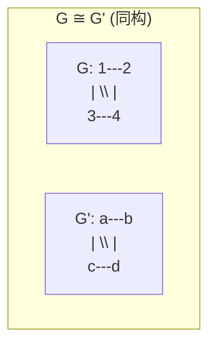
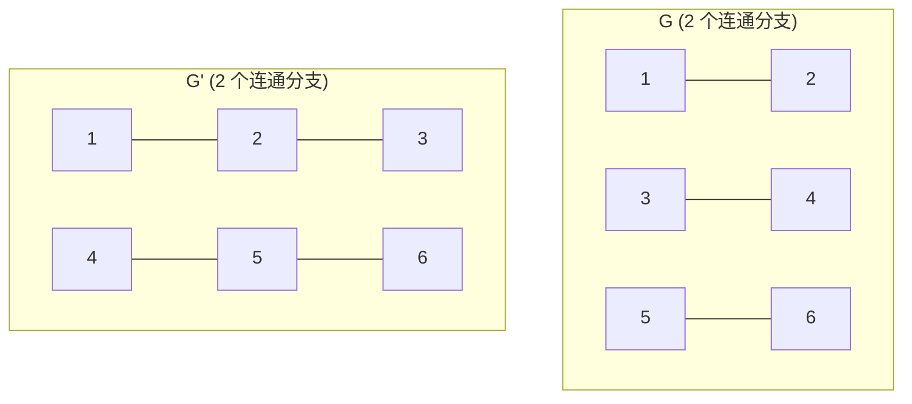
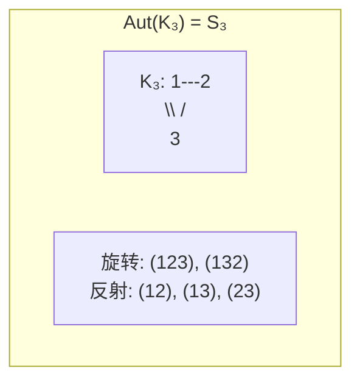
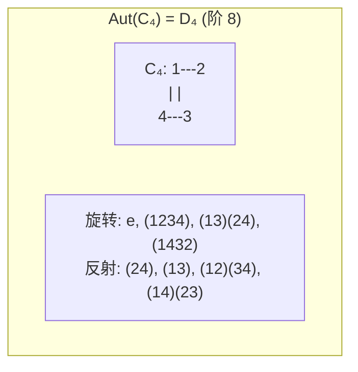
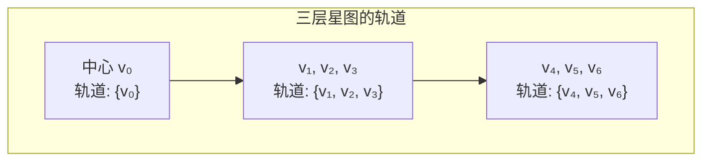
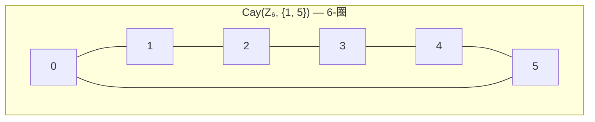
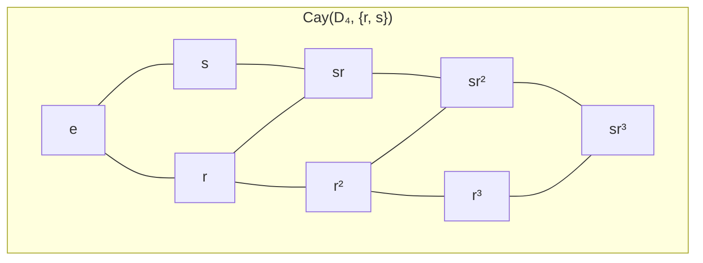
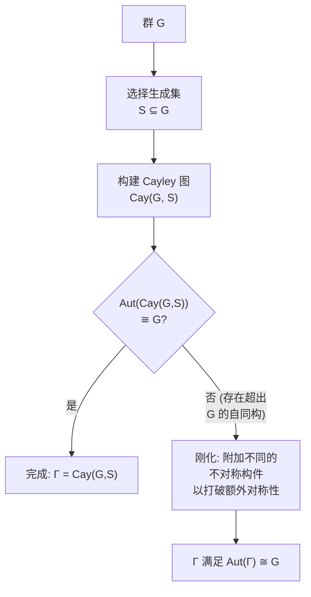
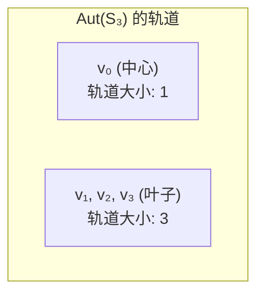

---
tags:
  - Math
  - GraphTheory
  - AbstractAlgebra
  - 概念性
  - 定理性
title: Isomorphism & Automorphism
created: 2026-07-03
modified:
---
# 图同构与自同构 (Isomorphism & Automorphism)

> [!info] 来源
> Christopher Griffin, *Applied Graph Theory* (2023), 第 8 章：代数图论与抽象代数

## 1. 图同构 (Graph Isomorphism)

### 1.1 定义 (Definition)

**定义 8.6 (图同构).** 设 $G = (V, E)$ 和 $G' = (V', E')$ 是图。若存在一双射 $f : V \to V'$ 使得对所有 $v_1, v_2 \in V$ 有：

$$\{v_1, v_2\} \in E \iff \{f(v_1), f(v_2)\} \in E'$$

则称 $G$ 与 $G'$ 是**同构的 (isomorphic)**，记为 $G \cong G'$。映射 $f$ 称为**图同构 (graph isomorphism)**。若 $G \cong G'$，则 $G$ 与 $G'$ 在顶点重命名意义下是相同的——它们具有**相同的结构**。

> [!note] 直观理解
> 同构就是顶点重命名。你可以任意重新标记顶点；若重新标记后边的关系匹配，则这些图在结构上是相同的。

**定义 8.7 (同构类).** 设 $G = (V, E)$ 是图。集合 $\{H : H \cong G\}$ 称为 $G$ 的**同构类型**或**同构类 (isomorphism class)**。

> 上面两个 4 顶点图是同构的：映射 $1 \mapsto a$，$2 \mapsto b$，$3 \mapsto c$，$4 \mapsto d$。

### 1.2 同构与非同构——警示示例 (Isomorphic vs. Non-Isomorphic — A Cautionary Example)

具有相同的度序列是同构的**必要**条件但**不充分**。考虑 Griffin 书中图 8.2 中的图：

上两图都有度序列 $d = (2,2,2,2,2,2) = d'$ 且都有两个连通分支——然而它们**不同构**：$G$ 由三个不交的 $K_2$ 连通分支组成，而 $G'$ 由两个不交的 $P_3$ 路径组成。没有双射能将大小为 2 的分支映射为大小为 3 的分支。

> [!warning] 关键教训
> 度序列匹配是同构的**必要**但**不充分**条件。必须检查更深层的结构不变量。

### 1.3 图不变量 (Graph Invariants)

**定理 8.8 (图不变量定理).** 设 $G = (V, E)$ 与 $G' = (V', E')$ 是图，$G \cong G'$，$f : V \to V'$ 是同构映射。则：

| # | 不变量 | 记号 | 是否保持？ |
|:-:|:---------|:--------:|:----------:|
| 1 | 顶点数 | $|V| = |V'|$ | ✅ |
| 2 | 边数 | $|E| = |E'|$ | ✅ |
| 3 | 每个顶点的度 | $\deg(v) = \deg(f(v))$ | ✅ |
| 4 | 度序列 | $d = d'$ | ✅ |
| 5 | 离心率 (eccentricity) | $\operatorname{ecc}(v) = \operatorname{ecc}(f(v))$ | ✅ |
| 6 | 团数 (clique number) | $\omega(G) = \omega(G')$ | ✅ |
| 7 | 独立数 (independence number) | $\alpha(G) = \alpha(G')$ | ✅ |
| 8 | 连通分支数 | $c(G) = c(G')$ | ✅ |
| 9 | 直径 (diameter) | $\operatorname{diam}(G) = \operatorname{diam}(G')$ | ✅ |
| 10 | 半径 (radius) | $\operatorname{rad}(G) = \operatorname{rad}(G')$ | ✅ |
| 11 | 围长 (girth) | $\text{girth}(G) = \text{girth}(G')$ | ✅ |
| 12 | 周长 (circumference) | $\text{circ}(G) = \text{circ}(G')$ | ✅ |
| 13 | **谱 (spectrum)** | $\operatorname{spec}(G) = \operatorname{spec}(G')$ | ✅ |

**证明概要.** 每个结论直接由定义得出：由于 $f$ 是保持邻接关系的双射，任何仅由邻接关系定义的属性在顶点重命名下保持不变。对于谱：同构的图具有相同的邻接矩阵，仅相差一个置换相似 $A' = P A P^{\sf T}$，因此特征值相同（参见 [[Adjacency Matrix & Spectrum]]）。

### 1.4 必要条件与充分条件 (Necessary vs. Sufficient Conditions)

定理 8.8 中的不变量是同构的**必要**条件——若其中任何一个不同，则图不可能同构。然而，它们**不是充分**的：存在非同构的图共享所有这些不变量。

| 条件 | 状态 |
|:---------|:------:|
| 度序列匹配 | ❌ 不充分 |
| 各长度环的数量匹配 | ❌ 不充分 |
| 谱匹配 | ❌ **不充分**（存在同谱的非同构图） |
| 所有已知不变量匹配 | ❌ 仍不能证明充分 |
| 存在显式保持邻接的双射 | ✅ **充要条件**（依定义） |

**图同构问题 (graph isomorphism problem)**（定义 8.13）——判定两个给定图是否同构——其复杂度未知。它既不属于 P 也不属于 NP-complete，但广泛认为可以在拟多项式时间内求解（Babai, 2016）。**子图同构问题 (subgraph isomorphism problem)**（定义 8.14）——判定 $G$ 是否包含一个与 $H$ 同构的子图——是 **NP-complete**。

> [!note] 树 (Trees)
> 存在**线性时间**算法判定两棵树是否同构。

### 1.5 谱作为不变量 (Spectrum as an Invariant)

图 $G$ 的**邻接谱 (adjacency spectrum)** 是其邻接矩阵 $A(G)$ 特征值的多重集。若 $G \cong G'$，则对某个置换矩阵 $P$ 有 $A' = P A P^{\sf T}$，因此 $\operatorname{spec}(G) = \operatorname{spec}(G')$。反之不成立：存在**同谱的 (cospectral)** 非同构图。

> [!example] 同谱非同构对
> 5 顶点图 $C_4 \cup K_1$（一个 4-圈加上一个孤立顶点）和 $K_{1,4}$（有 4 个叶子的星图）共享相同的谱 $\{2, 0, 0, 0, -2\}$，但它们显然不同构（度序列不同）。存在更微妙的同谱对，其中定理 8.8 中的所有不变量都匹配。

参见 [[Adjacency Matrix & Spectrum]] 获取完整讨论。

---

## 2. 图自同构 (Graph Automorphism)

### 2.1 定义 (Definition)

**定义 8.16 (自同构).** 设 $G = (V, E)$ 是图。**自同构 (automorphism)** 是从 $G$ 到自身的同构——一个双射 $f : V \to V$，使得对所有 $v_1, v_2 \in V$ 有：

$$\{v_1, v_2\} \in E \iff \{f(v_1), f(v_2)\} \in E$$

自同构是图的一种对称性：保持所有邻接关系的顶点置换。

**引理 8.18 (逆).** 若 $f$ 是 $G$ 的自同构，则 $f^{-1}$ 也是 $G$ 的自同构。

**引理 8.20 (复合).** 若 $f$ 和 $g$ 是 $G$ 的自同构，则 $f \circ g$ 也是 $G$ 的自同构。

### 2.2 自同构群 $\operatorname{Aut}(G)$ (The Automorphism Group $\operatorname{Aut}(G)$)

**定理 8.26.** 设 $G = (V, E)$ 是图。$G$ 的所有自同构的集合，记为 $\operatorname{Aut}(G)$，连同函数的复合运算 $\circ$，构成一个**群 (group)**。

*证明.*
- **封闭性 (Closure)**——引理 8.20：$f \circ g \in \operatorname{Aut}(G)$。
- **结合性 (Associativity)**——函数复合总是结合的。
- **单位元 (Identity)**——恒等映射 $\operatorname{id}_V(v) = v$ 是自同构。
- **逆元 (Inverses)**——引理 8.18：每个自同构都有逆元。
$\square$

因此 $\operatorname{Aut}(G)$ 是对称群 $S_{|V|}$ 的子群——它是一个作用在顶点集 $V$ 上的**置换群 (permutation group)**（参见 [[Abstract_Algebra/Permutation Groups]]）。

### 2.3 示例 (Examples)

#### 完全图：$\operatorname{Aut}(K_n) \cong S_n$

顶点的每个置换都保持邻接关系（所有顶点对都邻接），因此 $\operatorname{Aut}(K_n) = S_n$ 且 $|\operatorname{Aut}(K_n)| = n!$。

| 置换 | 类型 | 几何解释（等边三角形） |
|:-----------:|:----:|:-----------------------------------------------:|
| $e$ | 恒等 (identity) | 无移动 |
| $(1\;2\;3)$ | 3-轮换 (3-cycle) | 逆时针旋转 $120^\circ$ |
| $(1\;3\;2)$ | 3-轮换 (3-cycle) | 顺时针旋转 $120^\circ$ |
| $(1\;2)$ | 对换 (transposition) | 关于过顶点 3 的中线反射 |
| $(1\;3)$ | 对换 (transposition) | 关于过顶点 2 的中线反射 |
| $(2\;3)$ | 对换 (transposition) | 关于过顶点 1 的中线反射 |

#### 圈图：$\operatorname{Aut}(C_n) \cong D_n$

$n$-圈的自同构群是**二面体群 (dihedral group)** $D_n$，阶为 $2n$，由 $n$ 个旋转和 $n$ 个反射组成。

对于 $C_n$：
- **旋转 (Rotations)**：$\rho^k$，$k = 0, 1, \dots, n-1$，其中 $\rho = (1\;2\;3\;\dots\;n)$。
- **反射 (Reflections)**：若 $n$ 为奇数，有 $n$ 个反射各固定一个顶点；若 $n$ 为偶数，有 $n/2$ 个反射固定两个相对顶点，$n/2$ 个反射不固定任何顶点（成对交换）。

#### 路径图：$\operatorname{Aut}(P_n) \cong S_1$ 或 $S_2$

- $\operatorname{Aut}(P_1) \cong S_1$（平凡群 (trivial group)）。
- 对 $n \ge 2$，$\operatorname{Aut}(P_n) \cong S_2$（阶为 2），由反转映射 $i \mapsto n+1-i$ 生成。

#### 星图：$\operatorname{Aut}(S_n) \cong S_n$

星图 $S_n$ 有 $n+1$ 个顶点：一个中心 $v_0$ 连接到 $n$ 个叶子 $v_1, \dots, v_n$。中心必须映射到自身（唯一的度 $n$），而 $n$ 个叶子可以任意置换。因此 $|\operatorname{Aut}(S_n)| = n!$。

#### 不对称图 (Asymmetric Graphs)

大多数图具有**平凡自同构群 (trivial automorphism group)** $\operatorname{Aut}(G) \cong \{e\}$。这样的图称为**不对称的 (asymmetric)**（或刚性的）。当 $n \to \infty$ 时，具有 $\operatorname{Aut}(G) \cong \{e\}$ 的 $n$ 顶点图的比例趋近于 1。

### 2.4 顶点轨道 (Vertex Orbits)

自同构群 $\operatorname{Aut}(G)$ 通过置换作用在 $V$ 上。顶点 $v \in V$ 在该作用下的**轨道 (orbit)** 为：

$$\operatorname{Orb}(v) = \{g(v) : g \in \operatorname{Aut}(G)\}$$

同一轨道中的顶点是**结构上不可区分的**——存在一个自同构将其中一个映射到另一个。$v$ 的**稳定子 (stabilizer)** 为 $\operatorname{Stab}(v) = \{g \in \operatorname{Aut}(G) : g(v) = v\}$。

> **示例：** 在一个有三层的根树中，位于相同深度且具有同构子树的顶点属于同一轨道。中心（唯一度为 3 的顶点）形成单元素轨道；三个中间顶点形成一个轨道；六个叶子形成另一个轨道。

**轨道-稳定子定理 (Orbit-Stabilizer Theorem)**（应用于 $\operatorname{Aut}(G)$）：

$$|\operatorname{Orb}(v)| \cdot |\operatorname{Stab}(v)| = |\operatorname{Aut}(G)|$$

---

## 3. 图论中的群 (Groups in Graph Theory)

### 3.1 群公理复习 (Group Axioms Review)

一个**群 (group)** $(S, \circ)$ 是集合 $S$ 配上二元运算 $\circ : S \times S \to S$，满足：

1. **结合性 (Associativity)**：$(a \circ b) \circ c = a \circ (b \circ c)$
2. **单位元 (Identity)**：$\exists e \in S$ 使得对所有 $a \in S$ 有 $e \circ a = a \circ e = a$
3. **逆元 (Inverses)**：$\forall a \in S$，$\exists a^{-1} \in S$ 使得 $a \circ a^{-1} = a^{-1} \circ a = e$

若对所有 $a, b$ 还有 $a \circ b = b \circ a$，则称该群为**阿贝尔群 (abelian group)**。

群在图论中自然地以自同构群 $\operatorname{Aut}(G)$（定理 8.26）的形式出现。参见 [[Abstract_Algebra/Group]] 获取完整论述。

### 3.2 置换群 (Permutation Groups)

集合 $V = \{1, \dots, n\}$ 上的**置换 (permutation)** 是一个双射 $f : V \to V$。$V$ 上的**置换群 (permutation group)** 是在复合运算下封闭的置换集合。**对称群 (symmetric group)** $S_n$ 是 $n$ 个元素上所有置换的集合；$|S_n| = n!$。

由于图的自同构是保持邻接关系的顶点置换，$\operatorname{Aut}(G)$ 总是 $S_{|V|}$ 的**子群 (subgroup)**。参见 [[Abstract_Algebra/Permutation Groups]] 获取关于轮换记号、对换、符号同态和交错群的详细内容。

---

## 4. 置换群与图自同构 (Permutation Groups and Graph Automorphisms)

### 4.1 Cayley 定理 (Cayley's Theorem)

> [!theorem] Cayley 定理
> 每个 $n$ 阶群 $G$ 都同构于 $S_n$ 的某个子群。换言之，**每个群都是置换群**。

*证明概要.* 对每个 $g \in G$，定义左乘映射 $L_g : G \to G$ 为 $L_g(h) = gh$。每个 $L_g$ 都是 $G$ 上的一个置换。映射 $\phi : G \to S_G$，$\phi(g) = L_g$，是单的群同态。$\square$

这个基础性结论将抽象群与具体的置换群联系起来，并通过下面的 Frucht 定理进一步与图自同构群联系起来。

### 4.2 Cayley 图 (Cayley Graphs)

**定义 (Cayley 图).** 设 $G$ 是一个群，$S \subseteq G$ 是一个**生成集 (generating set)**（在逆元下封闭，$S = S^{-1}$，且 $e \notin S$）。**Cayley 图** $\operatorname{Cay}(G, S)$ 是按如下方式定义的有向图（当 $S = S^{-1}$ 时为无向图）：

- **顶点集**：$G$（每个群元素是一个顶点）。
- **边集**：对每个 $g \in G$ 和 $s \in S$，一条有向边 $g \xrightarrow{s} g s$（当 $s = s^{-1}$ 时为无向边）。

> $\operatorname{Cay}(\mathbb{Z}_6, \{1, 5\})$ 是 6-圈 $C_6$，因为生成集 $\{1, 5\}$ 对应于模 6 的 $\pm 1$。

**Cayley 图的性质：**

- $\operatorname{Cay}(G, S)$ 是 **$|S|$-正则 (regular)** 的。
- $\operatorname{Cay}(G, S)$ 是**连通的**当且仅当 $S$ 生成 $G$。
- $\operatorname{Cay}(G, S)$ 的**自同构群**始终包含 $G$ 本身（通过左乘作用）。即 $G \hookrightarrow \operatorname{Aut}(\operatorname{Cay}(G, S))$。
- 在许多情况下（当 $S$ 选取适当时），$\operatorname{Aut}(\operatorname{Cay}(G, S)) \cong G$。

**示例——$D_4$ 的 Cayley 图：**

> 二面体群 $D_4 = \langle r, s \mid r^4 = s^2 = e, srs = r^{-1} \rangle$ 在生成集 $\{r, s\}$ 下的 Cayley 图产生一个 8 顶点图，其自同构群包含 $D_4$ 本身。

### 4.3 Frucht 定理 (Frucht's Theorem)

> [!theorem] Frucht 定理 (1939)
> 对每个有限群 $G$，存在一个有限图 $\Gamma$ 使得 $\operatorname{Aut}(\Gamma) \cong G$。也就是说，**每个有限群都是某个图的自同构群**。

*证明策略.*
1. 取 $G$ 的一个生成集 $S$，构造 Cayley 图 $\operatorname{Cay}(G, S)$。
2. Cayley 图的自同构群包含 $G$，但可能更大。
3. 通过向对应于生成元的顶点附加不同的不对称子图（例如不同长度的路径）来"刚化" $\operatorname{Cay}(G, S)$，打破任何额外对称性，同时保持 $G$ 的作用。
4. 所得图的自同构群恰好为 $G$。

> [!note] 历史意义
> Frucht 定理表明，群与图在精确意义上是**等表达力 (equi-expressive)** 的：任何有限群都可以实现为某个图的对称群。这一结果开创了**图形正则表示 (graphical regular representations)** 领域，并加深了群论与图论之间的联系。

### 4.4 总结：群-图联系 (Summary: The Group–Graph Connection)

| 定理 | 陈述 | 意义 |
|:--------|:----------|:-------------|
| Cayley 定理 | 每个群 $G \hookrightarrow S_n$ | 群 = 置换群 |
| Cayley 图 | $G \hookrightarrow \operatorname{Aut}(\operatorname{Cay}(G, S))$ | 群作为图自同构出现 |
| Frucht 定理 | $\forall G\; \exists \Gamma : \operatorname{Aut}(\Gamma) \cong G$ | 所有有限群都是图对称群 |

---

## 5. 不动点、传递性与轨道结构 (Fixed Points, Transitivity, and Orbit Structure)

### 5.1 不动点 (Fixed Points)

自同构 $f \in \operatorname{Aut}(G)$ 有**不动点 (fixed point)** $v \in V$ 若 $f(v) = v$。

- 恒等自同构固定每个顶点。
- 非恒等自同构可以有 0 到 $|V|-2$ 个不动点（除非它是恒等映射，否则不能固定除一个以外的所有顶点）。
- 判定一个图是否具有**无不动点的自同构 (automorphism with no fixed points)** 是 **NP-complete** 的。

### 5.2 传递性 (Transitivity)

自同构群在 $V$ 上的作用是：

- **顶点传递的 (Vertex-transitive)**：对任意 $u, v \in V$，存在 $f \in \operatorname{Aut}(G)$ 使得 $f(u) = v$（即只有一个轨道）。
- **边传递的 (Edge-transitive)**：对任意边 $e_1, e_2 \in E$，存在 $f \in \operatorname{Aut}(G)$ 使得 $f(e_1) = e_2$。
- **正则的 (Regular)**：对任意 $u, v \in V$，存在**恰好一个** $f \in \operatorname{Aut}(G)$ 使得 $f(u) = v$。

| 图 | $\operatorname{Aut}(G)$ | 顶点传递？ | 边传递？ |
|:------|:----------------------:|:------------------:|:----------------:|
| $K_n$ | $S_n$ | ✅ | ✅ |
| $C_n$ ($n\ge 3$) | $D_n$ | ✅ | ✅ |
| $P_n$ ($n\ge 2$) | $S_2$ | ❌ | ❌ |
| 星图 $S_n$ ($n\ge 2$) | $S_n$ | ❌ | ✅ |
| Petersen 图 | $S_5$ | ✅ | ✅ |

**示例——星图 $S_3$ 的轨道结构：**

> $\operatorname{Aut}(S_3) \cong S_3$：中心 $v_0$ 形成单元素轨道（它是唯一的度为 3 的顶点）；三个叶子形成大小为 3 的单个轨道。

### 5.3 自同构群的轨道-稳定子 (Orbit-Stabilizer for Automorphism Groups)

对任意顶点 $v \in V$：

$$|\operatorname{Aut}(G)| = |\operatorname{Orb}(v)| \cdot |\operatorname{Stab}(v)|$$

其中 $\operatorname{Stab}(v) = \{f \in \operatorname{Aut}(G) : f(v) = v\}$ 是 $v$ 的稳定子群 (stabilizer subgroup)。

- 轨道将 $V$ 划分为结构上不可分的类。
- 每个轨道的大小整除 $|\operatorname{Aut}(G)|$。
- 若 $\operatorname{Aut}(G)$ 是顶点传递的，则 $|V|$ 整除 $|\operatorname{Aut}(G)|$。

---

## 符号速查

| 符号 | 含义 |
|------|------|
| $G \cong G'$ | $G$ 与 $G'$ 同构 |
| $\operatorname{Aut}(G)$ | $G$ 的自同构群 |
| $\operatorname{Orb}(v)$ | 顶点 $v$ 的轨道 |
| $\operatorname{Stab}(v)$ | 顶点 $v$ 的稳定子 |
| $\operatorname{Cay}(G, S)$ | 群 $G$ 在生成集 $S$ 下的 Cayley 图 |
| $S_n$ | $n$ 个元素上的对称群 |
| $D_n$ | $n$ 阶二面体群 |
| $\operatorname{spec}(G)$ | $G$ 的邻接谱 |
| $\omega(G)$ | $G$ 的团数 |
| $\alpha(G)$ | $G$ 的独立数 |
| $\operatorname{diam}(G)$ | $G$ 的直径 |
| $\operatorname{rad}(G)$ | $G$ 的半径 |
| $\operatorname{ecc}(v)$ | 顶点 $v$ 的离心率 |
| $\text{girth}(G)$ | $G$ 的围长 |
| $\text{circ}(G)$ | $G$ 的周长 |

## 参考文献 (References)

- Griffin, C. *Applied Graph Theory: An Introduction with Graph Optimization and Algebraic Graph Theory*. World Scientific, 2023. 第 8 章.
- Frucht, R. "Herstellung von Graphen mit vorgegebener abstrakter Gruppe." *Compositio Mathematica* 6 (1939): 239–250.
- Babai, L. "Graph Isomorphism in Quasipolynomial Time." *Proceedings of the 48th ACM STOC* (2016): 684–697.
- Godsil, C. & Royle, G. *Algebraic Graph Theory*. Springer, 2001.

## 相关笔记 (Related Notes)

- [[Definitions]] — 图的基本词汇
- [[Degree Sequences & Subgraphs]] — 度序列、子图
- [[Adjacency Matrix & Spectrum]] — 邻接矩阵、谱不变量
- [[Abstract_Algebra/Group]] — 群公理与基本理论
- [[Abstract_Algebra/Permutation Groups]] — $S_n$、轮换记号、Cayley 定理
