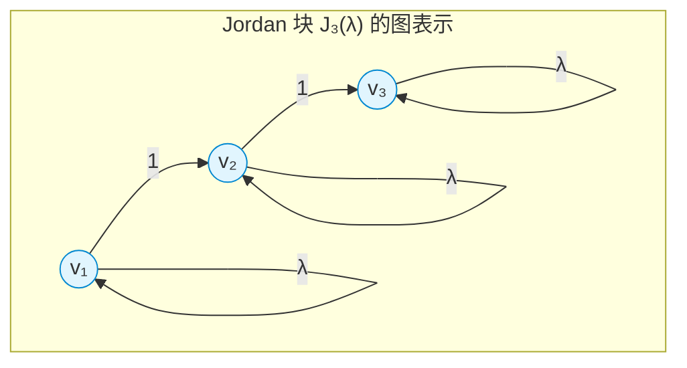
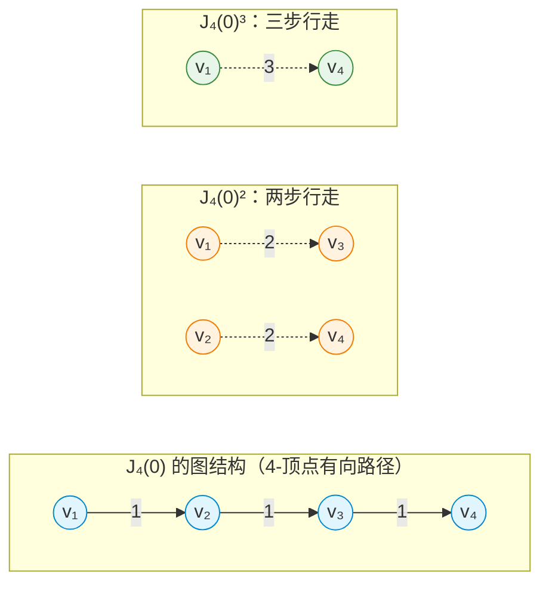
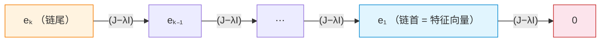
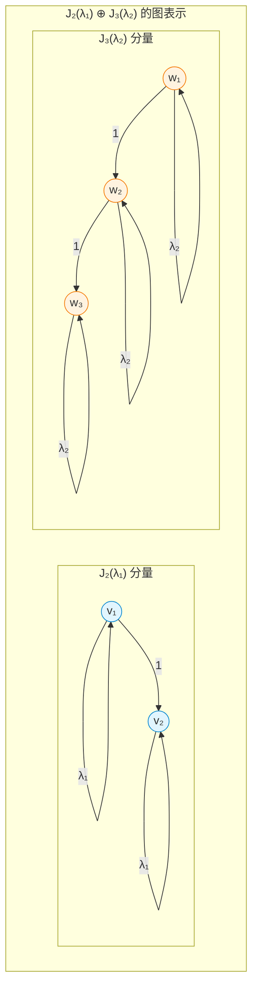
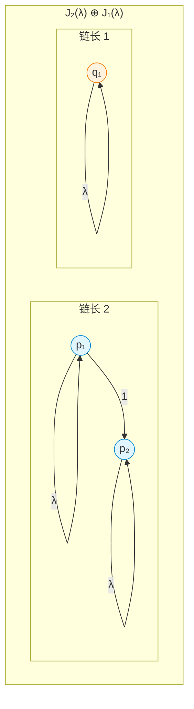
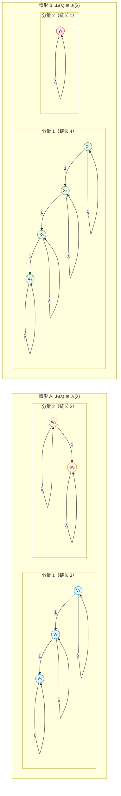
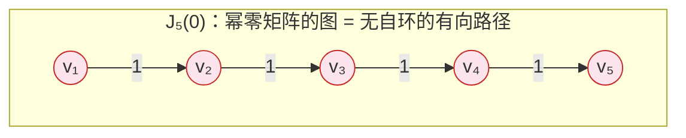
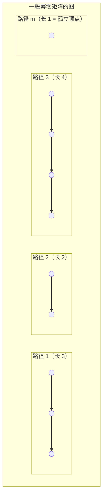
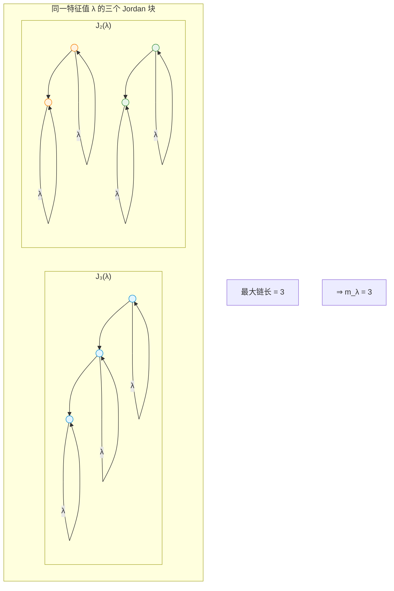

---
tags:
  - Math
  - GraphTheory
  - LinearAlgebra
  - 定理性
  - 概念性
title: Jordan Form through Graph Theory
created: 2026-07-03
modified:
aliases:
  - Jordan Canonical Form via Graph Theory
  - JCF Graph Interpretation
  - Jordan链图的图论视角
---

# Jordan Form through Graph Theory

> **Path C 视角** — 用图论重新理解 Jordan 标准型。每个 Jordan 块对应一个基本"链图"（directed path with self-loops）；Jordan 标准型就是一个矩阵的有向图分解为这些不可约链图的不交并。

---

## 1. 核心思想 (The Core Insight)

Jordan 标准型通常被理解为"最佳的对角化近似"——当特征向量不够时，用超对角线上的 1 来补足。但图论提供了一种更具构造性的视角：

> **核心命题**：一个矩阵的 Jordan 标准型，等价于将其关联有向图分解为若干基本"链图"（directed path graphs with self-loops）。每个 Jordan 块 $J_k(\lambda)$ 对应一个长度为 $k$ 的有向路径，路径上每个顶点具有权重 $\lambda$ 的自环。

换句话说：

| Jordan 标准型概念 | 图论对应 |
|:-----------------|:---------|
| Jordan 块 $J_k(\lambda)$ | $k$ 个顶点的有向路径 + 每个顶点的 $\lambda$ 自环 |
| 直和 $\oplus$ | 图的不交并 (disjoint union) |
| 广义特征向量 | 链上的位置（到链首的距离） |
| 幂零部分 $(J-\lambda I)$ | 移除自环后的有向路径（无权 DAG） |
| 几何重数 | 相同自环权重的连通分量数 |
| 代数重数 | 相同自环权重的顶点总数 |
| 最小多项式指数 | 最长链的长度 |

> 这个视角将 Jordan 标准型从"代数构造"转变为"组合分解"——任何方阵的本质结构不过是一组带有自环的有向路径的不交并。

---

## 2. Jordan Block as Basic Graph

### 2.1 定义

一个 $k \times k$ **Jordan 块** $J_k(\lambda)$ 定义为：

$$
J_k(\lambda) =
\begin{pmatrix}
\lambda & 1 & 0 & \cdots & 0 \\
0 & \lambda & 1 & \cdots & 0 \\
0 & 0 & \lambda & \cdots & 0 \\
\vdots & \vdots & \vdots & \ddots & 1 \\
0 & 0 & 0 & \cdots & \lambda
\end{pmatrix}_{k \times k}
$$

对角线全为 $\lambda$，超对角线全为 $1$，其余为 $0$。

### 2.2 图论表示

在有向图 $G(J_k(\lambda))$ 中：

- **顶点集** $V = \{v_1, v_2, \dots, v_k\}$
- **自环**：每个 $v_i$ 有自环，权重为 $\lambda$
- **边**：每个 $v_i$ 有有向边 $v_i \to v_{i+1}$，权重为 $1$（$i = 1, \dots, k-1$）

这是一个**带有自环的有向路径**——最基本的链图。

> 上图为 $J_3(\lambda)$ 的图表示。三个顶点排成一条有向链 $v_1 \to v_2 \to v_3$，每个顶点有权重 $\lambda$ 的自环。这种结构称为 **Jordan 链 (Jordan chain)**。

### 2.3 基本例子

| Jordan 块 | 大小 | 图结构 | 链长 |
|:----------|:----:|:-------|:----:|
| $J_1(\lambda) = (\lambda)$ | $1 \times 1$ | 单个顶点，仅有 $\lambda$ 自环 | 1 |
| $J_2(\lambda) = \begin{pmatrix}\lambda & 1 \\ 0 & \lambda\end{pmatrix}$ | $2 \times 2$ | 两个顶点 $v_1 \to v_2$，各有 $\lambda$ 自环 | 2 |
| $J_3(\lambda) = \begin{pmatrix}\lambda & 1 & 0 \\ 0 & \lambda & 1 \\ 0 & 0 & \lambda\end{pmatrix}$ | $3 \times 3$ | 三个顶点 $v_1 \to v_2 \to v_3$，各有 $\lambda$ 自环 | 3 |

> [!note] 对角化情形
> $J_1(\lambda)$ 就是对角化情形——一个孤立顶点（仅有自环，没有出边）。当所有 Jordan 块大小为 $1$ 时，图退化为 $n$ 个孤立顶点（各有自环），对应可对角化矩阵。见 [[Linear_Algebra/Diagonalization]]。

---

## 3. Generalized Eigenvectors as Path Walks

### 3.1 The Shift Matrix

定义 Jordan 块的**幂零移位矩阵**：

$$
N_k = J_k(0) = J_k(\lambda) - \lambda I =
\begin{pmatrix}
0 & 1 & 0 & \cdots & 0 \\
0 & 0 & 1 & \cdots & 0 \\
0 & 0 & 0 & \cdots & 0 \\
\vdots & \vdots & \vdots & \ddots & 1 \\
0 & 0 & 0 & \cdots & 0
\end{pmatrix}_{k \times k}
$$

在图论语言中：$N_k$ 就是移除了所有自环的图——一条纯粹的有向路径。

### 3.2 Powers as Walk Lengths

$N_k$ 的幂在图上对应不同长度的行走：

| 表达式 | 矩阵形式 | 图论解释 |
|:-------|:---------|:---------|
| $N_k$ | 超对角线为 1 | 长度为 1 的行走（单步边） |
| $N_k^2$ | 第二超对角线为 1 | 长度为 2 的行走（两步路径：$v_i \to v_{i+2}$） |
| $N_k^3$ | 第三超对角线为 1 | 长度为 3 的行走 |
| $\vdots$ | $\vdots$ | $\vdots$ |
| $N_k^{k-1}$ | $(1,k)$ 位置为 1 | 长度为 $k-1$ 的行走（从 $v_1$ 到 $v_k$） |
| $N_k^k$ | **全零矩阵** | 无长度 $\ge k$ 的行走（路径不够长） |

> **核心观察**：$(J_k(\lambda) - \lambda I)^m$ 中的非零元素位置，恰好对应图中长度为 $m$ 的行走的终点位置。$N_k^{k-1} \neq 0$ 而 $N_k^k = 0$ 这个关键性质，反映的就是"有向路径的最大行走长度 = $k-1$"这一图论事实。

> 上图展示了 $J_4(0)$ 的幂在路径图上的行走解释：$J_4(0)^2$ 对应两步行走（$v_1\to v_3$，$v_2\to v_4$），$J_4(0)^3$ 对应三步行走（仅 $v_1\to v_4$），$J_4(0)^4 = 0$ 因为路径不够长。

### 3.3 Generalized Eigenvectors as Positions on the Chain

**定义**（广义特征向量）。向量 $\mathbf{v} \neq \mathbf{0}$ 是 $A$ 关于 $\lambda$ 的**秩 $r$ 的广义特征向量**，如果：

$$
(A - \lambda I)^r \mathbf{v} = \mathbf{0}, \quad (A - \lambda I)^{r-1} \mathbf{v} \neq \mathbf{0}
$$

在图论语言中，对于 Jordan 块 $J_k(\lambda)$，标准基向量 $\{e_1, e_2, \dots, e_k\}$ 构成一个 **Jordan 链**：

> **关键对应**：在 $J_k(\lambda)$ 的图表示中，顶点 $v_i$ 对应标准基向量 $e_i$。链首 $v_1$ 是真正的特征向量（$(J-\lambda I)e_1 = 0$），$v_2$ 是秩 2 广义特征向量，$v_3$ 是秩 3，依此类推。**Jordan 链就是有向路径上的顶点序列。**

| 顶点 | 基向量 | 广义特征向量秩 | $(J-\lambda I)$ 作用 |
|:----|:------|:-------------|:-------------------|
| $v_1$ | $e_1$ | 1（特征向量） | $(J-\lambda I)e_1 = 0$ |
| $v_2$ | $e_2$ | 2 | $(J-\lambda I)e_2 = e_1$ |
| $v_3$ | $e_3$ | 3 | $(J-\lambda I)e_3 = e_2$ |
| $\vdots$ | $\vdots$ | $\vdots$ | $\vdots$ |
| $v_k$ | $e_k$ | $k$ | $(J-\lambda I)e_k = e_{k-1}$ |

> [!info] 在链上的位置
> 广义特征向量的秩 = 从链首到该顶点的**距离**（以边数计）+ 1。秩 $r$ 的广义特征向量就是链上第 $r$ 个位置的顶点。$(J-\lambda I)$ 的作用是"向链首方向推进一步"。

---

## 4. Direct Sum as Disjoint Union

### 4.1 直和 = 图的不交并

Jordan 标准型的一般形式是 Jordan 块的直和：

$$
J = J_{k_1}(\lambda_1) \oplus J_{k_2}(\lambda_2) \oplus \cdots \oplus J_{k_r}(\lambda_r)
$$

在图论语言中，**直和对应于图的不交并 (disjoint union)**：

> 上图为 $J = J_2(\lambda_1) \oplus J_3(\lambda_2)$ 的图表示。两个 Jordan 块对应两个互不相连的"链图"分量。$J_2(\lambda_1)$ 是 2-顶点链（自环 $\lambda_1$），$J_3(\lambda_2)$ 是 3-顶点链（自环 $\lambda_2$）。整个图是两个分量的不交并。

### 4.2 矩阵形式 vs 图形式

$$
J = \begin{pmatrix}
\lambda_1 & 1 & 0 & 0 & 0 \\
0 & \lambda_1 & 0 & 0 & 0 \\
0 & 0 & \lambda_2 & 1 & 0 \\
0 & 0 & 0 & \lambda_2 & 1 \\
0 & 0 & 0 & 0 & \lambda_2
\end{pmatrix}
\quad\Longleftrightarrow\quad
\begin{array}{c}
\text{两个不相交的有向路径} \\
\text{分量 1: } v_1 \to v_2 \text{ (自环 } \lambda_1\text{)} \\
\text{分量 2: } w_1 \to w_2 \to w_3 \text{ (自环 } \lambda_2\text{)}
\end{array}
$$

> **关键洞察**：分块对角矩阵的图就是各块的图的不交并。不同 Jordan 块之间没有边——它们代表矩阵作用下的独立"不变子空间"。

### 4.3 同一特征值的多个 Jordan 块

同一特征值 $\lambda$ 可以对应多个 Jordan 块。例如：

$$
J = J_2(\lambda) \oplus J_1(\lambda) =
\begin{pmatrix}
\lambda & 1 & 0 \\
0 & \lambda & 0 \\
0 & 0 & \lambda
\end{pmatrix}
$$

在图论中，这对应**两个**带有 $\lambda$ 自环的路径分量：一个 2-顶点链和一个孤立顶点（1-顶点"路径"）。

> 此时总顶点数 = $2 + 1 = 3$（代数重数），分量数 = $2$（几何重数）。

---

## 5. Algebraic vs. Geometric Multiplicity

### 5.1 图论定义

给定矩阵 $A$ 及其 Jordan 标准型 $J$，对于特征值 $\lambda$：

| 概念 | 代数定义 | 图论定义 |
|:-----|:---------|:---------|
| **代数重数** $a_\lambda$ | 特征多项式 $(\lambda - t)^{a_\lambda}$ 的重数 | 图中有自环 $\lambda$ 的顶点总数 |
| **几何重数** $g_\lambda$ | $\dim \ker(A - \lambda I)$ = 线性无关特征向量数 | 图中自环为 $\lambda$ 的连通分量数 |
| **亏数 (defect)** $d_\lambda$ | $a_\lambda - g_\lambda$ | 使每个分量变成完整环所需的额外边数 |

### 5.2 实例对比

考虑特征值 $\lambda$，代数重数 $a_\lambda = 5$：

**情形 A**：$J_3(\lambda) \oplus J_2(\lambda)$（几何重数 $= 2$）

$$
\text{图：}\quad
\underbrace{\bullet \to \bullet \to \bullet}_{\text{3-顶点链}} \quad\cup\quad
\underbrace{\bullet \to \bullet}_{\text{2-顶点链}}
\quad (\text{全部自环 } \lambda)
$$

- 代数重数：$3 + 2 = 5$ ✓（顶点总数）
- 几何重数：$2$（两个分量）
- 亏数：$5 - 2 = 3$

**情形 B**：$J_4(\lambda) \oplus J_1(\lambda)$（几何重数 $= 2$）

$$
\text{图：}\quad
\underbrace{\bullet \to \bullet \to \bullet \to \bullet}_{\text{4-顶点链}} \quad\cup\quad
\underbrace{\bullet}_{\text{孤立顶点}}
\quad (\text{全部自环 } \lambda)
$$

- 代数重数：$4 + 1 = 5$ ✓
- 几何重数：$2$（同样两个分量）
- 亏数：$5 - 2 = 3$

> 两种情形都有 $a_\lambda = 5$、$g_\lambda = 2$，但**最小多项式的指数不同**：情形 A 的最大链长 $= 3$，情形 B 的最大链长 $= 4$。参见第 7 节。

### 5.3 亏数的图论意义

亏数 $d_\lambda = a_\lambda - g_\lambda$ 衡量的是"如果我们要将每个链分量补成一个完整的有向环，还需要多少条边"：

- 一个 $k$-顶点链缺少 $k-1$ 条边才能成为一个 $k$-环
- 对所有分量求和：$d_\lambda = \sum_{\text{分量 } i} (k_i - 1) = (\sum k_i) - (\text{分量数}) = a_\lambda - g_\lambda$

> **可对角化条件**：$d_\lambda = 0$ 对所有 $\lambda$ 成立 $\iff$ 每个 Jordan 块大小为 $1$ $\iff$ 每个 $\lambda$ 自环分量都是孤立顶点（没有有向边）$\iff$ 图是 $n$ 个孤立顶点的集合。这正是 [[Linear_Algebra/Diagonalization]] 的核心条件。

---

## 6. Nilpotent Operators as Directed Paths

### 6.1 幂零矩阵 = 所有自环权重为零

**幂零矩阵** $N$ 满足 $N^k = 0$ 对某正整数 $k$。在 Jordan 标准型中，幂零矩阵的所有特征值都是 $0$，因此所有自环权重为 $0$。

> 在图论语言中：幂零矩阵对应的图中，**所有自环的权重为零**（即没有自环）。图退化为一个纯粹的有向无环图 (DAG)，具体说是若干有向路径的不交并。

从 $J_k(0)$ 的结构可以清晰看到这一点：

$$
J_k(0) =
\begin{pmatrix}
0 & 1 & 0 & \cdots & 0 \\
0 & 0 & 1 & \cdots & 0 \\
0 & 0 & 0 & \cdots & 0 \\
\vdots & \vdots & \vdots & \ddots & 1 \\
0 & 0 & 0 & \cdots & 0
\end{pmatrix}_{k \times k}
$$

对应的图是一个**没有任何自环的 $k$-顶点有向路径**：

> 这是**纯移位**：每一步的行走把顶点向前推一位。没有自环意味着每一步都"前进"——因为自环是"停留"的代数对应。

### 6.2 幂零指数 = 最长路径

幂零矩阵的核心性质 $N^k = 0$ 且 $N^{k-1} \neq 0$ 在图论中有精确对应：

| 代数事实 | 图论解释 |
|:---------|:---------|
| $N^k = 0$ | 有向路径中没有长度 $\ge k$ 的行走 |
| $N^{k-1} \neq 0$ | 存在至少一个长度为 $k-1$ 的行走（从路径起点到终点） |
| $k$ 是幂零指数 | 最长有向路径的长度 $= k$（顶点数 $= k$ 的路径有 $k-1$ 条边，但 $N^k = 0$）|

> [!warning] 注意
> 对 $J_k(0)$，$N_k$ 的幂零指数是 $k$（因为 $J_k(0)^k = 0$），而路径的最长行走长度是 $k-1$（从 $v_1$ 到 $v_k$）。这和广义特征向量的秩是一致的：路径有 $k$ 个顶点，秩从 $1$ 到 $k$。

### 6.3 一般幂零矩阵 = 多个有向路径的不交并

任意幂零矩阵的 Jordan 标准型是 $J_{k_1}(0) \oplus J_{k_2}(0) \oplus \cdots \oplus J_{k_m}(0)$ 的形式。在图论中，这对应若干不同长度的有向路径的不交并：

> 幂零矩阵的图始终是一个 DAG（有向无环图），具体来说是有向路径的不交并。没有有向圈（因为圈对应非零特征值），没有分支（因为分支对应可约性）。

### 6.4 幂零矩阵与一般 Jordan 块的关系

每个 Jordan 块 $J_k(\lambda)$ 都可以分解为"标量部分 + 幂零部分"：

$$
J_k(\lambda) = \lambda I_k + N_k
$$

在图论中：
- $\lambda I_k$ 对应 $k$ 个孤立顶点，每个带有 $\lambda$ 自环（"停留在原处"）
- $N_k$ 对应一条无自环的有向路径（"向下一步"）

> **视觉化**：你可以把 $J_k(\lambda)$ 的图看作是在 $N_k$ 的纯路径上叠加了 $\lambda$ 自环——每一步行走有两种选择：沿着路径走（权重 1）或者停留在原地（权重 $\lambda$）。

---

## 7. Minimal Polynomial as Graph Property

### 7.1 定义回顾

矩阵 $A$ 的**最小多项式** $m_A(t)$ 是满足 $m_A(A) = 0$ 的最低次首一多项式。对于 Jordan 标准型：

$$
m_A(t) = \prod_{\lambda \in \operatorname{Spec}(A)} (t - \lambda)^{m_\lambda}
$$

其中 $m_\lambda$ 是特征值 $\lambda$ 对应的**最大 Jordan 块大小**。

### 7.2 图论解释

在图论语言中：

> **$m_\lambda$ = 自环为 $\lambda$ 的连通分量中，最长有向路径的顶点数（即最大链长）**

> 上图中，特征值 $\lambda$ 有三个 Jordan 块（$J_3, J_2, J_2$），对应的链长为 $3, 2, 2$。**最小多项式指数 $m_\lambda = 3$** 由最长链 $J_3$ 决定。图的总顶点数 $3+2+2=7$ 给出了代数重数 $a_\lambda = 7$。

### 7.3 与特征多项式的关系

| 多项式 | 图论解释 |
|:------|:---------|
| 特征多项式 $p_A(t) = \prod_\lambda (t - \lambda)^{a_\lambda}$ | $a_\lambda$ = 自环为 $\lambda$ 的顶点总数 |
| 最小多项式 $m_A(t) = \prod_\lambda (t - \lambda)^{m_\lambda}$ | $m_\lambda$ = 自环为 $\lambda$ 的分量中最大链长 |

二者关系：$m_\lambda \le a_\lambda$，等号成立当且仅当特征值 $\lambda$ 只有一个 Jordan 块（图仅有一个链分量）。

> [!example] 对比
> 对于 $J = J_3(\lambda) \oplus J_2(\lambda)$：
> - 特征多项式：$p(t) = (t-\lambda)^5$（$a_\lambda = 5$ 个 $\lambda$ 自环顶点）
> - 最小多项式：$m(t) = (t-\lambda)^3$（最长链 $= 3$）
>
> 对于 $J = J_5(\lambda)$（单一 Jordan 块）：
> - 特征多项式：$p(t) = (t-\lambda)^5$
> - 最小多项式：$m(t) = (t-\lambda)^5$
> - $m_\lambda = a_\lambda$ 因为只有一个链分量

### 7.4 可对角化的图论条件

**可对角化条件**：$m_A(t)$ 无重根 $\iff$ 每个 $m_\lambda = 1$ $\iff$ 每个特征值 $\lambda$ 对应的所有 Jordan 块大小均为 $1$ $\iff$ 每个 $\lambda$ 自环顶点的图中没有有向边（只有孤立顶点）。

换而言之：**当一个矩阵的图退化为仅有孤立顶点（各自带有自环）时，该矩阵可对角化。**

---

## 8. 总结：图论视角的 Jordan 标准型一览

| Jordan 概念 | 图论对应物 | 关键关系 |
|:------------|:---------|:---------|
| Jordan 块 $J_k(\lambda)$ | $k$-顶点有向路径，每个顶点有 $\lambda$ 自环 | 链长 $k$ = 块大小 |
| 直和 $\oplus$ | 图的不交并 | 不同块之间无边 |
| 幂零部分 $N_k = J_k(0)$ | 无自环的有向路径 | $N_k^k = 0$ 对应最长走行长 $= k-1$ |
| 广义特征向量 | 链上的位置 | 秩 $r$ = 到链首距离 $+1$ |
| Jordan 链 | 路径顶点序列 | $(J-\lambda I)$ = 向链首推一步 |
| 特征向量 | 链首顶点 | $(J-\lambda I)v = 0$ |
| 代数重数 $a_\lambda$ | 自环 $\lambda$ 的顶点总数 | $a_\lambda = \sum k_i$ |
| 几何重数 $g_\lambda$ | 自环 $\lambda$ 的分量数 | $g_\lambda = \#\{\text{Jordan blocks for }\lambda\}$ |
| 亏数 $d_\lambda = a_\lambda - g_\lambda$ | 各链补成完整环所需的边数 | $d_\lambda = \sum(k_i - 1)$ |
| 最小多项式指数 $m_\lambda$ | 最长链的顶点数 | $m_\lambda = \max k_i$ |
| 可对角化 | 所有 Jordan 块大小为 1 | 图 = 孤立顶点集（无有向边） |
| 幂零矩阵 | 所有自环权重为 0 = 无自环 | 纯有向路径的 DAG |
| $e^{J_k(\lambda)}$ 中的多项式项 | 路径上的行走计数 | $t^r/r!$ 项对应 $r$-步行走路径数 |

---

## 相关笔记

- [[Every Matrix is a Graph]] — Path C 基础：矩阵-图二元性的完整建立
- [[Linear Transformations as Graph Morphisms]] — 线性变换的图态射视角
- [[Linear_Algebra/Jordan Canonical Form]] — Jordan 标准型的标准代数处理
- [[Linear_Algebra/Eigenvalues and Eigenvectors]] — 特征值与特征向量的基础理论
- [[Linear_Algebra/Diagonalization]] — 对角化：Jordan 块大小全为 1 的特殊情形
- [[Graph - Adjacency Matrix & Spectrum]] — 邻接矩阵与图谱理论
- [[Graph - Walks, Cycles & Connectivity]] — 图上行走、圈与连通的图论基础

---
