---
tags:
  - Math
  - GraphTheory
  - LinearAlgebra
  - 定理性
  - 概念性
title: Laplacian & Spectral Clustering
created: 2026-07-03
modified:
---

# 图的拉普拉斯矩阵与谱聚类 (Graph — Laplacian & Spectral Clustering)

> [!info] 来源
> Christopher Griffin, *Applied Graph Theory* (2023), §10.4 图的拉普拉斯矩阵；另见 von Luxburg (2007), *A Tutorial on Spectral Clustering*; Chung (1997), *Spectral Graph Theory*.

**前置知识：** [[Linear_Algebra/Eigenvalues and Eigenvectors]]、[[Linear_Algebra/Spectral Theorem]]、[[Linear_Algebra/Diagonalization]]、[[Adjacency Matrix & Spectrum]]

**相关章节：** [[Random Walks & PageRank]]（归一化拉普拉斯矩阵 $I - P$ 直接联系到随机游走）

---

图的拉普拉斯矩阵（graph Laplacian）是连接**代数图论**与**无监督学习**的桥梁。它的谱（spectrum）编码了图的连通性、分割和扩张性质，是谱图理论的核心对象。

---

## 1. 图的拉普拉斯矩阵 (The Graph Laplacian)

### 1.1 度矩阵 (Degree Matrix)

**定义 10.32（度矩阵）**。设 $G = (V, E)$ 为简单图，$V = \{v_1, \dots, v_n\}$。**度矩阵**是对角矩阵：

$$D_{ij} = \begin{cases}
\deg(v_i) & i = j \\[2pt]
0 & i \neq j
\end{cases}$$

**示例 10.33**。对于三角形图 $K_3$：

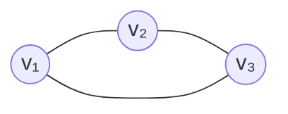

$$D = \begin{pmatrix}
2 & 0 & 0 \\
0 & 2 & 0 \\
0 & 0 & 2
\end{pmatrix}$$

因为每个顶点的度为 2。

---

### 1.2 拉普拉斯矩阵 (Laplacian Matrix)

**定义 10.34（拉普拉斯矩阵）**。设 $G = (V, E)$ 为简单图，邻接矩阵为 $A$，度矩阵为 $D$。**图的拉普拉斯矩阵**（也称*非归一化*拉普拉斯矩阵）定义为：

$$\boxed{L = D - A}$$

**示例 10.35**。对于 $K_3$：

$$A = \begin{pmatrix}
0 & 1 & 1 \\
1 & 0 & 1 \\
1 & 1 & 0
\end{pmatrix}
\qquad
L = \begin{pmatrix}
2 & -1 & -1 \\
-1 & 2 & -1 \\
-1 & -1 & 2
\end{pmatrix}$$

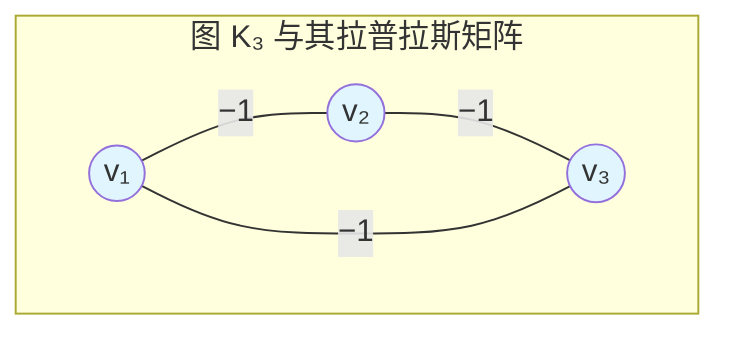

> 每个非对角元 $L_{ij} = -1$ 当 $(i,j) \in E$ 时，每个对角元 $L_{ii} = \deg(v_i)$。$L$ 的行和始终为零（推论 10.39）。

---

### 1.3 二次型（基本联系）(The Quadratic Form)

拉普拉斯矩阵的威力来源于其**二次型**。对任意向量 $x \in \mathbb{R}^n$：

$$\boxed{x^T L x = \sum_{(i,j) \in E} (x_i - x_j)^2}$$

**证明**。展开 $L = D - A$：

$$
\begin{aligned}
x^T L x &= x^T D x - x^T A x \\
&= \sum_{i=1}^n d_i x_i^2 - \sum_{i,j} a_{ij} x_i x_j \\
&= \frac{1}{2} \left( \sum_{i,j} a_{ij} (x_i^2 + x_j^2) - 2 \sum_{i,j} a_{ij} x_i x_j \right) \\
&= \frac{1}{2} \sum_{i,j} a_{ij} (x_i - x_j)^2 = \sum_{(i,j) \in E} (x_i - x_j)^2
\end{aligned}
$$

> [!tip] 为何重要
> 这一恒等式将 $L$ 与图上的**光滑性**联系起来：如果相邻两顶点的值 $x_i$、$x_j$ 相差很大，则二次型较大。图割（graph cut）正是在问哪些边连接了被分配到不同簇的顶点。

---

### 1.4 基本性质 (Basic Properties)

| 性质 | 陈述 |
|:-----|:-----|
| **对称性** | $L^T = L$（命题 10.37） |
| **半正定性** | 对所有 $x \in \mathbb{R}^n$，$x^T L x \ge 0$ |
| **行和为零** | $L \cdot \mathbf{1} = 0$（推论 10.39） |
| **特征值** | $0 = \lambda_1 \le \lambda_2 \le \cdots \le \lambda_n$ |
| **$\lambda_1$ 的特征向量** | $\mathbf{1} = (1,1,\dots,1)$（定理 10.40） |

> [!proof] （定理 10.40）
> 令 $\mathbf{1} = (1,1,\dots,1)^T$。$L\mathbf{1}$ 的第 $i$ 个分量为
> $$(L\mathbf{1})_i = \deg(v_i) - \sum_{j \neq i} a_{ij} = \deg(v_i) - \deg(v_i) = 0$$
> 因此 $L\mathbf{1} = 0 = 0 \cdot \mathbf{1}$，故 $\mathbf{1}$ 是特征值为 $0$ 的特征向量。

半正定性直接由二次型得到：每一项 $(x_i - x_j)^2 \ge 0$。

---

## 2. 拉普拉斯矩阵的谱性质 (Spectral Properties of the Laplacian)

### 2.1 零特征值与连通分量 (Eigenvalue Zero and Connected Components)

关于拉普拉斯矩阵最重要的结构性定理：

> [!theorem] 定理 10.43（重数 = 分量数）
> 设 $G = (V, E)$ 为图，$L$ 为其拉普拉斯矩阵。特征值 $0$ 的**代数重数**等于 $G$ 的**连通分量数**。

**证明思路**。若 $G$ 有 $k$ 个分量 $H_1, \dots, H_k$，则 $L$ 为块对角矩阵，分块为 $L_1, \dots, L_k$，每个 $L_i$ 是 $H_i$ 的拉普拉斯矩阵。每个 $L_i$ 有特征向量 $\mathbf{1}_i$（长度为 $n_i$ 的全 1 向量）对应的特征值为 $0$。这 $k$ 个特征向量线性无关，因此重数至少为 $k$。$L$ 的秩为 $\sum_i (n_i - 1) = n - k$，由秩-零化度定理，零化度恰好为 $k$。∎

> [!warning] 推论
> - $\lambda_1 = 0$ 恒成立（特征向量为 $\mathbf{1}$）
> - $\lambda_2 > 0$ **当且仅当**图连通
> - $\lambda_2 = 0$ 当且仅当图至少有 2 个分量

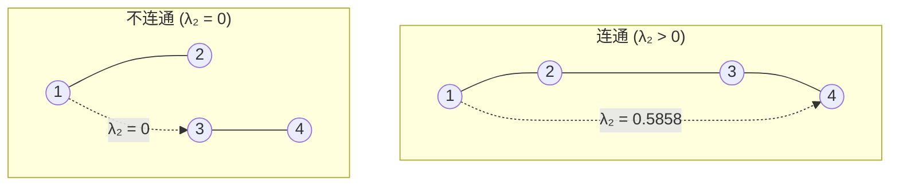

---

### 2.2 Fiedler 值与 Fiedler 向量 (The Fiedler Value and Fiedler Vector)

**定义 10.46（Fiedler 值/向量）**。对于连通图，**第二小特征值** $\lambda_2 > 0$ 称为 **Fiedler 值**（或称*代数连通度*）。其对应的特征向量称为 **Fiedler 向量**。

> [!theorem] 命题 10.47
> $\lambda_2 > 0$ 当且仅当 $G$ 连通。

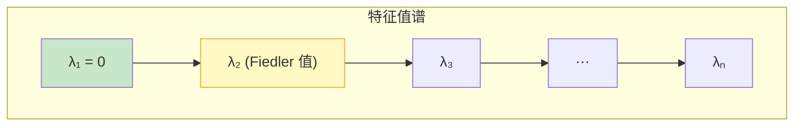

**$\lambda_2$ 的含义：**

| $\lambda_2$ 较大 | $\lambda_2$ 较小 |
|:------------------|:------------------|
| 图连通性好 | 接近不连通 |
| 紧密的社区结构 | 簇之间存在弱连接 |
| 良好的扩张性质 | 存在瓶颈（bottleneck） |
| Cheeger 常数大 | 存在小割可将图分开 |

**Fiedler 值的界限：**

$$\frac{2}{n} \cdot \kappa(G) \le \lambda_2 \le \frac{n}{n-1} \cdot \delta(G)$$

其中 $\kappa(G)$ 是顶点连通度，$\delta(G)$ 是最小度。上界由 Rayleigh 商得到：

$$\lambda_2 \le \min_{x \perp \mathbf{1}} \frac{x^T L x}{x^T x}$$

---

### 2.3 Fiedler 向量与谱分割 (The Fiedler Vector and Spectral Partitioning)

> [!theorem] 定理 10.49（连通子图性质）
> 设 $v$ 为 Fiedler 向量（$\lambda_2$ 的特征向量）。对任意阈值 $c$，由
> $$V(v, c) = \{v_i \in V : v_i \ge c\}$$
> 诱导的子图是 $G$ 的**连通子图**。

这是一个非凡的性质：**对 Fiedler 向量取阈值总能得到一个连通子图**。令 $c = 0$ 则根据 Fiedler 向量分量的符号将顶点划分——这就是**谱聚类**（也称 **Cheeger 割**）。

**示例 10.51（社交网络）**。考虑下图：

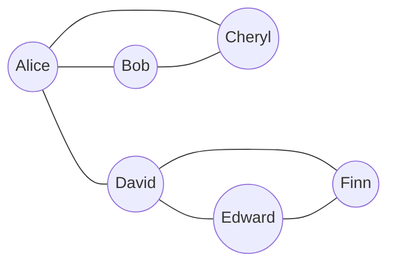

Fiedler 值为 $\lambda_2 = 3 - \sqrt{5} \approx 0.7639$（图连通）。Fiedler 向量（顶点按字母顺序排列）近似为：

$$v \approx \begin{pmatrix} -1.618 \\ -1.618 \\ -0.382 \\ 1 \\ 1.618 \\ 1 \end{pmatrix}$$

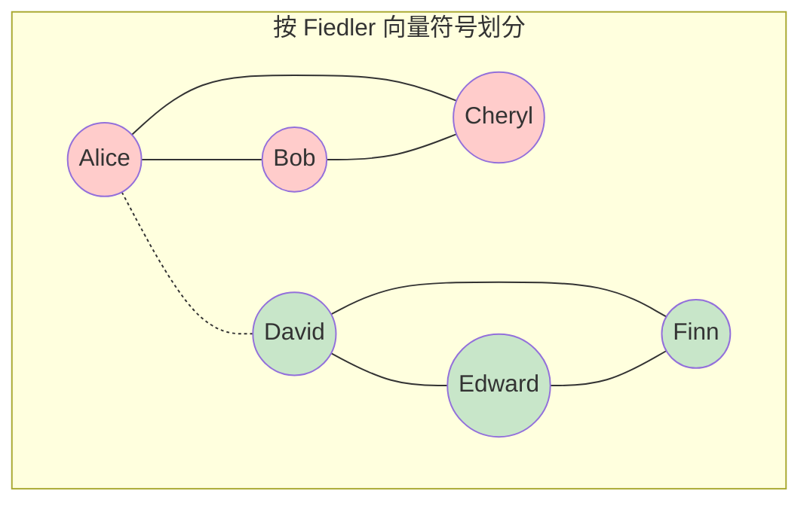

| 顶点 | Fiedler 分量 | 符号 | 簇 |
|:------:|:------------:|:----:|:-------:|
| Alice  | $-1.618$ | 负 | $V_1$ |
| Bob    | $-1.618$ | 负 | $V_1$ |
| Cheryl | $-0.382$ | 负 | $V_1$ |
| David  | $1$      | 正 | $V_2$ |
| Edward | $1.618$  | 正 | $V_2$ |
| Finn   | $1$      | 正 | $V_2$ |

划分恰好为两个三角形 $\{A,B,C\}$ 和 $\{D,E,F\}$——边 $A$-$D$ 是割边。

> [!note] 零分量
> 若某顶点的 Fiedler 分量恰好为 $0$，则可将其归入任意一个划分（或作为孤立点保留）。此类顶点通常连接着两个原本分离的群体。

---

## 3. 归一化拉普拉斯矩阵 (Normalized Laplacians)

在许多应用中（尤其是度分布不均匀时），**非归一化**拉普拉斯矩阵 $L = D - A$ 会被替换为两种归一化变体之一。

### 3.1 对称归一化拉普拉斯矩阵 (Symmetric Normalized Laplacian)

$$L_{\text{sym}} = D^{-1/2} L D^{-1/2} = I - D^{-1/2} A D^{-1/2}$$

**性质：**
- 对称：$L_{\text{sym}}^T = L_{\text{sym}}$
- 半正定
- 特征值 $0 = \nu_1 \le \nu_2 \le \cdots \le \nu_n \le 2$（对于非二分图，$\nu_n < 2$）
- 二次型：$x^T L_{\text{sym}} x = \sum_{(i,j)\in E} \left( \frac{x_i}{\sqrt{d_i}} - \frac{x_j}{\sqrt{d_j}} \right)^2$

### 3.2 随机游走归一化拉普拉斯矩阵 (Random-Walk Normalized Laplacian)

$$L_{\text{rw}} = D^{-1} L = I - D^{-1} A = I - P$$

其中 $P = D^{-1}A$ 是图 $G$ 上随机游走的转移矩阵。

**性质：**
- 非对称（但通过 $L_{\text{rw}} = D^{-1/2} L_{\text{sym}} D^{1/2}$ 与 $L_{\text{sym}}$ 相似）
- 与 $L_{\text{sym}}$ 有相同的特征值
- $L_{\text{rw}}$ 的特征向量满足 $L_{\text{rw}} u = \nu u$ ⇒ $L_{\text{rw}}$ 的 Rayleigh 商即为**归一化割**的目标函数
- $L_{\text{rw}}$ 是随机游走的**生成元**：$\frac{d}{dt} p(t) = -L_{\text{rw}} p(t)$

### 3.3 对比 (Comparison)

| 拉普拉斯矩阵 | 公式 | 对称 | 特征值范围 | 最佳用途 |
|:----------|:--------|:---------:|:----------------:|:---------|
| 非归一化 $L$ | $D - A$ | ✅ | $[0, \Delta]$ | 正则图、理论研究 |
| 对称 $L_{\text{sym}}$ | $I - D^{-1/2} A D^{-1/2}$ | ✅ | $[0, 2]$ | 度归一化分析 |
| 随机游走 $L_{\text{rw}}$ | $I - D^{-1}A$ | ❌ | $[0, 2]$ | 谱聚类（Ncut） |

> [!tip] 该用哪个？
> 对于谱聚类，**推荐使用 $L_{\text{rw}}$**（von Luxburg, 2007），因其特征向量直接求解归一化割的松弛问题。非归一化拉普拉斯矩阵在度分布高度不均匀的图上可能会失效。

---

## 4. 矩阵-树定理（Kirchhoff 定理）(Matrix-Tree Theorem)

拉普拉斯矩阵还用于计算**生成树**的数量——这是图论中最优美的联系之一。

> [!theorem] Kirchhoff 矩阵-树定理
> 对于连通图 $G$，设 $L$ 为其拉普拉斯矩阵，则生成树的数量 $\tau(G)$ 等于 $L$ 的**任意一个余子式**：
> $$\tau(G) = (-1)^{i+j} \det(L^{(ij)})$$
> 其中 $L^{(ij)}$ 是去掉第 $i$ 行和第 $j$ 列后的 $L$。等价地，
> $$\tau(G) = \frac{1}{n} \prod_{k=2}^n \lambda_k$$
> 其中 $\lambda_2, \dots, \lambda_n$ 是 $L$ 的非零特征值。

### 4.1 示例：$K_4$（4 个顶点的完全图）(Example: $K_4$)

$$K_4 \text{ 的拉普拉斯矩阵：} \quad L = \begin{pmatrix}
3 & -1 & -1 & -1 \\
-1 & 3 & -1 & -1 \\
-1 & -1 & 3 & -1 \\
-1 & -1 & -1 & 3
\end{pmatrix}$$

去掉第 4 行和第 4 列：

$$L^{(44)} = \begin{pmatrix}
3 & -1 & -1 \\
-1 & 3 & -1 \\
-1 & -1 & 3
\end{pmatrix}$$

计算行列式：

$$\det(L^{(44)}) = 3 \cdot (9 - 1) - (-1)(-3 + 1) + (-1)(1 - 3) = 24 + (-2) + 2 = 16$$

使用特征值公式：$K_4$ 的 $L$ 的特征值为 $\{0, 4, 4, 4\}$，因此

$$\tau(K_4) = \frac{1}{4} \cdot (4 \cdot 4 \cdot 4) = \frac{64}{4} = 16$$

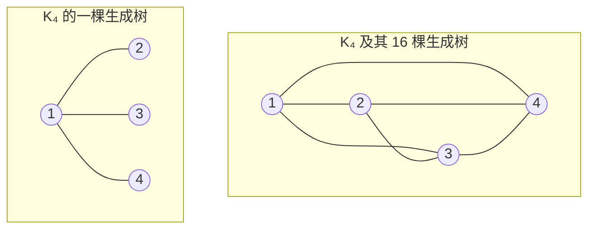

> [!check] 验证
> Cayley 公式给出 $\tau(K_n) = n^{n-2}$，因此 $\tau(K_4) = 4^{2} = 16$。✓

---

## 5. 谱聚类 (Spectral Clustering)

谱聚类是图的拉普拉斯矩阵在实践中最重要的一种应用。它利用 $L$（或 $L_{\text{rw}}$）的特征向量来划分数据，尤其适用于**非凸**形状的簇——这是 $k$-means 无法处理的情形。

### 5.1 直觉 (The Intuition)

数据的聚类问题可以重新表述为**图分割**问题：
1. 构建相似度图（如 $k$-NN、$\epsilon$-邻域、高斯核）
2. 权重 $w_{ij}$ 反映点 $i$ 和 $j$ 之间的相似度
3. 分割图使得**簇之间的边数**最小化

### 5.2 Ratio Cut 与 Normalized Cut (Ratio Cut and Normalized Cut)

对于 $V$ 被划分为 $k$ 个子集 $A_1, \dots, A_k$：

$$\text{RatioCut}(A_1, \dots, A_k) = \sum_{i=1}^k \frac{\text{cut}(A_i, \bar{A}_i)}{|A_i|}$$

$$\text{NCut}(A_1, \dots, A_k) = \sum_{i=1}^k \frac{\text{cut}(A_i, \bar{A}_i)}{\text{vol}(A_i)}$$

其中 $\text{cut}(A, B) = \sum_{i \in A, j \in B} w_{ij}$，$\text{vol}(A) = \sum_{i \in A} d_i$。

这两个问题直接最小化都是 NP-hard 的。**谱聚类则求解其连续松弛。**

### 5.3 松弛 (The Relaxation)

对于 $k = 2$，RatioCut 最小化可松弛为：

$$\min_{x \perp \mathbf{1}} \frac{x^T L x}{x^T x}$$

其解就是 **Fiedler 向量**（$\lambda_2$ 的特征向量）。对于 NCut，松弛涉及 $L_{\text{rw}}$：

$$\min_{y} \frac{y^T L y}{y^T D y}$$

由 $L_{\text{rw}}$ 的第二小特征值对应的特征向量求解。

### 5.4 算法：谱聚类 (Algorithm: Spectral Clustering)

**输入：** 数据点 $\{p_1, \dots, p_n\}$，目标簇数 $k$

| 步骤 | 操作 |
|:----|:-------|
| **1** | 构建相似度图 $G$（例如使用高斯核 $w_{ij} = \exp(-\|p_i - p_j\|^2 / 2\sigma^2)$ 的 $k$-NN） |
| **2** | 计算拉普拉斯矩阵：选择 $L$、$L_{\text{sym}}$ 或 $L_{\text{rw}}$ |
| **3** | 计算所选拉普拉斯矩阵的前 $k$ 个特征向量 $u_1, \dots, u_k$ |
| **4** | 以这些特征向量为列构成矩阵 $U \in \mathbb{R}^{n \times k}$ |
| **5** | 将 $U$ 的每一行视为 $\mathbb{R}^k$ 中的一个点，执行 $k$-means |

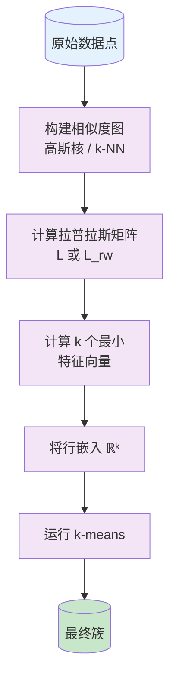

### 5.5 谱聚类为何有效（非凸聚类）(Why Spectral Clustering Works)

传统的 $k$-means 假设簇是球形（凸）的，在处理同心环或交织的半月形数据时会失败：

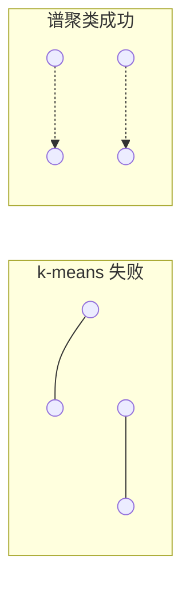

**谱聚类将非凸的空间问题转化为特征向量嵌入空间中的线性可分问题。** 属于同一簇的点的 Fiedler 向量分量几乎恒定，因此可以通过简单的阈值或 $k$-means 进行分割。

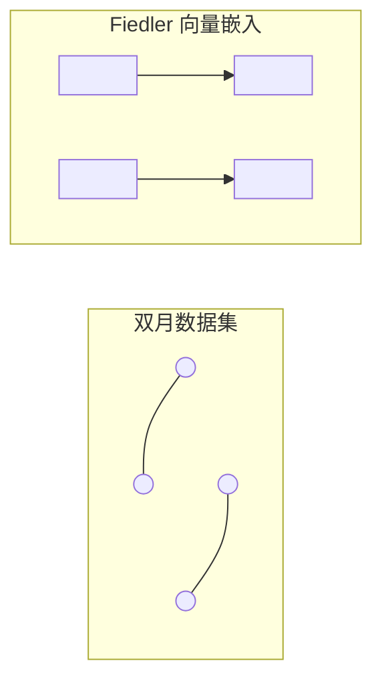

### 5.6 选择 $k$ (Choosing $k$)

几种常用启发式方法：

| 方法 | 描述 |
|:-------|:------------|
| **特征间隙 (Eigengap)** | 寻找最大间隙 $\lambda_{k+1} - \lambda_k$；在该间隙处选择 $k$ |
| **轮廓系数 (Silhouette)** | 在不同 $k$ 下对特征嵌入数据计算轮廓得分 |
| **稳定性 (Stability)** | 多次加入噪声运行谱聚类；选择结果最稳定的 $k$ |

### 5.7 对比：谱聚类与经典聚类 (Comparison: Spectral vs Traditional Clustering)

| 方面 | $k$-means | 谱聚类 |
|:-------|:----------|:-------------------|
| 簇形状 | 凸形、球形 | 任意形状（非凸） |
| 输入 | 原始点 | 相似度图 |
| 目标函数 | 最小化簇内方差 | 最小化归一化割 |
| 确定性 | 随机初始化 | 通常确定（符号除外） |
| 可扩展性 | $O(n)$ | $O(n^3)$ 朴素；稀疏图 $O(n^2)$ |
| 假设 | 欧氏度量 | 成对相似性 |

---

## 6. 应用 (Applications)

### 6.1 图像分割 (Image Segmentation)

将每个像素（或超像素）视为图的一个顶点。边权重编码：
- 像素强度/颜色相似度
- 空间邻近性
- 纹理相似度

Fiedler 向量随后可将前景与背景分离：

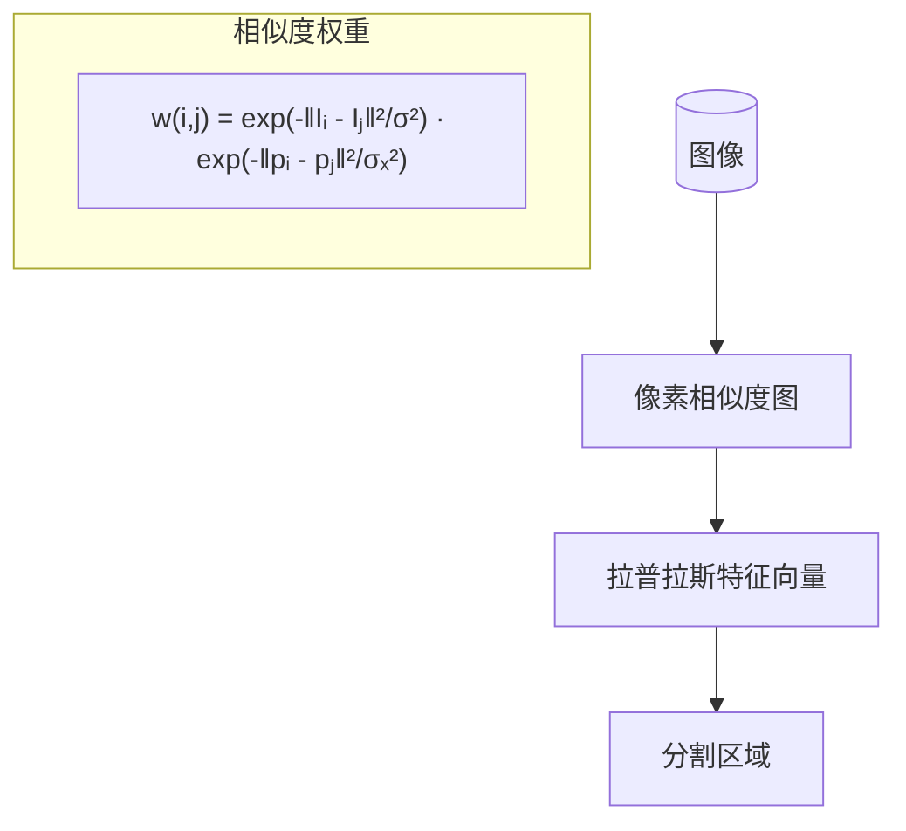

**Shi & Malik (2000)** 率先将归一化割用于图像分割，利用 $L_{\text{rw}}$ 的特征向量递归地分割图像。

### 6.2 社交网络中的社区检测 (Community Detection in Social Networks)

社交网络通常具有**社区结构**——内部连接密集而外部连接稀疏的群体。在图拉普拉斯矩阵上应用谱聚类可以发现这些社区。

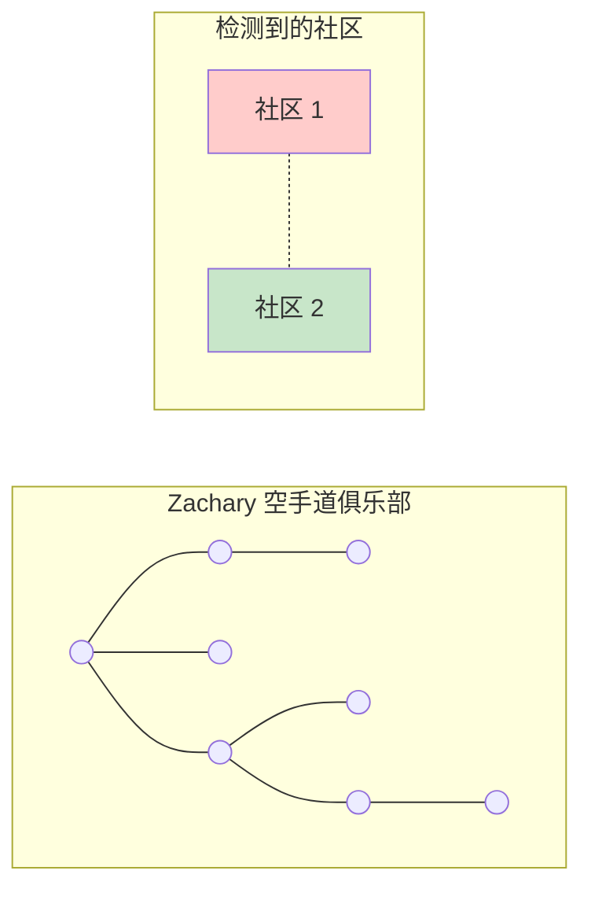

> [!note] 经典数据集
> Zachary 的空手道俱乐部网络（1977 年）是经典示例：在 $L$ 上运行的谱聚类能够以近乎完美的准确率还原研究中实际发生的分裂。

### 6.3 并行计算的图分割 (Graph Partitioning for Parallel Computing)

大规模科学计算将数据分配到多个处理器上。目标是：**最小化通信**（分区之间的边）同时**平衡负载**（分区大小）。这正是在 RatioCut/Ncut 中提出的问题。

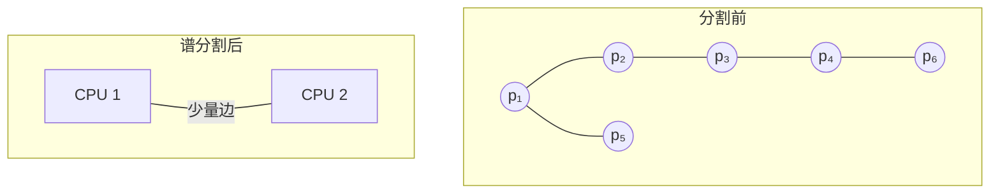

**METIS**（Karypis & Kumar）和 **Scotch** 是实用的图分割工具；谱方法提供了理论保证和初始化方案。

### 6.4 其他应用 (Other Applications)

| 领域 | 应用 |
|:-------|:------------|
| **生物学** | 基因表达聚类、蛋白质互作网络 |
| **自然语言处理** | 文档聚类、词义消歧 |
| **推荐系统** | 用户-物品图分割 |
| **半监督学习** | 拉普拉斯正则化（以 $x^T L x$ 作为光滑性罚项） |
| **流形学习** | 拉普拉斯特征映射（通过 $L_{\text{sym}}$ 进行降维） |

---

## 7. 总结 (Summary)

| 概念 | 关键结论 |
|:--------|:-----------|
| **拉普拉斯矩阵** | $L = D - A$，二次型 $x^T L x = \sum_{(i,j)\in E} (x_i - x_j)^2$ |
| **零特征值** | 重数 = 连通分量数 |
| **Fiedler 值** | $\lambda_2 > 0$ 当且仅当图连通；衡量代数连通度 |
| **Fiedler 向量** | 阈值化得到连通子图；符号给出 Cheeger 割 |
| **归一化拉普拉斯矩阵** | $L_{\text{sym}}$、$L_{\text{rw}}$——在度不均匀的图上效果更佳 |
| **矩阵-树定理** | $\tau(G) = \frac{1}{n} \prod_{k=2}^n \lambda_k$ |
| **谱聚类** | 将顶点嵌入特征向量空间，再用 $k$-means 聚类 |
| **应用** | 图像分割、社区检测、并行计算 |

---

## 符号速查 (Symbol Reference)

| 符号 | 含义 |
|:----:|:-----|
| $L$ | 图的（非归一化）拉普拉斯矩阵 $L = D - A$ |
| $D$ | 度矩阵，$D_{ii} = \deg(v_i)$ |
| $A$ | 邻接矩阵 |
| $\lambda_1 \le \lambda_2 \le \cdots \le \lambda_n$ | $L$ 的特征值 |
| $\lambda_2$ | Fiedler 值（代数连通度） |
| $L_{\text{sym}}$ | 对称归一化拉普拉斯矩阵 |
| $L_{\text{rw}}$ | 随机游走归一化拉普拉斯矩阵 |
| $\tau(G)$ | 图 $G$ 的生成树数目 |
| $\text{cut}(A, B)$ | 集合 $A$ 与 $B$ 之间的边权和 |
| $\text{vol}(A)$ | 集合 $A$ 的体（顶点度之和） |
| $\text{RatioCut}$ | 比例割目标函数 |
| $\text{NCut}$ | 归一化割目标函数 |
| $\mathbf{1}$ | 全 1 向量 |

---

## 参考文献 (References)

- Griffin, C. (2023). *Applied Graph Theory*, §10.4. — 本笔记的主要来源。
- von Luxburg, U. (2007). A tutorial on spectral clustering. *Statistics and Computing*, 17(4), 395–416. — 权威教程，含收敛性分析。
- Chung, F. R. K. (1997). *Spectral Graph Theory*. CBMS Regional Conference Series.
- Shi, J. & Malik, J. (2000). Normalized cuts and image segmentation. *IEEE TPAMI*, 22(8), 888–905.
- Fiedler, M. (1973). Algebraic connectivity of graphs. *Czechoslovak Mathematical Journal*, 23(2), 298–305.
- Ng, A., Jordan, M., & Weiss, Y. (2002). On spectral clustering: Analysis and an algorithm. *NeurIPS*.

---

## 相关链接 (See Also)

- [[Adjacency Matrix & Spectrum]] — 邻接矩阵、图的谱、Perron–Frobenius 定理
- [[Random Walks & PageRank]] — 随机游走、$L_{\text{rw}}$ 作为生成元、PageRank
- [[Linear_Algebra/Eigenvalues and Eigenvectors]] — 特征值基础
- [[Linear_Algebra/Spectral Theorem]] — 对称矩阵对角化
- [[Linear_Algebra/Diagonalization]] — 对角化与二次型

---
