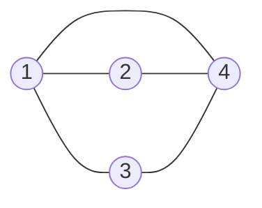
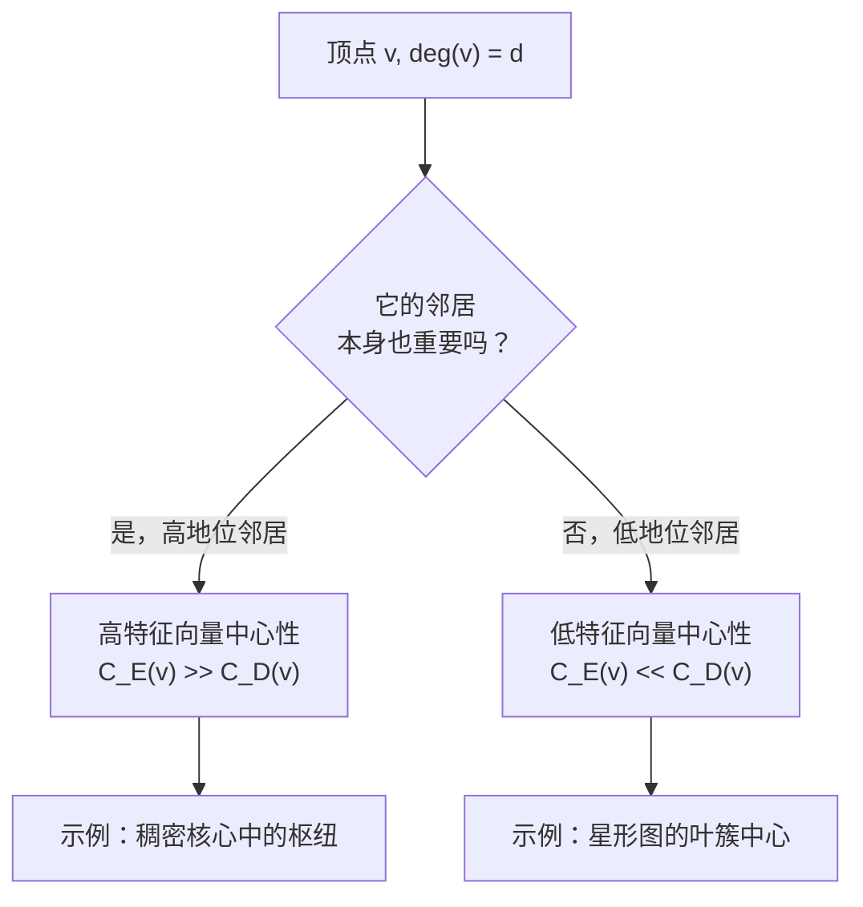
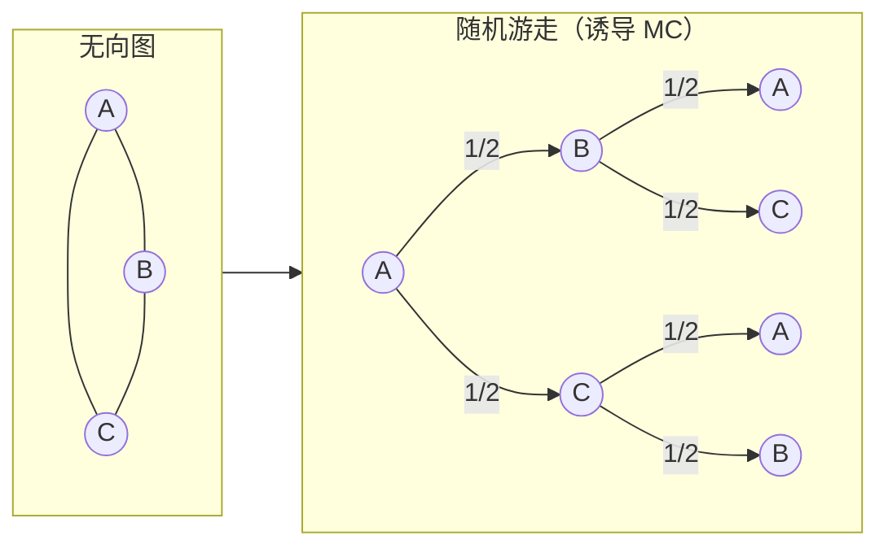
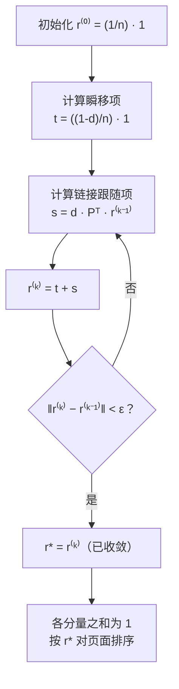
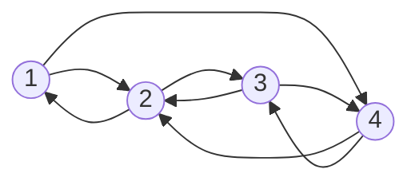

---
tags:
  - Math
  - GraphTheory
  - Probability
  - 概念性
  - 方法性
title: Random Walks & PageRank
created: 2026-07-03
modified:
---

# 随机游走与 PageRank (Random Walks & PageRank)

> [!info] 来源
> Christopher Griffin, *Applied Graph Theory* (2023), 第 10 章 *Applications of Algebraic Graph Theory*, §10.1–10.3。

---

## 概述 (Overview)

本笔记将三个层层递进的思想串联起来：

1. **特征向量中心性 (eigenvector centrality)** — 一种基于谱的顶点重要性度量
2. **Markov 链与随机游走 (Markov chains and random walks)** — 图上的概率动力学
3. **PageRank** — 驱动 Google 搜索引擎的随机浏览者模型

贯穿其中的主线是 Perron–Frobenius 定理：每个问题都归结为求某个矩阵的**主特征向量**。

---

## 1. 特征向量中心性 (§10.1, Eigenvector Centrality)

### 1.1 定义 (Definition)

其核心思想是**自指 (self-referential)** 的：一个顶点重要，是因为它与其他重要的顶点相连。

> [!quote] Griffin, 推导 10.3
> "重要的顶点之所以重要，恰恰因为它们与其它重要顶点相邻。（这就是高中里'因关联而酷'的概念。）"

设 $x_i$ 为顶点 $v_i$ 的中心性，将其定义为邻点得分的缩放和：

$$x_i = \frac{1}{\lambda} \sum_{v_j \in N(v_i)} x_j
      = \frac{1}{\lambda} \sum_{j=1}^n M_{ij} x_j$$

其中 $M$ 是邻接矩阵，$\lambda$ 是待定常数。写成矩阵形式：

$$\lambda x = M x \quad \Longrightarrow \quad M x = \lambda x$$

因此 $x$ 是 $M$ 的**特征向量**，$\lambda$ 是其对应的特征值。

**选哪个特征向量？** 根据 Perron–Frobenius 定理（定理 9.19），连通图的邻接矩阵有唯一的模最大特征值 $\lambda_1$，其对应的特征向量 $x$ 的所有分量均为正。这就是 **Perron–Frobenius 特征向量**，它定义了特征向量中心性：

$$C_E(v_i) = x_i \quad \text{其中 } M x = \lambda_1 x, \; x_i > 0$$

各分量通常会被归一化使其和为 1。

### 1.2 游走解释 (Walk Interpretation)

> [!quote] Griffin, 注记 10.6
> "当 $k \to \infty$ 时，顶点 $v_i$ 的特征向量中心性实际上就是（归一化后的）到达该顶点的长路径数目。"

设 $x$ 是在第 $i$ 个位置为 1、其余为 0 的向量。那么 $M^k x$ 是一个向量，其第 $j$ 个分量表示从 $v_j$ 到 $v_i$ 长度为 $k$ 的游走数目。定理 10.5 表明：

$$\lim_{k \to \infty} \frac{M^k x}{\lambda_1^k} = \alpha_0 v_0$$

其中 $v_0$ 是 Perron–Frobenius 特征向量。因此，**特征向量中心性奖励那些被许多长游走所到达的顶点**。

### 1.3 示例 (Griffin 图 10.1)



$$M = \begin{bmatrix}
0 & 1 & 1 & 1 \\
1 & 0 & 0 & 1 \\
1 & 0 & 0 & 1 \\
1 & 1 & 1 & 0
\end{bmatrix}$$

**特征值 (Eigenvalues)：** $\lambda_1 = \frac12(1 + \sqrt{17}) \approx 2.562$, $\lambda_2 = \frac12(1 - \sqrt{17}) \approx -1.562$, $\lambda_3 = -1$, $\lambda_4 = 0$.

**归一化特征向量中心性 (Normalized eigenvector centrality)：** $v_0 \approx [0.28,\; 0.22,\; 0.22,\; 0.28]$

顶点 1 和 4 并列最高；顶点 2 和 3 并列较低。

### 1.4 与度中心性比较 (Comparison with Degree Centrality)

| 顶点 | $\deg(v)$ | 度排名 | 特征向量中心性 | 特征向量排名 |
|:------:|:---------:|:-----------:|:---------------------:|:----------------:|
| 1 | 3 | 1 | 0.28 | 1 |
| 2 | 2 | 2 | 0.22 | 2 |
| 3 | 2 | 2 | 0.22 | 2 |
| 4 | 3 | 1 | 0.28 | 1 |

本例中两种排名一致，但它们可能产生巨大差异（见下方决策图）。



### 1.5 局限：无环有向图 (Limitation: Acyclic Digraphs)

对于有向无环图 (DAG)，邻接矩阵可通过排列化为严格上三角形式，因此所有特征值均为零。特征向量中心性对所有顶点都退化为零——这是一个**退化**结果。Katz 中心性和 PageRank 通过添加常数基分解决了这个问题。

---

## 2. Markov 链与随机游走 (§10.2, Markov Chains and Random Walks)

### 2.1 定义 (Definition)

图上的**随机游走 (random walk)** 是一个以固定概率沿边从一个顶点移动到另一个顶点的过程。

**定义 10.9 (Markov 链)**。离散时间 Markov 链是一个二元组 $\mathcal{M} = (G, p)$，其中：
- $G = (V, E)$ 是一个有向图（顶点 = **状态**，边 = **转移**）
- $p: E \to [0, 1]$ 满足 $\sum_{v' \in N_o(v)} p(v, v') = 1$ 对所有 $v \in V$ 成立

**随机矩阵 (stochastic matrix)** 或概率转移矩阵为：

$$P_{ij} = p(v_i, v_j)$$

每一行之和为 1——矩阵是**行随机 (row-stochastic)** 的。

> [!example] Griffin 例 10.11, 图 10.2
> 一个两状态的 Markov 链：
> ```mermaid
> graph LR
>     1((1)) -->|1/2| 1
>     1 -->|1/2| 2((2))
>     2 -->|1/7| 1
>     2 -->|6/7| 2
> ```
> $$P = \begin{bmatrix}
> 1/2 & 1/2 \\[4pt]
> 1/7 & 6/7
> \end{bmatrix}$$

### 2.2 图上的随机游走 (Random Walk on a Graph)

给定一个**无向**图 $G = (V, E)$，最简单的随机游走是**诱导 Markov 链 (induced Markov chain)**（定义 10.27）：
- 将每条无向边 $\{v, v'\}$ 替换为两条有向边 $(v, v')$ 和 $(v', v)$
- 从顶点 $v$ 出发，等概率均匀选择一条出边：

$$p(v, v') = \frac{1}{\deg(v)}$$

转移矩阵为 $P = D^{-1}A$，其中 $D = \operatorname{diag}(\deg(v_1), \dots, \deg(v_n))$ 是度矩阵。



### 2.3 状态演化 (State Evolution)

**定义 10.14 (状态概率向量)**。向量 $x \in \mathbb{R}^{n \times 1}$，满足 $x_i \geq 0$、$\sum_i x_i = 1$，其中 $x_i$ 表示处于状态 $i$ 的概率。

**定理 10.16**。从初始分布 $x^{(0)}$ 出发，经过 $k$ 步后：

$$x^{(k)} = (P^T)^k x^{(0)} \quad \text{（列向量约定）}$$

或用行向量表示为：$x^{(k)} = x^{(0)} P^k$。

### 2.4 平稳分布 (Stationary Distribution)

**定义 10.19 (平稳概率向量)**。向量 $\pi$ 是 $\mathcal{M}$ 的平稳分布当且仅当：

$$\pi = P^T \pi \quad \Longleftrightarrow \quad \pi P = \pi$$

即 $\pi$ 是 $P$ 对应于特征值 1 的**左特征向量**。

> [!quote] Griffin, 注记 10.21
> "方程 (10.14) 看起来很眼熟。它表明 $P^T$ 存在特征值 1 及其对应的全非负特征向量……这与我们用于特征向量中心性的方程非常相似。"

**存在性与唯一性 (定理 10.25)**。若 $P^T$ 是**不可约 (irreducible)** 的（即 $G$ 是强连通的），则 $P$ 存在唯一的平稳分布 $\pi$。

### 2.5 无向连通非二部图 (Undirected Connected Non-Bipartite Graphs)

对于无向、连通、非二部图，随机游走既不可约也非周期。其平稳分布有闭合形式：

$$\pi_i = \frac{\deg(i)}{2|E|}$$

这很直观：游走者会按比例在高度的顶点上花费更多时间。

### 2.6 混合时间与谱间隙 (Mixing Time and Spectral Gap)

**混合时间 (mixing time)** 是指 $x^{(k)}$ 在给定容差 $\varepsilon$ 内趋近 $\pi$ 所需的步数。它由**谱间隙 (spectral gap)** 控制：

$$\gamma = 1 - \max\{|\lambda_2(P)|, |\lambda_n(P)|\}$$

其中 $\lambda_2$ 是模第二大特征值。谱间隙越大 → 混合越快。

| 性质 | 条件 | 混合行为 |
|:---------|:----------|:-------|
| 不可约 | 强连通图 | 到达唯一 $\pi$ |
| 非周期 | 无固定周期长度 | 平滑逼近 $\pi$ |
| 谱间隙 > 0 | $|\lambda_2| < 1$ | 混合时间 $O(1/\gamma \cdot \log(1/\varepsilon))$ |
| 谱间隙 = 0 | 周期（如二部图） | 永不收敛到 $\pi$ |

---

## 3. PageRank (§10.3)

### 3.1 动机：为何不直接用平稳分布？(Motivation: Why Not Just Use the Stationary Distribution?)

给定一个有向 Web 图，我们可以诱导一个 Markov 链（均匀出链概率）并按平稳分布对页面排序。但这会产生两个问题：

1. **悬挂节点 (dangling nodes)** —— 没有出链的页面会破坏随机矩阵（行之和为 0）
2. **非平稳概率分布** —— 若图不是强连通的，诱导链可能不收敛到唯一的平稳分布

**PageRank** (Brin & Page, 1998) 通过**随机浏览者模型 (random surfer model)** 解决了这两个问题。

### 3.2 随机浏览者模型 (Random Surfer Model)

**推导 10.29 (PageRank)**。随机浏览者：
- 以概率 $d$（**阻尼因子，damping factor**，通常 $d = 0.85$）从当前页面跟随一条出链
- 以概率 $1 - d$ 感到厌倦并**瞬移 (teleport)** 到一个均匀随机的页面
- 悬挂页面的处理方式：视其以等概率瞬移到所有页面

由此得到 **PageRank 方程**：

$$r_i = \frac{1-d}{n} + d \sum_{j=1}^n P_{ji} \, r_j \qquad \text{对 } i = 1, \dots, n$$

其中 $P_{ji}$ 是在诱导 Markov 链中从 $j$ 到 $i$ 的转移概率（即若 $j$ 链接到 $i$ 则为 $1/\deg_{\text{out}}(j)$，否则为 0）。

写成矩阵形式：

$$r = \frac{1-d}{n} \mathbf{1} + d P^T r$$

其中 $\mathbf{1}$ 是全 1 向量。

### 3.3 幂法求解 (Solution by Power Iteration)

对于 Web 规模的图（$n$ 达数十亿），直接求逆矩阵是不可能的。PageRank 使用**幂法 (power method)**：

$$r^{(k)} = \frac{1-d}{n} \mathbf{1} + d P^T r^{(k-1)}$$

从 $r^{(0)} = \frac{1}{n} \mathbf{1}$ 开始迭代。



**收敛性 (Convergence)**。幂法以 $d$ 为比率几何收敛（例如 $d = 0.85$ 对应线性收敛）。解析解为：

$$r = (I - d P^T)^{-1} \left(\frac{1-d}{n}\right) \mathbf{1}$$

由于 $d < 1$ 时 $(I - d P^T)$ 可逆，该解存在，但在大规模问题中从不显式计算。

### 3.4 示例 (Griffin 例 10.30, 图 10.3)



**原始图**（4 个顶点，有向边如图所示）。诱导 Markov 链替代了有向图的转移规则：从每个顶点出发，均匀选择任意出边。该诱导链的平稳分布为：

$$\pi^* = \left[\frac{3}{8},\; \frac{2}{8},\; \frac{2}{8},\; \frac{1}{8}\right]^\mathsf{T}$$

**取 $d = 0.85$ 的 PageRank**，从 $r^{(0)} = [1/4, 1/4, 1/4, 1/4]^\mathsf{T}$ 开始：

| 迭代 $k$ | $r_1$ | $r_2$ | $r_3$ | $r_4$ |
|:-------------:|:-----:|:-----:|:-----:|:-----:|
| 0 | 0.2500 | 0.2500 | 0.2500 | 0.2500 |
| 1 | 0.4625 | 0.2146 | 0.2146 | 0.1083 |
| 2 | 0.3120 | 0.2600 | 0.2600 | 0.1680 |
| 3 | 0.3405 | 0.2543 | 0.2543 | 0.1509 |
| 4 | 0.3314 | 0.2550 | 0.2550 | 0.1586 |
| 5 | 0.3345 | 0.2525 | 0.2525 | 0.1605 |
| 10 | 0.3443 | 0.2503 | 0.2503 | 0.1551 |
| **∞** | **0.367** | **0.246** | **0.246** | **0.141** |

收敛得分：$r^* \approx [0.367,\; 0.246,\; 0.246,\; 0.141]^\mathsf{T}$。

排序结果为：**1 > 2 = 3 > 4**，与特征向量中心性一致。但阻尼因子 $d < 1$ 使差异相比无阻尼的平稳分布有所减小。

### 3.5 与特征向量中心性的关系 (Relationship to Eigenvector Centrality)

| 方面 | 特征向量中心性 | PageRank |
|:-------|:----------------------|:---------|
| 矩阵 | 邻接矩阵 $A$ | 列随机 $P^T$ |
| 方程 | $A x = \lambda x$ | $r = \frac{1-d}{n}\mathbf{1} + d P^T r$ |
| 边权重 | 二值 (0/1) | 按出度归一化 |
| 悬挂节点 | 中心性为零 | 瞬移机制处理 |
| 基础中心性 | 无 | 常数 $(1-d)/n$ 确保所有 $>0$ |
| 收敛性 | 不总是（如 DAG） | $d < 1$ 时总收敛 |

注意当 $d = 1$ 时，PageRank 退化为诱导 Markov 链的平稳分布，这是一个特征向量问题。阻尼因子 $d < 1$ 使矩阵 $(I - dP^T)$ 可逆，从而保证了存在性和唯一性。

### 3.6 阻尼因子的选择 (Damping Factor Choice)

阻尼因子 $d$ 控制着图结构与均匀瞬移之间的权衡：

| $d$ | 行为 | 典型用途 |
|:---:|:---------|:-----------|
| 0 | 均匀随机——所有页面相等 | 基线 |
| 0.50 | 快速混合，对链接结构不敏感 | 小图 |
| **0.85** | **Google 标准值** | **Web 搜索** |
| 0.95 | 慢混合，对链接结构非常敏感 | 科研引用网络 |
| 1.0 | 平稳分布；可能不存在或不唯一 | 理论极限 |

> [!tip] 为什么是 0.85？
> 值 $d = 0.85$ 源自 Brin & Page (1998) 的经验选择。它在对链接图的敏感性和幂法快速收敛（速率为 $d$）之间取得了平衡。当 $d = 0.85$ 时，方法在大约 $-\log(10^{-6}) / \log(0.85) \approx 85$ 次迭代内收敛到 $10^{-6}$ 容差。

---

## 4. 应用 (Applications)

### 4.1 Web 搜索排序 (Web Search Ranking)

PageRank 是 Google 原创搜索引擎的核心 (Brin & Page, 1998)。结合文本相关性（TF-IDF、锚文本），PageRank 提供了一种与查询无关的页面权威度量，对垃圾信息具有极强的鲁棒性。

### 4.2 推荐系统 (Recommendation Systems)

随机游走方法驱动着协同过滤：
- **基于物品 (Item-based)**：在二部用户-物品图上进行随机游走
- **个性化 PageRank (Personalized PageRank)**：瞬移向量 $\mathbf{v}$ 偏向用户偏好
- **TrustRank**：瞬移到可信种子页面集以过滤垃圾信息

### 4.3 网络科学 (Network Science)

| 领域 | 应用 |
|:-------|:------------|
| 生物学 | 蛋白质-蛋白质相互作用网络（识别关键蛋白） |
| 神经科学 | 通过特征向量中心性发现功能性脑网络枢纽 |
| 社交网络 | 影响力识别、社区检测 |
| 引文分析 | Eigenfactor、Article Influence Score |
| 交通运输 | 机场中心性、交通流预测 |

### 4.4 变体 (Variants)

| 变体 | 关键修改 | 用例 |
|:--------|:----------------|:---------|
| **个性化 PageRank** | 瞬移向量 $\mathbf{v}$ 带偏置 | 推荐、局部聚类 |
| **主题敏感 PageRank** | 每个主题多个瞬移向量 | 查询相关排序 |
| **TrustRank** | 瞬移到可信种子集 | Web 垃圾检测 |
| **Katz 中心性** | $x = \alpha A x + \beta\mathbf{1}$ | 通用图（无阻尼） |
| **热核 (Heat kernel)** | $e^{t(A - D)}$ 替代 PageRank | 时序网络分析 |

---

## 符号速查

| 符号 | 含义 |
|:-----|:------|
| $M$ (第 10 章) | 邻接矩阵 (adjacency matrix) |
| $P$ | 随机矩阵 / 转移矩阵, $P = D^{-1}A$ |
| $D$ | 度矩阵 (degree matrix), $D_{ii} = \deg(v_i)$ |
| $\lambda_1$ | 最大特征值 (Perron–Frobenius eigenvalue) |
| $C_E(v)$ | 特征向量中心性 (eigenvector centrality) |
| $x^{(k)}$ | 第 $k$ 步状态概率向量 |
| $\pi$ | 平稳分布 (stationary distribution) |
| $d$ | PageRank 阻尼因子, 通常 $0.85$ |
| $\mathbf{1}$ | 全 1 向量 |
| $\gamma$ | 谱间隙 (spectral gap), $\gamma = 1 - |\lambda_2|$ |

---

## 相关链接

- [[Adjacency Matrix & Spectrum]] — 邻接矩阵与谱图理论
- [[Centrality Measures]] — 中心性度量总览（含 Eigenvector / Katz / PageRank 预览）
- [[Laplacian & Spectral Clustering]] — 拉普拉斯矩阵与谱聚类
- [[Linear_Algebra/Eigenvalues and Eigenvectors]] — 特征值与特征向量基础

> [!seealso] 延伸阅读
> - **Griffin (2023), §10.1–10.3** — 本文的主要来源
> - **Brin & Page (1998)** — "The Anatomy of a Large-Scale Hypertextual Web Search Engine"（PageRank 原始论文）
> - **Langville & Meyer (2006)** — *Google's PageRank and Beyond: The Science of Search Engine Rankings*
> - **Lovász (1993)** — "Random Walks on Graphs: A Survey"（关于混合时间的全面综述）
> - **Newman (2010)** — *Networks: An Introduction*（第 7 章随机游走，第 8 章 PageRank）

---
