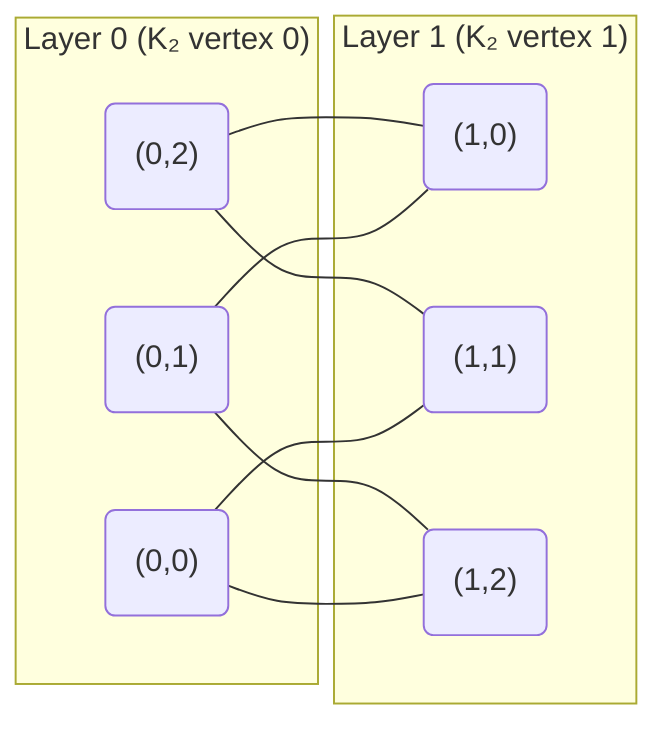
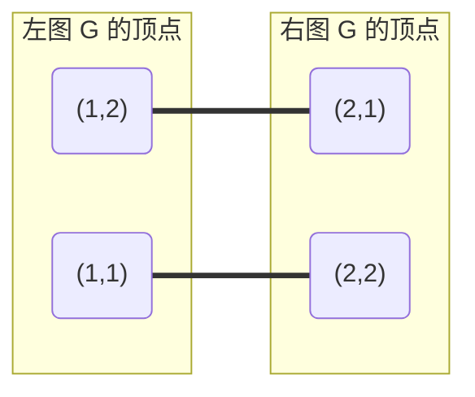
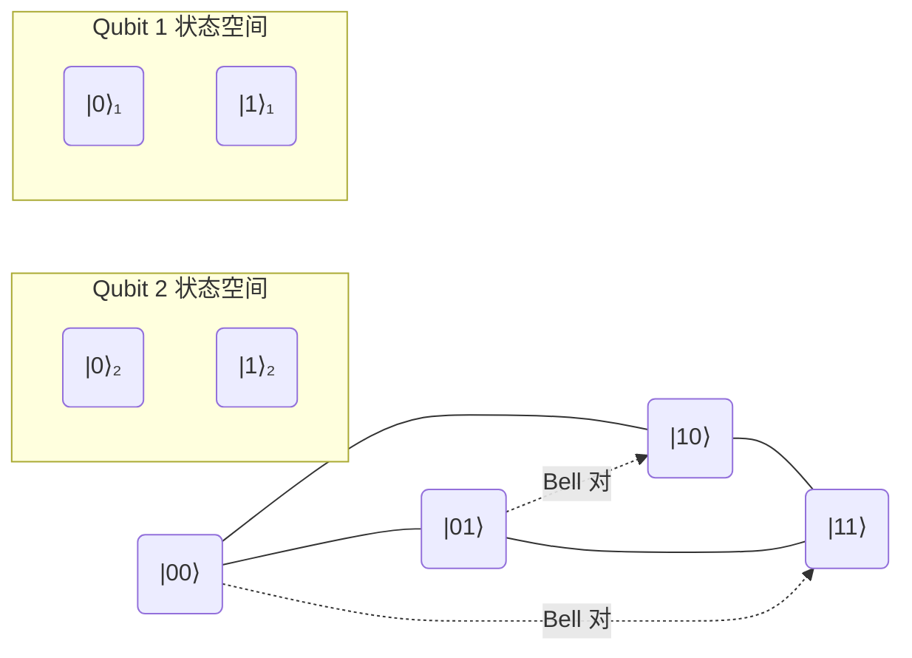

---
tags:
  - Math
  - LinearAlgebra
  - GraphTheory
  - 概念性
  - Idea
title: Tensor Products as Graph Products
created: 2026-07-03
modified: 2026-07-03
aliases:
  - Kronecker Product of Graphs
  - Tensor Product ≅ Graph Product
  - 张量积与图积
---

# Tensor Products as Graph Products

> **Path C 视角 4/??** — 用图论理解张量（Kronecker）积。矩阵的 Kronecker 积 $A \otimes B$ 对应其底层图的某种图积，这种对应为抽象的代数运算赋予了直观的组合与几何意义。

**前置笔记**：[[Every Matrix is a Graph]] | [[Linear_Algebra/Tensor Products]] | [[Graph - Adjacency Matrix & Spectrum]]
**延续笔记**：[[Linear_Algebra/Eigenvalues and Eigenvectors]] | [[Linear_Algebra/Bilinear Forms]] | [[Linear Transformations as Graph Morphisms]]

---

## 1. 核心思想 (The Core Insight)

线性代数中的 Kronecker 积（张量积）$A \otimes B$ 是一个"积构造"：它将两个矩阵的所有元素两两配对生成一个新矩阵。图论中恰好有与之完全平行的构造——图的**张量积（categorical product）** $G \times H$。两者的联系远超类比：

$$
\boxed{A(G) \otimes A(H) \;=\; A(G \times H)}
$$

其中 $A(G)$ 是图 $G$ 的邻接矩阵。这意味着：

| 代数对象 | 图论对象 |
|:---------|:---------|
| Kronecker 积 $A \otimes B$ | 邻接矩阵的张量积 = 图乘积的邻接矩阵 |
| 元素值 $(A \otimes B)_{(i,i'),(j,j')} = A_{ij} \cdot B_{i'j'}$ | 边存在条件：$u \sim u'$ **且** $v \sim v'$ |
| 特征值 $\{\lambda_i \mu_j\}$ | 积图的谱 = 因子图谱的乘积 |
| 特征向量 $\{v_i \otimes w_j\}$ | 积图的特征向量 = 因子特征向量的张量积 |

> [!quote] 关键认识
> **张量积不是抽象的代数操作——它就是图的乘积。** 每个矩阵对应一个图，两个矩阵的张量积对应着这两个图的乘积。这个视角让我们能用组合直觉去理解代数性质。

---

## 2. Kronecker Product of Graphs (图的张量积)

### 2.1 定义

设 $G$ 和 $H$ 是两个图（有向或无向，允许自环）。$G$ 和 $H$ 的**张量积（tensor / categorical product）** $G \times H$ 定义为：

- **顶点集**：$V(G \times H) = V(G) \times V(H)$（Cartesian 积）
- **边集**：$(u, v) \sim (u', v')$ 当且仅当 $u \sim u'$ **且** $v \sim v'$

> 这里 $u \sim u'$ 表示在 $G$ 中存在从 $u$ 到 $u'$ 的边（无向图则对称），$v \sim v'$ 表示在 $H$ 中存在从 $v$ 到 $v'$ 的边。

**邻接矩阵关系**：若 $A$ 是 $G$ 的邻接矩阵，$B$ 是 $H$ 的邻接矩阵，则

$$
A(G \times H) = A \otimes B
$$

其中 $\otimes$ 是 Kronecker 积。这是最直接的代数—图论桥梁：**两个图的张量积的邻接矩阵，就是它们邻接矩阵的 Kronecker 积**。

> 注意：图论中还有其他"积"的概念（Cartesian 积 $G \square H$、强积 $G \boxtimes H$、字典积 $G[H]$），它们各自对应不同的矩阵运算。张量积是唯一对应 Kronecker 积的图积。

### 2.2 示例：$K_2 \times K_3$

$K_2$（两个顶点之间有一条边）与 $K_3$（完全三角）的张量积：

- $V(K_2) = \{0, 1\}$，边 $0 \sim 1$
- $V(K_3) = \{0, 1, 2\}$，所有无序对之间都有边
- $V(K_2 \times K_3) = \{(0,0), (0,1), (0,2), (1,0), (1,1), (1,2)\}$
- 边存在条件：$x \sim x'$ in $K_2$ **且** $y \sim y'$ in $K_3$

由于 $K_2$ 只有 $0 \sim 1$ 一条边，所有边都跨越两个坐标层（0-层和 1-层）。$K_3$ 中 $y \sim y'$ 要求 $y \neq y'$。因此：

- $(0, i) \sim (1, j)$ 当且仅当 $i \neq j$

结果 $K_2 \times K_3$ 是一个 6 顶点 6 边的二分图——实际上是 $K_{3,3}$ 去掉完美匹配（$(i,i)$ 对）后的图，记作 $K_{3,3} \backslash M$。它是 2-正则的：$\deg_{G \times H}((u,v)) = \deg_G(u) \cdot \deg_H(v)$，对于 $K_2 \times K_3$ 每个顶点度数为 $1 \times 2 = 2$。

> $\deg_{G \times H}((u,v)) = \deg_G(u) \cdot \deg_H(v)$，因为边要求邻域中两个坐标**同时**有边。对于 $K_2 \times K_3$：$\deg(0) = 1$，$\deg(1)=2$，所以 $\deg((0,i)) = 1 \times 2 = 2$，$\deg((1,i)) = 1 \times 2 = 2$。确实每个顶点度数为 2。

### 2.3 基本性质

| 性质 | 公式 |
|:----|:----|
| 顶点数 | $|V(G \times H)| = |V(G)| \cdot |V(H)|$ |
| 边数（无向简单图） | $2|E(G)||E(H)|$（无向边计数需注意方向性） |
| 度积性 | $\deg_{G \times H}((u,v)) = \deg_G(u) \cdot \deg_H(v)$ |
| 结合律 | $(G \times H) \times K \cong G \times (H \times K)$ |
| 交换律 | $G \times H \cong H \times G$ |
| 幺元 | 一个顶点的自环图（邻接矩阵 $[1]$）是张量积的幺元 |
| 零元 | 无边图（零邻接矩阵）是零元 |

---

## 3. Tensor Product of Matrices = Graph of Pairs

### 3.1 索引级对应

设 $A \in \mathbb{F}^{m \times n}$ 对应加权二分图 $G_A$（左 $m$ 顶点，右 $n$ 顶点），
$B \in \mathbb{F}^{p \times q}$ 对应加权二分图 $G_B$（左 $p$ 顶点，右 $q$ 顶点）。

Kronecker 积 $A \otimes B \in \mathbb{F}^{mp \times nq}$ 的 $(i,i'),(j,j')$ 元素为：

$$
(A \otimes B)_{(i,i'),(j,j')} = A_{ij} \cdot B_{i'j'}
$$

这恰好对应**对的图（graph of pairs）**：

- 顶点集为 $V(G_A) \times V(G_B)$（左-左、右-右分别配对）
- 从 $(u, u')$ 到 $(v, v')$ 有边当且仅当 $u \to v$ 在 $G_A$ 中 **且** $u' \to v'$ 在 $G_B$ 中
- 边的权重为 $A_{uv} \cdot B_{u'v'}$（两个权重的乘积）

### 3.2 具体数值示例

取两个 $2 \times 2$ 邻接矩阵：

$$
A = \begin{pmatrix} 0 & 1 \\ 1 & 0 \end{pmatrix} \quad (\text{无向 } K_2)
\qquad
B = \begin{pmatrix} 0 & 1 \\ 1 & 0 \end{pmatrix} \quad (\text{无向 } K_2)
$$

Kronecker 积：

$$
A \otimes B =
\begin{pmatrix}
0 \cdot B & 1 \cdot B \\
1 \cdot B & 0 \cdot B
\end{pmatrix}
=
\begin{pmatrix}
0 & 0 & 0 & 1 \\
0 & 0 & 1 & 0 \\
0 & 1 & 0 & 0 \\
1 & 0 & 0 & 0
\end{pmatrix}
$$

该矩阵的 4 个顶点 $(1,1), (1,2), (2,1), (2,2)$ 形成**两条不相交的边**（匹配 $2K_2$）：

> 边 $(1,1)\!-\!(2,2)$ 存在是因为 $1 \sim 2$ in $K_2$ **且** $1 \sim 2$ in $K_2$；边 $(1,2)\!-\!(2,1)$ 存在是因为 $1 \sim 2$ in $K_2$ **且** $2 \sim 1$ in $K_2$。

### 3.3 带权情形

当矩阵的元素不是 0/1 时，乘积图变为**带权图**。例如：

$$
A = \begin{pmatrix} 0 & 1 \\ 1 & 0 \end{pmatrix},\;
B = \begin{pmatrix} 1 & 2 \\ 3 & 4 \end{pmatrix}
\;\Longrightarrow\;
A \otimes B =
\begin{pmatrix}
0 & 0 & 1 & 2 \\
0 & 0 & 3 & 4 \\
1 & 2 & 0 & 0 \\
3 & 4 & 0 & 0
\end{pmatrix}
$$

这个 4 顶点有向带权图有两个分区：$\{(1,1), (1,2)\}$ 和 $\{(2,1), (2,2)\}$。从 $(1,i')$ 到 $(2,j')$ 的边权重为 $B_{i'j'}$，从 $(2,i')$ 到 $(1,j')$ 的边权重也为 $B_{i'j'}$（因为 $A$ 对称）。当 $B$ 不对称时，正向与反向权重可能不同，得到一个**有向带权二分图**。

### 3.4 高维情形

对 $n \times n$ 方阵 $A$（对应有向图 $G$ 的邻接矩阵）和 $m \times m$ 方阵 $B$（对应有向图 $H$ 的邻接矩阵）：

$$
A \otimes B = A(G \times H)
$$

其中 $G \times H$ 的顶点集是 $n \times m$ 个有序对。**非零模式**（即乘积图中边的有无）完全由 $A$ 和 $B$ 的非零模式决定：

$$
(A \otimes B)_{(i,i'),(j,j')} \neq 0 \iff A_{ij} \neq 0 \;\land\; B_{i'j'} \neq 0
$$

这正是组合意义上的"两个关系同时成立"——用图的语言说，就是"两条边同时在两条路径上"。

---

## 4. Spectral Properties of Tensor Products (谱性质)

张量积与图积的对应在谱理论中展现出最优美的性质：**积图的谱就是因子图谱的笛卡尔积**。

### 4.1 特征值与特征向量

**定理**：设 $A \in \mathbb{F}^{n \times n}$ 有特征值 $\lambda_1, \dots, \lambda_n$（含重数），$B \in \mathbb{F}^{m \times m}$ 有特征值 $\mu_1, \dots, \mu_m$。则 $A \otimes B$ 的特征值为：

$$
\sigma(A \otimes B) = \{\lambda_i \mu_j \mid i = 1,\dots,n,\; j = 1,\dots,m\}
$$

对应的特征向量为：

$$
v_i \otimes w_j
$$

其中 $v_i$ 是 $A$ 的 $\lambda_i$-特征向量，$w_j$ 是 $B$ 的 $\mu_j$-特征向量。

### 4.2 图论意义

在图论中，这意味着：

> **$G \times H$ 的谱（邻接矩阵的特征值集合）等于 $G$ 的谱和 $H$ 的谱的逐对乘积。**

这是一个极其强大的工具：我们可以通过分析小图的谱来推导大图的谱。

### 4.3 示例：$K_2 \times K_3$ 的谱

| 图 | 邻接矩阵特征值（代数重数） |
|:--|:--------------------------|
| $K_2$ | $1,\; -1$ |
| $K_3$ | $2,\; -1,\; -1$ |
| $K_2 \times K_3$ | $1\cdot 2 = 2$ (1), $1\cdot(-1) = -1$ (2), $(-1)\cdot 2 = -2$ (1), $(-1)\cdot(-1) = 1$ (2) |

所以 $K_2 \times K_3$ 的谱（按重数列出）为：

$$
\sigma(K_2 \times K_3) = \{2,\; 1,\; 1,\; -1,\; -1,\; -2\}
$$

验证：$K_2 \times K_3$ 的邻接矩阵为 $A(K_2) \otimes A(K_3)$。$A(K_2) = \begin{pmatrix}0&1\\1&0\end{pmatrix}$，$A(K_3) = \begin{pmatrix}0&1&1\\1&0&1\\1&1&0\end{pmatrix}$。Kronecker 积为 $6 \times 6$ 矩阵，其特征多项式为 $(\lambda - 2)(\lambda - 1)^2(\lambda + 1)^2(\lambda + 2)$。✓

### 4.4 正则图情形

若 $G$ 是 $d_1$-正则的，$H$ 是 $d_2$-正则的，则 $G \times H$ 是 $d_1 d_2$-正则的。

**证明**：正则图的邻接矩阵有全 1 向量 $\mathbf{1}$ 作为特征向量，对应特征值 $d_1$ 和 $d_2$。则 $\mathbf{1} \otimes \mathbf{1}$ 是 $A(G \times H)$ 的特征向量，对应特征值 $d_1 d_2$，且 $G \times H$ 中每个顶点的度数恰好为 $d_1 d_2$。□

| 图 | 度数 | 谱半径 |
|:--|:----|:------|
| $G$ | $d_G$ | $\lambda_{\max}(G) = d_G$ |
| $H$ | $d_H$ | $\lambda_{\max}(H) = d_H$ |
| $G \times H$ | $d_G \cdot d_H$ | $\lambda_{\max}(G \times H) = d_G \cdot d_H$ |

### 4.5 谱分解

若 $A = U \Lambda U^{-1}$ 和 $B = V M V^{-1}$ 可对角化，则：

$$
A \otimes B = (U \otimes V)(\Lambda \otimes M)(U \otimes V)^{-1}
$$

其中 $U \otimes V$ 是 $U$ 和 $V$ 的 Kronecker 积（也是可逆矩阵），$\Lambda \otimes M$ 是对角矩阵（其对角元为 $\lambda_i \mu_j$）。这提供了积图特征分解的封闭形式。

---

## 5. The Linear Algebra-Graph Dictionary (线性代数-图论词典)

以下表格总结了线性代数概念与图论概念之间的完整对应关系。它将 [[Every Matrix is a Graph]] 中的基础对应扩展到张量积的语境中。

### 5.1 基础对应

| 线性代数 | 图论 |
|:---------|:-----|
| 域 $\mathbb{F}$ 上的向量空间 $V$ | 顶点的函数空间 $\mathbb{F}^V$ |
| 线性变换 $T: V \to W$ | 加权二分图（$V$ 到 $W$ 的边） |
| 矩阵 $A \in \mathbb{F}^{m \times n}$ | 加权二分图（$m$ 行 $\leftrightarrow$ $n$ 列） |
| 方阵 $A \in \mathbb{F}^{n \times n}$ | 加权有向图 / 无向图（$n$ 个顶点） |
| 矩阵乘法 $AB$ | 长度-2 路径的权重和 |
| Kronecker 积 $A \otimes B$ | 图的张量积 $G_A \times G_B$ |

### 5.2 张量积语境下的词典

| 张量积概念 | 图积概念 |
|:-----------|:---------|
| $V \otimes W$（向量空间的张量积） | 函数空间 $\mathbb{F}^{V \times W}$（顶点对上的函数） |
| $v \otimes w$（纯张量） | 分离函数 $f(v) \cdot g(w)$ |
| $\dim(V \otimes W) = \dim V \cdot \dim W$ | $|V(G \times H)| = |V(G)| \cdot |V(H)|$ |
| $A \otimes B$ | $G_A \times G_B$ 的邻接矩阵 |
| $\sigma(A \otimes B) = \{\lambda_i \mu_j\}$ | $\sigma(G \times H) = \sigma(G) \cdot \sigma(H)$ |
| $(A \otimes B)^k = A^k \otimes B^k$（当 $A,B$ 方阵） | 积图上的行走 = 因子图上行走的配对 |
| $\operatorname{tr}(A \otimes B) = \operatorname{tr}(A) \cdot \operatorname{tr}(B)$ | 积图上的自环计数 = 因子图自环计数之积 |
| $\det(A \otimes B) = \det(A)^m \det(B)^n$（$A_{n\times n}, B_{m\times m}$） | 积图的某种不变量 |
| $(A \otimes B)^\top = A^\top \otimes B^\top$ | 积图的边方向反转 = 因子图边方向反转的积 |
| $\operatorname{rank}(A \otimes B) = \operatorname{rank}(A) \cdot \operatorname{rank}(B)$ | 积图秩不变量 |

### 5.3 特殊矩阵在词典中的位置

| 矩阵类型 | 图论解释 | 张量积意义 |
|:---------|:---------|:----------|
| 单位矩阵 $I_n$ | $n$ 个自环（每个顶点到自身） | 张量积的幺元：$I \otimes A = A \otimes I = \operatorname{diag}(A)$ 的推广 |
| 全 1 矩阵 $J_{m \times n}$ | 完全二分图 $K_{m,n}$（所有边权重 1） | $J \otimes J$ 仍是完全二分图 |
| 邻接矩阵（0/1 对称） | 无向简单图 | 乘积仍是 0/1 矩阵，表示积图的边 |
| 拉普拉斯矩阵 $L$ | 拉普拉斯算子离散化 | $L(G \times H) \neq L(G) \otimes L(H)$（注意：拉普拉斯张量积需用另外的公式） |

> [!warning] 拉普拉斯矩阵的例外
> 邻接矩阵的张量积 = 积图的邻接矩阵，但**拉普拉斯矩阵**的张量积并不等于积图的拉普拉斯矩阵。对于 Cartesian 积 $G \square H$ 有 $L(G \square H) = L(G) \otimes I + I \otimes L(H)$，但张量积的拉普拉斯公式更复杂。详见 [[Graph - Laplacian & Spectral Clustering]]。

---

## 6. Mixed Product Property (混合积性质)

### 6.1 代数形式

Kronecker 积的核心恒等式是**混合积性质**：

$$
(A \otimes B)(C \otimes D) = (AC) \otimes (BD)
$$

前提是矩阵维度匹配：$A \in \mathbb{F}^{m \times n}$，$C \in \mathbb{F}^{n \times p}$，$B \in \mathbb{F}^{q \times r}$，$D \in \mathbb{F}^{r \times s}$。

### 6.2 图论解读

在图论语言中，这个恒等式说的是：

> **积图上的组成关系 = 因子图上的组成的积**

具体来说：

- $A \otimes B$ 是 $G_A \times G_B$ 的邻接矩阵
- $C \otimes D$ 是 $G_C \times G_D$ 的邻接矩阵
- $(A \otimes B)(C \otimes D)$ 编码了从 $G_A \times G_B$ 到 $G_C \times G_D$ 的长度-2 路径
- $(AC) \otimes (BD)$ 编码了 $G_{AC} \times G_{BD}$——即两个因子图上的组成果再取积

**组合解释**：走一条积图的组合路径，等价于在两个因子图上分别走各自的路径，然后取配对：

$$
\begin{aligned}
((A \otimes B)(C \otimes D))_{(i,i'),(j,j')}
&= \sum_{(k,k')} (A \otimes B)_{(i,i'),(k,k')} (C \otimes D)_{(k,k'),(j,j')} \\
&= \sum_k \sum_{k'} A_{ik} B_{i'k'} C_{kj} D_{k'j'} \\
&= \left(\sum_k A_{ik} C_{kj}\right) \cdot \left(\sum_{k'} B_{i'k'} D_{k'j'}\right) \\
&= (AC)_{ij} \cdot (BD)_{i'j'}
\end{aligned}
$$

### 6.3 应用：将大矩阵分解为小图乘积

混合积性质的一个关键应用是**将大矩阵分解为小图的 Kronecker 积**。若：

$$
A = A_1 \otimes A_2 \otimes \cdots \otimes A_k
$$

且 $A_i$ 是 $n_i \times n_i$ 的稀疏矩阵（对应稀疏图 $G_i$），则 $A$ 是 $N \times N$ 矩阵，$N = \prod n_i$，但其结构完全由 $k$ 个小图决定。

这种分解可以极大地加速矩阵-向量乘积：

$$
(A_1 \otimes \cdots \otimes A_k) \cdot \operatorname{vec}(X) \;=\; \operatorname{vec}\left( (A_k \otimes \cdots \otimes A_1) \cdot X \right)
$$

利用这个公式，矩阵-向量乘积**不需要显式构造** $N \times N$ 的大矩阵，而是可以在 $k$ 个小矩阵上依次操作（复杂度 $O(k \cdot N \cdot \max n_i)$ 而非 $O(N^2)$）。

> [!example] 量子电路模拟
> 在量子计算中，$n$ 量子比特的量子门作用在 $\mathbb{C}^{2^n}$ 上，其矩阵表示为 $2^n \times 2^n$。但每个多量子比特门往往可以分解为单量子比特门和两量子比特门的 Kronecker 积。混合积性质使得电路模拟可以在 $O(2^n \cdot n)$ 时间内完成，而不是 $O(2^{2n})$。

---

## 7. Connection to Quantum Mechanics (与量子力学的联系)

### 7.1 双量子比特系统

两个量子比特的联合状态空间是 $\mathbb{C}^2 \otimes \mathbb{C}^2$，其标准计算基为：

$$
\{|00\rangle, |01\rangle, |10\rangle, |11\rangle\}
$$

这四个基向量恰好对应于 $K_2 \times K_2$ 的四个顶点（其中 $K_2$ 是单个量子比特的状态图：顶点 $|0\rangle$ 和 $|1\rangle$ 之间的边表示它们可以被量子门相互转换）：

该图是 $K_2 \times K_2$：四个顶点，四条边形成 4-循环 $C_4$。**两个单量子比特空间的张量积对应乘积图**。

### 7.2 Bell 态与图论

四个 Bell 态（最大纠缠态）为：

$$
\begin{aligned}
|\Phi^+\rangle &= \frac{1}{\sqrt{2}}(|00\rangle + |11\rangle) \\
|\Phi^-\rangle &= \frac{1}{\sqrt{2}}(|00\rangle - |11\rangle) \\
|\Psi^+\rangle &= \frac{1}{\sqrt{2}}(|01\rangle + |10\rangle) \\
|\Psi^-\rangle &= \frac{1}{\sqrt{2}}(|01\rangle - |10\rangle)
\end{aligned}
$$

在图论视角下：

- **可分离态**（product state）对应 $K_2 \times K_2$ 中的一个顶点（单一基向量）或一条连接同一"层"的边；它可以用 $|a\rangle \otimes |b\rangle$ 表示
- **Bell 态 $|\Phi^+\rangle$** 对应图中的"反对角线"配对：$|00\rangle$ 与 $|11\rangle$。这在图上是一条跨越两个坐标层的边
- **纠缠态**不是可分离的——在图论语言中，它们对应**非分离的边集**，即不能写成 $X \times Y$（$X \subseteq V(G), Y \subseteq V(H)$）的顶点子集

> 具体来说，Bell 态 $|\Phi^+\rangle$ 的支撑集 $\{|00\rangle, |11\rangle\}$ **不能**写成 $A \times B$ 的形式（其中 $A \subseteq \{0,1\}$ 是第一量子比特的状态子集，$B \subseteq \{0,1\}$ 是第二量子比特的状态子集）。任何形如 $A \times B$ 的集合如果不是空集或单点集，必然包含至少两个第一坐标相同的元素——这正是纠缠的图论特征。

### 7.3 纠缠的图论刻画

将量子态 $|\psi\rangle \in \mathbb{C}^d \otimes \mathbb{C}^d$ 视为其在计算基上的支撑集图（support graph）$G_\psi$，其中：

- 顶点集：$[d] \times [d]$
- 边集：$(i,j)$ 是顶点（每个基向量 $|ij\rangle$ 是一个顶点）
- 权重：$\psi_{ij}$（态在基上的系数）

则 $|\psi\rangle$ 是**可分离态**当且仅当 $G_\psi$ 的支撑集（非零顶点集）是**矩形积** $A \times B$，且系数分解为 $\psi_{ij} = a_i b_j$。

纠缠态则对应**不可分解的支撑模式**——这正是张量积/图积框架的核心组合洞察。

### 7.4 量子门与图同态

量子门 $U$ 作用在 $n$ 量子比特系统上，对应邻接矩阵 $U \in U(2^n)$。若 $U$ 可以分解为 Kronecker 积：

$$
U = U_1 \otimes U_2 \otimes \cdots \otimes U_n
$$

则该量子门作用在每个量子比特上是**独立的**（不产生纠缠）。在图的语言中，这对应于**积图的自同构**：$U$ 在 $K_2^{\times n}$ 上诱导出一个图同态。

反之，**纠缠门**（如 CNOT）不能分解为 Kronecker 积——它们在乘积图上的作用模式是非局部的。

---

## 相关笔记

- **[[Every Matrix is a Graph]]** — 矩阵-图二元性的基础框架
- **[[Linear_Algebra/Tensor Products]]** — 张量积的代数定义与性质
- **[[Linear_Algebra/Eigenvalues and Eigenvectors]]** — 特征值与特征向量
- **[[Linear_Algebra/Bilinear Forms]]** — 双线性形式与二次型
- **[[Graph - Adjacency Matrix & Spectrum]]** — 邻接矩阵与图谱理论
- **[[Linear Transformations as Graph Morphisms]]** — 线性变换作为图同态
- **[[Graph - Laplacian & Spectral Clustering]]** — 拉普拉斯矩阵（含张量积的特殊例外）

---

## 延伸阅读

### 核心文献

1. **Weichsel, P. M. (1962).** "The Kronecker Product of Graphs." *Proceedings of the American Mathematical Society*, 13(1), 47–52. — 首次系统定义图的 Kronecker 积（张量积）的论文。
2. **Imrich, W. & Klavžar, S. (2000).** *Product Graphs: Structure and Recognition.* Wiley. — 图积理论的权威专著，涵盖张量积、Cartesian 积、强积等。
3. **Horn, R. A. & Johnson, C. R. (1991).** *Topics in Matrix Analysis.* Cambridge University Press. — 第 4 章系统讨论 Kronecker 积及其谱性质。

### 张量积与图论

4. **Cvetković, D., Rowlinson, P. & Simić, S. (2010).** *An Introduction to the Theory of Graph Spectra.* Cambridge University Press. — 第 7 章涉及图积的谱。
5. **Hammack, R., Imrich, W. & Klavžar, S. (2011).** *Handbook of Product Graphs* (2nd ed.). CRC Press. — 图积理论的最新综合参考。
6. **Godsil, C. & Royle, G. (2001).** *Algebraic Graph Theory.* Springer. — 第 8-13 章涵盖谱理论，多处涉及积图。

### 量子信息视角

7. **Nielsen, M. A. & Chuang, I. L. (2010).** *Quantum Computation and Quantum Information* (10th ed.). Cambridge University Press. — 第 1-2 章介绍量子比特与张量积结构。
8. **Horodecki, R., Horodecki, P., Horodecki, M. & Horodecki, K. (2009).** "Quantum Entanglement." *Reviews of Modern Physics*, 81(2), 865. — 纠缠理论的全面综述，与张量积结构紧密相关。

### 计算应用

9. **Van Loan, C. F. (2000).** "The Ubiquitous Kronecker Product." *Journal of Computational and Applied Mathematics*, 123(1-2), 85–100. — Kronecker 积在科学计算中的广泛应用综述。
10. **Pitsianis, N. P. (1997).** "The Kronecker Product in Approximation and Fast Transform Generation." Ph.D. Thesis, Cornell University. — Kronecker 积分解的算法与应用。

---

> **"张量积不是抽象的代数操作——它就是图的乘积。"**

---
