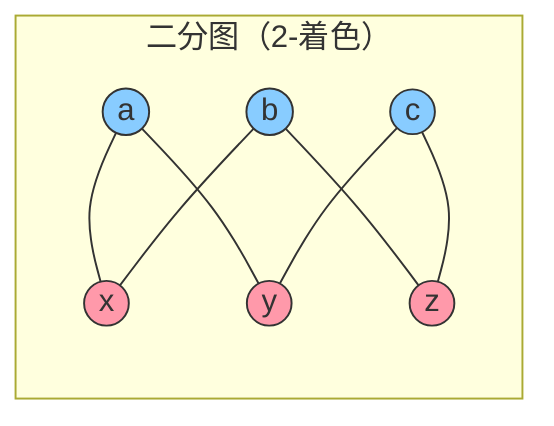
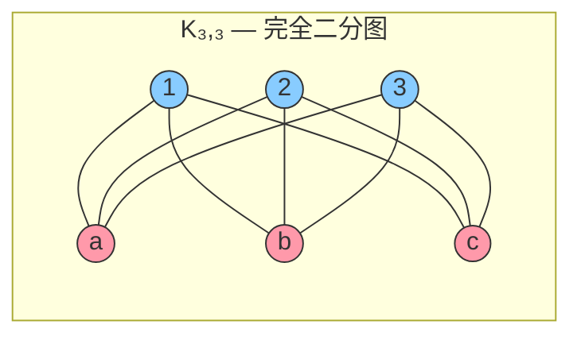
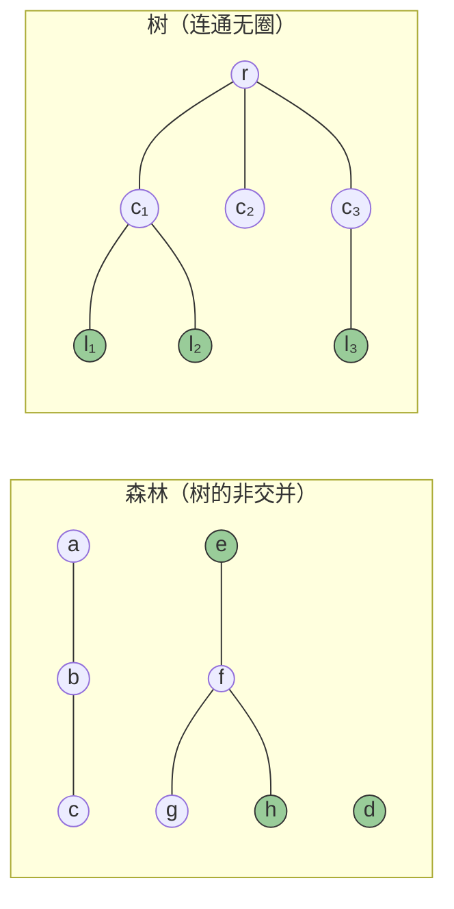
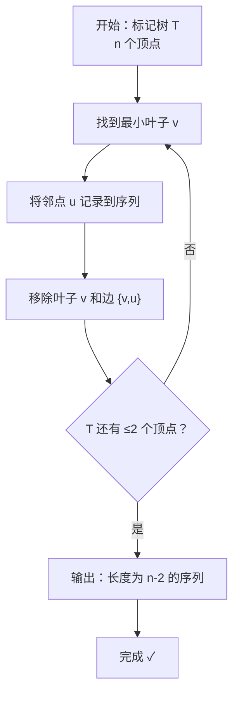
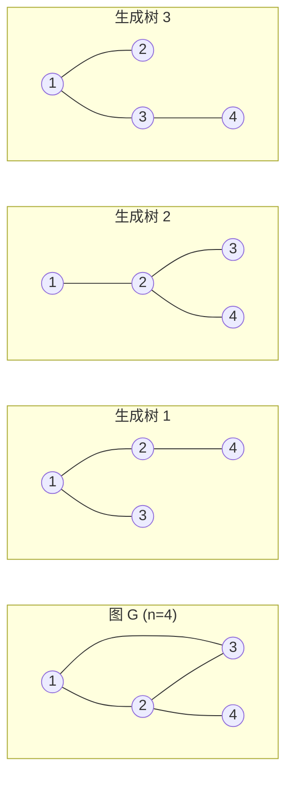
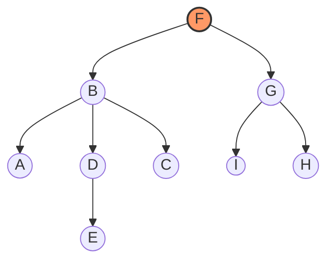
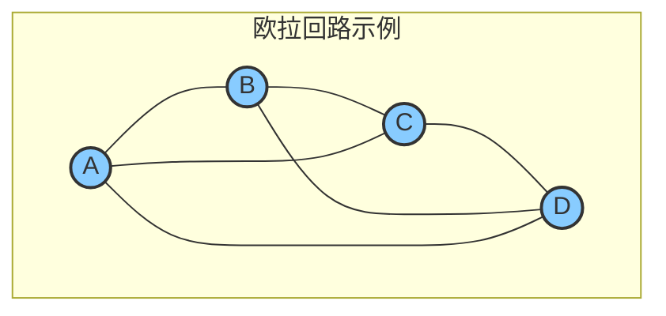
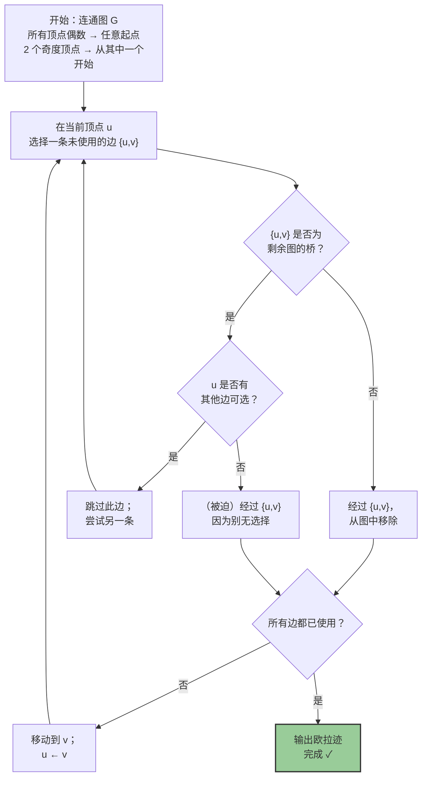

---
tags:
  - Math
  - GraphTheory
  - 定义性
  - 定理性
title: 树、二分图与欧拉图 (Trees, Bipartite & Eulerian Graphs)
created: 2026-07-03
modified:
---

# 树、二分图与欧拉图 (Trees, Bipartite & Eulerian Graphs)

> [!info] 来源
> Christopher Griffin, *Applied Graph Theory* (2023), 第 4 章：树、二分图与欧拉图 (Trees, Bipartite and Eulerian Graphs)

**前置知识 (Prerequisites)**
- [[Definitions]] — 基本术语（顶点、边、度、途径）
- [[Walks, Cycles & Connectivity]] — 路径、圈、连通性（占位符）
- [[Adjacency Matrix & Spectrum]] — 矩阵表示（占位符）

---

## 1. 二分图 (Bipartite Graphs)

### 1.1 定义 (Definition)

**定义 4.1 (二分图).** 图 $G = (V, E)$ 称为**二分图 (bipartite graph)**，如果其顶点集可以划分为两个**非空**子集 $V_1$ 和 $V_2$，使得每条边都连接 $V_1$ 中的一个顶点和 $V_2$ 中的一个顶点。等价地说，$V_1$ 内部和 $V_2$ 内部都没有边。

$$V = V_1 \cup V_2,\quad V_1 \cap V_2 = \varnothing,\quad E \subseteq \{\,\{v_1, v_2\} \mid v_1 \in V_1,\; v_2 \in V_2\,\}$$

有序对 $(V_1, V_2)$ 称为 $G$ 的一个**二分划分 (bipartition)**。

> [!example] 示例
> - 任何**路径 (path)** $P_n$（$n \ge 2$）都是二分图：交替着色即可。
> - 任何**偶长度圈 (even cycle)** $C_{2k}$ 都是二分图：交替着色。
> - 任何**树 (tree)** 都是二分图（见 §2）。
> - 任何**超立方体 (hypercube)** $Q_n$ 都是二分图（按二进制表示的奇偶性划分）。



> 上图中 $V_1 = \{a, b, c\}$（蓝色），$V_2 = \{x, y, z\}$（粉色）。每条边都跨越两个颜色类；没有任何边完全位于一个颜色类内部。

### 1.2 刻画——无奇圈 (Characterization — No Odd Cycles)

> [!abstract] 定理 4.2 (二分图刻画定理)
> 图 $G$ 是**二分图**当且仅当它**不包含奇长度圈 (odd cycle)**。

*证明概要。*

- **(⇒)** 假设 $G$ 是二分图，划分 $(V_1, V_2)$。任何途径 (walk) 都会交替经过 $V_1$ 和 $V_2$。要回到起点，需要偶数次边遍历。因此每个圈的长度必定是偶数。

- **(⇐)** 假设 $G$ 没有奇圈。取一个连通分支 (connected component) 和一个根顶点 $r$。将 $r$ 归入 $V_1$。对每个顶点 $v$，定义其**距离 (distance)** $d(r, v)$（从 $r$ 到 $v$ 的最短路径长度）。若 $d(r, v)$ 为偶数则归入 $V_1$，为奇数则归入 $V_2$。如果存在边 $\{u, v\}$ 的两个端点属于同一部分，则 $d(r, u)$ 和 $d(r, v)$ 的奇偶性相同，这将通过 $u$ 和 $v$ 产生一个奇圈。矛盾。因此 $G$ 在此奇偶划分下是二分图。对每个连通分支均适用。

> [!tip] 算法要点
> (⇐) 的证明给出了测试二分性的**线性时间算法 (linear-time algorithm)**：运行 BFS/DFS，按深度奇偶性分配颜色，检查是否有边连接两个同色顶点。

---

### 1.3 完全二分图 $K_{m,n}$ (Complete Bipartite Graph)

**定义 4.3 (完全二分图).** **完全二分图 (complete bipartite graph)** $K_{m,n}$ 具有二分划分 $(V_1, V_2)$，其中 $|V_1| = m$，$|V_2| = n$，且包含**所有**可能的跨部边：

$$E = \bigl\{\,\{u, v\} \mid u \in V_1,\; v \in V_2 \,\bigr\}$$

$K_{m,n}$ 的性质：
- **顶点数**：$m + n$
- **边数**：$m \cdot n$
- **正则性 (Regularity)**：$K_{m,n}$ 是正则图当且仅当 $m = n$（此时为 $n$-正则）
- **可平面性 (Planarity)**：$K_{3,3}$ 是**不可平面 (non-planar)** 的（Kuratowski 定理）
- **哈密顿性 (Hamiltonicity)**：$K_{m,n}$ 是哈密顿图 (Hamiltonian graph) 当且仅当 $m = n \ge 2$



> 左侧每个顶点（$|V_1| = 3$）连接到右侧每个顶点（$|V_2| = 3$），共 $3 \times 3 = 9$ 条边。$K_{3,3}$ 是不可平面图的经典例子。

---

### 1.4 König 定理 (König's Theorem)

> [!abstract] 定理 4.4 (König 定理, 1931)
> 在二分图 $G$ 中，**最大匹配 (maximum matching)** 的大小等于**最小顶点覆盖 (minimum vertex cover)** 的大小：
> $$\nu(G) = \tau(G)$$
> 其中 $\nu(G)$ 是匹配数（最大不相交边数），$\tau(G)$ 是顶点覆盖数（覆盖所有边所需的最少顶点数）。

*证明概要。* 令 $M$ 为最大匹配。定义**交替路径可达 (alternating-path-accessible)** 的顶点集：从左侧的未匹配顶点出发，沿交替路径（边交替地不属于 $M$、属于 $M$）行走。所有由此类路径可达的左侧顶点，与**不可达**的右侧顶点一起，构成大小为 $|M|$ 的顶点覆盖。任何顶点覆盖至少要与任何匹配一样大，因此等式成立。

> [!example] 应用：二分图最小顶点覆盖
> König 定理将在一般图中属于 NP-困难的两个问题（最大匹配、最小顶点覆盖）转化为在二分图上可在多项式时间内求解的问题。这是**二分图边覆盖算法 (bipartite edge covering algorithms)** 的基础。

---

### 1.5 二分图的应用 (Applications of Bipartite Graphs)

| 应用领域 | 二分图模型 | 描述 |
|:---------|:-----------|:------|
| **指派问题 (Assignment problems)** | 工人 $W$ ←→ 工作 $J$ | 边 $w_j$ 表示工人 $w$ 能做工作 $j$；匹配 = 指派方案 |
| **推荐系统 (Recommendation systems)** | 用户 $U$ ←→ 物品 $I$ | 边 $u_i$ 表示用户 $u$ 与物品 $i$ 有交互；二分投影 = 协同过滤 |
| **密码子-氨基酸映射 (Codon–amino acid mapping)** | 密码子 ←→ 氨基酸 | 遗传密码是一种多对一的二分映射 |
| **二分网络投影 (Bipartite network projection)** | 作者 ←→ 论文 | 合作者网络从二分链接中提取而来 |
| **电路（节点-边）(Electric circuits)** | 节点 ←→ 边 | 关联矩阵 (incidence matrix) 本质上是二分的 |

---

## 2. 树 (Trees)

### 2.1 定义 (Definitions)

**定义 4.5 (森林、树、叶子).**
- **森林 (forest)** 是**无圈 (acyclic)** 图（即不含任何圈的图）。
- **树 (tree)** 是**连通 (connected)** 的无圈图。
- **叶子 (leaf)**（或**悬挂顶点 (pendant vertex)**）是度为 1 的顶点。



> 叶子以绿色高亮显示。左侧图是一个森林，包含两个分支（均为树）。右侧图是一棵以 $r$ 为根、叶子为 $l_1, l_2, l_3$ 的单棵树。

---

### 2.2 树的六种刻画——定理 4.5 (Characterizations of Trees)

> [!abstract] 定理 4.5 (TFAE — 树的等价刻画)
> 设 $G = (V, E)$ 是一个 $n$ 个顶点的图（$n \ge 1$）。以下陈述**等价**：
>
> 1. $G$ 是**树**（连通且无圈）。
> 2. $G$ **无圈**且 $|E| = n - 1$。
> 3. $G$ **连通**且 $|E| = n - 1$。
> 4. $G$ **连通**且每条边都是**桥 (bridge)**（即删除任意一条边都会使图不连通）。
> 5. $G$ **极小连通 (minimally connected)**：$G$ 连通但 $G - e$ 对每个 $e \in E$ 都不连通。
> 6. $G$ **极大无圈 (maximally acyclic)**：$G$ 无圈，但添加任意一条连接非邻接顶点的新边都会恰好产生一个圈。
> 7. 对任意两个顶点 $u, v \in V$，$u$ 和 $v$ 之间存在**唯一**的简单路径 (simple path)。

*证明概览（循环推导）。*

- **(1 ⇒ 2)**：对 $n$ 归纳。$n = 1$ 时 $|E| = 0 = 1-1$。对 $n > 1$，树中存在叶子（见引理 2.3）。移除该叶子，得到一棵 $n-1$ 个顶点、$n-2$ 条边的树。加回叶子：$|E| = (n-2) + 1 = n-1$。
- **(2 ⇒ 3)**：若 $G$ 无圈且有 $n-1$ 条边但不连通，则每个分支均无圈，因而都是树，有 $n_i$ 个顶点和 $n_i - 1$ 条边。求和得 $|E| = \sum (n_i - 1) = n - k$，其中 $k$ 是分支数。当 $k > 1$ 时 $|E| < n - 1$，矛盾。因此 $k = 1$，即 $G$ 连通。
- **(3 ⇒ 4)**：连通且 $n-1$ 条边。删除一条边后得到 $n$ 个顶点和 $n-2$ 条边，不可能保持连通（否则 $n$ 个顶点的树会有 $n-2$ 条边）。所以每条边都是桥。
- **(4 ⇒ 5)**：由定义直接可得。
- **(5 ⇒ 6)**：极小连通意味着无圈（若存在圈，删除圈中任意一条边不会破坏连通性）。添加任意一条边都会产生圈，因为 $G$ 已有 $n-1$ 条边且连通；新边在生成树 (spanning tree) 的基础上添加了一条额外的边。
- **(6 ⇒ 7)**：若存在两条不同的 $u$-$v$ 路径，它们的对称差 (symmetric difference) 会包含一个圈，与无圈性矛盾。
- **(7 ⇒ 1)**：唯一路径蕴含连通性。若存在圈，圈上任意两点之间会有两条不同路径，矛盾。

> [!note] 助记
> 六种（常用）刻画可记忆为：
> - **(1)** 定义
> - **(2, 3)** 边数刻画
> - **(4, 5)** 极小连通性 / 桥
> - **(6)** 极大无圈性
> - **(7)** 唯一路径性质

---

### 2.3 树的性质 (Properties of Trees)

**引理 2.3 (Griffin 引理 4.6).** 每棵具有 $n \ge 2$ 个顶点的树 $T = (V, E)$ 都**至少有 2 个叶子**。

> *证明。* 取 $T$ 中的一条极长路径 $P = v_1 v_2 \dots v_k$。由于 $n \ge 2$，故 $k \ge 2$。端点 $v_1$ 在 $P$ 外不能有邻点（由极大性），在 $P$ 内除了 $v_2$ 外也不能有邻点（否则会产生圈）。因此 $\deg(v_1) = 1$；同理 $\deg(v_k) = 1$。所以两个端点都是叶子。

**推论 4.7.** 若 $T$ 是具有 $n$ 个顶点的树且 $\Delta(T) \ge k$，则 $T$ 至少有 $k$ 个叶子。

**命题 4.8 (边添加).** 在树中添加一条边恰好产生一个圈（该边相对于树的基本圈 (fundamental cycle)）。

**命题 4.9 (树的中心).** 树的**中心 (center)**（使离心率 (eccentricity) 最小的顶点集）由单个顶点或两个相邻顶点组成。可通过反复剥除叶子直到只剩一个或两个顶点来找到。

| 性质 | 公式 | 说明 |
|:-----|:-----|:------|
| 边数 | $n - 1$ | 归纳法证明的基础 |
| 叶子数 | $\ge 2$（若 $n \ge 2$） | 路径 $P_n$ 取到等号 |
| 度数和 | $2(n-1)$ | 由握手引理 (Handshaking Lemma) |
| 奇度顶点数 | 偶数 | 握手引理的推论 |
| 色数 (Chromatic number) | $2$ | 树是二分图 |
| 围长 (Girth) | $\infty$ | 树无圈 |

---

### 2.4 Cayley 公式与 Prüfer 序列 (Cayley's Formula and Prüfer Sequences)

> [!abstract] 定理 4.10 (Cayley 公式, 1889)
> 在 $n$ 个标记顶点上的不同标记树 (labeled tree) 的数量为：
> $$n^{n-2}$$

**示例：**
- $n = 1$：$1^{-1} = 1$（平凡树）
- $n = 2$：$2^{0} = 1$（单条边）
- $n = 3$：$3^{1} = 3$（$K_3$ 去掉任意一条边；三种选择）
- $n = 4$：$4^{2} = 16$
- $n = 5$：$5^{3} = 125$

#### Prüfer 序列（编码）

**Prüfer 序列 (Prüfer sequence)** 是 $\{1, 2, \dots, n\}$ 上的标记树与长度为 $n-2$ 的 $\{1, 2, \dots, n\}$ 序列之间的一个双射 (bijection)。

**编码（树 → 序列）：**

1. 设 $T$ 是 $\{1, \dots, n\}$ 上的标记树。
2. 当 $T$ 还有多于 2 个顶点时：
   - 找到标签**最小**的叶子 $v$。
   - 将其邻点 $u$ 记录到序列中。
   - 从 $T$ 中移除 $v$ 和边 $\{v, u\}$。

得到的长度为 $n-2$ 的序列称为 $T$ 的 **Prüfer 码 (Prüfer code)**。



**解码（序列 → 树）：**

1. 设 $P$ 为长度为 $n-2$ 的 Prüfer 序列。
2. 计算每个顶点 $i$ 的**度**：$\deg(i) = 1 + (\text{$i$ 在 $P$ 中出现的次数})$。
3. 重复直到 $P$ 为空：
   - 找到 $\deg(v) = 1$ 的最小顶点 $v$。
   - 将 $v$ 连接到 $P$ 的第一个元素 $u$。
   - 减少 $\deg(v)$ 和 $\deg(u)$；从 $P$ 中移除 $u$。
4. 将最后两个度为 1 的顶点连接起来。

> [!example] 示例：$n = 5$
> **树 → Prüfer.** 考虑路径 $1-2-3-4-5$：
> - 最小叶子：1（邻点 2）→ 序列 $[2]$，移除 1
> - 最小叶子：2（邻点 3）→ 序列 $[2, 3]$，移除 2
> - 最小叶子：3（邻点 4）→ 序列 $[2, 3, 4]$，移除 3
>
> Prüfer 码：$(2, 3, 4)$。
>
> **Prüfer → 树.** 解码 $(2, 3, 4)$：
> - 各顶点度数：$\deg(1)=1, \deg(2)=2, \deg(3)=2, \deg(4)=2, \deg(5)=1$
> - 第 1 步：$\deg=1$ 的最小顶点是 1，连接 1–2，从 $P = (3,4)$ 中移除首元素 2
> - 第 2 步：$\deg=1$ 的最小顶点是 2（此时 $\deg(2)=1$），连接 2–3，$P = (4)$
> - 第 3 步：$\deg=1$ 的最小顶点是 3，连接 3–4，$P = ()$
> - 第 4 步：连接 4–5
>
> 恢复原始路径 $1-2-3-4-5$。

> [!note] 为什么是 $n^{n-2}$？
> Prüfer 双射表明 $\{1,\dots,n\}$ 上的标记树与长度 $n-2$ 的序列 $(a_1, \dots, a_{n-2})$（其中每个 $a_i \in \{1,\dots,n\}$）一一对应。这样的序列总数为 $n^{n-2}$。

---

### 2.5 生成树 (Spanning Trees)

**定义（生成树）. 生成树 (spanning tree)** 是连通图 $G$ 的一个子图 $T \subseteq G$，它是一棵树且包含 $G$ 的所有顶点。

> [!note] 每个连通图至少有一棵生成树（通过反复从圈中删除边直到无圈且保持连通性来获得）。

#### Kirchhoff 矩阵树定理（预览）

> [!abstract] 定理（Kirchhoff 矩阵树定理, 1847）
> 对于连通图 $G$，其拉普拉斯矩阵 (Laplacian matrix) $L = D - A$ 的**任意余子式 (cofactor)** 等于生成树的数目 $\tau(G)$：
> $$\tau(G) = \det(L_{ii})$$
> 其中 $L_{ii}$ 是从 $L$ 中删除第 $i$ 行和第 $i$ 列后得到的 $(n-1) \times (n-1)$ 矩阵。



> 图 $G$ 有 $\tau(G) = 3$ 棵生成树（Kirchhoff 定理）。每棵生成树恰好有 $n-1 = 3$ 条边，包含所有 4 个顶点。

#### 最小生成树 (MST) 算法

| 算法 | 策略 | 复杂度 |
|:-----|:-----|:-------|
| **Kruskal 算法** | 贪心：添加不产生圈的最小边（并查集） | $O(m \log n)$ |
| **Prim 算法** | 从根开始生长，始终添加连接树与新顶点的最便宜边 | $O(m \log n)$（堆）；$O(n^2)$（稠密图） |
| **Borůvka 算法** | 从每个分量中添加最便宜边；合并 | $O(m \log n)$ |

三种算法都是**贪心 (greedy)** 算法，均依赖于 MST 的**割性质 (cut property)**。

---

### 2.6 有根树与遍历 (Rooted Trees and Traversals)

**定义（有根树）. 有根树 (rooted tree)** 是指定了一个特殊顶点——称为**根 (root)**——的树。有根树引入了父子层次结构 (parent–child hierarchy)。

| 术语 | 定义 |
|:-----|:-----|
| **根 (Root)** | 被指定的顶层顶点 |
| **父节点 (Parent)** | 通往根的路径上的唯一邻点 |
| **子节点 (Child)** | 离根更远的邻点 |
| **祖先 (Ancestor)** | 通往根路径上的任一顶点（包括父节点、祖父节点等） |
| **后代 (Descendant)** | 以该顶点为根的子树中的任一顶点 |
| **兄弟 (Siblings)** | 具有相同父节点的顶点 |
| **子树 (Subtree)** | 一个顶点及其所有后代 |
| **深度 (Depth)** | 到根的距离 |
| **高度 (Height)** | 树中任一顶点的最大深度 |

#### 树的遍历 (Tree Traversals)

对于有根树（特别是二叉树），有 3 种经典遍历方式：



| 遍历方式 | 顺序 | 示例结果 |
|:---------|:-----|:---------|
| **前序 (Preorder)** | 根 → 左 → 右 | `F, B, A, D, C, E, G, I, H` |
| **中序 (Inorder)** | 左 → 根 → 右 | `A, B, C, D, E, F, G, H, I` |
| **后序 (Postorder)** | 左 → 右 → 根 | `A, C, E, D, B, H, I, G, F` |
| **层序 (Level-order)** (BFS) | 逐层遍历 | `F, B, G, A, D, I, C, E, H` |

> 遍历是表达式树（中序→中缀、前序→前缀、后序→后缀）、目录树以及编译器中语法树的基础。

---

## 3. 欧拉图 (Eulerian Graphs)

### 3.1 历史起源——柯尼斯堡桥问题 (Königsberg Bridge Problem)

**柯尼斯堡桥问题 (Königsberg Bridge Problem)**（Euler, 1736）问：是否可以从柯尼斯堡城的某处出发，恰好经过七座桥各一次并回到起点？

Euler 将此问题建模为一个**多重图 (multigraph)**，以四块陆地为顶点、七座桥为边（见 [[Definitions]] §8）。他证明此类行走不可能，因为**所有四个顶点都具有奇数度**。这被认为是图论的诞生。

### 3.2 定义 (Definitions)

**定义 4.11 (欧拉迹、欧拉回路、欧拉图).** 设 $G = (V, E)$ 是连通图。

- **欧拉迹 (Eulerian trail)**（或 **欧拉路径 (Eulerian path)**）是使用**每条边恰好一次**的途径 (walk)。
- **欧拉回路 (Eulerian circuit)**（或 **欧拉环游 (Eulerian tour)**）是**起点和终点相同**的欧拉迹。
- 图称为**欧拉图 (Eulerian graph)**，若它包含欧拉回路。

> [!warning] 术语说明
> 有些文献用 "Eulerian trail" 表示一般情况，用 "Eulerian circuit" 表示闭合情况。另一些文献则使用 "Eulerian path" 和 "Eulerian cycle"。Griffin (2023) 的惯例是 *Eulerian trail*（开迹）和 *Eulerian circuit*（闭回路）。



> 图 $K_4$ 有 4 个顶点，每个度数为 3（奇数）。由于它有 4 个奇度顶点（而非 0 或 2），因此它**既没有**欧拉回路**也没有**欧拉迹。然而，删除一条边后得到 $K_4 - e$，其度序列为 $(3, 2, 2, 1)$——恰好 2 个奇度顶点——它确实有一条从度 3 顶点开始、到度 1 顶点结束的欧拉迹。

---

### 3.3 Euler 定理 (Euler's Theorem)

> [!abstract] 定理 4.12 (Euler 定理, 1736)
> 设 $G$ 是连通图。
>
> 1. $G$ 有**欧拉回路**当且仅当**每个顶点度数均为偶数**。
> 2. $G$ 有**欧拉迹**（但没有回路）当且仅当**恰好有两个顶点的度数为奇数**。

*证明概要。*

- **(⇒ 回路)** 如果欧拉回路存在，每次回路进入一个顶点都会通过另一条边离开，从而将关联边成对匹配。因此每个顶点度数为偶数。

- **(⇐ 回路)** 对 $|E|$ 归纳。由于每个顶点度数为偶数且 $G$ 连通，$G$ 包含一个圈（否则它将是一棵树，至少有 2 个度为 1 的叶子，是奇数）。删除此圈的所有边；$G - C$ 的每个分支的所有顶点度数均为偶数。由归纳假设，每个分支都有欧拉回路。将这些回路合并到圈 $C$ 中，即得到 $G$ 的欧拉回路。

- **(迹的情况)** 如果恰好两个顶点 $u, v$ 具有奇数度，添加一条虚拟边 $\{u, v\}$ 便得到欧拉回路。删除虚拟边即得到从 $u$ 到 $v$ 的欧拉迹。

> [!tip] 推论
> 连通图有欧拉迹当且仅当它有 **0 或 2** 个奇度顶点。
> - 0 个奇度顶点 → 欧拉回路（闭迹）。
> - 2 个奇度顶点 → 欧拉迹（开迹），从其中一个奇度顶点开始，到另一个结束。

---

### 3.4 Fleury 算法（构造性）(Fleury's Algorithm)

Fleury 算法通过贪心地**避开桥 (bridge)**（除非无其他选择）来寻找欧拉迹/回路。



**伪代码：**
```
Algorithm Fleury(G, start):
    trail = [start]
    u = start
    while 存在未使用的边:
        for each 未使用的边 {u, v}:
            if {u, v} 不是剩余图的桥:
                经过 {u, v}; break
        or if 不存在非桥边:
            经过唯一的（桥）边
        从图中移除 {u, v}
        将 v 追加到 trail
        u = v
    return trail
```

> [!warning] 复杂度
> Fleury 算法的时间复杂度为 $O(|E|^2)$，因为每一步都需要检查候选边是否为桥（这需要 $O(|E|)$ 的 DFS/BFS）。Hierholzer 算法（见下）更高效，为 $O(|E|)$。

---

### 3.5 Hierholzer 算法

Hierholzer 算法（1873）通过拼接圈 (cycle concatenation) 在**线性时间** $O(|E|)$ 内构造欧拉回路。

**直觉：**
1. 在 $G$ 中找到一个圈 $C$。
2. 若 $C$ 是欧拉回路，结束。
3. 否则，在 $C$ 上选择一个还有未使用关联边的顶点 $v$。从 $v$ 出发在剩余图中找到另一个圈 $C'$。
4. 在 $v$ 处将 $C'$ 拼接到 $C$ 中。
5. 重复直到所有边均被使用。

```
Algorithm Hierholzer(G):
    # 若欧拉回路存在则返回一条
    circuit = 空列表
    stack = [start_vertex]
    while stack 非空:
        u = stack[-1]
        if u 有未使用的关联边 {u, v}:
            stack.append(v)
            从图中移除 {u, v}
        else:
            # u 没有更多边 → 回溯
            circuit.append(stack.pop())
    return circuit.reverse()   # 反转得到遍历顺序的回路
```

> [!example] 示例演示
> 考虑一个包含以下边的图：$A-B$, $B-C$, $C-A$, $A-D$, $D-B$。
>
> 1. 从 $A$ 开始。走 $A \to B \to C \to A$（圈 1）。栈：$[A, B, C, A]$。
> 2. 回溯：$A$ 出栈，加入回路。$C$ 无未用边，出栈。$B$ 有未用边 $B-D$。
> 3. 从 $B$ 走 $B \to D \to A$（圈 2）。拼接后栈：$[B, D, A]$。
> 4. 回溯：$A$, $D$, $B$ 出栈。回路：$[A, C, B, A, D, B]$。
> 5. 反转：$[B, D, A, B, C, A]$。

| 算法 | 时间 | 空间 | 策略 |
|:-----|:---:|:----:|:-----|
| Fleury | $O(|E|^2)$ | $O(|E|)$ | 贪心，避开桥 |
| Hierholzer | $O(|E|)$ | $O(|E|)$ | 拼接圈 |

---

### 3.6 欧拉迹的应用 (Applications of Eulerian Trails)

#### 中国邮路问题（路线检查）(Chinese Postman Problem / Route Inspection)

**问题.** 给定连通图（真实道路网络），找到遍历**每条边至少一次**的**最短闭合途径 (closed walk)**。

- 若 $G$ 是欧拉图，最优解即为欧拉回路（总长度 = 所有边权之和）。
- 若 $G$ 有 $2k$ 个奇度顶点，则需要**复制**一些边来使图欧拉化。最小复制量对应于奇度顶点上的最小权完美匹配 (minimum-weight perfect matching)。

| 图类型 | 解法 |
|:-------|:-----|
| 欧拉图（0 个奇度顶点） | 欧拉回路——无需复制 |
| 2 个奇度顶点 | 两奇度顶点之间的最短路径 |
| $2k$ 个奇度顶点 | 对 $2k$ 个顶点执行最小权匹配 |

#### DNA 测序（欧拉路径方法）(DNA Sequencing)

在基于 **de Bruijn 图 (de Bruijn graph)** 的基因组组装中：

- **de Bruijn 图** $B(k, n)$ 以长度 $k$ 的子串（k-mer）为顶点，以长度 $k+1$ 的子串为边。
- 通过 de Bruijn 图中的**欧拉路径 (Eulerian path)** 重建原始 DNA 序列。
- 该方法（Pevzner 等, 2001）在计算上比基因组组装的哈密顿路径方法更高效。

> **为什么是欧拉路径？** 每个顶点的度数至多为 $2n$（其中 $n$ 为字母表大小），且图是**平衡的 (balanced)**（所有顶点的入度 ≈ 出度），使得欧拉路径条件易于满足。

#### 其他应用

| 领域 | 问题 | 与欧拉图的联系 |
|:-----|:-----|:--------------|
| **扫雪 (Snow plowing)** | 每条街道扫一次 | 需要回路；有权重时为中国邮路 |
| **垃圾收集 (Garbage collection)** | 所有街道的最优路线 | 有向中国邮路 |
| **迷宫求解 (Maze solving)** | 通过遍历所有路径找到出口 | Trémaux 算法（DFS 变体） |
| **网络测试 (Network testing)** | 验证网络中所有链路 | 欧拉迹覆盖所有边一次 |
| **绘图优化 (Drawing optimization)** | 绘图仪/CNC 切割路径 | 最小化抬笔移动 = 中国邮路 |

---

## 4. 总结表 (Summary Table)

| 概念 | 定义性质 | 关键定理 | 计算注记 |
|:-----|:---------|:---------|:---------|
| **二分图 (Bipartite)** | 划分 $V = V_1 \cup V_2$，边仅跨部 | $\neg\exists$ 奇圈 | BFS 2-着色 $O(n+m)$ |
| **树 (Tree)** | 连通 + 无圈（$|E| = n-1$） | TFAE（7 种刻画） | Cayley $n^{n-2}$；MST $O(m \log n)$ |
| **欧拉图 (Eulerian)** | 所有顶点度数为偶数 | $\deg(v)$ 偶数 $\iff$ 欧拉回路 | Hierholzer $O(m)$ |

---

## 相关链接 (Related Links)

- [[Definitions]] — 基本定义（顶点、边、度、途径）
- [[Walks, Cycles & Connectivity]] — 路径、圈、连通性
- [[Adjacency Matrix & Spectrum]] — 邻接矩阵与谱

---

## 参考文献 (References)

- Christopher Griffin, *Applied Graph Theory: An Introduction with Graph Optimization and Algebraic Graph Theory* (2023), 第 4 章。
- Euler, L. "Solutio problematis ad geometriam situs pertinentis" (1736) —— 原始论文。
- Cayley, A. "A theorem on trees" (1889) —— $n^{n-2}$。
- Prüfer, H. "Neuer Beweis eines Satzes über Permutationen" (1918) —— Prüfer 序列。
- König, D. "Gráfok és mátrixok" (1931) —— König 定理。
- Hierholzer, C. "Über die Möglichkeit, einen Linienzug ohne Wiederholung und ohne Unterbrechung zu umfahren" (1873)。
- Fleury, "Deux problèmes de géométrie de situation" (1883)。

---

## 符号速查 (Symbol Quick Reference)

| 符号 | 含义 |
|------|------|
| $K_{m,n}$ | 完全二分图 |
| $\nu(G)$ | 匹配数（最大匹配的大小） |
| $\tau(G)$ | 顶点覆盖数 |
| $\deg(v)$ | 顶点 $v$ 的度 |
| $\Delta(G)$ | 图 $G$ 的最大度 |
| $\delta(G)$ | 图 $G$ 的最小度 |
| $d(u, v)$ | 顶点 $u$ 和 $v$ 之间的距离 |
| $n^{n-2}$ | Cayley 公式：$n$ 个标记顶点上的树的数量 |
| $\tau(G)$ | 图的生成树数量（Kirchhoff 定理） |
| $L = D - A$ | 拉普拉斯矩阵 |
| $P_n$ | $n$ 个顶点的路径图 |
| $C_n$ | $n$ 个顶点的圈图 |
| $Q_n$ | $n$ 维超立方体 |
