---
tags:
  - Math
  - GraphTheory
  - 定义性
  - 基本原理
title: Walks, Cycles & Connectivity
created: 2026-07-03
modified:
---
# 图——途径、圈与连通性 (Walks, Cycles & Connectivity)

> 基于 Griffin, *Applied Graph Theory*, 第 3 章

---

## 1. 途径、迹、路径、回路与圈 (Walks, Trails, Paths, Circuits & Cycles)

### 1.1 Walk（行走）

**定义 3.1 (Walk)**：在图 $G = (V, E)$ 中，一个 **walk（行走）** 是顶点与边交替的有限序列

$$W = v_0, e_1, v_1, e_2, v_2, \dots, e_k, v_k$$

其中 $e_i = \{v_{i-1}, v_i\} \in E$。$W$ 的**长度**为 $k$（边数）。若 $v_0 = v_k$，则称 $W$ 为**闭 walk（closed walk）**。

> 在简单图中，序列完全由顶点序列 $v_0 v_1 \dots v_k$ 确定，因为边由相邻顶点唯一决定。

**示例**：在下图中，$A \to B \to C \to B \to D$ 是一条长度为 4 的 walk（顶点 $B$ 被重复使用）。

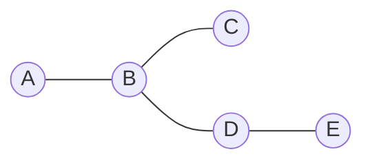

> Walk 序列：$A, e_1, B, e_2, C, e_3, B, e_4, D$；或简写为顶点序列 $A B C B D$。

### 1.2 迹与路径 (Trail & Path)

**定义 3.2 (Trail / Path)**：

| 术语 | 条件 |
|------|------|
| **trail（迹）** | 无重复边的 walk |
| **path（路径）** | 无重复顶点（从而也无重复边）的 trail |
| **closed trail（闭迹）** | 起点 = 终点的 trail，也称为 **circuit（回路）** |
| **cycle（圈）** | 起点 = 终点且内部顶点不重复的 walk，长度 $\ge 3$（简单图） |
| **trivial walk（平凡行走）** | 长度为 0 的 walk（仅含一个顶点） |

> [!note] Path 与 Walk 的层级关系
> $$\text{Walk} \supseteq \text{Trail} \supseteq \text{Path}$$
> 即每条 path 都是 trail，每条 trail 都是 walk，反之不真。

**示例**：在下图中标识不同类型的行走路线

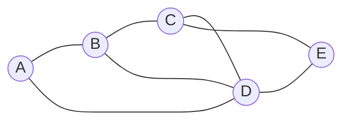

| Walk 序列 | 类型 | 原因 |
|:---|:---|:---|
| $A B C E D A$ | **circuit（回路）** / closed trail | 无重复边，起点 = 终点 |
| $A B D C E$ | **path（路径）** | 无重复顶点 |
| $A B D A D$ | 仅是 walk | 重复顶点 $A, D$ 且重复边 $A D$ |
| $A B D A B C$ | **trail（迹）**（但不是 path） | 无重复边，但重复顶点 $A, B$ |

### 1.3 Cycle（圈）

**定义 3.3 (Cycle)**：长度为 $k \ge 3$ 的 cycle 是顶点序列 $v_0 v_1 \dots v_{k-1} v_0$，其中所有 $v_i$ 互异（$0 \le i \le k-1$）且 $v_0 = v_k$。

- **odd cycle（奇圈）**：长度为奇数的 cycle
- **even cycle（偶圈）**：长度为偶数的 cycle
- 记 $C_k$ 为 $k$ 个顶点的 **cycle graph（圈图）**

**示例**：$C_5$（5-圈）

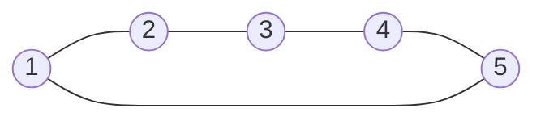

> [!theorem] 重要性质
> 一个图是**二分图** $\iff$ 该图不包含 odd cycle。（参见 [[Trees, Bipartite & Eulerian Graphs]]）

### 1.4 圈与行走存在性的基本引理 (Basic Lemma on Existence of Cycles and Walks)

**引理 3.5**：若 $G$ 中每个顶点的度 $\deg(v) \ge 2$，则 $G$ 包含一个 cycle。

> 直观证明：从任意顶点出发沿边行走，由于每步都有未用过的边可走（度 $\ge 2$），最终必然重复某个顶点，从而形成 cycle。

**推论**：$\delta(G) \ge 2 \implies G$ 包含 cycle。

---

## 2. 距离、离心率、直径、半径、围长与周长 (Distance, Eccentricity, Diameter, Radius, Girth, Circumference)

### 2.1 距离 (Distance)

**定义 3.6 (Distance)**：顶点 $u, v \in V$ 之间的 **距离** $d(u, v)$ 是联结 $u$ 和 $v$ 的最短 path 的长度。若 $u$ 和 $v$ 不连通，则 $d(u, v) = \infty$。

距离是**度量**（metric）：
1. **非负性**：$d(u, v) \ge 0$，且 $d(u, v) = 0 \iff u = v$
2. **对称性**：$d(u, v) = d(v, u)$
3. **三角不等式**：$d(u, v) \le d(u, w) + d(w, v)$

### 2.2 离心率、直径与半径 (Eccentricity, Diameter & Radius)

**定义 3.7**：

| 概念 | 符号 | 定义 |
|:---|:---|:---|
| **Eccentricity（离心率）** | $\varepsilon(v)$ | $\max_{u \in V} d(v, u)$ |
| **Diameter（直径）** | $\operatorname{diam}(G)$ | $\max_{v \in V} \varepsilon(v) = \max_{u, v \in V} d(u, v)$ |
| **Radius（半径）** | $\operatorname{rad}(G)$ | $\min_{v \in V} \varepsilon(v)$ |
| **Center（中心）** | — | $\{v \in V : \varepsilon(v) = \operatorname{rad}(G)\}$ |

> 直径是最大离心率，半径是最小离心率。
> 对于任意连通图：$\operatorname{rad}(G) \le \operatorname{diam}(G) \le 2 \cdot \operatorname{rad}(G)$。

**示例**：计算下图中各顶点的 eccentricity 及图的直径、半径

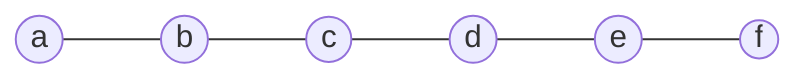

| 顶点 | Eccentricity $\varepsilon$ | 依据（最远顶点及距离） |
|:---|:---|:---|
| $a$ | 5 | $d(a, f) = 5$ |
| $b$ | 4 | $d(b, f) = 4$ |
| $c$ | 3 | $d(c, f) = 3$ |
| $d$ | 3 | $d(d, a) = 3$ |
| $e$ | 4 | $d(e, a) = 4$ |
| $f$ | 5 | $d(f, a) = 5$ |

- **Diameter** $\operatorname{diam}(G) = 5$（$a$ 与 $f$ 之间）
- **Radius** $\operatorname{rad}(G) = 3$（顶点 $c, d$）
- **Center** = $\{c, d\}$

### 2.3 围长与周长 (Girth & Circumference)

**定义 3.8**：

| 概念 | 符号 | 定义 |
|:---|:---|:---|
| **Girth（围长）** | $\operatorname{girth}(G)$ | 图 $G$ 中最短 cycle 的长度 |
| **Circumference（周长）** | $\operatorname{circ}(G)$ | 图 $G$ 中最长 cycle 的长度（若无 cycle 则为 0 或 $\infty$） |

- 若图无 cycle（即森林），约定 $\operatorname{girth}(G) = \infty$（或未定义）。
- 对于有 cycle 的图：$\operatorname{girth}(G) \ge 3$（简单图无自环/重边则最小为 3）。

**示例**：计算下图

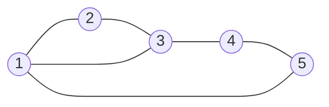

| 概念 | 值 | 说明 |
|:---|:---:|:---|
| $\operatorname{girth}(G)$ | 3 | 存在 3-cycle：$1\!-\!2\!-\!3\!-\!1$ |
| $\operatorname{circ}(G)$ | 5 | 最长 cycle：$1\!-\!2\!-\!3\!-\!4\!-\!5\!-\!1$（或 $1\!-\!3\!-\!4\!-\!5\!-\!1$ 长度为 4，最长是 5） |

> [!note] 围长的应用
> 在网络可靠性分析中，**围长越大**表示图越稀疏地包含短循环，这种结构在编码理论（LDPC 码）和网络设计中具有重要意义。许多网络设计要求围长 $\ge 6$ 以避免短循环导致的误差传播。

### 2.4 距离矩阵 (Distance Matrix)

对于顶点集 $V = \{v_1, \dots, v_n\}$，**距离矩阵** $D = (d_{ij})$ 定义为：

$$d_{ij} = d(v_i, v_j)$$

> 距离矩阵是对称的（无向图），且对角线 $d_{ii} = 0$。对不连通顶点，$d_{ij} = \infty$。距离矩阵在聚类分析、网络中心性度量 [[Centrality Measures]] 和图嵌入中广泛使用。

---

## 3. 连通性、连通分量、割点与桥 (Connectedness, Components, Cut Vertices & Bridges)

### 3.1 连通性 (Connectedness)

**定义 3.9**：图 $G$ 称为**连通**的，若对任意 $u, v \in V$，存在联结 $u$ 和 $v$ 的 path。

> 连通性由 path 的存在性定义。$d(u, v) < \infty$ 当且仅当 $u, v$ 在同一连通分量中。

### 3.2 连通分量 (Components)

**定义 3.10**：图 $G$ 的 **连通分量（component）** 是 $G$ 的极大连通子图。分量数记为 $\omega(G)$。

- 连通图的 $\omega(G) = 1$。
- 每个顶点属于恰好一个分量。
- 分量是 $V$ 的一个划分。

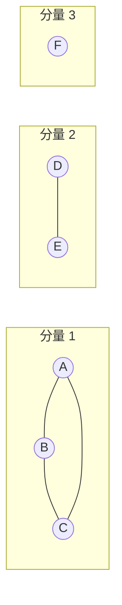

> $\omega(G) = 3$。分量 1 是 $C_3$（含 3-圈），分量 2 是 $K_2$，分量 3 是孤立顶点。

### 3.3 割点 (Cut Vertex)

**定义 3.11 (Cut Vertex / Articulation Point)**：顶点 $v$ 称为 **cut vertex（割点/关节点）**，若删除 $v$ 及其关联边后，剩余图的连通分量数增加：

$$\omega(G - v) > \omega(G)$$

> 直观理解：去掉这个顶点会把图"割开"成更多块。

**示例**：顶点 $B$ 是割点

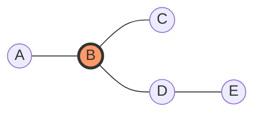

> 删除 $B$ 后，$\{A\}$ 和 $\{C, D, E\}$ 成为两个分离的分量。

**定理 (割点的特征)**：在连通图中，$v$ 是割点 $\iff$ 存在两个不同顶点 $u, w \neq v$，使得每条联结 $u$ 到 $w$ 的 path 都经过 $v$。

> 等价表述：$v$ 割断了 $u$ 和 $w$ 之间的所有路径。

### 3.4 桥 (Bridge)

**定义 3.12 (Bridge / Cut Edge)**：边 $e$ 称为 **bridge（桥/割边）**，若删除 $e$ 后图的连通分量数增加：

$$\omega(G - e) > \omega(G)$$

> 边 $D\!-\!E$ 是桥。删除它后，$\{A, B, C, D\}$ 和 $\{E\}$ 成为两个分量。

**定理 (桥的特征)**：边 $e = \{u, v\}$ 是桥 $\iff$ 任何 $u, v$ 之间的 walk 都必须包含 $e$（即 $e$ 不属于任何 cycle）。

> 等价表述：**桥不在任何 cycle 上**。

**定理 (割点与桥的关系)**：
- 若 $e = \{u, v\}$ 是桥，则 $u, v$ 中至少有一个是 cut vertex（除非某个端点是叶顶点 $\deg = 1$）。
- 反之不真：cut vertex 不一定是桥的端点。

### 3.5 块 (Block)

**定义 3.13**：图 $G$ 的 **block（块）** 是 $G$ 的极大连通子图，且不包含 cut vertex（即 **2-连通** 子图）。

- 每个块是一个 **maximal 2-connected subgraph（极大 2-连通子图）**。
- 图可以分解为唯一确定的 **block-cut tree（块-割树）**。

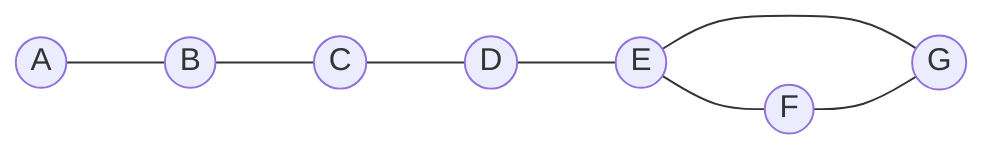

> 上图中，块结构：{A, B}, {B, C}, {C, D, E, F, G}（因为 D 和 E 都不再是割点？实际上 C 是割点）。再以更清晰的例子说明：

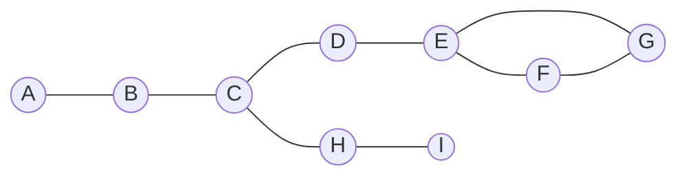

> 块 = 每个极大 2-连通子图，割点 $C$ 将图分为多个块。

---

## 4. k-连通性、惠特尼不等式与门格尔定理 (k-Connectivity, Whitney's Inequality & Menger's Theorem)

### 4.1 顶点连通度 (Vertex Connectivity)

**定义 3.14 (Vertex Connectivity)**：图 $G$ 的 **顶点连通度** $\kappa(G)$ 是使 $G$ 不连通或成为平凡图（单顶点）所需删除的最少顶点数。

- 若 $G$ 是完全图 $K_n$，则 $\kappa(K_n) = n - 1$（因为需要删除 $n-1$ 个顶点才能得到单顶点图）。
- 对不连通图，$\kappa(G) = 0$。
- 若 $G$ 包含 cut vertex，则 $\kappa(G) = 1$。

**定义 (k-连通)**：图 $G$ 称为 **k-连通（k-connected）**，若 $\kappa(G) \ge k$。

> 等价地：$G$ 是 $k$-连通 $\iff$ $|V| > k$ 且删除任意 $k-1$ 个顶点后图仍连通。

### 4.2 边连通度 (Edge Connectivity)

**定义 3.15 (Edge Connectivity)**：图 $G$ 的 **边连通度** $\lambda(G)$ 是使 $G$ 不连通所需删除的最少边数。

- 对不连通图，$\lambda(G) = 0$。
- 若 $G$ 包含 bridge，则 $\lambda(G) = 1$。

### 4.3 惠特尼不等式 (Whitney's Inequality)

**定理 3.16 (Whitney, 1932)**：对任意图 $G$：

$$\kappa(G) \le \lambda(G) \le \delta(G)$$

其中 $\delta(G)$ 是 $G$ 的最小度。

> **直观理解**：
> - $\lambda(G) \le \delta(G)$：删除与最小度顶点相连的所有边即足以断开该顶点。
> - $\kappa(G) \le \lambda(G)$：删除与最小边割集相关的端点通常可用顶点割模拟，但有时需要更少顶点。

**示例**：验证 Whitney 不等式

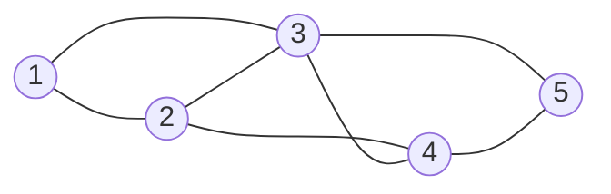

| 量 | 值 | 说明 |
|:---|:---:|:---|
| $\kappa(G)$ | 2 | 删除 2 和 3 使图不连通；但删除单一顶点不足以断开 |
| $\lambda(G)$ | 2 | 删除边 $\{2, 4\}, \{3, 4\}$ 可断开 4；单一边不够 |
| $\delta(G)$ | 2 | $\deg(1)=2$，$\deg(2)=3$，$\deg(3)=3$，$\deg(4)=3$，$\deg(5)=2$，最小为 2 |

$$\kappa(G) = \lambda(G) = \delta(G) = 2 \quad \checkmark$$

**不等式的严格性示例**：以下图展示各不等式取严格不等号的情况

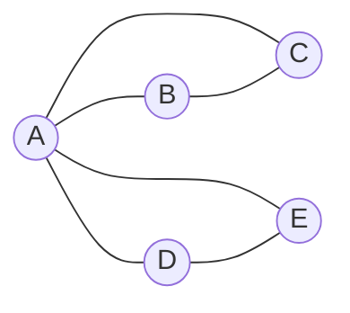

| 量 | 值 | 说明 |
|:---|:---:|:---|
| $\kappa(G)$ | 1 | 删除 $A$ 使图不连通 |
| $\lambda(G)$ | 2 | 删除边 $\{A, B\}, \{A, C\}$ 断开 $B, C$ 侧 |
| $\delta(G)$ | 2 | $\deg(A)=4$，$\deg(B)=2$，$\deg(C)=2$，$\deg(D)=2$，$\deg(E)=2$ |

$$\kappa(G) = 1 < \lambda(G) = 2 < \delta(G) = 2$$

> [!note] 各量之间的关系
> Whitney 不等式建立了三个基本图参数之间的层级关系。当图是正则图或高度对称时，三个量常相等（如 $K_n$：$\kappa = \lambda = \delta = n-1$）。

### 4.4 门格尔定理 (Menger's Theorem)

**定理 3.17 (Menger, 1927)**——**顶点版本**：

> 图 $G$ 中，不相邻顶点 $u, v$ 之间**最小顶点分离集的大小**等于**最大内部顶点不相交 $u\!-\!v$ 路径的数量**。

**定理 3.18 (Menger, 1927)**——**边版本**：

> 图 $G$ 中，顶点 $u, v$ 之间**最小边割集的大小**等于**最大边不相交 $u\!-\!v$ 路径的数量**。

> [!info] Menger 定理的两种表述
> **顶点版本**：对于不相邻的 $u, v$，$\min |S|$（$S$ 是 $u\!-\!v$ 顶点分离集）= $\max$ 条内部顶点不相交 $u\!-\!v$ 路径的数量。
>
> **边版本**：$\min |C|$（$C$ 是 $u\!-\!v$ 边割集）= $\max$ 条边不相交 $u\!-\!v$ 路径的数量。

**Menger 定理与连通度**：

Menger 定理给出了连通度的等价刻画：

- $\kappa(G) \ge k$ $\iff$ 任意两顶点间至少有 $k$ 条内部顶点不相交的路径。
- $\lambda(G) \ge k$ $\iff$ 任意两顶点间至少有 $k$ 条边不相交的路径。

**示例**：在 $K_4$ 中验证 Menger 定理

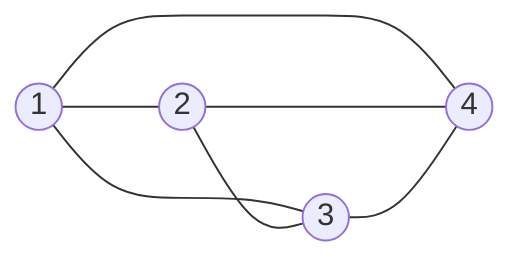

- 顶点 1 和 4 之间：有 3 条内部顶点不相交路径：
  1. $1 \to 4$
  2. $1 \to 2 \to 4$
  3. $1 \to 3 \to 4$
- 最小顶点分离集大小 = 3（需删除 2, 3 和 1…实际上在 $K_4$ 中 $\kappa = 3$，但 1 和 4 相邻，故 Menger 顶点版本要求不相邻顶点。这里 1 和 4 相邻，因此应看其他对。）

更正：对相邻顶点，需修正为考虑**不同时包含两个端点的路径**。Menger 定理的标准形式适用于不相邻顶点。对连通度的等价刻画，常使用**全局版本**：

> [!theorem] Menger 定理（全局形式）
> 图 $G$ 是 **$k$-连通** $\iff$ 对任意两个不同顶点 $u, v$，存在至少 $k$ 条内部顶点不相交的 $u\!-\!v$ 路径。
>
> 图 $G$ 是 **$k$-边连通** $\iff$ 对任意两个不同顶点 $u, v$，存在至少 $k$ 条边不相交的 $u\!-\!v$ 路径。

### 4.5 哈拉里图 (Harary Graphs)

**构造**：Harary 图 $H_{k,n}$ 是在 $n$ 个顶点上达到 $\kappa(G) = k$ 的极小 $k$-连通图。

> 对给定 $n, k$，Harary 图以最少的边数达到连通度 $k$。具体构造方式见 Griffin 第 3 章。

---

## 5. 割 (Cuts)

### 5.1 顶点割 (Vertex Cut)

**定义 3.19 (Vertex Cut / Separator)**：一个**顶点割**（或称**分离集**）$S \subseteq V \setminus \{u, v\}$ 称为 $u\!-\!v$ **separator（分离集）**，若 $G - S$ 中 $u$ 与 $v$ 不连通。

- 最小 $u\!-\!v$ separator 的大小是 Menger 定理的核心量。
- 若 $|S| = 1$，则此顶点为 **cut vertex（割点）**。

### 5.2 边割 (Edge Cut)

**定义 3.20 (Edge Cut)**：边集 $C \subseteq E$ 称为 $u\!-\!v$ **edge cut（边割）**，若 $G - C$ 中 $u$ 与 $v$ 不连通。

- 最小 $u\!-\!v$ edge cut 的大小等于边连通度 $\lambda(G)$。
- 若 $|C| = 1$，则此边为 **bridge（桥）**。

### 5.3 网络流中的 s-t 割 (s-t Cut in Network Flow)

**定义**：对有向图 $G = (V, E)$ 及源点 $s$、汇点 $t$，一个 **$s\!-\!t$ cut（s-t 割）** 是 $V$ 的一个划分 $(S, T)$，满足 $s \in S$，$t \in T$。对应的 **cut-set（割集）** 为：

$$\delta^+(S) = \{(u, v) \in E : u \in S, v \in T\}$$

割的**容量**为：

$$c(S, T) = \sum_{u \in S, v \in T} c(u, v)$$

> **最大流-最小割定理**：$s$ 到 $t$ 的最大流值等于最小 $s\!-\!t$ 割的容量。这是 Menger 边版本在加权有向网络中的推广。

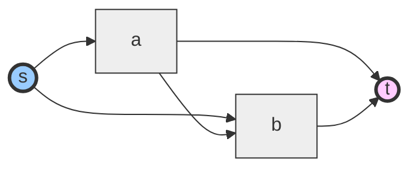

> 一种可能的 $s\!-\!t$ 割：$S = \{s, a\}$, $T = \{b, t\}$，割集包含边 $(a, b)$, $(a, t)$, $(s, b)$。

### 5.4 基本割相关定理

**定理 (Fan Lemma / 扇形引理)**：设 $G$ 是 $k$-连通图，$x$ 是 $G$ 的一个顶点，$Y \subseteq V \setminus \{x\}$ 且 $|Y| \ge k$，则存在从 $x$ 到 $Y$ 的 $k$ 条内部顶点不相交的路径（每条路径以 $x$ 为起点，终点为 $Y$ 中不同顶点）。

> 这是 Menger 定理的重要推论，在图的连通性研究中非常有用。

---

## 6. 综合示例

### 示例：计算所有连通性参数

考虑以下图 $G$：

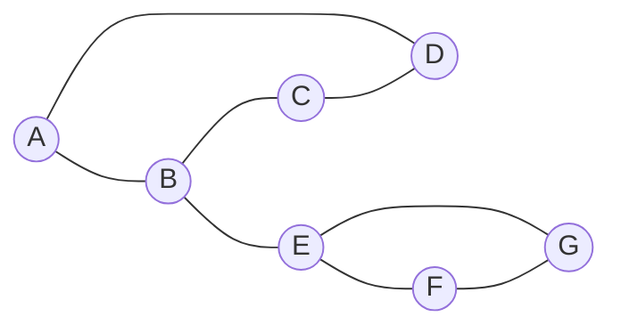

| 参数 | 值 | 计算过程 |
|:---|:---:|:---|
| $\kappa(G)$ | 2 | 需删除至少 2 顶点（如 $B, E$）才能断开 |
| $\lambda(G)$ | 2 | 删除边 $\{B, E\}, \{E, F\}$ 断开 $F, G$ 侧 |
| $\delta(G)$ | 2 | $\deg(A)=2, \deg(B)=3, \deg(C)=2, \deg(D)=2, \deg(E)=3, \deg(F)=2, \deg(G)=2$ |
| $\operatorname{diam}(G)$ | 3 | $d(A, F) = 3$（A-B-E-F）|
| $\operatorname{rad}(G)$ | 2 | $\varepsilon(B)=\varepsilon(E)=2$ |
| $\operatorname{girth}(G)$ | 3 | cycle A-B-C-D-A 长度 4？实际上还有 cycle E-F-G-E 长度 3 |
| $\operatorname{circ}(G)$ | 4 | 最长 cycle 为 A-B-C-D-A（长度 4） |

验证 Whitney 不等式：$\kappa=2 \le \lambda=2 \le \delta=2$ ✓

---

## 符号速查

| 符号 | 含义 | 首次定义 |
|:---|:---|:---:|
| $W = v_0 e_1 v_1 \dots e_k v_k$ | Walk 的顶点-边交替序列 | §1.1 |
| $d(u, v)$ | 顶点 $u, v$ 之间的最短 path 距离 | §2.1 |
| $\varepsilon(v)$ | 顶点 $v$ 的 eccentricity（离心率） | §2.2 |
| $\operatorname{diam}(G)$ | 图的直径（最大 eccentricity） | §2.2 |
| $\operatorname{rad}(G)$ | 图的半径（最小 eccentricity） | §2.2 |
| $\operatorname{girth}(G)$ | 图的围长（最短 cycle 长度） | §2.3 |
| $\operatorname{circ}(G)$ | 图的周长（最长 cycle 长度） | §2.3 |
| $\omega(G)$ | 图的连通分量数 | §3.2 |
| $\kappa(G)$ | 顶点连通度（最少删除顶点数） | §4.1 |
| $\lambda(G)$ | 边连通度（最少删除边数） | §4.2 |
| $\delta(G)$ | 最小度 | §4.3 |
| $G - v$ | 删除顶点 $v$ 及其关联边后的图 | §3.3 |
| $G - e$ | 删除边 $e$ 后的图 | §3.4 |
| $C_k$ | $k$ 个顶点的圈图 | §1.3 |
| $S \subset V$ | 顶点割 / separator | §5.1 |
| $C \subset E$ | 边割 | §5.2 |
| $\delta^+(S)$ | 从 $S$ 指向 $T$ 的边集（有向割） | §5.3 |

---

## 相关笔记

- [[Definitions]] — 基本图术语、度、邻接
- [[Degree Sequences & Subgraphs]] — 度序列、子图、图同构
- [[Centrality Measures]] — 中心性度量（接近中心性、介数中心性等）
- [[Trees, Bipartite & Eulerian Graphs]] — 树、二分图、欧拉图

---

## 参考文献

- Christopher Griffin, *Applied Graph Theory: An Introduction with Graph Optimization and Algebraic Graph Theory*, 第 3 章——途径、圈与连通性。
- Whitney, H. (1932). "Congruent graphs and the connectivity of graphs." *American Journal of Mathematics*, 54(1), 150–168.
- Menger, K. (1927). "Zur allgemeinen Kurventheorie." *Fundamenta Mathematicae*, 10, 96–115.

---
