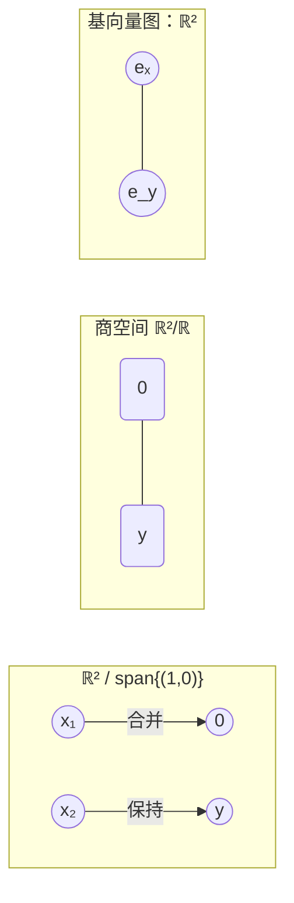
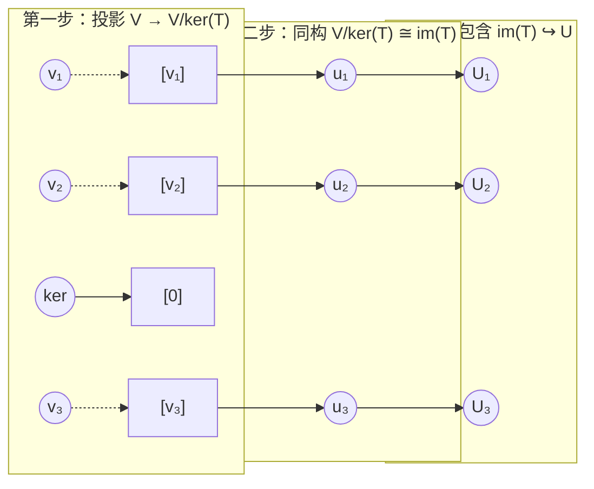
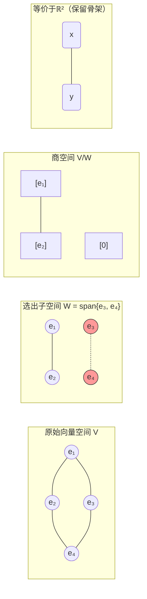
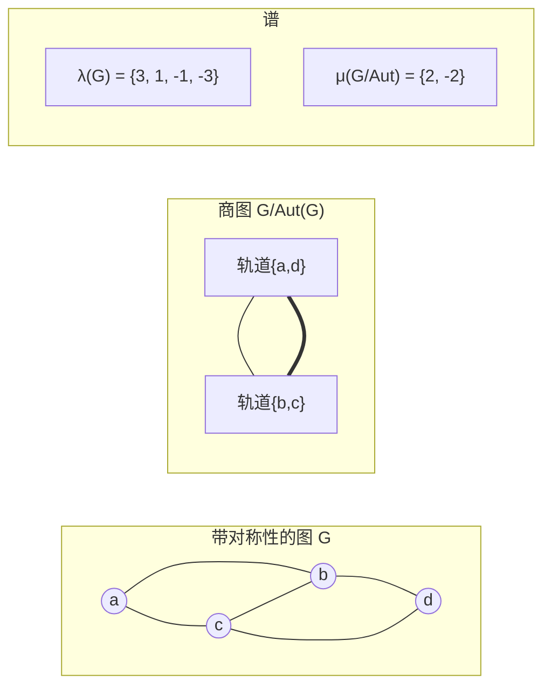

---
tags:
  - Math
  - GraphTheory
  - LinearAlgebra
  - 概念性
  - Idea
title: Graphical Perspective on Quotient Spaces
created: 2026-07-03
modified:
aliases:
  - 商空间的图论视角
  - Graph-Contraction Analogy
---

# 商空间的图论视角 (Graphical Perspective on Quotient Spaces)

> **Path C 视角** — 将商空间 $V/W$ 理解为图论中的收缩 (contraction) 操作。正如边收缩将两个顶点融合为一个，商空间将相差 $W$ 中元素的向量视为同一个等价类。这种类比不仅提供了直观的几何图像，还揭示了线性代数中"取商"与图论中"粗粒化"之间的深层结构联系。

**前置知识:** [[Linear_Algebra/Quotient Space]], [[Linear_Algebra/Vector Spaces and Subspaces]], [[矩阵即图]], [[线性变换即图同态]]

**相关笔记:** [[Adjacency Matrix & Spectrum]], [[Laplacian & Spectral Clustering]], [[Abstract_Algebra/Normal Subgroups and Quotient Groups]]

---

## 1. 核心思想 (The Core Insight)

在图论中，**边收缩 (edge contraction)** 将两个相邻顶点 $u, v$ 合并为一个新顶点，所有连接到 $u$ 或 $v$ 的边都改为连接这个新顶点。这创建了一个"粗粒化"的图，保留了原图的连接性骨架。

在线性代数中，**商空间 (quotient space)** $V/W$ 将相差 $W$ 中向量的所有向量视为同一个等价类。这个操作"折叠"掉子空间 $W$ 中的所有方向，保留剩下的独立方向。

| 图论操作 | 线性代数对应 |
|:---------|:-------------|
| 边收缩 $u, v \to w$ | 等价关系 $v \sim v' \iff v - v' \in W$ |
| 商图 $G/\!\sim$ | 商空间 $V/W$ |
| 收缩后的顶点 | 等价类 $[v] = v + W$ |
| 图 minors（删除边 + 收缩顶点） | 降维 / 投影 |
| 保持连通性 | 保持线性结构（加法和数乘） |

> [!quote] 核心理念
> **商空间就是向量空间上的图收缩。** 图论中的粗粒化压缩冗余连接而保留拓扑结构；线性代数中的商压缩冗余方向而保留线性结构。两者共享同一个范畴论骨架：通过等价关系取商是一种普遍的"模去子结构"操作。

---

## 2. 图收缩作为商 (Graph Contraction as Quotient)

### 2.1 边收缩 (Edge Contraction)

**定义**：设 $G = (V, E)$ 是一个简单图，$e = \{u, v\} \in E$。将 $e$ **收缩**得到新图 $G/e$：

- 删除顶点 $u, v$，插入新顶点 $w$；
- 每条原本连接 $u$ 或 $v$ 的边，改为连接 $w$（删除自环和多重边）。

### 2.2 更一般的商图

更一般地，给定顶点集 $V$ 的一个划分 $\mathcal{P} = \{V_1, \dots, V_k\}$，可以定义**商图** $G/\!\mathcal{P}$：

- 顶点集为 $\{V_1, \dots, V_k\}$；
- $V_i$ 和 $V_j$ 之间有边当且仅当存在 $u \in V_i, v \in V_j$ 使得 $\{u, v\} \in E$。

```mermaid
graph LR
    subgraph 原图 G
        a((a)) --- b((b)) --- c((c))
        d((d)) --- e((e))
        a --- d
        b --- e
    end

    subgraph 商图_G_÷P
        A["V₁ = {a,d}"] --- B["V₂ = {b,e}"]
        B --- C["V₃ = {c}"]
    end
```

> 上方：6 个顶点、划分 $\mathcal{P} = \{\{a, d\}, \{b, e\}, \{c\}\}$。下方：收缩后的商图。顶点 $a$ 和 $d$ 合并为 $V_1$，$b$ 和 $e$ 合并为 $V_2$，$c$ 单独为 $V_3$。注意 $a$-$d$ 之间的边消失在合并中（成为自环被删除），但跨类的边 $a$-$b$ 和 $d$-$e$ 都变成了 $V_1$-$V_2$ 之间的边。

**关键观察**：这个"粗粒化"过程完全由等价关系定义——这正是商空间的核心机制。

---

## 3. 商空间作为顶点分组 (Quotient Space as Vertex Grouping)

### 3.1 商空间的定义

设 $V$ 是域 $\mathbb{F}$ 上的向量空间，$W \subseteq V$ 是其子空间。**商空间** $V/W$ 定义为等价类集合：

$$
[v] \coloneqq v + W = \{v + w : w \in W\},
$$

带有自然的加法和数乘：

$$
[v] + [v'] = [v + v'], \qquad \alpha [v] = [\alpha v].
$$

商空间的维数：

$$
\dim(V/W) = \dim V - \dim W.
$$

### 3.2 图论视角：在"基向量的图"中合并

借用 [[矩阵即图]] 的二分图表示，考虑 $V$ 的一组基 $\{e_1, \dots, e_n\}$。子空间 $W$ 定义了基底之间的一个等价关系：$e_i \sim e_j$ 如果它们在 $W$ 的补空间中扮演相同的"角色"。

更精确地说：设 $\pi : V \to V/W$ 是自然投影。$\pi$ 将一组基映射到商空间的一组生成元。如果 $W$ 是由某些基向量张成的，那么这些基向量在投影下全部映射为零——相当于在图论中将它们"收缩"成一个零顶点。



> **解释**：将 $\mathbb{R}^2$ 模去 $x$-轴 $\operatorname{span}\{(1,0)\}$。在基向量图中，$e_x$ 对应的顶点被"收缩"为零（因为所有 $x$ 方向在商空间中消失），只有 $e_y$ 方向保留。最终 $\mathbb{R}^2 / \operatorname{span}\{(1,0)\} \cong \mathbb{R}$，即 $y$-轴。

### 3.3 例子：$\mathbb{R}^2 / \{(t, t) : t \in \mathbb{R}\}$

设 $W = \{(t, t) : t \in \mathbb{R}\}$ 是对角线。商空间 $\mathbb{R}^2 / W$ 将 $(x, y)$ 等价于 $(x', y')$ 当且仅当 $x - y = x' - y'$。因此每个等价类由差值 $x - y$ 唯一确定，且：

$$
\mathbb{R}^2 / W \cong \mathbb{R}, \qquad [(x, y)] \mapsto x - y.
$$

在图论视角中，这是将"沿对角线方向"的所有顶点合并为一个，剩下垂直于对角线的方向（即反对角线方向 $(-1, 1)$）作为商空间的生成元。

---

## 4. 核的商 — 第一同构定理 (Quotient by Kernel — The First Isomorphism Theorem)

### 4.1 第一同构定理

线性代数中最深刻的商空间应用是**第一同构定理**：

$$
V / \ker(T) \cong \operatorname{im}(T).
$$

**定理**：设 $T : V \to U$ 是线性变换。定义 $\widetilde{T} : V / \ker(T) \to \operatorname{im}(T)$ 为 $\widetilde{T}([v]) = T(v)$。则 $\widetilde{T}$ 是一个同构。

### 4.2 二分图视角

将 $T$ 视为一个加权二分图（[[矩阵即图]]）：左顶点集为 $V$ 的基，右顶点集为 $U$ 的基，边权重为 $T$ 的矩阵元。

- **核 $\ker(T)$** 是所有左顶点权值组合的集合，这些组合在所有右顶点上的净和为零。
- **像 $\operatorname{im}(T)$** 是所有从右顶点可达的线性组合。

收缩 $\ker(T)$ 正是删除了这种"冗余"：两个左顶点赋予 $T$ 相同若映射到右顶点时没有任何区别。



> **分解**：每个线性变换 $T : V \to U$ 天然分解为三个图操作：
> 1. **投影** $\pi : V \to V/\ker(T)$ —— 将 $\ker(T)$ 中的所有左顶点收缩为零；
> 2. **同构** $\widetilde{T} : V/\ker(T) \to \operatorname{im}(T)$ —— 在收缩后的图与像之间建立一一对应的边（无信息丢失）；
> 3. **包含** $\iota : \operatorname{im}(T) \hookrightarrow U$ —— 将像嵌入到目标空间。

### 4.3 图解

$$
\begin{CD}
V @>{T}>> U \\
@V{\pi}VV @AA{\iota}A \\
V/\ker(T) @>{\widetilde{T} \cong}>{\text{同构}}> \operatorname{im}(T)
\end{CD}
$$

这个交换图在范畴论中被称为**"商-同构-含入"分解**。在图论语言中：**删除冗余（核），保留骨架（像），嵌入上下文（余域）。**

---

## 5. 商空间作为图子式 (Quotient as Graph Minor)

### 5.1 图 minors (Graph Minors)

图 $H$ 是 $G$ 的 **minor（子式）** 当且仅当 $H$ 可以从 $G$ 通过以下操作得到：

1. **删除边** (edge deletion)；
2. **删除孤立顶点** (vertex deletion)；
3. **收缩边** (edge contraction)。

Minors 是图论中"结构简化"的核心概念。著名结果包括 Robertson–Seymour 定理和 Kuratowski 定理的 minor 形式。

### 5.2 商空间作为线性代数中的 minor

取商空间 $V/W$ 对应于以下操作：

1. **删除"边"** —— 忽略 $W$ 方向上的所有分量；
2. **删除"顶点"** —— 将 $W$ 中的基向量移出基集；
3. **收缩"边"** —— 将沿 $W$ 方向的所有向量合并为同一个等价类。



> **类比**：$V$ 是基础图，$W$ 是被收缩的红色子图，$V/W$ 是收缩后的 minor。注意 $e_3$ 和 $e_4$ 先被"合并"为零，然后从图中消失——就像在 graph minor 中收缩的顶点变为一个点后不再展开。

### 5.3 类比表

| 图子式 (Graph Minor) | 商空间 (Quotient Space) |
|:------------|:---------------|
| 删除边 | 消除 $W$ 方向上的分量 |
| 收缩边 | 模去 $W$ 中的等价关系 |
| 删除孤立顶点 | 从基集中移除 $W$ 的基 |
| 结果图 $H$ 保留了 $G$ 的连通性和嵌入性质 | 结果空间 $V/W$ 保留了 $V$ 的线性结构和维数差 |
| Minor 关系 $\preceq$ 是图上的偏序 | 商空间给出了 $V$ 的子空间格上的投影 |
| 对偶：$H$ 是 $G$ 的 minor $\iff$ $G$ 在某曲面嵌入可分 | 对偶：$\operatorname{Ann}(W) \cong (V/W)^*$ |

### 5.4 基 = 生成树，商 = 收缩树边

设 $V$ 有基 $\mathcal{B} = \{b_1, \dots, b_n\}$，$W$ 由 $\mathcal{B}$ 的前 $k$ 个向量张成。取商 $V/W$ 等价于：

- **收缩生成树的边**：将 $\{b_1, \dots, b_k\}$ "折叠"为零；
- **保留补树的顶点**：$\{[b_{k+1}], \dots, [b_n]\}$ 构成 $V/W$ 的一组基。

正如一棵树的边收缩不会改变它的**连通性**（剩余结构仍然是一个树），收缩 $W$ 不会改变剩余方向的**线性独立性**。

---

## 6. 谱商 (Spectral Quotients)

### 6.1 图自同构与商图

图 $G = (V, E)$ 的自同构群 $\operatorname{Aut}(G)$ 作用在顶点集上。根据这个群作用，可以将 $V$ 划分为轨道 (orbits)。**轨道图 (quotient graph)** $G/\operatorname{Aut}(G)$ 的每个顶点对应一个轨道，边的权重由轨道间的边数决定。

### 6.2 特征值的交织

设 $G$ 有邻接矩阵 $A$，其特征值为 $\lambda_1 \geq \cdots \geq \lambda_n$。商图 $G/\operatorname{Aut}(G)$（定义适当的权重矩阵 $B$）的特征值 $\mu_1 \geq \cdots \geq \mu_k$ ($k$ 为轨道数) 满足**交织性质**：

$$
\lambda_i \geq \mu_i \geq \lambda_{n - k + i}, \quad i = 1, \dots, k.
$$

这是对称矩阵的**Cauchy 交织定理** (Cauchy interlacing theorem) 的直接推论。



> **例**：$C_4$（4-轮环）的自同构群 $D_4$ 作用将 $C_4$ 的顶点分为两个轨道：对径点对 $\{1,3\}$ 和 $\{2,4\}$。商图是一个 2-顶点加权图。$C_4$ 的谱为 $\{2, 0, 0, -2\}$，商图谱为 $\{2, -2\}$——后者正是前者的一个子集（因为轨道数 = 2，取每个轨道内的平坦特征向量）。

### 6.3 线性代数中的对应

在矩阵论中，这对应于将矩阵约化为**块对角形式**。如果矩阵 $A$ 在群 $G$ 作用下不变（即 $A$ 是 $G$-等变的），那么可以通过对称性将 $A$ 分块，每块对应一个不可约表示。每个块的谱对应商图（或 orbifold）的谱。

这正是 **图论版本的对称约化**：在商空间中，自同构群被"模掉"了，剩下的结构保留了原谱的关键信息。

---

## 7. 总结 (Summary)

| 视角 | 本质 | 图论对应 | 线性代数对应 |
|:-----|:-----|:---------|:-------------|
| **组合** | 粗粒化 | 图收缩 + 商图 | $V/W$ |
| **代数** | 模去子结构 | 等价关系划分顶点 | 等价关系 $v \sim v' \iff v - v' \in W$ |
| **谱** | 降维保留关键特征 | 轨道图 + 特征值交织 | 矩阵的对称约化 |
| **范畴** | 泛性质 | 商图是满足连续性的最小图 | $V/W$ 是使 $\pi$ 为线性的最大商 |

### 一句话总结

> 取商空间就像在图论中做 minor 操作：**找到不想要的方向，把它们的基向量收缩为零，保留剩下的干净骨架。**

---

## References

- **Axler, S.** (2015). *Linear Algebra Done Right* (3rd ed.). §3.E: Quotient Spaces.
- **Griffin, C.** (2023). *Applied Graph Theory*. §10–§12: Graph Minors and Spectral Graph Theory.
- **Godsil, C. & Royle, G.** (2001). *Algebraic Graph Theory*. §8: Automorphisms and Quotients.
- **Robertson, N. & Seymour, P. D.** (1983–2004). Graph Minors series. *J. Combin. Theory Ser. B*.
- **Brouwer, A. E. & Haemers, W. H.** (2011). *Spectra of Graphs*. §2.3: Interlacing.

---

## Links

- [[矩阵即图]]
- [[线性变换即图同态]]
- [[Adjacency Matrix & Spectrum]]
- [[Laplacian & Spectral Clustering]]
- [[Linear_Algebra/Quotient Space]]
- [[Linear_Algebra/Vector Spaces and Subspaces]]
- [[Abstract_Algebra/Normal Subgroups and Quotient Groups]]

---

## Acceptance Report
