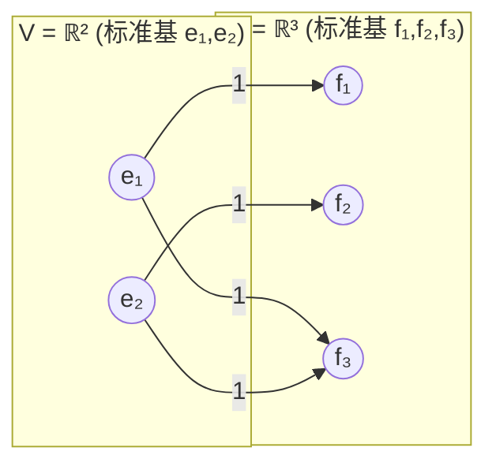
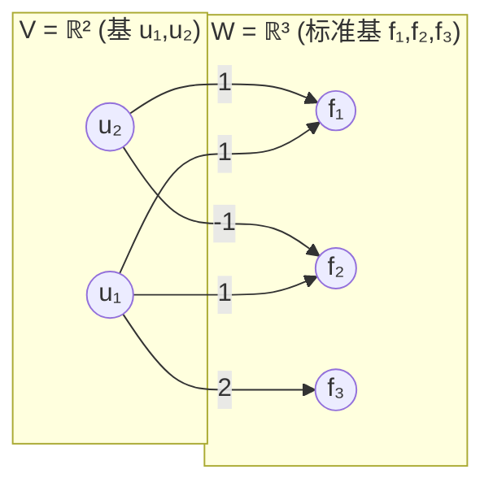
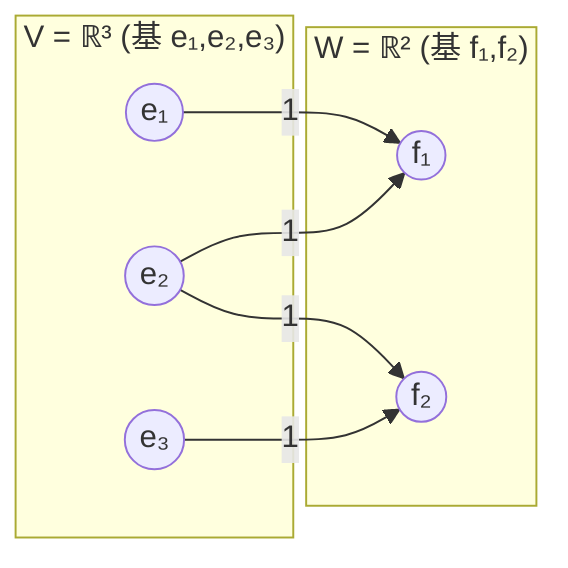
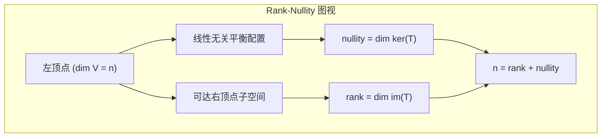
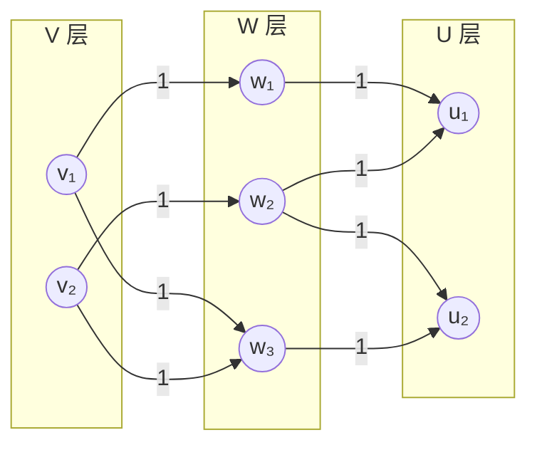
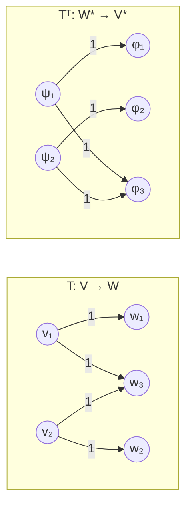
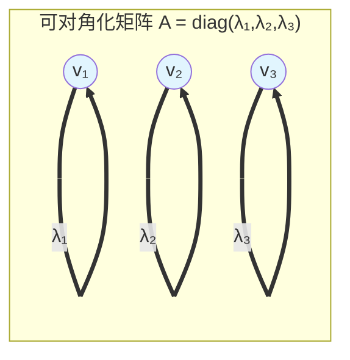
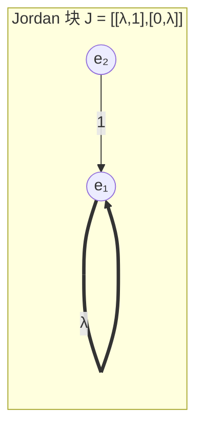
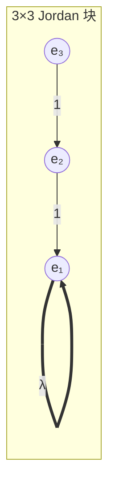
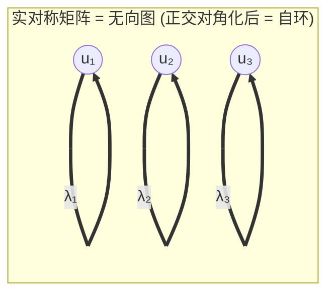

---
tags:
  - Math
  - GraphTheory
  - LinearAlgebra
  - CategoryTheory
  - 概念性
  - Idea
title: 线性变换即图同态
created: 2026-07-03
modified:
aliases:
  - T as Graph
  - 线性变换即图态射
  - Linear Transformation Graphs
---

# 线性变换即图同态 (Linear Transformations as Graph Morphisms)

> **Path C 视角** — 在 [[矩阵即图]] 的基础上，将"矩阵即图"的思想提升为"线性变换即图态射"。当选择基底后，一个线性变换就编码为一个加权的二分图；基变换只是图的重标号（同构）。矩阵乘法就是二分图的路径求和；转置就是边反向。最终，线性代数中的每一个概念都可以在图论中找到组合对应。

> **Prerequisites**
> - [[矩阵即图]] — 核心前提，矩阵与图的二元性
> - [[Linear_Algebra/Linear Transformations]] — 线性变换的基本概念
> - [[Linear_Algebra/Vector Spaces and Subspaces]] — 向量空间
> - [[Adjacency Matrix & Spectrum]] — 邻接矩阵与图谱
>
> **Follow-ups**
> - [[Linear_Algebra/Rank and Nullity]] — 秩与零化度
> - [[Linear_Algebra/Dual Space]] — 对偶空间
> - [[Category_Theory/Functor]] — 范畴论中的函子视角

---

## 1. 核心思想 (The Core Insight)

线性变换 $T: V \to W$ 是两个向量空间之间的结构保持映射。当我们为 $V$ 和 $W$ 选择基底后，$T$ 就化为一个矩阵 $M_T$。这个矩阵 $M_T$ 是一个加权的有向二分图。因此：

> **一个线性变换 $\boldsymbol{T}$ 就是基底选择后的一个加权二分图；基变换仅改变图的顶点标号（图同构）。**

这种观点将线性代数的核心概念统一在图论框架下：

| 线性代数概念 | 图论对应 |
|:------------|:---------|
| 线性变换 $T: V \to W$ | 从 $V$ 的基到 $W$ 的基的加权二分图 |
| 矩阵 $M_T$ | 二分图的邻接矩阵 |
| 基变换 | 图顶点重标号（同构） |
| 核 $\ker(T)$ | 左顶点上的权重配置使所有右顶点和为 0 |
| 像 $\operatorname{im}(T)$ | 从左顶点可达的右顶点子空间 |
| 复合 $S \circ T$ | 三层二分图的路径求和 |
| 转置 $T^\top$ | 边反向后的二分图 |
| 特征向量 $Tv = \lambda v$ | 自环权重为 $\lambda$ 的顶点 |

---

## 2. 基选择即图表示 (Basis Selection = Graph Representation)

### 2.1 从基到图

设 $T: V \to W$ 是线性变换，$\dim V = n$，$\dim W = m$。选择基 $\mathcal{B}_V = \{v_1,\dots,v_n\}$ 和 $\mathcal{B}_W = \{w_1,\dots,w_m\}$。则 $T$ 由矩阵 $M_T \in \mathbb{F}^{m \times n}$ 完全确定：

$$T(v_j) = \sum_{i=1}^m (M_T)_{ij} \, w_i$$

矩阵 $M_T$ 定义了一个**加权有向二分图** $G(T) = (V_{\text{left}}, V_{\text{right}}, E, w)$：

- **左顶点集** $V_{\text{left}} = \{v_1,\dots,v_n\}$（对应 $V$ 的基向量）
- **右顶点集** $V_{\text{right}} = \{w_1,\dots,w_m\}$（对应 $W$ 的基向量）
- **边集** $E = \{(v_j, w_i) : (M_T)_{ij} \neq 0\}$
- **权重函数** $w(v_j, w_i) = (M_T)_{ij}$

> 方向约定：从**域**到**陪域**，即 $v_j \xrightarrow{(M_T)_{ij}} w_i$。

### 2.2 示例：同一变换，两种基

考虑 $T: \mathbb{R}^2 \to \mathbb{R}^3$，定义为：

$$T(x,y) = (x,\; y,\; x+y)$$

**标准基下**（$\mathcal{E}_2$ 和 $\mathcal{E}_3$）：

$$M_{\text{std}} = \begin{pmatrix}
1 & 0 \\
0 & 1 \\
1 & 1
\end{pmatrix}$$

**现在换一组基**。设 $V$ 选用新基 $\mathcal{U} = \{u_1 = e_1 + e_2,\; u_2 = e_1 - e_2\}$，$W$ 保持标准基：

$$
\begin{aligned}
T(u_1) &= T(1,1) = (1,1,2) = f_1 + f_2 + 2f_3 \\
T(u_2) &= T(1,-1) = (1,-1,0) = f_1 - f_2
\end{aligned}
$$

$$M_{\text{alt}} = \begin{pmatrix}
1 & 1 \\
1 & -1 \\
2 & 0
\end{pmatrix}$$

这两个图**不是同一个图**——它们有不同的左顶点集和不同的边权重。但它们是**图同构的**：存在一个左顶点集合的双射（$u_1 \leftrightarrow e_1 + e_2$，$u_2 \leftrightarrow e_1 - e_2$），使得在适当的重新标记下，边结构匹配。这正是基变换矩阵 $P$ 所编码的信息：

$$M_{\text{alt}} = M_{\text{std}} \cdot P, \quad \text{其中 } P = \begin{pmatrix}1 & 1 \\ 1 & -1\end{pmatrix} \text{ 是基变换矩阵}$$

更一般地，如果 $V$ 和 $W$ 都换基：

$$M_{\text{new}} = Q^{-1} M_{\text{std}} P$$

其中 $P$ 和 $Q$ 分别是 $V$ 和 $W$ 上的基变换矩阵。在图上，这对应于左、右两边的顶点重标号。

> **本质结论**：相似矩阵 $A \sim P^{-1}AP$ 对应**同一个线性变换在不同基下的图表示**。它们是图同构的——结构相同，只是顶点标签不同。

---

## 3. 核与像的图论解释 (Kernel and Image Graphically)

### 3.1 核 (Kernel) 的图论解释

设 $T: V \to W$ 有矩阵 $M_T$。核 $\ker(T) = \{v \in V : T(v) = 0\}$ 在二分图中有直接的组合意义：

> $\ker(T)$ 中的向量是在**左顶点**上分配的权重，使得**每个右顶点**收到的加权和为零。

**示例**：$T: \mathbb{R}^3 \to \mathbb{R}^2$，$T(x,y,z) = (x+y,\; y+z)$。

矩阵和二分图：

$$M_T = \begin{pmatrix}
1 & 1 & 0 \\
0 & 1 & 1
\end{pmatrix}$$

求解 $\ker(T)$：$T(x,y,z) = (0,0)$ 即 $x+y=0,\; y+z=0$。

$$
\begin{cases}
x + y = 0 \\
y + z = 0
\end{cases}
\implies
\begin{cases}
x = -y \\
z = -y
\end{cases}
\implies
\ker(T) = \{( -t,\; t,\; -t) \mid t \in \mathbb{R}\} = \operatorname{span}\{(1,-1,1)\}
$$

**图论解释**：在左顶点上分配权重 $(t, -t, t)$：

- 右顶点 $f_1$ 收到：$t \cdot 1 + (-t) \cdot 1 + t \cdot 0 = 0$
- 右顶点 $f_2$ 收到：$t \cdot 0 + (-t) \cdot 1 + t \cdot 1 = 0$

核中的每个向量对应一个"平衡配置"——每个右顶点的入边加权和为零。

> **零化度** (nullity) = $\dim\ker(T)$ 是线性无关的平衡配置的数量。在此例中 nullity $= 1$。

### 3.2 像 (Image) 的图论解释

像 $\operatorname{im}(T) = \{T(v) : v \in V\}$ 是右顶点上所有可达的加权组合。

> 在图论中，$\operatorname{im}(T)$ 是**左顶点通过边能到达的右顶点子空间**。

对于上述 $T$：

$$\operatorname{im}(T) = \operatorname{span}\{T(e_1), T(e_2), T(e_3)\} = \operatorname{span}\{(1,0), (1,1), (0,1)\} = \mathbb{R}^2$$

即 $T$ 能到达整个 $\mathbb{R}^2$，所以 $\operatorname{rank}(T) = 2$。

### 3.3 秩-零化度定理 (Rank-Nullity Theorem) 的图论形式

$$\boxed{\dim\ker(T) + \dim\operatorname{im}(T) = \dim V}$$

在图论语言中：

> **左顶点上的平衡配置的维数** + **可达右顶点子空间的维数** = **左顶点个数**。

验证此例：$1 + 2 = 3 = \dim V$ ✓

二分图结构隐式地编码了这一定理：左顶点上的每一条独立约束（减少一个自由度）对应核的一个维度，而每一条独立输出方向对应像的一个维度。

### 3.4 从核到零空间的推广

前向核 $\ker(T)$ 对应左顶点上的配置。但矩阵还有**左零空间** (left nullspace) $\ker(T^\top)$：$T^\top(\phi) = 0$ 对应右顶点上的配置使得左顶点入边加权和为零。在图论中，左零空间的维数 $= m - \operatorname{rank}(T)$，给出了 $W$ 中无法被 $T$ 到达的方向的数量。

| 子空间 | 图解位置 | 维数 |
|:-------|:---------|:-----|
| $\ker(T)$ | 左顶点上的零和配置 | $\dim V - \operatorname{rank}(T)$ |
| $\operatorname{im}(T)$ | 从右顶点可达的子空间 | $\operatorname{rank}(T)$ |
| $\ker(T^\top)$ | 右顶点上的零和配置 | $\dim W - \operatorname{rank}(T)$ |
| $\operatorname{im}(T^\top)$ | 从左顶点可达的子空间 | $\operatorname{rank}(T)$ |

这四个子空间构成两个正交对，由秩-零化度定理链接——这是图论中**流守恒**思想的代数版本。

---

## 4. 复合即图组合 (Composition as Graph Composition)

### 4.1 两个线性变换的复合

设 $T: V \to W$ 和 $S: W \to U$ 是线性变换。复合 $S \circ T: V \to U$ 定义为：

$$(S \circ T)(v) = S(T(v))$$

在标准基下，复合对应矩阵乘法：

$$M_{S \circ T} = M_S \cdot M_T$$

### 4.2 路径求和解释

现在用图论来看：$T$ 是一个左 $V$ 右 $W$ 的二分图，$S$ 是一个左 $W$ 右 $U$ 的二分图。三个顶点层 $V \to W \to U$ 构成一个**三层图**。复合 $S \circ T$ 就是将这些图"粘合"起来。

矩阵乘法的公式：

$$(S \circ T)_{ik} = \sum_{j=1}^{\dim W} S_{ij} \, T_{jk}$$

**这正是从 $v_k$ 到 $u_i$ 的路径计数**：所有经过中间层 $w_j$ 的路径的权重乘积之和。

**示例**：设 $T: \mathbb{R}^2 \to \mathbb{R}^3$ 为之前的标准基变换 $T(x,y) = (x, y, x+y)$，$S: \mathbb{R}^3 \to \mathbb{R}^2$ 定义为 $S(x,y,z) = (x+y,\; y+z)$。

$$M_T = \begin{pmatrix}1&0\\0&1\\1&1\end{pmatrix},\qquad
M_S = \begin{pmatrix}1&1&0\\0&1&1\end{pmatrix}$$

$$M_{S\circ T} = M_S M_T = \begin{pmatrix}1&1&0\\0&1&1\end{pmatrix}
\begin{pmatrix}1&0\\0&1\\1&1\end{pmatrix}
= \begin{pmatrix}1&1\\1&2\end{pmatrix}$$

三层图清晰地展示了路径求和：

**路径计数验证**：

- $(S\circ T)_{11}$：从 $v_1$ 到 $u_1$ 的路径
  - $v_1 \to w_1 \to u_1$：$1 \times 1 = 1$
  - $v_1 \to w_3 \to u_1$：$w_3 \not\to u_1$
  - 和 = $1$ ✓

- $(S\circ T)_{22}$：从 $v_2$ 到 $u_2$ 的路径
  - $v_2 \to w_2 \to u_2$：$1 \times 1 = 1$
  - $v_2 \to w_3 \to u_2$：$1 \times 1 = 1$
  - 和 = $2$ ✓

### 4.3 高次幂：更长行走

矩阵幂 $A^k$ 对应 $k$ 步长的路径计数——这是图论中邻接矩阵的标准结果（参见 [[Adjacency Matrix & Spectrum]]）。在线性变换的语境中：

> $A^k_{ij}$ 是从基向量 $v_j$ 出发，经过 $k$ 次线性变换 $T$ 的作用后，在 $v_i$ 方向上的分量。

当 $A$ 是线性算子 $T: V \to V$（即 $V = W$，且使用同一组基）时，$A^k$ 对应同一个 $k$ 层图的路径计数。这个图不再是二分图，而是 $n$ 个顶点的有向图（$T$ 的邻接图）。

### 4.4 范畴论视角

在范畴 $\mathbf{Vect}_k$ 中，复合 $S \circ T$ 就是态射的复合。而在图范畴 $\mathbf{Graph}$ 中，二分图的层层拼接对应一种**图复合**。存在一个函子 $\mathcal{F}: \mathbf{Vect}_{k}^{\text{(带基)}} \to \mathbf{BipGraph}$（从"带有选定基的向量空间"范畴到二分图范畴），它将 $\mathcal{F}(V)$ 映射为以 $V$ 的基为顶点的平凡图，将 $\mathcal{F}(T)$ 映射为由 $M_T$ 定义的二分图。这个函子**保持复合**：$\mathcal{F}(S \circ T) = \mathcal{F}(S) \circ \mathcal{F}(T)$，其中右侧的复合是图论意义的路径复合。（参见 [[Category_Theory/Functor]]）

---

## 5. 对偶空间即反向图 (Dual Space as Reversed Graph)

### 5.1 转置变换的图论意义

线性变换 $T: V \to W$ 诱导了一个对偶（转置）变换 $T^\top: W^* \to V^*$，定义为：

$$(T^\top(\phi))(v) = \phi(T(v)), \quad \phi \in W^*,\; v \in V$$

在选定对偶基后，$T^\top$ 的矩阵就是 $M_T$ 的转置。在图论中：

> **转置 = 边方向反转。** 二分图中的每条边从 $(v_j \to w_i)$ 翻转为 $(w_i \to v_j)$，权重不变。

### 5.2 代数与图论的对偶性质

| 代数性质 | 图论对应 |
|:---------|:---------|
| $(T^\top)^\top = T$ | 边反转两次恢复原图 |
| $\ker(T^\top) = (\operatorname{im}(T))^\perp$ | 右顶点上到像的零和配置 |
| $\operatorname{im}(T^\top) = (\ker(T))^\perp$ | 左顶点上到核的零和配置 |
| $\operatorname{rank}(T) = \operatorname{rank}(T^\top)$ | 二分图在两个方向上的可达性数量相同 |

特别地，$\ker(T^\top)$ 是在右顶点上的权重配置使得每个左顶点的入边加权和为零——这是**对偶核**，恰好对应 $W$ 中不能被 $T$ 到达的方向。

### 5.3 图论对偶与代数对偶的统一

从图论来看，$T^\top$ 的反向图结构意味着：

- 如果 $T$ 是**单射**（$\ker(T) = \{0\}$，左顶点配置无平衡解），则 $T^\top$ 是**满射**（$\operatorname{im}(T^\top) = V^*$，所有左顶点都可从右顶点到达）。
- 如果 $T$ 是**满射**（$\operatorname{im}(T) = W$，所有右顶点都从左顶点可达），则 $T^\top$ 是**单射**（$\ker(T^\top) = \{0\}$，右顶点配置无平衡解）。

这就是图论中"弱对偶"的组合表达：反转边后，连通性变成对偶连通性。

---

## 6. 谱理论即图分解 (Spectral Theory as Graph Decomposition)

### 6.1 线性算子 = 有向图

当 $V = W$ 且使用同一组基时，线性变换 $T: V \to V$ 的矩阵 $A$ 是 $n \times n$ 方阵。对应的图不再是二分图，而是**以基向量为顶点、以 $A_{ij}$ 为有向边权重的有向图**：

$$A_{ij} \neq 0 \iff v_j \to v_i \text{ 的边权重为 } A_{ij}$$

这个图**直接**编码了 $T$ 在域上的作用。

### 6.2 特征向量 = 自环分解

特征向量 $v \neq 0$ 满足 $Tv = \lambda v$。在基 $\mathcal{B} = \{v_1,\dots,v_n\}$ 下，特征向量 $v$ 的坐标表示满足：

$$A x = \lambda x \quad \iff \quad \sum_{j} A_{ij} x_j = \lambda x_i \;\; \text{对每个 } i$$

**图论解释**：特征向量是在顶点上分配权重 $x_j$，使得每个顶点的"输出加权和"等于该顶点权重乘以 $\lambda$。如果 $A$ 只有一个特征向量 $x$，且所有其他方向都被 $A$ 映射到与 $x$ 成比例，则 $A$ 的图就像是一个巨大的自环权重 $\lambda$ 加上其他结构。

当 $A$ 可对角化时，存在一组基 $\{v_1,\dots,v_n\}$，使得 $A$ 在这组基下是对角矩阵：

$$A = \begin{pmatrix}
\lambda_1 & 0 & \cdots & 0 \\
0 & \lambda_2 & \cdots & 0 \\
\vdots & \vdots & \ddots & \vdots \\
0 & 0 & \cdots & \lambda_n
\end{pmatrix}$$

这意味着在图论中，这个基下**没有跨顶点的边，只有自环**：

这是最简的图：$n$ 个孤立顶点，每个顶点有定长自环权重 $\lambda_i$。$A$ 的作用就是独立地缩放每个分量：

$$A \cdot (c_1, c_2, \dots, c_n)^\top = (\lambda_1 c_1, \lambda_2 c_2, \dots, \lambda_n c_n)^\top$$

这就是**谱分解**：将复杂的图分解为独立的"振动模式"。

### 6.3 Jordan 块 = 有向路径

当 $A$ 不可对角化时，它含有 Jordan 块。最简单的 Jordan 块是：

$$J = \begin{pmatrix}
\lambda & 1 \\
0 & \lambda
\end{pmatrix}$$

对应的图有两条边：

这里 $e_1$ 是特征向量（$Te_1 = \lambda e_1$），$e_2$ 是广义特征向量（$Te_2 = e_1 + \lambda e_2$）。图中 $e_2$ 有一条指向 $e_1$ 的边，对应 Jordan 链 $e_2 \to e_1$。

更长的 Jordan 块对应更长的有向路径：

$$J = \begin{pmatrix}
\lambda & 1 & 0 \\
0 & \lambda & 1 \\
0 & 0 & \lambda
\end{pmatrix}
\;\xrightarrow{\text{图}}\;
e_3 \xrightarrow{1} e_2 \xrightarrow{1} e_1 \xrightarrow{\lambda} e_1$$

所以 Jordan 标准形将任意线性算子 $T: V \to V$ 的图分解为：

- **若干个孤立自环**（对角化部分，每个对应一个特征方向）
- **若干条有向路径**（Jordan 链，每个链的根节点有自环）

整张图由这些不连通的组件构成。

### 6.4 谱定理与实对称矩阵

当 $A$ 是实对称矩阵（$A = A^\top$）时，它可正交对角化：

$$A = Q \Lambda Q^\top, \quad Q^\top Q = I$$

在图论中，这意味着 $A$ 的图具有**自对偶性**——反转所有边后得到相同的图（因为 $A_{ij} = A_{ji}$）。更重要的是，存在一组正交基使得图退化为孤立自环。这种结构对应于**无向图**的邻接矩阵：每条无向边 $\{i,j\}$ 对应两条方向相反的有向边，权重相等。

### 6.5 特征值作为图的"自然频率"

把每个自环 $\lambda_i$ 看作该"模式"的**频率**（或**增益**）。线性变换 $T$ 在 $v_i$ 方向的作用就是简单地缩放，缩放因子 $\lambda_i$。这与图拉普拉斯算子的谱分析完全平行：拉普拉斯矩阵的特征值对应图上的"热传导模式"（参见 [[Laplacian & Spectral Clustering]]）。区别在于，邻接矩阵的特征值编码了图上的"振动放大因子"，而拉普拉斯特征值编码了"扩散速率"。

---

## 7. 统一视角：线性代数 = 组合代数

我们现在可以完成从线性代数到图论的完整映射：

| 线性代数对象/操作 | 图论对应物 | 关键 insight |
|:----------------|:-----------|:------------|
| $m \times n$ 矩阵 | 加权二分图 | 行左列右 |
| 线性变换 $T: V \to W$ | 基到基的二分图 | 基选择 = 顶点标号 |
| 基变换 | 图同构（重标号） | 相似矩阵 = 同构图 |
| 核 | 左顶点的零和配置 | 流守恒 |
| 像 | 从右顶点可达的方向 | 连通性 |
| 复合 $S \circ T$ | 三层图路径求和 | 矩阵乘法 = 路径计数 |
| 幂 $A^k$ | $k$ 步行走计数 | 图邻接矩阵标准结果 |
| 转置 $T^\top$ | 边方向反转 | 对偶性 |
| 秩 | 二分图的结构不变量 | 两种方向的可达维数 |
| 特征向量 | 自环中的平衡态 | 独立振动模式 |
| Jordan 块 | 有向路径 | 广义特征链 |
| 对角化 | 分解为孤立自环 | 最简图分解 |
| 实对称矩阵 | 无向图（自对偶） | 正交分解 |

### 7.1 这个视角的教育价值

用图论理解线性代数的好处是直观的**组合解释**：

1. **矩阵乘法**不再是"行乘列"的机械操作，而是"路径求和"——一个可以用手指在图上追踪的自然过程。
2. **基变换**不再是抽象公式，而是"图重标号"——一个简单的组合操作。
3. **秩**不被理解为"行阶梯形中非零行的数量"，而是"二分图在两个方向上的最大连通瓶颈"。
4. **Jordan 标准形**不再是复杂的代数构造，而是"将任意有向图分解为自环和路径"。
5. **谱定理**揭示了一类特殊的图（无向图/对称矩阵）为什么总是可以简化为独立自环。

### 7.2 局限与延伸

这种视角也有其局限：

- **无穷维**：对于无穷维向量空间（如函数空间 $C[a,b]$），图论类比失效，因为"基"不再是有限集合。需要泛函分析和算子理论。
- **域的特征**：当域的特征为 $p$ 时，某些组合操作（如路径计数模 $p$）表现出不同于 $\mathbb{R}$ 或 $\mathbb{C}$ 的行为，图论解释仍然成立但需要注意代数环境。
- **非线性**：图论对应严格限于线性变换。非线性映射没有简单的矩阵表示，但可以视为图的"形变"（如神经网络中逐层变换后加激活函数）。

---

## 快速参考：五个关键图示 (A Quick Reference: The 5 Key Diagrams)

| # | 概念 | 图示 |
|:--|:-----|:----|
| 1 | $T$ 的二分图表示 | 左顶点（域基）$\to$ 右顶点（陪域基），边权为矩阵元 |
| 2 | 核 = 零和配置 | 左顶点分配权重使每右顶点的和为零 |
| 3 | 复合 = 路径求和 | $V \to W \to U$ 三层，$(S\circ T)_{ik} = \sum_j S_{ij}T_{jk}$ |
| 4 | 转置 = 边反转 | $T^\top$ 的图是 $T$ 的边反向 |
| 5 | 谱分解 = 自环分解 | 对角化后每顶点的自环权重为特征值 |

---

## References

- [[矩阵即图]] — 本系列的出发点，建立矩阵与图的基础二元性
- [[Adjacency Matrix & Spectrum]] — 邻接矩阵及其谱
- [[Linear_Algebra/Linear Transformations]] — 线性变换的标准定义与性质
- [[Linear_Algebra/Rank and Nullity]] — 秩-零化度定理
- [[Linear_Algebra/Dual Space]] — 对偶空间与转置
- [[Linear_Algebra/Eigenvalues and Eigenvectors]] — 特征值理论
- [[Linear_Algebra/Jordan Canonical Form]] — Jordan 标准形
- [[Category_Theory/Functor]] — 函子视角统一代数与组合结构
