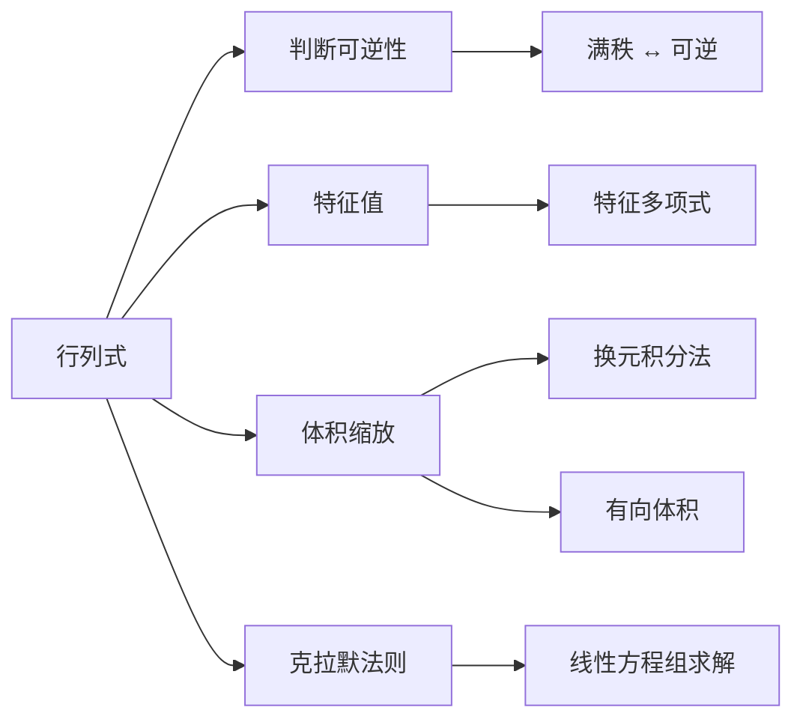

---
tags:
  - Math
  - LinearAlgebra
  - 定义性
  - 方法性
title: Determinant
created: 2026-06-10
modified:
---

# Determinant

> [!abstract] 概述
> **行列式**（determinant）是方阵 $\mathbf{A}$ 的一个标量函数 $\det(\mathbf{A})$，它刻画了线性变换对空间的**缩放比例**。二阶行列式的绝对值等于平行四边形的面积，三阶行列式的绝对值等于平行六面体的体积——这个几何直觉在任意维度都成立。行列式还是判断矩阵是否可逆的"开关"：$\det(\mathbf{A}) \neq 0 \iff \mathbf{A}$ 可逆。

## 1. 核心概念：一句话概括

对于 $n$ 阶方阵 $\mathbf{A}$，行列式 $\det(\mathbf{A})$ 回答了这样一个问题：**这个线性变换把空间的体积（面积）放大了多少倍？**

- 若 $\det(\mathbf{A}) = 2$：体积变为原来的 2 倍（拉伸）
- 若 $\det(\mathbf{A}) = 0.5$：体积缩小了一半（压缩）
- 若 $\det(\mathbf{A}) = 0$：体积被压成了零——矩阵**奇异**（不可逆），说明变换把某些维度"压扁"了
- 若 $\det(\mathbf{A}) < 0$：体积反转了方向（空间被"翻面"了）

> [!tip] 直观感受
> 想象一个单位正方形，其四个顶点是 $(0,0), (1,0), (1,1), (0,1)$。用矩阵 $\mathbf{A} = \begin{bmatrix}2 & 1 \\ 1 & 2\end{bmatrix}$ 作用后，这个正方形变为一个平行四边形，其面积就是 $|\det(\mathbf{A})| = 3$。行列式就是"面积放大了 3 倍"这个倍数。

## 2. 定义

### 2.1 $2 \times 2$ 矩阵

最简单的形式——二阶行列式：

$$
\det\begin{bmatrix} a & b \\ c & d \end{bmatrix} = ad - bc
$$

几何意义：$\begin{bmatrix}a \\ c\end{bmatrix}$ 和 $\begin{bmatrix}b \\ d\end{bmatrix}$ 两个列向量张成的平行四边形的**有向面积**。

> [!info] 为什么是 $ad - bc$？
> 从面积公式出发：平行四边形的面积 = |列向量| × |夹角的 sin|。设 $\mathbf{v}_1 = (a,c)$, $\mathbf{v}_2 = (b,d)$，计算 $\mathbf{v}_1$ 旋转 90° 后与 $\mathbf{v}_2$ 的点积，就得到 $ad - bc$。或者说，$ad - bc$ 是叉积 $\mathbf{v}_1 \times \mathbf{v}_2$ 在二维中的对应量。

### 2.2 $3 \times 3$ 矩阵

三阶行列式（使用**代数余子式展开**，也称**拉普拉斯展开**）：

$$
\det\begin{bmatrix}
a_{11} & a_{12} & a_{13} \\
a_{21} & a_{22} & a_{23} \\
a_{31} & a_{32} & a_{33}
\end{bmatrix}
= a_{11}\det\begin{bmatrix}a_{22}&a_{23}\\a_{32}&a_{33}\end{bmatrix} - a_{12}\det\begin{bmatrix}a_{21}&a_{23}\\a_{31}&a_{33}\end{bmatrix} + a_{13}\det\begin{bmatrix}a_{21}&a_{22}\\a_{31}&a_{32}\end{bmatrix}
$$

即：

$$
\det(\mathbf{A}) = a_{11}(a_{22}a_{33} - a_{23}a_{32}) - a_{12}(a_{21}a_{33} - a_{23}a_{31}) + a_{13}(a_{21}a_{32} - a_{22}a_{31})
$$

几何意义：三个列向量张成的平行六面体的**有向体积**。

### 2.3 $n \times n$ 矩阵：递归定义

对于一般 $n \times n$ 矩阵，行列式可通过**拉普拉斯展开**递归定义：

**按第一行展开：**

$$
\det(\mathbf{A}) = \sum_{j=1}^{n} (-1)^{1+j} a_{1j} \, M_{1j}
$$

其中 $M_{ij}$ 是**子式**（minor）——删去第 $i$ 行、第 $j$ 列后得到的 $(n-1)\times(n-1)$ 矩阵的行列式。$(-1)^{i+j}M_{ij}$ 称为**代数余子式**（cofactor）$C_{ij}$。

**一般按第 $i$ 行展开：**

$$
\det(\mathbf{A}) = \sum_{j=1}^{n} a_{ij} C_{ij}, \quad C_{ij} = (-1)^{i+j} M_{ij}
$$

> [!warning] 注意
> 按不同行或不同列展开得到的 $\det(\mathbf{A})$ 是相同的——行列式的定义与展开路径无关，这是一个"先有结论后证明一致性"的递归定义。

### 2.4 莱布尼茨公式（置换定义）

行列式还有一个等价的组合定义——**莱布尼茨公式**：

$$
\det(\mathbf{A}) = \sum_{\sigma \in S_n} \text{sgn}(\sigma) \prod_{i=1}^{n} a_{i,\sigma(i)}
$$

其中 $S_n$ 是 $n$ 个元素的置换群，$\text{sgn}(\sigma)$ 是置换 $\sigma$ 的符号（偶置换为 $+1$，奇置换为 $-1$）。

**对于 $2\times2$**：$S_2 = \{\text{id}, (1\;2)\}$，对应的符号分别为 $+1, -1$，所以 $\det = a_{11}a_{22} - a_{12}a_{21}$。

> [!info] 理论价值 vs 计算价值
> 莱布尼茨公式有 $n!$ 项——对 $n=10$ 就是 3628800 项，**完全不适合计算**。但它在理论推导中极为有用，是证明行列式乘法定理 $\det(\mathbf{AB}) = \det(\mathbf{A})\det(\mathbf{B})$ 的利器。

## 3. 几何意义

行列式的核心几何意义：**线性变换的缩放因子**。

| 维度 | 几何对象 | 有向体积公式 |
|:----:|:---------|:------------|
| $n=2$ | 列向量张成的平行四边形面积 | $\det(\mathbf{A})$ |
| $n=3$ | 列向量张成的平行六面体体积 | $\det(\mathbf{A})$ |
| $n$ | 列向量张成的 $n$ 维平行多面体体积 | $\det(\mathbf{A})$ |

> [!tip] 符号的意义
> - $\det(\mathbf{A}) > 0$：变换保持空间定向（右手系→右手系）
> - $\det(\mathbf{A}) < 0$：变换反转空间定向（右手系→左手系）
> - $\det(\mathbf{A}) = 0$：变换将 $n$ 维空间压入更低维度——信息丢失，不可逆

**对于线性变换 $T(\mathbf{x}) = \mathbf{A}\mathbf{x}$**，变换后的体积 = $|\det(\mathbf{A})| \times$ 原始体积。这就是**变量替换公式**（换元积分法）中雅可比行列式 $|J|$ 的由来：

$$
\int_{T(\Omega)} f(\mathbf{y}) \, d\mathbf{y} = \int_{\Omega} f(T(\mathbf{x})) \, |\det(\mathbf{A})| \, d\mathbf{x}
$$

## 4. 行列式的性质

### 4.1 基本性质

| # | 性质 | 公式 | 直觉 |
|:-:|:----|:-----|:-----|
| 1 | **单位阵** | $\det(\mathbf{I}) = 1$ | 单位立方体体积为 1 |
| 2 | **行交换反号** | 交换两行 → $\det$ 变号 | 翻面→定向反转 |
| 3 | **行数乘** | 某行乘以 $c$ → $\det$ 乘以 $c$ | 一个维度拉伸 $c$ 倍 |
| 4 | **行加法不变** | 一行加上另一行的倍数 → $\det$ 不变 | 剪切不改变体积 |
| 5 | **乘积** | $\det(\mathbf{AB}) = \det(\mathbf{A})\det(\mathbf{B})$ | 两次缩放相乘 |
| 6 | **转置** | $\det(\mathbf{A}^T) = \det(\mathbf{A})$ | 行列对称性 |
| 7 | **对角阵** | $\det(\text{diag}(d_1,\dots,d_n)) = d_1d_2\cdots d_n$ | 各方向独立缩放 |
| 8 | **三角阵** | 上下三角矩阵的行列式 = 对角元乘积 | 同上 |
| 9 | **逆的行列式** | $\det(\mathbf{A}^{-1}) = 1 / \det(\mathbf{A})$ | 逆变换的缩放是倒数 |

> [!tip] 性质 2-4 的深层意义
> 这三条性质（交替性 + 多重线性）实际上**唯一确定**了行列式函数。很多教科书从这三条性质出发公理化地定义行列式，而非从具体的展开公式定义。这种观点更接近"行列式本质上是唯一的交替多重线性形式"这一代数本质。

### 4.2 奇异矩阵判定

$$
\boxed{\det(\mathbf{A}) = 0 \iff \mathbf{A} \text{ 是奇异矩阵（不可逆）}}
$$

等价描述：
- $\mathbf{A}$ 的列向量线性相关
- $\mathbf{A}$ 的行向量线性相关
- $\text{rank}(\mathbf{A}) < n$
- $0$ 是 $\mathbf{A}$ 的一个特征值

## 5. 计算方法

### 5.1 拉普拉斯展开（适合小矩阵）

$$
\det(\mathbf{A}) = \sum_{j=1}^{n} a_{ij} (-1)^{i+j} M_{ij}
$$

沿**包含最多零元素**的行或列展开可减少计算量。复杂度 $O(n!)$——仅适合 $n \le 4$。

### 5.2 行化简法（适合中等矩阵）

利用初等行变换将矩阵化为行阶梯形（上三角矩阵），然后对角元相乘即得行列式：

1. **行交换** → 行列式乘以 $-1$
2. **一行乘以 $c$** → 行列式乘以 $c$
3. **一行加上另一行的 $c$ 倍** → 行列式**不变**

> [!tip] 计算策略
> 用性质 4（不改变行列式）消除主元下方的元素，将矩阵化为上三角形式，复杂度降至 $O(n^3)$——这是计算机计算行列式的标准方式。

**示例：**

$$
\mathbf{A} = \begin{bmatrix}
2 & 4 & 6 \\
1 & 3 & 5 \\
0 & 2 & 7
\end{bmatrix}
\xrightarrow{R_1/2}
\begin{bmatrix}
1 & 2 & 3 \\
1 & 3 & 5 \\
0 & 2 & 7
\end{bmatrix}
\xrightarrow{R_2 - R_1}
\begin{bmatrix}
1 & 2 & 3 \\
0 & 1 & 2 \\
0 & 2 & 7
\end{bmatrix}
\xrightarrow{R_3 - 2R_2}
\begin{bmatrix}
1 & 2 & 3 \\
0 & 1 & 2 \\
0 & 0 & 3
\end{bmatrix}
$$

$\det(\mathbf{A}) = 2 \times (1 \times 1 \times 3) = 6$（第一步除以 2 导致行列式减半，需乘回因子 2）。

### 5.3 利用块矩阵

对于分块三角矩阵：

$$
\det\begin{bmatrix} \mathbf{A} & \mathbf{B} \\ \mathbf{0} & \mathbf{D} \end{bmatrix} = \det(\mathbf{A})\det(\mathbf{D})
$$

这类似于对角阵的情况，对分块计算非常有用。

### 5.4 特征值法

若 $\mathbf{A}$ 的特征值为 $\lambda_1, \lambda_2, \dots, \lambda_n$，则：

$$
\det(\mathbf{A}) = \lambda_1 \lambda_2 \cdots \lambda_n
$$

这是行列式等于**所有特征值的乘积**这一重要定理的应用。

## 6. 应用

### 6.1 判断矩阵可逆性

$\det(\mathbf{A}) \neq 0 \iff \mathbf{A}$ 可逆。这是行列式最直接的应用。

### 6.2 克拉默法则（Cramer's Rule）

解线性方程组 $\mathbf{A}\mathbf{x} = \mathbf{b}$（其中 $\det(\mathbf{A}) \neq 0$）：

$$
x_i = \frac{\det(\mathbf{A}_i)}{\det(\mathbf{A})}
$$

其中 $\mathbf{A}_i$ 是将 $\mathbf{A}$ 的第 $i$ 列替换为 $\mathbf{b}$ 得到的矩阵。

> [!warning] 实用限制
> 克拉默法则有重要的理论价值，但计算效率极低（需要计算 $n+1$ 个行列式，每个 $O(n^3)$）。实际解线性方程组应使用高斯消元法，而不是克拉默法则。

### 6.3 伴随矩阵求逆

$$
\mathbf{A}^{-1} = \frac{1}{\det(\mathbf{A})} \text{adj}(\mathbf{A})
$$

其中 $\text{adj}(\mathbf{A})$ 是**伴随矩阵**（adjugate matrix）——由代数余子式 $C_{ij}$ 构成的矩阵的转置。这就是 [[Matrix Inverse]] 中二阶求逆公式 $\frac{1}{ad-bc}\begin{bmatrix}d & -b \\ -c & a\end{bmatrix}$ 的 $n$ 维推广。

### 6.4 特征多项式

矩阵 $\mathbf{A}$ 的特征值满足特征方程：

$$
\det(\mathbf{A} - \lambda\mathbf{I}) = 0
$$

这是 [[Eigenvalues and Eigenvectors]] 的核心方程。展开这个行列式得到一个 $n$ 次多项式 $p(\lambda)$，其根就是特征值。

### 6.5 雅可比行列式（多变量微积分）

在多元换元积分法中，$\det(J)$ 给出了坐标变换下的体积缩放因子：

$$
\iint_{T(D)} f(x,y)\,dx\,dy = \iint_D f(u,v) \,|\det(J)|\, du\,dv
$$

其中 $J = \begin{bmatrix} \partial x/\partial u & \partial x/\partial v \\ \partial y/\partial u & \partial y/\partial v \end{bmatrix}$ 是雅可比矩阵。

### 6.6 沃罗诺伊图与体积计算

在计算几何中，行列式用于计算单纯形的有向体积——$n$ 维单纯形的体积公式为 $\frac{1}{n!}|\det(\mathbf{V})|$，其中 $\mathbf{V}$ 是由顶点构成的矩阵。

## 7. 与相关概念的联系

## Quick Reference / Cheatsheet

### Key Formulas

| 场景 | 公式 | 复杂度 |
|:-----|:-----|:------:|
| $2\times2$ 行列式 | $ad - bc$ | $O(1)$ |
| $3\times3$ 行列式 | 展开公式 | $O(6)$ |
| $n\times n$ 拉普拉斯展开 | $\sum_j a_{ij} (-1)^{i+j} M_{ij}$ | $O(n!)$ |
| $n\times n$ 行化简法 | 化为上三角 → 对角元乘积 | $O(n^3)$ |
| 通过特征值 | $\lambda_1 \lambda_2 \cdots \lambda_n$ | $O(n^3)$ |
| 乘积公式 | $\det(\mathbf{AB}) = \det(\mathbf{A})\det(\mathbf{B})$ | — |
| 逆矩阵行列式 | $\det(\mathbf{A}^{-1}) = 1/\det(\mathbf{A})$ | — |

### Key Intuitions

- **行列式是缩放因子**：不是面积/体积本身，而是**倍数**
- **$\det = 0$ = 信息丢失**：至少一个维度被压扁，不可逆
- **$\det < 0$ = 翻面**：空间定向反转，但绝对值仍是缩放倍数
- **$\det$ 对行操作敏感**：行交换反号，行数乘放缩，行加法不变
- **不要把符号忘记**：拉普拉斯展开的 $(-1)^{i+j}$ 项极易漏写

### Common Pitfalls

- **混淆 $2\times2$ 和 $3\times3$ 公式**：$3\times3$ 不是简单的 $ad - bc$ 模式的推广，而是交替求和
- **行化简时忘记记录因子**：每一次行交换（$-\!1$）和行数乘（因子 $c$）都会影响行列式，必须累积追踪
- **认为 $\det(\mathbf{A} + \mathbf{B}) = \det(\mathbf{A}) + \det(\mathbf{B})$**：**错误！** 行列式对矩阵加法不满足线性
- **认为 $\det(c\mathbf{A}) = c\det(\mathbf{A})$**：**错误！** 正确的是 $\det(c\mathbf{A}) = c^n \det(\mathbf{A})$（$n$ 阶矩阵每行都乘以 $c$）
- **克拉默法则用于实际解方程**：理论价值高，但 $O((n+1)n^3)$ 的复杂度在实践中毫无竞争力

## 相关链接

- [[Matrix Inverse]]（行列式判断可逆 + 伴随矩阵求逆）
- [[Eigenvalues and Eigenvectors]]（特征多项式 $\det(\mathbf{A} - \lambda\mathbf{I}) = 0$）
- [[Matrix Operations]]（矩阵基础运算，含行列式与其他运算的关系）
- [[Diagonalization]]（$\det(\mathbf{A}) = \prod \lambda_i$）
- [[Linear Transformations]]（行列式作为线性变换的缩放因子）
- [[Rank and Nullity]]（$\det = 0 \iff \text{rank} < n$）
- [[Vector Spaces and Subspaces]]（行列式的多重线性代数背景）
