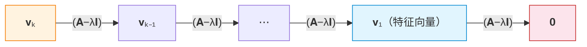

# Jordan Canonical Form

## 1. 对角化的局限：什么时候"不行"？

[[Diagonalization]] 说：如果 $n\times n$ 矩阵 $\mathbf{A}$ 有 $n$ 个线性无关的特征向量，就能 $\mathbf{A} = \mathbf{P}\mathbf{D}\mathbf{P}^{-1}$。但**不是所有矩阵都有 $n$ 个线性无关的特征向量**。

失败条件：某特征值 $\lambda$ 的**几何重数**（$\dim\ker(\mathbf{A}-\lambda\mathbf{I})$） < **代数重数**（特征多项式中的重根次数）。

> **例（不可对角化的 2×2）：** $\mathbf{A}=\begin{pmatrix}2 & 1 \\ 0 & 2\end{pmatrix}$。特征多项式 $(\lambda-2)^2$，代数重数 $=2$；但 $\mathbf{A}-2\mathbf{I}=\begin{pmatrix}0 & 1 \\ 0 & 0\end{pmatrix}$ 秩为 1，几何重数 $=1$。**不可对角化**。

Jordan 标准型是"最佳近似"：对角化做不到时，把矩阵拆成**几乎对角**的块——每块对角线上放特征值，超对角线上放 1。

## 2. Jordan 块的定义

$k\times k$ **Jordan 块** $J_k(\lambda)$：

$$
J_k(\lambda) = \begin{pmatrix}
\lambda & 1 & 0 & \cdots & 0 \\
0 & \lambda & 1 & \cdots & 0 \\
0 & 0 & \lambda & \cdots & 0 \\
\vdots & \vdots & \vdots & \ddots & 1 \\
0 & 0 & 0 & \cdots & \lambda
\end{pmatrix}_{k\times k}
$$

对角线全为 $\lambda$，超对角线全为 1，其余全为 0。

> $J_2(5)=\begin{pmatrix}5 & 1 \\ 0 & 5\end{pmatrix},\quad J_3(-1)=\begin{pmatrix}-1 & 1 & 0 \\ 0 & -1 & 1 \\ 0 & 0 & -1\end{pmatrix}$

## 3. Jordan 标准型

**Jordan 标准型**是分块对角矩阵，每块是 Jordan 块：

$$
\mathbf{J} = \begin{pmatrix}
J_{k_1}(\lambda_1) & 0 & \cdots & 0 \\
0 & J_{k_2}(\lambda_2) & \cdots & 0 \\
\vdots & \vdots & \ddots & \vdots \\
0 & 0 & \cdots & J_{k_m}(\lambda_m)
\end{pmatrix}
$$

**核心定理：** 任意 $n\times n$ 复方阵 $\mathbf{A}$ 都**相似**于某个 $\mathbf{J}$，即 $\exists\,\mathbf{P}$ 可逆使得 $\mathbf{A} = \mathbf{P}\mathbf{J}\mathbf{P}^{-1}$。

> 同一特征值可对应多个 Jordan 块。Jordan 块的数量 = 几何重数。

## 4. 广义特征向量

### 4.1 定义

$\mathbf{v}\neq\mathbf{0}$ 是 $\mathbf{A}$ 关于 $\lambda$ 的**广义特征向量**（秩 $k$），如果

$$
(\mathbf{A}-\lambda\mathbf{I})^k\mathbf{v} = \mathbf{0},\quad (\mathbf{A}-\lambda\mathbf{I})^{k-1}\mathbf{v} \neq \mathbf{0}
$$

### 4.2 Jordan 链

一组广义特征向量 $\{\mathbf{v}_1,\dots,\mathbf{v}_k\}$ 构成 **Jordan 链**，如果

$$
\begin{cases}
(\mathbf{A}-\lambda\mathbf{I})\mathbf{v}_1 = \mathbf{0} \\
(\mathbf{A}-\lambda\mathbf{I})\mathbf{v}_2 = \mathbf{v}_1 \\
\quad\vdots \\
(\mathbf{A}-\lambda\mathbf{I})\mathbf{v}_k = \mathbf{v}_{k-1}
\end{cases}
$$

链长 $k$ = Jordan 块大小。从链尾到链首，每次乘 $(\mathbf{A}-\lambda\mathbf{I})$ 向前一步：

## 5. 例子

### 5.1 2×2：一个 Jordan 块

$$
\mathbf{A} = \begin{pmatrix}4 & 1 \\ -1 & 2\end{pmatrix}
$$

- $p(\lambda)=(\lambda-3)^2$，代数重数 2。$\mathbf{A}-3\mathbf{I}=\begin{pmatrix}1 & 1 \\ -1 & -1\end{pmatrix}$ 秩 1，几何重数 1。
- 特征向量 $\mathbf{v}_1=\begin{pmatrix}1 \\ -1\end{pmatrix}$，解 $(\mathbf{A}-3\mathbf{I})\mathbf{v}_2=\mathbf{v}_1$ 得 $\mathbf{v}_2=\begin{pmatrix}1 \\ 0\end{pmatrix}$。
- $\mathbf{J}=\begin{pmatrix}3 & 1 \\ 0 & 3\end{pmatrix},\quad \mathbf{P}=\begin{pmatrix}1 & 1 \\ -1 & 0\end{pmatrix}$。

### 5.2 3×3：两个 Jordan 块

$$
\mathbf{A}=\begin{pmatrix}5 & 0 & 0 \\ 0 & 5 & 1 \\ 0 & 0 & 5\end{pmatrix}
$$

$p(\lambda)=(\lambda-5)^3$，代数重数 3。$\mathbf{A}-5\mathbf{I}=\begin{pmatrix}0 & 0 & 0 \\ 0 & 0 & 1 \\ 0 & 0 & 0\end{pmatrix}$ 秩 1，几何重数 2。$\mathbf{A}$ 本身已是 Jordan 标准型：$J_1(5)\oplus J_2(5)$。

### 5.3 3×3：计算完整的 Jordan 标准型

$$
\mathbf{B} = \begin{pmatrix}6 & -1 & 1 \\ 0 & 5 & 0 \\ -1 & 1 & 4\end{pmatrix}
$$

**步骤 1：** $\det(\mathbf{B}-\lambda\mathbf{I}) = -(\lambda-5)^3$，代数重数 3。

**步骤 2：** $\mathbf{B}-5\mathbf{I}=\begin{pmatrix}1 & -1 & 1 \\ 0 & 0 & 0 \\ -1 & 1 & -1\end{pmatrix}$ 秩 1，几何重数 $=2$。两个 Jordan 块：$J_1(5)\oplus J_2(5)$。

**步骤 3：** 特征向量满足 $v_1-v_2+v_3=0$，取 $\mathbf{v}_1=\begin{pmatrix}1\\1\\0\end{pmatrix},\ \mathbf{v}_1'=\begin{pmatrix}0\\1\\1\end{pmatrix}$。

**步骤 4：** 解 $(\mathbf{B}-5\mathbf{I})\mathbf{v}_2=\mathbf{v}_1$ 得 $\mathbf{v}_2=\begin{pmatrix}1\\0\\0\end{pmatrix}$，$\mathbf{v}_1$ 是长链起点。

**步骤 5：** $\displaystyle \mathbf{P}=\begin{pmatrix}1 & 1 & 0 \\ 1 & 0 & 1 \\ 0 & 0 & 1\end{pmatrix},\quad \mathbf{J}=\begin{pmatrix}5 & 1 & 0 \\ 0 & 5 & 0 \\ 0 & 0 & 5\end{pmatrix}$。

## 6. 最小多项式

**最小多项式** $m(\lambda)$ 是使 $m(\mathbf{A})=\mathbf{0}$ 的最低次首一多项式。

- 根是特征值；**重数 = 该特征值的最大 Jordan 块大小**（非代数重数）。

> $ \mathbf{A}=J_2(3)\oplus J_1(3)$：特征多项式 $(\lambda-3)^3$，最小多项式 $(\lambda-3)^2$。

[[Cayley-Hamilton Theorem]]：$p(\mathbf{A})=\mathbf{0}$，故 $m(\lambda)\mid p(\lambda)$。可对角化时所有 Jordan 块大小为 1，此时 $m(\lambda)$ 无重根。

## 7. 核心连接

| 概念 | 与 Jordan 标准型的关系 |
|---|---|
| [[Diagonalization]] | 对角化 = 所有 Jordan 块大小为 1 的特殊情况 |
| [[Eigenvalues and Eigenvectors]] | 特征值 → Jordan 块对角元；几何重数 = 块数；代数重数 = 块大小之和 |
| [[Cayley-Hamilton Theorem]] | $p(\mathbf{A})=\mathbf{0}$；最小多项式是 $p$ 的因式，重数由最大 Jordan 块决定 |

## 8. 应用

### 8.1 矩阵指数 $e^{\mathbf{A}}$（用于微分方程组）

对 $J_k(\lambda)$：

$$
e^{tJ_k(\lambda)} = e^{\lambda t}
\begin{pmatrix}
1 & t & \frac{t^2}{2!} & \cdots & \frac{t^{k-1}}{(k-1)!} \\
0 & 1 & t & \cdots & \frac{t^{k-2}}{(k-2)!} \\
0 & 0 & 1 & \cdots & \frac{t^{k-3}}{(k-3)!} \\
\vdots & \vdots & \vdots & \ddots & \vdots \\
0 & 0 & 0 & \cdots & 1
\end{pmatrix}
$$

> $e^{tJ_2(\lambda)} = e^{\lambda t}\begin{pmatrix}1 & t \\ 0 & 1\end{pmatrix},\quad e^{J_2(\lambda)} = e^{\lambda}\begin{pmatrix}1 & 1 \\ 0 & 1\end{pmatrix}$

一般地，$\mathbf{A}=\mathbf{P}\mathbf{J}\mathbf{P}^{-1} \Rightarrow e^{\mathbf{A}}=\mathbf{P}e^{\mathbf{J}}\mathbf{P}^{-1}$。

### 8.2 任意矩阵函数 $f(\mathbf{A})$

$f$ 在 $\lambda$ 处解析时：

$$
f(J_k(\lambda)) =
\begin{pmatrix}
f(\lambda) & f'(\lambda) & \frac{f''(\lambda)}{2!} & \cdots & \frac{f^{(k-1)}(\lambda)}{(k-1)!} \\
0 & f(\lambda) & f'(\lambda) & \cdots & \frac{f^{(k-2)}(\lambda)}{(k-2)!} \\
0 & 0 & f(\lambda) & \cdots & \frac{f^{(k-3)}(\lambda)}{(k-3)!} \\
\vdots & \vdots & \vdots & \ddots & \vdots \\
0 & 0 & 0 & \cdots & f(\lambda)
\end{pmatrix}
$$

即 $f$ 在 $\lambda$ 处的 Taylor 级数截断到 $k-1$ 阶——Jordan 标准型把矩阵函数计算变成了求导问题。

> $\sin J_2(\pi)=\begin{pmatrix}\sin\pi & \cos\pi \\ 0 & \sin\pi\end{pmatrix}=\begin{pmatrix}0 & -1 \\ 0 & 0\end{pmatrix}$。

## 9. 总结

Jordan 标准型回答了线性代数的根本问题：**对角化做不到时，最佳替代是什么？** 答案是用超对角线上的 1 来补足缺失的特征向量。广义特征向量和 Jordan 链提供了构造机制，最小多项式刻画了块尺寸。无论是解微分方程组、计算矩阵函数，还是理解线性变换的深层结构，Jordan 标准型都不可或缺。
