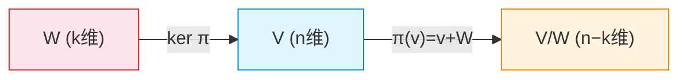

# Quotient Space

## 1. 核心概念：一句话概括

**商空间**（quotient space）是把向量空间中"我们不关心的方向"压缩为零，从而得到一个更小的空间。这类似于群论中将正规子群压缩为恒等元得到商群——线性代数中有完全平行的构造：把子空间 $W$ 压缩为零向量，得到 $V/W$。

## 2. 定义

设 $W$ 是 $V$ 的一个[[Vector Spaces and Subspaces|子空间]]。在 $V$ 上定义一个**等价关系**（equivalence relation）：

$$
v \sim u \iff v - u \in W
$$

从这个等价关系出发，可以定义**陪集**（coset）：

$$
v + W = \{v + w \mid w \in W\}
$$

所有陪集的集合称为**商空间**（quotient space）：

$$
V / W = \{ v + W \mid v \in V \}
$$

### 2.1 加法和数乘

在 $V/W$ 上定义线性运算：

- **加法：** $(v + W) + (u + W) = (v + u) + W$
- **数乘：** $c(v + W) = cv + W$

> [!warning] 良好定义性
> 必须验证这些运算不依赖于代表元（representative）的选择。如果 $v + W = v' + W$ 且 $u + W = u' + W$，那么 $v - v' \in W$ 且 $u - u' \in W$，所以 $(v+u) - (v'+u') \in W$（因为 $W$ 对加法封闭），从而 $(v+u)+W = (v'+u')+W$。数乘的验证同样依赖于 $W$ 对数乘封闭。正是子空间 $W$ 对加法和数乘的**封闭性**保证了运算良好定义。

## 3. 维数公式

$$
\boxed{\dim(V / W) = \dim(V) - \dim(W)}
$$

**证明：** 取 $W$ 的一组基 $\{w_1, \dots, w_k\}$，将其扩展为 $V$ 的一组基 $\{w_1, \dots, w_k, v_{k+1}, \dots, v_n\}$。那么 $\{v_{k+1} + W, \dots, v_n + W\}$ 是 $V/W$ 的一组基：
- **张成性：** 任取 $v + W$，将 $v$ 用 $V$ 的基线性表示，落在 $W$ 中的分量在陪集中为零，剩余部分由 $v_{k+1}+W$ 至 $v_n+W$ 张成。
- **线性无关：** 若 $\sum c_i (v_i + W) = 0+W$，则 $\sum c_i v_i \in W$，因而可唯一地由 $w_1,\dots,w_k$ 表示，迫使所有 $c_i = 0$。

> [!tip] 直觉
> 商空间的维数就是在"模去"子空间 $W$ 后剩下的维数。你是把 $W$ 压成了一个点（零向量），原来的 $n$ 维空间变成了 $n-k$ 维。

## 4. 典型例子

| 空间 $V$ | 子空间 $W$ | 商空间 $V/W$ | 同构于 |
|:--|:--|:--|:--|
| $\mathbb{R}^3$ | $xy$-平面 ($z=0$) | 所有平行于 $z$ 轴的平面 | $\mathbb{R}^1$（$z$ 轴） |
| $\mathbb{R}^n$ | $\text{span}\{e_1\}$ | 所有第一坐标被"压平"的向量 | $\mathbb{R}^{n-1}$ |
| $\mathcal{P}_n$（$n$ 次多项式） | $\mathcal{P}_{k}$（$k$ 次多项式，$k<n$） | 次数大于 $k$ 的部分 | $\mathcal{P}_{n-k-1}$ |

> [!info] 几何理解
> $\mathbb{R}^3 / xy\text{-平面}$ 中的每个元素是一个平行于 $xy$-平面的平面。两个平面相加得到另一个平行平面，数乘则改变平面高度。整个商空间就是一维的——只由"高度"决定。

## 5. 自然投影映射

定义**自然投影**（canonical projection）$\pi: V \to V/W$ 为：

$$
\pi(v) = v + W
$$

- $\pi$ 是**满射**线性变换（每个陪集都有代表元）；
- $\ker \pi = W$（$v+W = 0+W$ 当且仅当 $v \in W$）；
- $\operatorname{im} \pi = V/W$。

由[[Rank and Nullity|秩-零化度定理]]，$\dim V = \dim \ker \pi + \dim \operatorname{im} \pi = \dim W + \dim(V/W)$——这给出了维数公式的另一个证明。

## 6. 第一同构定理

**定理（向量空间版本）：** 对任意线性变换 $T: V \to U$，有：

$$
V / \ker T \cong \operatorname{im} T
$$

**证明要点：** 定义 $\tilde{T}: V/\ker T \to \operatorname{im} T$ 为 $\tilde{T}(v + \ker T) = T(v)$。验证 $\tilde{T}$ 是良定义的、线性的、双射。

> [!info] 统一图景
> 这与群论中的第一同构定理 $G / \ker \varphi \cong \operatorname{im} \varphi$ 是完全平行的结构。事实上，**所有代数结构（群、环、模、向量空间）的第一同构定理本质上是同一个定理**——它说的是：任何同态像都能被核的商唯一刻画。

## 7. 核心连接

- [[Vector Spaces and Subspaces]] — 子空间的定义、直和
- [[Linear Transformations]] — 投影映射、第一同构定理
- [[Rank and Nullity]] — 维数守恒的另一种视角
- [[Normal Subgroups and Quotient Groups]] — 商群 vs 商空间：完全平行的构造

## 8. 商空间与正交补的对比

| 特性 | 商空间 $V/W$ | 正交补 $W^\perp$ |
|:--|:--|:--|
| 依赖内积？ | ❌ 不需要 | ✅ 需要内积 |
| 元素是什么？ | 陪集 $v+W$ | 向量 $u$ 满足 $\langle u, w \rangle = 0$ |
| 与 $W$ 的关系 | $V/W \cong W^\perp$（当有内积时） | $V = W \oplus W^\perp$ |
| 本质 | **内在的**（intrinsic） | **额外的**（requires extra structure） |

> [!tip] 为什么这很重要
> 商空间不依赖内积，这意味着它在更广泛的场景中有效——比如多项式空间、函数空间、或者任何一个没有定义内积的向量空间。正交补虽然计算上更具体，但需要额外的几何结构（内积）来定义。在泛函分析中，巴拿赫空间的商空间是核心工具，而希尔伯特空间才使用正交补。

## 9. 总结

商空间是"模去无用信息"的精确数学语言：当 $W$ 中的信息对你没有价值时，$V/W$ 就是剥离这些信息后剩下的结构。这种思想贯穿整个数学——从线性方程组的解空间（$V/\ker T$ 刻画所有解的结构）到数据分析（PCA 的主成分可以理解为在高维空间中"商掉"方差最小的方向）。
