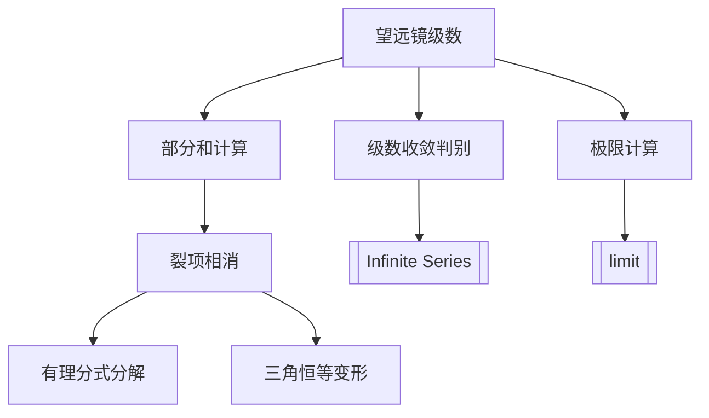

---
tags:
  - Math
  - Calculus
  - 定义性
title: Telescoping Series (望远镜级数)
created: 2026-03-28T00:00:00
modified:
---

# Telescoping Series (望远镜级数)

## 1. 定义

望远镜级数是一类特殊形式的级数，其部分和中的中间项会相互抵消，只留下首尾少数几项。

**一般形式**：
$$\sum_{n=1}^{\infty} (a_n - a_{n+1}) = (a_1 - a_2) + (a_2 - a_3) + (a_3 - a_4) + \cdots$$

## 2. 核心原理：裂项相消

### 2.1 部分和的简化

计算前 n 项部分和：
$$S_n = \sum_{k=1}^{n} (a_k - a_{k+1})$$

展开观察消去过程：
$$S_n = (a_1 - a_2) + (a_2 - a_3) + \cdots + (a_n - a_{n+1}) = a_1 - a_{n+1}$$

### 2.2 消去过程图示

展开部分和 $S_n$：
$$S_n = (a_1 - a_2) + (a_2 - a_3) + (a_3 - a_4) + \cdots + (a_n - a_{n+1})$$

消去过程：
- $a_1$ 保留 ✓
- $-a_2$ 与 $+a_2$ 抵消 ✗
- $-a_3$ 与 $+a_3$ 抵消 ✗
- $\vdots$
- $-a_n$ 与 $+a_n$ 抵消 ✗
- $-a_{n+1}$ 保留 ✓

**结果**：$S_n = a_1 - a_{n+1}$

中间项 $a_2, a_3, \ldots, a_n$ 全部相互抵消，只剩首项 $a_1$ 和末项 $-a_{n+1}$。

## 3. 收敛判别

### 3.1 收敛条件

望远镜级数 $\sum_{n=1}^{\infty} (a_n - a_{n+1})$ 收敛的充要条件是：
$$\lim_{n \to \infty} a_n \text{ 存在且有限}$$

### 3.2 级数的和

若级数收敛，则和为：
$$\sum_{n=1}^{\infty} (a_n - a_{n+1}) = a_1 - \lim_{n \to \infty} a_{n+1} = a_1 - L$$

其中 $L = \lim_{n \to \infty} a_n$。

## 4. 常见类型与裂项技巧

### 4.1 类型一：分式裂项

**基本公式**：
$$\frac{1}{n(n+1)} = \frac{1}{n} - \frac{1}{n+1}$$

**例题**：求 $\sum_{n=1}^{\infty} \frac{1}{n(n+1)}$

**解**：
$$S_n = \sum_{k=1}^{n} \left(\frac{1}{k} - \frac{1}{k+1}\right) = 1 - \frac{1}{n+1}$$

$$\sum_{n=1}^{\infty} \frac{1}{n(n+1)} = \lim_{n \to \infty} S_n = 1$$

### 4.2 类型二：推广的分式裂项

**公式**：$\frac{1}{n(n+k)} = \frac{1}{k}\left(\frac{1}{n} - \frac{1}{n+k}\right)$

**例题**：求 $\sum_{n=1}^{\infty} \frac{1}{n(n+2)}$

**解**：
$$\frac{1}{n(n+2)} = \frac{1}{2}\left(\frac{1}{n} - \frac{1}{n+2}\right)$$

$$S_n = \frac{1}{2}\left[\left(1 - \frac{1}{3}\right) + \left(\frac{1}{2} - \frac{1}{4}\right) + \cdots + \left(\frac{1}{n} - \frac{1}{n+2}\right)\right]$$

$$= \frac{1}{2}\left(1 + \frac{1}{2} - \frac{1}{n+1} - \frac{1}{n+2}\right)$$

$$\sum_{n=1}^{\infty} \frac{1}{n(n+2)} = \frac{1}{2}\left(1 + \frac{1}{2}\right) = \frac{3}{4}$$

### 4.3 类型三：对数裂项

**公式**：$\ln\frac{n+1}{n} = \ln(n+1) - \ln n$

**例题**：求 $\sum_{n=1}^{\infty} \ln\frac{n(n+2)}{(n+1)^2}$

**解**：
$$\ln\frac{n(n+2)}{(n+1)^2} = \ln n + \ln(n+2) - 2\ln(n+1)$$

$$= [\ln(n+2) - \ln(n+1)] - [\ln(n+1) - \ln n]$$

$$= \ln\frac{n+2}{n+1} - \ln\frac{n+1}{n}$$

设 $a_n = \ln\frac{n+1}{n}$，则原式 $= a_{n+1} - a_n$

$$S_n = a_{n+1} - a_1 = \ln\frac{n+2}{n+1} - \ln 2$$

由于 $\lim_{n\to\infty} \ln\frac{n+2}{n+1} = \ln 1 = 0$

$$\sum_{n=1}^{\infty} \ln\frac{n(n+2)}{(n+1)^2} = -\ln 2$$

### 4.4 类型四：三角函数裂项

**公式**：利用 $\cot x - \cot y = \frac{\sin(y-x)}{\sin x \sin y}$ 等恒等式

**例题**：求 $\sum_{n=1}^{N} \frac{1}{\sin n\theta \sin(n+1)\theta}$（其中 $\theta \neq k\pi$）

**解**：利用 $\frac{1}{\sin n\theta \sin(n+1)\theta} = \frac{\csc\theta}{\tan n\theta - \tan(n+1)\theta}$ 的变形

更实用的方法：
$$\frac{1}{\sin n\theta \sin(n+1)\theta} = \frac{\sin\theta}{\sin\theta \cdot \sin n\theta \sin(n+1)\theta}$$

$$= \frac{\sin[(n+1)\theta - n\theta]}{\sin\theta \cdot \sin n\theta \sin(n+1)\theta}$$

$$= \frac{\sin(n+1)\theta\cos n\theta - \cos(n+1)\theta\sin n\theta}{\sin\theta \cdot \sin n\theta \sin(n+1)\theta}$$

$$= \frac{1}{\sin\theta}\left(\cot n\theta - \cot(n+1)\theta\right)$$

因此：
$$S_N = \frac{1}{\sin\theta}(\cot\theta - \cot(N+1)\theta)$$

## 5. 裂项技巧总结

| 原式形式 | 裂项方法 |
|---------|---------|
| $\frac{1}{n(n+1)}$ | $\frac{1}{n} - \frac{1}{n+1}$ |
| $\frac{1}{n(n+k)}$ | $\frac{1}{k}\left(\frac{1}{n} - \frac{1}{n+k}\right)$ |
| $\frac{1}{(n+a)(n+b)}$ | $\frac{1}{b-a}\left(\frac{1}{n+a} - \frac{1}{n+b}\right)$ |
| $\frac{1}{\sqrt{n} + \sqrt{n+1}}$ | $\sqrt{n+1} - \sqrt{n}$ |
| $\ln\frac{n+1}{n}$ | $\ln(n+1) - \ln n$ |
| $\arctan\frac{1}{n} - \arctan\frac{1}{n+1}$ | 直接裂项 |

## 6. 与其他知识点的联系

[[Infinite Series]]
[[limit]]
[[Definite Integrals]] - 黎曼和与望远镜级数的联系

## 7. AP微积分BC考点

1. **识别望远镜级数**：观察级数通项是否能裂项
2. **求部分和**：正确写出消去后的简洁形式
3. **判断收敛**：计算 $\lim_{n\to\infty} a_n$
4. **求级数和**：用首项减去极限值

## 8. 练习题

### 8.1 基础题

**题目**：求 $\sum_{n=1}^{\infty} \frac{2n+1}{n^2(n+1)^2}$

**解**：
$$\frac{2n+1}{n^2(n+1)^2} = \frac{(n+1)^2 - n^2}{n^2(n+1)^2} = \frac{1}{n^2} - \frac{1}{(n+1)^2}$$

$$S_n = 1 - \frac{1}{(n+1)^2}$$

$$\sum_{n=1}^{\infty} \frac{2n+1}{n^2(n+1)^2} = 1$$

### 8.2 进阶题

**题目**：证明 $\sum_{n=1}^{\infty} \frac{1}{n^2} = \frac{\pi^2}{6}$ 的初等方法（傅里叶级数或望远镜级数变形）

**提示**：利用 $\frac{1}{n^2} = \frac{1}{n(n+1)} + \frac{1}{n^2(n+1)}$ 进行分析

### 8.3 综合题

**题目**：求 $\sum_{n=1}^{\infty} \arctan\frac{1}{n^2+n+1}$

**解**：
利用 $\arctan\frac{1}{n^2+n+1} = \arctan(n+1) - \arctan n$

$$S_n = \arctan(n+1) - \arctan 1$$

由于 $\lim_{n\to\infty} \arctan(n+1) = \frac{\pi}{2}$

$$\sum_{n=1}^{\infty} \arctan\frac{1}{n^2+n+1} = \frac{\pi}{2} - \frac{\pi}{4} = \frac{\pi}{4}$$

## 9. 注意事项

1. **并非所有裂项都是望远镜级数**：需确认消去后只剩首尾
2. **注意收敛条件**：$\lim_{n\to\infty} a_n$ 必须存在
3. **裂项技巧**：先观察分母因式分解，尝试部分分式分解
4. **检验答案**：用部分和验证结果是否正确
