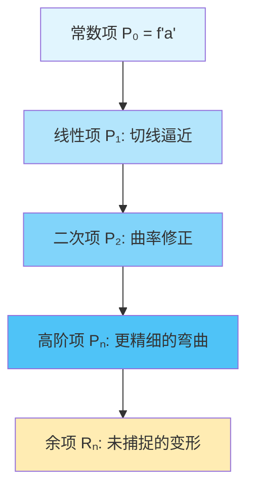
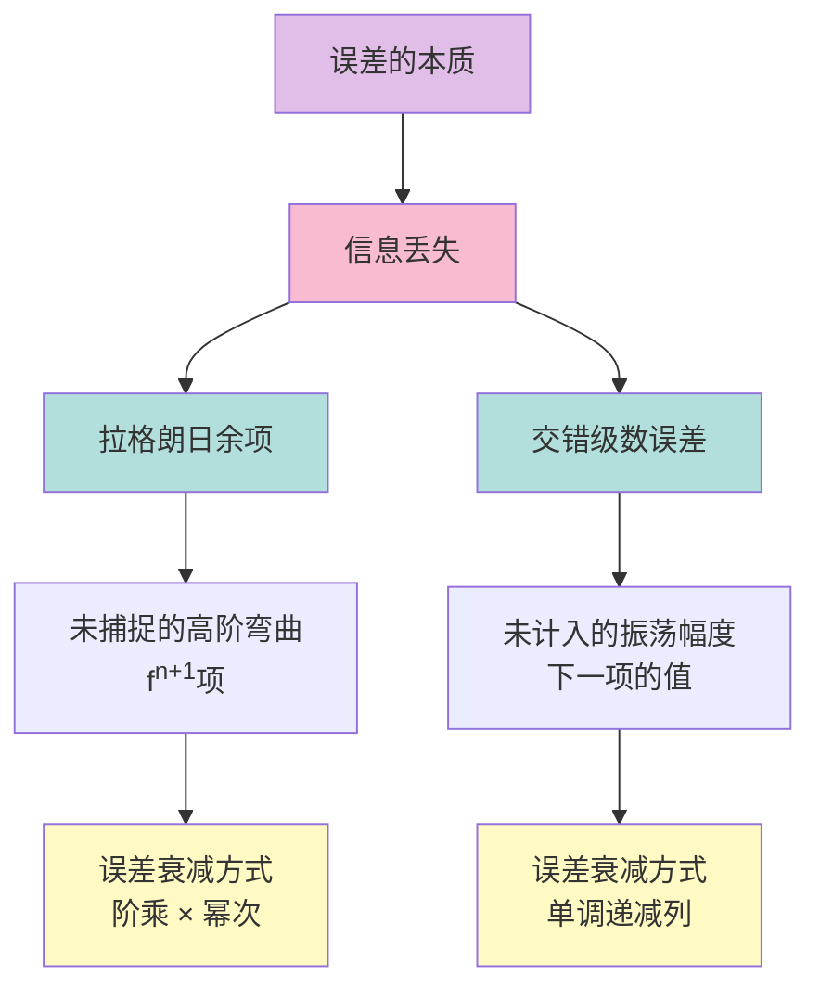

---
tags:
  - Math
  - Calculus
  - 定义性
  - 基本原理
title: 拉格朗日余项与误差估计
created: 2026-03-29T12:00:00
modified:
---
# 拉格朗日余项与误差估计

## 1. 泰勒级数的拉格朗日余项

### 1.1 泰勒定理回顾

设函数 $f(x)$ 在包含点 $a$ 的某个开区间内具有直到 $(n+1)$ 阶的导数，则对于该区间内的任意 $x$，有：

$$f(x) = P_n(x) + R_n(x)$$

其中 $P_n(x)$ 是泰勒多项式：
$$P_n(x) = \sum_{k=0}^{n} \frac{f^{(k)}(a)}{k!}(x-a)^k$$

$R_n(x)$ 是余项（误差）。

### 1.2 拉格朗日余项公式

**拉格朗日余项**给出了泰勒多项式逼近的精确误差表达式：

$$\boxed{R_n(x) = \frac{f^{(n+1)}(c)}{(n+1)!}(x-a)^{n+1}}$$

其中 $c$ 是介于 $a$ 和 $x$ 之间的某个值（即 $c \in (a, x)$ 或 $c \in (x, a)$）。

### 1.3 拉格朗日余项的推导

**使用柯西中值定理推导**：

**Step 1**：定义辅助函数

设 $P_n(x)$ 为泰勒多项式，定义误差函数：
$$E(x) = f(x) - P_n(x)$$

**Step 2**：验证边界条件

由于 $P_n(x)$ 与 $f(x)$ 在 $x = a$ 处的函数值及前 $n$ 阶导数都相等：
- $E(a) = f(a) - P_n(a) = 0$
- $E'(a) = f'(a) - P_n'(a) = 0$
- $E''(a) = f''(a) - P_n''(a) = 0$
- $\vdots$
- $E^{(n)}(a) = f^{(n)}(a) - P_n^{(n)}(a) = 0$

**Step 3**：构造柯西中值定理所需的函数

定义两个函数：
$$g(t) = E(t), \quad h(t) = (t - a)^{n+1}$$

注意到：
- $g(a) = g'(a) = \cdots = g^{(n)}(a) = 0$
- $h(a) = h'(a) = \cdots = h^{(n)}(a) = 0$
- $h^{(n+1)}(t) = (n+1)!$

**Step 4**：反复应用柯西中值定理

对 $g(t)$ 和 $h(t)$ 在区间 $[a, x]$ 上反复应用柯西中值定理 $n+1$ 次：

$$\frac{g(x) - g(a)}{h(x) - h(a)} = \frac{g'(c_1)}{h'(c_1)} = \frac{g''(c_2)}{h''(c_2)} = \cdots = \frac{g^{(n+1)}(c)}{h^{(n+1)}(c)}$$

其中 $a < c < c_n < \cdots < c_1 < x$（假设 $x > a$）。

**Step 5**：计算最终结果

由于 $g^{(n+1)}(t) = f^{(n+1)}(t)$（因为 $P_n^{(n+1)}(t) = 0$），且 $h^{(n+1)}(t) = (n+1)!$：

$$\frac{E(x)}{(x-a)^{n+1}} = \frac{f^{(n+1)}(c)}{(n+1)!}$$

因此：
$$E(x) = \frac{f^{(n+1)}(c)}{(n+1)!}(x-a)^{n+1}$$

$$\boxed{R_n(x) = \frac{f^{(n+1)}(c)}{(n+1)!}(x-a)^{n+1}}$$

## 2. 几何直觉性解释

### 2.1 泰勒逼近的几何意义

泰勒级数逐项添加高阶导数信息，类似于"层层剥开"函数的局部行为：



### 2.2 拉格朗日余项的几何直觉

**直觉一：阶数越高，误差衰减越快**

$(x-a)^{n+1}$ 因子揭示了误差的关键特征：
- 当 $|x - a| < 1$ 时，$(x-a)^{n+1}$ 随 $n$ 增大急剧衰减
- 逼近点越靠近展开点，误差越小

**几何图示**：

```
        │
        │         ★ 真实函数 f(x)
        │        ╱
        │       ╱  ↓ 余项 Rₙ(x)
        │      ╱ ─────────────
        │     ╱╱ ╱ 泰勒多项式 Pₙ(x)
        │    ╱ ╱
        │   ╱╱
        │  ╱ 
        │ ╱
        │╱
    ────●──────────────────────
        a        x
        │←展开点  ←逼近点→│
```

**直觉二：高阶导数描述"未知的弯曲"**

$f^{(n+1)}(c)$ 代表在 $a$ 与 $x$ 之间某点处函数的 $(n+1)$ 阶弯曲程度：
- 若 $f^{(n+1)}$ 在区间内变化不大，误差估计较准确
- 若 $f^{(n+1)}$ 变化剧烈，需要取其最大值作为误差上界

**直觉三：阶乘的"压制"效应**

$(n+1)!$ 因子是泰勒级数收敛的关键保障：
- 阶乘增长极快（比指数还快）
- 即使 $|x-a|$ 较大，阶乘仍能"压制"误差
- 这解释了为什么许多函数的泰勒级数收敛半径无穷大

### 2.3 误差的图形化理解

```
误差范围示意：
        
        │╱╲
        │   ╲         上界：+|Rₙ(x)|
    ────┼─────●─────●───── 泰勒多项式 Pₙ(x)
        │   ╱   ╲
        │╱╲       ╲   下界：-|Rₙ(x)|
        │            ╲
        └───────────────→ x
              a    x
              
    真实值 f(x) 被夹在 [Pₙ(x) - |Rₙ|, Pₙ(x) + |Rₙ|] 内
```

## 3. 交错级数的误差估计

### 3.1 交错级数余项定理

对于满足**莱布尼茨条件**的交错级数：
$$\sum_{n=1}^{\infty} (-1)^{n-1} b_n, \quad b_n > 0$$

条件：
1. $b_{n+1} \leq b_n$（单调递减）
2. $\lim_{n \to \infty} b_n = 0$

**误差公式**：若用前 $n$ 项部分和 $S_n$ 近似级数和 $S$，则误差满足：

$$\boxed{|R_n| = |S - S_n| \leq b_{n+1}}$$

即：误差不超过第一个被省略项的绝对值。

### 3.2 交错级数误差公式的推导

**证明**：

设级数和为 $S = \sum_{k=1}^{\infty} (-1)^{k-1} b_k$，部分和为 $S_n$。

**情形一**：$n$ 为偶数

余项为：
$$R_n = S - S_n = (-1)^n b_{n+1} + (-1)^{n+1} b_{n+2} + \cdots$$

$$R_n = b_{n+1} - b_{n+2} + b_{n+3} - b_{n+4} + \cdots$$

由于 $b_{n+1} > b_{n+2} > b_{n+3} > \cdots$，可以分组：

$$R_n = (b_{n+1} - b_{n+2}) + (b_{n+3} - b_{n+4}) + \cdots > 0$$

同时：
$$R_n = b_{n+1} - (b_{n+2} - b_{n+3}) - (b_{n+4} - b_{n+5}) - \cdots < b_{n+1}$$

因此：$0 < R_n < b_{n+1}$

**情形二**：$n$ 为奇数

$$R_n = -b_{n+1} + b_{n+2} - b_{n+3} + b_{n+4} - \cdots$$

$$R_n = -(b_{n+1} - b_{n+2}) - (b_{n+3} - b_{n+4}) - \cdots < 0$$

同时：
$$R_n = -b_{n+1} + (b_{n+2} - b_{n+3}) + (b_{n+4} - b_{n+5}) + \cdots > -b_{n+1}$$

因此：$-b_{n+1} < R_n < 0$

**综合**：无论 $n$ 为奇偶，都有 $|R_n| < b_{n+1}$。

$$\boxed{|R_n| \leq b_{n+1}}$$

### 3.3 交错级数误差的几何直觉

**图示理解**：

```
部分和在真实值两侧"振荡收敛"：

    S ━━━━━━━━━━━━━━━━━━━ 真实值（级数和）
    │
    │    S₁ = b₁
    │    
    │         S₂ = b₁ - b₂
    │              ↓
    │              S₃ = b₁ - b₂ + b₃
    │                   ↓
    │                   S₄ = b₁ - b₂ + b₃ - b₄
    │                        ↓
    │                        S₅ = ...
    │
    └──────────────────────────→ n
    
    奇数项部分和从上方逼近 S
    偶数项部分和从下方逼近 S
    
    │S - Sₙ│ < bₙ₊₁
```

**关键洞察**：
- 交错级数的部分和构成一个"夹逼"结构
- 奇数项部分和 $S_{2k-1}$ 从上方逼近真实值
- 偶数项部分和 $S_{2k}$ 从下方逼近真实值
- 真实值永远夹在相邻两个部分和之间

```mermaid
graph LR
    A[S₁] -->|减去 b₂| B[S₂]
    B -->|加上 b₃| C[S₃]
    C -->|减去 b₄| D[S₄]
    D -->|加上 b₅| E[S₅]
    
    style A fill:#ffcdd2
    style B fill:#c8e6c9
    style C fill:#ffcdd2
    style D fill:#c8e6c9
    style E fill:#ffcdd2
    
    F[真实值 S] :::truestyle
    
    classDef truestyle fill:#fff59d,stroke:#f57f17,stroke-width:3px
```

## 4. 两种误差估计的比较

### 4.1 拉格朗日余项 vs 交错级数误差

| 特性 | 拉格朗日余项 | 交错级数误差 |
|------|-------------|-------------|
| 适用对象 | 泰勒级数/幂级数 | 交错级数 |
| 公式形式 | $\dfrac{f^{(n+1)}(c)}{(n+1)!}(x-a)^{n+1}$ | $\leq b_{n+1}$ |
| 计算难度 | 需要高阶导数信息 | 只需下一项的值 |
| 精确程度 | 更精确（有阶乘压制） | 较粗糙但简单实用 |
| 几何直觉 | 函数弯曲的"剩余" | 振荡的"摇摆空间" |

### 4.2 统一的几何视角

两种误差估计都体现了"**逼近的残余**"这一核心思想：



## 5. 实际应用示例

### 5.1 使用拉格朗日余项估计误差

**问题**：用 $e^x$ 的 4 阶麦克劳林多项式估计 $e^{0.5}$，求误差范围。

**解**：

$e^x$ 的 4 阶麦克劳林多项式：
$$P_4(x) = 1 + x + \frac{x^2}{2!} + \frac{x^3}{3!} + \frac{x^4}{4!}$$

$$P_4(0.5) = 1 + 0.5 + \frac{0.25}{2} + \frac{0.125}{6} + \frac{0.0625}{24} \approx 1.6484$$

拉格朗日余项：
$$R_4 = \frac{e^c}{5!}(0.5)^5, \quad c \in (0, 0.5)$$

由于 $e^c < e^{0.5} < 2$：
$$|R_4| < \frac{2 \times (0.5)^5}{120} = \frac{2 \times 0.03125}{120} \approx 0.00052$$

因此：$e^{0.5} \approx 1.6484 \pm 0.0006$

### 5.2 使用交错级数误差估计

**问题**：用 $\sum_{n=1}^{\infty} \frac{(-1)^{n-1}}{n^2}$ 的前 4 项估计级数和，求误差范围。

**解**：

前 4 项部分和：
$$S_4 = 1 - \frac{1}{4} + \frac{1}{9} - \frac{1}{16} = 1 - 0.25 + 0.111... - 0.0625 \approx 0.7986$$

误差：
$$|R_4| \leq b_5 = \frac{1}{25} = 0.04$$

因此：$S \approx 0.799 \pm 0.04$

**注**：若要求误差小于 $0.001$，需满足 $b_{n+1} < 0.001$：
$$\frac{1}{(n+1)^2} < 0.001 \Rightarrow n+1 > \sqrt{1000} \approx 31.6$$

需取前 31 项。

## 6. 总结

### 6.1 核心公式

| 误差类型 | 公式 | 记忆要点 |
|---------|------|---------|
| 拉格朗日余项 | $R_n = \dfrac{f^{(n+1)}(c)}{(n+1)!}(x-a)^{n+1}$ | 高阶导 × 幂次 / 阶乘 |
| 交错级数误差 | $\|R_n\| \leq b_{n+1}$ | 首项省略值 |

### 6.2 几何直觉要点

1. **拉格朗日余项**：未被泰勒多项式捕捉的"弯曲残余"
2. **交错级数误差**：部分和在真实值两侧振荡的"摇摆余量"
3. **共同本质**：信息丢失导致的逼近残余

[[Infinite Series]]
[[limit]]
[[differentiation]]
