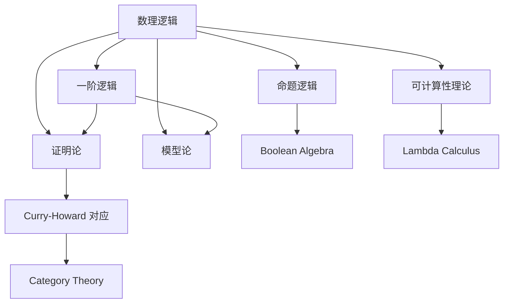
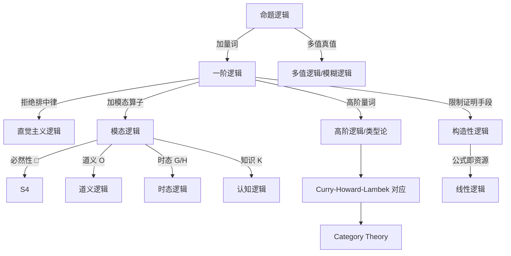

# Mathematical Logic

> [!abstract] 概述
> **数理逻辑 (Mathematical Logic)** 是用数学方法研究推理的学科，关注形式化语言中的**语法**（符号规则）、**语义**（意义与真值）以及二者之间的关系。其四大分支为：**证明论** (Proof Theory)、**模型论** (Model Theory)、**集合论** (Set Theory) 与**递归论** (Recursion Theory / Computability Theory)。数理逻辑是计算机科学、分析哲学和数学基础的共同支柱。

## 1 命题逻辑

> [!note] 定义
> **命题逻辑 (Propositional Logic)** 是数理逻辑中最基础的层次：它研究由**原子命题**（不可再分的真值载体）通过**逻辑连接词**构成的复合命题，不分析命题内部结构。

### 1.1 语法

命题逻辑的形式语言由以下符号构成：

- **命题变元**：$P, Q, R, \dots$（通常可数无穷多个）
- **逻辑连接词**：$\lnot$（否定）、$\land$（合取）、$\lor$（析取）、$\to$（蕴涵）、$\leftrightarrow$（等值）
- **辅助符号**：括号 $(,)$

> [!definition] 公式的形成规则
> 1. 每个命题变元 $P$ 是公式
> 2. 若 $A$ 是公式，则 $\lnot A$ 是公式
> 3. 若 $A$ 和 $B$ 是公式，则 $(A \land B)$、$(A \lor B)$、$(A \to B)$、$(A \leftrightarrow B)$ 是公式
> 4. 只有通过有限次应用以上规则得到的才是公式

### 1.2 语义与真值表

命题逻辑的语义由 **布尔赋值 (Boolean Valuation)** 给出：$v: \{\text{命题变元}\} \to \{0,1\}$（或 $\{\bot, \top\}$），并通过真值表递归扩展到所有公式。

> [!example] 例1：蕴涵连接词的真值表
> 
> $$
> \begin{array}{cc|c}
> P & Q & P \to Q \\ \hline
> 0 & 0 & 1 \\
> 0 & 1 & 1 \\
> 1 & 0 & 0 \\
> 1 & 1 & 1
> \end{array}
> $$
> 
> $P \to Q$ 仅在 $P$ 为真而 $Q$ 为假时为假。这与日常语言中的"如果……那么"有微妙差异——逻辑蕴涵不要求因果联系，仅取决于真值组合。

> [!example] 例2：重言式——排中律
> 
> 公式 $P \lor \lnot P$ 在所有赋值下均为真，是一个**重言式 (Tautology)**：
> 
> $$
> \begin{array}{c|c|c}
> P & \lnot P & P \lor \lnot P \\ \hline
> 0 & 1 & 1 \\
> 1 & 0 & 1
> \end{array}
> $$
> 
> 排中律断言：任意命题要么为真要么为假，没有第三种可能。这在经典逻辑中成立，但在 [[Intuitionistic Logic|直觉主义逻辑]] 中被拒绝。

### 1.3 语义分类

| 分类 | 定义 | 示例 |
|:---|:---|:---|
| **重言式 (Tautology)** | 所有赋值下为真 | $P \lor \lnot P$ |
| **矛盾式 (Contradiction)** | 所有赋值下为假 | $P \land \lnot P$ |
| **可满足式 (Satisfiable)** | 至少一个赋值下为真 | $P \land Q$ |
| **偶真式 (Contingency)** | 非重言式也非矛盾式 | $P \to Q$ |

> [!tip] 命题逻辑与布尔代数
> 命题逻辑的语义等价于布尔代数 $\{0,1\}$ 上的方程理论。逻辑连接词 $\lnot, \land, \lor$ 分别对应 [[Boolean Algebra|布尔代数]] 中的补、交、并运算。这种对应关系是数字电路设计和逻辑电路优化的数学基础。

## 2 一阶逻辑

> [!note] 定义
> **一阶逻辑 (First-Order Logic)**，亦称**谓词逻辑 (Predicate Logic)**，在命题逻辑基础上引入**个体变元**、**谓词**和**量词**，能够分析命题的内部结构，是数学理论形式化的标准语言。

### 2.1 语法

一阶逻辑的符号表：

| 符号类别 | 示例 | 说明 |
|:---|:---|:---|
| 个体变元 | $x, y, z, \dots$ | 取值于论域的元素 |
| 个体常元 | $c, d, \dots$ | 指定的论域元素 |
| 函数符号 | $f, g, h, \dots$ | $f(t_1, \dots, t_n)$ 为项 |
| 谓词符号 | $P, Q, R, \dots$ | $P(t_1, \dots, t_n)$ 为原子公式 |
| 量词 | $\forall, \exists$ | 全称量词与存在量词 |

> [!definition] 项与公式
> - **项 (Term)**：个体变元或常元是项；若 $t_1, \dots, t_n$ 是项且 $f$ 是 $n$ 元函数符号，则 $f(t_1, \dots, t_n)$ 是项
> - **原子公式 (Atomic Formula)**：若 $t_1, \dots, t_n$ 是项且 $P$ 是 $n$ 元谓词符号，则 $P(t_1, \dots, t_n)$ 是原子公式
> - **复合公式**：若 $A, B$ 是公式，则 $\lnot A$、$(A \land B)$、$(A \lor B)$、$(A \to B)$、$\forall x A$、$\exists x A$ 是公式

### 2.2 自由变元与约束变元

> [!definition] 自由与约束
> - **约束变元 (Bound Variable)**：出现在对应量词 $\forall x$ 或 $\exists x$ 的**辖域 (Scope)** 内的变元 $x$
> - **自由变元 (Free Variable)**：不被任何量词约束的变元出现
> - **语句 (Sentence)**：不含自由变元的公式——其真值仅取决于模型，不依赖变元的赋值

> [!example] 例3：自由与约束变元
> 
> 在公式 $\forall x (P(x) \to Q(x, y))$ 中：
> - $x$ 的三次出现（量词后、$P(x)$ 中、$Q(x,y)$ 中）均为**约束出现**
> - $y$ 在 $Q(x, y)$ 中的出现为**自由出现**
> - 该公式不是语句（含有自由变元 $y$）
> 
> 而在公式 $\forall x \exists y (P(x) \to Q(x, y))$ 中，$x$ 和 $y$ 的所有出现均为约束出现——这是一个语句。

### 2.3 语义：模型

> [!definition] 一阶模型
> 一个一阶**模型 (Model)** $\mathcal{M}$ 由以下构成：
> - **论域 (Domain)** $D$：一个非空集合
> - **解释函数 (Interpretation Function)** $\mathcal{I}$：
>   - 每个常元 $c \mapsto c^{\mathcal{M}} \in D$
>   - 每个 $n$ 元函数符号 $f \mapsto f^{\mathcal{M}}: D^n \to D$
>   - 每个 $n$ 元谓词符号 $P \mapsto P^{\mathcal{M}} \subseteq D^n$

> [!example] 例4：自然数模型
> 
> 考虑语言 $\mathcal{L} = \{+, \times, 0, 1, <\}$ 的标准模型 $\mathcal{N} = \langle \mathbb{N}, \mathcal{I} \rangle$：
> - $0^{\mathcal{N}} = 0$，$1^{\mathcal{N}} = 1$
> - $+^{\mathcal{N}} = $ 自然数加法
> - $\times^{\mathcal{N}} = $ 自然数乘法
> - $<^{\mathcal{N}} = \{(m,n) \mid m < n\}$
> 
> 在此模型中，语句 $\forall x \exists y (x < y)$ 为真（自然数无最大元），而 $\exists x \forall y (x < y \lor x = y)$ 为假。

## 3 语义后承与语法后承

> [!note] 核心区分
> 数理逻辑中，$\models$ 与 $\vdash$ 的区别是最关键的概念区分之一。

| 符号 | 名称 | 定义 |
|:---|:---|:---|
| $\Gamma \models A$ | **语义后承 (Semantic Consequence)** | 在所有使 $\Gamma$ 中所有公式为真的模型下，$A$ 也为真 |
| $\Gamma \vdash A$ | **语法后承 (Syntactic Consequence)** | 存在一个从 $\Gamma$ 出发、根据推理规则得到 $A$ 的形式证明 |

> [!example] 例5：Modus Ponens
> 
> 分离规则 Modus Ponens 同时具有语义有效性和语法有效性：
> - **语义层面**：$\{P, P \to Q\} \models Q$ —— 在任意使 $P$ 和 $P \to Q$ 为真的赋值下，$Q$ 必然为真
> - **语法层面**：$\{P, P \to Q\} \vdash Q$ —— 从前提 $P$ 和 $P \to Q$ 出发，应用 MP 规则一步即可推得 $Q$

> [!example] 例6：语义后承的失效
> 
> 考虑一阶逻辑中的语句：令 $\varphi_n$ 表示"论域中至少有 $n$ 个元素"。则：
> 
> $$
> \{\varphi_1, \varphi_2, \varphi_3, \dots\} \models \text{"论域无限"}
> $$
> 
> 但任意有限子集 $\{\varphi_1, \dots, \varphi_k\}$ 有有限模型。这体现了**紧致性定理 (Compactness Theorem)** 的逆否形式：一阶逻辑无法刻画有限性——任何具有任意大有限模型的语句集必有无穷模型。

## 4 Gödel 完备性定理

> [!theorem] Gödel 完备性定理 (Gödel's Completeness Theorem, 1929)
> 对一阶逻辑的任意公式集 $\Gamma$ 和公式 $A$：
> 
> $$
> \Gamma \models A \quad \iff \quad \Gamma \vdash A
> $$
> 
> 即：**语义后承等价于语法后承**——凡是逻辑上为真的（在所有模型中为真），都有一形式证明。

> [!tip] 完备性的意义
> Gödel 完备性定理表明一阶逻辑的证明系统（如自然推理系统、Hilbert 公理系统）**足够强大**——不会遗漏任何逻辑真理。它将语义概念（"在所有模型中为真"）和语法概念（"存在有限形式证明"）完美统一。

> [!warning] 完备性 $\neq$ 可判定性
> 完备性定理告诉我们"一切真命题都可证"，但**没有**告诉我们如何自动找到证明。事实上，一阶逻辑是**不可判定的**（Church, 1936）——不存在算法能判定任意一阶公式是否有效。

## 5 Gödel 不完备性定理

> [!theorem] Gödel 第一不完备性定理 (1931)
> 任何**一致的、递归可公理化的**、包含基本算术（如 Peano 算术）的形式系统中，存在一个语句 $G$ 使得 $G$ 及其否定 $\lnot G$ 在该系统中均不可证。这样的 $G$ 称为**Gödel 语句 (Gödel Sentence)**。

> [!theorem] Gödel 第二不完备性定理 (1931)
> 在上述条件下，该系统无法证明自身的**一致性 (Consistency)**。形式地，若 $\text{Con}_T$ 是表达"系统 $T$ 一致"的语句，则 $T \not\vdash \text{Con}_T$。

> [!example] 例7：Gödel 语句的非形式理解
> 
> Gödel 语句 $G$ 可非形式地理解为：
> 
> $$
> G: \text{"本语句在系统 } T \text{ 中不可证"}
> $$
> 
> - 若 $T \vdash G$，则 $G$ 为真（因 $T$ 是可靠的），但 $G$ 声称"$G$ 在 $T$ 中不可证"——矛盾
> - 若 $T \vdash \lnot G$，即证得"$G$ 在 $T$ 中可证"，则 $T \vdash G$ 但 $T \vdash \lnot G$——$T$ 不一致
> - 结论：若 $T$ 一致，则 $G$ 和 $\lnot G$ 均不可证——$G$ 是不可判定的真语句
> 
> $G$ 的构造依赖 **Gödel 编码 (Gödel Numbering)**：将符号、公式、证明序列编码为自然数，使系统能够"谈论自身"（自指，Self-Reference）。

> [!tip] 不完备性的深远影响
> Gödel 定理彻底终结了 Hilbert 纲领（Hilbert's Program）——证明全部数学一致且完备的梦想。它表明：任何足够强的形式系统要么不一致，要么不完备。数学真理**超过**任何固定形式系统所能捕捉的范围。

## 6 可计算性理论

> [!note] 定义
> **可计算性理论 (Computability Theory / Recursion Theory)** 研究"什么是原则上可计算的"——哪些函数可由算法（机械程序）计算，哪些问题在数学上不可判定。

### 6.1 图灵机

> [!definition] 图灵机 (Turing Machine)
> **图灵机**由 Alan Turing 于 1936 年提出，形式化为：
> - 一条双向无限的纸带（tape），分成小格，每格可写一个符号
> - 一个有限状态控制器
> - 一个读写头（head），可在带上左右移动
> - 一个转移函数 $\delta: Q \times \Gamma \to Q \times \Gamma \times \{L, R\}$
> 
> 每一步：依据当前状态和读取符号，写入新符号、改变状态、移动读写头。

> [!example] 例8：二进制加一图灵机
> 
> 一个在二进制数上加一的图灵机可被构造：从右向左扫描，将 $1$ 翻为 $0$ 直至遇到 $0$，将 $0$ 翻为 $1$ 后停机。这便是进位加法在机械层面的实现。

### 6.2 Church-Turing 论题

> [!note] Church-Turing 论题
> "直观上可计算"的函数类恰好等于：
> - **图灵机可计算**的函数类
> - **一般递归函数 (General Recursive Functions)** —— Gödel & Herbrand
> - **λ可定义函数 (λ-Definable Functions)** —— Church 的 [[Lambda Calculus|λ演算]]
> 
> 这三种形式化相互等价，共同刻画了"有效可计算性 (Effective Computability)"的精确边界。它不是可证明的数学定理，而是关于"可计算"这一直观概念的**经验性论题**。

### 6.3 停机问题与不可判定性

> [!theorem] 停机问题不可判定 (Turing, 1936)
> 不存在一个图灵机 $H$，输入任意图灵机 $M$ 和输入 $w$，总能在有限步内判定 $M$ 在输入 $w$ 上是否停机。
> 
> **证明思路**：假设 $H$ 存在，构造一个自指悖论机 $D$：若 $H$ 预测 $D$ 停机则 $D$ 不停机，反之亦然——矛盾。

> [!tip] 不可判定问题的普遍性
> 停机问题只是"不可判定问题冰山"的一角。许多有实际意义的问题也被证明不可判定：
> - **一阶逻辑的有效性判定** (Church, 1936)
> - **Post 对应问题 (Post Correspondence Problem)**
> - **字问题 (Word Problem)** 对于半群和群
> - **Hilbert 第十问题**：丢番图方程整数解的存在性 (Matiyasevich, 1970)

## 7 与 λ 演算的深刻联系

数理逻辑与 [[Lambda Calculus|λ演算]] 的关系是二十世纪逻辑学最富成果的交汇之一。

### 7.1 递归函数等价性

Church 的 λ 可定义函数类、Gödel-Herbrand 的一般递归函数类、Turing 的图灵机可计算函数类——三者被证明**恰好等价**。这意味着：

- 任何 λ 可定义的数值函数都有等价的图灵机实现
- 任何图灵机可计算的函数都可编码为 λ 表达式
- λ 演算中的 **Y 组合子** $Y = \lambda f. (\lambda x. f(x x)) (\lambda x. f(x x))$ 正是在无显式递归机制的纯λ演算中实现递归的关键，与 Kleene 的递归定理异曲同工

### 7.2 类型作为逻辑命题

简单类型 λ 演算 (STLC) 的类型系统与直觉主义命题逻辑之间存在精确对应：类型 $\tau_1 \to \tau_2$ 对应逻辑蕴涵 $P \to Q$。类型推导规则：

$$
\frac{\Gamma, x : A \vdash M : B}{\Gamma \vdash \lambda x. M : A \to B}
$$

恰好对应自然推理中的蕴涵引入规则。详见 [[Lambda Calculus#9 Curry-Howard 同构 (Curry-Howard Isomorphism)|Curry-Howard 同构]]。

## 8 与范畴论的联系

[[Category_Theory|范畴论]] 为数理逻辑提供了更高层的抽象架构：

> [!note] Curry-Howard-Lambek 对应
> 在 Curry-Howard-Lambek 对应 (CHL Correspondence) 的框架下，三个领域被统一：
> 
> | 逻辑 | 类型论 | 范畴论 |
> |:---|:---|:---|
> | 命题 $P$ | 类型 $A$ | 对象 $A$ |
> | 证明 $p: P \to Q$ | 项 $m: A \to B$ | 态射 $f: A \to B$ |
> | Modus Ponens | 函数应用 | 复合 $g \circ f$ |
> | 蕴涵引入 | λ 抽象 | 指数 transpose |
> | 合取 $P \land Q$ | 积类型 $A \times B$ | 范畴积 (Categorical Product) |
> | 析取 $P \lor Q$ | 和类型 $A + B$ | 范畴余积 (Categorical Coproduct) |

> [!example] 例9：恒等证明即恒等态射
> 
> 逻辑中的恒等公理"$P$ 蕴含 $P$"，其证明可抽象为：
> - **λ 项**：$\lambda x. x : A \to A$
> - **范畴论**：单位态射 $\operatorname{id}_A \in \operatorname{Hom}(A, A)$
> - **逻辑**：$P \to P$ 的平凡证明
> 
> 三者是同一数学本质的三种表现形式。[[Category_Theory/Natural Transformation|自然变换]] 进一步将这种对应提升到函子层面。

> [!tip] 范畴逻辑 (Categorical Logic)
> 现代逻辑学的一个活跃方向——**范畴逻辑**——将整个逻辑系统（经典逻辑、直觉主义逻辑、模态逻辑、线性逻辑等）理解为特定的范畴结构：
> - 经典命题逻辑 $\leftrightarrow$ Boole 代数（特殊的笛卡尔闭范畴）
> - 直觉主义逻辑 $\leftrightarrow$ 笛卡尔闭范畴 + 余积
> - 一阶直觉主义逻辑 $\leftrightarrow$ 超积范畴 (Hyperdoctrine)
> - 模态逻辑 $\leftrightarrow$ 带有 $\Box$ 和 $\Diamond$ 的内函子结构的范畴

## 9 逻辑的谱系

## 相关笔记

- [[Propositional Logic]] — 命题逻辑基础（Logic Vault）
- [[First-Order Logic]] — 一阶逻辑基础（Logic Vault）
- [[Formal Systems]] — Hilbert 公理系统与形推规则
- [[Boolean Algebra]] — 布尔代数，命题逻辑的代数语义
- [[Intuitionistic Logic]] — 拒绝排中律的构造性逻辑
- [[Lambda Calculus]] — λ演算，可计算性的函数式刻画
- [[Category_Theory|Category Theory]] — 范畴论，逻辑与类型论的抽象统一
- [[Category_Theory/Natural Transformation]] — 自然变换，CHL 对应的函子层面
- [[Set_Theory/Cartesian product]] — 笛卡尔积，范畴积的集合论原型
- [[Modal Logic/Modal Logic]] — 模态逻辑，必然性与可能性的形式化
- [[Modal Logic/Kripke]] — Kripke 语义，可能世界语义学

> [!quote] 经典教材推荐
> - **入门**：*Logic for Mathematics and Computer Science* (Burris)
> - **标准教材**：*A Mathematical Introduction to Logic* (Herbert Enderton) —— 全面且清晰
> - **模型论向**：*Model Theory* (Chang & Keisler)
> - **可计算性向**：*Computability and Logic* (Boolos, Burgess, Jeffrey)
> - **哲学向**：*Gödel, Escher, Bach* (Douglas Hofstadter) —— 非技术性但深刻
> - **证明论向**：*Proof Theory* (Gaisi Takeuti)
