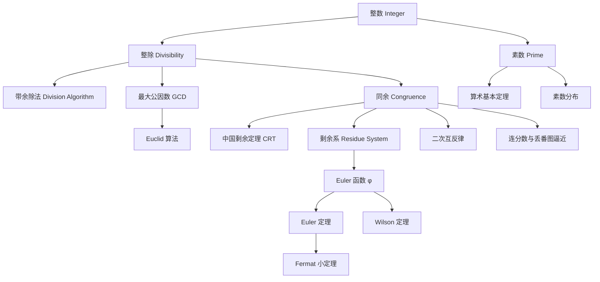

# Number Theory

> [!abstract] 概述
> **数论 (Number Theory)** 研究整数的性质与关系，是数学中最古老的分支之一。Gauss 称其为"数学的皇后"。初等数论不依赖于分析或代数几何工具，直接从整除、同余、素数等基本概念出发，建立严谨而优美的理论体系。

## 概念关系图

## 整除与带余除法

> [!definition] 整除
> 设 $a, b \in \mathbb{Z}$，$b \neq 0$。若存在 $q \in \mathbb{Z}$ 使得 $a = bq$，则称 $b$ **整除** $a$，记作 $b \mid a$。否则记作 $b \nmid a$。

> [!theorem] 带余除法 (Division Algorithm)
> 对任意 $a, b \in \mathbb{Z}$，$b > 0$，存在**唯一**的整数 $q, r$ 满足：
> $$a = bq + r, \quad 0 \leq r < b$$
> 其中 $q$ 为商，$r$ 为余数。

> [!example] 数例 1-2
> - $37 \div 5$：$37 = 5 \times 7 + 2$，故 $q = 7,\; r = 2$
> - $-13 \div 4$：$-13 = 4 \times (-4) + 3$，故 $q = -4,\; r = 3$（余数始终非负）

带余除法是整个初等数论的基石——所有后续概念（最大公因数、同余、模算术）皆建立在此之上。

## 最大公因数与 Euclid 算法

> [!definition] 最大公因数 (GCD)
> $a, b$ 不全为零的整数，其**最大公因数** $\gcd(a, b)$ 是同时整除 $a$ 和 $b$ 的最大正整数。若 $\gcd(a, b) = 1$，称 $a$ 与 $b$ **互素 (coprime)**。

Euclid 算法的核心是下面的引理：若 $a = bq + r$，则 $\gcd(a, b) = \gcd(b, r)$。反复应用即得辗转相除法：

> [!example] 数例 3：$\gcd(252, 105)$
> $$\begin{aligned} 252 &= 105 \times 2 + 42 \\ 105 &= 42 \times 2 + 21 \\ 42 &= 21 \times 2 + 0 \end{aligned}$$
> 故 $\gcd(252, 105) = 21$。仅需 3 步即得出结果。

> [!theorem] Bézout 恒等式
> 存在整数 $x, y$ 使得 $\gcd(a, b) = ax + by$。

逆推 Euclid 算法步骤即可求出系数（扩展 Euclid 算法）：

> [!example] 数例 4：Bézout 系数
> 逆推上例：$21 = 105 - 42 \times 2 = 105 - (252 - 105 \times 2) \times 2 = 252 \times (-2) + 105 \times 5$。故 $x = -2, y = 5$。

这在模运算中有重要应用：$a$ 在模 $m$ 下有乘法逆元当且仅当 $\gcd(a, m) = 1$。

## 素数

> [!definition] 素数
> 整数 $p > 1$ 称为**素数 (prime)**，若其仅有正因子 $1$ 和 $p$ 自身。大于 $1$ 的非素数称为**合数 (composite)**。

> [!theorem] 素数无限性 (Euclid)
> 素数有无穷多个。
>
> **证明**：假设只有有限个素数 $p_1, p_2, \dots, p_k$。考虑 $N = p_1 p_2 \cdots p_k + 1$。$N > 1$，故有素因子 $p$。$p$ 不可能等于任何 $p_i$（否则 $p \mid 1$，矛盾）。故存在新素数，与假设矛盾。$\square$

> [!note] 素数定理 (Prime Number Theorem)
> 令 $\pi(x)$ 表示不超过 $x$ 的素数个数。则：
> $$\pi(x) \sim \frac{x}{\ln x} \quad (x \to \infty)$$
> 由 Hadamard 和 de la Vallée Poussin 于 1896 年独立证明，标志着解析数论的诞生。

> [!example] 数例 5
> $\pi(100) = 25$，而 $100 / \ln 100 \approx 21.7$，比值为 $1.15$。随着 $x$ 增大，比值趋近 $1$。

素数分布呈现深刻的不规则性：存在任意长的连续合数区间（$n! + 2, \dots, n! + n$），却又存在无穷多对相差不超过 $246$ 的素数（张益唐 2013，经 Polymath 项目改进）。孪生素数猜想（存在无穷多对相差 $2$ 的素数）至今未决。

## 算术基本定理

> [!theorem] 算术基本定理 (Fundamental Theorem of Arithmetic)
> 每个大于 $1$ 的整数可**唯一**分解为素数的乘积（不计顺序）：
> $$n = p_1^{a_1} p_2^{a_2} \cdots p_k^{a_k}$$
> 其中 $p_1 < p_2 < \cdots < p_k$ 为素数，$a_i \geq 1$。

> [!example] 数例 6-8
> - $60 = 2^2 \cdot 3 \cdot 5$
> - $84 = 2^2 \cdot 3 \cdot 7$
> - $2024 = 2^3 \cdot 11 \cdot 23$

唯一性使素数成为整数的"原子"。这一性质在 [[Abstract_Algebra/Ring|环]] 的语境下推广为**唯一分解整环 (UFD)** 的概念——$\mathbb{Z}$ 是其原型。

## 同余与同余方程

> [!definition] 同余 (Congruence)
> 设 $m > 0$。若 $m \mid (a - b)$，则称 $a$ 与 $b$ **模 $m$ 同余**，记作：
> $$a \equiv b \pmod{m}$$

同余关系是等价关系，且与加法、乘法相容——这正是商环 $\mathbb{Z}/m\mathbb{Z}$ 的结构基础（参见 [[Abstract_Algebra/Ring]]）。

> [!theorem] 中国剩余定理 (Chinese Remainder Theorem)
> 设 $m_1, m_2, \dots, m_k$ 两两互素，$M = m_1 m_2 \cdots m_k$。则同余方程组
> $$x \equiv a_i \pmod{m_i} \quad (i = 1, \dots, k)$$
> 在模 $M$ 下有**唯一**解。

> [!example] 数例 9 (CRT)
> 解 $x \equiv 2 \pmod{3}$，$x \equiv 3 \pmod{5}$，$x \equiv 2 \pmod{7}$：
> $M = 105$，求各 $M_i = M/m_i$：$35, 21, 15$。
> 求逆：$35y_1 \equiv 1 \pmod{3} \implies y_1 = 2$，$21y_2 \equiv 1 \pmod{5} \implies y_2 = 1$，$15y_3 \equiv 1 \pmod{7} \implies y_3 = 1$。
> 解：$x \equiv 2 \cdot 35 \cdot 2 + 3 \cdot 21 \cdot 1 + 2 \cdot 15 \cdot 1 \equiv 233 \equiv 23 \pmod{105}$。

CRT 提供"分而治之"的策略：大模数的计算可分解为若干互素小模数的并行计算。现代密码学（如 RSA 签名加速）仍大量使用这一思想。

## 剩余系与 Euler 函数

> [!definition] 完全剩余系与简化剩余系
> 模 $m$ 的**完全剩余系 (complete residue system)** 是从模 $m$ 的每个剩余类中各取一个代表元构成的集合（共 $m$ 个元素）。
>
> **简化剩余系 (reduced residue system)** 是从与 $m$ 互素的剩余类中各取一个代表元，其大小即为 $\varphi(m)$。

> [!definition] Euler 函数 $\varphi(n)$
> $\varphi(n)$ 表示 $1$ 到 $n$ 中与 $n$ 互素的整数个数。公式：
> $$\varphi(n) = n \prod_{p \mid n} \left(1 - \frac{1}{p}\right)$$
> 其中乘积遍历 $n$ 的所有不同素因子。

> [!example] 数例 10-12
> - $\varphi(1) = 1$
> - $\varphi(12) = 12 \cdot (1 - 1/2)(1 - 1/3) = 12 \cdot \frac{1}{2} \cdot \frac{2}{3} = 4$。验证：$\{1, 5, 7, 11\}$ 与 $12$ 互素。
> - $\varphi(100) = 100 \cdot \frac{1}{2} \cdot \frac{4}{5} = 40$
> - 特例：$\varphi(p) = p - 1$（$p$ 为素数）

在群论语境下，$\varphi(n)$ 是乘法群 $(\mathbb{Z}/n\mathbb{Z})^{\times}$ 的阶——即可逆元的个数（参见 [[Abstract_Algebra/Group]]）。

## 三大经典定理

> [!theorem] Wilson 定理
> $p$ 为素数当且仅当 $(p-1)! \equiv -1 \pmod{p}$。

> [!example] 数例 13-14
> $p = 5$：$4! = 24 \equiv -1 \pmod{5}$ ✓
> $p = 7$：$6! = 720 \equiv -1 \pmod{7}$ ✓

Wilson 定理提供了素数的理论性判别法，但计算 $n!$ 代价过高，不适用于实际素性检验。

> [!theorem] Fermat 小定理
> 若 $p$ 为素数且 $p \nmid a$，则：
> $$a^{p-1} \equiv 1 \pmod{p}$$

> [!example] 数例 15-16
> $a = 2,\; p = 7$：$2^6 = 64 \equiv 1 \pmod{7}$ ✓
> $a = 5,\; p = 13$：$5^{12} \equiv 1 \pmod{13}$ ✓

Fermat 小定理是 RSA 公钥密码学的理论基石——解密密钥的推导依赖其推广形式。

> [!theorem] Euler 定理
> 若 $\gcd(a, n) = 1$，则：
> $$a^{\varphi(n)} \equiv 1 \pmod{n}$$

Fermat 小定理即 Euler 定理在 $n$ 为素数时的特例：$\varphi(p) = p-1$。

> [!example] 数例 17
> $a = 5,\; n = 12$：$\gcd(5, 12) = 1$，$\varphi(12) = 4$。$5^4 = 625 \equiv 1 \pmod{12}$ ✓

## 二次互反律

> [!theorem] 二次互反律 (Quadratic Reciprocity)
> 设 $p, q$ 为奇素数，Legendre 符号 $\left(\frac{a}{p}\right)$ 为 $1$（$a$ 是模 $p$ 的二次剩余）或 $-1$（非二次剩余）。则：
> $$\left(\frac{p}{q}\right)\left(\frac{q}{p}\right) = (-1)^{\frac{p-1}{2} \cdot \frac{q-1}{2}}$$

> [!note] 历史意义
> Gauss 称之为"黄金定理"，一生中给出了八种不同证明。二次互反律是类域论的思想源头，被公认为数论中最深刻的初等定理。

> [!example] 数例 18
> $x^2 \equiv 7 \pmod{13}$ 是否有解？计算 $\left(\frac{7}{13}\right)$：
> $$\left(\frac{7}{13}\right) = \left(\frac{13}{7}\right)(-1)^{3 \cdot 6} = \left(\frac{6}{7}\right) = \left(\frac{-1}{7}\right) = -1$$
> 故无解（$-1$ 非模 $7$ 的二次剩余，因为 $7 \equiv 3 \pmod{4}$）。

## 连分数与丢番图逼近

> [!definition] 简单连分数
> 实数 $\alpha$ 的**简单连分数**展开为：
> $$\alpha = a_0 + \cfrac{1}{a_1 + \cfrac{1}{a_2 + \cfrac{1}{a_3 + \ddots}}}$$
> 记作 $[a_0; a_1, a_2, a_3, \dots]$。其中 $a_0 \in \mathbb{Z}$，$a_i \in \mathbb{N}\;(i \geq 1)$。

> [!note] 核心性质
> - 有理数的连分数展开**有限**；无理数的无限
> - 截断连分数所得**渐近分数** $\frac{p_n}{q_n}$ 是 $\alpha$ 的"最佳有理逼近"
> - Lagrange 定理：二次无理数的连分数展开是**循环**的

> [!example] 数例 19-21
> - $\pi = [3; 7, 15, 1, 292, \dots]$：无限、非循环（$\pi$ 是超越数）；一阶渐近分数 $\frac{22}{7} = [3; 7]$
> - $\sqrt{2} = [1; 2, 2, 2, \dots] = [1; \overline{2}]$：循环（$\sqrt{2}$ 是二次无理数）
> - Pell 方程 $x^2 - 2y^2 = 1$ 的最小解 $(3, 2)$ 来自 $\sqrt{2}$ 的第二渐近分数 $3/2$；$x^2 - 3y^2 = 1$ 的最小解 $(2, 1)$ 来自 $\sqrt{3} = [1; \overline{1, 2}]$ 的渐近分数

连分数与丢番图逼近在密码分析中有直接应用——Wiener 攻击即利用连分数逼近破解小解密指数的 RSA。

> [!tip] 工具性视角
> 数论绝非"无用之学"。RSA 公钥密码学、椭圆曲线密码学 (ECC)、哈希函数、伪随机数生成、格密码学——当代信息安全几乎全部建立在数论结构之上。从同余到 Euler 定理，再到连分数的丢番图逼近，这些看似纯粹的理论正是密码学安全性的数学保障。

## 学科定位

数论与抽象代数深度交叉。模算术构造的商环 $\mathbb{Z}/m\mathbb{Z}$ 是最基础的 [[Abstract_Algebra/Ring|环]] 例；Lagrange 定理在群论中的对应物是 [[Abstract_Algebra/Group|群]] 论的基本定理；二次域的代数整数环则是 [[Abstract_Algebra/Field|域]] 扩张与代数数论的入口。初等数论提供了理解这些抽象结构的**具体原型**。

关于行列式（在线性丢番图方程组的消元中用于判别解的存在性），参见 [[Linear_Algebra/Determinant]]。关于命题逻辑的代数结构（与数论中大量条件性定理存在形式类比），参见 [[Boolean Algebra]]。

## 相关链接

- [[Abstract_Algebra/Group]] — 同余类的群结构 $(\mathbb{Z}/n\mathbb{Z})^{\times}$ 与 Lagrange 定理
- [[Abstract_Algebra/Ring]] — $\mathbb{Z}/m\mathbb{Z}$ 作为商环的原型
- [[Abstract_Algebra/Field]] — 素数阶有限域 $\mathbb{F}_p$
- [[Linear_Algebra/Determinant]] — 线性丢番图方程组的消元工具
- [[Boolean Algebra]] — 命题演算与数论条件性定理的形式类比
