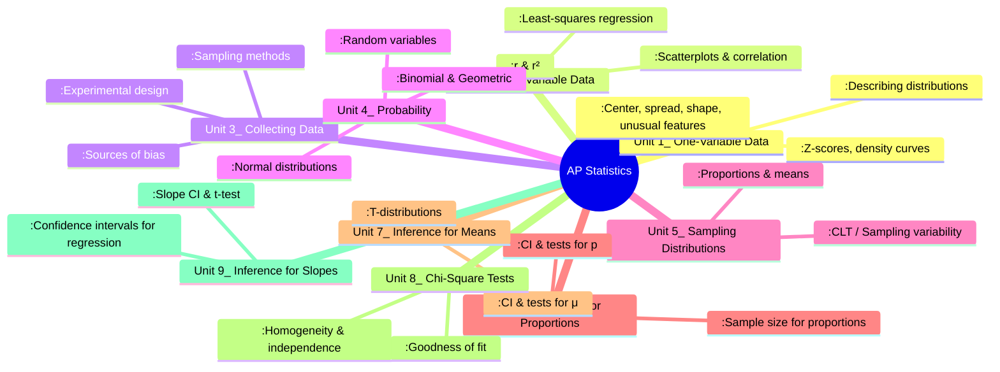

# AP Statistics Map of Content

## Overview

**AP Statistics** is the high-school equivalent of an introductory college statistics course. It covers exploring data, sampling & experimentation, probability, and statistical inference — with a heavy emphasis on **conceptual understanding** and **communication** over pure computation.

### Exam Structure

| Section | Time | Questions | Weight |
|---------|------|-----------|--------|
| **Multiple Choice** | 90 min | 40 MCQs | 50% |
| **Free Response** | 90 min | 5 FRQs + 1 Investigative Task | 50% |

- **9 units** covering the full AP Statistics curriculum
- Formula sheet provided on exam day (see [[AP_Formula_Sheet]])
- Calculator (TI-84 or equivalent) required — know where the `1-PropZTest`, `T-Test`, `LinRegTTest`, and `χ²-Test` menus live
- Communication is everything: answer in context, state conditions, interpret results in plain English

---

## Curriculum Map

---

## Unit Breakdown

### [[Unit 1_One-Variable Data]]
**Summary:** Displaying, describing, and comparing distributions of a single quantitative variable — center, spread, shape, and unusual features. Introduces the terminology that underpins everything else.

**Key Formulas:** $x̄ = \frac{\sum x}{n}$, $s = \sqrt{\frac{\sum (x-x̄)^2}{n-1}}$, $z = \frac{x-μ}{σ}$, $IQR = Q_3-Q_1$

**Related Notes:** [[Describing_Distributions]], [[Measuring_Center_and_Spread]], [[Normal_Distributions]]

---

### [[Unit 2_Two-Variable Data]]
**Summary:** Exploring relationships between two variables — scatterplots, correlation, least-squares regression, residuals, and the interpretation of $r$ and $r^2$.

**Key Formulas:** $r = \frac{1}{n-1}\sum\left(\frac{x-x̄}{s_x}\right)\!\left(\frac{y-ȳ}{s_y}\right)$, $b_1 = r\frac{s_y}{s_x}$, $ŷ = b_0+b_1x$, $r^2$

**Related Notes:** [[Correlation_vs_Causation]], [[Two-Way_Tables]]

---

### [[Unit 3_Collecting Data]]
**Summary:** How to *obtain* good data — sampling methods (SRS, stratified, cluster, systematic), experimental design (randomized comparative, blocked, matched-pairs), and the pitfalls (bias, confounding, lurking variables).

**Key Formulas:** None formula-heavy — but know the **vocabulary** cold (treatment, control, placebo, blinding, randomization)

**Related Notes:** [[Sampling_Methods]], [[Experimental_Design]]

---

### [[Unit 4_Probability]]
**Summary:** Probability rules, random variables (discrete & continuous), combining random variables, and the three key distributions that appear on every exam: **Normal**, **Binomial**, and **Geometric**.

**Key Formulas:** $P(A \cup B) = P(A)+P(B)-P(A\cap B)$, $P(A|B) = \frac{P(A\cap B)}{P(B)}$, Binomial $P(X=k)=\binom{n}{k}p^k(1-p)^{n-k}$, $μ_X = np$, $σ_X = \sqrt{np(1-p)}$, Geometric $P(X=k)=(1-p)^{k-1}p$

**Related Notes:** [[Random_Variables]], [[Binomial_and_Geometric_Distributions]], [[Normal_Distributions]]

---

### [[Unit 5_Sampling Distributions]]
**Summary:** The bridge from probability to inference — the sampling distribution of a statistic, the **Central Limit Theorem**, and the conditions that make it all work (random, independent, 10%, large counts / normality).

**Key Formulas:** $μ_{p̂} = p$, $σ_{p̂} = \sqrt{\frac{p(1-p)}{n}}$, $μ_{x̄} = μ$, $σ_{x̄} = \frac{σ}{\sqrt{n}}$

**Related Notes:** [[Sampling_Distribution_Proportions]], [[Sampling_Distribution_Means]], [[Central_Limit_Theorem]]

---

### [[Unit 6_Inference for Proportions]]
**Summary:** Confidence intervals and significance tests for a single proportion and the difference between two proportions. Conditions, mechanics, and interpretation are equally tested.

**Key Formulas:** $CI: p̂ \pm z^*\sqrt{\frac{p̂(1-p̂)}{n}}$, $z = \frac{p̂-p_0}{\sqrt{\frac{p_0(1-p_0)}{n}}}$, $n = \left(\frac{z^*}{m}\right)^2 p̂^*(1-p̂^*)$

**Related Notes:** [[Confidence_Intervals_Proportions]], [[Significance_Tests_Proportions]], [[Type_I_and_II_Errors]]

---

### [[Unit 7_Inference for Means]]
**Summary:** Confidence intervals and significance tests for one or two means, matched pairs, and the $t$-distribution. Conditions shift from "large counts" to "normality or $n \ge 30$."

**Key Formulas:** $CI: x̄ \pm t^*\frac{s}{\sqrt{n}}$, $t = \frac{x̄-μ_0}{s/\sqrt{n}}$, $df = n-1$

**Related Notes:** [[Confidence_Intervals_Means]], [[Significance_Tests_Means]], [[Matched_Pairs_T_Test]]

---

### [[Unit 8_Chi-Square Tests]]
**Summary:** Three flavors of chi-square test — goodness of fit (one categorical variable), homogeneity (same categorical variable across groups), and independence (two categorical variables in a single sample).

**Key Formulas:** $χ^2 = \sum\frac{(O-E)^2}{E}$, $df = k-1$ (GOF) or $(R-1)(C-1)$ (homogeneity/independence)

**Related Notes:** [[Chi-Square_Goodness_of_Fit]], [[Chi-Square_Homogeneity_and_Independence]], [[Two-Way_Tables]]

---

### [[Unit 9_Inference for Slopes]]
**Summary:** Inference for the slope of a least-squares regression line — $t$-test and confidence interval for $β_1$, connecting back to Unit 2's regression ideas.

**Key Formulas:** $t = \frac{b_1-β_{10}}{SE_{b_1}}$, $df = n-2$, $CI: b_1 \pm t^* \cdot SE_{b_1}$

**Related Notes:** — (unit note itself covers the material; see also [[Correlation_vs_Causation]])

---

## AP Exam Tips

### General Strategy
- **Show work** but don't over-write. The rubric credits specific components — answer in context, show the formula, plug in the numbers, state the conclusion.
- **Know your conditions.** Every inference procedure has conditions (Random, Independent, 10%, Large Counts / Normal). Check them by name every single time.
- **Interpretation phrases matter.** "We are 95% confident that ..." is correct. "There is a 95% probability that ..." is **wrong**. Learn the precise phrasing.
- **MCQ pacing:** ~2 min per question. Flag and move on if stuck.
- **FRQ pacing:** About 15 min per FRQ, 25–30 min for the Investigative Task.

### By Section
- **Section I (MC):** Skip wild guesses with >3 answer choices — no penalty, but random guessing wastes time. Process of elimination first.
- **Section II (FRQ):** The Investigative Task is the last question. It's designed to be unfamiliar — don't panic. Dig into what's being asked and use the structure they give you.

### Common Mistakes
- Confusing $p̂$ (statistic) with $p$ (parameter)
- Using $z$ when $t$ is required (or vice versa)
- Forgetting to square $r$ when interpreting $r^2$
- Stating a one-tailed conclusion from a two-tailed test
- Writing $H_a$ that contradicts $H_0$ direction

---

## Quick-Reference Formula Table

| Unit | Key Formula | Use |
|------|-------------|-----|
| 1 | $x̄ = \sum x / n$ | Mean |
| 1 | $s = \sqrt{\sum(x-x̄)^2/(n-1)}$ | Standard deviation |
| 1 | $z = (x-μ)/σ$ | Z-score |
| 2 | $r = \frac{1}{n-1}\sum z_x z_y$ | Correlation |
| 2 | $ŷ = b_0 + b_1x$, $b_1 = r\frac{s_y}{s_x}$ | Regression |
| 4 | $P(A \cup B) = P(A)+P(B)-P(A\cap B)$ | Union |
| 4 | $P(A \cap B) = P(A)P(B\|A)$ | Intersection |
| 4 | $P(X=k)=\binom{n}{k}p^k(1-p)^{n-k}$ | Binomial |
| 5 | $σ_{p̂} = \sqrt{p(1-p)/n}$ | Sampling dist. of $p̂$ |
| 5 | $σ_{x̄} = σ/\sqrt{n}$ | Sampling dist. of $x̄$ |
| 6 | $p̂ \pm z^* \sqrt{p̂(1-p̂)/n}$ | CI for $p$ |
| 7 | $x̄ \pm t^* s/\sqrt{n}$ | CI for $μ$ |
| 8 | $χ^2 = \sum (O-E)^2/E$ | Chi-square |
| 9 | $b_1 \pm t^* SE_{b_1}$ | CI for slope |

---

## All Created Notes

### Unit Notes
- [[Unit_1_One-Variable Data]]
- [[Unit_2_Two-Variable Data]]
- [[Unit_3_Collecting Data]]
- [[Unit_4_Probability]]
- [[Unit_5_Sampling Distributions]]
- [[Unit_6_Inference for Proportions]]
- [[Unit_7_Inference for Means]]
- [[Unit_8_Chi-Square Tests]]
- [[Unit_9_Inference for Slopes]]

### Topic Notes
- [[Describing_Distributions]]
- [[Measuring_Center_and_Spread]]
- [[Normal_Distributions]]
- [[Correlation_vs_Causation]]
- [[Two-Way_Tables]]
- [[Sampling_Methods]]
- [[Experimental_Design]]
- [[Random_Variables]]
- [[Binomial_and_Geometric_Distributions]]
- [[Sampling_Distribution_Proportions]]
- [[Sampling_Distribution_Means]]
- [[Central_Limit_Theorem]]
- [[Confidence_Intervals_Proportions]]
- [[Significance_Tests_Proportions]]
- [[Type_I_and_II_Errors]]
- [[Confidence_Intervals_Means]]
- [[Significance_Tests_Means]]
- [[Matched_Pairs_T_Test]]
- [[Chi-Square_Goodness_of_Fit]]
- [[Chi-Square_Homogeneity_and_Independence]]

---

*See also: [[AP_Formula_Sheet]] for a searchable master formula reference.*
