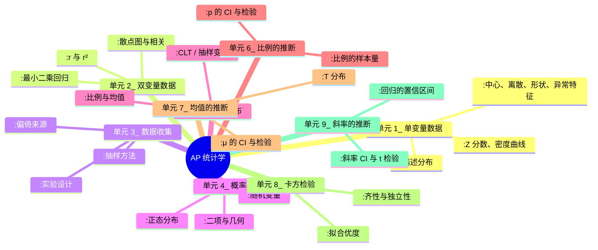

# AP 统计学知识地图

## 概述

**AP 统计学**是大学入门统计学课程的高中对应版本。它覆盖探索数据、抽样与实验、概率和统计推断——重点是**概念理解**和**表达沟通**，而非纯计算。

### 考试结构

| 部分 | 时间 | 题量 | 权重 |
|---------|------|-----------|--------|
| **选择题** | 90 分钟 | 40 道 | 50% |
| **自由回答** | 90 分钟 | 5 道 FRQ + 1 道调查任务 | 50% |

- **9 个单元**覆盖完整 AP 统计学课程
- 考试当天提供公式表（见 [[AP_Formula_Sheet]]）
- 需要计算器（TI-84 或同等）——知道 `1-PropZTest`、`T-Test`、`LinRegTTest` 和 `χ²-Test` 菜单位置
- 沟通就是一切：结合情境作答、陈述条件、用平实语言解释结果

## 课程地图

```mermaid
mindmap
  root((AP 统计学))
    单元 1_ 单变量数据
      :描述分布
      :中心、离散、形状、异常特征
      :Z 分数、密度曲线
    单元 2_ 双变量数据
      :散点图与相关
      :最小二乘回归
      :r 与 r²
    单元 3_ 数据收集
      :抽样方法
      :实验设计
      :偏倚来源
    单元 4_ 概率
      :随机变量
      :二项与几何
      :正态分布
    单元 5_ 抽样分布
      :CLT / 抽样变异
      :比例与均值
    单元 6_ 比例的推断
      :p 的 CI 与检验
      :比例的样本量
    单元 7_ 均值的推断
      :μ 的 CI 与检验
      :T 分布
    单元 8_ 卡方检验
      :拟合优度
      :齐性与独立性
    单元 9_ 斜率的推断
      :斜率 CI 与 t 检验
      :回归的置信区间
```

## 单元分解

### [[Unit_1_One-Variable_Data|单元 1 — 单变量数据]]
**总结：** 展示、描述和比较单个定量变量的分布——中心、离散、形状和异常特征。引入支撑所有其他内容的基础术语。

**关键公式：** $\bar{x} = \frac{\sum x}{n}$，$s = \sqrt{\frac{\sum (x-\bar{x})^2}{n-1}}$，$z = \frac{x-\mu}{\sigma}$，$IQR = Q_3-Q_1$

**相关笔记：** [[Describing_Distributions]]、[[Measuring_Center_and_Spread]]、[[Normal_Distributions]]

### [[Unit_2_Two-Variable_Data|单元 2 — 双变量数据]]
**总结：** 探索两个变量之间的关系——散点图、相关、最小二乘回归、残差，以及 $r$ 和 $r^2$ 的解释。

**关键公式：** $r = \frac{1}{n-1}\sum\left(\frac{x-\bar{x}}{s_x}\right)\!\left(\frac{y-\bar{y}}{s_y}\right)$，$b_1 = r\frac{s_y}{s_x}$，$\hat{y} = b_0+b_1x$，$r^2$

**相关笔记：** [[Correlation_vs_Causation]]、[[Two-Way_Tables]]

### [[Unit_3_Collecting_Data|单元 3 — 数据收集]]
**总结：** 如何*获得*好数据——抽样方法（SRS、分层、整群、系统）、实验设计（随机比较、区组、配对），以及陷阱（偏倚、混杂、潜伏变量）。

**关键公式：** 无太多公式——但要把**词汇**背熟（处理、对照、安慰剂、盲法、随机化）

**相关笔记：** [[Sampling_Methods]]、[[Experimental_Design]]

### [[Unit_4_Probability|单元 4 — 概率]]
**总结：** 概率法则、随机变量（离散与连续）、合并随机变量，以及每次考试都会出现的三个关键分布：**正态**、**二项**和**几何**。

**关键公式：** $P(A \cup B) = P(A)+P(B)-P(A\cap B)$，$P(A|B) = \frac{P(A\cap B)}{P(B)}$，二项 $P(X=k)=\binom{n}{k}p^k(1-p)^{n-k}$，$\mu_X = np$，$\sigma_X = \sqrt{np(1-p)}$，几何 $P(X=k)=(1-p)^{k-1}p$

**相关笔记：** [[Random_Variables]]、[[Binomial_and_Geometric_Distributions]]、[[Normal_Distributions]]

### [[Unit_5_Sampling_Distributions|单元 5 — 抽样分布]]
**总结：** 从概率到推断的桥梁——统计量的抽样分布、**中心极限定理**，以及使其成立的条件（随机、独立、10%、大计数/正态）。

**关键公式：** $\mu_{\hat{p}} = p$，$\sigma_{\hat{p}} = \sqrt{\frac{p(1-p)}{n}}$，$\mu_{\bar{x}} = \mu$，$\sigma_{\bar{x}} = \frac{\sigma}{\sqrt{n}}$

**相关笔记：** [[Sampling_Distribution_Proportions]]、[[Sampling_Distribution_Means]]、[[Central_Limit_Theorem]]

### [[Unit_6_Inference_for_Proportions|单元 6 — 比例的推断]]
**总结：** 单个比例和两个比例之差的置信区间与显著性检验。条件、机制和解释同等受考。

**关键公式：** $CI: \hat{p} \pm z^*\sqrt{\frac{\hat{p}(1-\hat{p})}{n}}$，$z = \frac{\hat{p}-p_0}{\sqrt{\frac{p_0(1-p_0)}{n}}}$，$n = \left(\frac{z^*}{m}\right)^2 \hat{p}^*(1-\hat{p}^*)$

**相关笔记：** [[Confidence_Intervals_Proportions]]、[[Significance_Tests_Proportions]]、[[Type_I_and_II_Errors]]

### [[Unit_7_Inference_for_Means|单元 7 — 均值的推断]]
**总结：** 一个或两个均值、配对的置信区间与显著性检验，以及 $t$ 分布。条件从"大计数"转为"正态或 $n \ge 30$"。

**关键公式：** $CI: \bar{x} \pm t^*\frac{s}{\sqrt{n}}$，$t = \frac{\bar{x}-\mu_0}{s/\sqrt{n}}$，$df = n-1$

**相关笔记：** [[Confidence_Intervals_Means]]、[[Significance_Tests_Means]]、[[Matched_Pairs_T_Test]]

### [[Unit_8_Chi-Square_Tests|单元 8 — 卡方检验]]
**总结：** 三种卡方检验——拟合优度（一个分类变量）、齐性（不同组中的同一分类变量）和独立性（单个样本中的两个分类变量）。

**关键公式：** $\chi^2 = \sum\frac{(O-E)^2}{E}$，$df = k-1$（拟合优度）或 $(R-1)(C-1)$（齐性/独立性）

**相关笔记：** [[Chi-Square_Goodness_of_Fit]]、[[Chi-Square_Homogeneity_and_Independence]]、[[Two-Way_Tables]]

### [[Unit_9_Inference_for_Slopes|单元 9 — 斜率的推断]]
**总结：** 最小二乘回归线斜率的推断——$\beta_1$ 的 $t$ 检验和置信区间，与单元 2 的回归思想相连。

**关键公式：** $t = \frac{b_1-\beta_{10}}{SE_{b_1}}$，$df = n-2$，$CI: b_1 \pm t^* \cdot SE_{b_1}$

**相关笔记：** —（单元笔记本身覆盖了材料；另见 [[Correlation_vs_Causation]]）

## AP 考试技巧

### 总体策略
- **展示过程**但不要过度书写。评分细则认可特定要素——结合情境作答、写出公式、代入数字、陈述结论。
- **牢记条件。** 每个推断方法都有条件（随机、独立、10%、大计数/正态）。每次都按名字检查。
- **解释措辞很重要。** "我们有 95% 的把握认为……"是正确的。"$\mu$ 落在区间内的概率是 95%"**错误**。学会精确措辞。
- **选择题节奏：** 每题约 2 分钟。卡住就标记并跳过。
- **FRQ 节奏：** 每题约 15 分钟，调查任务 25–30 分钟。

### 分部分
- **第一部分（选择题）：** 有 3 个以上选项时不要瞎猜——不扣分，但随机猜测浪费时间。先排除法。
- **第二部分（FRQ）：** 调查任务是最后一题。它设计得陌生——不要慌。深入分析问题，利用题目给出的结构。

### 常见错误
- 混淆 $\hat{p}$（统计量）与 $p$（参数）
- 该用 $t$ 时用 $z$（或反之）
- 解释 $r^2$ 时忘记对 $r$ 平方
- 从双侧检验陈述单尾结论
- 写出与 $H_0$ 方向矛盾的 $H_a$

## 公式速查表

| 单元 | 关键公式 | 用途 |
|------|-------------|-----|
| 1 | $\bar{x} = \sum x / n$ | 均值 |
| 1 | $s = \sqrt{\sum(x-\bar{x})^2/(n-1)}$ | 标准差 |
| 1 | $z = (x-\mu)/\sigma$ | Z 分数 |
| 2 | $r = \frac{1}{n-1}\sum z_x z_y$ | 相关 |
| 2 | $\hat{y} = b_0 + b_1x$，$b_1 = r\frac{s_y}{s_x}$ | 回归 |
| 4 | $P(A \cup B) = P(A)+P(B)-P(A\cap B)$ | 并集 |
| 4 | $P(A \cap B) = P(A)P(B\|A)$ | 交集 |
| 4 | $P(X=k)=\binom{n}{k}p^k(1-p)^{n-k}$ | 二项 |
| 5 | $\sigma_{\hat{p}} = \sqrt{p(1-p)/n}$ | $\hat{p}$ 的抽样分布 |
| 5 | $\sigma_{\bar{x}} = \sigma/\sqrt{n}$ | $\bar{x}$ 的抽样分布 |
| 6 | $\hat{p} \pm z^* \sqrt{\hat{p}(1-\hat{p})/n}$ | $p$ 的 CI |
| 7 | $\bar{x} \pm t^* s/\sqrt{n}$ | $\mu$ 的 CI |
| 8 | $\chi^2 = \sum (O-E)^2/E$ | 卡方 |
| 9 | $b_1 \pm t^* SE_{b_1}$ | 斜率的 CI |

## 全部已创建笔记

### 单元笔记
- [[Unit_1_One-Variable_Data|单元 1 — 单变量数据]]
- [[Unit_2_Two-Variable_Data|单元 2 — 双变量数据]]
- [[Unit_3_Collecting_Data|单元 3 — 数据收集]]
- [[Unit_4_Probability|单元 4 — 概率]]
- [[Unit_5_Sampling_Distributions|单元 5 — 抽样分布]]
- [[Unit_6_Inference_for_Proportions|单元 6 — 比例的推断]]
- [[Unit_7_Inference_for_Means|单元 7 — 均值的推断]]
- [[Unit_8_Chi-Square_Tests|单元 8 — 卡方检验]]
- [[Unit_9_Inference_for_Slopes|单元 9 — 斜率的推断]]

### 主题笔记
- [[Describing_Distributions|描述分布]]
- [[Measuring_Center_and_Spread|度量中心与离散程度]]
- [[Normal_Distributions|正态分布]]
- [[Correlation_vs_Causation|相关 vs 因果]]
- [[Two-Way_Tables|二维表]]
- [[Sampling_Methods|抽样方法]]
- [[Experimental_Design|实验设计]]
- [[Random_Variables|随机变量]]
- [[Binomial_and_Geometric_Distributions|二项分布与几何分布]]
- [[Sampling_Distribution_Proportions|比例的抽样分布]]
- [[Sampling_Distribution_Means|均值的抽样分布]]
- [[Central_Limit_Theorem|中心极限定理]]
- [[Confidence_Intervals_Proportions|比例的置信区间]]
- [[Significance_Tests_Proportions|比例的显著性检验]]
- [[Type_I_and_II_Errors|第一类与第二类错误]]
- [[Confidence_Intervals_Means|均值的置信区间]]
- [[Significance_Tests_Means|均值的显著性检验]]
- [[Matched_Pairs_T_Test|配对 t 检验]]
- [[Chi-Square_Goodness_of_Fit|卡方拟合优度检验]]
- [[Chi-Square_Homogeneity_and_Independence|卡方齐性与独立性检验]]
- [[AP_Statistics_Charts|AP 统计学图表类型]]（位于 problems/ 目录）

---

*另见：[[AP_Formula_Sheet]] 可搜索的主公式参考。*