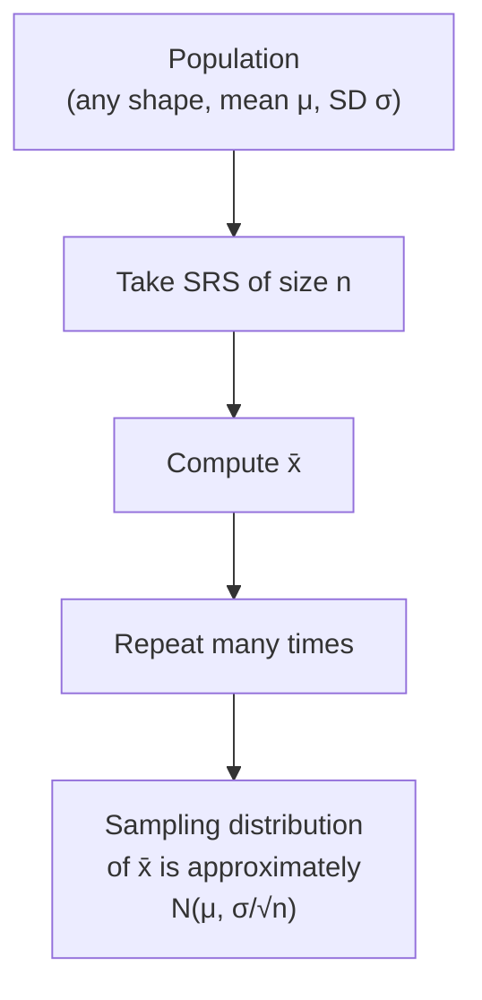

## Central Limit Theorem

The Central Limit Theorem (CLT) is the single most important theorem in statistics. It is the reason we can use the normal distribution for inference about means, even when the population is not normally distributed.

### Sampling Distribution of $\bar{x}$

When we take a random sample and compute the sample mean $\bar{x}$, that computed value is **one observation** from the sampling distribution of $\bar{x}$. Different samples produce different $\bar{x}$ values.

The sampling distribution of $\bar{x}$ has:

- **Mean:** $\mu_{\bar{x}} = \mu$ (the sample mean is an unbiased estimator of the population mean)
- **Standard deviation:** $\sigma_{\bar{x}} = \frac{\sigma}{\sqrt{n}}$ (called the **standard error**)

### Conditions for the Sampling Distribution

Three conditions must be met for the CLT to apply:

| Condition | What It Means |
|-----------|---------------|
| **Random** | The data come from a random sample or randomized experiment |
| **Independent / 10%** | $n < 0.10N$ — sample size is less than 10% of the population when sampling without replacement |
| **Large counts / Normal** | Either the population is Normal **or** $n \geq 30$ (CLT) |

### The Central Limit Theorem (Statement)

Let $\bar{x}$ be the sample mean from an SRS of size $n$ drawn from a population with mean $\mu$ and finite standard deviation $\sigma$. Then, as $n \to \infty$, the sampling distribution of $\bar{x}$ approaches the normal distribution:

$$
\bar{x} \sim N\left(\mu, \frac{\sigma}{\sqrt{n}}\right)
$$

In words: **Regardless of the shape of the population distribution, the sampling distribution of $\bar{x}$ becomes approximately normal when the sample size is large enough.**

### When Is $n$ "Large Enough"?

The rule of thumb depends on the shape of the population:

| Population Shape | Minimum $n$ for Normality |
|-----------------|---------------------------|
| Normal | Any $n$ works (sampling distribution is exactly normal) |
| Approximately symmetric | $n \geq 15$ is usually sufficient |
| Skewed | $n \geq 30$ |
| Heavily skewed or outliers | $n \geq 30$, but larger may be needed |

The standard AP threshold is **$n \geq 30$**, but always consider the context. For a strongly skewed distribution, even $n = 30$ may not be enough — check with a graph of the sample data.

> [!tip] The CLT Does Not Apply to Individuals
> The CLT describes the distribution of the **sample mean**, not the distribution of individual observations. Individual observations follow the population distribution. The sample mean follows an approximately normal distribution when $n$ is large.

### Two Cases: Population Normal vs. Population Not Normal

#### Case 1: Population Is Normal

If the population itself is normally distributed ($X \sim N(\mu, \sigma)$), then the sampling distribution of $\bar{x}$ is **exactly** normal for any sample size:

$$
\bar{x} \sim N\left(\mu, \frac{\sigma}{\sqrt{n}}\right) \quad \text{exactly, for all } n
$$

No approximation is needed. This holds regardless of how small $n$ is.

#### Case 2: Population Is NOT Normal

If the population is not normal, the CLT guarantees that $\bar{x}$ is **approximately** normal when $n$ is large enough (typically $n \geq 30$):

$$
\bar{x} \stackrel{\text{approx}}{\sim} N\left(\mu, \frac{\sigma}{\sqrt{n}}\right) \quad \text{when } n \geq 30
$$

### Standardizing $\bar{x}$ to a $z$-Score

Once we know (or assume) that the sampling distribution is approximately normal, we can compute $z$-scores and probabilities using:

$$
z = \frac{\bar{x} - \mu}{\sigma / \sqrt{n}}
$$

This is the key to all one-sample mean inference: confidence intervals and significance tests for $\mu$ both depend on the CLT.

### What the CLT Enables

Without the CLT, every population shape would require its own unique inference procedure. With the CLT, one framework — the normal distribution — handles essentially all inference about means. This is the insight that made modern statistics possible.

> [!danger] Common Misconceptions
> - The CLT does **not** say that the *population* becomes normal with a large sample
> - The CLT does **not** say that a large sample guarantees a *representative* sample (you still need random sampling)
> - The CLT does **not** work for the median or other statistics (it applies to the **mean**, though similar theorems exist for other statistics)

### Summary Table

| Quantity | Notation | Formula |
|----------|----------|---------|
| Mean of sampling distribution | $\mu_{\bar{x}}$ | $\mu$ |
| Standard deviation (standard error) | $\sigma_{\bar{x}}$ | $\dfrac{\sigma}{\sqrt{n}}$ |
| $z$-score for $\bar{x}$ | $z$ | $\dfrac{\bar{x} - \mu}{\sigma / \sqrt{n}}$ |

---
Related: [[Unit_5_Sampling_Distributions]] | [[Sampling_Distribution_Means]] | [[AP_Statistics_MOC]]
