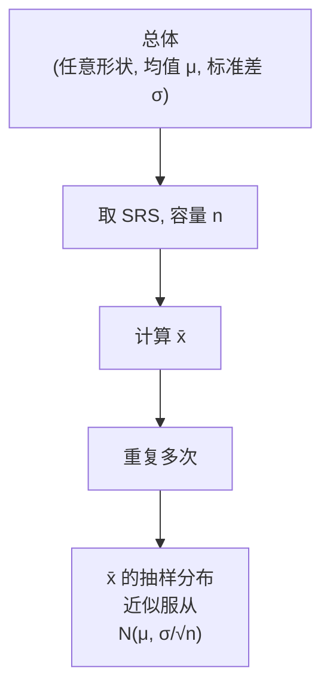

# 中心极限定理

中心极限定理（CLT）是统计学中最重要的定理。它使我们能在总体不正态的情况下，仍使用正态分布进行关于均值的推断。

### $\bar{x}$ 的抽样分布

当我们取一个随机样本并计算样本均值 $\bar{x}$ 时，这个计算值就是 $\bar{x}$ 的抽样分布的一个**观测值**。不同样本产生不同的 $\bar{x}$ 值。

$\bar{x}$ 的抽样分布具有：

- **均值：** $\mu_{\bar{x}} = \mu$（样本均值是总体均值的无偏估计量）
- **标准差：** $\sigma_{\bar{x}} = \frac{\sigma}{\sqrt{n}}$（称为**标准误**）

### 抽样分布的条件

CLT 适用需要满足三个条件：

| 条件 | 含义 |
|-----------|---------------|
| **随机** | 数据来自随机样本或随机化实验 |
| **独立 / 10%** | $n < 0.10N$——不放回抽样时，样本容量小于总体的 10% |
| **大样本 / 正态** | 总体是正态分布 **或** $n \geq 30$（CLT） |

### 中心极限定理（陈述）

设 $\bar{x}$ 为来自均值为 $\mu$、有限标准差为 $\sigma$ 的总体的 SRS 的样本均值，样本容量为 $n$。则当 $n \to \infty$ 时，$\bar{x}$ 的抽样分布趋近正态分布：

$$
\bar{x} \sim N\left(\mu, \frac{\sigma}{\sqrt{n}}\right)
$$

换言之：**无论总体分布的形状如何，$\bar{x}$ 的抽样分布都会在样本容量足够大时近似正态。**

```mermaid
flowchart TD
    A["总体<br/>(任意形状, 均值 μ, 标准差 σ)"] --> B["取 SRS, 容量 n"]
    B --> C["计算 x̄"]
    C --> D["重复多次"]
    D --> E["x̄ 的抽样分布<br/>近似服从<br/>N(μ, σ/√n)"]
```

### $n$ 多大才算"足够大"？

经验法则取决于总体形状：

| 总体形状 | 正态所需的最小 $n$ |
|-----------------|---------------------------|
| 正态 | 任意 $n$ 都行（抽样分布精确正态） |
| 大致对称 | $n \geq 15$ 通常足够 |
| 偏斜 | $n \geq 30$ |
| 严重偏斜或有离群值 | $n \geq 30$，但可能需要更大 |

AP 标准阈值是 **$n \geq 30$**，但始终要结合情境判断。对强偏态分布，即使 $n = 30$ 也可能不够——用样本数据的图形检查。

> [!tip] CLT 不适用于个体
> CLT 描述的是**样本均值**的分布，不是个体观测值的分布。个体观测值遵循总体分布。样本均值在 $n$ 足够大时近似正态。

### 两种情形：总体正态 vs 总体不正态

#### 情形 1：总体正态

如果总体本身正态分布（$X \sim N(\mu, \sigma)$），则 $\bar{x}$ 的抽样分布对任意样本容量都**精确**正态：

$$
\bar{x} \sim N\left(\mu, \frac{\sigma}{\sqrt{n}}\right) \quad \text{精确成立，对所有 } n
$$

不需要近似。无论 $n$ 多小都成立。

#### 情形 2：总体不正态

如果总体不正态，CLT 保证当 $n$ 足够大（通常 $n \geq 30$）时，$\bar{x}$ **近似**正态：

$$
\bar{x} \stackrel{\text{近似}}{\sim} N\left(\mu, \frac{\sigma}{\sqrt{n}}\right) \quad \text{当 } n \geq 30
$$

### 将 $\bar{x}$ 标准化为 $z$ 分数

一旦知道（或假设）抽样分布近似正态，就可以用下式计算 $z$ 分数和概率：

$$
z = \frac{\bar{x} - \mu}{\sigma / \sqrt{n}}
$$

这是所有单样本均值推断的关键：$\mu$ 的置信区间和显著性检验都依赖 CLT。

### CLT 带来的可能性

没有 CLT，每种总体形状都需要自己的推断方法。有了 CLT，一个框架——正态分布——就能处理几乎所有关于均值的推断。正是这一洞见使现代统计学成为可能。

> [!danger] 常见误解
> - CLT 并**不**是说大样本会使*总体*变正态
> - CLT 并**不**说大样本保证样本有*代表性*（你仍然需要随机抽样）
> - CLT 不适用于中位数或其他统计量（它适用于**均值**，尽管其他统计量也有类似定理）

### 汇总表

| 量 | 符号 | 公式 |
|----------|----------|---------|
| 抽样分布的均值 | $\mu_{\bar{x}}$ | $\mu$ |
| 标准差（标准误） | $\sigma_{\bar{x}}$ | $\dfrac{\sigma}{\sqrt{n}}$ |
| $\bar{x}$ 的 $z$ 分数 | $z$ | $\dfrac{\bar{x} - \mu}{\sigma / \sqrt{n}}$ |

---
相关笔记：[[Unit_5_Sampling_Distributions]] | [[Sampling_Distribution_Means]] | [[AP_Statistics_MOC]]