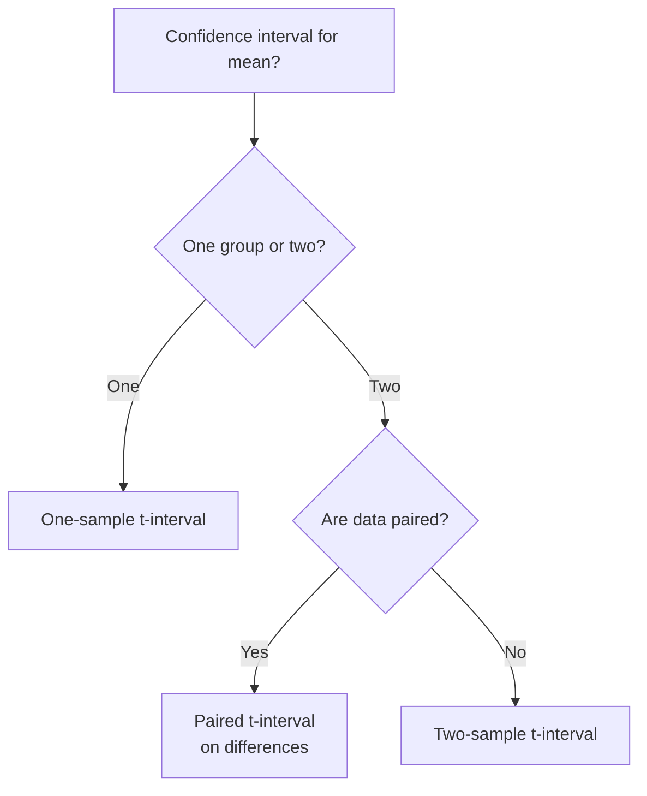

## Overview

A confidence interval for a population mean $\mu$ gives a range of plausible values based on sample data. When $\sigma$ is unknown (the usual case), we use the **t-interval** rather than the z-interval.

---

## One-Sample t-Interval

### Formula

$$ \bar{x} \pm t^*_{n-1} \cdot \frac{s}{\sqrt{n}} $$

- $\bar{x}$: sample mean
- $s$: sample standard deviation
- $n$: sample size
- $t^*_{n-1}$: critical value from t-distribution with $n-1$ df, capturing central $C\%$ of the distribution

### Conditions

1. **Random** — Data from a random sample or randomized experiment.
2. **Independence / 10%** — $n < 0.10N$ (population at least 10× sample size).
3. **Nearly Normal** — Either the population is Normal, $n \ge 30$ (CLT), or a graph shows no strong skew/outliers.

### Interpreting the Interval

> "We are $C\%$ confident that the true population mean $\mu$ is between $\_\_$ and $\_\_$."

The confidence is in the **method**: if we repeated the sampling procedure many times, $C\%$ of the resulting intervals would capture $\mu$.

### Example

A random sample of 25 students has $\bar{x} = 82.4$, $s = 8.2$. For a 95% CI with df = 24, $t^* \approx 2.064$.

$$ 82.4 \pm 2.064 \cdot \frac{8.2}{\sqrt{25}} = 82.4 \pm 3.38 = (79.02,\ 85.78) $$

**Interpretation:** We are 95% confident that the true mean score is between 79.02 and 85.78.

---

## Two-Sample t-Interval

### Formula

$$ (\bar{x}_1 - \bar{x}_2) \pm t^*_{\text{df}} \sqrt{\frac{s_1^2}{n_1} + \frac{s_2^2}{n_2}} $$

- Estimates $\mu_1 - \mu_2$, the difference between two population means
- **Never pool** the variances — the AP exam uses the unpooled (Welch's) approach

### Degrees of Freedom

Use the conservative **minimum** of $n_1 - 1$ and $n_2 - 1$, or the Welch–Satterthwaite formula (AP formula sheet provides the conservative df):

$$ \text{df} = \min(n_1 - 1,\ n_2 - 1) $$

### Additional Condition

**Independent groups** — The two samples are independent of each other (not paired, not matched). See [[Matched_Pairs_T_Test]] for dependent samples.

### Example

| Group | $n$ | $\bar{x}$ | $s$ |
|-------|-----|-----------|-----|
| Treatment | 20 | 74.3 | 10.1 |
| Control | 22 | 68.9 | 9.8 |

df = $\min(19, 21) = 19$, $t^*_{19} \approx 2.093$ for 95% CI.

$$ (74.3 - 68.9) \pm 2.093 \cdot \sqrt{\frac{10.1^2}{20} + \frac{9.8^2}{22}} $$
$$ = 5.4 \pm 2.093 \cdot 3.08 = 5.4 \pm 6.44 = (-1.04,\ 11.84) $$

Since 0 is in the interval, the difference is not statistically significant at $\alpha = 0.05$.

---

## Choosing the Correct Interval

---

## Common Mistakes

| Mistake | Why it's wrong |
|---------|----------------|
| Using $z$ when $\sigma$ unknown | $z$-interval is too narrow; nominal confidence level not achieved |
| Pooling variances | Assumes equal $\sigma$ — not required or tested in AP |
| Interpreting as probability of $\mu$ | $\mu$ is fixed, not random; the interval captures it or doesn't |
| Checking 10% condition on the sample | 10% condition applies to sampling from a finite population |
| Using $n$ instead of $n-1$ for df | We estimate $\mu$ with $\bar{x}$, losing 1 degree of freedom; df = $n-1$ remains for estimating $\sigma$ |

---

## Sample Size for a Desired Margin of Error

When planning a study, solve for $n$:

$$ \text{ME} = t^* \cdot \frac{s}{\sqrt{n}} \quad\Rightarrow\quad n = \left( \frac{t^* \cdot s}{\text{ME}} \right)^2 $$

Use $z^*$ as an approximation for $t^*$ when $n$ is unknown (since $t^*$ depends on $n$). Use a pilot study's $s$ or a conservative estimate.

See also: [[Unit_7_Inference_for_Means]], [[AP_Statistics_MOC]]
