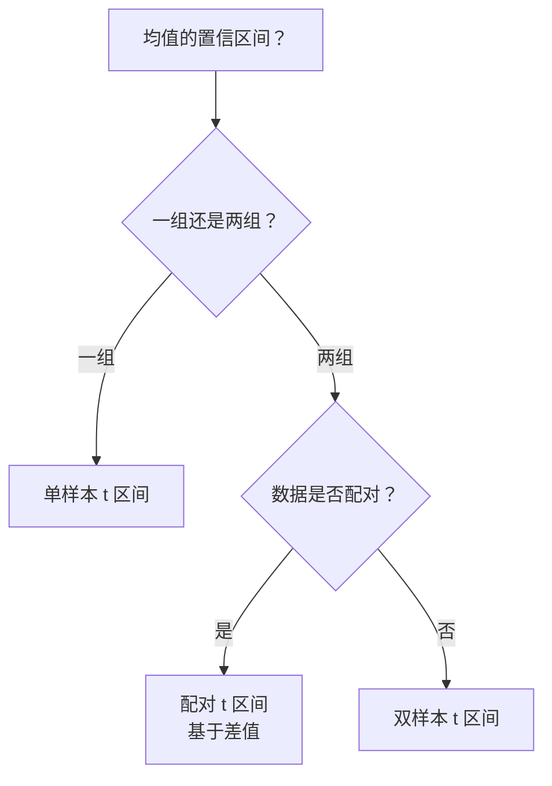

# 均值的置信区间

**所属：** [[Unit_7_Inference_for_Means|单元 7 — 均值的推断]]

## 概述

总体均值 $\mu$ 的置信区间基于样本数据给出一个合理取值区间。当 $\sigma$ 未知时（通常情况），我们用 **t 区间**而非 z 区间。

## 单样本 t 区间

### 公式

$$ \bar{x} \pm t^*_{n-1} \cdot \frac{s}{\sqrt{n}} $$

- $\bar{x}$：样本均值
- $s$：样本标准差
- $n$：样本容量
- $t^*_{n-1}$：自由度为 $n-1$ 的 t 分布临界值，捕获中心 $C\%$ 的区域

### 条件

1. **随机**——数据来自随机样本或随机化实验。
2. **独立/10%**——$n < 0.10N$（总体至少为样本容量的 10 倍）。
3. **近似正态**——总体正态，或 $n \ge 30$（CLT），或图形显示无强偏斜/离群值。

### 解释区间

> "我们有 $C\%$ 的把握认为总体均值 $\mu$ 的真实值在 $\_\_$ 和 $\_\_$ 之间。"

把握在于**方法**：如果重复抽样过程多次，$C\%$ 的区间会捕获 $\mu$。

### 示例

随机抽取 25 名学生，$\bar{x} = 82.4$，$s = 8.2$。95% CI，df = 24，$t^* \approx 2.064$。

$$ 82.4 \pm 2.064 \cdot \frac{8.2}{\sqrt{25}} = 82.4 \pm 3.38 = (79.02,\ 85.78) $$

**解释：** 我们有 95% 的把握认为真实均值分数在 79.02 到 85.78 之间。

## 双样本 t 区间

### 公式

$$ (\bar{x}_1 - \bar{x}_2) \pm t^*_{\text{df}} \sqrt{\frac{s_1^2}{n_1} + \frac{s_2^2}{n_2}} $$

- 估计 $\mu_1 - \mu_2$，两个总体均值之差
- **绝不合并**方差——AP 考试使用非合并（Welch）方法

### 自由度

使用保守的 $n_1 - 1$ 和 $n_2 - 1$ 中的**最小值**，或 Welch-Satterthwaite 公式（AP 公式表提供保守 df）：

$$ \text{df} = \min(n_1 - 1,\ n_2 - 1) $$

### 额外条件

**独立组**——两个样本相互独立（不是配对，不是匹配）。关于依赖样本，见 [[Matched_Pairs_T_Test]]。

### 示例

| 组 | $n$ | $\bar{x}$ | $s$ |
|-------|-----|-----------|-----|
| 处理组 | 20 | 74.3 | 10.1 |
| 对照组 | 22 | 68.9 | 9.8 |

df = $\min(19, 21) = 19$，95% CI 的 $t^*_{19} \approx 2.093$。

$$ (74.3 - 68.9) \pm 2.093 \cdot \sqrt{\frac{10.1^2}{20} + \frac{9.8^2}{22}} $$
$$ = 5.4 \pm 2.093 \cdot 3.08 = 5.4 \pm 6.44 = (-1.04,\ 11.84) $$

由于 0 在区间内，差异在 $\alpha = 0.05$ 下不统计显著。

## 选择正确的区间

```mermaid
flowchart TD
    A[均值的置信区间？] --> B{一组还是两组？}
    B -->|一组| C[单样本 t 区间]
    B -->|两组| D{数据是否配对？}
    D -->|是| E[配对 t 区间<br>基于差值]
    D -->|否| F[双样本 t 区间]
```

## 常见错误

| 错误 | 为什么错 |
|---------|----------------|
| $\sigma$ 未知时用 $z$ | $z$ 区间太窄，名义置信水平达不到 |
| 合并方差 | 假设 $\sigma$ 相等——AP 不要求也不考 |
| 解释为 $\mu$ 的概率 | $\mu$ 固定，不是随机的；区间要么捕获它要么不捕获 |
| 在样本上检查 10% 条件 | 10% 条件适用于从有限总体抽样 |
| 用 $n$ 而非 $n-1$ 作为 df | 我们用 $\bar{x}$ 估计 $\mu$，损失 1 个自由度；df = $n-1$ 仍用于估计 $\sigma$ |

## 目标误差范围的样本量

规划研究时，解 $n$：

$$ \text{ME} = t^* \cdot \frac{s}{\sqrt{n}} \quad\Rightarrow\quad n = \left( \frac{t^* \cdot s}{\text{ME}} \right)^2 $$

$n$ 未知时用 $z^*$ 近似 $t^*$（因为 $t^*$ 依赖 $n$）。用预研的 $s$ 或保守估计。

另见：[[Unit_7_Inference_for_Means]]、[[AP_Statistics_MOC]]