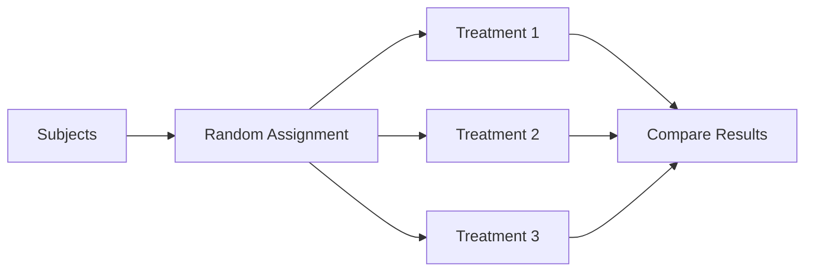
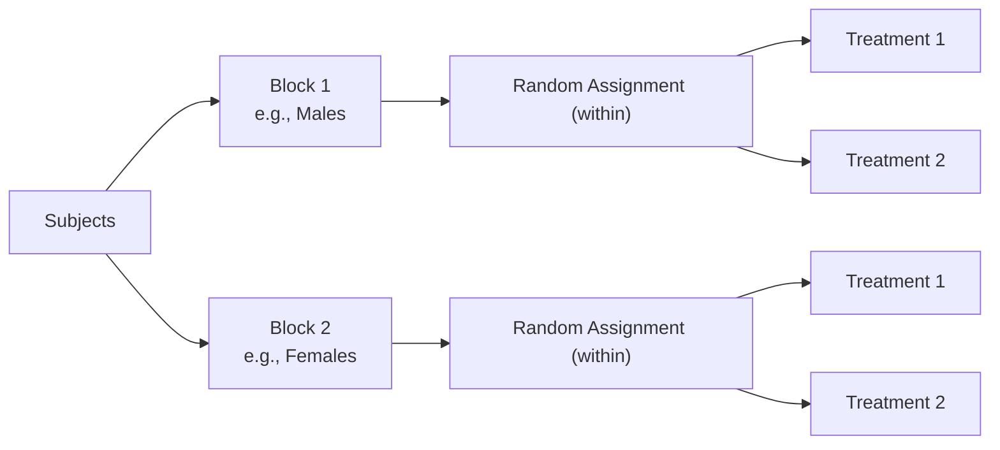

## Experimental Design

An **experiment** imposes a treatment on subjects to observe the response. Unlike an observational study, a well-designed experiment can establish **cause and effect**.

### Core Vocabulary

| Term | Definition |
|------|------------|
| **Explanatory variable** | The variable manipulated by the researcher (the "cause") |
| **Response variable** | The outcome measured (the "effect") |
| **Experimental units** | Individuals on whom the experiment is performed |
| **Subjects** | Experimental units that are human |
| **Treatment** | A specific condition applied to experimental units |
| **Factor** | An explanatory variable in an experiment (may have multiple levels) |

### Lurking vs. Confounding Variables

- **Lurking variable:** A variable not included in the study that affects the relationship between the explanatory and response variables. It is *unmeasured*.
- **Confounding variable:** A variable that is associated with both the explanatory variable and the response variable, making it impossible to separate their effects. Confounding occurs when the explanatory variable is tied to another influence.

> [!example] Classic Confounding
> A study finds that people who drink more coffee have a higher rate of lung cancer. But coffee drinkers are also more likely to smoke. Smoking is a **confounding variable**: it is related to both coffee drinking (the explanatory variable) and lung cancer (the response).

### Principles of Experimental Design

#### 1. Control
Hold constant all variables other than the treatment. Use a **control group** that receives no active treatment or a **placebo**. Controlling for extraneous variables isolates the treatment effect.

#### 2. Randomization
Use chance to assign experimental units to treatment groups. Randomization creates groups that are roughly equal on all variables, known and unknown, before the treatment is applied. This is what **allows causal conclusions**.

#### 3. Replication
Use enough experimental units so that treatment effects can be distinguished from chance variation. Replication means having multiple subjects per treatment group — **not** repeating the whole experiment.

#### 4. Blocking
Group experimental units into **blocks** of similar individuals, then randomize within each block. Blocking reduces variability by accounting for a known source of variation before comparing treatments.

> [!info] Blocking vs. Stratification
> **Blocking** (experiments) and **stratification** (sampling) serve the same purpose: reduce variability by grouping similar units. The difference is *when* they are applied — blocking is for treatment assignment, stratification is for sample selection.

### Common Experimental Designs

#### Completely Randomized Design (CRD)
All experimental units are randomly assigned to treatments with no blocking.

#### Randomized Block Design
Divide subjects into blocks based on a variable thought to affect the response. Within each block, randomly assign subjects to treatments.

#### Matched Pairs Design
A special case of blocking where each block consists of exactly **two** matched individuals, or a single individual who receives both treatments in random order (crossover design). This is extremely effective at reducing variability because the comparison is made within each pair.

### Blinding

- **Single-blind:** Subjects do not know which treatment they receive
- **Double-blind:** Neither subjects nor those administering the treatments know

Blinding prevents the **placebo effect** and **experimenter bias**.

> [!danger] AP Exam: Can We Conclude Causation?
> Yes — **only if** (1) treatments were randomly assigned, (2) the study was an experiment with a control/comparison group, and (3) replication was adequate. Without *all three*, causation cannot be established.

### Scope of Inference

| Random Assignment? | Random Sampling? | Conclusion |
|---|---|---|
| Yes | Yes | Cause-and-effect for the population |
| Yes | No | Cause-and-effect (limited to subjects) |
| No | Yes | Association (generalizable to population) |
| No | No | Association only; no generalization |

---
Related: [[Unit_3_Collecting_Data]] | [[Sampling_Methods]] | [[AP_Statistics_MOC]]
