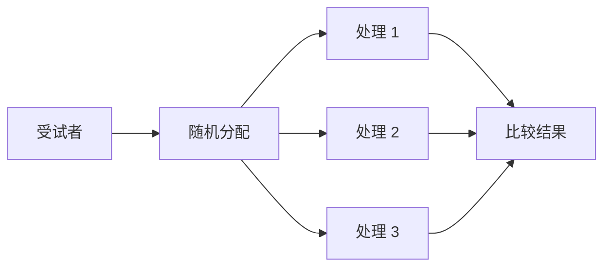
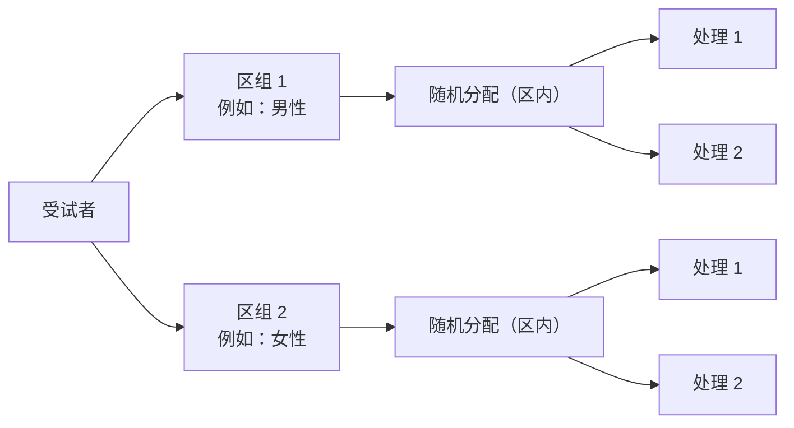

# 实验设计

**实验**对受试者施加处理以观察响应。与观察性研究不同，设计良好的实验能建立**因果关系**。

### 核心词汇

| 术语 | 定义 |
|------|------------|
| **解释变量** | 研究者操纵的变量（"因"） |
| **响应变量** | 测量的结果（"果"） |
| **实验单元** | 接受实验的个体 |
| **受试者（Subjects）** | 人类实验单元 |
| **处理（Treatment）** | 施加给实验单元的特定条件 |
| **因素（Factor）** | 实验中的解释变量（可有多个水平） |

### 潜伏变量 vs 混杂变量

- **潜伏变量：** 未纳入研究但影响解释变量与响应变量关系的变量。它是*未被测量*的。
- **混杂变量：** 与解释变量和响应变量都相关的变量，使两者效应无法分离。当解释变量与另一个影响捆绑在一起时，混杂就发生。

> [!example] 经典混杂
> 一项研究发现喝咖啡多的人肺癌发病率更高。但喝咖啡的人也更可能吸烟。吸烟是**混杂变量**：它与喝咖啡（解释变量）和肺癌（响应变量）都相关。

### 实验设计原则

#### 1. 控制（Control）
保持除处理外的所有变量恒定。设置接受无活性处理或**安慰剂**的**对照组**。控制无关变量以隔离处理效应。

#### 2. 随机化（Randomization）
用随机手段把实验单元分配到处理组。随机化使各处理组在施加处理前，在所有已知和未知变量上大致相等。这正是**允许因果结论**的原因。

#### 3. 重复（Replication）
使用足够多的实验单元，使处理效应能与随机变异区分开来。重复指每个处理组有多个受试者——**不是**重复整个实验。

#### 4. 区组化（Blocking）
把实验单元分成由相似个体组成的**区组**，再在每个区组内随机化。区组化通过先考虑已知变异来源来减少变异。

> [!info] 区组化 vs 分层
> **区组化**（实验）和**分层**（抽样）目的相同：通过分组相似单元减少变异。区别在于*何时*应用——区组化用于处理分配，分层用于样本选择。

### 常见实验设计

#### 完全随机设计（CRD）
所有实验单元不分区组，直接随机分配到处理组。

```mermaid
flowchart LR
    A[受试者] --> B[随机分配]
    B --> C[处理 1]
    B --> D[处理 2]
    B --> E[处理 3]
    C --> F[比较结果]
    D --> F
    E --> F
```

#### 随机区组设计
根据被认为影响响应的变量把受试者分成区组。在每个区组内，随机分配受试者到处理组。

```mermaid
flowchart LR
    A[受试者] --> B[区组 1<br/>例如：男性]
    A --> C[区组 2<br/>例如：女性]
    B --> D["随机分配（区内）"]
    C --> E["随机分配（区内）"]
    D --> F[处理 1]
    D --> G[处理 2]
    E --> H[处理 1]
    E --> I[处理 2]
```

#### 配对设计（Matched Pairs）
区组化的特例：每个区组恰好包含**两个**匹配的个体，或一个按随机顺序接受两种处理的个体（交叉设计）。由于在同一对内部比较，它在减少变异方面极其有效。

### 盲法（Blinding）

- **单盲：** 受试者不知道接受哪种处理。
- **双盲：** 受试者和施测者都不知道。

盲法防止**安慰剂效应**和**实验者偏倚**。

> [!danger] AP 考试：能下因果结论吗？
> 能——**仅当** (1) 处理被随机分配，(2) 研究是有对照/比较组的实验，(3) 重复充分。缺少*任何一条*，都不能建立因果关系。

### 推断范围

| 随机分配？ | 随机抽样？ | 结论 |
|---|---|---|
| 是 | 是 | 针对总体的因果关系 |
| 是 | 否 | 因果关系（限于受试者） |
| 否 | 是 | 关联（可推广到总体） |
| 否 | 否 | 仅关联；不可推广 |

---
相关笔记：[[Unit_3_Collecting_Data]] | [[Sampling_Methods]] | [[AP_Statistics_MOC]]